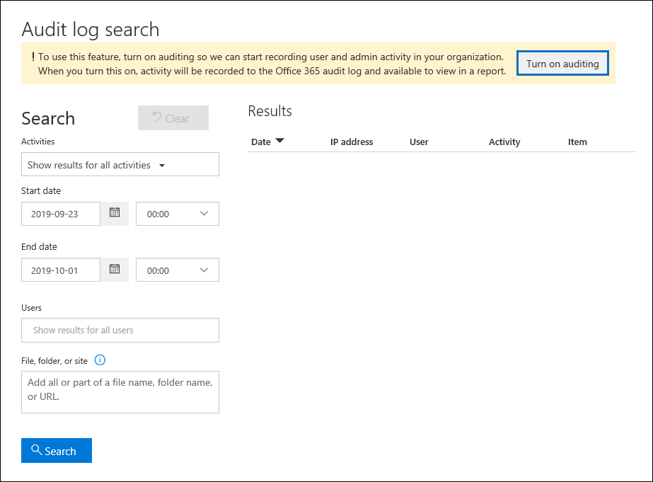

# <a name="turn-audit-log-search-on-or-off"></a>Aktivieren oder Deaktivieren der Überwachungsprotokollsuche

Die Überwachungsprotokollierung ist für Microsoft 365- und Office 365 Enterprise-Organisationen standardmäßig aktiviert. Das schließt Organisationen mit E3/G3- oder E5/G5-Abonnements ein. Wenn die Überwachungsprotokollsuche im Compliance Center aktiviert ist, werden Benutzer- und Administratoraktivitäten aus Ihrer Organisation im Überwachungsprotokoll aufgezeichnet und für 90 Tage und je nach der den Benutzern zugewiesenen Lizenz bis zu einem Jahr aufbewahrt. Ihre Organisation hat jedoch möglicherweise Gründe, die Überwachungsprotokolldaten nicht aufzeichnen und beibehalten zu möchten. In diesen Fällen kann ein globaler Administrator die Überwachung in Microsoft 365 deaktivieren.

> [!IMPORTANT]
> Wenn Sie die Überwachungsprotokollsuche in Microsoft 365 deaktivieren, können Sie die Office 365-Verwaltungsaktivitäts-API oder Azure Sentinel nicht verwenden, um auf Überwachungsdaten für Ihre Organisation zu zugreifen. Wenn Sie die Überwachungsprotokollsuche deaktivieren, indem Sie die Schritte in diesem Artikel ausführen, werden keine Ergebnisse zurückgegeben, wenn Sie das Überwachungsprotokoll mithilfe des Security & Compliance Center durchsuchen oder das **Cmdlet Search-UnifiedAuditLog** in Exchange Online PowerShell ausführen. Dies bedeutet auch, dass Überwachungsprotokolle nicht über die Office 365-Verwaltungsaktivitäts-API oder Azure Sentinel verfügbar sind.
  
## <a name="before-you-turn-audit-log-search-on-or-off"></a>Vor dem Aktivieren oder Deaktivieren der Überwachungsprotokollsuche

- Ihnen muss die Rolle Überwachungsprotokolle in Exchange Online zugewiesen werden, um die Überwachungsprotokollsuche in Ihrer Microsoft 365-Organisation ein- oder auszuschalten. Diese Rolle wird standardmäßig den Rollengruppen Complianceverwaltung und Organisationsverwaltung auf der Seite **Berechtigungen** im Exchange Admin Center zugewiesen. Globale Administratoren in Microsoft 365 sind Mitglieder der Rollengruppe Organisationsverwaltung in Exchange Online. 
    
    > [!NOTE]
    > Benutzern müssen berechtigungen in Exchange Online zugewiesen werden, um die Überwachungsprotokollsuche ein- oder auszuschalten. Wenn Sie Benutzern die Rolle  Überwachungsprotokolle auf der Seite Berechtigungen im Security & Compliance Center zuweisen, können sie die Überwachungsprotokollsuche nicht aktivieren oder deaktivieren. Dies liegt daran, dass das zugrunde liegende Cmdlet ein Exchange Online PowerShell-Cmdlet ist. 
    
- Schrittweise Anweisungen zum Durchsuchen des Überwachungsprotokolls finden Sie unter Durchsuchen des Überwachungsprotokolls im [Security & Compliance Center](search-the-audit-log-in-security-and-compliance.md). Weitere Informationen zur Microsoft 365-Verwaltungsaktivitäts-API finden Sie unter [Erste Schritte mit Microsoft 365-Verwaltungs-APIs](/office/office-365-management-api/get-started-with-office-365-management-apis).

- Zur Überprüfung, dass die Überwachungsprotokollsuche aktiviert ist, können Sie den folgenden Befehl in der Exchange Online-PowerShell ausführen:

    ```powershell
    Get-AdminAuditLogConfig | FL UnifiedAuditLogIngestionEnabled
    ```

    Der Wert  `True` der  _UnifiedAuditLogIngestionEnabled-Eigenschaft_ gibt an, dass die Überwachungsprotokollsuche aktiviert ist. 
    
## <a name="turn-on-audit-log-search"></a>Aktivieren der Überwachungsprotokollsuche

Wenn die Überwachungsprotokollsuche für Ihre Organisation nicht aktiviert ist, können Sie sie im Compliance Center oder mithilfe von Exchange Online PowerShell aktivieren. Es kann mehrere Stunden dauern, bis Sie die Überwachungsprotokollsuche aktivieren, bevor Sie ergebnisse zurückgeben können, wenn Sie das Überwachungsprotokoll durchsuchen.
  
### <a name="use-the-compliance-center-to-turn-on-audit-log-search"></a>Aktivieren der Überwachungsprotokollsuche mithilfe des Compliance Centers

1. [Wechseln Sie zum Compliance Center,](https://protection.office.com) und melden Sie sich an.

2. Wechseln Sie im Compliance Center zu **Suche**  >  **nach Überwachungsprotokollsuche**.

   Wenn die Überwachungsprotokollsuche für Ihre Organisation nicht aktiviert ist, wird ein Banner mit der Meldung angezeigt, dass die Überwachung aktiviert werden muss, um Benutzer- und Administratoraktivitäten zu aufzeichnen.

3. Klicken **Sie auf Überwachung aktivieren.**

    
  
    Das Banner wird aktualisiert, um zu sagen, dass das Überwachungsprotokoll vorbereitet wird und Sie nach Benutzer- und Administratoraktivitäten in ein paar Stunden suchen können.

### <a name="use-powershell-to-turn-on-audit-log-search"></a>Aktivieren der Überwachungsprotokollsuche mithilfe von PowerShell

1. [Herstellen einer Verbindung mit Exchange Online PowerShell](/powershell/exchange/connect-to-exchange-online-powershell)

2. Führen Sie den folgenden PowerShell-Befehl aus, um die Überwachungsprotokollsuche in Office 365 zu aktivieren.

    ```powershell
    Set-AdminAuditLogConfig -UnifiedAuditLogIngestionEnabled $true
    ```

    Es wird eine Meldung angezeigt, dass es bis zu 60 Minuten dauern kann, bis die Änderung wirksam wird.
  
## <a name="turn-off-audit-log-search"></a>Deaktivieren der Überwachungsprotokollsuche

Sie müssen Exchange Online PowerShell verwenden, um die Überwachungsprotokollsuche zu deaktivieren.
  
1. [Herstellen einer Verbindung mit Exchange Online PowerShell](/powershell/exchange/connect-to-exchange-online-powershell)

2. Führen Sie den folgenden PowerShell-Befehl aus, um die Überwachungsprotokollsuche zu deaktivieren.

    ```powershell
    Set-AdminAuditLogConfig -UnifiedAuditLogIngestionEnabled $false
    ```

3. Überprüfen Sie nach einer Weile, ob die Überwachungsprotokollsuche deaktiviert (deaktiviert) ist. Sie können auf zwei Arten vorgehen:

    - Führen Sie in Exchange Online PowerShell den folgenden Befehl aus:

      ```powershell
      Get-AdminAuditLogConfig | FL UnifiedAuditLogIngestionEnabled
      ```

      Der Wert  `False` der  _UnifiedAuditLogIngestionEnabled-Eigenschaft_ gibt an, dass die Überwachungsprotokollsuche deaktiviert ist. 

    - Wechseln Sie [im Compliance Center](https://protection.office.com)zu Suche **nach** \> **Überwachungsprotokollsuche**.

      Es wird ein Banner mit der Meldung angezeigt, dass die Überwachung aktiviert werden muss, um Benutzer- und Administratoraktivitäten aufzeichnen zu können.