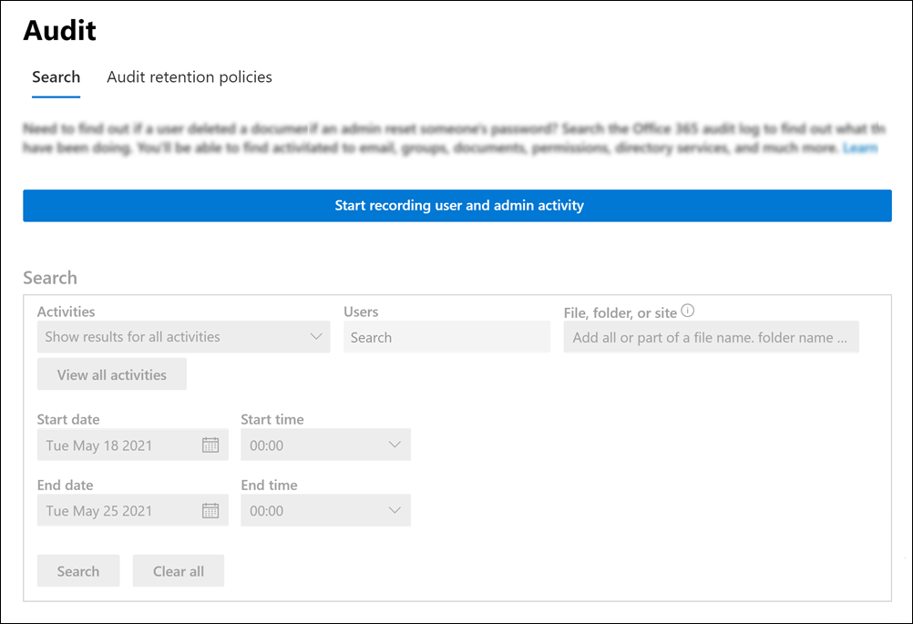

# <a name="turn-auditing-on-or-off"></a><span data-ttu-id="74765-103">Aktivieren oder Deaktivieren der Überwachung</span><span class="sxs-lookup"><span data-stu-id="74765-103">Turn auditing on or off</span></span>

<span data-ttu-id="74765-104">Die Überwachungsprotokollierung ist für Microsoft 365- und Office 365 Enterprise-Organisationen standardmäßig aktiviert.</span><span class="sxs-lookup"><span data-stu-id="74765-104">Audit logging is turned on by default for Microsoft 365 and Office 365 enterprise organizations.</span></span> <span data-ttu-id="74765-105">Wenn die Überwachung in der Microsoft 365 Compliance Center aktiviert ist, werden die Aktivitäten von Benutzern und Administratoren aus Ihrer Organisation im Überwachungsprotokoll aufgezeichnet und 90 Tage lang und bis zu einem Jahr aufbewahrt, je nach der Den Benutzern zugewiesenen Lizenz.</span><span class="sxs-lookup"><span data-stu-id="74765-105">When auditing in the Microsoft 365 compliance center is turned on, user and admin activity from your organization is recorded in the audit log and retained for 90 days, and up to one year depending on the license assigned to users.</span></span> <span data-ttu-id="74765-106">Möglicherweise hat Ihre Organisation jedoch Gründe dafür, dass Überwachungsprotokolldaten nicht aufgezeichnet und aufbewahrt werden sollen.</span><span class="sxs-lookup"><span data-stu-id="74765-106">However, your organization may have reasons for not wanting to record and retain audit log data.</span></span> <span data-ttu-id="74765-107">In diesen Fällen kann ein globaler Administrator die Überwachung in Microsoft 365 deaktivieren.</span><span class="sxs-lookup"><span data-stu-id="74765-107">In those cases, a global admin may decide to turn off auditing in Microsoft 365.</span></span>

<span data-ttu-id="74765-108">Beim Einrichten einer neuen Microsoft 365 oder Office 365 Organisation können Sie den Überwachungsstatus für Ihre Organisation überprüfen.</span><span class="sxs-lookup"><span data-stu-id="74765-108">When setting up a new Microsoft 365 or Office 365 organization, you can verify the auditing status for your organization.</span></span> <span data-ttu-id="74765-109">Anweisungen finden Sie im Abschnitt ["Überprüfen des Überwachungsstatus für Ihre Organisation"](#verify-the-auditing-status-for-your-organization) in diesem Artikel.</span><span class="sxs-lookup"><span data-stu-id="74765-109">For instructions, see the [Verify the auditing status for your organization](#verify-the-auditing-status-for-your-organization) section in this article.</span></span>

> [!IMPORTANT]
> <span data-ttu-id="74765-110">Wenn Sie die Überwachung in Microsoft 365 deaktivieren, können Sie die Office 365-Verwaltungsaktivitäts-API oder Azure Sentinel nicht für den Zugriff auf Überwachungsdaten für Ihre Organisation verwenden.</span><span class="sxs-lookup"><span data-stu-id="74765-110">If you turn off auditing in Microsoft 365, you can't use the Office 365 Management Activity API or Azure Sentinel to access auditing data for your organization.</span></span> <span data-ttu-id="74765-111">Wenn Sie die Überwachung deaktivieren, indem Sie die Schritte in diesem Artikel ausführen, werden beim Durchsuchen des Überwachungsprotokolls mithilfe des Microsoft 365 Compliance Center oder beim Ausführen des Cmdlets **Search-UnifiedAuditLog** in Exchange Online PowerShell keine Ergebnisse zurückgegeben.</span><span class="sxs-lookup"><span data-stu-id="74765-111">Turning off auditing by following the steps in this article means that no results will be returned when you search the audit log using the Microsoft 365 compliance center or when you run the **Search-UnifiedAuditLog** cmdlet in Exchange Online PowerShell.</span></span> <span data-ttu-id="74765-112">Dies bedeutet auch, dass Überwachungsprotokolle nicht über die Office 365-Verwaltungsaktivitäts-API oder Azure Sentinel verfügbar sind.</span><span class="sxs-lookup"><span data-stu-id="74765-112">This also means that audit logs won't be available through the Office 365 Management Activity API or Azure Sentinel.</span></span>
  
## <a name="before-you-turn-auditing-on-or-off"></a><span data-ttu-id="74765-113">Vor dem Aktivieren oder Deaktivieren der Überwachung</span><span class="sxs-lookup"><span data-stu-id="74765-113">Before you turn auditing on or off</span></span>

- <span data-ttu-id="74765-114">Ihnen muss die Rolle "Überwachungsprotokolle" in Exchange Online zugewiesen werden, um die Überwachung in Ihrer Microsoft 365 Organisation zu aktivieren oder zu deaktivieren.</span><span class="sxs-lookup"><span data-stu-id="74765-114">You have to be assigned the Audit Logs role in Exchange Online to turn auditing on or off in your Microsoft 365 organization.</span></span> <span data-ttu-id="74765-115">Standardmäßig wird diese Rolle den Rollengruppen "Complianceverwaltung" und "Organisationsverwaltung" auf der Seite **"Berechtigungen"** im Exchange Admin Center zugewiesen.</span><span class="sxs-lookup"><span data-stu-id="74765-115">By default, this role is assigned to the Compliance Management and Organization Management role groups on the **Permissions** page in the Exchange admin center.</span></span> <span data-ttu-id="74765-116">Globale Administratoren in Microsoft 365 sind Mitglieder der Rollengruppe "Organisationsverwaltung" in Exchange Online.</span><span class="sxs-lookup"><span data-stu-id="74765-116">Global admins in Microsoft 365 are members of the Organization Management role group in Exchange Online.</span></span>

    > [!NOTE]
    > <span data-ttu-id="74765-117">Benutzern müssen Berechtigungen in Exchange Online zugewiesen werden, um die Überwachung zu aktivieren oder zu deaktivieren.</span><span class="sxs-lookup"><span data-stu-id="74765-117">Users have to be assigned permissions in Exchange Online to turn auditing on or off.</span></span> <span data-ttu-id="74765-118">Wenn Sie Benutzern die Rolle "Überwachungsprotokolle" auf der Seite **"Berechtigungen"** im Microsoft 365 Compliance Center zuweisen, können sie die Überwachung nicht aktivieren oder deaktivieren.</span><span class="sxs-lookup"><span data-stu-id="74765-118">If you assign users the Audit Logs role on the **Permissions** page in the Microsoft 365 compliance center, they won't be able to turn auditing on or off.</span></span> <span data-ttu-id="74765-119">Dies liegt daran, dass das zugrunde liegende Cmdlet ein Exchange Online PowerShell-Cmdlet ist.</span><span class="sxs-lookup"><span data-stu-id="74765-119">This is because the underlying cmdlet is an Exchange Online PowerShell cmdlet.</span></span>

- <span data-ttu-id="74765-120">Schritt-für-Schritt-Anweisungen zum Durchsuchen des Überwachungsprotokolls finden Sie unter [Durchsuchen des Überwachungsprotokolls.](search-the-audit-log-in-security-and-compliance.md)</span><span class="sxs-lookup"><span data-stu-id="74765-120">For step-by-step instructions on searching the audit log, see [Search the audit log](search-the-audit-log-in-security-and-compliance.md).</span></span> <span data-ttu-id="74765-121">Weitere Informationen zur Microsoft 365-Verwaltungsaktivitäts-API finden Sie unter [Erste Schritte mit Microsoft 365-Verwaltungs-APIs.](/office/office-365-management-api/get-started-with-office-365-management-apis)</span><span class="sxs-lookup"><span data-stu-id="74765-121">For more information about the Microsoft 365 Management Activity API, see [Get started with Microsoft 365 Management APIs](/office/office-365-management-api/get-started-with-office-365-management-apis).</span></span>

## <a name="verify-the-auditing-status-for-your-organization"></a><span data-ttu-id="74765-122">Überprüfen des Überwachungsstatus für Ihre Organisation</span><span class="sxs-lookup"><span data-stu-id="74765-122">Verify the auditing status for your organization</span></span>

<span data-ttu-id="74765-123">Um zu überprüfen, ob die Überwachung für Ihre Organisation aktiviert ist, können Sie den folgenden Befehl in [Exchange Online PowerShell](/powershell/exchange/connect-to-exchange-online-powershell)ausführen:</span><span class="sxs-lookup"><span data-stu-id="74765-123">To verify that auditing is turned on for your organization, you can run the following command in [Exchange Online PowerShell](/powershell/exchange/connect-to-exchange-online-powershell):</span></span>

```powershell
Get-AdminAuditLogConfig | FL UnifiedAuditLogIngestionEnabled
```

<span data-ttu-id="74765-124">Der Wert `True` für die  _UnifiedAuditLogIngestionEnabled-Eigenschaft_ gibt an, dass die Überwachung aktiviert ist.</span><span class="sxs-lookup"><span data-stu-id="74765-124">A value of `True` for the  _UnifiedAuditLogIngestionEnabled_ property indicates that auditing is turned on.</span></span> <span data-ttu-id="74765-125">Ein Wert von `False` gibt an, dass die Überwachung nicht aktiviert ist.</span><span class="sxs-lookup"><span data-stu-id="74765-125">A value of `False` indicates that auditing is not turned on.</span></span>

## <a name="turn-on-auditing"></a><span data-ttu-id="74765-126">Aktivieren der Überwachung</span><span class="sxs-lookup"><span data-stu-id="74765-126">Turn on auditing</span></span>

<span data-ttu-id="74765-127">Wenn die Überwachung für Ihre Organisation nicht aktiviert ist, können Sie sie im Microsoft 365 Compliance Center oder mithilfe Exchange Online PowerShell aktivieren.</span><span class="sxs-lookup"><span data-stu-id="74765-127">If auditing is not turned on for your organization, you can turn it on in the Microsoft 365 compliance center or by using Exchange Online PowerShell.</span></span> <span data-ttu-id="74765-128">Es kann mehrere Stunden dauern, nachdem Sie die Überwachung aktiviert haben, bevor Sie beim Durchsuchen des Überwachungsprotokolls Ergebnisse zurückgeben können.</span><span class="sxs-lookup"><span data-stu-id="74765-128">It may take several hours after you turn on auditing before you can return results when you search the audit log.</span></span>
  
### <a name="use-the-compliance-center-to-turn-on-auditing"></a><span data-ttu-id="74765-129">Verwenden des Compliance Centers zum Aktivieren der Überwachung</span><span class="sxs-lookup"><span data-stu-id="74765-129">Use the compliance center to turn on auditing</span></span>

1. <span data-ttu-id="74765-130">Gehen Sie auf <https://compliance.microsoft.com>, und melden Sie sich an.</span><span class="sxs-lookup"><span data-stu-id="74765-130">Go to <https://compliance.microsoft.com> and sign in.</span></span>

2. <span data-ttu-id="74765-131">Klicken Sie im linken Navigationsbereich des Microsoft 365 Compliance Center auf **"Überwachen".**</span><span class="sxs-lookup"><span data-stu-id="74765-131">In the left navigation pane of the Microsoft 365 compliance center, click **Audit**.</span></span>

   <span data-ttu-id="74765-132">Wenn die Überwachung für Ihre Organisation nicht aktiviert ist, wird ein Banner angezeigt, in dem Sie aufgefordert werden, die Benutzer- und Administratoraktivitäten aufzuzeichnen.</span><span class="sxs-lookup"><span data-stu-id="74765-132">If auditing is not turned on for your organization, a banner is displayed prompting you start recording user and admin activity.</span></span>

   

3. <span data-ttu-id="74765-134">Klicken Sie auf das Banner "Aufzeichnung von **Benutzer- und Administratoraktivitäten starten".**</span><span class="sxs-lookup"><span data-stu-id="74765-134">Click the **Start recording user and admin activity** banner.</span></span>

   <span data-ttu-id="74765-135">Es kann bis zu 60 Minuten dauern, bis die Änderung wirksam wird.</span><span class="sxs-lookup"><span data-stu-id="74765-135">It may take up to 60 minutes for the change to take effect.</span></span>

### <a name="use-powershell-to-turn-on-auditing"></a><span data-ttu-id="74765-136">Verwenden von PowerShell zum Aktivieren der Überwachung</span><span class="sxs-lookup"><span data-stu-id="74765-136">Use PowerShell to turn on auditing</span></span>

1. <span data-ttu-id="74765-137">[Stellen Sie eine Verbindung mit Exchange Online PowerShell her](/powershell/exchange/connect-to-exchange-online-powershell).</span><span class="sxs-lookup"><span data-stu-id="74765-137">[Connect to Exchange Online PowerShell](/powershell/exchange/connect-to-exchange-online-powershell).</span></span>

2. <span data-ttu-id="74765-138">Führen Sie den folgenden PowerShell-Befehl aus, um die Überwachung zu aktivieren.</span><span class="sxs-lookup"><span data-stu-id="74765-138">Run the following PowerShell command to turn on auditing.</span></span>

    ```powershell
    Set-AdminAuditLogConfig -UnifiedAuditLogIngestionEnabled $true
    ```

    <span data-ttu-id="74765-139">Es wird eine Meldung angezeigt, die besagt, dass es bis zu 60 Minuten dauern kann, bis die Änderung wirksam wird.</span><span class="sxs-lookup"><span data-stu-id="74765-139">A message is displayed saying that it may take up to 60 minutes for the change to take effect.</span></span>
  
## <a name="turn-off-auditing"></a><span data-ttu-id="74765-140">Deaktivieren der Überwachung</span><span class="sxs-lookup"><span data-stu-id="74765-140">Turn off auditing</span></span>

<span data-ttu-id="74765-141">Sie müssen Exchange Online PowerShell verwenden, um die Überwachung zu deaktivieren.</span><span class="sxs-lookup"><span data-stu-id="74765-141">You have to use Exchange Online PowerShell to turn off auditing.</span></span>
  
1. <span data-ttu-id="74765-142">[Stellen Sie eine Verbindung mit Exchange Online PowerShell her](/powershell/exchange/connect-to-exchange-online-powershell).</span><span class="sxs-lookup"><span data-stu-id="74765-142">[Connect to Exchange Online PowerShell](/powershell/exchange/connect-to-exchange-online-powershell).</span></span>

2. <span data-ttu-id="74765-143">Führen Sie den folgenden PowerShell-Befehl aus, um die Überwachung zu deaktivieren.</span><span class="sxs-lookup"><span data-stu-id="74765-143">Run the following PowerShell command to turn off auditing.</span></span>

    ```powershell
    Set-AdminAuditLogConfig -UnifiedAuditLogIngestionEnabled $false
    ```

3. <span data-ttu-id="74765-144">Überprüfen Sie nach einer Weile, ob die Überwachung deaktiviert ist.</span><span class="sxs-lookup"><span data-stu-id="74765-144">After a while, verify that auditing is turned off (disabled).</span></span> <span data-ttu-id="74765-145">Sie können auf zwei Arten vorgehen:</span><span class="sxs-lookup"><span data-stu-id="74765-145">There are two ways to do this:</span></span>

    - <span data-ttu-id="74765-146">Führen Sie in Exchange Online PowerShell den folgenden Befehl aus:</span><span class="sxs-lookup"><span data-stu-id="74765-146">In Exchange Online PowerShell, run the following command:</span></span>

      ```powershell
      Get-AdminAuditLogConfig | FL UnifiedAuditLogIngestionEnabled
      ```

      <span data-ttu-id="74765-147">Der Wert  `False` der  _UnifiedAuditLogIngestionEnabled-Eigenschaft_ gibt an, dass die Überwachung deaktiviert ist.</span><span class="sxs-lookup"><span data-stu-id="74765-147">The value of  `False` for the  _UnifiedAuditLogIngestionEnabled_ property indicates that auditing is turned off.</span></span>

    - <span data-ttu-id="74765-148">Wechseln Sie zur **Seite "Überwachung"** im Microsoft 365 Compliance Center.</span><span class="sxs-lookup"><span data-stu-id="74765-148">Go to the **Audit** page in the Microsoft 365 compliance center.</span></span>

      <span data-ttu-id="74765-149">Wenn die Überwachung für Ihre Organisation nicht aktiviert ist, wird ein Banner angezeigt, in dem Sie aufgefordert werden, die Benutzer- und Administratoraktivitäten aufzuzeichnen.</span><span class="sxs-lookup"><span data-stu-id="74765-149">If auditing is not turned on for your organization, a banner is displayed prompting you start recording user and admin activity.</span></span>
