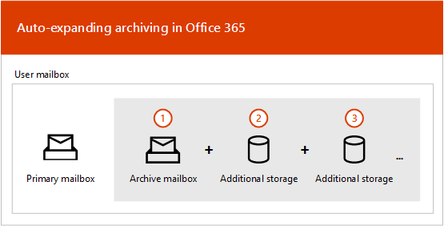
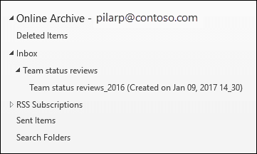

# Übersicht über die unbeschränkte Archivierung

In Office 365 bieten Archivpostfächer Benutzern zusätzlichen Postfachspeicherplatz. Nachdem das Archivpostfach eines Benutzers aktiviert wurde, stehen bis zu 100 GB zusätzlicher Speicher zur Verfügung. In der Vergangenheit mussten Organisationen, als das Speicherkontingent von 100 GB erreicht wurde, Microsoft kontaktieren, um zusätzlichen Speicherplatz für ein Archivpostfach an bitten. Dies ist nicht mehr der Fall.

Die unbegrenzte Archivierungsfunktion in Microsoft 365 (auch als Automatisch *erweiternde* Archivierung bezeichnet) bietet zusätzlichen Speicherplatz in Archivpostfächern. Wenn das Speicherkontingent im Archivpostfach erreicht ist, erhöht Microsoft 365 automatisch die Größe des Archivs, was bedeutet, dass den Benutzern nicht mehr speicherplatz zur Verfügung steht und Administratoren keinen zusätzlichen Speicher für Archivpostfächer anfordern müssen.

Schrittweise Anweisungen zum Aktivieren der automatisch erweiterten Archivierung finden Sie unter ["Unbegrenzte Archivierung aktivieren".](enable-unlimited-archiving.md)

> [!NOTE]
> Die Archivierung mit automatischer Erweiterung unterstützt auch freigegebene Postfächer. Zum Aktivieren des Archivs für ein freigegebenes Postfach ist eine Exchange Online Plan 2- oder eine Exchange Online Plan 1-Lizenz mit Exchange Online-Archivierung erforderlich.

## Funktionsweise der Archivierung mit automatischer Erweiterung

Wie zuvor erläutert, wird zusätzlicher Postfachspeicherplatz erstellt, wenn das Archivpostfach eines Benutzers aktiviert ist. Wenn die Archivierung mit automatischer Erweiterung aktiviert ist, überprüft Microsoft 365 regelmäßig die Größe des Archivpostfachs. Wenn ein Archivpostfach seinen Speichergrenzwert erreicht, erstellt Microsoft 365 automatisch zusätzlichen Speicherplatz für das Archiv. Wenn dem Benutzer dieser zusätzliche Speicherplatz nicht mehr zur Verfügung ist, fügt Microsoft 365 mehr Speicherplatz zum Archiv des Benutzers hinzu. Dieser Vorgang erfolgt automatisch, was bedeutet, dass Administratoren keinen zusätzlichen Archivspeicher anfordern oder die automatisch erweiterte Archivierung verwalten müssen.

Hier finden Sie eine kurze Übersicht über den Prozess.

1. Die Archivierung ist für ein Benutzerpostfach oder ein freigegebenes Postfach aktiviert. Es wird ein Archivpostfach mit 100 GB Speicherplatz erstellt, und das Warnkontingent für das Archivpostfach ist auf 90 GB festgelegt.

2. Ein Administrator aktiviert die automatisch erweiterte Archivierung für das Postfach. Wenn das Archivpostfach (einschließlich des Ordners "Wiederherstellbare Elemente") 90 GB erreicht, wird es in ein automatisch erweitertes Archiv konvertiert, und Microsoft 365 fügt dem Archiv Speicherplatz hinzu. Es kann bis zu 30 Tage dauern, bis der zusätzliche Speicherplatz bereitgestellt wird.

   > [!NOTE]
   > Wenn ein Postfach archiviert oder einer Aufbewahrungsrichtlinie zugewiesen wird, wird das Speicherkontingent für das Archivpostfach auf 110 GB erhöht, wenn die Archivierung mit automatischer Erweiterung aktiviert ist. Entsprechend wird das Kontingent für Archivierungswarnungen auf 100 GB erhöht.

3. Microsoft 365 fügt bei Bedarf automatisch mehr Speicherplatz hinzu.

> [!IMPORTANT]
> Das Archiv mit automatischer Erweiterung wird nur für Postfächer unterstützt, die für einzelne Benutzer (oder freigegebene Postfächer) mit einer Zuwachsrate verwendet werden, die 1 GB pro Tag nicht überschreitet. Das Archivpostfach eines Benutzers ist nur für diesen Benutzer vorgesehen. Die Verwendung von Journaling, Transportregeln oder Regeln für die automatische Weiterleitung zum Kopieren von Nachrichten in ein Archivpostfach ist nicht zulässig. Microsoft behält sich das Recht vor, die unbegrenzte Archivierung in Fällen zu verweigern, in denen das Archivpostfach eines Benutzers zum Speichern von Archivdaten für andere Benutzer oder in anderen Fällen der unangemessenen Verwendung verwendet wird.

## Was wird in den zusätzlichen Archivspeicherplatz verschoben?

Um automatisch erweiterten Archivspeicher effizient zu nutzen, können Ordner verschoben werden. Microsoft 365 bestimmt, welche Ordner verschoben werden, wenn dem Archiv zusätzlicher Speicher hinzugefügt wird. Manchmal werden beim Verschieben eines Ordners automatisch ein oder mehrere Unterordner erstellt, und Elemente aus dem ursprünglichen Ordner werden an diese Ordner verteilt, um das Verschieben zu vereinfachen. Beim Anzeigen des Archivteils der Ordnerliste in Outlook werden diese Unterordner unter dem ursprünglichen Ordner angezeigt.  Die Benennungskonvention, die Microsoft 365 zum Benennen dieser Unterordner verwendet, ist _yyyy (erstellt auf **\<folder name\> mmm dd, yy h_mm)**, wobei:

- **"yyyy"** ist das Jahr, in dem die Nachrichten im Ordner empfangen wurden.

- **mmm dd, yyyy h_m** ist das Datum und die Uhrzeit, zu der der Unterordner von Office 365 im UTC-Format erstellt wurde, basierend auf der Zeitzone und den regionalen Einstellungen des Benutzers in Outlook.

Die folgenden Screenshots zeigen eine Ordnerliste vor und nach dem Verschieben von Nachrichten in ein automatisch erweitertes Archiv.

 **Bevor zusätzlicher Speicher hinzugefügt wird**

 **Nachdem zusätzlicher Speicher hinzugefügt wurde**

> [!NOTE]
> Wie zuvor beschrieben, verschiebt Microsoft 365 Elemente in Unterordner (und benennt sie mithilfe der oben beschriebenen Benennungskonvention), um die Verteilung von Inhalten in ein Hilfsarchiv zu unterstützen. Das Verschieben von Elementen in Unterordner ist jedoch möglicherweise nicht immer der Fall. Manchmal wird ein ganzer Ordner in ein Hilfsarchiv verschoben. In diesem Fall behält der Ordner seinen ursprünglichen Namen bei.  In der Ordnerliste in Outlook wird nicht ersichtlich, dass der Ordner in ein Hilfsarchiv verschoben wurde.

## Outlook-Anforderungen für den Zugriff auf Elemente in einem automatisch erweiterten Archiv

Für den Zugriff auf Nachrichten, die in einem automatisch erweiterten Archiv gespeichert sind, müssen Benutzer einen der folgenden Outlook-Clients verwenden:

- Outlook 2016 oder Outlook 2019 für Windows

- Outlook im Web

- Outlook 2016 oder Outlook 2019 für Mac

Hier sind einige Dinge, die Sie berücksichtigen sollten, wenn Sie Outlook oder Outlook im Web für den Zugriff auf Nachrichten verwenden, die in einem automatisch erweiterten Archiv gespeichert sind.

- Sie können auf einen beliebigen Ordner in Ihrem Archivpostfach zugreifen, einschließlich der Ordner, die in den automatisch erweiterten Speicherbereich verschoben wurden.

- Die Suche nach automatisch erweiterter Archivierung ist in Outlook für das Web verfügbar. Ähnlich wie beim Onlinearchiv können Sie nur dann nach Elementen suchen, die in einen zusätzlichen Speicherbereich verschoben wurden, indem Sie den aktuellen Ordner selbst durchsuchen. Dies bedeutet, dass Sie den Archivordner in der Ordnerliste und dann einen einzelnen Ordner als Suchbereich auswählen müssen. Wenn ein Ordner in einem automatisch erweiterten Speicherbereich Unterordner enthält, müssen Sie die einzelnen Unterordner separat durchsuchen.
- Die automatisch erweiterte Archivsuche ist in Outlook Desktop im aktuellen Kanal (Vorschau) verfügbar. Innerhalb dieser Vorschau ist der Bereich "Aktuelles Postfach" verfügbar, sodass Sie das automatisch erweiterte Archiv durchsuchen können. Weitere Informationen zu diesem und anderen Microsoft Search-Supportfeatures finden Sie unter Wie Outlook für Windows in Verbindung mit [Exchange Online Microsoft Search verwendet.](https://techcommunity.microsoft.com/t5/outlook-global-customer-service/how-outlook-for-windows-connected-to-exchange-online-utilizes/ba-p/1715045) 

- Die Elementanzahl in Outlook und die Anzahl von Lese-/Ungelesenen (in Outlook und Outlook im Web) in einem automatisch erweiterten Archiv sind möglicherweise nicht korrekt.

- Sie können Elemente in einem Unterordner löschen, der auf einen automatisch erweiterten Speicherbereich verweist, aber der Ordner selbst kann nicht gelöscht werden.

- Das Feature "Gelöschte Elemente wiederherstellen" kann nicht zum Wiederherstellen eines Elements verwendet werden, das aus einem automatisch erweiterten Speicherbereich gelöscht wurde.

## Automatische Erweiterung der Archivierung und anderer Compliancefeatures

In diesem Abschnitt wird die Funktionalität zwischen automatisch erweiterter Archivierung und anderen Compliance- und Data Governance-Features erläutert.

- **eDiscovery:** Wenn Sie ein eDiscovery-Tool wie die Inhaltssuche oder In-Place eDiscovery verwenden, werden auch die zusätzlichen Speicherbereiche in einem automatisch erweiterten Archiv durchsucht.

- **Aufbewahrung:** Wenn Sie ein Postfach mithilfe von Tools wie dem Archiv für Rechtsstreitigkeiten in Exchange Online oder eDiscovery-Fallspeichern und Aufbewahrungsrichtlinien im Security and Compliance Center archivieren, werden inhalte, die sich in einem automatisch erweiterten Archiv befinden, ebenfalls archiviert.

- **Verwaltung von Nachrichtendatensätzen (Messaging Records Management, MRM):** Wenn Sie in Exchange Online mithilfe von MrM-Löschrichtlinien abgelaufene Postfachelemente dauerhaft löschen, werden auch abgelaufene Elemente im automatisch erweiterten Archiv gelöscht.

- **Importdienst:** Sie können den Office 365-Importdienst verwenden, um pst-Dateien in das automatisch erweiterte Archiv eines Benutzers zu importieren. Sie können bis zu 100 GB Daten aus den PST-Dateien in das Archivpostfach des Benutzers importieren.

## Weitere Informationen

Weitere technische Details zur Automatisch erweiterten Archivierung finden Sie unter [Microsoft 365: Auto-Expanding Archives FAQ](https://techcommunity.microsoft.com/t5/exchange-team-blog/office-365-auto-expanding-archives-faq/ba-p/607784).
