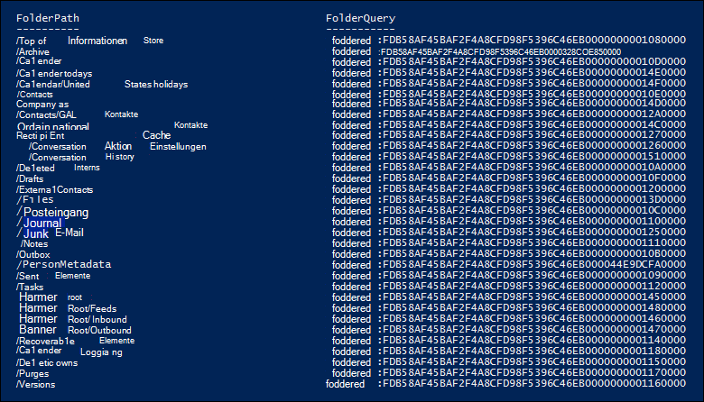
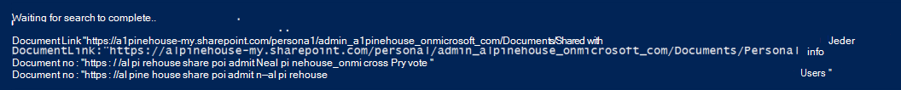

# <a name="use-content-search-for-targeted-collections"></a>Verwenden der Inhaltssuche für gezielte Sammlungen

Das Inhaltssuchfeature im Microsoft 365 Compliance Center bietet keine direkte Möglichkeit in der Benutzeroberfläche, bestimmte Ordner in #A0 oder SharePoint- und OneDrive for #A1 zu durchsuchen. Es ist jedoch möglich, bestimmte Ordner (als gezielte Auflistung *bezeichnet)* zu durchsuchen, indem die Ordner-ID-Eigenschaft für die E-Mail- oder Pfadeigenschaft (DocumentLink) für Websites in der tatsächlichen Suchabfragesyntax angegeben wird. Die Verwendung der Inhaltssuche zum Ausführen einer gezielten Auflistung ist hilfreich, wenn Sie sicher sind, dass sich Elemente, die auf einen Fall reagieren, oder privilegierte Elemente in einem bestimmten Postfach oder Websiteordner befinden. Sie können das Skript in diesem Artikel verwenden, um die Ordner-ID für Postfachordner oder den Pfad (DocumentLink) für Ordner auf einer SharePoint- und OneDrive for #A0 zu erhalten. Anschließend können Sie die Ordner-ID oder den Pfad in einer Suchabfrage verwenden, um Elemente zurückzukehren, die sich im Ordner befinden.

> [!NOTE]
> Zum Zurückgeben von Inhalten in einem Ordner auf einer SharePoint- oder OneDrive for #A0 verwendet das Skript in diesem Thema die verwaltete DocumentLink-Eigenschaft anstelle der Path-Eigenschaft. Die DocumentLink-Eigenschaft ist robuster als die Path-Eigenschaft, da sie alle Inhalte in einem Ordner zurück gibt, während die Path-Eigenschaft einige Mediendateien nicht zurück gibt.

## <a name="before-you-run-a-targeted-collection"></a>Vor dem Ausführen einer gezielten Auflistung

- Sie müssen Mitglied der Rollengruppe eDiscovery Manager im Security & Compliance Center sein, um das Skript in Schritt 1 auszuführen. Weitere Informationen finden Sie unter [Zuweisen von eDiscovery-Berechtigungen](assign-ediscovery-permissions.md).

    Darüber hinaus muss Ihnen die Rolle "E-Mail-Empfänger" in Ihrer Exchange Online-Organisation zugewiesen werden. Dies ist erforderlich, um das **Cmdlet Get-MailboxFolderStatistics** auszuführen, das im Skript enthalten ist. Standardmäßig wird die Rolle E-Mail-Empfänger den Rollengruppen Organisationsverwaltung und Empfängerverwaltung in Exchange Online zugewiesen. Weitere Informationen zum Zuweisen von Berechtigungen in Exchange Online finden Sie unter [Verwalten von Rollengruppenmitgliedern](/exchange/manage-role-group-members-exchange-2013-help). Sie können auch eine benutzerdefinierte Rollengruppe erstellen, ihr die Rolle E-Mail-Empfänger zuweisen und dann die Mitglieder hinzufügen, die das Skript in Schritt 1 ausführen müssen. Weitere Informationen finden Sie unter [Verwalten von Rollengruppen](/Exchange/permissions-exo/role-groups).

- Das Skript in diesem Artikel unterstützt die moderne Authentifizierung. Sie können das Skript wie folgt verwenden, wenn Sie eine Microsoft 365- oder Microsoft 365-GCC-Organisation sind. Wenn Sie eine Office 365 Deutschland-Organisation, eine Microsoft 365 GCC High-Organisation oder eine Microsoft 365 DoD-Organisation sind, müssen Sie das Skript bearbeiten, um es erfolgreich auszuführen. Insbesondere müssen Sie die Zeile bearbeiten und den `Connect-ExchangeOnline` *ExchangeEnvironmentName-Parameter* (und den entsprechenden Wert für Ihren Organisationstyp) verwenden, um eine Verbindung mit Exchange Online PowerShell herzustellen.  Außerdem müssen Sie die Zeile bearbeiten und die `Connect-IPPSSession` *Parameter ConnectionUri* und *AzureADAuthorizationEndpointUri* (und die entsprechenden Werte für Ihren Organisationstyp) verwenden, um eine Verbindung mit Security & Compliance Center PowerShell herzustellen. Weitere Informationen finden Sie in den Beispielen [Connect to Exchange Online PowerShell](/powershell/exchange/connect-to-exchange-online-powershell#connect-to-exchange-online-powershell-without-using-mfa) und Connect to Security & Compliance Center [PowerShell](/powershell/exchange/connect-to-scc-powershell#connect-to-security--compliance-center-powershell-without-using-mfa).

- Jedes Mal, wenn Sie das Skript ausführen, wird eine neue Remote-PowerShell-Sitzung erstellt. Das bedeutet, dass Sie alle verfügbaren Remote-PowerShell-Sitzungen nutzen können. Um dies zu verhindern, führen Sie den folgenden Befehl aus, um die aktiven Remote-PowerShell-Sitzungen zu trennen.

  ```powershell
  Get-PSSession | Remove-PSSession
  ```

    Weitere Informationen finden Sie unter [Herstellen einer Verbindung mit Exchange Online PowerShell](/powershell/exchange/connect-to-exchange-online-powershell).

- Das Skript enthält eine minimale Fehlerbehandlung. Der Hauptzweck des Skripts besteht in der schnellen Anzeige einer Liste von Postfachordner-IDs oder Websitepfaden, die in der Suchabfragesyntax einer Inhaltssuche zum Ausführen einer gezielten Auflistung verwendet werden können.

- Das in diesem Thema bereitgestellte Beispielskript wird in keinem Standardsupportprogramm oder -dienst von Microsoft unterstützt. Das Beispielskript wird wie besehen ohne jegliche Gewährleistung zur Verfügung gestellt. Microsoft schließt ferner alle konkludenten Gewährleistungen, einschließlich, aber nicht beschränkt auf konkludente Gewährleistungen der Marktgängigkeit oder Eignung für einen bestimmten Zweck aus. Das gesamte Risiko, das mit der Verwendung oder Leistung des Beispielskripts und der Dokumentation einhergeht, liegt bei Ihnen. In keinem Fall sind Microsoft, seine Autoren oder an der Erstellung, Produktion oder Übermittlung der Skripts beteiligte Personen für Schäden jeglicher Art (einschließlich und ohne Einschränkung Schäden durch Verlust entgangener Gewinne, Geschäftsunterbrechungen, Verlust von Geschäftsinformationen oder andere geldliche Verluste) haftbar, die aus der Nutzung bzw. Unfähigkeit zur Nutzung der Beispielskripts oder Dokumentation entstehen, auch wenn Microsoft auf die Möglichkeit solcher Schäden hingewiesen wurde.
  
## <a name="step-1-run-the-script-to-get-a-list-of-folders-for-a-mailbox-or-site"></a>Schritt 1: Ausführen des Skripts zum Erhalten einer Liste von Ordnern für ein Postfach oder eine Website

Das Skript, das Sie in diesem ersten Schritt ausführen, gibt eine Liste der Postfachordner oder SharePoint- und OneDrive for #A0 sowie die entsprechende Ordner-ID oder den entsprechenden Pfad für jeden Ordner zurück. Wenn Sie dieses Skript ausführen, werden Sie zur Eingabe der folgenden Informationen aufgefordert.
  
- **E-Mail-Adresse oder Website-URL:** Geben Sie eine E-Mail-Adresse des Verwahrers ein, um eine Liste der Exchange-Postfachordner und Ordner-IDs zurückzukehren. Oder geben Sie die URL für eine #A0 oder oneDrive for #A1 ein, um eine Liste der Pfade für die angegebene Website zurückzukehren. Im Folgenden finden Sie einige Beispiele:

  - **Exchange**: stacig@contoso.onmicrosoft <spam> <spam> .com

  - **SharePoint**: https <span>://</span>contoso.sharepoint.com/sites/marketing 

  - **OneDrive for Business**: https <span>://</span>contoso-my.sharepoint.com/personal/stacig_contoso_onmicrosoft_com 

- **Ihre Benutzeranmeldeinformationen:** Das Skript verwendet Ihre Anmeldeinformationen, um eine Verbindung mit Exchange Online PowerShell oder Security & Compliance Center PowerShell mithilfe der modernen Authentifizierung herzustellen. Wie bereits erläutert, müssen Ihnen die entsprechenden Berechtigungen zugewiesen werden, um dieses Skript erfolgreich ausführen zu können.

So zeigen Sie eine Liste der Postfachordner oder Websitedokumentlinknamen (Pfadnamen) an:
  
1. Speichern Sie den folgenden Text in Windows PowerShell Skriptdatei, indem Sie das Dateinamensuffix .ps1 verwenden. Beispiel: `GetFolderSearchParameters.ps1` .

   ```powershell
   #########################################################################################################
   # This PowerShell script will prompt you for:                                #
   #    * Admin credentials for a user who can run the Get-MailboxFolderStatistics cmdlet in Exchange    #
   #      Online and who is an eDiscovery Manager in the Security & Compliance Center.            #
   # The script will then:                                            #
   #    * If an email address is supplied: list the folders for the target mailbox.            #
   #    * If a SharePoint or OneDrive for Business site is supplied: list the documentlinks (folder paths) #
   #    * for the site.                                                                                    #
   #    * In both cases, the script supplies the correct search properties (folderid: or documentlink:)    #
   #      appended to the folder ID or documentlink to use in a Content Search.                #
   # Notes:                                                #
   #    * For SharePoint and OneDrive for Business, the paths are searched recursively; this means the     #
   #      the current folder and all sub-folders are searched.                        #
   #    * For Exchange, only the specified folder will be searched; this means sub-folders in the folder    #
   #      will not be searched.  To search sub-folders, you need to use the specify the folder ID for    #
   #      each sub-folder that you want to search.                                #
   #    * For Exchange, only folders in the user's primary mailbox will be returned by the script.        #
   #########################################################################################################
   # Collect the target email address or SharePoint Url
   $addressOrSite = Read-Host "Enter an email address or a URL for a SharePoint or OneDrive for Business site"
   # Authenticate with Exchange Online and the Security & Compliance Center (Exchange Online Protection - EOP)
   if ($addressOrSite.IndexOf("@") -ige 0)
   {
      # List the folder Ids for the target mailbox
      $emailAddress = $addressOrSite
      # Connect to Exchange Online PowerShell
      if (!$ExoSession)
      {
          Import-Module ExchangeOnlineManagement
          Connect-ExchangeOnline
      }
      $folderQueries = @()
      $folderStatistics = Get-MailboxFolderStatistics $emailAddress
      foreach ($folderStatistic in $folderStatistics)
      {
          $folderId = $folderStatistic.FolderId;
          $folderPath = $folderStatistic.FolderPath;
          $encoding= [System.Text.Encoding]::GetEncoding("us-ascii")
          $nibbler= $encoding.GetBytes("0123456789ABCDEF");
          $folderIdBytes = [Convert]::FromBase64String($folderId);
          $indexIdBytes = New-Object byte[] 48;
          $indexIdIdx=0;
          $folderIdBytes | select -skip 23 -First 24 | %{$indexIdBytes[$indexIdIdx++]=$nibbler[$_ -shr 4];$indexIdBytes[$indexIdIdx++]=$nibbler[$_ -band 0xF]}
          $folderQuery = "folderid:$($encoding.GetString($indexIdBytes))";
          $folderStat = New-Object PSObject
          Add-Member -InputObject $folderStat -MemberType NoteProperty -Name FolderPath -Value $folderPath
          Add-Member -InputObject $folderStat -MemberType NoteProperty -Name FolderQuery -Value $folderQuery
          $folderQueries += $folderStat
      }
      Write-Host "-----Exchange Folders-----"
      $folderQueries |ft
   }
   elseif ($addressOrSite.IndexOf("http") -ige 0)
   {
      $searchName = "SPFoldersSearch"
      $searchActionName = "SPFoldersSearch_Preview"
      # List the folders for the SharePoint or OneDrive for Business Site
      $siteUrl = $addressOrSite
      # Connect to Security & Compliance Center PowerShell
      if (!$SccSession)
      {
          Import-Module ExchangeOnlineManagement
          Connect-IPPSSession
      }
      # Clean-up, if the script was aborted, the search we created might not have been deleted.  Try to do so now.
      Remove-ComplianceSearch $searchName -Confirm:$false -ErrorAction 'SilentlyContinue'
      # Create a Content Search against the SharePoint Site or OneDrive for Business site and only search for folders; wait for the search to complete
      $complianceSearch = New-ComplianceSearch -Name $searchName -ContentMatchQuery "contenttype:folder" -SharePointLocation $siteUrl
      Start-ComplianceSearch $searchName
      do{
          Write-host "Waiting for search to complete..."
          Start-Sleep -s 5
          $complianceSearch = Get-ComplianceSearch $searchName
      }while ($complianceSearch.Status -ne 'Completed')
      if ($complianceSearch.Items -gt 0)
      {
          # Create a Compliance Search Action and wait for it to complete. The folders will be listed in the .Results parameter
          $complianceSearchAction = New-ComplianceSearchAction -SearchName $searchName -Preview
          do
          {
              Write-host "Waiting for search action to complete..."
              Start-Sleep -s 5
              $complianceSearchAction = Get-ComplianceSearchAction $searchActionName
          }while ($complianceSearchAction.Status -ne 'Completed')
          # Get the results and print out the folders
          $results = $complianceSearchAction.Results
          $matches = Select-String "Data Link:.+[,}]" -Input $results -AllMatches
          foreach ($match in $matches.Matches)
          {
              $rawUrl = $match.Value
              $rawUrl = $rawUrl -replace "Data Link: " -replace "," -replace "}"
              Write-Host "DocumentLink:""$rawUrl"""
          }
      }
      else
      {
          Write-Host "No folders were found for $siteUrl"
      }
      Remove-ComplianceSearch $searchName -Confirm:$false -ErrorAction 'SilentlyContinue'
   }
   else
   {
      Write-Error "Couldn't recognize $addressOrSite as an email address or a site URL"
   }
   ```

2. Öffnen Sie auf dem lokalen Computer Windows PowerShell, und wechseln Sie zu dem Ordner, in dem Sie das Skript gespeichert haben.

3. Führen Sie das Skript aus. Zum Beispiel:

   ```powershell
   .\GetFolderSearchParameters.ps1
   ```

4. Geben Sie die Vom Skript aufgeforderten Informationen ein.

    Das Skript zeigt eine Liste der Postfachordner oder Websiteordner für den angegebenen Benutzer an. Lassen Sie dieses Fenster geöffnet, damit Sie eine Ordner-ID oder einen Documentlink-Namen kopieren und in eine Suchabfrage in Schritt 2 einfügen können.

    > [!TIP]
    > Anstatt eine Liste der Ordner auf dem Computerbildschirm anzuzeigen, können Sie die Ausgabe des Skripts erneut in eine Textdatei umbuchen. Diese Datei wird in dem Ordner gespeichert, in dem sich das Skript befindet. Führen Sie beispielsweise den folgenden Befehl in Schritt 3 aus, um die Skriptausgabe in eine Textdatei umzuleiten: Dann können Sie eine Ordner-ID oder einen documentlink aus der Datei kopieren, die in einer Suchabfrage verwendet werden  `.\GetFolderSearchParameters.ps1 > StacigFolderIds.txt` soll.
  
### <a name="script-output-for-mailbox-folders"></a>Skriptausgabe für Postfachordner

Wenn Sie Postfachordner-IDs abrufen, stellt das Skript eine Verbindung mit Exchange Online PowerShell fest, führt das **Cmdlet Get-MailboxFolderStatisics** aus und zeigt dann die Liste der Ordner aus dem angegebenen Postfach an. Für jeden Ordner im Postfach zeigt das Skript den Namen des Ordners in der **Spalte FolderPath** und die Ordner-ID in der **Spalte FolderQuery** an. Darüber hinaus fügt das Skript der Ordner-ID das Präfix **folderId** (der Name der Postfacheigenschaft) hinzu. Da es sich bei der **folderid-Eigenschaft** um eine durchsuchbare Eigenschaft handelt, werden Sie in einer Suchabfrage in Schritt 2 zum Durchsuchen dieses  `folderid:<folderid>` Ordners verwendet. Das Skript zeigt maximal 100 Postfachordner an.

> [!IMPORTANT]
> Das Skript in diesem Artikel enthält Codierungslogik, die die 64-Zeichen-Ordner-ID-Werte konvertiert, die von **Get-MailboxFolderStatistics** in das gleiche 48-Zeichen-Format zurückgegeben werden, das für die Suche indiziert ist. Wenn Sie einfach das **Cmdlet Get-MailboxFolderStatistics** in PowerShell ausführen, um eine Ordner-ID zu erhalten (anstatt das Skript in diesem Artikel auszuführen), wird bei einer Suchabfrage, die diesen Ordner-ID-Wert verwendet, ein Fehler angezeigt. Sie müssen das Skript ausführen, um die korrekt formatierten Ordner-IDs zu erhalten, die in einer Inhaltssuche verwendet werden können.
  
Hier sehen Sie ein Beispiel für die Ausgabe, die vom Skript für Postfachordner zurückgegeben wird.
  

  
Das Beispiel in Schritt 2 zeigt die Abfrage, die zum Durchsuchen des Unterordners "Löschen" im Ordner "Wiederherstellbare Elemente" des Benutzers verwendet wird.
  
### <a name="script-output-for-site-folders"></a>Skriptausgabe für Websiteordner

Wenn Sie den Pfad der **documentlink-Eigenschaft** von SharePoint- oder OneDrive for & abrufen, stellt das Skript eine Verbindung mit Security & Compliance PowerShell sicher, erstellt eine neue Inhaltssuche, die die Website nach Ordnern durchsucht, und zeigt dann eine Liste der Ordner an der angegebenen Website an. Das Skript zeigt den Namen der einzelnen Ordner an und fügt der Ordner-URL das Präfix **documentlink** hinzu. Da es sich bei **der documentlink-Eigenschaft** um eine durchsuchbare Eigenschaft handelt, verwenden Sie das Property:value-Paar in einer Suchabfrage in Schritt 2, um diesen `documentlink:<path>` Ordner zu durchsuchen. Das Skript zeigt maximal 200 Websiteordner an. Wenn mehr als 200 Websiteordner vorhanden sind, werden die neuesten angezeigt.
  
Hier sehen Sie ein Beispiel für die Ausgabe, die vom Skript für Websiteordner zurückgegeben wird.
  

  
## <a name="step-2-use-a-folder-id-or-documentlink-to-perform-a-targeted-collection"></a>Schritt 2: Verwenden einer Ordner-ID oder eines documentlinks zum Ausführen einer gezielten Auflistung

Nachdem Sie das Skript ausgeführt haben, um eine Liste von Ordner-IDs oder Dokumentlinks für einen bestimmten Benutzer zu sammeln, müssen Sie im nächsten Schritt zum Microsoft 365 Compliance Center wechseln und eine neue Inhaltssuche erstellen, um einen bestimmten Ordner zu durchsuchen. Sie verwenden das Paar or property:value in der Suchabfrage, die Sie im Schlüsselwortfeld Inhaltssuche konfigurieren (oder als Wert für den Parameter ContentMatchQuery, wenn Sie das `folderid:<folderid>` `documentlink:<path>` **Cmdlet New-ComplianceSearch** verwenden).  Sie können die  `folderid`  `documentlink` or-Eigenschaft mit anderen Suchparametern oder Suchbedingungen kombinieren. Wenn Sie nur die or-Eigenschaft in die Abfrage hinzufügen, gibt die Suche alle Elemente  `folderid`  `documentlink` zurück, die sich im angegebenen Ordner befinden.
  
1. Wechseln Sie zu, und melden Sie sich mit dem Konto und den Anmeldeinformationen an, mit dem Sie das Skript [https://compliance.microsoft.com](https://compliance.microsoft.com) in Schritt 1 ausgeführt haben.

2. Klicken Sie im linken Bereich des Compliance Centers auf **Alle**  >  **Inhaltssuche** anzeigen, und klicken Sie dann auf **Neue Suche**.

3. Fügen Sie **im Feld Schlüsselwörter** den oder-Wert ein, der vom Skript in Schritt `folderid:<folderid>`  `documentlink:<path>` 1 zurückgegeben wurde.

    Die Abfrage im folgenden Screenshot sucht beispielsweise nach einem beliebigen Element im Unterordner "Löschen" im Ordner "Wiederherstellbare Elemente" des Benutzers (der Wert der Eigenschaft für den Unterordner "Löschen" wird im Screenshot `folderid` in Schritt 1 angezeigt):

    

4. Wählen **Sie unter Speicherorte** **die Option Bestimmte Speicherorte** aus, und klicken Sie dann auf **Ändern**.

5. Gehen Sie wie folgt vor, je nachdem, ob Sie einen Postfachordner oder einen Websiteordner durchsuchen:

    - Klicken Sie **neben Exchange-E-Mail** auf Benutzer, Gruppen oder **Teams auswählen,** und fügen Sie dann dasselbe Postfach hinzu, das Sie beim Ausführen des Skripts in Schritt 1 angegeben haben.

      Oder

    - Klicken Sie **neben SharePoint-Websites** auf Websites auswählen, und fügen Sie dann dieselbe Website-URL hinzu, die Sie beim Ausführen des Skripts in Schritt 1 angegeben haben. 

6. Nachdem Sie den zu durchsuchende Inhaltsspeicherort gespeichert haben, klicken Sie auf &  **ausführen** speichern, geben Sie einen Namen für die Inhaltssuche ein, und klicken Sie dann auf Speichern, um die suche nach zielorientierten Auflistungen zu starten. 
  
### <a name="examples-of-search-queries-for-targeted-collections"></a>Beispiele für Suchabfragen für zielorientierte Sammlungen

Im Folgenden finden Sie einige Beispiele für die Verwendung der  `folderid`  `documentlink` und-Eigenschaften in einer Suchabfrage zum Ausführen einer gezielten Auflistung. Platzhalter werden verwendet, um  `folderid:<folderid>` Speicherplatz  `documentlink:<path>` zu sparen. 
  
- In diesem Beispiel werden drei verschiedene Postfachordner durchsucht. Sie können eine ähnliche Abfragesyntax verwenden, um die ausgeblendeten Ordner im Ordner "Wiederherstellbare Elemente" eines Benutzers zu durchsuchen.

  ```powershell
  folderid:<folderid> OR folderid:<folderid> OR folderid:<folderid>
  ```

- In diesem Beispiel wird ein Postfachordner nach Elementen durchsucht, die einen genauen Ausdruck enthalten.

  ```powershell
  folderid:<folderid> AND "Contoso financial results"
  ```

- In diesem Beispiel wird ein Websiteordner (und alle Unterordner) nach Dokumenten durchsucht, die die Buchstaben "NDA" im Titel enthalten.

  ```powershell
  documentlink:<path> AND filename:nda
  ```

- In diesem Beispiel wird ein Websiteordner (und ein beliebiger Unterordner) nach Dokumenten durchsucht, die innerhalb eines Datumsbereichs geändert wurden.

  ```powershell
  documentlink:<path> AND (lastmodifiedtime>=01/01/2017 AND lastmodifiedtime<=01/21/2017)
  ```

## <a name="more-information"></a>Weitere Informationen

Beachten Sie folgendes, wenn Sie das Skript in diesem Artikel zum Ausführen gezielter Sammlungen verwenden.
  
- Das Skript entfernt keine Ordner aus den Ergebnissen. Einige ordner, die in den Ergebnissen aufgeführt sind, sind möglicherweise nicht durchsuchbar (oder geben null Elemente zurück), weil sie vom System generierte Inhalte enthalten oder weil sie nur Unterordner und keine Postfachelemente enthalten.

- Dieses Skript gibt nur Ordnerinformationen für das primäre Postfach des Benutzers zurück. Es gibt keine Informationen zu Ordnern im Archivpostfach des Benutzers zurück. Zum Zurückgeben von Informationen zu Ordnern im Archivpostfach des Benutzers können Sie das Skript bearbeiten. Ändern Sie dazu die Zeile `$folderStatistics = Get-MailboxFolderStatistics $emailAddress` `$folderStatistics = Get-MailboxFolderStatistics $emailAddress -Archive` in, speichern und führen Sie das bearbeitete Skript aus. Diese Änderung gibt die Ordner-IDs für Ordner und Unterordner im Archivpostfach des Benutzers zurück. Zum Durchsuchen des gesamten Archivpostfachs können Sie alle Ordner-ID-Eigenschaft:Value-Paare mit einem `OR` Operator in einer Suchabfrage verbinden.

- Beim Durchsuchen von Postfachordnern wird nur der angegebene Ordner (identifiziert durch seine Eigenschaft) durchsucht. Unterordner werden `folderid` nicht durchsucht. Zum Durchsuchen von Unterordnern müssen Sie die Ordner-ID für den Unterordner verwenden, den Sie durchsuchen möchten.

- Beim Durchsuchen von Websiteordnern werden der Ordner (durch seine Eigenschaft identifiziert) und alle Unterordner `documentlink` durchsucht. 

- Beim Exportieren der Ergebnisse einer Suche, in der Sie nur die Eigenschaft in der Suchabfrage angegeben haben, können Sie die erste Exportoption auswählen: "Alle Elemente, ausgenommen elemente, die ein nicht unbekanntes Format haben, sind verschlüsselt oder wurden aus anderen Gründen nicht `folderid` indiziert." Alle Elemente im Ordner werden unabhängig vom Indizierungsstatus immer exportiert, da die Ordner-ID immer indiziert ist.