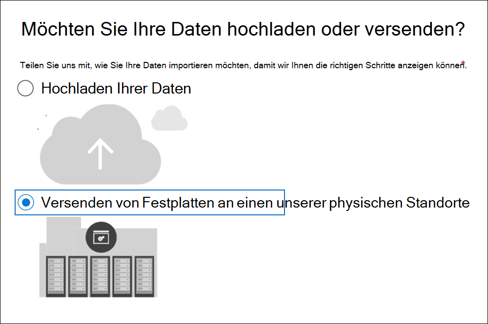
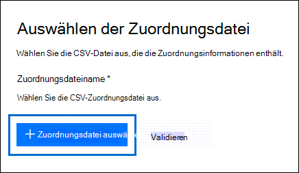
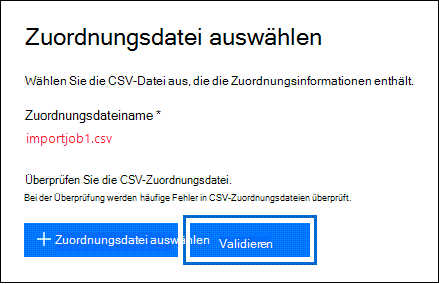
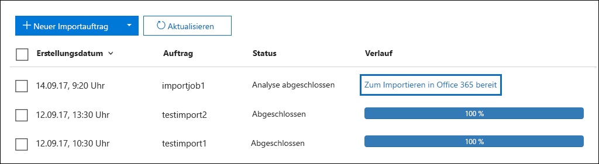
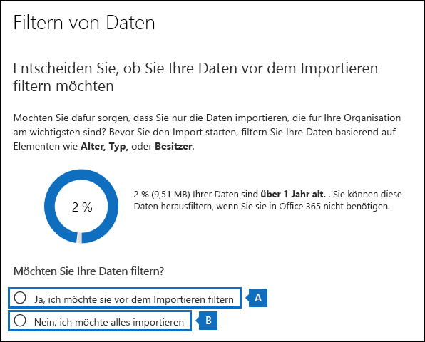
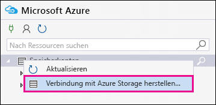
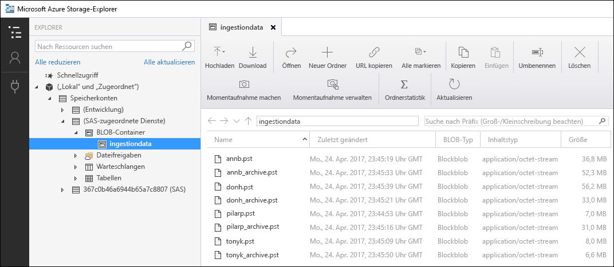

# <a name="use-drive-shipping-to-import-your-organizations-pst-files"></a>Verwenden des Laufwerk Versands zum Importieren der PST-Dateien Ihrer Organisation

**Dieser Artikel richtet sich an Administratoren. Versuchen Sie, PST-Dateien in Ihr eigenes Postfach zu importieren? Siehe [Importieren von e-Mails, Kontakten und Kalendern aus einer Outlook. PST-Datei](https://go.microsoft.com/fwlink/p/?LinkID=785075)**
   
Verwenden Sie die Office 365 Import-Dienst und fahren Sie mit dem Versand von Massenimport-PST-Dateien in Benutzerpostfächer. Beim Laufwerkversand kopieren Sie die PST-Dateien auf eine Festplatte und senden diese auf dem Postweg an Microsoft. Wenn Microsoft Ihre Festplatte empfängt, kopiert das Personal des Rechenzentrums die Daten von der Festplatte in einen Speicherbereich in der Microsoft-Cloud. Anschließend haben Sie die Möglichkeit, die in die Zielpostfächer importierten PST-Daten zu trimmen, indem Sie Filter festlegen, mit denen gesteuert wird, welche Daten importiert werden. Nachdem Sie den Importauftrag gestartet haben, importiert der Import Dienst die PST-Daten aus dem Speicherbereich in Benutzerpostfächer. Das Verwenden des Laufwerk Versands zum Importieren von PST-Dateien in Benutzerpostfächer ist eine Möglichkeit, die e-Mails Ihrer Organisation in Office 365 zu migrieren.
  
Hier sind die erforderlichen Schritte zum Importieren von PST-Dateien in Microsoft 365-Postfächer mithilfe des Laufwerk Versands:
  
[Schritt 1: Herunterladen des Secure Storage Key und des PST-Import Tools](#step-1-download-the-secure-storage-key-and-pst-import-tool)

[Schritt 2: Kopieren der PST-Dateien auf die Festplatte](#step-2-copy-the-pst-files-to-the-hard-drive)

[Schritt 3: Erstellen der PST-Import Zuordnungsdatei](#step-3-create-the-pst-import-mapping-file)

[Schritt 4: Erstellen eines PST-Importauftrags in Office 365](#step-4-create-a-pst-import-job-in-office-365)

[Schritt 5: Versenden der Festplatte an Microsoft](#step-5-ship-the-hard-drive-to-microsoft)

[Schritt 6: Filtern von Daten und Starten des PST-Importauftrags](#step-6-filter-data-and-start-the-pst-import-job)
  
> [!IMPORTANT]
> Sie müssen Schritt 1 einmal ausführen, um den sicheren Speicherschlüssel und das Import Tool zu laden. Nachdem Sie diese Schritte ausgeführt haben, befolgen Sie Schritt 2 bis Schritt 6 jedes Mal, wenn Sie eine Festplatte an Microsoft senden möchten. 
  
Häufig gestellte Fragen zur Verwendung des Laufwerk Versands zum Importieren von PST-Dateien in Office 365 finden Sie unter [FAQs für die Verwendung des Laufwerk Versands zum Importieren von PST-Dateien](faqimporting-pst-files-to-office-365.md#using-drive-shipping-to-import-pst-files). 
  
## <a name="before-you-begin"></a>Bevor Sie beginnen

- Sie müssen in Exchange Online über die Rolle "Postfachimport export" verfügen, um PST-Dateien in Microsoft 365-Postfächer zu importieren. Standardmäßig ist diese Rolle keiner Rollengruppe in Exchange Online zugewiesen. Sie können die Rolle „Postfachimport/-export“ zur Rollengruppe „Organisationsverwaltung“ hinzufügen. Oder Sie erstellen eine Rollengruppe, weisen die Rolle „Postfachimport/-export“ zu und fügen sich dann selbst als Mitglied hinzu. Weitere Informationen finden Sie im Abschnitt "Hinzufügen einer Rolle zu einer Rollengruppe" oder "Erstellen einer Rollengruppe" in [Verwalten von Rollengruppen](https://go.microsoft.com/fwlink/p/?LinkId=730688).
    
    Darüber hinaus muss eine der folgenden Bedingungen erfüllt sein, um Importaufträge im Security & Compliance Center erstellen zu können:
    
  - Ihnen muss in Exchange Online die Rolle „E-Mail-Empfänger“ zugewiesen sein. Standardmäßig wird diese Rolle den Rollengruppen "Organisationsverwaltung" und "Empfängerverwaltung" zugewiesen.
    
    Oder
    
  - Sie müssen ein globaler Administrator in Ihrer Organisation sein.
    
    > [!TIP]
    > Erwägen Sie, in Exchange Online eine neue Rollengruppe speziell zum Importieren von PST-Dateien nach Office 365 zu erstellen. Legen Sie für die neue Rollengruppe als mindestens erforderliche Berechtigungen zum Importieren von PST-Dateien die Rollen "Postfachimport/-export" und "E-Mail-Empfänger" fest, und fügen Sie anschließend Mitglieder hinzu. 
  
- Sie müssen die PST-Dateien, die Sie auf die Festplatte kopieren möchten, auf einem Dateiserver oder einem freigegebenen Ordner in Ihrer Organisation speichern. In Schritt 2 führen Sie das Azure Import Export Tool ("waimportexport. exe) aus, das die auf diesem Dateiserver oder freigegebenen Ordner gespeicherten PST-Dateien auf die Festplatte kopiert.

- Große PST-Dateien können sich auf die Leistung des PST-Importprozesses auswirken. Daher wird empfohlen, dass jede PST-Datei, die Sie in Schritt 2 auf die Festplatte kopieren, nicht größer als 20 GB sein sollte.
    
- Nur 2,5-Zoll-Solid-State-Laufwerke (SSDs) oder 2,5-Zoll-oder 3,5-Zoll-SATA II/III-Festplattenlaufwerke werden für die Verwendung mit dem Office 365-Import Dienst unterstützt. Sie können Festplatten bis zu 10 TB verwenden. Bei Importaufträgen wird nur das erste Datenvolume auf der Festplatte verarbeitet. Das Datenvolume muss mit NTFS formatiert sein. Wenn Sie Daten auf eine Festplatte kopieren, können Sie Sie direkt über einen 2,5-Zoll-SSD oder 2,5-Zoll-oder 3,5-Zoll-SATA II/III-Anschluss anhängen oder extern mit einem externen 2,5-Zoll-SSD oder einem 2,5-Zoll-oder 3,5-Zoll-SATA II/III-USB-Adapter verbinden.
    
    > [!IMPORTANT]
    > Externe Festplatten mit einem integrierten USB-Adapter werden vom Office 365-Importdienst nicht unterstützt. Darüber hinaus kann der Datenträger innerhalb des Gehäuses einer externen Festplatte nicht verwendet werden. Versenden Sie keine externen Festplatten. 
  
- Die Festplatte, auf die Sie die PST-Dateien kopieren, muss mit BitLocker verschlüsselt sein. Das Tool WAImportExport.exe, das Sie in Schritt 2 ausführen, unterstützt Sie bei der Einrichtung von BitLocker. Außerdem wird ein BitLocker-Verschlüsselungsschlüssel generiert, den Microsoft-Rechenzentrumsmitarbeiter für den Zugriff auf das Laufwerk verwenden, um die PST-Dateien in den Azure-Speicherbereich in der Microsoft-Cloud hochzuladen.
    
- Der Laufwerk Versand steht über einen Microsoft Enterprise-Vertrag (EA) zur Verfügung. Der Laufwerkversand steht nicht im Rahmen von Microsoft Products und Services Agreement (MPSA) zur Verfügung.
    
- Die Kosten für den Import von PST-Dateien in Microsoft 365-Postfächer mithilfe des Laufwerk Versands sind $2 USD pro GB Daten. Wenn Sie z. B. eine Festplatte versenden, die 1.000 GB (1 TB) an PST-Dateien enthält, betragen die Kosten beispielsweise 2.000 Euro. Um die Importgebühren zu zahlen, können Sie mit einem Partner zusammenarbeiten. Informationen zum Suchen eines Partners finden Sie unter [Suchen Ihres Microsoft-Partners oder-Händlers](https://go.microsoft.com/fwlink/p/?LinkId=785197).
    
- Sie bzw. Ihre Organisation müssen über ein Konto bei FedEx oder DHL verfügen. 
    
  - Organisationen in den Vereinigten Staaten, in Brasilien und in Europa müssen FedEx-Konten besitzen.
    
  - Organisationen in Ostasien, Südostasien, Japan, Republik Korea und Australien müssen über DHL-Konten verfügen.
    
    Microsoft verwendet (und lädt) dieses Konto, um die Festplatte wieder an Sie zurückzugeben.
    
- Die Festplatte, die Sie an Microsoft senden, kann internationale Grenzen überschreiten. In diesem Fall müssen Sie sicherstellen, dass die Festplatte und die darin enthaltenen Daten gemäß den geltenden Gesetzen importiert und/oder exportiert werden. Überprüfen Sie vor dem Versand einer Festplatte mit ihren Beratern, ob das Laufwerk und die Daten legal an das identifizierte Microsoft Data Center ausgeliefert werden können. Auf diese Weise wird sichergestellt, dass Microsoft rechtzeitig erreicht werden kann.
    
- Bei diesem Verfahren werden ein sicherer Speicherschlüssel und ein BitLocker-Verschlüsselungsschlüssel kopiert und gespeichert. Ergreifen Sie entsprechende Vorsichtsmaßnahmen, um diese Schlüssel so zu schützen, wie Sie Kennwörter oder andere Sicherheitsinformationen schützen würden. Sie können sie zum Beispiel in einem kennwortgeschützten Microsoft Word-Dokument oder auf einem verschlüsselten USB-Laufwerk speichern. Ein Beispiel für diese Tasten finden Sie im Abschnitt [Weitere Informationen](#more-information) . 
    
- Nachdem PST-Dateien in ein Microsoft 365-Postfach importiert wurden, ist die Aufbewahrungsdauer für das Postfach auf unbestimmte Zeit aktiviert. Dies bedeutet: Die dem Postfach zugewiesene Aufbewahrungsrichtlinie wird erst verarbeitet, nachdem Sie das Anhalten der Aufbewahrungszeit deaktiviert oder aber ein Datum zum Deaktivieren des Anhaltens festgelegt haben. Warum tun wir dies? Wenn die in ein Postfach importierten Nachrichten alt sind, werden sie möglicherweise endgültig gelöscht, weil ihr Aufbewahrungszeitraum, basierend auf den für das Postfach konfigurierten Aufbewahrungseinstellungen, abgelaufen ist. Wenn Sie das Postfach auf Anhalten der Aufbewahrungszeit setzen, erhält der Postfachbesitzer Zeit zum Verwalten dieser neu importierten Nachrichten, oder Sie erhalten Zeit zum Ändern der Aufbewahrungseinstellungen für das Postfach. Im Abschnitt [Weitere Informationen](#more-information) finden Sie Vorschläge zum Verwalten des Aufbewahrungs Speichers. 
    
- Standardmäßig beträgt die maximale Nachrichtengröße, die von einem Microsoft 365-Postfach empfangen werden kann, 35 MB. Der Grund hierfür ist, dass der Standardwert für die Eigenschaft *MaxReceiveSize* für ein Postfach auf 35 MB festgelegt ist. Der Grenzwert für die maximale Nachrichtenempfangs Größe in Microsoft 365 beträgt jedoch 150 MB. Wenn Sie also eine PST-Datei importieren, die ein Element enthält, das größer als 35 MB ist, ändert der Office 365-Importdienst den Wert der Eigenschaft *MaxReceiveSize* für das Zielpostfach automatisch in "150 MB". Dadurch können Nachrichten mit bis zu 150 MB in Benutzerpostfächer importiert werden. 
    
    > [!TIP]
    > Wenn Sie die Größe empfangener Nachrichten für ein Postfach ermitteln möchten, können Sie diesen Befehl in Exchange Online PowerShell ausführen: `Get-Mailbox <user mailbox> | FL MaxReceiveSize`. 
  
- Sie können PST-Dateien in ein inaktives Postfach in Office 365 importieren. Geben Sie hierzu den GUID des inaktiven Postfachs im Parameter `Mailbox` in der PST-Importzuordnungsdatei an. Weitere Informationen finden Sie unter [Schritt 3: Erstellen der PST-Import Zuordnungsdatei](#step-3-create-the-pst-import-mapping-file) . 
    
- In einer Exchange-Hybridumgebung können Sie PST-Dateien für einen Benutzer, dessen primäres Postfach lokal gehostet wird, in ein cloudbasiertes Archivpostfach importieren. Gehen Sie hierzu in der PST-Importzuordnungsdatei folgendermaßen vor:
    
  - Geben Sie die E-Mail-Adresse des lokalen Postfachs des Benutzers im Parameter `Mailbox` an. 
    
  - Geben Sie den Wert **TRUE** im Parameter `IsArchive` an. 
    
    Weitere Informationen finden Sie unter [Schritt 3: Erstellen der PST-Import Zuordnungsdatei](#step-3-create-the-pst-import-mapping-file) . 

## <a name="step-1-download-the-secure-storage-key-and-pst-import-tool"></a>Schritt 1: Herunterladen des Secure Storage Key und des PST-Import Tools

Der erste Schritt besteht darin, den Schlüssel für sichere Speicherung und das Tool herunterzuladen und in Schritt 2 zum Kopieren von PST-Dateien auf die Festplatte zu verwenden.
  
> [!IMPORTANT]
> Sie müssen Azure Import/Export Tool Version 1 (WAimportExportV1) verwenden, um PST-Dateien erfolgreich mithilfe der Laufwerk Versandart zu importieren. Version 2 des Azure-Import/Export-Tools wird nicht unterstützt, und die Verwendung dieser Funktion führt zu einer fehlerhaften Vorbereitung der Festplatte für den Importauftrag. Stellen Sie sicher, dass Sie das Azure-Import/Export-Tool aus dem Security & Compliance Center herunterladen, indem Sie die Verfahren in diesem Schritt befolgen. 
  
1. Wechseln Sie [https://protection.office.com/](https://protection.office.com/) zu, und melden Sie sich mit den Anmeldeinformationen für ein Administratorkonto in Ihrer Organisation an. 
    
2. Klicken Sie im linken Bereich des Security & Compliance Centers auf **Information Governance** \> **Import** \> **Importieren von PST-Dateien**.
    
    > [!NOTE]
    > Wie bereits erwähnt, müssen Sie im Security & Compliance Center die entsprechenden Berechtigungen für den Zugriff auf die **Import** Seite erhalten. 
  
3. Klicken Sie auf der Seite **Import von PST-Dateien**  **Neuer Importauftrag**.
    
4. Geben Sie im Assistenten zum Importieren von Aufträgen einen Namen für den PST-Importauftrag ein, und klicken Sie dann auf **weiter**. Verwenden Sie Kleinbuchstaben, Zahlen, Bindestriche und Unterstriche. Sie dürfen weder Großbuchstaben noch Leerzeichen in dem Namen verwenden.
    
5. Klicken Sie auf der Seite **Import Auftragstyp auswählen** auf **Verschiffen von Festplatten an einen unserer physischen Standorte** , und klicken Sie dann auf **weiter**.
    
    
  
6. Führen Sie auf der Seite **Daten importieren** einen der folgenden Schritte aus: 
    
    
  
    a. Klicken Sie in Schritt 2 auf **sicheren Speicherschlüssel kopieren**. Nachdem Sie den Speicherschlüssel angezeigt haben, klicken Sie auf **in die Zwischenablage kopieren** und anschließend in eine Datei einfügen und speichern, damit Sie später darauf zugreifen können.
    
    b. Laden Sie in Schritt 3 **das Azure-Import/Export-Tool** herunter, um das Azure-Tool zum Importieren/Exportieren (Version 1) herunterzuladen und zu installieren.
    
    - **Klicken Sie** \> im Popupfenster auf Save **As** speichern unter, um die Datei WaImportExportV1. zip in einem Ordner auf Ihrem lokalen Computer zu speichern. 
    
    - Extrahieren Sie die Datei WaImportExportV1. zip.
    
7. Klicken Sie auf **Abbrechen** , um den Assistenten zu schließen. 
    
    Sie kehren zur Seite **importieren** im Security & Compliance Center zurück, wenn Sie den Importauftrag in Schritt 4 erstellen. 

## <a name="step-2-copy-the-pst-files-to-the-hard-drive"></a>Schritt 2: Kopieren der PST-Dateien auf die Festplatte

Der nächste Schritt besteht darin, die PST-Dateien mithilfe des Tools WAImportExport.exe auf die Festplatte zu kopieren. Mit diesem Tool werden die Festplatte mit BitLocker verschlüsselt, die PST-Dateien auf die Festplatte kopiert und eine Journaldatei erstellt, die Informationen zum Kopiervorgang speichert. Damit Sie diesen Schritt ausführen können, müssen sich die PST-Dateien in einer Dateifreigabe oder auf einem Dateiserver in Ihrer Organisation befinden. Im folgenden Verfahren wird dies als das Quellverzeichnis bezeichnet. 

 Wie bereits erwähnt, sollte jede PST-Datei, die Sie auf die Festplatte kopieren, nicht größer als 20 GB sein. PST-Dateien mit mehr als 20 GB können sich auf die Leistung des PST-Importprozesses auswirken, die Sie in Schritt 6 starten.
  
> [!IMPORTANT]
> Nach der ersten Verwendung des Tools WAImportExport.exe für ein Laufwerk müssen Sie jedes weitere Mal eine andere Syntax verwenden. Diese Syntax wird in Schritt 4 dieses Verfahrens zum Kopieren von PST-Dateien auf die Festplatte erläutert. 
  
1. Öffnen Sie eine Eingabeaufforderung auf dem lokalen Computer.
    
    > [!TIP]
    > Wenn Sie die Eingabeaufforderung als Administrator ausführen (durch Auswahl von „Als Administrator ausführen“ beim Öffnen), werden im Fenster der Eingabeaufforderung Fehlermeldungen angezeigt. Dies kann Ihnen bei der Behandlung von Problemen beim Ausführen des Tools „WAImportExport.exe“ helfen. 
  
2. Wechseln Sie zu dem Verzeichnis, in dem Sie das Tool „WAImportExport.exe“ in Schritt 1 installiert haben.
    
3. Wenn Sie „WAImportExport.exe“ zum ersten Mal verwenden, um die PST-Dateien auf eine Festplatte zu kopieren, führen Sie den folgenden Befehl aus.

    ```powershell
    WAImportExport.exe PrepImport /j:<Name of journal file> /t:<Drive letter> /id:<Name of session> /srcdir:<Location of PST files> /dstdir:<PST file path> /sk:<Storage account key> /blobtype:BlockBlob /encrypt /logdir:<Log file location>
    ```

    In der folgenden Tabelle werden die Parameter und deren erforderliche Werte beschrieben.
    
    |**Parameter**|**Beschreibung**|**Beispiel**|
    |:-----|:-----|:-----|
    | `/j:` <br/> |Gibt den Namen der Journaldatei an. Diese Datei wird im selben Ordner gespeichert, in dem sich das Tool „WAImportExport.exe“ befindet. Jede Festplatte, die Sie an Microsoft senden, muss eine Journaldatei enthalten. Jedes Mal, wenn Sie „WAImportTool.exe“ zum Kopieren von PST-Dateien auf eine Festplatte ausführen, werden Informationen zur Journaldatei dieser Festplatte hinzugefügt.  <br/> Microsoft Data Center-Mitarbeiter verwenden Sie die Informationen in der Journaldatei, um die Festplatte dem in Schritt 4 erstellten Importauftrag zuzuordnen und die PST-Dateien in den Azure-Speicherbereich in der Microsoft-Cloud hochzuladen.  <br/> | `/j:PSTHDD1.jrn` <br/> |
    | `/t:` <br/> |Gibt den Buchstaben des Laufwerks an, wenn die Festplatte an Ihren lokalen Computer angeschlossen ist.  <br/> | `/t:h` <br/> |
    | `/id:` <br/> |Gibt den Namen der Kopiersitzung an. Eine Sitzung ist definiert als jeder einzelne Vorgang, in dem Sie das Tool „WAImportExport.exe“ ausführen und Dateien auf die Festplatte kopieren. Die PST-Dateien werden in einen Ordner mit dem Namen der Sitzung kopiert, der durch diesen Parameter angegeben wird.   <br/> | `/id:driveship1` <br/> |
    | `/srcdir:` <br/> |Gibt das Quellverzeichnis in Ihrer Organisation an, das die PST-Dateien enthält, die während der Sitzung kopiert werden. Beachten Sie, den Wert dieses Parameters in doppelte Anführungszeichen (" ") einzuschließen.  <br/> | `/srcdir:"\\FILESERVER01\PSTs"` <br/> |
    | `/dstdir:` <br/> |Gibt das Zielverzeichnis im Azure-Speicherbereich in der Microsoft-Cloud an, in dem der PST hochgeladen wird. Sie müssen den Wert `ingestiondata/`verwenden. Beachten Sie, den Wert dieses Parameters in doppelte Anführungszeichen (" ") einzuschließen.  <br/> Optional können Sie auch einen zusätzlichen Dateipfad zum Wert dieses Parameters hinzufügen. Sie können beispielsweise den Dateipfad des Quellverzeichnisses auf der Festplatte (in ein URL-Format konvertiert) verwenden, das im- `/srcdir:` Parameter angegeben ist. Beispielsweise `\\FILESERVER01\PSTs` wird in `FILESERVER01/PSTs`geändert. In diesem Fall müssen Sie den Dateipfad dennoch `ingestiondata` einschließen. In diesem Beispiel wäre also der Wert für den `/dstdir:` `"ingestiondata/FILESERVER01/PSTs"`-Parameter.  <br/> Das Hinzufügen des zusätzlichen Dateipfads ist z. B. dann sinnvoll, wenn einige Ihrer PST-Dateien den gleichen Dateinamen aufweisen.  <br/> > [!NOTE]> Wenn Sie den optionalen Pfadnamen einschließen, enthält der Namespace für eine PST-Datei nach dem Hochladen in den Azure-Speicherbereich den Pfadnamen und den Namen der PST-Datei. Beispiel: `FILESERVER01/PSTs/annb.pst`. Wenn Sie keinen Pfadnamen angeben, ist der Namespace nur der PST-Dateiname; zum Beispiel `annb.pst`.           | `/dstdir:"ingestiondata/"` <br/> Oder  <br/>  `/dstdir:"ingestiondata/FILESERVER01/PSTs"` <br/> |
    | `/sk:` <br/> |Gibt den Speicherkontoschlüssel an, den Sie in Schritt 1 abgerufen haben. Beachten Sie, den Wert dieses Parameters in doppelte Anführungszeichen (" ") einzuschließen.  <br/> | `"yaNIIs9Uy5g25Yoak+LlSHfqVBGOeNwjqtBEBGqRMoidq6/e5k/VPkjOXdDIXJHxHvNoNoFH5NcVUJXHwu9ZxQ=="` <br/> |
    | `/blobtype:` <br/> |Gibt den Typ der BLOBs im Azure-Speicherbereich an, in den die PST-Dateien importiert werden sollen. Verwenden Sie zum Importieren von PST-Dateien den Wert **BlockBlob**. Dieser Parameter ist erforderlich.   <br/> | `/blobtype:BlockBlob` <br/> |
    | `/encrypt` <br/> |Diese Option aktiviert BitLocker für die Festplatte. Dieser Parameter ist beim erstmaligen Ausführen des Tools „WAImportExport.exe“ erforderlich.  <br/> Der BitLocker-Verschlüsselungsschlüssel wird in die Journaldatei und die Protokolldatei kopiert, die erstellt wird, `/logfile:` Wenn Sie den Parameter verwenden. Wie bereits erwähnt wird die Journaldatei im selben Ordner gespeichert, in dem sich das Tool „WAImportExport.exe“ befindet.  <br/> | `/encrypt` <br/> |
    | `/logdir:` <br/> |Dieser optionale Parameter gibt einen Ordner an, in dem die Protokolldateien gespeichert werden können. Wenn nicht angegeben, werden die Protokolldateien im gleichen Ordner gespeichert, in dem sich das Tool "waimportexport. exe befindet. Beachten Sie, den Wert dieses Parameters in doppelte Anführungszeichen (" ") einzuschließen.  <br/> | `/logdir:"c:\users\admin\desktop\PstImportLogs"` <br/> |
   
    Nachfolgend sehen Sie ein Beispiel der Syntax für das Tool „WAImportExport.exe“, in dem die tatsächlichen Werte für jeden Parameter verwendet werden:
    
    ```powershell
    WAImportExport.exe PrepImport /j:PSTHDD1.jrn /t:f /id:driveship1 /srcdir:"\\FILESERVER01\PSTs" /dstdir:"ingestiondata/" /sk:"yaNIIs9Uy5g25Yoak+LlSHfqVBGOeNwjqtBEBGqRMoidq6/e5k/VPkjOXdDIXJHxHvNoNoFH5NcVUJXHwu9ZxQ==" blobtype:BlockBlob /encrypt /logdir:"c:\users\admin\desktop\PstImportLogs"
    ```

    Nachdem Sie den Befehl ausgeführt haben, werden Statusmeldungen angezeigt, die den Fortschritt des Kopierens der PST-Dateien auf die Festplatte anzeigen. Eine endgültige Statusmeldung zeigt die Gesamtzahl der Dateien an, die erfolgreich kopiert wurden. 
    
4. Führen Sie diesen Befehl jedes Mal aus, wenn Sie das Tool „WAImportExport.exe“ zum Kopieren der PST-Dateien auf dieselbe Festplatte ausführen.

    ```powershell
    WAImportExport.exe PrepImport /j:<Name of journal file> /id:<Name of new session> /srcdir:<Location of PST files> /dstdir:<PST file path> /blobtype:BlockBlob 
    ```

    Im Folgenden sehen Sie ein Beispiel der Syntax für die Ausführung weiterer Sitzungen zum Kopieren von PST-Dateien auf dieselbe Festplatte.  

    ```powershell
    WAImportExport.exe PrepImport /j:PSTHDD1.jrn /id:driveship2 /srcdir:"\\FILESERVER01\PSTs\SecondBatch" /dstdir:"ingestiondata/" /blobtype:BlockBlob
    ```

## <a name="step-3-create-the-pst-import-mapping-file"></a>Schritt 3: Erstellen der PST-Import Zuordnungsdatei

Nachdem Microsoft Data Center-Mitarbeiter die PST-Dateien von der Festplatte in den Azure-Speicherbereich hochgeladen haben, verwendet der Import Dienst die Informationen in der PST-Import Zuordnungsdatei, bei der es sich um eine CSV-Datei (Comma-Separated Value) handelt, in der die Benutzerpostfächer angegeben werden, in die die PST-Dateien importiert werden. Diese CSV-Datei wird im nächsten Schritt übermittelt, wenn Sie einen PST-Importauftrag erstellen.
  
1. [Laden Sie eine Kopie der PST-Importzuordnungsdatei herunter](https://go.microsoft.com/fwlink/p/?LinkId=544717).
    
2. Öffnen oder speichern Sie die CSV-Datei auf Ihrem lokalen Computer. Das folgende Beispiel zeigt eine abgeschlossene PST-Importzuordnungsdatei (in Editor geöffnet). Es ist wesentlich einfacher, Microsoft Excel zum Bearbeiten der CSV-Datei zu verwenden.

    ```text
    Workload,FilePath,Name,Mailbox,IsArchive,TargetRootFolder,ContentCodePage,SPFileContainer,SPManifestContainer,SPSiteUrl
    Exchange,FILESERVER01/PSTs,annb.pst,annb@contoso.onmicrosoft.com,FALSE,/,,,,
    Exchange,FILESERVER01/PSTs,annb_archive.pst,annb@contoso.onmicrosoft.com,TRUE,/ImportedPst,,,,
    Exchange,FILESERVER01/PSTs,donh.pst,donh@contoso.onmicrosoft.com,FALSE,/,,,,
    Exchange,FILESERVER01/PSTs,donh_archive.pst,donh@contoso.onmicrosoft.com,TRUE,/ImportedPst,,,,
    Exchange,FILESERVER01/PSTs,pilarp.pst,pilarp@contoso.onmicrosoft.com,FALSE,/,,,,
    Exchange,FILESERVER01/PSTs,pilarp_archive.pst,pilarp@contoso.onmicrosoft.com,TRUE,/ImportedPst,,,,
    Exchange,,tonyk.pst,tonyk@contoso.onmicrosoft.com,FALSE,/,,,,
    Exchange,,tonyk_archive.pst,tonyk@contoso.onmicrosoft.com,TRUE,,,,,
    Exchange,,zrinkam.pst,zrinkam@contoso.onmicrosoft.com,FALSE,/,,,,
    Exchange,,zrinkam_archive.pst,zrinkam@contoso.onmicrosoft.com,TRUE,,,,,
    ```

    Die erste Zeile oder Kopfzeile der CSV-Datei enthält die Parameter, die vom PST-Importdienst verwendet werden, um die PST-Dateien in Benutzerpostfächer zu importieren. Die einzelnen Parameternamen werden jeweils durch ein Komma getrennt. Jede Zeile unter der Kopfzeile stellt die Parameterwerte für das Importieren einer PST-Datei in ein bestimmtes Postfach dar. Sie benötigen eine Zeile für jede PST-Datei, die auf die Festplatte kopiert wurde. Vergessen Sie nicht, die Platzhalterdaten in der Zuordnungsdatei durch die tatsächlichen Werte zu ersetzen.

    > [!NOTE]
    > Ändern Sie nichts in der Kopfzeile, einschließlich der SharePoint-Parameter; diese werden während des PST-Importvorgangs ignoriert. 
  
3. Verwenden Sie die Informationen in der folgenden Tabelle, um die CSV-Datei mit den erforderlichen Informationen zu füllen.
    
    |**Parameter**|**Beschreibung**|**Beispiel**|
    |:-----|:-----|:-----|
    | `Workload` <br/> |Gibt den Dienst an, in den Daten importiert werden. Verwenden Sie `Exchange`, um PST-Dateien in Benutzerpostfächer zu importieren.  <br/> | `Exchange` <br/> |
    | `FilePath` <br/> | Gibt den Speicherort des Ordners im Azure-Speicherbereich an, in den PST-Dateien kopiert werden, wenn die Festplatte an Microsoft ausgeliefert wird.  <br/>  Was Sie in dieser Spalte in der CSV-Datei hinzufügen, hängt davon ab, was `/dstdir:` Sie in für den Parameter im vorherigen Schritt angegeben haben. Wenn Sie Unterordner am Quellspeicherort haben, muss der Wert im `FilePath` Parameter den relativen Pfad für den Unterordner enthalten. Beispiel:/Folder1/user1/.  <br/>  Wenn Sie verwendet `/dstdir:"ingestiondata/"`haben, lassen Sie diesen Parameter in der CSV-Datei leer.  <br/>  Wenn Sie einen optionalen Pfadname für den Wert des `/dstdir:` Parameters angegeben haben (Beispiels `/dstdir:"ingestiondata/FILESERVER01/PSTs"`Weise, dann verwenden Sie diesen Pfadnamen (nicht einschließlich "ingestiondata") für diesen Parameter in der CSV-Datei. Beim Wert für diesen Parameter muss die Groß-/Kleinschreibung beachtet werden.  <br/>  In beiden Fällen schließen Sie "ingestiondata" *nicht* in den Wert für den Parameter `FilePath` ein. Lassen Sie diesen Parameter leer, oder geben Sie nur den optionalen Pfadnamen an.  <br/> > [!IMPORTANT]> der Fall des Datei Pfadnamens muss derselbe Fall sein, den Sie im `/dstdir:` Parameter im vorherigen Schritt angegeben haben. Wenn Sie beispielsweise den Namen `"ingestiondata/FILESERVER01/PSTs"` des Unterordners im vorherigen Schritt verwendet haben, dieser jedoch im `fileserver01/psts` Parameter in `FilePath` der CSV-Datei verwendet wird, schlägt der Import für die PST-Datei fehl. Denken Sie deshalb daran, in beiden Fällen dieselbe Groß-/Kleinschreibung zu verwenden.           |(leer lassen)  <br/> Oder  <br/>  `FILESERVER01/PSTs` <br/> |
    | `Name` <br/> |Gibt den Namen der PST-Datei an, die in das Benutzerpostfach importiert wird. Beim Wert für diesen Parameter muss die Groß-/Kleinschreibung beachtet werden.  <br/> > [!IMPORTANT]> der Fall für den Namen der PST-Datei in der CSV-Datei muss mit der PST-Datei übereinstimmen, die in Schritt 2 in den Azure-Speicherort hochgeladen wurde. Wenn Sie beispielsweise `annb.pst` im Parameter `Name` der CSV-Datei verwenden, der Name der tatsächlichen PST-Datei aber `AnnB.pst` lautet, schlägt der Import für diese PST-Datei fehl. Sorgen Sie deshalb dafür, dass im Namen der PST-Datei in der CSV-Datei dieselbe Groß-/Kleinschreibung wie in der tatsächlichen PST-Datei verwendet wird.           | `annb.pst` <br/> |
    | `Mailbox` <br/> |Gibt die E-Mail-Adresse des Postfachs an, in das die PST-Datei importiert werden soll. Sie können keinen öffentlichen Ordner angeben, da der PST-Importdienst keine Unterstützung für den Import von PST-Dateien in öffentliche Ordner bietet.  <br/> Zum Importieren einer PST-Datei in ein inaktives Postfach müssen Sie für diesen Parameter die Postfach-GUID angeben. Zum Abrufen dieser GUID führen Sie den folgenden PowerShell-Befehl in Exchange Online aus: `Get-Mailbox <identity of inactive mailbox> -InactiveMailboxOnly | FL Guid`. <br/> > [!NOTE]> manchmal verfügen Sie möglicherweise über mehrere Postfächer mit derselben e-Mail-Adresse, wobei ein Postfach ein aktives Postfach und das andere Postfach einen Soft-deleted (oder inaktiven) Status hat. In diesen Fällen müssen Sie die Postfach-GUID angeben, um das Postfach eindeutig zu identifizieren, in das die PST-Datei importiert werden soll. Zum Abrufen dieser GUID für aktive Postfächer führen Sie den folgenden PowerShell-Befehl aus: `Get-Mailbox <identity of active mailbox> | FL Guid`. Um die GUID für vorläufig gelöschte (oder inaktive) Postfächer zu erhalten, führen `Get-Mailbox <identity of soft-deleted or inactive mailbox> -SoftDeletedMailbox | FL Guid`Sie den folgenden Befehl aus:.           | `annb@contoso.onmicrosoft.com` <br/> Oder  <br/>  `2d7a87fe-d6a2-40cc-8aff-1ebea80d4ae7` <br/> |
    | `IsArchive` <br/> | Gibt an, ob die PST-Datei in das Archivpostfach des Benutzers importiert werden soll. Es gibt zwei Möglichkeiten:  <br/> **False** Importiert die PST-Datei in das primäre Postfach des Benutzers.  <br/> **True** Importiert die PST-Datei in das Archivpostfach des Benutzers. Dies setzt voraus, dass das [Archivpostfach des Benutzers aktiviert ist](enable-archive-mailboxes.md). Wenn Sie diesen Parameter auf `TRUE` festlegen und das Archivpostfach des Benutzers nicht aktiviert ist, schlägt der Import für diesen Benutzer fehl. Wenn der Import für einen Benutzer fehlschlägt (weil sein Archiv nicht aktiviert und diese Eigenschaft auf `TRUE` festgelegt ist), sind die übrigen Benutzer im Importauftrag davon nicht betroffen.  <br/>  Wenn Sie diesen Parameter leer lassen, wird die PST-Datei in das primäre Postfach des Benutzers importiert.  <br/> **Hinweis:** Zum Importieren einer PST-Datei in ein cloudbasiertes Archivpostfach für einen Benutzer, dessen primäres Postfach lokal gehostet wird, geben Sie für diesen Parameter einfach `TRUE` an und geben Sie die E-Mail-Adresse des lokalen Postfachs des Benutzers für den Parameter `Mailbox` an.  <br/> | `FALSE` <br/> Oder  <br/>  `TRUE` <br/> |
    | `TargetRootFolder` <br/> | Gibt den Postfachordner an, in den die PST-Datei importiert wird.  <br/>  Wenn Sie diesen Parameter leer lassen, wird die PST-Datei in einen neuen Ordner mit dem Namen " **imported** " importiert, der sich auf der Stammebene des Postfachs befindet (die gleiche Ebene wie der Posteingangsordner und die anderen standardmäßigen Postfachordner).  <br/>  Wenn Sie angeben `/`, werden Elemente in der PST-Datei direkt in den Posteingangsordner des Benutzers importiert.  <br/>  Wenn Sie angeben `/<foldername>`, werden Elemente in der PST-Datei in einen Ordner mit dem Namen * \<FolderName\>* importiert. Bei Verwendung von `/ImportedPst` würden beispielsweise Elemente in einen Ordner mit dem Namen **ImportedPst** importiert. Dieser Ordner befindet sich im Postfach des Benutzers auf der gleichen Ebene wie der Ordner "Posteingang".  <br/> |(leer lassen)  <br/> Oder  <br/>  `/` <br/> Oder  <br/>  `/ImportedPst` <br/> |
    | `ContentCodePage` <br/> |Dieser optionale Parameter gibt einen numerischen Wert für die Codepage an, die zum Importieren von PST-Dateien im ANSI-Dateiformat verwendet werden muss. Der Parameter wird zum Importieren von PST-Dateien aus chinesischen, japanischen und koreanischen (CJK) Organisationen verwendet, weil in diesen Sprachen normalerweise ein Doppelbyte-Zeichensatz (double byte character set, DBCS) verwendet wird. Wenn dieser Parameter nicht verwendet wird, um PST-Dateien für Sprachen zu importieren, die DBCS für die Namen von Postfachordnern verwenden, sind die Ordnernamen nach dem Import oft nicht leserlich.  <br/> Eine Liste von unterstützten Werten, die für diesen Parameter verwendet werden müssen, finden Sie unter [CodePage-Bezeichner](https://go.microsoft.com/fwlink/p/?LinkId=328514).  <br/> > [!NOTE]> wie bereits erwähnt, ist dies ein optionaler Parameter, den Sie nicht in die CSV-Datei einschließen müssen. Sie können ihn aber auch einschließen und den Wert für eine oder mehrere Zeilen leer lassen.           |(leer lassen)  <br/> Oder  <br/>  `932` (dies ist der Codepagebezeichner für ANSI/OEM – Japanisch)  <br/> |
    | `SPFileContainer` <br/> |Lassen Sie diesen Parameter für den PST-Import leer.  <br/> |Nicht zutreffend  <br/> |
    | `SPManifestContainer` <br/> |Lassen Sie diesen Parameter für den PST-Import leer.  <br/> |Nicht zutreffend  <br/> |
    | `SPSiteUrl` <br/> |Lassen Sie diesen Parameter für den PST-Import leer.  <br/> |Nicht zutreffend  <br/> |

## <a name="step-4-create-a-pst-import-job-in-office-365"></a>Schritt 4: Erstellen eines PST-Importauftrags in Office 365

Der nächste Schritt besteht darin, den PST-Importauftrag im Importdienst in Office 365 zu erstellen. Wie bereits erläutert, übermitteln Sie die PST-Import Zuordnungsdatei, die Sie in Schritt 3 erstellt haben. Nachdem Sie den Auftrag erstellt haben, wird der Import Dienst die Informationen in der Zuordnungsdatei verwenden, um die PST-Dateien in das angegebene Benutzerpostfach zu importieren, nachdem die PST-Dateien von der Festplatte in den Azure-Speicherbereich kopiert wurden, und Sie erstellen und starten den Import Auftrag.
  
1. Wechseln Sie [https://protection.office.com](https://protection.office.com) zu, und melden Sie sich mit den Anmeldeinformationen für ein Administratorkonto in Ihrer Organisation an. 
    
2. Klicken Sie im linken Bereich des Security & Compliance Centers auf **Information Governance** \> **Import** \> **Importieren von PST-Dateien**.
    
3. Klicken Sie auf der Seite **Import von PST-Dateien**  **Neuer Importauftrag**.
    
    > [!NOTE]
    > Wie bereits erwähnt, müssen Sie im Security & Compliance Center die entsprechenden Berechtigungen für den Zugriff auf die **Import** Seite erhalten. 
  
4. Geben Sie einen Namen für den PST-Importauftrag ein, und klicken Sie dann auf **Weiter**. Verwenden Sie Kleinbuchstaben, Zahlen, Bindestriche und Unterstriche. Sie dürfen weder Großbuchstaben noch Leerzeichen in dem Namen verwenden.
    
5. Klicken Sie auf der Seite **Import Auftragstyp auswählen** auf **Verschiffen von Festplatten an einen unserer physischen Standorte** , und klicken Sie dann auf **weiter**.
    
    
  
6. Klicken Sie in Schritt 6 auf die Kontrollkästchen **Ich habe meine Festplatten vorbereitet und habe Zugriff auf die erforderlichen Laufwerk Journaldateien** , und **Ich habe Zugriff auf die Zuordnungsdatei** , und klicken Sie dann auf **weiter**.
    
    
  
7. Klicken Sie auf der Seite **Laufwerksdatei auswählen** auf **Laufwerk Datei auswählen**, und wechseln Sie dann zu dem Ordner, in dem sich das Tool "waimportexport. exe befindet. Die in Schritt 2 erstellte Journaldatei wurde in diesen Ordner kopiert.
    
    
  
8. Wählen Sie die Journaldatei aus. Beispiel: `PSTHDD1.jrn`.
    
    > [!TIP]
    > Wenn Sie das Tool "waimportexport. exe in Schritt 2 ausgeführt haben, wurde der Name der Journaldatei durch den `/j:` -Parameter angegeben. 
  
9. Nachdem der Name der Laufwerk Datei unter Name der **Laufwerksdatei**angezeigt wird **, klicken Sie auf über** prüfen, um die Laufwerk Datei auf Fehler zu überprüfen. 
    
    
  
    Die Laufwerksdatei muss erfolgreich überprüft werden, um einen PST-Import Auftrag zu erstellen. Der Dateiname wird grün angezeigt, wenn die Überprüfung der Datei erfolgreich war. Wenn die Überprüfung fehlschlägt, klicken Sie auf den Link **Protokoll anzeigen**. Es wird ein Validierungsfehler Bericht mit einer Fehlermeldung mit Informationen darüber geöffnet, warum die Datei fehlgeschlagen ist. 
    
    > [!NOTE]
    > Sie müssen für jede Festplatte, die Sie an Microsoft senden, eine Journaldatei hinzufügen und validieren. 
  
10. Nachdem Sie eine Journaldatei für jede Festplatte hinzugefügt und überprüft haben, die Sie an Microsoft senden, klicken Sie auf **weiter**.
    
11. Klicken  Symbol hinzufügen **auswählen Zuordnungsdatei** zum übermitteln der PST-Import Zuordnungsdatei, die Sie in Schritt 3 erstellt haben. 
    
    
  
12. Wenn der Name der CSV-Datei unter **Name der Zuordnungsdatei** angezeigt wird, klicken Sie auf **Überprüfen**, um die CSV-Datei auf Fehler zu überprüfen. 
    
    
  
    Die CSV-Datei muss erfolgreich überprüft werden, um einen PST-Importauftrag zu erstellen. Der Dateiname wird grün angezeigt, wenn die Überprüfung der Datei erfolgreich war. Wenn die Überprüfung fehlschlägt, klicken Sie auf den Link **Protokoll anzeigen**. Der Bericht mit den Überprüfungsfehlern wird geöffnet, in dem für jede Zeile in der Datei, in der ein Fehler aufgetreten ist, eine Fehlermeldung aufgeführt ist. 
    
13. Nachdem die PST-Zuordnungsdatei erfolgreich überprüft wurde, klicken Sie auf **weiter**.
    
14. Geben Sie auf der Seite **Kontaktinformationen bereitstellen** Ihre Kontaktinformationen in die entsprechenden Felder ein. 
    
    Die Adresse für den Microsoft-Standort, an den Sie Ihre Festplatten versenden, wird angezeigt. Diese Adresse wird automatisch basierend auf Ihrem Microsoft Datacenter-Speicherort generiert. Kopieren Sie diese Adresse in eine Datei oder erstellen Sie einen Screenshot.
    
15. Lesen Sie das Dokument Bedingungen und Konditionen, klicken Sie auf das Kontrollkästchen, und klicken Sie dann auf **Speichern** , um den Importauftrag zu übermitteln. 
    
    Wenn der Importauftrag erfolgreich erstellt wurde, wird eine Statusseite angezeigt, in der die nächsten Schritte des Laufwerk Versandprozesses erläutert werden.
    
16. Klicken Sie  aktualisieren Symbol **Aktualisieren** , um den neuen Importauftrag für den Laufwerk Versand in der Liste der Importaufträge anzuzeigen. Der Status ist auf nach **Verfolgungsnummer warten**festgelegt. Sie können auch auf den Importauftrag klicken, um die Status-Flyout-Seite anzuzeigen, die detailliertere Informationen zum Importauftrag enthält.
 
## <a name="step-5-ship-the-hard-drive-to-microsoft"></a>Schritt 5: Versenden der Festplatte an Microsoft

Der nächste Schritt besteht darin, die Festplatte an Microsoft zu senden und dann die Nachverfolgungsnummer für die Versand-und Rück Sendungsinformationen für den Laufwerk Versandauftrag anzugeben. Nachdem das Laufwerk von Microsoft empfangen wurde, dauert es zwischen 7 und 10 Werktage für Rechenzentrumsmitarbeiter, um Ihre PST-Dateien in den Azure-Speicherbereich Ihrer Organisation hochzuladen.
  
> [!NOTE]
> Wenn Sie die Nachverfolgungsnummer und Rück Sendungsinformationen nicht innerhalb von 14 Tagen nach Erstellung des importauftrags angeben, ist der Importauftrag abgelaufen. In diesem Fall müssen Sie einen neuen Importauftrag für den Laufwerk Versand erstellen (siehe [Schritt 4: Erstellen eines PST-importauftrags in Office 365](#step-4-create-a-pst-import-job-in-office-365)) und erneutes übermitteln der Laufwerksdatei und der PST-Import Zuordnungsdatei. 
  
### <a name="ship-the-hard-drive"></a>Versenden der Festplatte

Beachten Sie die folgenden Punkte, wenn Sie Festplatten an Microsoft senden:
  
- Senden Sie den SATA-zu-USB-Adapter nicht. Sie müssen die Festplatte nur versenden.
    
- Verpacken Sie die Laufwerke ordnungsgemäß; verwenden Sie z. B. antistatische Verpackung oder Luftpolsterfolie.
    
- Senden Sie die Festplatte mit einem Spediteur Ihrer Wahl an Microsoft.
    
- Verwenden Sie als Versandadresse den Microsoft-Standort, der Ihnen beim Erstellen des Importauftrags in Schritt 4 angezeigt wurde. Vergessen Sie nicht, in der Versandadresse den Zusatz „Office 365 Import Service“ anzugeben.
    
- Nachdem Sie die Festplatte versendet haben, notieren Sie sich den Namen des Spediteurs und die Nachverfolgungsnummer. Diese müssen Sie im nächsten Schritt angeben.
    
### <a name="enter-the-tracking-number-and-other-shipping-information"></a>Eingabe der Nachverfolgungsnummer und anderer Versandinformationen

Nachdem Sie die Festplatte an Microsoft gesendet haben, führen Sie auf der Seite des Importdiensts die folgenden Schritte aus.
  
1. Wechseln Sie [https://protection.office.com](https://protection.office.com) zu, und melden Sie sich mit den Anmeldeinformationen für ein Administratorkonto in Ihrer Organisation an. 
    
2. Klicken Sie im linken Bereich auf **Informationssteuerung > Import > PST-Dateien importieren**.
    
3. Klicken Sie auf der Seite **PST-Dateien importieren** auf den Auftrag für die Laufwerks Lieferung, für die Sie die Nachverfolgungsnummer eingeben möchten. 
    
4. Klicken Sie auf der Seite Status-Flyout auf **Tracking Number eingeben**.
    
5. Geben Sie die folgenden Versandinformationen an:
    
1. **Zustellungs Träger** Geben Sie den Namen des Zustellungs Trägers ein, den Sie zum Versenden der Festplatte an Microsoft verwendet haben. 
    
2. **Nachverfolgungsnummer** Geben Sie die Nachverfolgungsnummer für die Festplatten-Lieferung ein. 
    
3. **Kontonummer des Rücksende Anbieters** Geben Sie die Kontonummer Ihrer Organisation für den Carrier ein, der unter **Absender der Rücksendung**aufgeführt ist. Microsoft verwendet (und lädt) dieses Konto, um Ihre Festplatte an Sie zurückzuliefern. Organisationen in den USA und Europa müssen über ein Konto bei FedEx verfügen. Organisationen in Asien und dem Rest der Welt müssen über ein Konto bei DHL verfügen.
    
6. Klicken Sie auf **Speichern**, um diese Informationen für den Importauftrag zu speichern. 
    
    Klicken Sie  Aktualisieren der Symbol **Aktualisierung** , um die Informationen für den Importauftrag für den Laufwerk Versand zu aktualisieren. Beachten Sie, dass der Status jetzt **Festplatten werden gesendet** lautet.

## <a name="step-6-filter-data-and-start-the-pst-import-job"></a>Schritt 6: Filtern von Daten und Starten des PST-Importauftrags

Nachdem Ihre Festplatte von Microsoft empfangen wurde, ändert sich der Status für den Importauftrag auf der Seite **PST-Dateien importieren** auf **Laufwerke empfangen**. Mitarbeiter des Rechenzentrums verwenden Sie die Informationen in der Journaldatei, um Ihre PST-Dateien in den Azure-Speicherbereich Ihrer Organisation hochzuladen. Zu diesem Zeitpunkt ändert sich der Status **in "in-Progress" Importieren**. Wie bereits erwähnt, dauert es zwischen 7 und 10 Werktage nach Erhalt Ihrer Festplatte, um die PST-Dateien hochzuladen.
  
Nachdem PST-Dateien in Azure hochgeladen wurden, wird der Status **in "Analysis in Progress**" geändert. Dies deutet darauf hin, dass Microsoft 365 die Daten in den PST-Dateien (auf sichere und sichere Weise) analysiert, um das Alter der Elemente und die unterschiedlichen Nachrichtentypen zu identifizieren, die in den PST-Dateien enthalten sind. Wenn die Analyse abgeschlossen ist und die Daten importiert werden können, wird der Status für den Importauftrag in **Analyse abgeschlossen**geändert. Zu diesem Zeitpunkt haben Sie die Möglichkeit, alle in den PST-Dateien enthaltenen Daten zu importieren, oder Sie können die importierten Daten kürzen, indem Sie Filter festlegen, mit denen gesteuert wird, welche Daten importiert werden.
  
1. Wechseln Sie [https://protection.office.com](https://protection.office.com) zu, und melden Sie sich mit den Anmeldeinformationen für ein Administratorkonto in Ihrer Organisation an. 
    
2. Klicken Sie im linken Bereich auf Import- **PST-Dateien**für den Import von **Informationssteuerung** \> **importieren** \> .
    
3. Klicken Sie auf der Seite **PST-Dateien importieren** auf bereit für den Import in **Office 365** für den Importauftrag, den Sie in Schritt 4 erstellt haben. 
    
    
  
    Nun wird eine Flyout-Seite mit Informationen zu den PST-Dateien und anderen Informationen zur Importaufgabe angezeigt.
    
4. Klicken Sie auf **Importieren in Office 365**.
    
5. Die Seite **Ihre Daten filtern** wird angezeigt. Sie enthält die Datenerkenntnisse, die sich aus der Analyse ergeben haben, die Office 365 für die PST-Dateien ausgeführt hat, einschließlich Informationen über das Alter der Daten. An diesem Punkt haben Sie die Möglichkeit, die zu importierenden Daten zu filtern oder alle Daten ungeändert zu importieren. 
    
    
  
6. Führen Sie einen der folgenden Schritte aus:
    
    a. Um die Daten, die Sie importieren, zu trimmen, klicken Sie auf **Ja, ich möchte meine Daten vor dem Import filtern**.
    
    Detaillierte schrittweise Anweisungen zum Filtern der Daten in den PST-Dateien und anschließenden Starten des Importvorgangs finden Sie unter [Filtern von Daten beim Importieren von PST-Dateien in Office 365](filter-data-when-importing-pst-files.md).
    
    Oder
    
    b. Um alle Daten zu importieren, die sich in den PST-Dateien befinden, klicken Sie auf **Nein, ich möchte alles importieren**, und klicken Sie auf **Weiter**.
    
7. Wenn Sie sich entschieden haben, alle Daten zu importieren, klicken Sie auf **Daten importieren**, um den Importvorgang zu starten. 
    
    Der Status des importauftrags wird auf der Seite **PST-Dateien importieren** angezeigt. Klicken Sie auf  **Aktualisieren**, um die Statusinformationen zu aktualisieren, die in der Spalte **Status** angezeigt werden. Klicken Sie auf den Importauftrag, um die Status-Flyout-Seite anzuzeigen, auf der die Statusinformationen zu jeder zu importierenden PST-Datei angezeigt werden. Wenn der Import abgeschlossen ist, und die PST-Dateien in die Benutzerpostfächer importiert wurden, wird der Status in **Abgeschlossen** geändert.

## <a name="view-a-list-of-the-pst-files-uploaded-to-microsoft-365"></a>Anzeigen einer Liste der PST-Dateien, die auf Microsoft 365 hochgeladen wurden

Sie können den Microsoft Azure Speicher-Explorer (ein kostenloses Open-Source-Tool) installieren und verwenden, um die Liste der PST-Dateien anzuzeigen, die von Microsoft-Mitarbeitern für Rechenzentren hochgeladen wurden, in den Azure-Speicherbereich Ihrer Organisation. Sie können dies tun, um sicherzustellen, dass PST-Dateien von den Festplatten, die Sie an Microsoft gesendet haben, erfolgreich in den Azure-Speicherbereich hochgeladen wurden.
  
Der Microsoft Azure Storage-Explorer befindet sich in der Vorschau. 
  
 **Wichtig:** Sie können den Azure-Speicher-Explorer nicht zum Hochladen oder Ändern von PST-Dateien verwenden. Die einzige unterstützte Methode zum Importieren von PST-Dateien in Microsoft 365 ist die Verwendung von AzCopy. Außerdem können Sie keine PST-Dateien löschen, die Sie in das Azure-Blob hochgeladen haben. Wenn Sie versuchen, eine PST-Datei zu löschen, erhalten Sie eine Fehlermeldung, dass Sie nicht über die erforderlichen Berechtigungen verfügen. Alle PST-Dateien werden automatisch aus dem Azure-Speicherbereich gelöscht. Wenn keine Importaufträge ausgeführt werden, werden alle PST-Dateien im * * ingestiondata * *-Container 30 Tage nach der Erstellung des letzten importauftrags gelöscht. 
  
So installieren Sie den Azure Storage-Explorer und Verbinden diesen mit Ihrem -Speicherbereich:
  
1. Führen Sie die folgenden Schritte aus, um die SAS-URL (Shared Access Signature) für Ihre Organisation abzurufen. Diese URL ist eine Kombination aus der Netzwerk-URL für den Azure-Speicherort in der Microsoft-Cloud für Ihre Organisation und einem SAS-Schlüssel. Mit diesem Schlüssel erhalten Sie die erforderlichen Berechtigungen für den Zugriff auf den Azure-Speicherort Ihrer Organisation.
    
1. Wechseln Sie [https://protection.office.com/](https://protection.office.com/) zu, und melden Sie sich mit den Anmeldeinformationen für ein Administratorkonto in Ihrer Organisation an. 
    
2. Klicken Sie im linken Bereich des Security & Compliance Center auf **Information Governance > Import > Importieren von PST-Dateien**.
    
3. Klicken Sie auf der Seite **Import von PST-Dateien**  **Neuer Importauftrag**.
    
4. Geben Sie im Assistenten zum Importieren von Aufträgen einen Namen für den PST-Importauftrag ein, und klicken Sie dann auf **weiter**. Verwenden Sie Kleinbuchstaben, Zahlen, Bindestriche und Unterstriche. Sie dürfen weder Großbuchstaben noch Leerzeichen in dem Namen verwenden.
    
5. Klicken Sie auf der Seite **Import Auftragstyp auswählen** auf **Daten hochladen**, und klicken Sie dann auf **weiter**.
    
6. Klicken Sie in Schritt 2 auf **SAS-URL für Netzwerkupload anzeigen**.
    
7. Nachdem die URL angezeigt wurde, kopieren Sie Sie, und speichern Sie Sie in einer Datei. Achten Sie darauf, die gesamte URL zu kopieren.
    
    > [!IMPORTANT]
    > Achten Sie darauf, dass Sie entsprechende Vorsichtsmaßnahmen ergreifen, um die SAS-URL zu schützen. Dies kann von jedem für den Zugriff auf den Azure-Speicherbereich für Ihre Organisation verwendet werden. 
  
8. Klicken Sie auf **Abbrechen** , um den importauftrags-Assistenten zu schließen. 
    
2. Laden Sie das Tool [Microsoft Azure Storage-Explorer](https://go.microsoft.com/fwlink/p/?LinkId=544842) herunter, und installieren Sie es.
    
3. Starten Sie den Microsoft Azure Storage-Explorer, klicken Sie im linken Bereich mit der rechten Maustaste auf **Speicherkonten**, und klicken Sie dann auf **Mit Azure Storage verbinden**.
    
    
  
4. Klicken Sie auf **SAS-URI (Shared Access Signature) oder -Verbindungszeichenfolge verwenden**, und klicken Sie dann auf **Weiter**.
    
5. Klicken Sie auf **SAS-URI verwenden**, fügen Sie die SAS-URL, die Sie in Schritt 1 abgerufen haben, in das Feld unter **URI**ein, und klicken Sie dann auf **weiter**.
    
6. Auf der Seite **Verbindungszusammenfassung** können Sie die Verbindungsinformationen überprüfen und dann auf **Verbinden** klicken.
    
    Der **Container** ingestiondata wird geöffnet. Sie enthält die PST-Dateien von Ihrer Festplatte. Der Container **ingestiondata** befindet sich unter **Speicherkonten** \> **(SAS-Attached Services)** \> **BLOB-Container**.
    
    
  
7. Wenn Sie mit der Verwendung des Microsoft Azure Storage-Explorers fertig sind, klicken Sie mit der rechten Maustaste auf **ingestiondata**, und klicken Sie dann auf **Trennen**, um die Verbindung mit dem Azure-Speicherbereich zu trennen. Andernfalls wird beim nächsten Anfügen eine Fehlermeldung angezeigt. 
    
    

## <a name="troubleshooting-tips"></a>Tipps zur Problembehandlung

- **Was passiert, wenn der Importauftrag aufgrund von Fehlern in der PST-Import-CSV-Zuordnungsdatei fehlschlägt?** Wenn ein Importauftrag aufgrund von Fehlern in der Zuordnungsdatei fehlschlägt, müssen Sie die Festplatte nicht erneut an Microsoft senden, um einen Importauftrag zu erstellen. Das liegt daran, dass die PST-Dateien von der Festplatte, die Sie für den Importauftrag für den Laufwerk versandbereit gestellt haben, bereits in den Azure-Speicherbereich für Ihre Organisation hochgeladen wurden. In diesem Fall müssen Sie die Fehler in der PST-Import CSV-Zuordnungsdatei nur beheben und dann einen neuen Import Auftrag "Netzwerk Upload" erstellen und die geänderte CSV-Zuordnungsdatei übermitteln. Informationen zum Erstellen und Starten eines neuen importauftrags für den Netzwerk Upload finden Sie [in Schritt 5: Erstellen eines PST-importauftrags in Microsoft 365](use-network-upload-to-import-pst-files.md#step-5-create-a-pst-import-job) und [Schritt 6: Filtern von Daten und Starten des PST-importauftrags](use-network-upload-to-import-pst-files.md#step-6-filter-data-and-start-the-pst-import-job) im Thema "Verwenden des Netzwerk Uploads zum Importieren von PST-Dateien in Office 365". 
    
    > [!NOTE]
    > Zur Unterstützung der Problembehandlung bei der PST-Import-CSV-Zuordnungsdatei verwenden Sie das [Azure Storage Explorer](#view-a-list-of-the-pst-files-uploaded-to-microsoft-365) -Tool, um die Ordnerstruktur im **ingestiondata** -Container für die PST-Dateien von der Festplatte anzuzeigen, die in den Azure-Speicherbereich hochgeladen wurden. Zuordnungsdatei Fehler werden in der Regel durch einen falschen Wert im filePath-Parameter verursacht. Dieser Parameter gibt den Speicherort einer PST-Datei im Azure-Speicherbereich an. Weitere Informationen finden Sie in der Beschreibung des Parameters filePath in der Tabelle in [Schritt 3](#step-3-create-the-pst-import-mapping-file). Wie bereits erläutert, wurde der Speicherort von PST-Dateien im Azure-Speicherbereich durch den `/dstdir:` -Parameter angegeben, als Sie das Tool "waimportexport. exe in [Schritt 2](#step-2-copy-the-pst-files-to-the-hard-drive)ausgeführt haben. 
  
## <a name="more-information"></a>Weitere Informationen

- Der Laufwerk Versand ist eine effektive Möglichkeit zum Importieren großer Mengen von Archiv Nachrichtendaten nach Microsoft 365, um die für Ihre Organisation verfügbaren Kompatibilitätsfeatures zu nutzen. Nachdem die Archivdaten in Benutzerpostfächer importiert wurden, haben Sie folgende Möglichkeiten:
    
  - Aktivieren von [archivpostfächern](enable-archive-mailboxes.md) und [automatisch erweiterter Archivierung](enable-unlimited-archiving.md) , damit Benutzer mehr Postfachspeicher Platz für die Daten erhalten. 
    
  - Stellen Sie Postfächer in das [Beweissicherungsverfahren](https://go.microsoft.com/fwlink/?linkid=856286) ein, um die Daten beizubehalten. 
    
  - Verwenden Sie Microsoft [eDiscovery-Tools](search-for-content.md) , um die Daten zu durchsuchen. 
    
  - Wenden Sie [Microsoft 365-Aufbewahrungsrichtlinien](retention-policies.md) an, um zu steuern, wie lange die Daten aufbewahrt werden und welche Aktion nach Ablauf des Aufbewahrungszeitraums ausgeführt werden soll. 
    
  - Durchsuchen Sie das [Überwachungsprotokoll](search-the-audit-log-in-security-and-compliance.md) nach Ereignissen im Zusammenhang mit diesen Daten. 
    
  - Importieren von Daten in [inaktive Postfächer](create-and-manage-inactive-mailboxes.md) zum Archivieren von Daten zu Kompatibilitätszwecken. 
    
  - Schützen Sie Ihre Organisation vor [Datenverlust](data-loss-prevention-policies.md) vertraulicher Informationen. 
    
- Im Folgenden sehen Sie ein Beispiel für einen sicheren Speicherkontoschlüssel und einen BitLocker-Verschlüsselungsschlüssel. Dieses Beispiel enthält auch die Syntax für den Befehl „WAImportExport.exe“, den Sie zum Kopieren der PST-Dateien auf die Festplatte ausführen. Ergreifen Sie entsprechende Vorsichtsmaßnahmen, um diese so zu schützen, wie Sie Kennwörter oder andere Sicherheitsinformationen schützen würden.
    

    ```text
    Secure storage account key: 

    yaNIIs9Uy5g25Yoak+LlSHfqVBGOeNwjqtBEBGqRMoidq6/e5k/VPkjOXdDIXJHxHvNoNoFH5NcVUJXHwu9ZxQ==

    BitLocker encryption key:

    397386-221353-718905-535249-156728-127017-683716-083391

  COMMAND SYNTAX

  First time:

  WAImportExport.exe PrepImport /j:<Name of journal file> /t:<Drive letter> /id:<Name of session> /srcdir:<Location of PST files> /dstdir:<PST file path> /sk:<Storage account key> /blobtype:BlockBlob /encrypt /logdir:<Log file location>

  Subsequent times:

  WAImportExport.exe PrepImport /j:<Name of journal file> /id:<Name of new session> /srcdir:<Location of PST files> /dstdir:<PST file path> /blobtype:BlockBlob 

  EXAMPLES

  First time:

  WAImportExport.exe PrepImport /j:PSTHDD1.jrn /t:f /id:driveship1 /srcdir:"\\FILESERVER1\PSTs" /dstdir:"ingestiondata/" /sk:"yaNIIs9Uy5g25Yoak+LlSHfqVBGOeNwjqtBEBGqRMoidq6/e5k/VPkjOXdDIXJHxHvNoNoFH5NcVUJXHwu9ZxQ==" /blobtype:BlockBlob /encrypt /logdir:"c:\users\admin\desktop\PstImportLogs"

  Subsequent times:

  WAImportExport.exe PrepImport /j:PSTHDD1.jrn /id:driveship2 /srcdir:"\\FILESERVER1\PSTs\SecondBatch" /dstdir:"ingestiondata/" /blobtype:BlockBlob
    ```

- Wie weiter oben erläutert, aktiviert der Office 365-Import-Dienst die Einstellung zum Anhalten der Aufbewahrungszeit (für eine unbestimmte Dauer), nachdem PST-Dateien in ein Postfach importiert wurden. Dies bedeutet, dass die *RentionHoldEnabled* -Eigenschaft `True` so festgelegt ist, dass die dem Postfach zugewiesene Aufbewahrungsrichtlinie nicht verarbeitet wird. Dadurch erhält der Postfachbesitzer Zeit zum Verwalten der neu importierten Nachrichten, indem verhindert wird, dass eine Lösch- oder Archivrichtlinie ältere Nachrichten löscht oder archiviert. Hier sind einige Schritte, die Sie zum Verwalten des Anhaltens der Aufbewahrungszeit ausführen können: 
    
  - Nach einem bestimmten Zeitraum können Sie die Aufbewahrungszeit deaktivieren, indem Sie den `Set-Mailbox -RetentionHoldEnabled $false` Befehl ausführen. Entsprechende Anweisungen finden Sie unter [Anhalten der Aufbewahrungszeit für ein Postfach](https://go.microsoft.com/fwlink/p/?LinkId=544749).
    
  - Sie können das Anhalten der Aufbewahrungszeit so konfigurieren, dass es an irgendeinem Datum in der Zukunft deaktiviert wird. Hierzu führen Sie den `Set-Mailbox -EndDateForRetentionHold <date>` Befehl aus. Wenn beispielsweise angenommen wird, dass das heutige Datum der 1. Juni 2016 ist und Sie möchten, dass der Aufbewahrungszeitraum in 30 Tagen deaktiviert ist, führen `Set-Mailbox -EndDateForRetentionHold 7/1/2016`Sie den folgenden Befehl aus:. In diesem Szenario lassen Sie die *RentionHoldEnabled* -Eigenschaft auf *true*festgelegt. Weitere Informationen finden Sie unter [Set-Mailbox](https://go.microsoft.com/fwlink/p/?LinkId=150317).
    
  - Sie können die Einstellungen für die dem Postfach zugewiesene Aufbewahrungsrichtlinie ändern, damit ältere importierte Elemente nicht sofort gelöscht oder in das Archivpostfach des Benutzers verschoben werden. So könnten Sie beispielsweise die Aufbewahrungszeit bei einer Lösch- oder Archivrichtlinie, die dem Postfach zugewiesen wurde, verlängern. In diesem Szenario würden Sie das Anhalten der Aufbewahrungszeit für das Postfach deaktivieren, nachdem Sie die Einstellungen der Aufbewahrungsrichtlinie geändert haben. Weitere Informationen finden Sie unter [Einrichten einer Archiv-und Löschrichtlinie für Postfächer in Ihrer Organisation](set-up-an-archive-and-deletion-policy-for-mailboxes.md).
    

  

