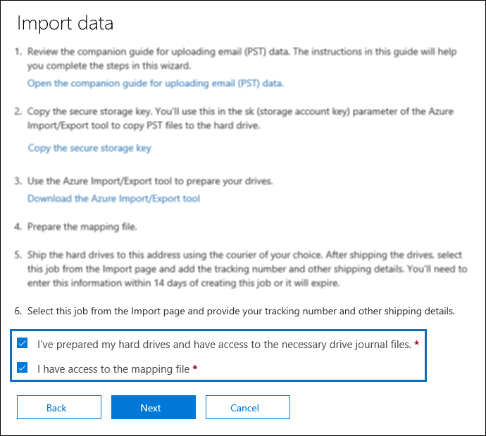
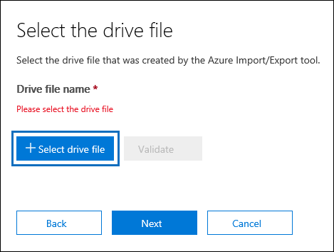

# <a name="use-drive-shipping-to-import-your-organizations-pst-files"></a><span data-ttu-id="7c2ef-103">Verwenden des Laufwerkversands zum Importieren der PST-Dateien Ihrer Organisation</span><span class="sxs-lookup"><span data-stu-id="7c2ef-103">Use drive shipping to import your organization's PST files</span></span>

<span data-ttu-id="7c2ef-104">**Dieser Artikel ist für Administratoren vorgesehen. Versuchen Sie, PST-Dateien in Ihr eigenes Postfach zu importieren? Weitere Informationen finden Sie unter Importieren von [E-Mails, Kontakten und Kalendern aus Outlook PST-Datei](https://go.microsoft.com/fwlink/p/?LinkID=785075)**</span><span class="sxs-lookup"><span data-stu-id="7c2ef-104">**This article is for administrators. Are you trying to import PST files to your own mailbox? See [Import email, contacts, and calendar from an Outlook .pst file](https://go.microsoft.com/fwlink/p/?LinkID=785075)**</span></span>
   
<span data-ttu-id="7c2ef-105">Verwenden Sie Office 365 Dienst importieren und den Laufwerkversand zum Massenimport von PST-Dateien in Benutzerpostfächer verwenden.</span><span class="sxs-lookup"><span data-stu-id="7c2ef-105">Use the Office 365 Import service and drive shipping to bulk-import PST files to user mailboxes.</span></span> <span data-ttu-id="7c2ef-106">Beim Laufwerkversand kopieren Sie die PST-Dateien auf eine Festplatte und senden diese auf dem Postweg an Microsoft.</span><span class="sxs-lookup"><span data-stu-id="7c2ef-106">Drive shipping means that you copy the PST files to a hard disk drive and then physically ship the drive to Microsoft.</span></span> <span data-ttu-id="7c2ef-107">Wenn Microsoft Ihre Festplatte empfängt, kopiert das Rechenzentrumspersonal die Daten von der Festplatte in einen Speicherbereich in der Microsoft Cloud.</span><span class="sxs-lookup"><span data-stu-id="7c2ef-107">When Microsoft receives your hard drive, data center personnel copies the data from the hard drive to a storage area in the Microsoft cloud.</span></span> <span data-ttu-id="7c2ef-108">Anschließend haben Sie die Möglichkeit, die in die Zielpostfächer importierten PST-Daten zu kürzen, indem Sie Filter festlegen, die steuern, welche Daten importiert werden.</span><span class="sxs-lookup"><span data-stu-id="7c2ef-108">Then you have the opportunity to trim the PST data that's imported to the target mailboxes by setting filters that control what data gets imported.</span></span> <span data-ttu-id="7c2ef-109">Nachdem Sie den Importauftrag gestartet haben, importiert der Importdienst die PST-Daten aus dem Speicherbereich in Benutzerpostfächer.</span><span class="sxs-lookup"><span data-stu-id="7c2ef-109">After you start the import job, the Import service imports the PST data from the storage area to user mailboxes.</span></span> <span data-ttu-id="7c2ef-110">Die Verwendung des Laufwerkversands zum Importieren von PST-Dateien in Benutzerpostfächer ist eine Möglichkeit, die E-Mails Ihrer Organisation zu Office 365.</span><span class="sxs-lookup"><span data-stu-id="7c2ef-110">Using drive shipping to import PST files to user mailboxes is one way to migrate your organization's email to Office 365.</span></span>
  
<span data-ttu-id="7c2ef-111">Hier sind die schritte, die zum Importieren von PST-Dateien in Microsoft 365 verwendet werden müssen:</span><span class="sxs-lookup"><span data-stu-id="7c2ef-111">Here are the steps required to use drive shipping to import PST files to Microsoft 365 mailboxes:</span></span>
  
[<span data-ttu-id="7c2ef-112">Schritt 1: Herunterladen des Sicheren Speicherschlüssels und des PST-Importtools</span><span class="sxs-lookup"><span data-stu-id="7c2ef-112">Step 1: Download the secure storage key and PST Import tool</span></span>](#step-1-download-the-secure-storage-key-and-pst-import-tool)

[<span data-ttu-id="7c2ef-113">Schritt 2: Kopieren der PST-Dateien auf die Festplatte</span><span class="sxs-lookup"><span data-stu-id="7c2ef-113">Step 2: Copy the PST files to the hard drive</span></span>](#step-2-copy-the-pst-files-to-the-hard-drive)

[<span data-ttu-id="7c2ef-114">Schritt 3: Erstellen der PST-Importzuordnungsdatei</span><span class="sxs-lookup"><span data-stu-id="7c2ef-114">Step 3: Create the PST Import mapping file</span></span>](#step-3-create-the-pst-import-mapping-file)

[<span data-ttu-id="7c2ef-115">Schritt 4: Erstellen eines PST-Importauftrags in Office 365</span><span class="sxs-lookup"><span data-stu-id="7c2ef-115">Step 4: Create a PST Import job in Office 365</span></span>](#step-4-create-a-pst-import-job-in-office-365)

[<span data-ttu-id="7c2ef-116">Schritt 5: Versenden der Festplatte an Microsoft</span><span class="sxs-lookup"><span data-stu-id="7c2ef-116">Step 5: Ship the hard drive to Microsoft</span></span>](#step-5-ship-the-hard-drive-to-microsoft)

[<span data-ttu-id="7c2ef-117">Schritt 6: Filtern von Daten und Starten des PST-Importauftrags</span><span class="sxs-lookup"><span data-stu-id="7c2ef-117">Step 6: Filter data and start the PST Import job</span></span>](#step-6-filter-data-and-start-the-pst-import-job)
  
> [!IMPORTANT]
> <span data-ttu-id="7c2ef-118">Sie müssen Schritt 1 einmal ausführen, um den sicheren Speicherschlüssel und das Importtool zu laden.</span><span class="sxs-lookup"><span data-stu-id="7c2ef-118">You have to perform Step 1 once to down load the secure storage key and the import tool.</span></span> <span data-ttu-id="7c2ef-119">Folgen Sie nach dem Ausführen dieser Schritte Schritt 2 bis Schritt 6 jedes Mal, wenn Sie eine Festplatte an Microsoft senden möchten.</span><span class="sxs-lookup"><span data-stu-id="7c2ef-119">After you perform these steps, follow Step 2 through Step 6 each time you want to ship a hard drive to Microsoft.</span></span> 
  
<span data-ttu-id="7c2ef-120">Häufig gestellte Fragen zur Verwendung des Laufwerkversands zum Importieren von PST-Dateien in Office 365 finden Sie unter [FAQs for using drive shipping to import PST files](./faqimporting-pst-files-to-office-365.yml#using-drive-shipping-to-import-pst-files).</span><span class="sxs-lookup"><span data-stu-id="7c2ef-120">For frequently asked questions about using drive shipping to import PST files to Office 365, see [FAQs for using drive shipping to import PST files](./faqimporting-pst-files-to-office-365.yml#using-drive-shipping-to-import-pst-files).</span></span> 
  
## <a name="before-you-import-pst-files"></a><span data-ttu-id="7c2ef-121">Vor dem Importieren von PST-Dateien</span><span class="sxs-lookup"><span data-stu-id="7c2ef-121">Before you import PST files</span></span>

- <span data-ttu-id="7c2ef-122">Ihnen muss die Rolle für den Postfachimport/-export in Exchange Online zugewiesen werden, damit Sie PST-Dateien in Microsoft 365-Postfächer importieren können.</span><span class="sxs-lookup"><span data-stu-id="7c2ef-122">You have to be assigned the Mailbox Import Export role in Exchange Online to import PST files to Microsoft 365 mailboxes.</span></span> <span data-ttu-id="7c2ef-123">Standardmäßig ist diese Rolle keiner Rollengruppe in Exchange Online zugewiesen.</span><span class="sxs-lookup"><span data-stu-id="7c2ef-123">By default, this role isn't assigned to any role group in Exchange Online.</span></span> <span data-ttu-id="7c2ef-124">Sie können die Rolle „Postfachimport/-export“ zur Rollengruppe „Organisationsverwaltung“ hinzufügen.</span><span class="sxs-lookup"><span data-stu-id="7c2ef-124">You can add the Mailbox Import Export role to the Organization Management role group.</span></span> <span data-ttu-id="7c2ef-125">Oder Sie erstellen eine Rollengruppe, weisen die Rolle „Postfachimport/-export“ zu und fügen sich dann selbst als Mitglied hinzu.</span><span class="sxs-lookup"><span data-stu-id="7c2ef-125">Or you can create a role group, assign the Mailbox Import Export role, and then add yourself as a member.</span></span> <span data-ttu-id="7c2ef-126">Weitere Informationen finden Sie im Abschnitt "Hinzufügen einer Rolle zu einer Rollengruppe" oder "Erstellen einer Rollengruppe" in [Verwalten von Rollengruppen](/Exchange/permissions-exo/role-groups).</span><span class="sxs-lookup"><span data-stu-id="7c2ef-126">For more information, see the "Add a role to a role group" or the "Create a role group" sections in [Manage role groups](/Exchange/permissions-exo/role-groups).</span></span>
    
    <span data-ttu-id="7c2ef-127">Darüber hinaus muss eine der folgenden Bedingungen erfüllt sein, um Importaufträge im Security & Compliance Center erstellen zu können:</span><span class="sxs-lookup"><span data-stu-id="7c2ef-127">Additionally, to create import jobs in the Security & Compliance Center, one of the following must be true:</span></span>
    
  - <span data-ttu-id="7c2ef-128">Ihnen muss in Exchange Online die Rolle „E-Mail-Empfänger“ zugewiesen sein.</span><span class="sxs-lookup"><span data-stu-id="7c2ef-128">You have to be assigned the Mail Recipients role in Exchange Online.</span></span> <span data-ttu-id="7c2ef-129">Standardmäßig wird diese Rolle den Rollengruppen "Organisationsverwaltung" und "Empfängerverwaltung" zugewiesen.</span><span class="sxs-lookup"><span data-stu-id="7c2ef-129">By default, this role is assigned to the Organization Management and Recipient Management roles groups.</span></span>
    
    <span data-ttu-id="7c2ef-130">Oder</span><span class="sxs-lookup"><span data-stu-id="7c2ef-130">Or</span></span>
    
  - <span data-ttu-id="7c2ef-131">Sie müssen ein globaler Administrator in Ihrer Organisation sein.</span><span class="sxs-lookup"><span data-stu-id="7c2ef-131">You have to be a global administrator in your organization.</span></span>
    
    > [!TIP]
    > <span data-ttu-id="7c2ef-132">Erwägen Sie, in Exchange Online eine neue Rollengruppe speziell zum Importieren von PST-Dateien nach Office 365 zu erstellen.</span><span class="sxs-lookup"><span data-stu-id="7c2ef-132">Consider creating a new role group in Exchange Online that's specifically intended for importing PST files to Office 365.</span></span> <span data-ttu-id="7c2ef-133">Legen Sie für die neue Rollengruppe als mindestens erforderliche Berechtigungen zum Importieren von PST-Dateien die Rollen "Postfachimport/-export" und "E-Mail-Empfänger" fest, und fügen Sie anschließend Mitglieder hinzu.</span><span class="sxs-lookup"><span data-stu-id="7c2ef-133">For the minimum level of privileges required to import PST files, assign the Mailbox Import Export and Mail Recipients roles to the new role group, and then add members.</span></span> 
  
- <span data-ttu-id="7c2ef-134">Sie müssen die PST-Dateien, die Sie auf die Festplatte kopieren möchten, auf einem Dateiserver oder einem freigegebenen Ordner in Ihrer Organisation speichern.</span><span class="sxs-lookup"><span data-stu-id="7c2ef-134">You need to store the PST files that you want to copy to a hard drive on a file server or shared folder in your organization.</span></span> <span data-ttu-id="7c2ef-135">In Schritt 2 führen Sie das Azure Import Export Tool (WAImportExport.exe) aus, das die auf diesem Dateiserver oder freigegebenen Ordner gespeicherten PST-Dateien auf die Festplatte kopiert.</span><span class="sxs-lookup"><span data-stu-id="7c2ef-135">In Step 2, you run the Azure Import Export tool (WAImportExport.exe) that copies the PST files that are stored on this file server or shared folder to the hard drive.</span></span>

- <span data-ttu-id="7c2ef-136">Große PST-Dateien können sich auf die Leistung des PST-Importprozesses auswirken.</span><span class="sxs-lookup"><span data-stu-id="7c2ef-136">Large PST files may impact the performance of the PST import process.</span></span> <span data-ttu-id="7c2ef-137">Daher wird empfohlen, dass jede PST-Datei, die Sie in Schritt 2 auf die Festplatte kopieren, nicht größer als 20 GB sein sollte.</span><span class="sxs-lookup"><span data-stu-id="7c2ef-137">So we recommend that each PST file you copy to the hard drive in Step 2 should be no larger than 20 GB.</span></span>
    
- <span data-ttu-id="7c2ef-138">Nur 2,5-Zoll-SSDs (Solid-State Drives) oder 2,5-Zoll- oder 3,5-Zoll-SATA II/III-interne Festplatten werden für die Verwendung mit dem Office 365-Importdienst unterstützt.</span><span class="sxs-lookup"><span data-stu-id="7c2ef-138">Only 2.5-inch solid-state drives (SSDs) or 2.5-inch or 3.5-inch SATA II/III internal hard drives are supported for use with the Office 365 Import service.</span></span> <span data-ttu-id="7c2ef-139">Sie können Festplatten bis zu 10 TB verwenden.</span><span class="sxs-lookup"><span data-stu-id="7c2ef-139">You can use hard drives up to 10 TB.</span></span> <span data-ttu-id="7c2ef-140">Bei Importaufträgen wird nur das erste Datenvolume auf der Festplatte verarbeitet.</span><span class="sxs-lookup"><span data-stu-id="7c2ef-140">For import jobs, only the first data volume on the hard drive will be processed.</span></span> <span data-ttu-id="7c2ef-141">Das Datenvolume muss mit NTFS formatiert sein.</span><span class="sxs-lookup"><span data-stu-id="7c2ef-141">The data volume must be formatted with NTFS.</span></span> <span data-ttu-id="7c2ef-142">Beim Kopieren von Daten auf eine Festplatte können Sie sie direkt mit einer 2,5-Zoll-SSD oder einem 2,5-Zoll- oder 3,5-Zoll-SATA II/III-Connector anfügen oder extern mit einer externen 2,5-Zoll-SSD oder einem 2,5-Zoll- oder 3,5-Zoll-SATA II/III-USB-Adapter anfügen.</span><span class="sxs-lookup"><span data-stu-id="7c2ef-142">When copying data to a hard drive, you can attach it directly using a 2.5-inch SSD or 2.5-inch or 3.5-inch SATA II/III connector or you can attach it externally using an external 2.5-inch SSD or 2.5-inch or 3.5-inch SATA II/III USB adaptor.</span></span>
    
    > [!IMPORTANT]
    > <span data-ttu-id="7c2ef-143">Externe Festplatten mit einem integrierten USB-Adapter werden vom Office 365-Importdienst nicht unterstützt.</span><span class="sxs-lookup"><span data-stu-id="7c2ef-143">External hard drives that come with an built-in USB adaptor aren't supported by the Office 365 Import service.</span></span> <span data-ttu-id="7c2ef-144">Darüber hinaus kann der Datenträger innerhalb des Gehäuses einer externen Festplatte nicht verwendet werden.</span><span class="sxs-lookup"><span data-stu-id="7c2ef-144">Additionally, the disk inside the casing of an external hard drive can't be used.</span></span> <span data-ttu-id="7c2ef-145">Versenden Sie keine externen Festplatten.</span><span class="sxs-lookup"><span data-stu-id="7c2ef-145">Please don't ship external hard drives.</span></span> 
  
- <span data-ttu-id="7c2ef-146">Die Festplatte, auf die Sie die PST-Dateien kopieren, muss mit BitLocker verschlüsselt sein.</span><span class="sxs-lookup"><span data-stu-id="7c2ef-146">The hard drive that you copy the PST files to must be encrypted with BitLocker.</span></span> <span data-ttu-id="7c2ef-147">Das Tool WAImportExport.exe, das Sie in Schritt 2 ausführen, unterstützt Sie bei der Einrichtung von BitLocker.</span><span class="sxs-lookup"><span data-stu-id="7c2ef-147">The WAImportExport.exe tool that you run in Step 2 will help you set up BitLocker.</span></span> <span data-ttu-id="7c2ef-148">Außerdem wird ein BitLocker generiert, den Mitarbeiter des Microsoft Rechenzentrums verwenden, um auf das Laufwerk zu zugreifen, um die PST-Dateien in den Azure Storage in der Microsoft Cloud hochzuladen.</span><span class="sxs-lookup"><span data-stu-id="7c2ef-148">It also generates a BitLocker encryption key that Microsoft data center personnel use to access the drive to upload the PST files to the Azure Storage area in the Microsoft cloud.</span></span>
    
- <span data-ttu-id="7c2ef-149">Der Laufwerkversand ist über ein Microsoft Enterprise Agreement (EA) verfügbar.</span><span class="sxs-lookup"><span data-stu-id="7c2ef-149">Drive shipping is available through a Microsoft Enterprise Agreement (EA).</span></span> <span data-ttu-id="7c2ef-150">Der Laufwerkversand steht nicht im Rahmen von Microsoft Products und Services Agreement (MPSA) zur Verfügung.</span><span class="sxs-lookup"><span data-stu-id="7c2ef-150">Drive shipping isn't available through a Microsoft Products and Services Agreement (MPSA).</span></span>
    
- <span data-ttu-id="7c2ef-151">Die Kosten für den Import von PST-Dateien Microsoft 365 Postfächern mithilfe des Laufwerkversands beträgt 2 USD pro GB Daten.</span><span class="sxs-lookup"><span data-stu-id="7c2ef-151">The cost to import PST files to Microsoft 365 mailboxes using drive shipping is $2 USD per GB of data.</span></span> <span data-ttu-id="7c2ef-152">Wenn Sie z. B. eine Festplatte versenden, die 1.000 GB (1 TB) an PST-Dateien enthält, betragen die Kosten beispielsweise 2.000 Euro.</span><span class="sxs-lookup"><span data-stu-id="7c2ef-152">For example, if you ship a hard drive that contains 1,000 GB (1 TB) of PST files, the cost is $2,000 USD.</span></span> <span data-ttu-id="7c2ef-153">Um die Importgebühren zu zahlen, können Sie mit einem Partner zusammenarbeiten.</span><span class="sxs-lookup"><span data-stu-id="7c2ef-153">You can work with a partner to pay the import fee.</span></span> <span data-ttu-id="7c2ef-154">Informationen zum Suchen von Partnern finden Sie unter [Microsoft-Partner oder -Händler finden](../admin/manage/find-your-partner-or-reseller.md).</span><span class="sxs-lookup"><span data-stu-id="7c2ef-154">For information about finding a partner, see [Find your Microsoft partner or reseller](../admin/manage/find-your-partner-or-reseller.md).</span></span>
    
- <span data-ttu-id="7c2ef-155">Sie bzw. Ihre Organisation müssen über ein Konto bei FedEx oder DHL verfügen. </span><span class="sxs-lookup"><span data-stu-id="7c2ef-155">You or your organization must have an account with FedEx or DHL.</span></span>
    
  - <span data-ttu-id="7c2ef-156">Organisationen in den USA, Brasilien und Europa müssen über FedEx-Konten verfügen.</span><span class="sxs-lookup"><span data-stu-id="7c2ef-156">Organizations in the United States, Brazil, and Europe must have FedEx accounts.</span></span>
    
  - <span data-ttu-id="7c2ef-157">Organisationen in Ostasien, Südostasien, Japan, der Republik Korea und Australien müssen über DHL-Konten verfügen.</span><span class="sxs-lookup"><span data-stu-id="7c2ef-157">Organizations in East Asia, Southeast Asia, Japan, Republic of Korea, and Australia must have DHL accounts.</span></span>
    
    <span data-ttu-id="7c2ef-158">Microsoft verwendet (und berechnet) dieses Konto, um die Festplatte an Sie zurückzukehren.</span><span class="sxs-lookup"><span data-stu-id="7c2ef-158">Microsoft uses (and charges) this account to return the hard drive back to you.</span></span>
    
- <span data-ttu-id="7c2ef-159">Die Festplatte, die Sie an Microsoft senden, kann internationale Grenzen überschreiten.</span><span class="sxs-lookup"><span data-stu-id="7c2ef-159">The hard drive that you ship to Microsoft may cross international borders.</span></span> <span data-ttu-id="7c2ef-160">In diesem Fall sind Sie dafür verantwortlich, sicherzustellen, dass die Festplatte und die daten, die sie enthält, gemäß den geltenden Gesetzen importiert und/oder exportiert werden.</span><span class="sxs-lookup"><span data-stu-id="7c2ef-160">In this case, you're responsible for ensuring that the hard drive and the data it contains are imported and/or exported in accordance with the applicable laws.</span></span> <span data-ttu-id="7c2ef-161">Überprüfen Sie vor dem Versand einer Festplatte bei Ihren Beratern, ob Ihr Laufwerk und Ihre Daten legal an das identifizierte Microsoft-Rechenzentrum gesendet werden können.</span><span class="sxs-lookup"><span data-stu-id="7c2ef-161">Before shipping a hard drive, check with your advisors to verify that your drive and data can legally be shipped to the identified Microsoft data center.</span></span> <span data-ttu-id="7c2ef-162">Dadurch wird sichergestellt, dass microsoft zeitnah erreicht wird.</span><span class="sxs-lookup"><span data-stu-id="7c2ef-162">This helps to ensure that it reaches Microsoft in a timely manner.</span></span>
    
- <span data-ttu-id="7c2ef-163">Bei diesem Verfahren werden ein sicherer Speicherschlüssel und ein BitLocker-Verschlüsselungsschlüssel kopiert und gespeichert.</span><span class="sxs-lookup"><span data-stu-id="7c2ef-163">This procedure involves copying and saving a secure storage key and a BitLocker encryption key.</span></span> <span data-ttu-id="7c2ef-164">Ergreifen Sie entsprechende Vorsichtsmaßnahmen, um diese Schlüssel so zu schützen, wie Sie Kennwörter oder andere Sicherheitsinformationen schützen würden.</span><span class="sxs-lookup"><span data-stu-id="7c2ef-164">Be sure to take precautions to protect these keys like you would protect passwords or other security-related information.</span></span> <span data-ttu-id="7c2ef-165">Sie können sie zum Beispiel in einem kennwortgeschützten Microsoft Word-Dokument oder auf einem verschlüsselten USB-Laufwerk speichern.</span><span class="sxs-lookup"><span data-stu-id="7c2ef-165">For example, you might save them to a password-protected Microsoft Word document or save them to an encrypted USB drive.</span></span> <span data-ttu-id="7c2ef-166">Ein Beispiel [für diese Schlüssel](#more-information) finden Sie im Abschnitt Weitere Informationen.</span><span class="sxs-lookup"><span data-stu-id="7c2ef-166">See the [More information](#more-information) section for an example of these keys.</span></span> 
    
- <span data-ttu-id="7c2ef-167">Nachdem PST-Dateien in ein postfach Microsoft 365 importiert wurden, ist die Aufbewahrungsaufbewahrungseinstellung für das Postfach für unbestimmte Zeit aktiviert.</span><span class="sxs-lookup"><span data-stu-id="7c2ef-167">After PST files are imported to a Microsoft 365 mailbox, the retention hold setting for the mailbox is turned on for an indefinite duration.</span></span> <span data-ttu-id="7c2ef-168">Dies bedeutet: Die dem Postfach zugewiesene Aufbewahrungsrichtlinie wird erst verarbeitet, nachdem Sie das Anhalten der Aufbewahrungszeit deaktiviert oder aber ein Datum zum Deaktivieren des Anhaltens festgelegt haben.</span><span class="sxs-lookup"><span data-stu-id="7c2ef-168">This means that the retention policy assigned to the mailbox won't be processed until you turn off the retention hold or set a date to turn off the hold.</span></span> <span data-ttu-id="7c2ef-169">Warum tun wir dies?</span><span class="sxs-lookup"><span data-stu-id="7c2ef-169">Why do we do this?</span></span> <span data-ttu-id="7c2ef-170">Wenn die in ein Postfach importierten Nachrichten alt sind, werden sie möglicherweise endgültig gelöscht, weil ihr Aufbewahrungszeitraum, basierend auf den für das Postfach konfigurierten Aufbewahrungseinstellungen, abgelaufen ist.</span><span class="sxs-lookup"><span data-stu-id="7c2ef-170">If messages imported to a mailbox are old, they might be permanently deleted (purged) because their retention period has expired based on the retention settings configured for the mailbox.</span></span> <span data-ttu-id="7c2ef-171">Wenn Sie das Postfach auf Anhalten der Aufbewahrungszeit setzen, erhält der Postfachbesitzer Zeit zum Verwalten dieser neu importierten Nachrichten, oder Sie erhalten Zeit zum Ändern der Aufbewahrungseinstellungen für das Postfach.</span><span class="sxs-lookup"><span data-stu-id="7c2ef-171">Placing the mailbox on retention hold gives the mailbox owner time to manage these newly imported messages or give you time to change the retention settings for the mailbox.</span></span> <span data-ttu-id="7c2ef-172">Vorschläge [zum](#more-information) Verwalten des Aufbewahrungsspeichers finden Sie im Abschnitt Weitere Informationen.</span><span class="sxs-lookup"><span data-stu-id="7c2ef-172">See the [More information](#more-information) section for suggestions about managing the retention hold.</span></span> 
    
- <span data-ttu-id="7c2ef-173">Standardmäßig beträgt die maximale Nachrichtengröße, die von einem Microsoft 365-Postfach empfangen werden kann, 35 MB.</span><span class="sxs-lookup"><span data-stu-id="7c2ef-173">By default, the maximum message size that can be received by a Microsoft 365 mailbox is 35 MB.</span></span> <span data-ttu-id="7c2ef-174">Der Grund hierfür ist, dass der Standardwert für die Eigenschaft *MaxReceiveSize* für ein Postfach auf 35 MB festgelegt ist.</span><span class="sxs-lookup"><span data-stu-id="7c2ef-174">That's because the default value for the  *MaxReceiveSize*  property for a mailbox is set to 35 MB.</span></span> <span data-ttu-id="7c2ef-175">Der Grenzwert für die maximale Größe empfangener Nachrichten in Microsoft 365 beträgt jedoch 150 MB.</span><span class="sxs-lookup"><span data-stu-id="7c2ef-175">However, the limit for the maximum message receive size in Microsoft 365 is 150 MB.</span></span> <span data-ttu-id="7c2ef-176">Wenn Sie also eine PST-Datei importieren, die ein Element enthält, das größer als 35 MB ist, ändert der Office 365-Importdienst den Wert der Eigenschaft *MaxReceiveSize* für das Zielpostfach automatisch in "150 MB".</span><span class="sxs-lookup"><span data-stu-id="7c2ef-176">So if you import a PST file that contains an item larger than 35 MB, the Office 365 Import service we will automatically change the value of the  *MaxReceiveSize*  property on the target mailbox to 150 MB.</span></span> <span data-ttu-id="7c2ef-177">Dadurch können Nachrichten mit bis zu 150 MB in Benutzerpostfächer importiert werden.</span><span class="sxs-lookup"><span data-stu-id="7c2ef-177">This allows messages up to 150 MB to be imported to user mailboxes.</span></span> 
    
    > [!TIP]
    > <span data-ttu-id="7c2ef-178">Wenn Sie die Größe empfangener Nachrichten für ein Postfach ermitteln möchten, können Sie diesen Befehl in Exchange Online PowerShell ausführen: `Get-Mailbox <user mailbox> | FL MaxReceiveSize`.</span><span class="sxs-lookup"><span data-stu-id="7c2ef-178">To identify the message receive size for a mailbox, you can run this command in Exchange Online PowerShell:  `Get-Mailbox <user mailbox> | FL MaxReceiveSize`.</span></span> 
  
- <span data-ttu-id="7c2ef-179">Sie können PST-Dateien in ein inaktives Postfach in Office 365 importieren.</span><span class="sxs-lookup"><span data-stu-id="7c2ef-179">You can import PST files to an inactive mailbox in Office 365.</span></span> <span data-ttu-id="7c2ef-180">Geben Sie hierzu den GUID des inaktiven Postfachs im Parameter `Mailbox` in der PST-Importzuordnungsdatei an.</span><span class="sxs-lookup"><span data-stu-id="7c2ef-180">You do this by specifying the GUID of the inactive mailbox in the  `Mailbox` parameter in the PST Import mapping file.</span></span> <span data-ttu-id="7c2ef-181">Weitere Informationen finden Sie unter [Schritt 3: Erstellen der PST-Importzuordnungsdatei.](#step-3-create-the-pst-import-mapping-file)</span><span class="sxs-lookup"><span data-stu-id="7c2ef-181">See [Step 3: Create the PST Import mapping file](#step-3-create-the-pst-import-mapping-file) for more information.</span></span> 
    
- <span data-ttu-id="7c2ef-182">In einer Exchange-Hybridumgebung können Sie PST-Dateien für einen Benutzer, dessen primäres Postfach lokal gehostet wird, in ein cloudbasiertes Archivpostfach importieren.</span><span class="sxs-lookup"><span data-stu-id="7c2ef-182">In an Exchange hybrid deployment, you can import PST files to a cloud-based archive mailbox for a user whose primary mailbox is on-premises.</span></span> <span data-ttu-id="7c2ef-183">Gehen Sie hierzu in der PST-Importzuordnungsdatei folgendermaßen vor:</span><span class="sxs-lookup"><span data-stu-id="7c2ef-183">You do this by doing the following in the PST Import mapping file:</span></span>
    
  - <span data-ttu-id="7c2ef-184">Geben Sie die E-Mail-Adresse des lokalen Postfachs des Benutzers im Parameter `Mailbox` an.</span><span class="sxs-lookup"><span data-stu-id="7c2ef-184">Specify the email address for the user's on-premises mailbox in the  `Mailbox` parameter.</span></span> 
    
  - <span data-ttu-id="7c2ef-185">Geben Sie den Wert **TRUE** im Parameter `IsArchive` an.</span><span class="sxs-lookup"><span data-stu-id="7c2ef-185">Specify the **TRUE** value in the  `IsArchive` parameter.</span></span> 
    
    <span data-ttu-id="7c2ef-186">Weitere Informationen finden Sie unter [Schritt 3: Erstellen der PST-Importzuordnungsdatei.](#step-3-create-the-pst-import-mapping-file)</span><span class="sxs-lookup"><span data-stu-id="7c2ef-186">See [Step 3: Create the PST Import mapping file](#step-3-create-the-pst-import-mapping-file) for more information.</span></span> 

## <a name="step-1-download-the-secure-storage-key-and-pst-import-tool"></a><span data-ttu-id="7c2ef-187">Schritt 1: Herunterladen des Sicheren Speicherschlüssels und des PST-Importtools</span><span class="sxs-lookup"><span data-stu-id="7c2ef-187">Step 1: Download the secure storage key and PST Import tool</span></span>

<span data-ttu-id="7c2ef-188">Der erste Schritt besteht im Herunterladen des sicheren Speicherschlüssels und des Tools, den Sie in Schritt 2 zum Kopieren von PST-Dateien auf die Festplatte verwenden.</span><span class="sxs-lookup"><span data-stu-id="7c2ef-188">The first step is to download the secure storage key and the tool and that you use in Step 2 to copy PST files to the hard drive.</span></span>
  
> [!IMPORTANT]
> <span data-ttu-id="7c2ef-189">Sie müssen Azure Import/Export Tool Version 1 (WAimportExportV1) verwenden, um PST-Dateien mithilfe der Laufwerkversandmethode erfolgreich zu importieren.</span><span class="sxs-lookup"><span data-stu-id="7c2ef-189">You have to use Azure Import/Export tool version 1 (WAimportExportV1) to successfully import PST files by using the drive shipping method.</span></span> <span data-ttu-id="7c2ef-190">Version 2 des Azure Import/Export wird nicht unterstützt, und die Verwendung dieses Tools führt zu einer fehlerhaften Vorbereitung der Festplatte für den Importauftrag.</span><span class="sxs-lookup"><span data-stu-id="7c2ef-190">Version 2 of the Azure Import/Export tool isn't supported and using it will result in incorrectly preparing the hard drive for the import job.</span></span> <span data-ttu-id="7c2ef-191">Laden Sie das Azure Import/Export-Tool aus dem Security & Compliance Center herunter, indem Sie die Verfahren in diesem Schritt durchführen.</span><span class="sxs-lookup"><span data-stu-id="7c2ef-191">Be sure to download the Azure Import/Export tool from the Security & Compliance Center by following the procedures in this step.</span></span> 
  
1. <span data-ttu-id="7c2ef-192">Navigieren Sie zu [https://protection.office.com/](https://protection.office.com/), und melden Sie sich mit den Anmeldeinformationen für ein Administratorkonto in Ihrer Organisation an.</span><span class="sxs-lookup"><span data-stu-id="7c2ef-192">Go to [https://protection.office.com/](https://protection.office.com/) and sign in using the credentials for an administrator account in your organization.</span></span> 
    
2. <span data-ttu-id="7c2ef-193">Klicken Sie im linken Bereich des Security & Compliance Centers auf **Information Governance** \> **Import** \> **Importieren von PST-Dateien**.</span><span class="sxs-lookup"><span data-stu-id="7c2ef-193">In the left pane of the Security & Compliance Center, click **Information governance** \> **Import** \> **Import PST files**.</span></span>
    
    > [!NOTE]
    > <span data-ttu-id="7c2ef-194">Wie bereits erwähnt, müssen Ihnen die entsprechenden  Berechtigungen für den Zugriff auf die Importseite im Security & Compliance Center zugewiesen werden.</span><span class="sxs-lookup"><span data-stu-id="7c2ef-194">As previously stated, you have to be assigned the appropriate permissions to access the **Import** page in the Security & Compliance Center.</span></span> 
  
3. <span data-ttu-id="7c2ef-195">Klicken Sie auf der Seite **Import von PST-Dateien**  **Neuer Importauftrag**.</span><span class="sxs-lookup"><span data-stu-id="7c2ef-195">On the **Import PST files** page, click  **New import job**.</span></span>
    
4. <span data-ttu-id="7c2ef-196">Geben Sie im Assistenten für den Importauftrag einen Namen für den PST-Importauftrag ein, und klicken Sie dann auf **Weiter**.</span><span class="sxs-lookup"><span data-stu-id="7c2ef-196">In the import job wizard, type a name for the PST import job, and then click **Next**.</span></span> <span data-ttu-id="7c2ef-197">Verwenden Sie Kleinbuchstaben, Zahlen, Bindestriche und Unterstriche.</span><span class="sxs-lookup"><span data-stu-id="7c2ef-197">Use lowercase letters, numbers, hyphens, and underscores.</span></span> <span data-ttu-id="7c2ef-198">Sie dürfen weder Großbuchstaben noch Leerzeichen in dem Namen verwenden.</span><span class="sxs-lookup"><span data-stu-id="7c2ef-198">You can't use uppercase letters or include spaces in the name.</span></span>
    
5. <span data-ttu-id="7c2ef-199">Klicken Sie **auf der Seite Auftragstyp** importieren auf **Festplatten** an einen unserer physischen Speicherorte versenden, und klicken Sie dann auf **Weiter**.</span><span class="sxs-lookup"><span data-stu-id="7c2ef-199">On the **Choose import job type** page, click **Ship hard drives to one of our physical locations** and then click **Next**.</span></span>
    
    
  
6. <span data-ttu-id="7c2ef-201">Führen Sie auf der Seite **Daten importieren** einen der folgenden Schritte aus:</span><span class="sxs-lookup"><span data-stu-id="7c2ef-201">On the **Import data** page, do the following two things:</span></span> 
    
    
  
    <span data-ttu-id="7c2ef-203">a.</span><span class="sxs-lookup"><span data-stu-id="7c2ef-203">a.</span></span> <span data-ttu-id="7c2ef-204">Klicken Sie in Schritt 2 auf **Sicherer Speicherschlüssel kopieren.**</span><span class="sxs-lookup"><span data-stu-id="7c2ef-204">In step 2, click **Copy the secure storage key**.</span></span> <span data-ttu-id="7c2ef-205">Nachdem der Speicherschlüssel angezeigt wurde, klicken Sie auf **In** Zwischenablage kopieren, fügen Sie ihn ein, und speichern Sie ihn in einer Datei, damit Sie später darauf zugreifen können.</span><span class="sxs-lookup"><span data-stu-id="7c2ef-205">After the storage key is displayed, click **Copy to clipboard** and then paste it and save it to a file so you can access it later.</span></span>
    
    <span data-ttu-id="7c2ef-206">b.</span><span class="sxs-lookup"><span data-stu-id="7c2ef-206">b.</span></span> <span data-ttu-id="7c2ef-207">Laden Sie in Schritt 3 das **Tool Azure Import/Export herunter,** um das Azure Import/Export (Version 1) herunterzuladen und zu installieren.</span><span class="sxs-lookup"><span data-stu-id="7c2ef-207">In step 3, **Download the Azure Import/Export tool** to download and install the Azure Import/Export (version 1) tool.</span></span>
    
    - <span data-ttu-id="7c2ef-208">Klicken Sie im Popupfenster  auf Speichern unter, um die WaImportExportV1.zip in einem Ordner auf dem lokalen \>  Computer zu speichern.</span><span class="sxs-lookup"><span data-stu-id="7c2ef-208">In the pop-up window, click **Save** \> **Save as** to save the WaImportExportV1.zip file to a folder on your local computer.</span></span> 
    
    - <span data-ttu-id="7c2ef-209">Extrahieren Sie WaImportExportV1.zip Datei.</span><span class="sxs-lookup"><span data-stu-id="7c2ef-209">Extract the WaImportExportV1.zip file.</span></span>
    
7. <span data-ttu-id="7c2ef-210">Klicken **Sie auf Abbrechen,** um den Assistenten zu schließen.</span><span class="sxs-lookup"><span data-stu-id="7c2ef-210">Click **Cancel** to close the wizard.</span></span> 
    
    <span data-ttu-id="7c2ef-211">Beim Erstellen des **Importauftrags** in Schritt 4 & Sie zur Seite Importieren im Security & Compliance Center zurück.</span><span class="sxs-lookup"><span data-stu-id="7c2ef-211">You come back to the **Import** page in the Security & Compliance Center when you create the import job in Step 4.</span></span> 

## <a name="step-2-copy-the-pst-files-to-the-hard-drive"></a><span data-ttu-id="7c2ef-212">Schritt 2: Kopieren der PST-Dateien auf die Festplatte</span><span class="sxs-lookup"><span data-stu-id="7c2ef-212">Step 2: Copy the PST files to the hard drive</span></span>

<span data-ttu-id="7c2ef-213">Der nächste Schritt besteht darin, die PST-Dateien mithilfe des Tools WAImportExport.exe auf die Festplatte zu kopieren.</span><span class="sxs-lookup"><span data-stu-id="7c2ef-213">The next step is to use the WAImportExport.exe tool to copy PST files to the hard drive.</span></span> <span data-ttu-id="7c2ef-214">Mit diesem Tool werden die Festplatte mit BitLocker verschlüsselt, die PST-Dateien auf die Festplatte kopiert und eine Journaldatei erstellt, die Informationen zum Kopiervorgang speichert.</span><span class="sxs-lookup"><span data-stu-id="7c2ef-214">This tool encrypts the hard drive with BitLocker, copies the PSTs to the hard drive, and creates a journal file that stores information about the copy process.</span></span> <span data-ttu-id="7c2ef-215">Damit Sie diesen Schritt ausführen können, müssen sich die PST-Dateien in einer Dateifreigabe oder auf einem Dateiserver in Ihrer Organisation befinden.</span><span class="sxs-lookup"><span data-stu-id="7c2ef-215">To complete this step, the PST files have to be located in a file share or file server in your organization.</span></span> <span data-ttu-id="7c2ef-216">Im folgenden Verfahren wird dies als das Quellverzeichnis bezeichnet.</span><span class="sxs-lookup"><span data-stu-id="7c2ef-216">This is known as the source directory in the following procedure.</span></span> 

 <span data-ttu-id="7c2ef-217">Wie bereits erwähnt, sollte jede PST-Datei, die Sie auf die Festplatte kopieren, nicht größer als 20 GB sein.</span><span class="sxs-lookup"><span data-stu-id="7c2ef-217">As previously stated, each PST file that you copy to the hard drive should be no larger than 20 GB.</span></span> <span data-ttu-id="7c2ef-218">PST-Dateien mit mehr als 20 GB können sich auf die Leistung des PST-Importprozesses auswirken, die Sie in Schritt 6 starten.</span><span class="sxs-lookup"><span data-stu-id="7c2ef-218">PST files larger than 20 GB may impact the performance of the PST import process that you start in Step 6.</span></span>
  
> [!IMPORTANT]
> <span data-ttu-id="7c2ef-219">Nach der ersten Verwendung des Tools WAImportExport.exe für ein Laufwerk müssen Sie jedes weitere Mal eine andere Syntax verwenden.</span><span class="sxs-lookup"><span data-stu-id="7c2ef-219">After you run the WAImportExport.exe tool the first time for a hard drive, you have to use a different syntax each time after that.</span></span> <span data-ttu-id="7c2ef-220">Diese Syntax wird in Schritt 4 dieses Verfahrens erläutert, um #A0 auf die Festplatte zu kopieren.</span><span class="sxs-lookup"><span data-stu-id="7c2ef-220">This syntax is explained in step 4 of this procedure to copy PST files to the hard drive.</span></span> 
  
1. <span data-ttu-id="7c2ef-221">Öffnen Sie eine Eingabeaufforderung auf dem lokalen Computer.</span><span class="sxs-lookup"><span data-stu-id="7c2ef-221">Open a Command Prompt on your local computer.</span></span>
    
    > [!TIP]
    > <span data-ttu-id="7c2ef-p126">Wenn Sie die Eingabeaufforderung als Administrator ausführen (durch Auswahl von „Als Administrator ausführen“ beim Öffnen), werden im Fenster der Eingabeaufforderung Fehlermeldungen angezeigt. Dies kann Ihnen bei der Behandlung von Problemen beim Ausführen des Tools „WAImportExport.exe“ helfen.</span><span class="sxs-lookup"><span data-stu-id="7c2ef-p126">If you run the command prompt as an administrator (by selecting "Run as administrator" when you open it) error messages will be displayed in the command prompt window. This can help you troubleshoot problems running the WAImportExport.exe tool.</span></span> 
  
2. <span data-ttu-id="7c2ef-224">Wechseln Sie zu dem Verzeichnis, in dem Sie das Tool „WAImportExport.exe“ in Schritt 1 installiert haben.</span><span class="sxs-lookup"><span data-stu-id="7c2ef-224">Go to the directory where you installed the WAImportExport.exe tool in Step 1.</span></span>
    
3. <span data-ttu-id="7c2ef-225">Wenn Sie „WAImportExport.exe“ zum ersten Mal verwenden, um die PST-Dateien auf eine Festplatte zu kopieren, führen Sie den folgenden Befehl aus.</span><span class="sxs-lookup"><span data-stu-id="7c2ef-225">Run the following command the first time that you use the WAImportExport.exe to copy PST files to a hard drive.</span></span>

    ```powershell
    WAImportExport.exe PrepImport /j:<Name of journal file> /t:<Drive letter> /id:<Name of session> /srcdir:<Location of PST files> /dstdir:<PST file path> /sk:<Storage account key> /blobtype:BlockBlob /encrypt /logdir:<Log file location>
    ```

    <span data-ttu-id="7c2ef-226">In der folgenden Tabelle werden die Parameter und deren erforderliche Werte beschrieben.</span><span class="sxs-lookup"><span data-stu-id="7c2ef-226">The following table describes the parameters and their required values.</span></span>
    
    |<span data-ttu-id="7c2ef-227">**Parameter**</span><span class="sxs-lookup"><span data-stu-id="7c2ef-227">**Parameter**</span></span>|<span data-ttu-id="7c2ef-228">**Beschreibung**</span><span class="sxs-lookup"><span data-stu-id="7c2ef-228">**Description**</span></span>|<span data-ttu-id="7c2ef-229">**Beispiel**</span><span class="sxs-lookup"><span data-stu-id="7c2ef-229">**Example**</span></span>|
    |:-----|:-----|:-----|
    | `/j:` <br/> |<span data-ttu-id="7c2ef-p127">Gibt den Namen der Journaldatei an. Diese Datei wird im selben Ordner gespeichert, in dem sich das Tool „WAImportExport.exe“ befindet. Jede Festplatte, die Sie an Microsoft senden, muss eine Journaldatei enthalten. Jedes Mal, wenn Sie „WAImportTool.exe“ zum Kopieren von PST-Dateien auf eine Festplatte ausführen, werden Informationen zur Journaldatei dieser Festplatte hinzugefügt. 
</span><span class="sxs-lookup"><span data-stu-id="7c2ef-p127">Specifies the name of the journal file. This file is saved to the same folder where the WAImportExport.exe tool is located. Each hard drive you ship to Microsoft must have one journal file. Every time you run the WAImportTool.exe to copy PST files to a hard drive, information will be appended to the journal file for that drive.</span></span>  <br/> <span data-ttu-id="7c2ef-234">Mitarbeiter des Microsoft Rechenzentrums verwenden die Informationen in der Journaldatei, um die Festplatte dem in Schritt 4 erstellten Importauftrag zuzuordnen und die PST-Dateien in den bereich Azure Storage in der Microsoft Cloud hochzuladen.</span><span class="sxs-lookup"><span data-stu-id="7c2ef-234">Microsoft data center personnel use the information in the journal file to associate the hard drive with the import job that you create in Step 4, and to upload the PST files to the Azure Storage area in the Microsoft cloud.</span></span>  <br/> | `/j:PSTHDD1.jrn` <br/> |
    | `/t:` <br/> |<span data-ttu-id="7c2ef-235">Gibt den Buchstaben des Laufwerks an, wenn die Festplatte an Ihren lokalen Computer angeschlossen ist.</span><span class="sxs-lookup"><span data-stu-id="7c2ef-235">Specifies the drive letter of the hard drive when it's connected to your local computer.</span></span>  <br/> | `/t:h` <br/> |
    | `/id:` <br/> |<span data-ttu-id="7c2ef-p128">Gibt den Namen der Kopiersitzung an. Eine Sitzung ist definiert als jeder einzelne Vorgang, in dem Sie das Tool „WAImportExport.exe“ ausführen und Dateien auf die Festplatte kopieren. Die PST-Dateien werden in einen Ordner mit dem Namen der Sitzung kopiert, der durch diesen Parameter angegeben wird. </span><span class="sxs-lookup"><span data-stu-id="7c2ef-p128">Specifies the name of the copy session. A session is defined as each time you run the WAImportExport.exe tool to copy files to the hard drive. The PST files are copied to a folder named with the session name specified by this parameter.</span></span>  <br/> | `/id:driveship1` <br/> |
    | `/srcdir:` <br/> |<span data-ttu-id="7c2ef-239">Gibt das Quellverzeichnis in Ihrer Organisation an, das die PST-Dateien enthält, die während der Sitzung kopiert werden.</span><span class="sxs-lookup"><span data-stu-id="7c2ef-239">Specifies the source directory in your organization that contains the PST files that will be copied during the session.</span></span> <span data-ttu-id="7c2ef-240">Beachten Sie, den Wert dieses Parameters in doppelte Anführungszeichen (" ") einzuschließen.</span><span class="sxs-lookup"><span data-stu-id="7c2ef-240">Be sure to surround the value of this parameter with double-quotation marks (" ").</span></span>  <br/> | `/srcdir:"\\FILESERVER01\PSTs"` <br/> |
    | `/dstdir:` <br/> |<span data-ttu-id="7c2ef-241">Gibt das Zielverzeichnis im Azure Storage in der Microsoft Cloud an, in dem die PSTs hochgeladen werden.</span><span class="sxs-lookup"><span data-stu-id="7c2ef-241">Specifies the destination directory in the Azure Storage area in the Microsoft cloud where the PSTs will be uploaded.</span></span> <span data-ttu-id="7c2ef-242">Sie müssen den Wert  `ingestiondata/` verwenden.</span><span class="sxs-lookup"><span data-stu-id="7c2ef-242">You must use the value  `ingestiondata/`.</span></span> <span data-ttu-id="7c2ef-243">Beachten Sie, den Wert dieses Parameters in doppelte Anführungszeichen (" ") einzuschließen.</span><span class="sxs-lookup"><span data-stu-id="7c2ef-243">Be sure to surround the value of this parameter with double-quotation marks (" ").</span></span>  <br/> <span data-ttu-id="7c2ef-244">Optional können Sie dem Wert dieses Parameters auch einen zusätzlichen Dateipfad hinzufügen.</span><span class="sxs-lookup"><span data-stu-id="7c2ef-244">Optionally, you can also add an extra file path to the value of this parameter.</span></span> <span data-ttu-id="7c2ef-245">Sie können z. B. den Dateipfad des Quellverzeichnisses auf der Festplatte (in ein URL-Format konvertiert) verwenden, der im Parameter angegeben  `/srcdir:` ist.</span><span class="sxs-lookup"><span data-stu-id="7c2ef-245">For example, you can use the file path of the source directory on the hard drive (converted to a URL format), which is specified in the  `/srcdir:` parameter.</span></span> <span data-ttu-id="7c2ef-246">Wird z.  `\\FILESERVER01\PSTs` B. in  `FILESERVER01/PSTs` geändert.</span><span class="sxs-lookup"><span data-stu-id="7c2ef-246">For example,  `\\FILESERVER01\PSTs` is changed to  `FILESERVER01/PSTs`.</span></span> <span data-ttu-id="7c2ef-247">In diesem Fall müssen Sie den  `ingestiondata` Dateipfad weiterhin verwenden.</span><span class="sxs-lookup"><span data-stu-id="7c2ef-247">In this case, you still must include  `ingestiondata` in the file path.</span></span> <span data-ttu-id="7c2ef-248">In diesem Beispiel ist der Wert für den  `/dstdir:` Parameter also  `"ingestiondata/FILESERVER01/PSTs"` .</span><span class="sxs-lookup"><span data-stu-id="7c2ef-248">So in this example, the value for the  `/dstdir:` parameter would be  `"ingestiondata/FILESERVER01/PSTs"`.</span></span>  <br/> <span data-ttu-id="7c2ef-249">Das Hinzufügen des zusätzlichen Dateipfads ist z. B. dann sinnvoll, wenn einige Ihrer PST-Dateien den gleichen Dateinamen aufweisen.</span><span class="sxs-lookup"><span data-stu-id="7c2ef-249">One reason to add the additional file path is if you have PSTs files with the same filename.</span></span>  <br/> <span data-ttu-id="7c2ef-250">> [!NOTE]> Wenn Sie den optionalen Pfadnamen eingeben, enthält der Namespace für eine #A0 nach dem Hochladen in den bereich Azure Storage den Pfadnamen und den Namen der PST-Datei. Beispiel: `FILESERVER01/PSTs/annb.pst` .</span><span class="sxs-lookup"><span data-stu-id="7c2ef-250">> [!NOTE]> If you include the optional pathname, the namespace for a PST file after it's uploaded to the Azure Storage area includes the pathname and the name of the PST file; for example,  `FILESERVER01/PSTs/annb.pst`.</span></span> <span data-ttu-id="7c2ef-251">Wenn Sie keinen Pfadnamen eingeben, ist der Namespace nur der PST-Dateiname. beispiel:  `annb.pst` .</span><span class="sxs-lookup"><span data-stu-id="7c2ef-251">If you don't include a pathname, the namespace is only the PST filename; for example  `annb.pst`.</span></span>           | `/dstdir:"ingestiondata/"` <br/> <span data-ttu-id="7c2ef-252">Oder</span><span class="sxs-lookup"><span data-stu-id="7c2ef-252">Or</span></span>  <br/>  `/dstdir:"ingestiondata/FILESERVER01/PSTs"` <br/> |
    | `/sk:` <br/> |<span data-ttu-id="7c2ef-253">Gibt den Speicherkontoschlüssel an, den Sie in Schritt 1 abgerufen haben.</span><span class="sxs-lookup"><span data-stu-id="7c2ef-253">Specifies the storage account key that you obtained in Step 1.</span></span> <span data-ttu-id="7c2ef-254">Beachten Sie, den Wert dieses Parameters in doppelte Anführungszeichen (" ") einzuschließen.</span><span class="sxs-lookup"><span data-stu-id="7c2ef-254">Be sure to surround the value of this parameter with double-quotation marks (" ").</span></span>  <br/> | `"yaNIIs9Uy5g25Yoak+LlSHfqVBGOeNwjqtBEBGqRMoidq6/e5k/VPkjOXdDIXJHxHvNoNoFH5NcVUJXHwu9ZxQ=="` <br/> |
    | `/blobtype:` <br/> |Gibt den Typ der Blobs im Bereich Azure Storage an, in den die PST-Dateien importiert werden. Verwenden Sie zum Importieren von PST-Dateien den Wert **BlockBlob**. <span data-ttu-id="7c2ef-257">Dieser Parameter ist erforderlich.</span><span class="sxs-lookup"><span data-stu-id="7c2ef-257">This parameter is required.</span></span>   <br/> | `/blobtype:BlockBlob` <br/> |
    | `/encrypt` <br/> |<span data-ttu-id="7c2ef-p135">Diese Option aktiviert BitLocker für die Festplatte. Dieser Parameter ist beim erstmaligen Ausführen des Tools „WAImportExport.exe“ erforderlich.  </span><span class="sxs-lookup"><span data-stu-id="7c2ef-p135">This switch turns on BitLocker for the hard drive. This parameter is required the first time you run the WAImportExport.exe tool.  </span></span><br/> <span data-ttu-id="7c2ef-260">Der BitLocker-Verschlüsselungsschlüssel wird in die Journaldatei und die Protokolldatei kopiert, die erstellt wird, wenn Sie den Parameter `/logfile:` verwenden.</span><span class="sxs-lookup"><span data-stu-id="7c2ef-260">The BitLocker encryption key is copied to the journal file and the log file that is created if you use the  `/logfile:` parameter.</span></span> <span data-ttu-id="7c2ef-261">Wie bereits erwähnt wird die Journaldatei im selben Ordner gespeichert, in dem sich das Tool „WAImportExport.exe“ befindet.</span><span class="sxs-lookup"><span data-stu-id="7c2ef-261">As previously explained, the journal file is saved to the same folder where the WAImportExport.exe tool is located.</span></span>  <br/> | `/encrypt` <br/> |
    | `/logdir:` <br/> |<span data-ttu-id="7c2ef-262">Dieser optionale Parameter gibt einen Ordner an, in dem die Protokolldateien gespeichert werden können.</span><span class="sxs-lookup"><span data-stu-id="7c2ef-262">This optional parameter specifies a folder to save log files to.</span></span> <span data-ttu-id="7c2ef-263">Wenn nicht angegeben, werden die Protokolldateien in dem Ordner gespeichert, in dem sich WAImportExport.exe befindet.</span><span class="sxs-lookup"><span data-stu-id="7c2ef-263">If not specified, the log files are saved to the same folder where the WAImportExport.exe tool is located.</span></span> <span data-ttu-id="7c2ef-264">Beachten Sie, den Wert dieses Parameters in doppelte Anführungszeichen (" ") einzuschließen.</span><span class="sxs-lookup"><span data-stu-id="7c2ef-264">Be sure to surround the value of this parameter with double-quotation marks (" ").</span></span>  <br/> | `/logdir:"c:\users\admin\desktop\PstImportLogs"` <br/> |
   
    <span data-ttu-id="7c2ef-265">Nachfolgend sehen Sie ein Beispiel der Syntax für das Tool „WAImportExport.exe“, in dem die tatsächlichen Werte für jeden Parameter verwendet werden:</span><span class="sxs-lookup"><span data-stu-id="7c2ef-265">Here's an example of the syntax for the WAImportExport.exe tool using actual values for each parameter:</span></span>
    
    ```powershell
    WAImportExport.exe PrepImport /j:PSTHDD1.jrn /t:f /id:driveship1 /srcdir:"\\FILESERVER01\PSTs" /dstdir:"ingestiondata/" /sk:"yaNIIs9Uy5g25Yoak+LlSHfqVBGOeNwjqtBEBGqRMoidq6/e5k/VPkjOXdDIXJHxHvNoNoFH5NcVUJXHwu9ZxQ==" blobtype:BlockBlob /encrypt /logdir:"c:\users\admin\desktop\PstImportLogs"
    ```

    <span data-ttu-id="7c2ef-p138">Nachdem Sie den Befehl ausgeführt haben, werden Statusmeldungen angezeigt, die den Fortschritt des Kopierens der PST-Dateien auf die Festplatte anzeigen. Eine endgültige Statusmeldung zeigt die Gesamtzahl der Dateien an, die erfolgreich kopiert wurden. </span><span class="sxs-lookup"><span data-stu-id="7c2ef-p138">After you run the command, status messages are displayed that show the progress of copying the PST files to the hard drive. A final status message shows the total number of files that were successfully copied.</span></span>
    
4. <span data-ttu-id="7c2ef-268">Führen Sie diesen Befehl jedes Mal aus, wenn Sie das Tool „WAImportExport.exe“ zum Kopieren der PST-Dateien auf dieselbe Festplatte ausführen.</span><span class="sxs-lookup"><span data-stu-id="7c2ef-268">Run this command each subsequent time you run the WAImportExport.ext tool to copy PST files to the same hard drive.</span></span>

    ```powershell
    WAImportExport.exe PrepImport /j:<Name of journal file> /id:<Name of new session> /srcdir:<Location of PST files> /dstdir:<PST file path> /blobtype:BlockBlob 
    ```

    <span data-ttu-id="7c2ef-269">Im Folgenden sehen Sie ein Beispiel der Syntax für die Ausführung weiterer Sitzungen zum Kopieren von PST-Dateien auf dieselbe Festplatte.  </span><span class="sxs-lookup"><span data-stu-id="7c2ef-269">Here's an example of the syntax for running subsequent sessions to copy PST files to the same hard drive.</span></span>

    ```powershell
    WAImportExport.exe PrepImport /j:PSTHDD1.jrn /id:driveship2 /srcdir:"\\FILESERVER01\PSTs\SecondBatch" /dstdir:"ingestiondata/" /blobtype:BlockBlob
    ```

## <a name="step-3-create-the-pst-import-mapping-file"></a><span data-ttu-id="7c2ef-270">Schritt 3: Erstellen der PST-Importzuordnungsdatei</span><span class="sxs-lookup"><span data-stu-id="7c2ef-270">Step 3: Create the PST Import mapping file</span></span>

<span data-ttu-id="7c2ef-271">Nachdem Mitarbeiter des Microsoft Rechenzentrums die PST-Dateien von der Festplatte in den bereich Azure Storage hochgeladen haben, verwendet der Importdienst die Informationen in der PST-Importzuordnungsdatei, einer CSV-Datei (Comma-separated Value), die angibt, in welche Benutzerpostfächer die PST-Dateien importiert werden.</span><span class="sxs-lookup"><span data-stu-id="7c2ef-271">After Microsoft data center personnel upload the PST files from the hard drive to the Azure Storage area, the Import service will use the information in the PST Import mapping file, which is a comma-separated value (CSV) file, that specifies which user mailboxes the PST files are imported to.</span></span> <span data-ttu-id="7c2ef-272">Diese CSV-Datei wird im nächsten Schritt übermittelt, wenn Sie einen PST-Importauftrag erstellen.</span><span class="sxs-lookup"><span data-stu-id="7c2ef-272">You will submit this CSV file in the next step when you create a PST Import job.</span></span>
  
1. <span data-ttu-id="7c2ef-273">[Laden Sie eine Kopie der PST-Importzuordnungsdatei herunter](https://go.microsoft.com/fwlink/p/?LinkId=544717).</span><span class="sxs-lookup"><span data-stu-id="7c2ef-273">[Download a copy of the PST Import mapping file](https://go.microsoft.com/fwlink/p/?LinkId=544717).</span></span>
    
2. <span data-ttu-id="7c2ef-p140">Öffnen oder speichern Sie die CSV-Datei auf Ihrem lokalen Computer. Das folgende Beispiel zeigt eine abgeschlossene PST-Importzuordnungsdatei (in Editor geöffnet). Es ist wesentlich einfacher, Microsoft Excel zum Bearbeiten der CSV-Datei zu verwenden.</span><span class="sxs-lookup"><span data-stu-id="7c2ef-p140">Open or save the CSV file to your local computer. The following example shows a completed PST Import mapping file (opened in NotePad). It's much easier to use Microsoft Excel to edit the CSV file.</span></span>

    ```text
    Workload,FilePath,Name,Mailbox,IsArchive,TargetRootFolder,ContentCodePage,SPFileContainer,SPManifestContainer,SPSiteUrl
    Exchange,FILESERVER01/PSTs,annb.pst,annb@contoso.onmicrosoft.com,FALSE,/,,,,
    Exchange,FILESERVER01/PSTs,annb_archive.pst,annb@contoso.onmicrosoft.com,TRUE,/ImportedPst,,,,
    Exchange,FILESERVER01/PSTs,donh.pst,donh@contoso.onmicrosoft.com,FALSE,/,,,,
    Exchange,FILESERVER01/PSTs,donh_archive.pst,donh@contoso.onmicrosoft.com,TRUE,/ImportedPst,,,,
    Exchange,FILESERVER01/PSTs,pilarp.pst,pilarp@contoso.onmicrosoft.com,FALSE,/,,,,
    Exchange,FILESERVER01/PSTs,pilarp_archive.pst,pilarp@contoso.onmicrosoft.com,TRUE,/ImportedPst,,,,
    Exchange,,tonyk.pst,tonyk@contoso.onmicrosoft.com,FALSE,/,,,,
    Exchange,,tonyk_archive.pst,tonyk@contoso.onmicrosoft.com,TRUE,,,,,
    Exchange,,zrinkam.pst,zrinkam@contoso.onmicrosoft.com,FALSE,/,,,,
    Exchange,,zrinkam_archive.pst,zrinkam@contoso.onmicrosoft.com,TRUE,,,,,
    ```

    <span data-ttu-id="7c2ef-277">Die erste Zeile oder Kopfzeile der CSV-Datei enthält die Parameter, die vom PST-Importdienst verwendet werden, um die PST-Dateien in Benutzerpostfächer zu importieren.</span><span class="sxs-lookup"><span data-stu-id="7c2ef-277">The first row, or header row, of the CSV file lists the parameters that will be used by the PST Import service to import the PST files to user mailboxes.</span></span> <span data-ttu-id="7c2ef-278">Die einzelnen Parameternamen werden jeweils durch ein Komma getrennt.</span><span class="sxs-lookup"><span data-stu-id="7c2ef-278">Each parameter name is separated by a comma.</span></span> <span data-ttu-id="7c2ef-279">Jede Zeile unter der Kopfzeile stellt die Parameterwerte für das Importieren einer PST-Datei in ein bestimmtes Postfach dar.</span><span class="sxs-lookup"><span data-stu-id="7c2ef-279">Each row under the header row represents the parameter values for importing a PST file to a specific mailbox.</span></span> <span data-ttu-id="7c2ef-280">Sie benötigen eine Zeile für jede PST-Datei, die auf die Festplatte kopiert wurde.</span><span class="sxs-lookup"><span data-stu-id="7c2ef-280">You need a row for each PST file that was copied to the hard drive.</span></span> <span data-ttu-id="7c2ef-281">Vergessen Sie nicht, die Platzhalterdaten in der Zuordnungsdatei durch die tatsächlichen Werte zu ersetzen.</span><span class="sxs-lookup"><span data-stu-id="7c2ef-281">Be sure to replace the placeholder data in the mapping file with your actual data.</span></span>

    > [!NOTE]
    > <span data-ttu-id="7c2ef-282">Ändern Sie nichts in der Kopfzeile, einschließlich der SharePoint-Parameter; diese werden während des PST-Importvorgangs ignoriert.</span><span class="sxs-lookup"><span data-stu-id="7c2ef-282">Don't change anything in the header row, including the SharePoint parameters; they will be ignored during the PST Import process.</span></span> 
  
3. <span data-ttu-id="7c2ef-283">Verwenden Sie die Informationen in der folgenden Tabelle, um die CSV-Datei mit den erforderlichen Informationen zu füllen.</span><span class="sxs-lookup"><span data-stu-id="7c2ef-283">Use the information in the following table to populate the CSV file with the required information.</span></span>
    
    |<span data-ttu-id="7c2ef-284">**Parameter**</span><span class="sxs-lookup"><span data-stu-id="7c2ef-284">**Parameter**</span></span>|<span data-ttu-id="7c2ef-285">**Beschreibung**</span><span class="sxs-lookup"><span data-stu-id="7c2ef-285">**Description**</span></span>|<span data-ttu-id="7c2ef-286">**Beispiel**</span><span class="sxs-lookup"><span data-stu-id="7c2ef-286">**Example**</span></span>|
    |:-----|:-----|:-----|
    | `Workload` <br/> |<span data-ttu-id="7c2ef-287">Gibt den Dienst an, in den Daten importiert werden.</span><span class="sxs-lookup"><span data-stu-id="7c2ef-287">Specifies the service that data will be imported to.</span></span> <span data-ttu-id="7c2ef-288">Verwenden Sie `Exchange`, um PST-Dateien in Benutzerpostfächer zu importieren.</span><span class="sxs-lookup"><span data-stu-id="7c2ef-288">To import PST files to user mailboxes, use  `Exchange`.</span></span>  <br/> | `Exchange` <br/> |
    | `FilePath` <br/> | <span data-ttu-id="7c2ef-289">Gibt den Ordnerspeicherort im Azure Storage an, in den PST-Dateien kopiert werden, wenn die Festplatte an Microsoft gesendet wird.</span><span class="sxs-lookup"><span data-stu-id="7c2ef-289">Specifies the folder location in the Azure Storage area that PST files will be copied to when the hard drive is shipped to Microsoft.</span></span>  <br/>  <span data-ttu-id="7c2ef-290">Was Sie in dieser Spalte in der CSV-Datei hinzufügen, hängt davon ab, was Sie im vorherigen Schritt für den Parameter  `/dstdir:` angegeben haben.</span><span class="sxs-lookup"><span data-stu-id="7c2ef-290">What you add in this column in the CSV file depends on what you specified in for the  `/dstdir:` parameter in the previous step.</span></span> <span data-ttu-id="7c2ef-291">Wenn Sie über Unterordner am Quellspeicherort verfügen, muss der Wert im Parameter den relativen Pfad für den Unterordner enthalten, z. B. `FilePath` /folder1/user1/.</span><span class="sxs-lookup"><span data-stu-id="7c2ef-291">If you have subfolders on the source location, then the value in the `FilePath` parameter must contain the relative path for the subfolder; for example, /folder1/user1/.</span></span>  <br/>  <span data-ttu-id="7c2ef-292">Wenn Sie verwendet  `/dstdir:"ingestiondata/"` haben, lassen Sie diesen Parameter in der CSV-Datei leer.</span><span class="sxs-lookup"><span data-stu-id="7c2ef-292">If you used  `/dstdir:"ingestiondata/"`, then leave this parameter blank in the CSV file.</span></span>  <br/>  <span data-ttu-id="7c2ef-293">Wenn Sie einen optionalen Pfadnamen für den Wert des Parameters (z. B. ) angegeben haben, verwenden Sie diesen  `/dstdir:`  `/dstdir:"ingestiondata/FILESERVER01/PSTs"` Pfadnamen (ohne "Ingestiondata") für diesen Parameter in der CSV-Datei.</span><span class="sxs-lookup"><span data-stu-id="7c2ef-293">If you included an optional pathname for the value of the  `/dstdir:` parameter (for example,  `/dstdir:"ingestiondata/FILESERVER01/PSTs"`, then use that pathname (not including "ingestiondata") for this parameter in the CSV file.</span></span> <span data-ttu-id="7c2ef-294">Beim Wert für diesen Parameter muss die Groß-/Kleinschreibung beachtet werden.</span><span class="sxs-lookup"><span data-stu-id="7c2ef-294">The value for this parameter is case-sensitive.</span></span>  <br/>  <span data-ttu-id="7c2ef-295">In beiden Fällen schließen Sie "ingestiondata" *nicht* in den Wert für den Parameter `FilePath` ein.</span><span class="sxs-lookup"><span data-stu-id="7c2ef-295">Either way,  *don't*  include "ingestiondata" in the value for the  `FilePath` parameter.</span></span> <span data-ttu-id="7c2ef-296">Lassen Sie diesen Parameter leer, oder geben Sie nur den optionalen Pfadnamen an.</span><span class="sxs-lookup"><span data-stu-id="7c2ef-296">Leave this parameter blank or specify only the optional pathname.</span></span>  <br/> <span data-ttu-id="7c2ef-297">> [!IMPORTANT]> Der Fall für den Dateinamen muss der gleiche Fall sein, den Sie im Parameter im  `/dstdir:` vorherigen Schritt angegeben haben.</span><span class="sxs-lookup"><span data-stu-id="7c2ef-297">> [!IMPORTANT]>  The case for the file path name must be the same case that you specified in the  `/dstdir:` parameter in the previous step.</span></span> <span data-ttu-id="7c2ef-298">Wenn Sie beispielsweise im vorherigen Schritt für den Unterordnernamen verwendet haben, aber dann im Parameter in der CSV-Datei verwendet werden, tritt beim Import für die  `"ingestiondata/FILESERVER01/PSTs"`  `fileserver01/psts`  `FilePath` PST-Datei ein Fehler auf.</span><span class="sxs-lookup"><span data-stu-id="7c2ef-298">For example, if you used  `"ingestiondata/FILESERVER01/PSTs"` for the subfolder name in the previous step, but then used  `fileserver01/psts` in the  `FilePath` parameter in CSV file, the import for the PST file will fail.</span></span> <span data-ttu-id="7c2ef-299">Denken Sie deshalb daran, in beiden Fällen dieselbe Groß-/Kleinschreibung zu verwenden.</span><span class="sxs-lookup"><span data-stu-id="7c2ef-299">Be sure to use the same case in both instances.</span></span>           |<span data-ttu-id="7c2ef-300">(leer lassen)</span><span class="sxs-lookup"><span data-stu-id="7c2ef-300">(leave blank)</span></span>  <br/> <span data-ttu-id="7c2ef-301">Oder</span><span class="sxs-lookup"><span data-stu-id="7c2ef-301">Or</span></span>  <br/>  `FILESERVER01/PSTs` <br/> |
    | `Name` <br/> |<span data-ttu-id="7c2ef-302">Gibt den Namen der PST-Datei an, die in das Benutzerpostfach importiert wird.</span><span class="sxs-lookup"><span data-stu-id="7c2ef-302">Specifies the name of the PST file that will be imported to the user mailbox.</span></span> <span data-ttu-id="7c2ef-303">Beim Wert für diesen Parameter muss die Groß-/Kleinschreibung beachtet werden.</span><span class="sxs-lookup"><span data-stu-id="7c2ef-303">The value for this parameter is case-sensitive.</span></span>  <br/> <span data-ttu-id="7c2ef-304">> [!IMPORTANT]> Der Fall für den PST-Dateinamen in der CSV-Datei muss mit der PST-Datei identisch sein, die in Schritt 2 an den Speicherort Azure Storage hochgeladen wurde.</span><span class="sxs-lookup"><span data-stu-id="7c2ef-304">> [!IMPORTANT]> The case for the PST file name in the CSV file must be the same as the PST file that was uploaded to the Azure Storage location in Step 2.</span></span> <span data-ttu-id="7c2ef-305">Wenn Sie beispielsweise `annb.pst` im Parameter `Name` der CSV-Datei verwenden, der Name der tatsächlichen PST-Datei aber `AnnB.pst` lautet, schlägt der Import für diese PST-Datei fehl.</span><span class="sxs-lookup"><span data-stu-id="7c2ef-305">For example, if you use  `annb.pst` in the  `Name` parameter in the CSV file, but the name of the actual PST file is  `AnnB.pst`, the import for that PST file will fail.</span></span> <span data-ttu-id="7c2ef-306">Sorgen Sie deshalb dafür, dass im Namen der PST-Datei in der CSV-Datei dieselbe Groß-/Kleinschreibung wie in der tatsächlichen PST-Datei verwendet wird.</span><span class="sxs-lookup"><span data-stu-id="7c2ef-306">Be sure that the name of the PST in the CSV file uses the same case as the actual PST file.</span></span>           | `annb.pst` <br/> |
    | `Mailbox` <br/> |<span data-ttu-id="7c2ef-307">Gibt die E-Mail-Adresse des Postfachs an, in das die PST-Datei importiert werden soll.</span><span class="sxs-lookup"><span data-stu-id="7c2ef-307">Specifies the email address of the mailbox that the PST file will be imported to.</span></span> <span data-ttu-id="7c2ef-308">Sie können keinen öffentlichen Ordner angeben, da der PST-Importdienst keine Unterstützung für den Import von PST-Dateien in öffentliche Ordner bietet.</span><span class="sxs-lookup"><span data-stu-id="7c2ef-308">You can't specify a public folder because the PST Import Service doesn't support importing PST files to public folders.</span></span>  <br/> <span data-ttu-id="7c2ef-309">Zum Importieren einer PST-Datei in ein inaktives Postfach müssen Sie für diesen Parameter die Postfach-GUID angeben.</span><span class="sxs-lookup"><span data-stu-id="7c2ef-309">To import a PST file to an inactive mailbox, you have to specify the mailbox GUID for this parameter.</span></span> <span data-ttu-id="7c2ef-310">Zum Abrufen dieser GUID führen Sie den folgenden PowerShell-Befehl in Exchange Online aus: `Get-Mailbox <identity of inactive mailbox> -InactiveMailboxOnly | FL Guid`.</span><span class="sxs-lookup"><span data-stu-id="7c2ef-310">To obtain this GUID, run the following PowerShell command in Exchange Online:  `Get-Mailbox <identity of inactive mailbox> -InactiveMailboxOnly | FL Guid`</span></span> <br/> <span data-ttu-id="7c2ef-311">> [!NOTE]> Manchmal haben Sie mehrere Postfächer mit derselben E-Mail-Adresse, wobei ein Postfach ein aktives Postfach und das andere Postfach sich in einem zustand mit soft-deleted (oder inaktiv) befindet.</span><span class="sxs-lookup"><span data-stu-id="7c2ef-311">> [!NOTE]> Sometimes, you may have multiple mailboxes with the same email address, where one mailbox is an active mailbox and the other mailbox is in a soft-deleted (or inactive) state.</span></span> <span data-ttu-id="7c2ef-312">In diesen Fällen müssen Sie die Postfach-GUID angeben, um das Postfach eindeutig zu identifizieren, in das die PST-Datei importiert werden soll.</span><span class="sxs-lookup"><span data-stu-id="7c2ef-312">In these situations, you have to specify the mailbox GUID to uniquely identify the mailbox to import the PST file to.</span></span> <span data-ttu-id="7c2ef-313">Zum Abrufen dieser GUID für aktive Postfächer führen Sie den folgenden PowerShell-Befehl aus: `Get-Mailbox <identity of active mailbox> | FL Guid`.</span><span class="sxs-lookup"><span data-stu-id="7c2ef-313">To obtain this GUID for active mailboxes, run the following PowerShell command:  `Get-Mailbox <identity of active mailbox> | FL Guid`.</span></span> <span data-ttu-id="7c2ef-314">Führen Sie den folgenden Befehl aus, um die GUID für nicht gelöschte (oder inaktive) Postfächer zu erhalten:  `Get-Mailbox <identity of soft-deleted or inactive mailbox> -SoftDeletedMailbox | FL Guid` .</span><span class="sxs-lookup"><span data-stu-id="7c2ef-314">To obtain the GUID for soft-deleted (or inactive) mailboxes, run this command:  `Get-Mailbox <identity of soft-deleted or inactive mailbox> -SoftDeletedMailbox | FL Guid`.</span></span>           | `annb@contoso.onmicrosoft.com` <br/> <span data-ttu-id="7c2ef-315">Oder</span><span class="sxs-lookup"><span data-stu-id="7c2ef-315">Or</span></span>  <br/>  `2d7a87fe-d6a2-40cc-8aff-1ebea80d4ae7` <br/> |
    | `IsArchive` <br/> | <span data-ttu-id="7c2ef-316">Gibt an, ob die PST-Datei in das Archivpostfach des Benutzers importiert werden soll.</span><span class="sxs-lookup"><span data-stu-id="7c2ef-316">Specifies whether to import the PST file to the user's archive mailbox.</span></span> <span data-ttu-id="7c2ef-317">Es gibt zwei Möglichkeiten:</span><span class="sxs-lookup"><span data-stu-id="7c2ef-317">There are two options:</span></span>  <br/> <span data-ttu-id="7c2ef-318">**FALSE** Importiert die PST-Datei in das primäre Postfach des Benutzers.</span><span class="sxs-lookup"><span data-stu-id="7c2ef-318">**FALSE** Imports the PST file to the user's primary mailbox.</span></span>  <br/> <span data-ttu-id="7c2ef-319">**TRUE** Importiert die PST-Datei in das Archivpostfach des Benutzers.</span><span class="sxs-lookup"><span data-stu-id="7c2ef-319">**TRUE** Imports the PST file to the user's archive mailbox.</span></span> <span data-ttu-id="7c2ef-320">Dies setzt voraus, dass das [Archivpostfach des Benutzers aktiviert ist](enable-archive-mailboxes.md).</span><span class="sxs-lookup"><span data-stu-id="7c2ef-320">This assumes that the [user's archive mailbox is enabled](enable-archive-mailboxes.md).</span></span> <span data-ttu-id="7c2ef-321">Wenn Sie diesen Parameter auf `TRUE` festlegen und das Archivpostfach des Benutzers nicht aktiviert ist, schlägt der Import für diesen Benutzer fehl.</span><span class="sxs-lookup"><span data-stu-id="7c2ef-321">If you set this parameter to  `TRUE` and the user's archive mailbox isn't enabled, the import for that user will fail.</span></span> <span data-ttu-id="7c2ef-322">Wenn der Import für einen Benutzer fehlschlägt (weil sein Archiv nicht aktiviert und diese Eigenschaft auf `TRUE` festgelegt ist), sind die übrigen Benutzer im Importauftrag davon nicht betroffen.</span><span class="sxs-lookup"><span data-stu-id="7c2ef-322">If an import fails for one user (because their archive isn't enabled and this property is set to  `TRUE`), the other users in the import job won't be affected.</span></span>  <br/>  <span data-ttu-id="7c2ef-323">Wenn Sie diesen Parameter leer lassen, wird die PST-Datei in das primäre Postfach des Benutzers importiert.</span><span class="sxs-lookup"><span data-stu-id="7c2ef-323">If you leave this parameter blank, the PST file is imported to the user's primary mailbox.</span></span>  <br/> <span data-ttu-id="7c2ef-324">**Hinweis:** Zum Importieren einer PST-Datei in ein cloudbasiertes Archivpostfach für einen Benutzer, dessen primäres Postfach lokal gehostet wird, geben Sie für diesen Parameter einfach `TRUE` an und geben Sie die E-Mail-Adresse des lokalen Postfachs des Benutzers für den Parameter `Mailbox` an.</span><span class="sxs-lookup"><span data-stu-id="7c2ef-324">**Note:** To import a PST file to a cloud-based archive mailbox for a user whose primary mailbox is on-premises, just specify  `TRUE` for this parameter and specify the email address for the user's on-premises mailbox for the  `Mailbox` parameter.</span></span>  <br/> | `FALSE` <br/> <span data-ttu-id="7c2ef-325">Oder</span><span class="sxs-lookup"><span data-stu-id="7c2ef-325">Or</span></span>  <br/>  `TRUE` <br/> |
    | `TargetRootFolder` <br/> | <span data-ttu-id="7c2ef-326">Gibt den Postfachordner an, in den die PST-Datei importiert wird.</span><span class="sxs-lookup"><span data-stu-id="7c2ef-326">Specifies the mailbox folder that the PST file is imported to.</span></span>  <br/>  <span data-ttu-id="7c2ef-327">Wenn Sie diesen Parameter leer lassen, wird das PST in einen neuen Ordner mit dem Namen **Importiert** importiert importiert, der sich auf der Stammebene des Postfachs befindet (die gleiche Ebene wie der Posteingangsordner und die anderen Standardpostfachordner).</span><span class="sxs-lookup"><span data-stu-id="7c2ef-327">If you leave this parameter blank, the PST will be imported to a new folder named **Imported** located at the root level of the mailbox (the same level as the Inbox folder and the other default mailbox folders).</span></span>  <br/>  <span data-ttu-id="7c2ef-328">Wenn Sie  `/` angeben, werden Elemente in der PST-Datei direkt in den Posteingangsordner des Benutzers importiert.</span><span class="sxs-lookup"><span data-stu-id="7c2ef-328">If you specify  `/`, items in the PST file will be imported directly in to the user's Inbox folder.</span></span>  <br/>  <span data-ttu-id="7c2ef-329">Wenn Sie  `/<foldername>` angeben, werden Elemente in der PST-Datei in einen Ordner namens  *\<foldername\>* importiert.</span><span class="sxs-lookup"><span data-stu-id="7c2ef-329">If you specify  `/<foldername>`, items in the PST file will be imported to a folder named  *\<foldername\>*.</span></span> <span data-ttu-id="7c2ef-330">Bei Verwendung von `/ImportedPst` würden beispielsweise Elemente in einen Ordner mit dem Namen **ImportedPst** importiert.</span><span class="sxs-lookup"><span data-stu-id="7c2ef-330">For example, if you use  `/ImportedPst`, items would be imported to a folder named **ImportedPst**.</span></span> <span data-ttu-id="7c2ef-331">Dieser Ordner befindet sich im Postfach des Benutzers auf der gleichen Ebene wie der Ordner "Posteingang".</span><span class="sxs-lookup"><span data-stu-id="7c2ef-331">This folder will be located in the user's mailbox at the same level as the Inbox folder.</span></span>  <br/> |<span data-ttu-id="7c2ef-332">(leer lassen)</span><span class="sxs-lookup"><span data-stu-id="7c2ef-332">(leave blank)</span></span>  <br/> <span data-ttu-id="7c2ef-333">Oder</span><span class="sxs-lookup"><span data-stu-id="7c2ef-333">Or</span></span>  <br/>  `/` <br/> <span data-ttu-id="7c2ef-334">Oder</span><span class="sxs-lookup"><span data-stu-id="7c2ef-334">Or</span></span>  <br/>  `/ImportedPst` <br/> |
    | `ContentCodePage` <br/> |<span data-ttu-id="7c2ef-335">Dieser optionale Parameter gibt einen numerischen Wert für die Codepage an, die zum Importieren von PST-Dateien im ANSI-Dateiformat verwendet werden muss.</span><span class="sxs-lookup"><span data-stu-id="7c2ef-335">This optional parameter specifies a numeric value for the code page to use for importing PST files in the ANSI file format.</span></span> <span data-ttu-id="7c2ef-336">Der Parameter wird zum Importieren von PST-Dateien aus chinesischen, japanischen und koreanischen (CJK) Organisationen verwendet, weil in diesen Sprachen normalerweise ein Doppelbyte-Zeichensatz (double byte character set, DBCS) verwendet wird.</span><span class="sxs-lookup"><span data-stu-id="7c2ef-336">This parameter is used for importing PST files from Chinese, Japanese, and Korean (CJK) organizations because these languages typically use a double byte character set (DBCS) for character encoding.</span></span> <span data-ttu-id="7c2ef-337">Wenn dieser Parameter nicht verwendet wird, um PST-Dateien für Sprachen zu importieren, die DBCS für die Namen von Postfachordnern verwenden, sind die Ordnernamen nach dem Import oft nicht leserlich.</span><span class="sxs-lookup"><span data-stu-id="7c2ef-337">If this parameter isn't used to import PST files for languages that use DBCS for mailbox folder names, the folder names are often garbled after they're imported.</span></span>  <br/> <span data-ttu-id="7c2ef-338">Eine Liste von unterstützten Werten, die für diesen Parameter verwendet werden müssen, finden Sie unter [CodePage-Bezeichner](/windows/win32/intl/code-page-identifiers).</span><span class="sxs-lookup"><span data-stu-id="7c2ef-338">For a list of supported values to use for this parameter, see [Code Page Identifiers](/windows/win32/intl/code-page-identifiers).</span></span>  <br/> <span data-ttu-id="7c2ef-339">> [!NOTE]> Wie bereits erwähnt, handelt es sich um einen optionalen Parameter, und Sie müssen ihn nicht in die CSV-Datei angeben.</span><span class="sxs-lookup"><span data-stu-id="7c2ef-339">> [!NOTE]> As previously stated, this is an optional parameter and you don't have to include it in the CSV file.</span></span> <span data-ttu-id="7c2ef-340">Sie können ihn aber auch einschließen und den Wert für eine oder mehrere Zeilen leer lassen.</span><span class="sxs-lookup"><span data-stu-id="7c2ef-340">Or you can include it and leave the value blank for one or more rows.</span></span>           |<span data-ttu-id="7c2ef-341">(leer lassen)</span><span class="sxs-lookup"><span data-stu-id="7c2ef-341">(leave blank)</span></span>  <br/> <span data-ttu-id="7c2ef-342">Oder</span><span class="sxs-lookup"><span data-stu-id="7c2ef-342">Or</span></span>  <br/>  <span data-ttu-id="7c2ef-343">`932` (dies ist der Codepagebezeichner für ANSI/OEM – Japanisch)</span><span class="sxs-lookup"><span data-stu-id="7c2ef-343">`932` (which is the code page identifier for ANSI/OEM Japanese)</span></span>  <br/> |
    | `SPFileContainer` <br/> |<span data-ttu-id="7c2ef-344">Lassen Sie diesen Parameter für den PST-Import leer.</span><span class="sxs-lookup"><span data-stu-id="7c2ef-344">For PST Import, leave this parameter blank.</span></span>  <br/> |<span data-ttu-id="7c2ef-345">Nicht zutreffend</span><span class="sxs-lookup"><span data-stu-id="7c2ef-345">Not applicable</span></span>  <br/> |
    | `SPManifestContainer` <br/> |<span data-ttu-id="7c2ef-346">Lassen Sie diesen Parameter für den PST-Import leer.</span><span class="sxs-lookup"><span data-stu-id="7c2ef-346">For PST Import, leave this parameter blank.</span></span>  <br/> |<span data-ttu-id="7c2ef-347">Nicht zutreffend</span><span class="sxs-lookup"><span data-stu-id="7c2ef-347">Not applicable</span></span>  <br/> |
    | `SPSiteUrl` <br/> |<span data-ttu-id="7c2ef-348">Lassen Sie diesen Parameter für den PST-Import leer.</span><span class="sxs-lookup"><span data-stu-id="7c2ef-348">For PST Import, leave this parameter blank.</span></span>  <br/> |<span data-ttu-id="7c2ef-349">Nicht zutreffend</span><span class="sxs-lookup"><span data-stu-id="7c2ef-349">Not applicable</span></span>  <br/> |

## <a name="step-4-create-a-pst-import-job-in-office-365"></a><span data-ttu-id="7c2ef-350">Schritt 4: Erstellen eines PST-Importauftrags in Office 365</span><span class="sxs-lookup"><span data-stu-id="7c2ef-350">Step 4: Create a PST Import job in Office 365</span></span>

<span data-ttu-id="7c2ef-351">Der nächste Schritt besteht darin, den PST-Importauftrag im Importdienst in Office 365 zu erstellen.</span><span class="sxs-lookup"><span data-stu-id="7c2ef-351">The next step is to create the PST Import job in the Import service in Office 365.</span></span> <span data-ttu-id="7c2ef-352">Wie bereits erläutert, übermitteln Sie die pst-Importzuordnungsdatei, die Sie in Schritt 3 erstellt haben.</span><span class="sxs-lookup"><span data-stu-id="7c2ef-352">As previously explained, you submit the PST Import mapping file that you created in Step 3.</span></span> <span data-ttu-id="7c2ef-353">Nachdem Sie den Auftrag erstellt haben, verwendet der Importdienst die Informationen in der Zuordnungsdatei, um die PST-Dateien in das angegebene Benutzerpostfach zu importieren, nachdem die PST-Dateien von der Festplatte in den Bereich Azure Storage kopiert wurden und Sie den Importauftrag erstellen und starten.</span><span class="sxs-lookup"><span data-stu-id="7c2ef-353">After you create the job, the Import service will use the information in the mapping file to import the PST files to the specified user mailbox after the PST files are copied from the hard drive to the Azure Storage area and you create and start the import job.</span></span>
  
1. <span data-ttu-id="7c2ef-354">Navigieren Sie zu [https://protection.office.com](https://protection.office.com), und melden Sie sich mit den Anmeldeinformationen für ein Administratorkonto in Ihrer Organisation an.</span><span class="sxs-lookup"><span data-stu-id="7c2ef-354">Go to [https://protection.office.com](https://protection.office.com) and sign in using the credentials for an administrator account in your organization.</span></span> 
    
2. <span data-ttu-id="7c2ef-355">Klicken Sie im linken Bereich des Security & Compliance Centers auf **Information Governance** \> **Import** \> **Importieren von PST-Dateien**.</span><span class="sxs-lookup"><span data-stu-id="7c2ef-355">In the left pane of the Security & Compliance Center, click **Information governance** \> **Import** \> **Import PST files**.</span></span>
    
3. <span data-ttu-id="7c2ef-356">Klicken Sie auf der Seite **Import von PST-Dateien**  **Neuer Importauftrag**.</span><span class="sxs-lookup"><span data-stu-id="7c2ef-356">On the **Import PST files** page, click  **New import job**.</span></span>
    
    > [!NOTE]
    > <span data-ttu-id="7c2ef-357">Wie bereits erwähnt, müssen Ihnen die entsprechenden  Berechtigungen für den Zugriff auf die Importseite im Security & Compliance Center zugewiesen werden.</span><span class="sxs-lookup"><span data-stu-id="7c2ef-357">As previously stated, you have to be assigned the appropriate permissions to access the **Import** page in the Security & Compliance Center.</span></span> 
  
4. <span data-ttu-id="7c2ef-358">Geben Sie einen Namen für den PST-Importauftrag ein, und klicken Sie dann auf **Weiter**.</span><span class="sxs-lookup"><span data-stu-id="7c2ef-358">Type a name for the PST import job, and then click **Next**.</span></span> <span data-ttu-id="7c2ef-359">Verwenden Sie Kleinbuchstaben, Zahlen, Bindestriche und Unterstriche.</span><span class="sxs-lookup"><span data-stu-id="7c2ef-359">Use lowercase letters, numbers, hyphens, and underscores.</span></span> <span data-ttu-id="7c2ef-360">Sie dürfen weder Großbuchstaben noch Leerzeichen in dem Namen verwenden.</span><span class="sxs-lookup"><span data-stu-id="7c2ef-360">You can't use uppercase letters or include spaces in the name.</span></span>
    
5. <span data-ttu-id="7c2ef-361">Klicken Sie **auf der Seite Auftragstyp** importieren auf **Festplatten** an einen unserer physischen Speicherorte versenden, und klicken Sie dann auf **Weiter**.</span><span class="sxs-lookup"><span data-stu-id="7c2ef-361">On the **Choose import job type** page, click **Ship hard drives to one of our physical locations** and then click **Next**.</span></span>
    
    
  
6. <span data-ttu-id="7c2ef-363">Klicken Sie in Schritt 6 auf die Kontrollkästchen Ich **habe** meine  Festplatten vorbereitet und habe Zugriff auf die erforderlichen Laufwerkjournaldateien, und ich habe Zugriff auf die Zuordnungsdatei, und klicken Sie dann auf **Weiter**.</span><span class="sxs-lookup"><span data-stu-id="7c2ef-363">In step 6, click the **I've prepared my hard drives and have access to the necessary drive journal files** and **I have access to the mapping file** check boxes, and then click **Next**.</span></span>
    
    
  
7. <span data-ttu-id="7c2ef-365">Klicken Sie **auf** der Seite Laufwerkdatei auswählen auf Laufwerksdatei **auswählen,** und wechseln Sie dann zu dem Ordner, in dem sich WAImportExport.exe befindet.</span><span class="sxs-lookup"><span data-stu-id="7c2ef-365">On the **Select the drive file** page, click **Select drive file**, and then go to the same folder where the WAImportExport.exe tool is located.</span></span> <span data-ttu-id="7c2ef-366">Die in Schritt 2 erstellte Journaldatei wurde in diesen Ordner kopiert.</span><span class="sxs-lookup"><span data-stu-id="7c2ef-366">The journal file that was created in Step 2 was copied to this folder.</span></span>
    
    
  
8. <span data-ttu-id="7c2ef-368">Wählen Sie die Journaldatei aus. Beispiel: `PSTHDD1.jrn` .</span><span class="sxs-lookup"><span data-stu-id="7c2ef-368">Select the journal file; for example, `PSTHDD1.jrn`.</span></span>
    
    > [!TIP]
    > <span data-ttu-id="7c2ef-369">Wenn Sie das Tool WAImportExport.exe Schritt 2 ausgeführt haben, wurde der Name der Journaldatei durch den Parameter  `/j:` angegeben.</span><span class="sxs-lookup"><span data-stu-id="7c2ef-369">When you ran the WAImportExport.exe tool in Step 2, the name of the journal file was specified by the  `/j:` parameter.</span></span> 
  
9. <span data-ttu-id="7c2ef-370">Nachdem der Name der Laufwerksdatei unter **Laufwerkdateiname** angezeigt wird, klicken Sie auf **Überprüfen,** um die Laufwerksdatei auf Fehler zu überprüfen.</span><span class="sxs-lookup"><span data-stu-id="7c2ef-370">After the name of the drive file appears under **Drive file name**, click **Validate** to check your drive file for errors.</span></span> 
    
    
  
    <span data-ttu-id="7c2ef-372">Die Laufwerksdatei muss erfolgreich überprüft werden, um einen PST-Importauftrag zu erstellen.</span><span class="sxs-lookup"><span data-stu-id="7c2ef-372">The drive file has to be successfully validated to create a PST Import job.</span></span> <span data-ttu-id="7c2ef-373">Der Dateiname wird grün angezeigt, wenn die Überprüfung der Datei erfolgreich war.</span><span class="sxs-lookup"><span data-stu-id="7c2ef-373">Note that the file name is changed to green after it's successfully validated.</span></span> <span data-ttu-id="7c2ef-374">Wenn die Überprüfung fehlschlägt, klicken Sie auf den Link **Protokoll anzeigen**.</span><span class="sxs-lookup"><span data-stu-id="7c2ef-374">If the validation fails, click the **View log** link.</span></span> <span data-ttu-id="7c2ef-375">Es wird ein Überprüfungsfehlerbericht mit einer Fehlermeldung mit Informationen dazu geöffnet, warum die Datei fehlgeschlagen ist.</span><span class="sxs-lookup"><span data-stu-id="7c2ef-375">A validation error report is opened, with an error message with information about why the file failed.</span></span> 
    
    > [!NOTE]
    > <span data-ttu-id="7c2ef-376">Sie müssen eine Journaldatei für jede Festplatte hinzufügen und überprüfen, die Sie an Microsoft senden.</span><span class="sxs-lookup"><span data-stu-id="7c2ef-376">You must add and validate a journal file for each hard drive you ship to Microsoft.</span></span> 
  
10. <span data-ttu-id="7c2ef-377">Klicken Sie nach dem Hinzufügen und Überprüfen einer Journaldatei für jede Festplatte, die Sie an Microsoft senden, auf **Weiter**.</span><span class="sxs-lookup"><span data-stu-id="7c2ef-377">After adding and validating a journal file for each hard drive that you ship to Microsoft, click **Next**.</span></span>
    
11. <span data-ttu-id="7c2ef-378">Klicken  **Zuordnungsdatei auswählen,** um die pst-Importzuordnungsdatei zu übermitteln, die Sie in Schritt 3 erstellt haben.</span><span class="sxs-lookup"><span data-stu-id="7c2ef-378">Click  **Select mapping file** to submit the PST Import mapping file that you created in Step 3.</span></span> 
    
    
  
12. <span data-ttu-id="7c2ef-380">Wenn der Name der CSV-Datei unter **Name der Zuordnungsdatei** angezeigt wird, klicken Sie auf **Überprüfen**, um die CSV-Datei auf Fehler zu überprüfen.</span><span class="sxs-lookup"><span data-stu-id="7c2ef-380">After the name of the CSV file appears under **Mapping file name**, click **Validate** to check your CSV file for errors.</span></span> 
    
    
  
    <span data-ttu-id="7c2ef-382">Die CSV-Datei muss erfolgreich überprüft werden, um einen PST-Importauftrag zu erstellen.</span><span class="sxs-lookup"><span data-stu-id="7c2ef-382">The CSV file has to be successfully validated to create a PST Import job.</span></span> <span data-ttu-id="7c2ef-383">Der Dateiname wird grün angezeigt, wenn die Überprüfung der Datei erfolgreich war.</span><span class="sxs-lookup"><span data-stu-id="7c2ef-383">Note that the file name is changed to green after it's successfully validated.</span></span> <span data-ttu-id="7c2ef-384">Wenn die Überprüfung fehlschlägt, klicken Sie auf den Link **Protokoll anzeigen**.</span><span class="sxs-lookup"><span data-stu-id="7c2ef-384">If the validation fails, click the **View log** link.</span></span> <span data-ttu-id="7c2ef-385">Der Bericht mit den Überprüfungsfehlern wird geöffnet, in dem für jede Zeile in der Datei, in der ein Fehler aufgetreten ist, eine Fehlermeldung aufgeführt ist.</span><span class="sxs-lookup"><span data-stu-id="7c2ef-385">A validation error report is opened, with an error message for each row in the file that failed.</span></span> 
    
13. <span data-ttu-id="7c2ef-386">Nachdem die PST-Zuordnungsdatei erfolgreich überprüft wurde, klicken Sie auf **Weiter**.</span><span class="sxs-lookup"><span data-stu-id="7c2ef-386">After the PST mapping file is successfully validated, click **Next**.</span></span>
    
14. <span data-ttu-id="7c2ef-387">Geben Sie **auf der Seite Kontaktinformationen** bereitstellen Ihre Kontaktinformationen in die entsprechenden Felder ein.</span><span class="sxs-lookup"><span data-stu-id="7c2ef-387">On the **Provide contact information** page, type your contact information in the applicable boxes.</span></span> 
    
    <span data-ttu-id="7c2ef-388">Die Adresse für den Microsoft-Standort, an den Sie Ihre Festplatten versenden, wird angezeigt.</span><span class="sxs-lookup"><span data-stu-id="7c2ef-388">The address for the Microsoft location that you ship your hard drives to is displayed.</span></span> <span data-ttu-id="7c2ef-389">Diese Adresse wird basierend auf Ihrem Microsoft-Rechenzentrumsspeicherort automatisch generiert.</span><span class="sxs-lookup"><span data-stu-id="7c2ef-389">This address is auto-generated based on your Microsoft datacenter location.</span></span> <span data-ttu-id="7c2ef-390">Kopieren Sie diese Adresse in eine Datei oder erstellen Sie einen Screenshot.</span><span class="sxs-lookup"><span data-stu-id="7c2ef-390">Copy this address to a file or take a screenshot.</span></span>
    
15. <span data-ttu-id="7c2ef-391">Lesen Sie das Dokument mit den Geschäftsbedingungen, klicken Sie auf das Kontrollkästchen, und klicken Sie dann auf **Speichern,** um den Importauftrag zu übermitteln.</span><span class="sxs-lookup"><span data-stu-id="7c2ef-391">Read the terms and conditions document, click the checkbox, and then click **Save** to submit the import job.</span></span> 
    
    <span data-ttu-id="7c2ef-392">Wenn der Importauftrag erfolgreich erstellt wurde, wird eine Statusseite angezeigt, auf der die nächsten Schritte des Laufwerkversandprozesses erläutert werden.</span><span class="sxs-lookup"><span data-stu-id="7c2ef-392">When the import job is successfully created, a status page is displayed that explains the next steps of the drive shipping process.</span></span>
    
16. <span data-ttu-id="7c2ef-393">Klicken Sie **auf der Seite PST-Dateien** importieren auf Aktualisierungssymbol Aktualisieren, um den neuen Importauftrag für den Laufwerkversand in der Liste   Importaufträge angezeigt zu bekommen.</span><span class="sxs-lookup"><span data-stu-id="7c2ef-393">On the **Import PST files** page, click  **Refresh** to displayed the new drive shipping import job in the list of import jobs.</span></span> <span data-ttu-id="7c2ef-394">Der Status ist auf Warten **auf Nachverfolgungsnummer festgelegt.**</span><span class="sxs-lookup"><span data-stu-id="7c2ef-394">The status is set to **Waiting for tracking number**.</span></span> <span data-ttu-id="7c2ef-395">Sie können auch auf den Importauftrag klicken, um die Statusf flyout-Seite mit ausführlicheren Informationen zum Importauftrag anzeigen zu können.</span><span class="sxs-lookup"><span data-stu-id="7c2ef-395">You can also click the import job to display the status flyout page, which contains more detailed information about the import job.</span></span>
 
## <a name="step-5-ship-the-hard-drive-to-microsoft"></a><span data-ttu-id="7c2ef-396">Schritt 5: Versenden der Festplatte an Microsoft</span><span class="sxs-lookup"><span data-stu-id="7c2ef-396">Step 5: Ship the hard drive to Microsoft</span></span>

<span data-ttu-id="7c2ef-397">Im nächsten Schritt wird die Festplatte an Microsoft gesendet und dann die Nachverfolgungsnummer für die Lieferung und die Lieferinformationen für den Laufwerkversandauftrag zur Verfügung stellen.</span><span class="sxs-lookup"><span data-stu-id="7c2ef-397">The next step is to ship the hard drive to Microsoft, and then provide the tracking number for the shipment and return shipment information for the drive shipping job.</span></span> <span data-ttu-id="7c2ef-398">Nachdem das Laufwerk von Microsoft empfangen wurde, dauert es zwischen 7 und 10 Werktagen, bis Mitarbeiter des Rechenzentrums Ihre PST-Dateien in den Azure Storage ihrer Organisation hochladen.</span><span class="sxs-lookup"><span data-stu-id="7c2ef-398">After the drive is received by Microsoft, it will take between 7 and 10 business days for data center personnel to upload your PST files to the Azure Storage area for your organization.</span></span>
  
> [!NOTE]
> <span data-ttu-id="7c2ef-399">Wenn Sie die Nachverfolgungsnummer und die Lieferinformationen nicht innerhalb von 14 Tagen nach dem Erstellen des Importauftrags zurückgeben, läuft der Importauftrag ab.</span><span class="sxs-lookup"><span data-stu-id="7c2ef-399">If you don't provide the tracking number and return shipment information within 14 days of creating the import job, the import job will be expired.</span></span> <span data-ttu-id="7c2ef-400">In diesem Fall müssen Sie einen neuen Importauftrag für den Laufwerkversand erstellen (siehe Schritt 4: Erstellen eines [PST-Importauftrags in Office 365](#step-4-create-a-pst-import-job-in-office-365)) und die Laufwerksdatei und die PST-Importzuordnungsdatei erneut übermitteln.</span><span class="sxs-lookup"><span data-stu-id="7c2ef-400">If this happens, you'll have to create a new drive shipping import job (see [Step 4: Create a PST Import job in Office 365](#step-4-create-a-pst-import-job-in-office-365)) and re-submit the drive file and the PST import mapping file.</span></span> 
  
### <a name="ship-the-hard-drive"></a><span data-ttu-id="7c2ef-401">Versenden der Festplatte</span><span class="sxs-lookup"><span data-stu-id="7c2ef-401">Ship the hard drive</span></span>

<span data-ttu-id="7c2ef-402">Beachten Sie die folgenden Punkte, wenn Sie Festplatten an Microsoft senden:</span><span class="sxs-lookup"><span data-stu-id="7c2ef-402">Keep the following things in mind when you ship hard drives to Microsoft:</span></span>
  
- <span data-ttu-id="7c2ef-403">Versenden Sie den SATA-zu-USB-Adapter nicht. Sie müssen nur die Festplatte versenden.</span><span class="sxs-lookup"><span data-stu-id="7c2ef-403">Don't ship the SATA-to-USB adapter; you only have to ship the hard drive.</span></span>
    
- <span data-ttu-id="7c2ef-404">Verpacken Sie die Laufwerke ordnungsgemäß; verwenden Sie z. B. antistatische Verpackung oder Luftpolsterfolie.</span><span class="sxs-lookup"><span data-stu-id="7c2ef-404">Package the hard drive properly; for example, use an anti-static bag or bubble wrap.</span></span>
    
- <span data-ttu-id="7c2ef-405">Senden Sie die Festplatte mit einem Spediteur Ihrer Wahl an Microsoft.</span><span class="sxs-lookup"><span data-stu-id="7c2ef-405">Use a delivery carrier of your choice to ship the hard drive to Microsoft.</span></span>
    
- <span data-ttu-id="7c2ef-406">Verwenden Sie als Versandadresse den Microsoft-Standort, der Ihnen beim Erstellen des Importauftrags in Schritt 4 angezeigt wurde.</span><span class="sxs-lookup"><span data-stu-id="7c2ef-406">Ship the hard drive to the address for the Microsoft location that was displayed when you created the import job in Step 4.</span></span> <span data-ttu-id="7c2ef-407">Vergessen Sie nicht, in der Versandadresse den Zusatz „Office 365 Import Service“ anzugeben.</span><span class="sxs-lookup"><span data-stu-id="7c2ef-407">Be sure to include "Office 365 Import Service" in the ship-to address.</span></span>
    
- <span data-ttu-id="7c2ef-p167">Nachdem Sie die Festplatte versendet haben, notieren Sie sich den Namen des Spediteurs und die Nachverfolgungsnummer. Diese müssen Sie im nächsten Schritt angeben.</span><span class="sxs-lookup"><span data-stu-id="7c2ef-p167">After you ship the hard drive, be sure to write down the name of the delivery carrier and the tracking number. You'll provide these in the next step.</span></span>
    
### <a name="enter-the-tracking-number-and-other-shipping-information"></a><span data-ttu-id="7c2ef-410">Eingabe der Nachverfolgungsnummer und anderer Versandinformationen</span><span class="sxs-lookup"><span data-stu-id="7c2ef-410">Enter the tracking number and other shipping information</span></span>

<span data-ttu-id="7c2ef-411">Nachdem Sie die Festplatte an Microsoft gesendet haben, führen Sie auf der Seite des Importdiensts die folgenden Schritte aus.</span><span class="sxs-lookup"><span data-stu-id="7c2ef-411">After you've shipped the hard drive to Microsoft, complete the following procedure on the Import service page.</span></span>
  
1. <span data-ttu-id="7c2ef-412">Navigieren Sie zu [https://protection.office.com](https://protection.office.com), und melden Sie sich mit den Anmeldeinformationen für ein Administratorkonto in Ihrer Organisation an.</span><span class="sxs-lookup"><span data-stu-id="7c2ef-412">Go to [https://protection.office.com](https://protection.office.com) and sign in using the credentials for an administrator account in your organization.</span></span> 
    
2. <span data-ttu-id="7c2ef-413">Klicken Sie im linken Bereich auf **Informationsverwaltung > Importieren > Importieren von PST-Dateien**.</span><span class="sxs-lookup"><span data-stu-id="7c2ef-413">In the left pane, click **Information governance > Import > Import PST files**.</span></span>
    
3. <span data-ttu-id="7c2ef-414">Klicken Sie auf der Seite **PST-Dateien** importieren auf den Auftrag für die Laufwerkslieferung, für die Sie die Nachverfolgungsnummer eingeben möchten.</span><span class="sxs-lookup"><span data-stu-id="7c2ef-414">On the **Import PST files** page, click the job for the drive shipment that you want to enter the tracking number for.</span></span> 
    
4. <span data-ttu-id="7c2ef-415">Klicken Sie auf der Seite Statusf flyout auf **Trackingnummer eingeben.**</span><span class="sxs-lookup"><span data-stu-id="7c2ef-415">On the status flyout page, click **Enter tracking number**.</span></span>
    
5. <span data-ttu-id="7c2ef-416">Geben Sie die folgenden Versandinformationen an:</span><span class="sxs-lookup"><span data-stu-id="7c2ef-416">Provide the following shipping information:</span></span>
    
1. <span data-ttu-id="7c2ef-417">**Zustellungsanbieter** Geben Sie den Namen des Zustellanbieters ein, den Sie zum Versenden der Festplatte an Microsoft verwendet haben.</span><span class="sxs-lookup"><span data-stu-id="7c2ef-417">**Delivery carrier** Type the name of the delivery carrier that you used to ship the hard drive to Microsoft.</span></span> 
    
2. <span data-ttu-id="7c2ef-418">**Nachverfolgungsnummer** Geben Sie die Nachverfolgungsnummer für die Festplattenlieferung ein.</span><span class="sxs-lookup"><span data-stu-id="7c2ef-418">**Tracking number** Type the tracking number for the hard drive shipment.</span></span> 
    
3. <span data-ttu-id="7c2ef-419">**Kontonummer des Netzbetreibers zurückgeben** Geben Sie die Kontonummer Ihrer Organisation für den Netzbetreiber ein, der unter **Rückgabeanbieter aufgeführt ist.**</span><span class="sxs-lookup"><span data-stu-id="7c2ef-419">**Return carrier account number** Type your organization's account number for the carrier that listed under **Return carrier**.</span></span> <span data-ttu-id="7c2ef-420">Microsoft verwendet (und berechnet) dieses Konto, um Ihre Festplatte an Sie zurück zu senden.</span><span class="sxs-lookup"><span data-stu-id="7c2ef-420">Microsoft uses (and charges) this account to ship your hard drive back to you.</span></span> <span data-ttu-id="7c2ef-421">Organisationen in den USA und Europa müssen über ein Konto bei FedEx verfügen.</span><span class="sxs-lookup"><span data-stu-id="7c2ef-421">Organizations in the USA and Europe, must have an account with FedEx.</span></span> <span data-ttu-id="7c2ef-422">Organisationen in Asien und dem Rest der Welt müssen über ein Konto bei DHL verfügen.</span><span class="sxs-lookup"><span data-stu-id="7c2ef-422">Organizations in Asia and the rest of the world, must have an account with DHL.</span></span>
    
6. <span data-ttu-id="7c2ef-423">Klicken Sie auf **Speichern**, um diese Informationen für den Importauftrag zu speichern.</span><span class="sxs-lookup"><span data-stu-id="7c2ef-423">Click **Save** to save this information for the import job.</span></span> 
    
    <span data-ttu-id="7c2ef-424">Klicken Sie **auf der Seite PST-Dateien** importieren auf Aktualisierungssymbol Aktualisieren, um die Informationen für Ihren Importauftrag für   Laufwerkversand zu aktualisieren.</span><span class="sxs-lookup"><span data-stu-id="7c2ef-424">On the **Import PST files** page, click  **Refresh** to update the information for your drive shipping import job.</span></span> <span data-ttu-id="7c2ef-425">Beachten Sie, dass der Status jetzt **Festplatten werden gesendet** lautet.</span><span class="sxs-lookup"><span data-stu-id="7c2ef-425">Notice that status is now set to **Drives in transit**.</span></span>

## <a name="step-6-filter-data-and-start-the-pst-import-job"></a><span data-ttu-id="7c2ef-426">Schritt 6: Filtern von Daten und Starten des PST-Importauftrags</span><span class="sxs-lookup"><span data-stu-id="7c2ef-426">Step 6: Filter data and start the PST Import job</span></span>

<span data-ttu-id="7c2ef-427">Nachdem Ihre Festplatte von Microsoft empfangen wurde, ändert sich der Status für den Importauftrag auf der Seite **PST-Dateien** importieren in **"Empfangene Laufwerke".**</span><span class="sxs-lookup"><span data-stu-id="7c2ef-427">After your hard drive is received by Microsoft, the status for the import job on the **Import PST files** page will change to **Drives received**.</span></span> <span data-ttu-id="7c2ef-428">Mitarbeiter des Rechenzentrums verwenden die Informationen in der Journaldatei, um Ihre PST-Dateien in den Azure Storage Ihrer Organisation hochzuladen.</span><span class="sxs-lookup"><span data-stu-id="7c2ef-428">Data center personnel use the information in the journal file to upload your PST files to the Azure Storage area for your organization.</span></span> <span data-ttu-id="7c2ef-429">An diesem Punkt ändert sich der Status in **In Bearbeitung importieren**.</span><span class="sxs-lookup"><span data-stu-id="7c2ef-429">At this point, the status changes to **Import in-progress**.</span></span> <span data-ttu-id="7c2ef-430">Wie bereits erwähnt, dauert es zwischen 7 und 10 Werktage, nachdem Sie Ihre Festplatte erhalten haben, um die PST-Dateien hochzuladen.</span><span class="sxs-lookup"><span data-stu-id="7c2ef-430">As previously stated, it will take between 7 and 10 business days after receiving your hard drive to upload the PST files.</span></span>
  
<span data-ttu-id="7c2ef-431">Nachdem PST-Dateien in Azure hochgeladen wurden, wird der Status in **Analyse in Bearbeitung geändert.**</span><span class="sxs-lookup"><span data-stu-id="7c2ef-431">After PST files are uploaded to Azure, the status is changed to **Analysis in progress**.</span></span> <span data-ttu-id="7c2ef-432">Dies bedeutet, Microsoft 365 die Daten in den PST-Dateien (sicher und sicher) analysiert, um das Alter der Elemente und die verschiedenen Nachrichtentypen zu identifizieren, die in den PST-Dateien enthalten sind.</span><span class="sxs-lookup"><span data-stu-id="7c2ef-432">This indicates that Microsoft 365 is analyzing the data in the PST files (in a safe and secure manner) to identify the age of the items and the different message types included in the PST files.</span></span> <span data-ttu-id="7c2ef-433">Wenn die Analyse abgeschlossen ist und die Daten importiert werden können, wird der Status für den Importauftrag in **Analysis completed geändert.**</span><span class="sxs-lookup"><span data-stu-id="7c2ef-433">When the analysis is completed and the data is ready to import, the status for the import job is changed to **Analysis completed**.</span></span> <span data-ttu-id="7c2ef-434">An diesem Punkt haben Sie die Möglichkeit, alle In den PST-Dateien enthaltenen Daten zu importieren, oder Sie können die importierten Daten kürzen, indem Sie Filter festlegen, die steuern, welche Daten importiert werden.</span><span class="sxs-lookup"><span data-stu-id="7c2ef-434">At this point, you have the option to import all the data contained in the PST files or you can trim the data that's imported by setting filters that control what data gets imported.</span></span>
  
1. <span data-ttu-id="7c2ef-435">Navigieren Sie zu [https://protection.office.com](https://protection.office.com), und melden Sie sich mit den Anmeldeinformationen für ein Administratorkonto in Ihrer Organisation an.</span><span class="sxs-lookup"><span data-stu-id="7c2ef-435">Go to [https://protection.office.com](https://protection.office.com) and sign in using the credentials for an administrator account in your organization.</span></span> 
    
2. <span data-ttu-id="7c2ef-436">Klicken Sie im linken Bereich auf **Informationsverwaltung** \> **Importieren von** \> **PST-Dateien importieren.**</span><span class="sxs-lookup"><span data-stu-id="7c2ef-436">In the left pane, click **Information governance** \> **Import** \> **Import PST files**.</span></span>
    
3. <span data-ttu-id="7c2ef-437">Klicken Sie auf der Seite **PST-Dateien** importieren auf Bereit zum Importieren in **Office 365** für den Importauftrag, den Sie in Schritt 4 erstellt haben.</span><span class="sxs-lookup"><span data-stu-id="7c2ef-437">On the **Import PST files** page, click **Ready to import to Office 365** for the import job that you created in Step 4.</span></span> 
    
    
  
    <span data-ttu-id="7c2ef-439">Nun wird eine Flyout-Seite mit Informationen zu den PST-Dateien und anderen Informationen zur Importaufgabe angezeigt.</span><span class="sxs-lookup"><span data-stu-id="7c2ef-439">A fly out page is displayed with information about the PST files and other information about the import job.</span></span>
    
4. <span data-ttu-id="7c2ef-440">Klicken **Sie auf Importieren in Office 365**.</span><span class="sxs-lookup"><span data-stu-id="7c2ef-440">Click **Import to Office 365**.</span></span>
    
5. <span data-ttu-id="7c2ef-441">Die Seite **Ihre Daten filtern** wird angezeigt.</span><span class="sxs-lookup"><span data-stu-id="7c2ef-441">The **Filter your data** page is displayed.</span></span> <span data-ttu-id="7c2ef-442">Sie enthält die Datenerkenntnisse, die sich aus der Analyse ergeben haben, die Office 365 für die PST-Dateien ausgeführt hat, einschließlich Informationen über das Alter der Daten.</span><span class="sxs-lookup"><span data-stu-id="7c2ef-442">It contains the data insights resulting from the analysis performed on the PST files by Office 365, including information about the age of the data.</span></span> <span data-ttu-id="7c2ef-443">An diesem Punkt haben Sie die Möglichkeit, die zu importierenden Daten zu filtern oder alle Daten ungeändert zu importieren.</span><span class="sxs-lookup"><span data-stu-id="7c2ef-443">At this point, you have the option to filter the data that will be imported or import all the data as is.</span></span> 
    
    
  
6. <span data-ttu-id="7c2ef-445">Führen Sie einen der folgenden Schritte aus:</span><span class="sxs-lookup"><span data-stu-id="7c2ef-445">Do one of the following:</span></span>
    
    <span data-ttu-id="7c2ef-446">a.</span><span class="sxs-lookup"><span data-stu-id="7c2ef-446">a.</span></span> <span data-ttu-id="7c2ef-447">Um die Daten, die Sie importieren, zu trimmen, klicken Sie auf **Ja, ich möchte meine Daten vor dem Import filtern**.</span><span class="sxs-lookup"><span data-stu-id="7c2ef-447">To trim the data that you import, click **Yes, I want to filter it before importing**.</span></span>
    
    <span data-ttu-id="7c2ef-448">Detaillierte schrittweise Anweisungen zum Filtern der Daten in den PST-Dateien und anschließenden Starten des Importvorgangs finden Sie unter [Filtern von Daten beim Importieren von PST-Dateien in Office 365](filter-data-when-importing-pst-files.md).</span><span class="sxs-lookup"><span data-stu-id="7c2ef-448">For detailed step-by-step instructions about filtering the data in the PST files and then starting the import job, see [Filter data when importing PST files to Office 365](filter-data-when-importing-pst-files.md).</span></span>
    
    <span data-ttu-id="7c2ef-449">Oder</span><span class="sxs-lookup"><span data-stu-id="7c2ef-449">Or</span></span>
    
    <span data-ttu-id="7c2ef-450">b.</span><span class="sxs-lookup"><span data-stu-id="7c2ef-450">b.</span></span> <span data-ttu-id="7c2ef-451">Um alle Daten zu importieren, die sich in den PST-Dateien befinden, klicken Sie auf **Nein, ich möchte alles importieren**, und klicken Sie auf **Weiter**.</span><span class="sxs-lookup"><span data-stu-id="7c2ef-451">To import all data in the PST files, click **No, I want to import everything,** and click **Next**.</span></span>
    
7. <span data-ttu-id="7c2ef-452">Wenn Sie sich entschieden haben, alle Daten zu importieren, klicken Sie auf **Daten importieren**, um den Importvorgang zu starten.</span><span class="sxs-lookup"><span data-stu-id="7c2ef-452">If you chose to import all the data, click **Import data** to start the import job.</span></span> 
    
    <span data-ttu-id="7c2ef-453">Der Status des Importauftrags wird auf der Seite **PST-Dateien importieren** angezeigt.</span><span class="sxs-lookup"><span data-stu-id="7c2ef-453">The status of the import job is displayed on the **Import PST files** page.</span></span> <span data-ttu-id="7c2ef-454">Klicken Sie auf  **Aktualisieren**, um die Statusinformationen zu aktualisieren, die in der Spalte **Status** angezeigt werden.</span><span class="sxs-lookup"><span data-stu-id="7c2ef-454">Click  **Refresh** to update the status information that's displayed in the **Status** column.</span></span> <span data-ttu-id="7c2ef-455">Klicken Sie auf den Importauftrag, um die Status-Flyout-Seite anzuzeigen, auf der die Statusinformationen zu jeder zu importierenden PST-Datei angezeigt werden.</span><span class="sxs-lookup"><span data-stu-id="7c2ef-455">Click the import job to display the status flyout page, which displays status information about each PST file being imported.</span></span> <span data-ttu-id="7c2ef-456">Wenn der Import abgeschlossen ist, und die PST-Dateien in die Benutzerpostfächer importiert wurden, wird der Status in **Abgeschlossen** geändert.</span><span class="sxs-lookup"><span data-stu-id="7c2ef-456">When the import is complete and PST files have been imported to user mailboxes, the status will be changed to **Completed**.</span></span>

## <a name="view-a-list-of-the-pst-files-uploaded-to-microsoft-365"></a><span data-ttu-id="7c2ef-457">Anzeigen einer Liste der pst-Dateien, die in das Microsoft 365</span><span class="sxs-lookup"><span data-stu-id="7c2ef-457">View a list of the PST files uploaded to Microsoft 365</span></span>

<span data-ttu-id="7c2ef-458">Sie können das Microsoft Azure Storage-Explorer (ein kostenloses Open-Source-Tool) installieren und verwenden, um die Liste der PST-Dateien, die wir hochgeladen haben (von Mitarbeitern des Microsoft Rechenzentrums) in den Azure Storage-Bereich für Ihre Organisation zu sehen.</span><span class="sxs-lookup"><span data-stu-id="7c2ef-458">You can install and use the Microsoft Azure Storage Explorer (which is a free, open-source tool) to view the list of the PST files that we're uploaded (by Microsoft data center personnel) to the Azure Storage area for your organization.</span></span> <span data-ttu-id="7c2ef-459">So können Sie überprüfen, ob PST-Dateien von den festplatten, die Sie an Microsoft gesendet haben, erfolgreich in den Azure Storage wurden.</span><span class="sxs-lookup"><span data-stu-id="7c2ef-459">You can do this to verify that PST files from the hard drives that you sent to Microsoft were successfully uploaded to the Azure Storage area.</span></span>
  
<span data-ttu-id="7c2ef-460">Der Microsoft Azure Storage-Explorer befindet sich in der Vorschau. </span><span class="sxs-lookup"><span data-stu-id="7c2ef-460">The Microsoft Azure Storage Explorer is in Preview.</span></span>
  
 <span data-ttu-id="7c2ef-461">**Wichtig:** Sie können das Azure Storage-Explorer nicht zum Hochladen oder Ändern von PST-Dateien verwenden.</span><span class="sxs-lookup"><span data-stu-id="7c2ef-461">**Important:** You can't use the Azure Storage Explorer to upload or modify PST files.</span></span> <span data-ttu-id="7c2ef-462">Die einzige unterstützte Methode zum Importieren von PST-Dateien in Microsoft 365 ist die Verwendung von AzCopy.</span><span class="sxs-lookup"><span data-stu-id="7c2ef-462">The only supported method for importing PST files to Microsoft 365 is to use AzCopy.</span></span> <span data-ttu-id="7c2ef-463">Außerdem können Sie keine PST-Dateien löschen, die Sie in das Azure-Blob hochgeladen haben.</span><span class="sxs-lookup"><span data-stu-id="7c2ef-463">Also, you can't delete PST files that you've uploaded to the Azure blob.</span></span> <span data-ttu-id="7c2ef-464">Wenn Sie versuchen, eine PST-Datei zu löschen, wird eine Fehlermeldung angezeigt, dass Sie nicht über die erforderlichen Berechtigungen verfügen.</span><span class="sxs-lookup"><span data-stu-id="7c2ef-464">If you try to delete a PST file, you receive an error about not having the required permissions.</span></span> <span data-ttu-id="7c2ef-465">Alle PST-Dateien werden automatisch aus Ihrem Azure Storage gelöscht.</span><span class="sxs-lookup"><span data-stu-id="7c2ef-465">All PST files are automatically deleted from your Azure Storage area.</span></span> <span data-ttu-id="7c2ef-466">Wenn keine Importaufträge ausgeführt werden, werden alle PST-Dateien im Container \*\* ingestiondata \*\* 30 Tage nach dem Erstellen des letzten Importauftrags gelöscht.</span><span class="sxs-lookup"><span data-stu-id="7c2ef-466">If there are no import jobs in progress, then all PST files in the \*\* ingestiondata \*\* container are deleted 30 days after the most recent import job was created.</span></span> 
  
<span data-ttu-id="7c2ef-467">So installieren Sie den Azure Storage-Explorer und Verbinden diesen mit Ihrem -Speicherbereich:</span><span class="sxs-lookup"><span data-stu-id="7c2ef-467">To install the Azure Storage Explorer and connect to your Azure Storage area:</span></span>
  
1. <span data-ttu-id="7c2ef-468">Führen Sie die folgenden Schritte aus, um die SAS-URL (Shared Access Signature) für Ihre Organisation zu erhalten.</span><span class="sxs-lookup"><span data-stu-id="7c2ef-468">Perform the following steps to get the Shared Access Signature (SAS) URL for your organization.</span></span> <span data-ttu-id="7c2ef-469">Diese URL ist eine Kombination aus der Netzwerk-URL für Azure Storage standort in der Microsoft-Cloud für Ihre Organisation und einem SAS-Schlüssel.</span><span class="sxs-lookup"><span data-stu-id="7c2ef-469">This URL is a combination of the network URL for the Azure Storage location in the Microsoft cloud for your organization and an SAS key.</span></span> <span data-ttu-id="7c2ef-470">Dieser Schlüssel bietet Ihnen die erforderlichen Berechtigungen für den Zugriff auf den Standort Azure Storage Organisation.</span><span class="sxs-lookup"><span data-stu-id="7c2ef-470">This key provides you with the necessary permissions to access your organization's Azure Storage location.</span></span>
    
1. <span data-ttu-id="7c2ef-471">Navigieren Sie zu [https://protection.office.com/](https://protection.office.com/), und melden Sie sich mit den Anmeldeinformationen für ein Administratorkonto in Ihrer Organisation an.</span><span class="sxs-lookup"><span data-stu-id="7c2ef-471">Go to [https://protection.office.com/](https://protection.office.com/) and sign in using the credentials for an administrator account in your organization.</span></span> 
    
2. <span data-ttu-id="7c2ef-472">Klicken Sie im linken Bereich des Security & Compliance Center auf **Information Governance > Import > Importieren von PST-Dateien**.</span><span class="sxs-lookup"><span data-stu-id="7c2ef-472">In the left pane of the Security & Compliance Center, click **Information governance > Import > Import PST files**.</span></span>
    
3. <span data-ttu-id="7c2ef-473">Klicken Sie auf der Seite **Import von PST-Dateien**  **Neuer Importauftrag**.</span><span class="sxs-lookup"><span data-stu-id="7c2ef-473">On the **Import PST files** page, click  **New import job**.</span></span>
    
4. <span data-ttu-id="7c2ef-474">Geben Sie im Assistenten für den Importauftrag einen Namen für den PST-Importauftrag ein, und klicken Sie dann auf **Weiter**.</span><span class="sxs-lookup"><span data-stu-id="7c2ef-474">In the import job wizard, type a name for the PST import job, and then click **Next**.</span></span> <span data-ttu-id="7c2ef-475">Verwenden Sie Kleinbuchstaben, Zahlen, Bindestriche und Unterstriche.</span><span class="sxs-lookup"><span data-stu-id="7c2ef-475">Use lowercase letters, numbers, hyphens, and underscores.</span></span> <span data-ttu-id="7c2ef-476">Sie dürfen weder Großbuchstaben noch Leerzeichen in dem Namen verwenden.</span><span class="sxs-lookup"><span data-stu-id="7c2ef-476">You can't use uppercase letters or include spaces in the name.</span></span>
    
5. <span data-ttu-id="7c2ef-477">Klicken Sie auf der Seite **Auftragstyp** importieren auswählen **auf Hochladen** Und klicken Sie dann auf **Weiter**.</span><span class="sxs-lookup"><span data-stu-id="7c2ef-477">On the **Choose import job type** page, click **Upload your data**, and then click **Next**.</span></span>
    
6. <span data-ttu-id="7c2ef-478">Klicken Sie in Schritt 2 auf **SAS-URL für Netzwerkupload anzeigen**.</span><span class="sxs-lookup"><span data-stu-id="7c2ef-478">In step 2, click **Show network upload SAS URL**.</span></span>
    
7. <span data-ttu-id="7c2ef-479">Nachdem die URL angezeigt wurde, kopieren Sie sie, und speichern Sie sie in einer Datei.</span><span class="sxs-lookup"><span data-stu-id="7c2ef-479">After the URL is displayed, copy it and save it to a file.</span></span> <span data-ttu-id="7c2ef-480">Kopieren Sie unbedingt die gesamte URL.</span><span class="sxs-lookup"><span data-stu-id="7c2ef-480">Be sure to copy the entire URL.</span></span>
    
    > [!IMPORTANT]
    > <span data-ttu-id="7c2ef-481">Achten Sie darauf, dass Sie entsprechende Vorsichtsmaßnahmen ergreifen, um die SAS-URL zu schützen.</span><span class="sxs-lookup"><span data-stu-id="7c2ef-481">Be sure to take precautions to protect the SAS URL.</span></span> <span data-ttu-id="7c2ef-482">Dies kann von jedem Benutzer verwendet werden, um auf den Azure-Speicherbereich für Ihre Organisation zu zugreifen.</span><span class="sxs-lookup"><span data-stu-id="7c2ef-482">This can be used by anyone to access the Azure storage area for your organization.</span></span> 
  
8. <span data-ttu-id="7c2ef-483">Klicken **Sie auf Abbrechen,** um den Importauftrags-Assistenten zu schließen.</span><span class="sxs-lookup"><span data-stu-id="7c2ef-483">Click **Cancel** to close the import job wizard.</span></span> 
    
2. <span data-ttu-id="7c2ef-484">Laden Sie das Tool [Microsoft Azure Storage-Explorer](https://go.microsoft.com/fwlink/p/?LinkId=544842) herunter, und installieren Sie es.</span><span class="sxs-lookup"><span data-stu-id="7c2ef-484">Download and install the [Microsoft Azure Storage Explorer tool](https://go.microsoft.com/fwlink/p/?LinkId=544842).</span></span>
    
3. <span data-ttu-id="7c2ef-485">Starten Sie den Microsoft Azure Storage-Explorer, klicken Sie im linken Bereich mit der rechten Maustaste auf **Speicherkonten**, und klicken Sie dann auf **Mit Azure Storage verbinden**.</span><span class="sxs-lookup"><span data-stu-id="7c2ef-485">Start the Microsoft Azure Storage Explorer, right-click **Storage Accounts** in the left pane, and then click **Connect to Azure Storage**.</span></span>
    
    
  
4. <span data-ttu-id="7c2ef-487">Klicken Sie auf **SAS-URI (Shared Access Signature) oder -Verbindungszeichenfolge verwenden**, und klicken Sie dann auf **Weiter**.</span><span class="sxs-lookup"><span data-stu-id="7c2ef-487">Click **Use a shared access signature (SAS) URI or connection string** and click **Next**.</span></span>
    
5. <span data-ttu-id="7c2ef-488">Klicken **Sie auf SAS-URI verwenden,** fügen Sie die IN-URL, die Sie in Schritt 1 erhalten haben, in das Feld unter **URI** ein, und klicken Sie dann auf **Weiter**.</span><span class="sxs-lookup"><span data-stu-id="7c2ef-488">Click **Use a SAS URI**, paste the SAS URL that you obtained in step 1 in to in the box under **URI**, and then click **Next**.</span></span>
    
6. <span data-ttu-id="7c2ef-489">Auf der Seite **Verbindungszusammenfassung** können Sie die Verbindungsinformationen überprüfen und dann auf **Verbinden** klicken.</span><span class="sxs-lookup"><span data-stu-id="7c2ef-489">On the **Connection summary** page, you can review the connection information, and then click **Connect**.</span></span>
    
    <span data-ttu-id="7c2ef-490">Der **Container** ingestiondata wird geöffnet.</span><span class="sxs-lookup"><span data-stu-id="7c2ef-490">The **ingestiondata** container is opened.</span></span> <span data-ttu-id="7c2ef-491">Es enthält die PST-Dateien von Ihrer Festplatte.</span><span class="sxs-lookup"><span data-stu-id="7c2ef-491">It contains the PST files from your hard drive.</span></span> <span data-ttu-id="7c2ef-492">Der Container **ingestiondata** befindet sich unter **Speicherkonten** \> **(SAS-Attached Services)** \> **BLOB-Container**.</span><span class="sxs-lookup"><span data-stu-id="7c2ef-492">The **ingestiondata** container is located under **Storage Accounts** \> **(SAS-Attached Services)** \> **Blob Containers**.</span></span>
    
    
  
7. <span data-ttu-id="7c2ef-494">Wenn Sie mit der Verwendung des Microsoft Azure Storage-Explorers fertig sind, klicken Sie mit der rechten Maustaste auf **ingestiondata**, und klicken Sie dann auf **Trennen**, um die Verbindung mit dem Azure-Speicherbereich zu trennen.</span><span class="sxs-lookup"><span data-stu-id="7c2ef-494">When you're finished using the Microsoft Azure Storage Explorer, right-click **ingestiondata**, and then click **Detach** to disconnect from your Azure Storage area.</span></span> <span data-ttu-id="7c2ef-495">Andernfalls wird beim nächsten Anfügen eine Fehlermeldung angezeigt.</span><span class="sxs-lookup"><span data-stu-id="7c2ef-495">Otherwise, you'll receive an error the next time you try to attach.</span></span> 
    
    

## <a name="troubleshooting-tips"></a><span data-ttu-id="7c2ef-497">Tipps zur Problembehandlung</span><span class="sxs-lookup"><span data-stu-id="7c2ef-497">Troubleshooting tips</span></span>

- <span data-ttu-id="7c2ef-498">**Was geschieht, wenn der Importauftrag aufgrund von Fehlern in der PST-Import-CSV-Zuordnungsdatei fehlschlägt?**</span><span class="sxs-lookup"><span data-stu-id="7c2ef-498">**What happens if the import job fails because of errors in the PST Import CSV mapping file?**</span></span> <span data-ttu-id="7c2ef-499">Wenn ein Importauftrag aufgrund von Fehlern in der Zuordnungsdatei fehlschlägt, müssen Sie die Festplatte nicht erneut an Microsoft senden, um einen Importauftrag zu erstellen.</span><span class="sxs-lookup"><span data-stu-id="7c2ef-499">If an import job fails because of errors in the mapping file, you don't have to reship the hard drive to Microsoft to create an import job.</span></span> <span data-ttu-id="7c2ef-500">Der Grund dafür ist, dass die PST-Dateien von der Festplatte, die Sie für den Importauftrag zum Laufwerkversand übermittelt haben, bereits in den Azure Storage für Ihre Organisation hochgeladen wurden.</span><span class="sxs-lookup"><span data-stu-id="7c2ef-500">That's because the PST files from the hard drive that you submitted for the drive shipping import job have already been uploaded to the Azure Storage area for your organization.</span></span> <span data-ttu-id="7c2ef-501">In diesem Fall müssen Sie nur die Fehler in der PST-Import-CSV-Zuordnungsdatei beheben und dann einen neuen Importauftrag "Netzwerkupload" erstellen und die überarbeitete CSV-Zuordnungsdatei übermitteln.</span><span class="sxs-lookup"><span data-stu-id="7c2ef-501">In this case, you only have to fix the errors in the PST Import CSV mapping file, and then create a new "network upload" import job and submit the revised CSV mapping file.</span></span> <span data-ttu-id="7c2ef-502">Informationen zum Erstellen und Starten eines neuen Netzwerkuploadimportauftrags finden Sie unter [Schritt 5:](use-network-upload-to-import-pst-files.md#step-5-create-a-pst-import-job) Erstellen eines PST-Importauftrags in Microsoft 365 und [Schritt 6:](use-network-upload-to-import-pst-files.md#step-6-filter-data-and-start-the-pst-import-job) Filtern von Daten und Starten des Auftrags für den PST-Import im Thema "Verwenden des Netzwerkuploads zum Importieren von PST-Dateien in Office 365".</span><span class="sxs-lookup"><span data-stu-id="7c2ef-502">To create and start a new network upload import job, see [Step 5: Create a PST Import job in Microsoft 365](use-network-upload-to-import-pst-files.md#step-5-create-a-pst-import-job) and [Step 6: Filter data and start the PST Import job](use-network-upload-to-import-pst-files.md#step-6-filter-data-and-start-the-pst-import-job) in the topic "Use network upload to import PST files to Office 365."</span></span> 
    
    > [!NOTE]
    > <span data-ttu-id="7c2ef-503">Verwenden Sie das [Tool Azure Storage-Explorer](#view-a-list-of-the-pst-files-uploaded-to-microsoft-365) zum Anzeigen der Ordnerstruktur im Container "Ingestiondata" für die PST-Dateien von Ihrer Festplatte, die in den Azure-Speicherbereich hochgeladen wurden, um Sie bei der Problembehandlung bei der PST-Import-CSV-Zuordnungsdatei zu unterstützen. </span><span class="sxs-lookup"><span data-stu-id="7c2ef-503">To help you troubleshoot the PST Import CSV mapping file, use the [Azure Storage Explorer](#view-a-list-of-the-pst-files-uploaded-to-microsoft-365) tool to view the folder structure in the **ingestiondata** container for the PST files from your hard drive that were uploaded to the Azure storage area.</span></span> <span data-ttu-id="7c2ef-504">Zuordnungsdateifehler werden in der Regel durch einen falschen Wert im Parameter FilePath verursacht.</span><span class="sxs-lookup"><span data-stu-id="7c2ef-504">Mapping file errors are typically caused by an incorrect value in the FilePath parameter.</span></span> <span data-ttu-id="7c2ef-505">Dieser Parameter gibt den Speicherort einer PST-Datei im Azure-Speicherbereich an.</span><span class="sxs-lookup"><span data-stu-id="7c2ef-505">This parameter specifies the location of a PST file in the Azure storage area.</span></span> <span data-ttu-id="7c2ef-506">Weitere Informationen finden Sie in der Beschreibung des FilePath-Parameters in Tabelle in [Schritt 3](#step-3-create-the-pst-import-mapping-file).</span><span class="sxs-lookup"><span data-stu-id="7c2ef-506">See the description of the FilePath parameter in table in [Step 3](#step-3-create-the-pst-import-mapping-file).</span></span> <span data-ttu-id="7c2ef-507">Wie bereits erläutert, wurde der Speicherort von PST-Dateien im Azure-Speicherbereich durch den Parameter angegeben, als Sie das Tool WAImportExport.exe Schritt 2 ausgeführt `/dstdir:` [haben.](#step-2-copy-the-pst-files-to-the-hard-drive)</span><span class="sxs-lookup"><span data-stu-id="7c2ef-507">As previously explained, the location of PST files in the Azure storage area was specified by the  `/dstdir:` parameter when you ran the WAImportExport.exe tool in [Step 2](#step-2-copy-the-pst-files-to-the-hard-drive).</span></span> 
  
## <a name="more-information"></a><span data-ttu-id="7c2ef-508">Weitere Informationen</span><span class="sxs-lookup"><span data-stu-id="7c2ef-508">More information</span></span>

- <span data-ttu-id="7c2ef-509">Der Laufwerkversand ist eine effektive Möglichkeit, große Mengen von Archivnachrichtendaten in Microsoft 365 zu importieren, um die Compliancefeatures zu nutzen, die In Ihrer Organisation zur Verfügung stehen.</span><span class="sxs-lookup"><span data-stu-id="7c2ef-509">Drive shipping is an effective way to import large amounts of archival messaging data to Microsoft 365 to take advantage of the compliance features that are available to your organization.</span></span> <span data-ttu-id="7c2ef-510">Nachdem Archivdaten in Benutzerpostfächer importiert wurden, können Sie:</span><span class="sxs-lookup"><span data-stu-id="7c2ef-510">After archival data is imported to user mailboxes, you can:</span></span>
    
  - <span data-ttu-id="7c2ef-511">Aktivieren [Sie Archivpostfächer und](enable-archive-mailboxes.md) automatisch [erweiternde Archivierung,](enable-unlimited-archiving.md) um Benutzern mehr Speicherplatz für die Daten zu bieten.</span><span class="sxs-lookup"><span data-stu-id="7c2ef-511">Enable [archive mailboxes](enable-archive-mailboxes.md) and [auto-expanding archiving](enable-unlimited-archiving.md) to give users more mailbox storage space for the data.</span></span> 
    
  - <span data-ttu-id="7c2ef-512">Platzieren Sie Postfächer im [Prozesssicherungsverfahren,](./create-a-litigation-hold.md) um die Daten zu speichern.</span><span class="sxs-lookup"><span data-stu-id="7c2ef-512">Place mailboxes on [Litigation Hold](./create-a-litigation-hold.md) to retain the data.</span></span> 
    
  - <span data-ttu-id="7c2ef-513">Verwenden Sie Microsoft [eDiscovery-Tools,](search-for-content.md) um die Daten zu durchsuchen.</span><span class="sxs-lookup"><span data-stu-id="7c2ef-513">Use Microsoft [eDiscovery tools](search-for-content.md) to search the data.</span></span> 
    
  - <span data-ttu-id="7c2ef-514">Wenden [Microsoft 365 Aufbewahrungsrichtlinien](retention.md) an, um zu steuern, wie lange die Daten aufbewahrt werden und welche Maßnahmen nach Ablauf des Aufbewahrungszeitraums zu ergreifen sind.</span><span class="sxs-lookup"><span data-stu-id="7c2ef-514">Apply [Microsoft 365 retention policies](retention.md) to control how long the data is retained, and what action to take after the retention period expires.</span></span> 
    
  - <span data-ttu-id="7c2ef-515">Durchsuchen Sie [das Überwachungsprotokoll](search-the-audit-log-in-security-and-compliance.md) nach Ereignissen im Zusammenhang mit diesen Daten.</span><span class="sxs-lookup"><span data-stu-id="7c2ef-515">Search the [audit log](search-the-audit-log-in-security-and-compliance.md) for events related to this data.</span></span> 
    
  - <span data-ttu-id="7c2ef-516">Importieren Sie Daten [in inaktive Postfächer,](create-and-manage-inactive-mailboxes.md) um Daten zu Compliancezwecken zu archivieren.</span><span class="sxs-lookup"><span data-stu-id="7c2ef-516">Import data to [inactive mailboxes](create-and-manage-inactive-mailboxes.md) to archive data for compliance purposes.</span></span> 
    
  - <span data-ttu-id="7c2ef-517">Schützen Sie Ihre Organisation [vor Datenverlusten](dlp-learn-about-dlp.md) vertraulicher Informationen.</span><span class="sxs-lookup"><span data-stu-id="7c2ef-517">Protect your organization against [data loss](dlp-learn-about-dlp.md) of sensitive information.</span></span> 
    
- <span data-ttu-id="7c2ef-p187">Im Folgenden sehen Sie ein Beispiel für einen sicheren Speicherkontoschlüssel und einen BitLocker-Verschlüsselungsschlüssel. Dieses Beispiel enthält auch die Syntax für den Befehl „WAImportExport.exe“, den Sie zum Kopieren der PST-Dateien auf die Festplatte ausführen. Ergreifen Sie entsprechende Vorsichtsmaßnahmen, um diese so zu schützen, wie Sie Kennwörter oder andere Sicherheitsinformationen schützen würden.</span><span class="sxs-lookup"><span data-stu-id="7c2ef-p187">Here's an example of the secure storage account key and a BitLocker encryption key. This example also contains the syntax for the WAImportExport.exe command that you run to copy PST files to a hard drive. Be sure to take precautions to protect these just like you would protect passwords or other security-related information.</span></span>
    

    ```text
    Secure storage account key: 

    yaNIIs9Uy5g25Yoak+LlSHfqVBGOeNwjqtBEBGqRMoidq6/e5k/VPkjOXdDIXJHxHvNoNoFH5NcVUJXHwu9ZxQ==

    BitLocker encryption key:

    397386-221353-718905-535249-156728-127017-683716-083391

  COMMAND SYNTAX

  First time:

  WAImportExport.exe PrepImport /j:<Name of journal file> /t:<Drive letter> /id:<Name of session> /srcdir:<Location of PST files> /dstdir:<PST file path> /sk:<Storage account key> /blobtype:BlockBlob /encrypt /logdir:<Log file location>

  Subsequent times:

  WAImportExport.exe PrepImport /j:<Name of journal file> /id:<Name of new session> /srcdir:<Location of PST files> /dstdir:<PST file path> /blobtype:BlockBlob 

  EXAMPLES

  First time:

  WAImportExport.exe PrepImport /j:PSTHDD1.jrn /t:f /id:driveship1 /srcdir:"\\FILESERVER1\PSTs" /dstdir:"ingestiondata/" /sk:"yaNIIs9Uy5g25Yoak+LlSHfqVBGOeNwjqtBEBGqRMoidq6/e5k/VPkjOXdDIXJHxHvNoNoFH5NcVUJXHwu9ZxQ==" /blobtype:BlockBlob /encrypt /logdir:"c:\users\admin\desktop\PstImportLogs"

  Subsequent times:

  WAImportExport.exe PrepImport /j:PSTHDD1.jrn /id:driveship2 /srcdir:"\\FILESERVER1\PSTs\SecondBatch" /dstdir:"ingestiondata/" /blobtype:BlockBlob
    ```

- <span data-ttu-id="7c2ef-521">Wie weiter oben erläutert, aktiviert der Office 365-Import-Dienst die Einstellung zum Anhalten der Aufbewahrungszeit (für eine unbestimmte Dauer), nachdem PST-Dateien in ein Postfach importiert wurden.</span><span class="sxs-lookup"><span data-stu-id="7c2ef-521">As previously explained, the Office 365 Import service turns on the retention hold setting (for an indefinite duration) after PST files are imported to a mailbox.</span></span> <span data-ttu-id="7c2ef-522">Dies  *bedeutet, dass die Eigenschaft RentionHoldEnabled*  auf festgelegt ist, damit die dem Postfach zugewiesene  `True` Aufbewahrungsrichtlinie nicht verarbeitet wird.</span><span class="sxs-lookup"><span data-stu-id="7c2ef-522">This means the  *RentionHoldEnabled*  property is set to  `True` so that the retention policy assigned to the mailbox won't be processed.</span></span> <span data-ttu-id="7c2ef-523">Dadurch erhält der Postfachbesitzer Zeit zum Verwalten der neu importierten Nachrichten, indem verhindert wird, dass eine Lösch- oder Archivrichtlinie ältere Nachrichten löscht oder archiviert.</span><span class="sxs-lookup"><span data-stu-id="7c2ef-523">This gives the mailbox owner time to manage the newly imported messages by preventing a deletion or archive policy from deleting or archiving older messages.</span></span> <span data-ttu-id="7c2ef-524">Hier sind einige Schritte, die Sie zum Verwalten des Anhaltens der Aufbewahrungszeit ausführen können:</span><span class="sxs-lookup"><span data-stu-id="7c2ef-524">Here are some steps you can take to manage this retention hold:</span></span> 
    
  - <span data-ttu-id="7c2ef-525">Nach einem bestimmten Zeitraum können Sie die Aufbewahrungsaufbewahrung deaktivieren, indem Sie den Befehl  `Set-Mailbox -RetentionHoldEnabled $false` ausführen.</span><span class="sxs-lookup"><span data-stu-id="7c2ef-525">After a certain period of time, you can turn off the retention hold by running the  `Set-Mailbox -RetentionHoldEnabled $false` command.</span></span> <span data-ttu-id="7c2ef-526">Entsprechende Anweisungen finden Sie unter [Anhalten der Aufbewahrungszeit für ein Postfach](/exchange/security-and-compliance/messaging-records-management/mailbox-retention-hold).</span><span class="sxs-lookup"><span data-stu-id="7c2ef-526">For instructions, see [Place a mailbox on retention hold](/exchange/security-and-compliance/messaging-records-management/mailbox-retention-hold).</span></span>
    
  - <span data-ttu-id="7c2ef-527">Sie können das Anhalten der Aufbewahrungszeit so konfigurieren, dass es an irgendeinem Datum in der Zukunft deaktiviert wird.</span><span class="sxs-lookup"><span data-stu-id="7c2ef-527">You can configure the retention hold so that it's turned off on some date in the future.</span></span> <span data-ttu-id="7c2ef-528">Dazu wird der Befehl  `Set-Mailbox -EndDateForRetentionHold <date>` ausgeführt.</span><span class="sxs-lookup"><span data-stu-id="7c2ef-528">You do this by running the  `Set-Mailbox -EndDateForRetentionHold <date>` command.</span></span> <span data-ttu-id="7c2ef-529">Angenommen, das heutige Datum ist der 1. Juni 2016, und Sie möchten, dass die Aufbewahrungsaufbewahrung in 30 Tagen deaktiviert ist, führen Sie den folgenden Befehl aus:  `Set-Mailbox -EndDateForRetentionHold 7/1/2016` .</span><span class="sxs-lookup"><span data-stu-id="7c2ef-529">For example, assuming that today's date is June 1, 2016 and you want the retention hold turned off in 30 days, you would run the following command:  `Set-Mailbox -EndDateForRetentionHold 7/1/2016`.</span></span> <span data-ttu-id="7c2ef-530">In diesem Szenario würden Sie die *RentionHoldEnabled-Eigenschaft* auf *True festlegen.*</span><span class="sxs-lookup"><span data-stu-id="7c2ef-530">In this scenario, you would leave the  *RentionHoldEnabled*  property set to  *True*.</span></span> <span data-ttu-id="7c2ef-531">Weitere Informationen finden Sie unter [Set-Mailbox](/powershell/module/exchange/set-mailbox).</span><span class="sxs-lookup"><span data-stu-id="7c2ef-531">For more information, see [Set-Mailbox](/powershell/module/exchange/set-mailbox).</span></span>
    
  - <span data-ttu-id="7c2ef-532">Sie können die Einstellungen für die dem Postfach zugewiesene Aufbewahrungsrichtlinie ändern, damit ältere importierte Elemente nicht sofort gelöscht oder in das Archivpostfach des Benutzers verschoben werden.</span><span class="sxs-lookup"><span data-stu-id="7c2ef-532">You can change the settings for the retention policy that's assigned to the mailbox so that older items that were imported won't be immediately deleted or moved to the user's archive mailbox.</span></span> <span data-ttu-id="7c2ef-533">So könnten Sie beispielsweise die Aufbewahrungszeit bei einer Lösch- oder Archivrichtlinie, die dem Postfach zugewiesen wurde, verlängern.</span><span class="sxs-lookup"><span data-stu-id="7c2ef-533">For example, you could lengthen the retention age for a deletion or archive policy that's assigned to the mailbox.</span></span> <span data-ttu-id="7c2ef-534">In diesem Szenario würden Sie das Anhalten der Aufbewahrungszeit für das Postfach deaktivieren, nachdem Sie die Einstellungen der Aufbewahrungsrichtlinie geändert haben.</span><span class="sxs-lookup"><span data-stu-id="7c2ef-534">In this scenario, you would turn off the retention hold on the mailbox after you changed the settings of the retention policy.</span></span> <span data-ttu-id="7c2ef-535">Weitere Informationen finden Sie unter [Einrichten einer Archivierungs- und Löschrichtlinie für Postfächer in Ihrer Organisation](set-up-an-archive-and-deletion-policy-for-mailboxes.md).</span><span class="sxs-lookup"><span data-stu-id="7c2ef-535">For more information, see [Set up an archive and deletion policy for mailboxes in your organization](set-up-an-archive-and-deletion-policy-for-mailboxes.md).</span></span>
    

