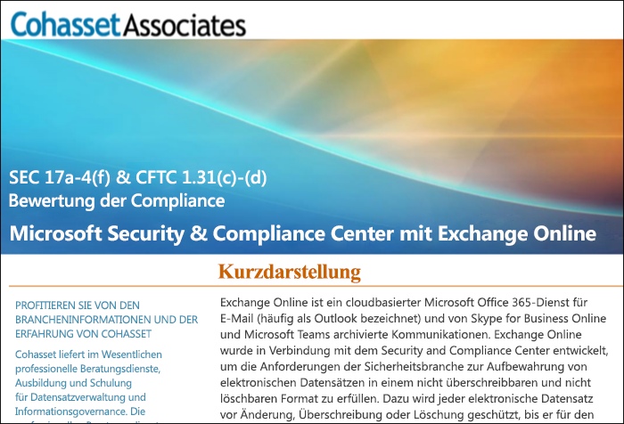

# Verwenden Sie Exchange Online und das Security & Compliance Center, um die SEC-Richtlinie 17a-4 einzuhaltenUse Exchange Online and the Security & Compliance Center to comply with SEC Rule 17a-4

>*[Microsoft 365-Lizenzierungsleitfaden für Sicherheit und Compliance](https://aka.ms/ComplianceSD).**[Microsoft 365 licensing guidance for security & compliance](https://aka.ms/ComplianceSD).*

If your organization needs to comply with regulatory standards for retaining your data, the Security & Compliance Center provides features to manage the lifecycle of your data in Exchange Online.If your organization needs to comply with regulatory standards for retaining your data, the Security & Compliance Center provides features to manage the lifecycle of your data in Exchange Online. This includes the ability to retain, audit, search, and export your data.This includes the ability to retain, audit, search, and export your data. These capabilities are sufficient to meet the needs of most organizations.These capabilities are sufficient to meet the needs of most organizations.

However, some organizations in highly regulated industries are subject to more stringent regulatory requirements.However, some organizations in highly regulated industries are subject to more stringent regulatory requirements. For example, financial institutions such as banks or broker dealers are subject to Rule 17a-4 issued by the Securities and Exchange Commission (SEC).For example, financial institutions such as banks or broker dealers are subject to Rule 17a-4 issued by the Securities and Exchange Commission (SEC). Rule 17a-4 has specific requirements for electronic data storage, including many aspects of record management, such as the duration, format, quality, availability, and accountability of records retention.Rule 17a-4 has specific requirements for electronic data storage, including many aspects of record management, such as the duration, format, quality, availability, and accountability of records retention.

Damit diese Organisationen besser verstehen, wie das Security & Compliance Center genutzt werden kann, um ihre gesetzlichen Auflagen für Exchange Online einzuhalten, insbesondere in Bezug auf die Anforderungen der Richtlinie 17a-4, haben wir in Zusammenarbeit mit Cohasset Associates eine Bewertung veröffentlicht.To help these organizations better understand how the Security & Compliance Center can be leveraged to meet their regulatory obligations for Exchange Online, specifically in relation to Rule 17a-4 requirements, we have released an assessment in partnership with Cohasset Associates.

Cohasset validated that when Exchange Online and the Security & Compliance Center are configured as recommended, they meet the relevant storage requirements of CFTC Rule 1.31(c)-(d), FINRA Rule 4511, and SEC Rule 17a-4.Cohasset validated that when Exchange Online and the Security & Compliance Center are configured as recommended, they meet the relevant storage requirements of CFTC Rule 1.31(c)-(d), FINRA Rule 4511, and SEC Rule 17a-4. We targeted this set of rules because they represent the most prescriptive guidance globally for records retention for financial institutions.We targeted this set of rules because they represent the most prescriptive guidance globally for records retention for financial institutions.

## Die Bewertung von Cohasset herunterladenDownload the Cohasset assessment

Sie können [hier die Bewertung von Cohasset herunterladen](https://servicetrust.microsoft.com/ViewPage/TrustDocuments?command=Download&downloadType=Document&downloadId=9fa8349d-a0c9-47d9-93ad-472aa0fa44ec&docTab=6d000410-c9e9-11e7-9a91-892aae8839ad_FAQ_and_White_Papers).You can [download the Cohasset assessment here](https://servicetrust.microsoft.com/ViewPage/TrustDocuments?command=Download&downloadType=Document&downloadId=9fa8349d-a0c9-47d9-93ad-472aa0fa44ec&docTab=6d000410-c9e9-11e7-9a91-892aae8839ad_FAQ_and_White_Papers).

## Diese Bewertung ist beschränkt auf Exchange OnlineThis assessment is specific to Exchange Online

Note that this assessment is specific to Exchange Online.Note that this assessment is specific to Exchange Online. The assessment does not include other Microsoft 365 services such as SharePoint Online or OneDrive for Business, although we are planning support for those services with respect to SEC 17a-4 in the future.The assessment does not include other Microsoft 365 services such as SharePoint Online or OneDrive for Business, although we are planning support for those services with respect to SEC 17a-4 in the future.

It's important to understand that Skype for Business and Teams also store data in Exchange Online.It's important to understand that Skype for Business and Teams also store data in Exchange Online. Therefore, the assessment does cover messages from Skype for Business and channel and chat messages from Teams.Therefore, the assessment does cover messages from Skype for Business and channel and chat messages from Teams.

## Die Verwendung der Erhaltungssperre ist für die empfohlene Konfiguration essentiellUsing Preservation Lock is key to the recommended configuration

Highly regulated industries are often required to store electronic communications to meet the WORM (write once, read many) requirement.Highly regulated industries are often required to store electronic communications to meet the WORM (write once, read many) requirement. The WORM requirement dictates a storage solution in which a record must be:The WORM requirement dictates a storage solution in which a record must be:

- Sie müssen über einen erforderlichen Aufbewahrungszeitraum gespeichert werden, der nicht verkürzt sondern nur verlängert werden kann.Retained for a required retention period that cannot be shortened, only increased.
- Sie müssen unveränderlich sein, d. h. Datensätze können während des erforderlichen Aufbewahrungszeitraums nicht überschrieben, gelöscht oder geändert werden.Immutable, meaning that the record cannot be overwritten, erased, or altered during the required retention period.

In Exchange Online, when a [retention policy](retention-policies.md) is applied to a user's mailbox, all the user's content will be retained based on the criteria of the policy.In Exchange Online, when a [retention policy](retention-policies.md) is applied to a user's mailbox, all the user's content will be retained based on the criteria of the policy. In fact, if a user attempts to delete or modify an email, a copy of the email before the change is made will be preserved in a secure, hidden location in the user's mailbox.In fact, if a user attempts to delete or modify an email, a copy of the email before the change is made will be preserved in a secure, hidden location in the user's mailbox. Retention policies can help ensure that an organization retains electronic communications, but those policies can be modified.Retention policies can help ensure that an organization retains electronic communications, but those policies can be modified.

By placing a Preservation Lock on a retention policy, an organization ensures that the policy cannot be modified.By placing a Preservation Lock on a retention policy, an organization ensures that the policy cannot be modified. In fact, after a Preservation Lock is applied to a retention policy, the following actions are restricted:In fact, after a Preservation Lock is applied to a retention policy, the following actions are restricted:

- Die in der Richtlinie enthaltene Aufbewahrungsdauer kann nur verlängert, nicht gekürzt werden.The retention period of the policy can only be increased, not shortened.
- Benutzer können der Richtlinie hinzugefügt werden, jedoch können keine Benutzer entfernt werden.Users can be added to the policy, but no user can be removed.
- Die Aufbewahrungsrichtlinie kann nicht von einem Administrator gelöscht werden.The retention policy cannot be deleted by an administrator.

Eine Erhaltungssperre kann Sie bei der Einhaltung der gesetzlichen Bestimmungen der SEC 17a-4 unterstützen.Preservation Lock can help you meet the SEC 17a-4 regulatory requirements.

## So richten Sie eine Erhaltungssperre einHow to set up Preservation Lock

Sie können eine Aufbewahrungsrichtlinie nur mithilfe von PowerShell sperren.You can lock a retention policy by using PowerShell. Weitere Informationen hierzu finden Sie unter [Verwenden der Erhaltungssperre zur Einhaltung gesetzlicher Vorschriften](retention-policies.md#use-preservation-lock-to-comply-with-regulatory-requirements).For more information, see [Use Preservation Lock to comply with regulatory requirements](retention-policies.md#use-preservation-lock-to-comply-with-regulatory-requirements).

## Bekannte EinschränkungenKnown limitations

Derzeit gibt es einige Einschränkungen für Exchange Online:Currently, there are a few limitations for Exchange Online:

- Unterhaltungsfäden stehen nicht für Chats und Kanal Nachrichten in Teams zur Verfügung.Threaded communications are not available for Teams chat and channel messages.
- Für Teams Chat- und Kanalnachrichten werden „gefällt mir“-Angaben nicht gespeichert.Likes are not retained for Teams chat and channel messages.

> [!NOTE]
> Überwachung auf Elementebene für Microsoft 365-Gruppenpostfächer steht jetzt zur Verfügung.Item-level auditing is now available for Microsoft 365 group mailboxes. Weitere Informationen finden Sie unter [Postfachüberwachungen verwalten](enable-mailbox-auditing.md).For more information, see [Manage mailbox auditing](enable-mailbox-auditing.md).
