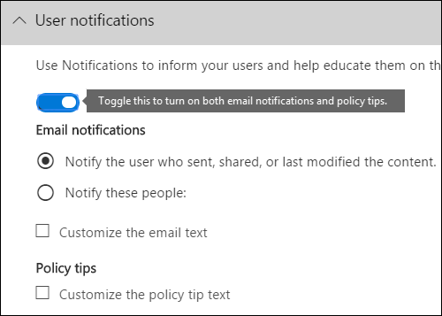

# Senden von E-Mail-Benachrichtigungen und Anzeigen von Richtlinientipps für DLP-Richtlinien

Sie können eine Richtlinie zur Verhinderung von Datenverlust (Data Loss Prevention, DLP) verwenden, um vertrauliche Informationen in allen Bereichen zu identifizieren, zu überwachen und Office 365. Sie möchten, dass Personen in Ihrer Organisation, die mit diesen vertraulichen Informationen arbeiten, mit Ihren DLP-Richtlinien konform bleiben, aber Sie möchten nicht unnötigerweise blockieren, dass ihre Arbeit erledigt wird. Hier können E-Mail-Benachrichtigungen und Richtlinientipps helfen.
  

  
Ein Richtlinientipp ist eine Benachrichtigung oder Warnung, die angezeigt wird, wenn jemand mit Inhalten arbeitet, die mit einer DLP-Richtlinie in Konflikt sind, z. B. Inhalt wie eine Excel-Arbeitsmappe auf einer OneDrive for Business-Website, die personenbezogene Informationen (PII) enthält und für einen externen Benutzer freigegeben wird.
  
Sie können E-Mail-Benachrichtigungen und Richtlinientipps verwenden, um das Bewusstsein zu erhöhen und die Mitarbeiter über die Richtlinien Ihrer Organisation aufzuklären. Sie können auch Personen die Möglichkeit geben, die Richtlinie außer Kraft zu setzen, damit sie nicht blockiert werden, wenn sie eine gültige Geschäftserm nung haben oder wenn die Richtlinie ein falsch positives Ergebnis erkennt.
  
Im Security Compliance Center können Sie beim Erstellen einer DLP-Richtlinie die &amp; Benutzerbenachrichtigungen für:
  
- Senden Sie eine E-Mail-Benachrichtigung an die Personen, die das Problem beschreiben.
    
- Anzeigen eines Richtlinientipps für Inhalte, die mit der DLP-Richtlinie in Konflikt sind:
    
  - Für E-Mails in Outlook im Web und Outlook 2013 und höher wird der Richtlinientipp oben in einer Nachricht über den Empfängern angezeigt, während die Nachricht verfasst wird.
    
  - Für Dokumente in einem OneDrive for Business oder SharePoint Onlinewebsite wird der Richtlinientipp durch ein Warnsymbol angezeigt, das im Element angezeigt wird. Um weitere Informationen anzuzeigen, können Sie ein  Element auswählen und dann in der oberen rechten Ecke der Seite das Symbol Informationsbereich auswählen, um den  Detailbereich zu öffnen. 
    
  - Für Excel-, PowerPoint- und Word-Dokumente, die auf einer OneDrive for Business-Website oder SharePoint Online-Website gespeichert sind, die in der DLP-Richtlinie enthalten ist, wird  der Richtlinientipp in der Nachrichtenleiste und in der Backstageansicht angezeigt ( \> **DateimenüInformationen**).
    
## Hinzufügen von Benutzerbenachrichtigungen zu einer DLP-Richtlinie

Wenn Sie eine DLP-Richtlinie erstellen, können Sie **Benutzerbenachrichtigungen aktivieren.** Wenn Benutzerbenachrichtigungen aktiviert sind, sendet Microsoft 365 E-Mail-Benachrichtigungen und Richtlinientipps. Sie können anpassen, an wen Benachrichtigungs-E-Mails gesendet werden, den E-Mail-Text und den Richtlinientipptext.
  
1. Wechseln Sie zu [https://protection.office.com](https://protection.office.com).
    
2. Melden Sie sich mit Ihrem Geschäfts-, Schul- oder Unikonto an. Sie sind jetzt im Security &amp; Compliance Center.
    
3. In the Security &amp; Compliance Center left navigation Data loss \> \> **prevention** \> **Policy** \> **+ Create a policy**.
    
    
  
4. Wählen Sie die DLP-Richtlinienvorlage aus, die die Typen vertraulicher Informationen schützt, die Sie als \> **Nächstes benötigen.**
    
    Um mit einer leeren Vorlage zu beginnen, wählen Sie **Benutzerdefinierte** \> **benutzerdefinierte Richtlinie** \> **Weiter aus.**
    
5. Nennen Sie die \> **Richtlinie Weiter**.
    
6. Gehen Sie wie folgt vor, um die Speicherorte zu wählen, die die DLP-Richtlinie schützen soll:
    
   - Wählen **Sie Alle Speicherorte in Office 365** Weiter \> **aus.**
    
   - Wählen **Sie Let me choose specific locations** Next \> **aus.**
    
   Um einen gesamten Speicherort wie alle E-Mail-Exchange oder alle OneDrive-Konten ein- oder auszuschließen, deaktivieren Sie den **Status** dieses Speicherorts. 
    
   Um nur bestimmte SharePoint websites oder OneDrive zu verwenden, wechseln Sie zu **Status,** und  klicken Sie dann unter Include auf die Links, um bestimmte Websites oder Konten zu wählen. 
    
7. Wählen **Sie Erweiterte Einstellungen verwenden** Weiter \> **aus.**
    
8. Wählen Sie **+ Neue Regel** aus.
    
9. Aktivieren Sie im Regel-Editor unter **Benutzerbenachrichtigungen** den Status.
    
    

> [!NOTE]
> DLP-Richtlinien gelten für alle Dokumente, die mit der Richtlinie übereinstimmen, unabhängig davon, ob diese Dokumente neu oder vorhanden sind. Eine E-Mail-Benachrichtigung wird jedoch nur generiert, wenn neue Inhalte einer vorhandenen DLP-Richtlinie entspricht. Vorhandene Inhalte sind geschützt, generieren jedoch keine Benutzerbenachrichtigung per E-Mail.
  
## Optionen zum Konfigurieren von E-Mail-Benachrichtigungen

Für jede Regel in einer DLP-Richtlinie können Sie:
  
- Senden Sie die Benachrichtigung an die personen, die Sie auswählen. Diese Personen können den Besitzer des Inhalts, die Person, die den Inhalt zuletzt geändert hat, der Besitzer der Website, auf der der Inhalt gespeichert ist, oder einen bestimmten Benutzer enthalten.
    
- Passen Sie den Text an, der in der Benachrichtigung enthalten ist, mithilfe von HTML oder Token. Weitere Informationen hierzu finden Sie im nachstehenden Abschnitt.
    
> [!NOTE]
>  E-Mail-Benachrichtigungen können nur an einzelne Empfänger gesendet werden, nicht an Gruppen oder Verteilerlisten. Nur neue Inhalte lösen eine E-Mail-Benachrichtigung aus. Das Bearbeiten vorhandener Inhalte löst Richtlinientipps aus, aber keine E-Mail-Benachrichtigung. 
  

  
### Standard-E-Mail-Benachrichtigung

Benachrichtigungen haben eine Betreffzeile, die mit der aktion beginnt, z. B. "Benachrichtigung", "Nachricht blockiert" für E-Mails oder "Zugriff blockiert" für Dokumente. Wenn es sich bei der Benachrichtigung um ein Dokument handelt, enthält der Benachrichtigungstext einen Link, der Sie zu der Website führt, auf der das Dokument gespeichert ist, und öffnet den Richtlinientipp für das Dokument, wo Sie alle Probleme beheben können (siehe abschnitt unten zu Richtlinientipps). Wenn es sich bei der Benachrichtigung um eine Nachricht handelt, enthält die Benachrichtigung als Anlage die Nachricht, die einer DLP-Richtlinie entspricht.
  

  
Standardmäßig werden in Benachrichtigungen Text ähnlich dem folgenden für ein Element auf einer Website angezeigt. Der Benachrichtigungstext wird für jede Regel separat konfiguriert, sodass sich der angezeigte Text je nach Übereinstimmung der Regel unterscheidet.

|**Wenn die DLP-Richtlinienregel dies tut...**|**In der Standardbenachrichtigung für SharePoint oder OneDrive for Business wird dies angezeigt...**|**In der Standardbenachrichtigung für Outlook wird dies angezeigt...**|
|:-----|:-----|:-----|
|Sendet eine Benachrichtigung, lässt jedoch keine Außerkraftsetzung zu.    |Dieses Element steht in Konflikt mit einer Richtlinie in Ihrer Organisation.    |Ihre E-Mail-Nachricht steht in Konflikt mit einer Richtlinie in Ihrer Organisation.    |
|Blockiert den Zugriff, sendet eine Benachrichtigung und lässt die Außerkraftsetzung zu.    |Dieses Element steht in Konflikt mit einer Richtlinie in Ihrer Organisation. Wenn Sie diesen Konflikt nicht beheben, kann der Zugriff auf diese Datei blockiert werden.    |Ihre E-Mail-Nachricht steht in Konflikt mit einer Richtlinie in Ihrer Organisation. Die Nachricht wurde nicht an alle Empfänger zugestellt.    |
|Blockiert den Zugriff und sendet eine Benachrichtigung    |Dieses Element steht in Konflikt mit einer Richtlinie in Ihrer Organisation. Der Zugriff auf dieses Element wird für alle Benutzer mit Ausnahme des Besitzers, des letzten Modifizierers und des primären Websitesammlungsadministrators blockiert.    |Ihre E-Mail-Nachricht steht in Konflikt mit einer Richtlinie in Ihrer Organisation. Die Nachricht wurde nicht an alle Empfänger zugestellt.    |
   
### Benutzerdefinierte E-Mail-Benachrichtigung

Sie können eine benutzerdefinierte E-Mail-Benachrichtigung erstellen, anstatt die Standard-E-Mail-Benachrichtigung an Ihre Endbenutzer oder Administratoren zu senden. Die benutzerdefinierte E-Mail-Benachrichtigung unterstützt HTML und hat einen Grenzwert von 5.000 Zeichen. Sie können HTML verwenden, um Bilder, Formatierungen und andere Brandings in die Benachrichtigung zu verwenden.
  
Sie können auch die folgenden Token verwenden, um die E-Mail-Benachrichtigung anzupassen. Diese Token sind Variablen, die durch bestimmte Informationen in der gesendeten Benachrichtigung ersetzt werden.

|**Token**|**Beschreibung**|
|:-----|:-----|
|%%AppliedActions%%    |Die auf den Inhalt angewendeten Aktionen.    |
|%%ContentURL%%    |Die URL des Dokuments auf der SharePoint Oder OneDrive for Business Website.    |
|%%MatchedConditions%%    |Die Bedingungen, die vom Inhalt erfüllt wurden. Verwenden Sie dieses Token, um Personen über mögliche Probleme mit dem Inhalt zu informieren.    |
   

  
## Optionen zum Konfigurieren von Richtlinientipps

Für jede Regel in einer DLP-Richtlinie können Sie Richtlinientipps für:
  
- Benachrichtigen Sie die Person einfach, dass der Inhalt mit einer DLP-Richtlinie in Konflikt steht, damit sie Maßnahmen zur Lösung des Konflikts ergreifen kann. Sie können den Standardtext verwenden (siehe die folgenden Tabellen) oder benutzerdefinierten Text zu den spezifischen Richtlinien Ihrer Organisation eingeben.
    
- Zulassen, dass die Person die DLP-Richtlinie außer Kraft setzt. Optional können Sie:
    
  - Fordern Sie die Person auf, eine geschäftliche Begründung für das Außerkraftsetzen der Richtlinie ein eingeben. Diese Informationen werden protokolliert, und Sie können sie in den DLP-Berichten im **Abschnitt Berichte** des Security Compliance &amp; Center anzeigen. 
    
  - Zulassen, dass die Person ein falsch positives Ergebnis berichtet und die DLP-Richtlinie außer Kraft setzt. Diese Informationen werden auch für die Berichterstellung protokolliert, damit Sie falsch positive Ergebnisse verwenden können, um Ihre Regeln zu optimieren.
    

  
Beispielsweise kann eine DLP-Richtlinie auf OneDrive for Business angewendet werden, die personenbezogene Informationen (PII) erkennt, und diese Richtlinie verfügt über drei Regeln:
  
1. Erste Regel: Wenn weniger als fünf Instanzen dieser vertraulichen Informationen in einem Dokument erkannt  werden und das Dokument für Personen innerhalb der Organisation freigegeben wird, zeigt die Aktion Benachrichtigung senden einen Richtlinientipp an. Für Richtlinientipps sind keine Außerkraftsetzungsoptionen erforderlich, da diese Regel einfach Personen benachrichtigt und den Zugriff nicht blockiert. 
    
2. Zweite Regel: Wenn in einem Dokument mehr als fünf Instanzen dieser vertraulichen Informationen erkannt  werden und das Dokument für Personen innerhalb der  Organisation freigegeben wird, werden die Berechtigungen für die Datei durch die Aktion Zugriff auf Inhalt blockieren eingeschränkt, und mit der Benachrichtigungsaktion Senden können Personen die Aktionen in dieser Regel außer Kraft setzen, indem sie eine geschäftliche Begründung bereitstellen. Das Unternehmen Ihrer Organisation erfordert manchmal, dass interne Personen PII-Daten freigeben, und Sie möchten nicht, dass Ihre DLP-Richtlinie diese Arbeit blockiert. 
    
3. Dritte Regel: Wenn mehr als fünf Instanzen dieser vertraulichen Informationen in einem Dokument erkannt  werden und das Dokument für Personen außerhalb der  Organisation freigegeben wird, beschränkt die Aktion Zugriff auf Inhalt blockieren die Berechtigungen für die Datei, und die Aktion Benachrichtigung senden ermöglicht es nicht, die Aktionen in dieser Regel außer Kraft zu setzen, da die Informationen extern freigegeben werden. Unter keinen Umständen dürfen Personen in Ihrer Organisation PiI-Daten außerhalb der Organisation freigeben. 
    
Im Artikel finden Sie einige wichtige Informationen zur Verwendung eines Richtlinientipps zum Außerkraft setzen einer Regel:
  
- Die Option zum Außerkraftsetzen ist pro Regel und überschreibt alle Aktionen in der Regel (mit Ausnahme des Sendens einer Benachrichtigung, die nicht überschrieben werden kann).
    
- Es ist möglich, dass Inhalte mehreren Regeln in einer DLP-Richtlinie entsprechen, es wird jedoch nur der Richtlinientipp aus der restriktivsten Regel mit höchster Priorität angezeigt. So hat beispielsweise der Richtlinientipp zu einer Regel, die Zugriff auf Inhalte blockiert, Vorrang gegenüber dem Richtlinientipp zu einer Regel, die einfach nur eine Benachrichtigung sendet. Dadurch wird verhindert, dass Benutzern eine umfangreiche Liste von Richtlinientipps angezeigt wird.
    
- Wenn die Richtlinientipps in der restriktivsten Regel Benutzern erlauben, die Regel außer Kraft zu setzen, werden dadurch auch alle anderen Regeln überschrieben, die für den Inhalt gelten.
    
## Richtlinientipps für OneDrive for Business und SharePoint Onlinewebsites

Wenn ein Dokument auf einer OneDrive for Business oder SharePoint Onlinewebsite einer Regel in einer DLP-Richtlinie entspricht und diese Regel Richtlinientipps verwendet, werden in den Richtlinientipps spezielle Symbole im Dokument angezeigt:
  
1. Wenn die Regel eine Benachrichtigung über die Datei sendet, wird das Warnsymbol angezeigt.
    
2. Wenn die Regel den Zugriff auf das Dokument blockiert, wird das blockierte Symbol angezeigt.
    
   
  
Zum Ergreifen von Aktionen für ein Dokument können Sie in der oberen rechten Ecke der Seite ein Element auswählen, das Symbol Informationsbereich auswählen, um den Detailbereich Richtlinientipp \>   \> **öffnen.**
  
Der Richtlinientipp listet die Probleme mit dem Inhalt auf, und wenn die Richtlinientipps  mit diesen  Optionen konfiguriert sind, können Sie **Resolve** auswählen und dann den Richtlinientipp außer Kraft setzen oder eine falsch positive Meldung melden. 
  

  

  
DLP-Richtlinien werden mit Websites synchronisiert und inhalte werden regelmäßig und asynchron ausgewertet, sodass es zwischen dem Zeitpunkt, zu dem Sie die DLP-Richtlinie erstellen, und dem Zeitpunkt, zu dem Sie beginnen, Richtlinientipps zu sehen, eine kurze Verzögerung geben kann. Es kann eine ähnliche Verzögerung geben, wenn Sie einen Richtlinientipp auflösen oder außer Kraft setzen, bis das Symbol auf dem Dokument auf der Website weggeht.
  
### Standardtext für Richtlinientipps auf Websites

Standardmäßig werden in Richtlinientipps Text ähnlich dem folgenden für ein Element auf einer Website angezeigt. Der Benachrichtigungstext wird für jede Regel separat konfiguriert, sodass sich der angezeigte Text je nach Übereinstimmung der Regel unterscheidet.

|**Wenn die DLP-Richtlinienregel dies tut...**|**Im Standardrichtlinientipp wird dies angezeigt...**|
|:-----|:-----|
|Sendet eine Benachrichtigung, lässt jedoch keine Außerkraftsetzung zu.    |Dieses Element steht in Konflikt mit einer Richtlinie in Ihrer Organisation.    |
|Blockiert den Zugriff, sendet eine Benachrichtigung und lässt die Außerkraftsetzung zu.    |Dieses Element steht in Konflikt mit einer Richtlinie in Ihrer Organisation. Wenn Sie diesen Konflikt nicht beheben, kann der Zugriff auf diese Datei blockiert werden.    |
|Blockiert den Zugriff und sendet eine Benachrichtigung    |Dieses Element steht in Konflikt mit einer Richtlinie in Ihrer Organisation. Der Zugriff auf dieses Element wird für alle Benutzer mit Ausnahme des Besitzers, des letzten Modifizierers und des primären Websitesammlungsadministrators blockiert.    |
   
### Benutzerdefinierter Text für Richtlinientipps auf Websites

Sie können den Text für Richtlinientipps separat von der E-Mail-Benachrichtigung anpassen. Im Gegensatz zu benutzerdefiniertem Text für E-Mail-Benachrichtigungen (siehe oben) akzeptiert benutzerdefinierter Text für Richtlinientipps keine HTML oder Token. Stattdessen ist benutzerdefinierter Text für Richtlinientipps nur Nur-Text mit einem Grenzwert von 256 Zeichen.
  
## Richtlinientipps in Outlook web und Outlook 2013 und höher

Wenn Sie eine neue E-Mail in Outlook im Web und Outlook 2013 und höher verfassen, wird ein Richtlinientipp angezeigt, wenn Sie Inhalte hinzufügen, die einer Regel in einer DLP-Richtlinie entspricht, und diese Regel Richtlinientipps verwendet. Der Richtlinientipp wird oben in der Nachricht oberhalb der Empfänger angezeigt, während die Nachricht verfasst wird.
  

  
Richtlinientipps funktionieren, ob die vertraulichen Informationen im Nachrichtentext, in der Betreffzeile oder sogar in einer Nachrichtenanlage angezeigt werden, wie hier gezeigt.
  

  
Wenn die Richtlinientipps so konfiguriert sind, dass die Außerkraftsetzung zulässig ist, können Sie **Details** überschreiben anzeigen auswählen und eine Geschäftliche Begründung eingeben oder eine falsch positive Außerkraftsetzung \>  \> \> **melden.**
  

  

  
Beachten Sie, dass beim Hinzufügen vertraulicher Informationen zu einer E-Mail eine Wartezeit zwischen dem Hinzufügen der vertraulichen Informationen und dem Einblenden des Richtlinientipps auftreten kann.

### Outlook 2013 und höher unterstützt das Anzeigen von Richtlinientipps für nur einige Bedingungen

Derzeit unterstützt Outlook 2013 und höher das Anzeigen von Richtlinientipps nur für die folgenden Bedingungen:

- Inhalt enthält
- Inhalt wird freigegeben

Beachten Sie, dass Ausnahmen als Bedingungen betrachtet werden, und alle diese Bedingungen funktionieren in Outlook, wo sie Inhalten entsprechen und Schutzmaßnahmen für Inhalte erzwingen. Das Anzeigen von Richtlinientipps für Benutzer wird jedoch noch nicht unterstützt. 
  
### Richtlinientipps im Exchange Admin Center im Vergleich zum Security &amp; Compliance Center

Richtlinientipps können entweder mit im Exchange Admin Center erstellten DLP-Richtlinien und Nachrichtenflussregeln oder mit im Security Compliance Center erstellten DLP-Richtlinien funktionieren, aber nicht mit &amp; beiden. Dies liegt daran, dass diese Richtlinien an unterschiedlichen Speicherorten gespeichert werden, Richtlinientipps können jedoch nur von einem einzigen Speicherort aus zeichnen.
  
Wenn Sie Richtlinientipps im Exchange Admin Center konfiguriert haben, werden alle Richtlinientipps, die Sie im Security Compliance Center konfigurieren, benutzern in Outlook im Web und Outlook 2013 und höher erst angezeigt, wenn Sie die Tipps im &amp; Exchange Admin Center deaktivieren. Dadurch wird sichergestellt, dass Exchange Nachrichtenflussregeln (auch als Transportregeln bezeichnet) weiterhin funktionieren, bis Sie zum Security &amp; Compliance Center wechseln.
  
Beachten Sie, dass Richtlinientipps zwar nur von einem einzigen Speicherort aus zeichnen können, E-Mail-Benachrichtigungen jedoch immer gesendet werden, auch wenn Sie DLP-Richtlinien sowohl im Security Compliance Center als auch im Exchange &amp; Admin Center verwenden.
  
### Standardtext für Richtlinientipps in E-Mails

Standardmäßig werden in Richtlinientipps Text ähnlich dem folgenden für E-Mail-Nachrichten angezeigt.

|**Wenn die DLP-Richtlinienregel dies tut...**|**Im Standardrichtlinientipp wird dies angezeigt...**|
|:-----|:-----|
|Sendet eine Benachrichtigung, lässt jedoch keine Außerkraftsetzung zu.    |Ihre E-Mail steht in Konflikt mit einer Richtlinie in Ihrer Organisation.    |
|Blockiert den Zugriff, sendet eine Benachrichtigung und lässt die Außerkraftsetzung zu.    |Ihre E-Mail steht in Konflikt mit einer Richtlinie in Ihrer Organisation.    |
|Blockiert den Zugriff und sendet eine Benachrichtigung    |Ihre E-Mail steht in Konflikt mit einer Richtlinie in Ihrer Organisation.    |
   
## Richtlinientipps in Excel, PowerPoint und Word

Wenn Personen in den Desktopversionen von Excel, PowerPoint und Word mit vertraulichen Inhalten arbeiten, können Richtlinientipps sie in Echtzeit darüber informieren, dass der Inhalt mit einer DLP-Richtlinie in Konflikt steht. Dies erfordert:
  
- Das Office wird auf einer OneDrive for Business oder SharePoint Onlinewebsite gespeichert.
    
- Die Website ist in einer DLP-Richtlinie enthalten, die für die Verwendung von Richtlinientipps konfiguriert ist.
    
Office Desktopprogramme automatisch DLP-Richtlinien direkt aus Office 365 synchronisieren und dann Ihre Dokumente überprüfen, um sicherzustellen, dass sie nicht mit Ihren DLP-Richtlinien in Konflikt stehen und Richtlinientipps in Echtzeit anzeigen.

> [!NOTE]
> Office desktop apps scan documents themselves to determine if DLP policy tips should be shown; Sie zeigen keine Richtlinientipps, die SharePoint Onlinewebsites oder OneDrive for Business bereits festgelegten Websites in einer Datei angezeigt werden sollen. Daher wird möglicherweise nicht immer ein DLP-Richtlinientipp in den Desktop-Apps angezeigt, die sie auf den SharePoint Onlinewebsites oder OneDrive for Business sehen. Im Gegensatz dazu zeigen die Office im Web nur DLP-Richtlinientipps an, die SharePoint Onlinewebsites oder OneDrive for Business bereits ermittelt haben, angezeigt werden sollen.
  
Je nachdem, wie Sie die Richtlinientipps in der DLP-Richtlinie konfigurieren, können Die Benutzer die Richtlinientipps einfach ignorieren, die Richtlinie mit oder ohne geschäftliche Begründung außer Kraft setzen oder ein falsch positives Ergebnis melden.
  
Richtlinientipps werden auf der Nachrichtenleiste angezeigt.
  

  
Und Richtlinientipps werden auch in der Backstage-Ansicht (auf der Registerkarte **Datei)** angezeigt. 
  

  
Wenn Richtlinientipps in der DLP-Richtlinie mit diesen Optionen konfiguriert sind, können Sie **Resolve** to **Override** a policy tip oder **Report** a false positive auswählen. 
  

  
In jedem dieser Office können Benutzer Richtlinientipps deaktivieren. Wenn dies deaktiviert ist, werden Richtlinientipps, die einfache Benachrichtigungen sind, nicht in der Nachrichtenleiste oder in der Backstageansicht (auf der Registerkarte **Datei)** angezeigt. Richtlinientipps zum Blockieren und Überschreiben werden jedoch weiterhin angezeigt, und sie erhalten weiterhin die E-Mail-Benachrichtigung. Darüber hinaus wird das Dokument durch deaktivieren von Richtlinientipps nicht von DLP-Richtlinien ausgenommen, die darauf angewendet wurden. 
  
### Standardtext für Richtlinientipps in Excel 2016, PowerPoint 2016 und Word 2016

Standardmäßig werden in Richtlinientipps Text ähnlich dem folgenden in der Nachrichtenleiste und in der Backstageansicht eines geöffneten Dokuments angezeigt. Der Benachrichtigungstext wird für jede Regel separat konfiguriert, sodass sich der angezeigte Text je nach Übereinstimmung der Regel unterscheidet.

|**Wenn die DLP-Richtlinienregel dies tut...**|**Im Standardrichtlinientipp wird dies angezeigt...**|
|:-----|:-----|
|Sendet eine Benachrichtigung, lässt jedoch keine Außerkraftsetzung zu.    |Diese Datei steht in Konflikt mit einer Richtlinie in Ihrer Organisation. Weitere Informationen **finden** Sie im Menü Datei.    |
|Blockiert den Zugriff, sendet eine Benachrichtigung und lässt die Außerkraftsetzung zu.    |Diese Datei steht in Konflikt mit einer Richtlinie in Ihrer Organisation. Wenn Sie diesen Konflikt nicht beheben, kann der Zugriff auf diese Datei blockiert werden. Weitere Informationen **finden** Sie im Menü Datei.    |
|Blockiert den Zugriff und sendet eine Benachrichtigung    |Diese Datei steht in Konflikt mit einer Richtlinie in Ihrer Organisation. Wenn Sie diesen Konflikt nicht beheben, kann der Zugriff auf diese Datei blockiert werden. Weitere Informationen **finden** Sie im Menü Datei.    |
   
### Benutzerdefinierter Text für Richtlinientipps in Excel, PowerPoint und Word

Sie können den Text für Richtlinientipps separat von der E-Mail-Benachrichtigung anpassen. Im Gegensatz zu benutzerdefiniertem Text für E-Mail-Benachrichtigungen (siehe oben) akzeptiert benutzerdefinierter Text für Richtlinientipps keine HTML oder Token. Stattdessen ist benutzerdefinierter Text für Richtlinientipps nur Nur-Text mit einem Grenzwert von 256 Zeichen.
  
## Weitere Informationen

- [Informationen zur Verhinderung von Datenverlust](dlp-learn-about-dlp.md)    
- [Erstellen einer DLP-Richtlinie aus einer Vorlage](create-a-dlp-policy-from-a-template.md)
- [DLP-Richtlinienbedingungen, Ausnahmen und Aktionen (Vorschau)](./dlp-microsoft-teams.md) 
- [Erstellen einer DLP-Richtlinie zum Schützen von Dokumenten mit FCI- oder anderen Eigenschaften](protect-documents-that-have-fci-or-other-properties.md)
- [Bestandteile von DLP-Richtlinienvorlagen](what-the-dlp-policy-templates-include.md)
- [Entitätsdefinitionen für Typen vertraulicher Informationen](sensitive-information-type-entity-definitions.md)