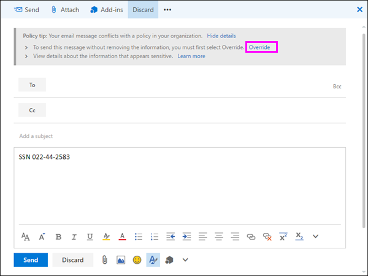
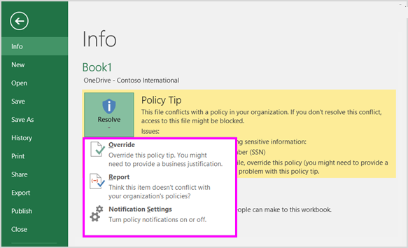

# Senden von E-Mail-Benachrichtigungen und Anzeigen von Richtlinientipps für DLP-RichtlinienSend email notifications and show policy tips for DLP policies

Sie können eine Richtlinie zur Verhinderung von Datenverlust (Data Loss Prevention, DLP) verwenden, um vertrauliche Informationen in Office 365 zu identifizieren, zu überwachen und zu schützen.You can use a data loss prevention (DLP) policy to identify, monitor, and protect sensitive information across Office 365. Sie möchten, dass Personen in Ihrer Organisation, die mit diesen vertraulichen Informationen arbeiten, ihre DLP-Richtlinien einhalten, sie aber nicht unnötig daran hindern, ihre Arbeit zu erledigen.You want people in your organization who work with this sensitive information to stay compliant with your DLP policies, but you don't want to block them unnecessarily from getting their work done. Hier können E-Mail-Benachrichtigungen und Richtlinientipps hilfreich sein.This is where email notifications and policy tips can help.
  

  
Ein Richtlinientipp ist eine Benachrichtigung oder Warnung, die angezeigt wird, wenn jemand mit Inhalten arbeitet, die mit einer DLP-Richtlinie in Konflikt stehen, z. B. Inhalte wie eine Excel-Arbeitsmappe auf einer OneDrive for Business-Website, die personenbezogene Informationen (PII) enthält und für einen externen Benutzer freigegeben wird.A policy tip is a notification or warning that appears when someone is working with content that conflicts with a DLP policy—for example, content like an Excel workbook on a OneDrive for Business site that contains personally identifiable information (PII) and is shared with an external user.
  
Sie können E-Mail-Benachrichtigungen und Richtlinientipps verwenden, um das Bewusstsein zu erhöhen und die Mitarbeiter über die Richtlinien Ihrer Organisation zu informieren.You can use email notifications and policy tips to increase awareness and help educate people about your organization's policies. Sie können Personen auch die Möglichkeit geben, die Richtlinie außer Kraft zu setzen, damit sie nicht blockiert werden, wenn sie eine gültige geschäftliche Notwendigkeit haben oder wenn die Richtlinie ein falsch positives Ergebnis erkennt.You can also give people the option to override the policy, so that they're not blocked if they have a valid business need or if the policy is detecting a false positive.
  
Wenn Sie im Compliance Center eine DLP-Richtlinie erstellen, können Sie die Benutzerbenachrichtigungen für Folgendes konfigurieren:In the Compliance Center, when you create a DLP policy, you can configure the user notifications to:
  
- Senden Sie eine E-Mail-Benachrichtigung an die Von Ihnen ausgewählten Personen, die das Problem beschreiben.Send an email notification to the people you choose that describes the issue.
> [!NOTE]
> Benachrichtigungs-E-Mails werden ungeschützte gesendet.Notification emails are sent unprotected.
    
- Anzeigen eines Richtlinientipps für Inhalte, die mit der DLP-Richtlinie in Konflikt stehen:Display a policy tip for content that conflicts with the DLP policy:
    
  - Bei E-Mails in Outlook im Web und Outlook 2013 und höher wird der Richtlinientipp oben in einer Nachricht über den Empfängern angezeigt, während die Nachricht verfasst wird.For email in Outlook on the web and Outlook 2013 and later, the policy tip appears at the top of a message above the recipients while the message is being composed.
    
  - Für Dokumente in einem OneDrive for Business-Konto oder einer SharePoint Online-Website wird der Richtlinientipp durch ein Warnsymbol angezeigt, das auf dem Element angezeigt wird.For documents in a OneDrive for Business account or SharePoint Online site, the policy tip is indicated by a warning icon that appears on the item. Um weitere Informationen anzuzeigen, können Sie ein  Element auswählen und dann in der oberen rechten Ecke der Seite das Symbol  auswählen, um den Detailbereich zu öffnen.To view more information, you can select an item and then choose **Information**  in the upper-right corner of the page to open the details pane. 
    
  - Für Excel-, PowerPoint- und Word-Dokumente, die auf einer OneDrive for Business-Website oder sharePoint Online-Website gespeichert sind, die in der DLP-Richtlinie enthalten ist, wird der Richtlinientipp in der Nachrichtenleiste und in der Backstage-Ansicht ( **Dateimenü** \> **Info**) angezeigt.For Excel, PowerPoint, and Word documents that are stored on a OneDrive for Business site or SharePoint Online site that's included in the DLP policy, the policy tip appears on the Message Bar and the Backstage view ( **File** menu \> **Info**).
    
## Hinzufügen von Benutzerbenachrichtigungen zu einer DLP-RichtlinieAdd user notifications to a DLP policy

Wenn Sie eine DLP-Richtlinie erstellen, können Sie **Benutzerbenachrichtigungen** aktivieren.When you create a DLP policy, you can enable **User notifications**. Wenn Benutzerbenachrichtigungen aktiviert sind, sendet Microsoft 365 sowohl E-Mail-Benachrichtigungen als auch Richtlinientipps.When user notifications are enabled, Microsoft 365 sends out both email notifications and policy tips. Sie können anpassen, an wen Benachrichtigungs-E-Mails gesendet werden, der E-Mail-Text und der Richtlinientipptext.You can customize who notification emails are sent to, the email text and the policy tip text.
  
1. Wechseln Sie zu [https://protection.office.com](https://protection.office.com).Go to [https://protection.office.com](https://protection.office.com).
    
2. Melden Sie sich mit Ihrem Geschäfts-, Schul- oder Unikonto an.Sign in using your work or school account. Sie befinden sich jetzt im Security &amp; Compliance Center.You're now in the Security &amp; Compliance Center.
    
3. In the Security &amp; Compliance Center left navigation Data Loss \> \> **Prevention** \> **Policy** \> **+ Create a policy**.In the Security &amp; Compliance Center \> left navigation \> **Data loss prevention** \> **Policy** \> **+ Create a policy**.
    
    
  
4. Wählen Sie die DLP-Richtlinienvorlage aus, die die Typen vertraulicher Informationen schützt, die Sie \> **als Nächstes** benötigen.Choose the DLP policy template that protects the types of sensitive information that you need \> **Next**.
    
    Um mit einer leeren  Vorlage zu beginnen, wählen Sie \> **"Benutzerdefinierte Benutzerdefinierte Richtlinie** \> **weiter"** aus.To start with an empty template, choose **Custom** \> **Custom policy** \> **Next**.
    
5. Benennen Sie die Richtlinie \> **als Nächstes.**Name the policy \> **Next**.
    
6. Führen Sie einen der folgenden Schritte aus, um die Speicherorte auszuwählen, die die DLP-Richtlinie schützen soll:To choose the locations that you want the DLP policy to protect, do one of the following:
    
   - Choose **All locations in Office 365** \> **Next**.Choose **All locations in Office 365** \> **Next**.
    
   - Choose **Let me choose specific locations** \> **Next**.Choose **Let me choose specific locations** \> **Next**.
    
   Wenn Sie einen gesamten Speicherort wie alle Exchange-E-Mails oder alle OneDrive-Konten einschließen oder ausschließen möchten, aktivieren oder deaktivieren Sie den **Status** dieses Speicherorts.To include or exclude an entire location such as all Exchange email or all OneDrive accounts, switch the **Status** of that location on or off. 
    
   Um nur bestimmte SharePoint-Websites oder OneDrive-Konten einzuschließen, aktivieren Sie den **Status,** und klicken Sie dann auf die Links unter **"Einschließen",** um bestimmte Websites oder Konten auszuwählen.To include only specific SharePoint sites or OneDrive accounts, switch the **Status** to on, and then click the links under **Include** to choose specific sites or accounts. 
    
7. Wählen Sie **"Erweiterte Einstellungen** \> **verwenden" als Nächstes** aus.Choose **Use advanced settings** \> **Next**.
    
8. Wählen Sie **+ Neue Regel** aus.Choose **+ New rule**.
    
9. Schalten Sie im Regel-Editor unter **"Benutzerbenachrichtigungen"** den Status ein.In the rule editor, under **User notifications**, switch the status on.
    
    

> [!NOTE]
> DLP-Richtlinien gelten für alle Dokumente, die der Richtlinie entsprechen, unabhängig davon, ob diese Dokumente neu oder vorhanden sind.DLP policies apply to all documents that match the policy, whether those documents are new or existing. Eine E-Mail-Benachrichtigung wird jedoch nur generiert, wenn neue Inhalte mit einer vorhandenen DLP-Richtlinie übereinstimmen.However, an email notification is only generated when new content matches an existing DLP policy. Vorhandene Inhalte sind geschützt, generieren jedoch keine Benutzerbenachrichtigung per E-Mail.Existing content is protected, but will not generate a user notification via email.
  
## Optionen zum Konfigurieren von E-Mail-BenachrichtigungenOptions for configuring email notifications

Für jede Regel in einer DLP-Richtlinie haben Sie folgende Möglichkeiten:For each rule in a DLP policy, you can:
  
- Senden Sie die Benachrichtigung an die von Ihnen ausgewählten Personen.Send the notification to the people you choose. Diese Personen können den Besitzer des Inhalts, die Person, die den Inhalt zuletzt geändert hat, den Besitzer der Website, auf der der Inhalt gespeichert ist, oder einen bestimmten Benutzer einschließen.These people can include the owner of the content, the person who last modified the content, the owner of the site where the content is stored, or a specific user.
    
- Passen Sie den Text, der in der Benachrichtigung enthalten ist, mithilfe von HTML oder Token an.Customize the text that's included in the notification by using HTML or tokens. Weitere Informationen hierzu finden Sie im nachstehenden Abschnitt.See the section below for more information.
    
> [!NOTE]
>  E-Mail-Benachrichtigungen können nur an einzelne Empfänger gesendet werden, nicht an Gruppen oder Verteilerlisten.Email notifications can be sent only to individual recipients—not groups or distribution lists. Nur neue Inhalte lösen eine E-Mail-Benachrichtigung aus.Only new content will trigger an email notification. Das Bearbeiten vorhandener Inhalte löst Richtlinientipps aus, jedoch keine E-Mail-Benachrichtigung.Editing existing content will trigger policy tips, but not an email notification. 
  

  
### Standard-E-Mail-BenachrichtigungDefault email notification

Benachrichtigungen haben eine Betreffzeile, die mit der ausgeführten Aktion beginnt, z. B. "Benachrichtigung", "Nachricht blockiert" für E-Mails oder "Zugriff blockiert" für Dokumente.Notifications have a Subject line that begins with the action taken, such as "Notification", "Message Blocked" for email, or "Access Blocked" for documents. Wenn es sich bei der Benachrichtigung um ein Dokument handelt, enthält der Nachrichtentext der Benachrichtigung einen Link, der Sie zu der Website führt, auf der das Dokument gespeichert ist, und öffnet den Richtlinientipp für das Dokument, in dem Sie alle Probleme beheben können (siehe abschnitt unten zu Richtlinientipps).If the notification is about a document, the notification message body includes a link that takes you to the site where the document's stored and opens the policy tip for the document, where you can resolve any issues (see the section below about policy tips). Wenn es sich bei der Benachrichtigung um eine Nachricht handelt, enthält die Benachrichtigung als Anlage die Nachricht, die einer DLP-Richtlinie entspricht.If the notification is about a message, the notification includes as an attachment the message that matches a DLP policy.
  

  
Standardmäßig wird in Benachrichtigungen text ähnlich dem folgenden für ein Element auf einer Website angezeigt.By default, notifications display text similar to the following for an item on a site. Der Benachrichtigungstext wird für jede Regel separat konfiguriert, sodass sich der angezeigte Text in Abhängigkeit davon unterscheidet, welche Regel abgeglichen wird.The notification text is configured separately for each rule, so the text that's displayed differs depending on which rule is matched.

|**Wenn die DLP-Richtlinienregel dies tut...****If the DLP policy rule does this…**|**In der Standardbenachrichtigung für SharePoint- oder OneDrive for Business-Dokumente wird folgendes angegeben...****Then the default notification for SharePoint or OneDrive for Business documents says this…**|**Dann wird in der Standardbenachrichtigung für Outlook-Nachrichten folgendes angezeigt...****Then the default notification for Outlook messages says this…**|
|:-----|:-----|:-----|
|Sendet eine Benachrichtigung, lässt jedoch keine Außerkraftsetzung zuSends a notification but doesn't allow override    |Dieses Element ist mit einer Richtlinie in Ihrer Organisation in Konflikt.This item conflicts with a policy in your organization.    |Ihre E-Mail-Nachricht ist mit einer Richtlinie in Ihrer Organisation in Konflikt.Your email message conflicts with a policy in your organization.    |
|Blockiert den Zugriff, sendet eine Benachrichtigung und lässt Außerkraftsetzung zuBlocks access, sends a notification, and allows override    |Dieses Element ist mit einer Richtlinie in Ihrer Organisation in Konflikt.This item conflicts with a policy in your organization. Wenn Sie diesen Konflikt nicht lösen, wird der Zugriff auf diese Datei möglicherweise blockiert.If you don't resolve this conflict, access to this file might be blocked.    |Ihre E-Mail-Nachricht ist mit einer Richtlinie in Ihrer Organisation in Konflikt.Your email message conflicts with a policy in your organization. Die Nachricht wurde nicht an alle Empfänger übermittelt.The message wasn't delivered to all recipients.    |
|Blockiert den Zugriff und sendet eine BenachrichtigungBlocks access and sends a notification    |Dieses Element ist mit einer Richtlinie in Ihrer Organisation in Konflikt.This item conflicts with a policy in your organization. Der Zugriff auf dieses Element wird für alle Personen mit Ausnahme des Besitzers, des letzten Modifizierers und des primären Websitesammlungsadministrators blockiert.Access to this item is blocked for everyone except its owner, last modifier, and the primary site collection administrator.    |Ihre E-Mail-Nachricht ist mit einer Richtlinie in Ihrer Organisation in Konflikt.Your email message conflicts with a policy in your organization. Die Nachricht wurde nicht an alle Empfänger übermittelt.The message wasn't delivered to all recipients.    |
   
### Benutzerdefinierte E-Mail-BenachrichtigungCustom email notification

Sie können eine benutzerdefinierte E-Mail-Benachrichtigung erstellen, anstatt die Standard-E-Mail-Benachrichtigung an Ihre Endbenutzer oder Administratoren zu senden.You can create a custom email notification instead of sending the default email notification to your end users or admins. Die benutzerdefinierte E-Mail-Benachrichtigung unterstützt HTML und hat einen Grenzwert von 5.000 Zeichen.The custom email notification supports HTML and has a 5,000-character limit. Sie können HTML verwenden, um Bilder, Formatierungen und andere Brandings in die Benachrichtigung einzuschließen.You can use HTML to include images, formatting, and other branding in the notification.
  
Sie können auch die folgenden Token verwenden, um die E-Mail-Benachrichtigung anzupassen.You can also use the following tokens to help customize the email notification. Diese Token sind Variablen, die durch bestimmte Informationen in der gesendeten Benachrichtigung ersetzt werden.These tokens are variables that are replaced by specific information in the notification that's sent.

|**Token****Token**|**Beschreibung****Description**|
|:-----|:-----|
|%%AppliedActions%%%%AppliedActions%%    |Die Aktionen, die auf den Inhalt angewendet werden.The actions applied to the content.    |
|%%ContentURL%%%%ContentURL%%    |Die URL des Dokuments auf der SharePoint Online- oder OneDrive for Business-Website.The URL of the document on the SharePoint Online site or OneDrive for Business site.    |
|%%MatchedConditions%%%%MatchedConditions%%    |Die Bedingungen, die vom Inhalt erfüllt wurden.The conditions that were matched by the content. Verwenden Sie dieses Token, um Personen über mögliche Probleme mit dem Inhalt zu informieren.Use this token to inform people of possible issues with the content.    |
   

  
## Optionen zum Konfigurieren von RichtlinientippsOptions for configuring policy tips

Für jede Regel in einer DLP-Richtlinie können Sie Richtlinientipps für Folgendes konfigurieren:For each rule in a DLP policy, you can configure policy tips to:
  
- Benachrichtigen Sie einfach die Person, dass der Inhalt mit einer DLP-Richtlinie in Konflikt gerät, damit sie Maßnahmen ergreifen kann, um den Konflikt zu lösen.Simply notify the person that the content conflicts with a DLP policy, so that they can take action to resolve the conflict. Sie können den Standardtext verwenden (siehe tabellen unten) oder benutzerdefinierten Text zu den spezifischen Richtlinien Ihrer Organisation eingeben.You can use the default text (see the tables below) or enter custom text about your organization's specific policies.
    
- Zulassen, dass die Person die DLP-Richtlinie außer Kraft setzt.Allow the person to override the DLP policy. Optional können Sie:Optionally, you can:
    
  - Die Person muss eine geschäftliche Begründung für das Überschreiben der Richtlinie eingeben.Require the person to enter a business justification for overriding the policy. Diese Informationen werden protokolliert, und Sie können sie in den DLP-Berichten im Abschnitt **"Berichte"** des Security &amp; Compliance Centers anzeigen.This information is logged and you can view it in the DLP reports in the **Reports** section of the Security &amp; Compliance Center. 
    
  - Zulassen, dass die Person ein falsch positives Ergebnis meldet und die DLP-Richtlinie außer Kraft setzt.Allow the person to report a false positive and override the DLP policy. Diese Informationen werden auch für die Berichterstellung protokolliert, sodass Sie falsch positive Ergebnisse verwenden können, um Ihre Regeln zu optimieren.This information is also logged for reporting, so that you can use false positives to fine tune your rules.
    

  
Sie können beispielsweise eine DLP-Richtlinie auf OneDrive for Business-Websites anwenden, die personenbezogene Informationen (PII) erkennt, und diese Richtlinie hat drei Regeln:For example, you may have a DLP policy applied to OneDrive for Business sites that detects personally identifiable information (PII), and this policy has three rules:
  
1. First rule: If fewer than five instances of this sensitive information are detected in a document, and the document is shared with people inside the organization, the **Send a notification** action displays a policy tip.First rule: If fewer than five instances of this sensitive information are detected in a document, and the document is shared with people inside the organization, the **Send a notification** action displays a policy tip. Für Richtlinientipps sind keine Außerkraftsetzungsoptionen erforderlich, da diese Regel einfach Personen benachrichtigt und den Zugriff nicht blockiert.For policy tips, no override options are necessary because this rule is simply notifying people and not blocking access. 
    
2. Zweite Regel: Wenn mehr als fünf Instanzen dieser vertraulichen Informationen in einem Dokument erkannt werden und das Dokument für Personen innerhalb der Organisation freigegeben wird, schränkt die Aktion **"Zugriff auf Inhalt** blockieren" die Berechtigungen für die Datei ein, und mit der Aktion **"Benachrichtigung senden"** können Personen die Aktionen in dieser Regel außer Kraft setzen, indem sie eine geschäftliche Begründung angeben.Second rule: If greater than five instances of this sensitive information are detected in a document, and the document is shared with people inside the organization, the **Block access to content** action restricts the permissions for the file, and the **Send a notification** action allows people to override the actions in this rule by providing a business justification. Das Unternehmen Ihrer Organisation erfordert manchmal, dass interne Personen PII-Daten freigeben, und Sie möchten nicht, dass Ihre DLP-Richtlinie diese Arbeit blockiert.Your organization's business sometimes requires internal people to share PII data, and you don't want your DLP policy to block this work. 
    
3. Dritte Regel: Wenn mehr als fünf Instanzen dieser vertraulichen Informationen in einem Dokument erkannt werden und das Dokument für Personen außerhalb der Organisation freigegeben wird, schränkt die Aktion **"Zugriff auf Inhalt** blockieren" die Berechtigungen für die Datei ein, und mit der **Aktion "Benachrichtigung senden"** können Personen die Aktionen in dieser Regel nicht außer Kraft setzen, da die Informationen extern freigegeben werden.Third rule: If greater than five instances of this sensitive information are detected in a document, and the document is shared with people outside the organization, the **Block access to content** action restricts the permissions for the file, and the **Send a notification** action does not allow people to override the actions in this rule because the information is shared externally. Unter keinen Umständen dürfen Personen in Ihrer Organisation personenbezogene Daten außerhalb der Organisation freigeben.Under no circumstances should people in your organization be allowed to share PII data outside the organization. 
    
Hier sind einige hinweise, die Sie bei der Verwendung eines Richtlinientipps zum Überschreiben einer Regel beachten sollten:Here are some fine points to understand about using a policy tip to override a rule:
  
- Die Option zum Außerkraftsetzen gilt pro Regel und überschreibt alle Aktionen in der Regel (mit Ausnahme des Sendens einer Benachrichtigung, die nicht überschrieben werden kann).The option to override is per rule, and it overrides all of the actions in the rule (except sending a notification, which can't be overridden).
    
- Es ist möglich, dass Inhalte mit mehreren Regeln in einer DLP-Richtlinie übereinstimmen, aber nur der Richtlinientipp der restriktivsten Regel mit der höchsten Priorität wird angezeigt.It's possible for content to match several rules in a DLP policy, but only the policy tip from the most restrictive, highest-priority rule will be shown. So hat beispielsweise der Richtlinientipp zu einer Regel, die Zugriff auf Inhalte blockiert, Vorrang gegenüber dem Richtlinientipp zu einer Regel, die einfach nur eine Benachrichtigung sendet.For example, a policy tip from a rule that blocks access to content will be shown over a policy tip from a rule that simply sends a notification. Dadurch wird verhindert, dass Benutzern eine umfangreiche Liste von Richtlinientipps angezeigt wird.This prevents people from seeing a cascade of policy tips.
    
- Wenn die Richtlinientipps in der restriktivsten Regel Benutzern erlauben, die Regel außer Kraft zu setzen, werden dadurch auch alle anderen Regeln überschrieben, die für den Inhalt gelten.If the policy tips in the most restrictive rule allow people to override the rule, then overriding this rule also overrides any other rules that the content matched.
    
## Richtlinientipps zu OneDrive for Business-Websites und SharePoint Online-WebsitesPolicy tips on OneDrive for Business sites and SharePoint Online sites

Wenn ein Dokument auf einer OneDrive for Business-Website oder einer SharePoint Online-Website einer Regel in einer DLP-Richtlinie entspricht und diese Regel Richtlinientipps verwendet, zeigen die Richtlinientipps spezielle Symbole im Dokument an:When a document on a OneDrive for Business site or SharePoint Online site matches a rule in a DLP policy, and that rule uses policy tips, the policy tips display special icons on the document:
  
1. Wenn die Regel eine Benachrichtigung über die Datei sendet, wird das Warnsymbol angezeigt.If the rule sends a notification about the file, the warning icon appears.
    
2. Wenn die Regel den Zugriff auf das Dokument blockiert, wird das blockierte Symbol angezeigt.If the rule blocks access to the document, the blocked icon appears.
    
   
  
To take action on a document, you can select an item \> choose **Information** pane icon in  upper-right corner of the page to open the details pane \> **View policy tip**.To take action on a document, you can select an item \> choose **Information**  in the upper-right corner of the page to open the details pane \> **View policy tip**.
  
Der Richtlinientipp listet die Probleme mit dem Inhalt auf. Wenn die Richtlinientipps mit diesen Optionen konfiguriert sind, können Sie **"Auflösen"** auswählen und dann den Richtlinientipp **außer Kraft setzen** oder ein falsch positives Ergebnis **melden.**The policy tip lists the issues with the content, and if the policy tips are configured with these options, you can choose **Resolve**, and then **Override** the policy tip or **Report** a false positive. 
  

  

  
DLP-Richtlinien werden mit Websites synchronisiert und Inhalte werden in regelmäßigen Abständen und asynchron ausgewertet, sodass zwischen dem Erstellen der DLP-Richtlinie und dem Zeitpunkt, zu dem Sie mit dem Anzeigen von Richtlinientipps beginnen, eine kurze Verzögerung auftreten kann.DLP policies are synced to sites and contented is evaluated against them periodically and asynchronously, so there may be a short delay between the time you create the DLP policy and the time you begin to see policy tips. Es kann eine ähnliche Verzögerung geben, ab dem Zeitpunkt, an dem Sie einen Richtlinientipp auflösen oder überschreiben, bis das Symbol im Dokument auf der Website entfernt wird.There may be a similar delay from when you resolve or override a policy tip to when the icon on the document on the site goes away.
  
### Standardtext für Richtlinientipps auf WebsitesDefault text for policy tips on sites

Richtlinientipps zeigen standardmäßig Text ähnlich dem folgenden für ein Element auf einer Website an.By default, policy tips display text similar to the following for an item on a site. Der Benachrichtigungstext wird für jede Regel separat konfiguriert, sodass sich der angezeigte Text in Abhängigkeit davon unterscheidet, welche Regel abgeglichen wird.The notification text is configured separately for each rule, so the text that's displayed differs depending on which rule is matched.

|**Wenn die DLP-Richtlinienregel dies tut...****If the DLP policy rule does this…**|**Der Standardrichtlinientipp besagt dann Folgendes...****Then the default policy tip says this…**|
|:-----|:-----|
|Sendet eine Benachrichtigung, lässt jedoch keine Außerkraftsetzung zuSends a notification but doesn't allow override    |Dieses Element ist mit einer Richtlinie in Ihrer Organisation in Konflikt.This item conflicts with a policy in your organization.    |
|Blockiert den Zugriff, sendet eine Benachrichtigung und lässt Außerkraftsetzung zuBlocks access, sends a notification, and allows override    |Dieses Element ist mit einer Richtlinie in Ihrer Organisation in Konflikt.This item conflicts with a policy in your organization. Wenn Sie diesen Konflikt nicht lösen, wird der Zugriff auf diese Datei möglicherweise blockiert.If you don't resolve this conflict, access to this file might be blocked.    |
|Blockiert den Zugriff und sendet eine BenachrichtigungBlocks access and sends a notification    |Dieses Element ist mit einer Richtlinie in Ihrer Organisation in Konflikt.This item conflicts with a policy in your organization. Der Zugriff auf dieses Element wird für alle Personen mit Ausnahme des Besitzers, des letzten Modifizierers und des primären Websitesammlungsadministrators blockiert.Access to this item is blocked for everyone except its owner, last modifier, and the primary site collection administrator.    |
   
### Benutzerdefinierter Text für Richtlinientipps auf WebsitesCustom text for policy tips on sites

Sie können den Text für Richtlinientipps separat von der E-Mail-Benachrichtigung anpassen.You can customize the text for policy tips separately from the email notification. Im Gegensatz zu benutzerdefiniertem Text für E-Mail-Benachrichtigungen (siehe abschnitt oben) akzeptiert benutzerdefinierter Text für Richtlinientipps keine HTML oder Token.Unlike custom text for email notifications (see above section), custom text for policy tips does not accept HTML or tokens. Stattdessen ist benutzerdefinierter Text für Richtlinientipps nur Nur-Text mit einer Beschränkung von 256 Zeichen.Instead, custom text for policy tips is plain text only with a 256-character limit.
  
## Richtlinientipps in Outlook im Web und Outlook 2013 und höherPolicy tips in Outlook on the web and Outlook 2013 and later

Wenn Sie eine neue E-Mail in Outlook im Web und Outlook 2013 und höher verfassen, wird ein Richtlinientipp angezeigt, wenn Sie Inhalte hinzufügen, die einer Regel in einer DLP-Richtlinie entsprechen, und diese Regel Richtlinientipps verwendet.When you compose a new email in Outlook on the web and Outlook 2013 and later, you'll see a policy tip if you add content that matches a rule in a DLP policy, and that rule uses policy tips. Der Richtlinientipp wird oben in der Nachricht oberhalb der Empfänger angezeigt, während die Nachricht verfasst wird.The policy tip appears at the top of the message, above the recipients, while the message is being composed.
  

  
Richtlinientipps funktionieren unabhängig davon, ob die vertraulichen Informationen im Nachrichtentext, in der Betreffzeile oder sogar in einer Nachrichtenanlage angezeigt werden, wie hier gezeigt.Policy tips work whether the sensitive information appears in the message body, subject line, or even a message attachment as shown here.
  

  
Wenn die Richtlinientipps so konfiguriert sind, dass die Außerkraftsetzung zugelassen wird, können Sie **"Details** außer Kraft setzen" auswählen, \>  \> um eine geschäftliche Begründung einzugeben oder eine falsch positive \> **Außerkraftsetzung zu melden.**If the policy tips are configured to allow override, you can choose **Show Details** \> **Override** \> enter a business justification or report a false positive \> **Override**.
  

  

  
Beachten Sie, dass beim Hinzufügen vertraulicher Informationen zu einer E-Mail möglicherweise eine Latenz zwischen dem Hinzufügen der vertraulichen Informationen und dem Anzeigen des Richtlinientipps besteht.Note that when you add sensitive information to an email, there may be latency between when the sensitive information is added and when the policy tip appears.

### Outlook 2013 und höher unterstützt das Anzeigen von Richtlinientipps nur für einige BedingungenOutlook 2013 and later supports showing policy tips for only some conditions

Derzeit unterstützt Outlook 2013 und höher das Anzeigen von Richtlinientipps nur für diese Bedingungen:Currently, Outlook 2013 and later supports showing policy tips only for these conditions:

- Inhalt enthältContent contains
- Inhalt wird freigegebenContent is shared

Beachten Sie, dass Ausnahmen als Bedingungen betrachtet werden und alle diese Bedingungen in Outlook funktionieren, wo sie mit Inhalten übereinstimmen und Schutzaktionen für Inhalte erzwingen.Note that Exceptions are considered conditions and all of these conditions work in Outlook, where they will match content and enforce protective actions on content. Das Anzeigen von Richtlinientipps für Benutzer wird jedoch noch nicht unterstützt.But showing policy tips to users is not yet supported. 
  
### Richtlinientipps im Exchange Admin Center im Vergleich zum Security &amp; Compliance CenterPolicy tips in the Exchange admin center vs. the Security &amp; Compliance Center

Richtlinientipps können entweder mit DLP-Richtlinien und Nachrichtenflussregeln funktionieren, die im Exchange Admin Center erstellt wurden, oder mit DLP-Richtlinien, die im Security Compliance Center erstellt &amp; wurden, aber nicht mit beiden.Policy tips can work either with DLP policies and mail flow rules created in the Exchange admin center, or with DLP policies created in the Security &amp; Compliance Center, but not both. Dies liegt daran, dass diese Richtlinien an verschiedenen Speicherorten gespeichert werden, Richtlinientipps jedoch nur von einem einzigen Speicherort gezeichnet werden können.This is because these policies are stored in different locations, but policy tips can draw only from a single location.
  
Wenn Sie Richtlinientipps im Exchange Admin Center konfiguriert haben, werden alle Richtlinientipps, die Sie im Security Compliance Center konfigurieren, &amp; benutzern in Outlook im Web und Outlook 2013 und höher erst angezeigt, wenn Sie die Tipps im Exchange Admin Center deaktivieren.If you've configured policy tips in the Exchange admin center, any policy tips that you configure in the Security &amp; Compliance Center won't appear to users in Outlook on the web and Outlook 2013 and later until you turn off the tips in the Exchange admin center. Dadurch wird sichergestellt, dass Ihre aktuellen Exchange-Nachrichtenflussregeln (auch als Transportregeln bezeichnet) weiterhin funktionieren, bis Sie sich entscheiden, zum Security Compliance Center zu &amp; wechseln.This ensures that your current Exchange mail flow rules (also known as transport rules) will continue to work until you choose to switch over to the Security &amp; Compliance Center.
  
Beachten Sie, dass Richtlinientipps zwar nur von einem einzigen Speicherort aus gezeichnet werden können, E-Mail-Benachrichtigungen aber immer gesendet werden, auch wenn Sie DLP-Richtlinien sowohl im Security Compliance Center als auch &amp; im Exchange Admin Center verwenden.Note that while policy tips can draw only from a single location, email notifications are always sent, even if you're using DLP policies in both the Security &amp; Compliance Center and the Exchange admin center.
  
### Standardtext für Richtlinientipps in E-MailsDefault text for policy tips in email

Richtlinientipps zeigen standardmäßig Text an, der dem folgenden für E-Mails ähnelt.By default, policy tips display text similar to the following for email.

|**Wenn die DLP-Richtlinienregel dies tut...****If the DLP policy rule does this…**|**Der Standardrichtlinientipp besagt dann Folgendes...****Then the default policy tip says this…**|
|:-----|:-----|
|Sendet eine Benachrichtigung, lässt jedoch keine Außerkraftsetzung zuSends a notification but doesn't allow override    |Ihre E-Mails stehen in Konflikt mit einer Richtlinie in Ihrer Organisation.Your email conflicts with a policy in your organization.    |
|Blockiert den Zugriff, sendet eine Benachrichtigung und lässt Außerkraftsetzung zuBlocks access, sends a notification, and allows override    |Ihre E-Mails stehen in Konflikt mit einer Richtlinie in Ihrer Organisation.Your email conflicts with a policy in your organization.    |
|Blockiert den Zugriff und sendet eine BenachrichtigungBlocks access and sends a notification    |Ihre E-Mails stehen in Konflikt mit einer Richtlinie in Ihrer Organisation.Your email conflicts with a policy in your organization.    |
   
## Richtlinientipps in Excel, PowerPoint und WordPolicy tips in Excel, PowerPoint, and Word

Wenn Personen mit vertraulichen Inhalten in den Desktopversionen von Excel, PowerPoint und Word arbeiten, können Richtlinientipps sie in Echtzeit benachrichtigen, dass der Inhalt mit einer DLP-Richtlinie in Konflikt tritt.When people work with sensitive content in the desktop versions of Excel, PowerPoint, and Word, policy tips can notify them in real time that the content conflicts with a DLP policy. Dies erfordert Folgendes:This requires that:
  
- Das Office-Dokument wird auf einer OneDrive for Business-Website oder einer SharePoint Online-Website gespeichert.The Office document is stored on a OneDrive for Business site or SharePoint Online site.
    
- Die Website ist in einer DLP-Richtlinie enthalten, die für die Verwendung von Richtlinientipps konfiguriert ist.The site is included in a DLP policy that's configured to use policy tips.
    
Office-Desktopprogramme synchronisieren DLP-Richtlinien automatisch direkt aus Office 365 und scannen dann Ihre Dokumente, um sicherzustellen, dass sie nicht mit Ihren DLP-Richtlinien in Konflikt stehen und Richtlinientipps in Echtzeit anzeigen.Office desktop programs automatically sync DLP policies directly from Office 365, and then scan your documents to ensure that they don't conflict with your DLP policies and display policy tips in real time.

> [!NOTE]
> Office-Desktop-Apps scannen Dokumente selbst, um festzustellen, ob DLP-Richtlinientipps angezeigt werden sollen. Sie zeigen keine Richtlinientipps an, die sharePoint Online-Websites oder OneDrive for Business-Websites bereits festgelegt haben, sollten in einer Datei angezeigt werden.Office desktop apps scan documents themselves to determine if DLP policy tips should be shown; they do not show policy tips that SharePoint Online sites or OneDrive for Business sites have already determined should be shown on a file. Daher wird möglicherweise nicht immer ein DLP-Richtlinientipp in den Desktop-Apps angezeigt, die Auf den SharePoint Online-Websites oder OneDrive for Business-Websites angezeigt werden.As a result, you may not always see a DLP policy tip in the desktop apps that you see in the SharePoint Online sites or OneDrive for Business sites. Im Gegensatz dazu zeigen die Office-Anwendungen im Web nur DLP-Richtlinientipps an, die sharePoint Online-Websites oder OneDrive for Business-Websites bereits festgelegt haben, sollten angezeigt werden.In contrast, the Office applications on the web only show DLP policy tips that SharePoint Online sites or OneDrive for Business sites have already determined should be shown.
  
Je nachdem, wie Sie die Richtlinientipps in der DLP-Richtlinie konfigurieren, können Benutzer einfach den Richtlinientipp ignorieren, die Richtlinie mit oder ohne geschäftliche Begründung außer Kraft setzen oder ein falsch positives Ergebnis melden.Depending on how you configure the policy tips in the DLP policy, people can choose to simply ignore the policy tip, override the policy with or without a business justification, or report a false positive.
  
Richtlinientipps werden auf der Nachrichtenleiste angezeigt.Policy tips appear on the Message Bar.
  

  
Richtlinientipps werden auch in der Backstage-Ansicht (auf der Registerkarte **&quot;Datei")** angezeigt.And policy tips also appear in the Backstage view (on the **File** tab). 
  

  
Wenn Richtlinientipps in der DLP-Richtlinie mit diesen Optionen konfiguriert sind, können Sie **"Auflösen"** auswählen, um einen Richtlinientipp außer Kraft zu **setzen,** oder "Falsch positives Ergebnis **melden".**If policy tips in the DLP policy are configured with these options, you can choose **Resolve** to **Override** a policy tip or **Report** a false positive. 
  

  
In jedem dieser Office-Desktopprogramme können Benutzer Richtlinientipps deaktivieren.In each of these Office desktop programs, people can choose to turn off policy tips. Wenn diese Option deaktiviert ist, werden Richtlinientipps, bei denen es sich um einfache Benachrichtigungen handelt, nicht in der Nachrichtenleiste oder backstage-Ansicht (auf der Registerkarte **&quot;Datei")** angezeigt.If turned off, policy tips that are simple notifications will not appear on the Message Bar or Backstage view (on the **File** tab). Richtlinientipps zum Blockieren und Überschreiben werden jedoch weiterhin angezeigt, und sie erhalten weiterhin die E-Mail-Benachrichtigung.However, policy tips about blocking and overriding will still appear, and they will still receive the email notification. Darüber hinaus wird durch das Deaktivieren von Richtlinientipps das Dokument nicht von DLP-Richtlinien ausgenommen, die darauf angewendet wurden.In addition, turning off policy tips does not exempt the document from any DLP policies that have been applied to it. 
  
### Standardtext für Richtlinientipps in Excel 2016, PowerPoint 2016 und Word 2016Default text for policy tips in Excel 2016, PowerPoint 2016, and Word 2016

Richtlinientipps zeigen standardmäßig Ähnlich wie in der Nachrichtenleiste und backstage-Ansicht eines geöffneten Dokuments Text an.By default, policy tips display text similar to the following on the Message Bar and Backstage view of an open document. Der Benachrichtigungstext wird für jede Regel separat konfiguriert, sodass sich der angezeigte Text in Abhängigkeit davon unterscheidet, welche Regel abgeglichen wird.The notification text is configured separately for each rule, so the text that's displayed differs depending on which rule is matched.

|**Wenn die DLP-Richtlinienregel dies tut...****If the DLP policy rule does this…**|**Der Standardrichtlinientipp besagt dann Folgendes...****Then the default policy tip says this…**|
|:-----|:-----|
|Sendet eine Benachrichtigung, lässt jedoch keine Außerkraftsetzung zuSends a notification but doesn't allow override    |Diese Datei ist mit einer Richtlinie in Ihrer Organisation in Konflikt.This file conflicts with a policy in your organization. Wechseln Sie zum Menü **"Datei",** um weitere Informationen zu erfahren.Go to the **File** menu for more information.    |
|Blockiert den Zugriff, sendet eine Benachrichtigung und lässt Außerkraftsetzung zuBlocks access, sends a notification, and allows override    |Diese Datei ist mit einer Richtlinie in Ihrer Organisation in Konflikt.This file conflicts with a policy in your organization. Wenn Sie diesen Konflikt nicht lösen, wird der Zugriff auf diese Datei möglicherweise blockiert.If you don't resolve this conflict, access to this file might be blocked. Wechseln Sie zum Menü **"Datei",** um weitere Informationen zu erfahren.Go to the **File** menu for more information.    |
|Blockiert den Zugriff und sendet eine BenachrichtigungBlocks access and sends a notification    |Diese Datei ist mit einer Richtlinie in Ihrer Organisation in Konflikt.This file conflicts with a policy in your organization. Wenn Sie diesen Konflikt nicht lösen, wird der Zugriff auf diese Datei möglicherweise blockiert.If you don't resolve this conflict, access to this file might be blocked. Wechseln Sie zum Menü **"Datei",** um weitere Informationen zu erfahren.Go to the **File** menu for more information.    |
   
### Benutzerdefinierter Text für Richtlinientipps in Excel, PowerPoint und WordCustom text for policy tips in Excel, PowerPoint, and Word

Sie können den Text für Richtlinientipps separat von der E-Mail-Benachrichtigung anpassen.You can customize the text for policy tips separately from the email notification. Im Gegensatz zu benutzerdefiniertem Text für E-Mail-Benachrichtigungen (siehe abschnitt oben) akzeptiert benutzerdefinierter Text für Richtlinientipps keine HTML oder Token.Unlike custom text for email notifications (see above section), custom text for policy tips does not accept HTML or tokens. Stattdessen ist benutzerdefinierter Text für Richtlinientipps nur Nur-Text mit einer Beschränkung von 256 Zeichen.Instead, custom text for policy tips is plain text only with a 256-character limit.
  
## Weitere InformationenMore information

- [Informationen zur Verhinderung von DatenverlustLearn about data loss prevention](dlp-learn-about-dlp.md)    
- [Erstellen einer DLP-Richtlinie aus einer VorlageCreate a DLP policy from a template](create-a-dlp-policy-from-a-template.md)
- [DLP-Richtlinienbedingungen, -Ausnahmen und -Aktionen (Vorschau)DLP policy conditions, exceptions, and actions (preview)](./dlp-microsoft-teams.md) 
- [Erstellen einer DLP-Richtlinie zum Schützen von Dokumenten mit FCI- oder anderen EigenschaftenCreate a DLP policy to protect documents with FCI or other properties](protect-documents-that-have-fci-or-other-properties.md)
- [Bestandteile von DLP-RichtlinienvorlagenWhat the DLP policy templates include](what-the-dlp-policy-templates-include.md)
- [Entitätsdefinitionen für Typen vertraulicher InformationenSensitive information type entity definitions](sensitive-information-type-entity-definitions.md)