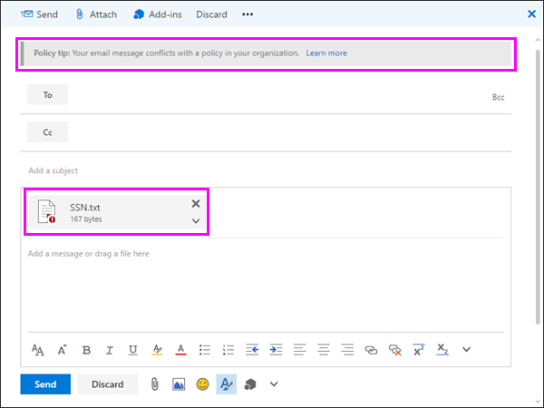
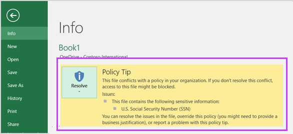

# Senden von E-Mail-Benachrichtigungen und Anzeigen von Richtlinientipps für DLP-Richtlinien

Sie können eine Richtlinie zur Verhinderung von Datenverlust (Data Loss Prevention, DLP) verwenden, um vertrauliche Informationen in Office 365 zu identifizieren, zu überwachen und zu schützen. Sie möchten, dass Personen in Ihrer Organisation, die mit diesen vertraulichen Informationen arbeiten, ihre DLP-Richtlinien einhalten, sie aber nicht unnötig daran hindern, ihre Arbeit zu erledigen. Hier können E-Mail-Benachrichtigungen und Richtlinientipps hilfreich sein.
  

  
Ein Richtlinientipp ist eine Benachrichtigung oder Warnung, die angezeigt wird, wenn jemand mit Inhalten arbeitet, die mit einer DLP-Richtlinie in Konflikt stehen, z. B. Inhalte wie eine Excel-Arbeitsmappe auf einer OneDrive for Business-Website, die personenbezogene Informationen (PII) enthält und für einen externen Benutzer freigegeben wird.
  
Sie können E-Mail-Benachrichtigungen und Richtlinientipps verwenden, um das Bewusstsein zu erhöhen und die Mitarbeiter über die Richtlinien Ihrer Organisation zu informieren. Sie können Personen auch die Möglichkeit geben, die Richtlinie außer Kraft zu setzen, damit sie nicht blockiert werden, wenn sie eine gültige geschäftliche Notwendigkeit haben oder wenn die Richtlinie ein falsch positives Ergebnis erkennt.
  
Wenn Sie im Compliance Center eine DLP-Richtlinie erstellen, können Sie die Benutzerbenachrichtigungen für Folgendes konfigurieren:
  
- Senden Sie eine E-Mail-Benachrichtigung an die Von Ihnen ausgewählten Personen, die das Problem beschreiben.
> [!NOTE]
> Benachrichtigungs-E-Mails werden ungeschützte gesendet.
    
- Anzeigen eines Richtlinientipps für Inhalte, die mit der DLP-Richtlinie in Konflikt stehen:
    
  - Bei E-Mails in Outlook im Web und Outlook 2013 und höher wird der Richtlinientipp oben in einer Nachricht über den Empfängern angezeigt, während die Nachricht verfasst wird.
    
  - Für Dokumente in einem OneDrive for Business-Konto oder einer SharePoint Online-Website wird der Richtlinientipp durch ein Warnsymbol angezeigt, das auf dem Element angezeigt wird. Um weitere Informationen anzuzeigen, können Sie ein  Element auswählen und dann in der oberen rechten Ecke der Seite das Symbol  auswählen, um den Detailbereich zu öffnen. 
    
  - Für Excel-, PowerPoint- und Word-Dokumente, die auf einer OneDrive for Business-Website oder sharePoint Online-Website gespeichert sind, die in der DLP-Richtlinie enthalten ist, wird der Richtlinientipp in der Nachrichtenleiste und in der Backstage-Ansicht ( **Dateimenü** \> **Info**) angezeigt.
    
## Hinzufügen von Benutzerbenachrichtigungen zu einer DLP-Richtlinie

Wenn Sie eine DLP-Richtlinie erstellen, können Sie **Benutzerbenachrichtigungen** aktivieren. Wenn Benutzerbenachrichtigungen aktiviert sind, sendet Microsoft 365 sowohl E-Mail-Benachrichtigungen als auch Richtlinientipps. Sie können anpassen, an wen Benachrichtigungs-E-Mails gesendet werden, der E-Mail-Text und der Richtlinientipptext.
  
1. Wechseln Sie zu [https://protection.office.com](https://protection.office.com).
    
2. Melden Sie sich mit Ihrem Geschäfts-, Schul- oder Unikonto an. Sie befinden sich jetzt im Security &amp; Compliance Center.
    
3. In the Security &amp; Compliance Center left navigation Data Loss \> \> **Prevention** \> **Policy** \> **+ Create a policy**.
    
    
  
4. Wählen Sie die DLP-Richtlinienvorlage aus, die die Typen vertraulicher Informationen schützt, die Sie \> **als Nächstes** benötigen.
    
    Um mit einer leeren  Vorlage zu beginnen, wählen Sie \> **"Benutzerdefinierte Benutzerdefinierte Richtlinie** \> **weiter"** aus.
    
5. Benennen Sie die Richtlinie \> **als Nächstes.**
    
6. Führen Sie einen der folgenden Schritte aus, um die Speicherorte auszuwählen, die die DLP-Richtlinie schützen soll:
    
   - Choose **All locations in Office 365** \> **Next**.
    
   - Choose **Let me choose specific locations** \> **Next**.
    
   Wenn Sie einen gesamten Speicherort wie alle Exchange-E-Mails oder alle OneDrive-Konten einschließen oder ausschließen möchten, aktivieren oder deaktivieren Sie den **Status** dieses Speicherorts. 
    
   Um nur bestimmte SharePoint-Websites oder OneDrive-Konten einzuschließen, aktivieren Sie den **Status,** und klicken Sie dann auf die Links unter **"Einschließen",** um bestimmte Websites oder Konten auszuwählen. 
    
7. Wählen Sie **"Erweiterte Einstellungen** \> **verwenden" als Nächstes** aus.
    
8. Wählen Sie **+ Neue Regel** aus.
    
9. Schalten Sie im Regel-Editor unter **"Benutzerbenachrichtigungen"** den Status ein.
    
    

> [!NOTE]
> DLP-Richtlinien gelten für alle Dokumente, die der Richtlinie entsprechen, unabhängig davon, ob diese Dokumente neu oder vorhanden sind. Eine E-Mail-Benachrichtigung wird jedoch nur generiert, wenn neue Inhalte mit einer vorhandenen DLP-Richtlinie übereinstimmen. Vorhandene Inhalte sind geschützt, generieren jedoch keine Benutzerbenachrichtigung per E-Mail.
  
## Optionen zum Konfigurieren von E-Mail-Benachrichtigungen

Für jede Regel in einer DLP-Richtlinie haben Sie folgende Möglichkeiten:
  
- Senden Sie die Benachrichtigung an die von Ihnen ausgewählten Personen. Diese Personen können den Besitzer des Inhalts, die Person, die den Inhalt zuletzt geändert hat, den Besitzer der Website, auf der der Inhalt gespeichert ist, oder einen bestimmten Benutzer einschließen.
    
- Passen Sie den Text, der in der Benachrichtigung enthalten ist, mithilfe von HTML oder Token an. Weitere Informationen hierzu finden Sie im nachstehenden Abschnitt.
    
> [!NOTE]
>  E-Mail-Benachrichtigungen können nur an einzelne Empfänger gesendet werden, nicht an Gruppen oder Verteilerlisten. Nur neue Inhalte lösen eine E-Mail-Benachrichtigung aus. Das Bearbeiten vorhandener Inhalte löst Richtlinientipps aus, jedoch keine E-Mail-Benachrichtigung. 
  

  
### Standard-E-Mail-Benachrichtigung

Benachrichtigungen haben eine Betreffzeile, die mit der ausgeführten Aktion beginnt, z. B. "Benachrichtigung", "Nachricht blockiert" für E-Mails oder "Zugriff blockiert" für Dokumente. Wenn es sich bei der Benachrichtigung um ein Dokument handelt, enthält der Nachrichtentext der Benachrichtigung einen Link, der Sie zu der Website führt, auf der das Dokument gespeichert ist, und öffnet den Richtlinientipp für das Dokument, in dem Sie alle Probleme beheben können (siehe abschnitt unten zu Richtlinientipps). Wenn es sich bei der Benachrichtigung um eine Nachricht handelt, enthält die Benachrichtigung als Anlage die Nachricht, die einer DLP-Richtlinie entspricht.
  

  
Standardmäßig wird in Benachrichtigungen text ähnlich dem folgenden für ein Element auf einer Website angezeigt. Der Benachrichtigungstext wird für jede Regel separat konfiguriert, sodass sich der angezeigte Text in Abhängigkeit davon unterscheidet, welche Regel abgeglichen wird.

|**Wenn die DLP-Richtlinienregel dies tut...**|**In der Standardbenachrichtigung für SharePoint- oder OneDrive for Business-Dokumente wird folgendes angegeben...**|**Dann wird in der Standardbenachrichtigung für Outlook-Nachrichten folgendes angezeigt...**|
|:-----|:-----|:-----|
|Sendet eine Benachrichtigung, lässt jedoch keine Außerkraftsetzung zu    |Dieses Element ist mit einer Richtlinie in Ihrer Organisation in Konflikt.    |Ihre E-Mail-Nachricht ist mit einer Richtlinie in Ihrer Organisation in Konflikt.    |
|Blockiert den Zugriff, sendet eine Benachrichtigung und lässt Außerkraftsetzung zu    |Dieses Element ist mit einer Richtlinie in Ihrer Organisation in Konflikt. Wenn Sie diesen Konflikt nicht lösen, wird der Zugriff auf diese Datei möglicherweise blockiert.    |Ihre E-Mail-Nachricht ist mit einer Richtlinie in Ihrer Organisation in Konflikt. Die Nachricht wurde nicht an alle Empfänger übermittelt.    |
|Blockiert den Zugriff und sendet eine Benachrichtigung    |Dieses Element ist mit einer Richtlinie in Ihrer Organisation in Konflikt. Der Zugriff auf dieses Element wird für alle Personen mit Ausnahme des Besitzers, des letzten Modifizierers und des primären Websitesammlungsadministrators blockiert.    |Ihre E-Mail-Nachricht ist mit einer Richtlinie in Ihrer Organisation in Konflikt. Die Nachricht wurde nicht an alle Empfänger übermittelt.    |
   
### Benutzerdefinierte E-Mail-Benachrichtigung

Sie können eine benutzerdefinierte E-Mail-Benachrichtigung erstellen, anstatt die Standard-E-Mail-Benachrichtigung an Ihre Endbenutzer oder Administratoren zu senden. Die benutzerdefinierte E-Mail-Benachrichtigung unterstützt HTML und hat einen Grenzwert von 5.000 Zeichen. Sie können HTML verwenden, um Bilder, Formatierungen und andere Brandings in die Benachrichtigung einzuschließen.
  
Sie können auch die folgenden Token verwenden, um die E-Mail-Benachrichtigung anzupassen. Diese Token sind Variablen, die durch bestimmte Informationen in der gesendeten Benachrichtigung ersetzt werden.

|**Token**|**Beschreibung**|
|:-----|:-----|
|%%AppliedActions%%    |Die Aktionen, die auf den Inhalt angewendet werden.    |
|%%ContentURL%%    |Die URL des Dokuments auf der SharePoint Online- oder OneDrive for Business-Website.    |
|%%MatchedConditions%%    |Die Bedingungen, die vom Inhalt erfüllt wurden. Verwenden Sie dieses Token, um Personen über mögliche Probleme mit dem Inhalt zu informieren.    |
   

  
## Optionen zum Konfigurieren von Richtlinientipps

Für jede Regel in einer DLP-Richtlinie können Sie Richtlinientipps für Folgendes konfigurieren:
  
- Benachrichtigen Sie einfach die Person, dass der Inhalt mit einer DLP-Richtlinie in Konflikt gerät, damit sie Maßnahmen ergreifen kann, um den Konflikt zu lösen. Sie können den Standardtext verwenden (siehe tabellen unten) oder benutzerdefinierten Text zu den spezifischen Richtlinien Ihrer Organisation eingeben.
    
- Zulassen, dass die Person die DLP-Richtlinie außer Kraft setzt. Optional können Sie:
    
  - Die Person muss eine geschäftliche Begründung für das Überschreiben der Richtlinie eingeben. Diese Informationen werden protokolliert, und Sie können sie in den DLP-Berichten im Abschnitt **"Berichte"** des Security &amp; Compliance Centers anzeigen. 
    
  - Zulassen, dass die Person ein falsch positives Ergebnis meldet und die DLP-Richtlinie außer Kraft setzt. Diese Informationen werden auch für die Berichterstellung protokolliert, sodass Sie falsch positive Ergebnisse verwenden können, um Ihre Regeln zu optimieren.
    

  
Sie können beispielsweise eine DLP-Richtlinie auf OneDrive for Business-Websites anwenden, die personenbezogene Informationen (PII) erkennt, und diese Richtlinie hat drei Regeln:
  
1. First rule: If fewer than five instances of this sensitive information are detected in a document, and the document is shared with people inside the organization, the **Send a notification** action displays a policy tip. Für Richtlinientipps sind keine Außerkraftsetzungsoptionen erforderlich, da diese Regel einfach Personen benachrichtigt und den Zugriff nicht blockiert. 
    
2. Zweite Regel: Wenn mehr als fünf Instanzen dieser vertraulichen Informationen in einem Dokument erkannt werden und das Dokument für Personen innerhalb der Organisation freigegeben wird, schränkt die Aktion **"Zugriff auf Inhalt** blockieren" die Berechtigungen für die Datei ein, und mit der Aktion **"Benachrichtigung senden"** können Personen die Aktionen in dieser Regel außer Kraft setzen, indem sie eine geschäftliche Begründung angeben. Das Unternehmen Ihrer Organisation erfordert manchmal, dass interne Personen PII-Daten freigeben, und Sie möchten nicht, dass Ihre DLP-Richtlinie diese Arbeit blockiert. 
    
3. Dritte Regel: Wenn mehr als fünf Instanzen dieser vertraulichen Informationen in einem Dokument erkannt werden und das Dokument für Personen außerhalb der Organisation freigegeben wird, schränkt die Aktion **"Zugriff auf Inhalt** blockieren" die Berechtigungen für die Datei ein, und mit der **Aktion "Benachrichtigung senden"** können Personen die Aktionen in dieser Regel nicht außer Kraft setzen, da die Informationen extern freigegeben werden. Unter keinen Umständen dürfen Personen in Ihrer Organisation personenbezogene Daten außerhalb der Organisation freigeben. 
    
Hier sind einige hinweise, die Sie bei der Verwendung eines Richtlinientipps zum Überschreiben einer Regel beachten sollten:
  
- Die Option zum Außerkraftsetzen gilt pro Regel und überschreibt alle Aktionen in der Regel (mit Ausnahme des Sendens einer Benachrichtigung, die nicht überschrieben werden kann).
    
- Es ist möglich, dass Inhalte mit mehreren Regeln in einer DLP-Richtlinie übereinstimmen, aber nur der Richtlinientipp der restriktivsten Regel mit der höchsten Priorität wird angezeigt. So hat beispielsweise der Richtlinientipp zu einer Regel, die Zugriff auf Inhalte blockiert, Vorrang gegenüber dem Richtlinientipp zu einer Regel, die einfach nur eine Benachrichtigung sendet. Dadurch wird verhindert, dass Benutzern eine umfangreiche Liste von Richtlinientipps angezeigt wird.
    
- Wenn die Richtlinientipps in der restriktivsten Regel Benutzern erlauben, die Regel außer Kraft zu setzen, werden dadurch auch alle anderen Regeln überschrieben, die für den Inhalt gelten.
    
## Richtlinientipps zu OneDrive for Business-Websites und SharePoint Online-Websites

Wenn ein Dokument auf einer OneDrive for Business-Website oder einer SharePoint Online-Website einer Regel in einer DLP-Richtlinie entspricht und diese Regel Richtlinientipps verwendet, zeigen die Richtlinientipps spezielle Symbole im Dokument an:
  
1. Wenn die Regel eine Benachrichtigung über die Datei sendet, wird das Warnsymbol angezeigt.
    
2. Wenn die Regel den Zugriff auf das Dokument blockiert, wird das blockierte Symbol angezeigt.
    
   
  
To take action on a document, you can select an item \> choose **Information** pane icon in  upper-right corner of the page to open the details pane \> **View policy tip**.
  
Der Richtlinientipp listet die Probleme mit dem Inhalt auf. Wenn die Richtlinientipps mit diesen Optionen konfiguriert sind, können Sie **"Auflösen"** auswählen und dann den Richtlinientipp **außer Kraft setzen** oder ein falsch positives Ergebnis **melden.** 
  

  

  
DLP-Richtlinien werden mit Websites synchronisiert und Inhalte werden in regelmäßigen Abständen und asynchron ausgewertet, sodass zwischen dem Erstellen der DLP-Richtlinie und dem Zeitpunkt, zu dem Sie mit dem Anzeigen von Richtlinientipps beginnen, eine kurze Verzögerung auftreten kann. Es kann eine ähnliche Verzögerung geben, ab dem Zeitpunkt, an dem Sie einen Richtlinientipp auflösen oder überschreiben, bis das Symbol im Dokument auf der Website entfernt wird.
  
### Standardtext für Richtlinientipps auf Websites

Richtlinientipps zeigen standardmäßig Text ähnlich dem folgenden für ein Element auf einer Website an. Der Benachrichtigungstext wird für jede Regel separat konfiguriert, sodass sich der angezeigte Text in Abhängigkeit davon unterscheidet, welche Regel abgeglichen wird.

|**Wenn die DLP-Richtlinienregel dies tut...**|**Der Standardrichtlinientipp besagt dann Folgendes...**|
|:-----|:-----|
|Sendet eine Benachrichtigung, lässt jedoch keine Außerkraftsetzung zu    |Dieses Element ist mit einer Richtlinie in Ihrer Organisation in Konflikt.    |
|Blockiert den Zugriff, sendet eine Benachrichtigung und lässt Außerkraftsetzung zu    |Dieses Element ist mit einer Richtlinie in Ihrer Organisation in Konflikt. Wenn Sie diesen Konflikt nicht lösen, wird der Zugriff auf diese Datei möglicherweise blockiert.    |
|Blockiert den Zugriff und sendet eine Benachrichtigung    |Dieses Element ist mit einer Richtlinie in Ihrer Organisation in Konflikt. Der Zugriff auf dieses Element wird für alle Personen mit Ausnahme des Besitzers, des letzten Modifizierers und des primären Websitesammlungsadministrators blockiert.    |
   
### Benutzerdefinierter Text für Richtlinientipps auf Websites

Sie können den Text für Richtlinientipps separat von der E-Mail-Benachrichtigung anpassen. Im Gegensatz zu benutzerdefiniertem Text für E-Mail-Benachrichtigungen (siehe abschnitt oben) akzeptiert benutzerdefinierter Text für Richtlinientipps keine HTML oder Token. Stattdessen ist benutzerdefinierter Text für Richtlinientipps nur Nur-Text mit einer Beschränkung von 256 Zeichen.
  
## Richtlinientipps in Outlook im Web und Outlook 2013 und höher

Wenn Sie eine neue E-Mail in Outlook im Web und Outlook 2013 und höher verfassen, wird ein Richtlinientipp angezeigt, wenn Sie Inhalte hinzufügen, die einer Regel in einer DLP-Richtlinie entsprechen, und diese Regel Richtlinientipps verwendet. Der Richtlinientipp wird oben in der Nachricht oberhalb der Empfänger angezeigt, während die Nachricht verfasst wird.
  

  
Richtlinientipps funktionieren unabhängig davon, ob die vertraulichen Informationen im Nachrichtentext, in der Betreffzeile oder sogar in einer Nachrichtenanlage angezeigt werden, wie hier gezeigt.
  

  
Wenn die Richtlinientipps so konfiguriert sind, dass die Außerkraftsetzung zugelassen wird, können Sie **"Details** außer Kraft setzen" auswählen, \>  \> um eine geschäftliche Begründung einzugeben oder eine falsch positive \> **Außerkraftsetzung zu melden.**
  

  

  
Beachten Sie, dass beim Hinzufügen vertraulicher Informationen zu einer E-Mail möglicherweise eine Latenz zwischen dem Hinzufügen der vertraulichen Informationen und dem Anzeigen des Richtlinientipps besteht.

### Outlook 2013 und höher unterstützt das Anzeigen von Richtlinientipps nur für einige Bedingungen

Derzeit unterstützt Outlook 2013 und höher das Anzeigen von Richtlinientipps nur für diese Bedingungen:

- Inhalt enthält
- Inhalt wird freigegeben

Beachten Sie, dass Ausnahmen als Bedingungen betrachtet werden und alle diese Bedingungen in Outlook funktionieren, wo sie mit Inhalten übereinstimmen und Schutzaktionen für Inhalte erzwingen. Das Anzeigen von Richtlinientipps für Benutzer wird jedoch noch nicht unterstützt. 
  
### Richtlinientipps im Exchange Admin Center im Vergleich zum Security &amp; Compliance Center

Richtlinientipps können entweder mit DLP-Richtlinien und Nachrichtenflussregeln funktionieren, die im Exchange Admin Center erstellt wurden, oder mit DLP-Richtlinien, die im Security Compliance Center erstellt &amp; wurden, aber nicht mit beiden. Dies liegt daran, dass diese Richtlinien an verschiedenen Speicherorten gespeichert werden, Richtlinientipps jedoch nur von einem einzigen Speicherort gezeichnet werden können.
  
Wenn Sie Richtlinientipps im Exchange Admin Center konfiguriert haben, werden alle Richtlinientipps, die Sie im Security Compliance Center konfigurieren, &amp; benutzern in Outlook im Web und Outlook 2013 und höher erst angezeigt, wenn Sie die Tipps im Exchange Admin Center deaktivieren. Dadurch wird sichergestellt, dass Ihre aktuellen Exchange-Nachrichtenflussregeln (auch als Transportregeln bezeichnet) weiterhin funktionieren, bis Sie sich entscheiden, zum Security Compliance Center zu &amp; wechseln.
  
Beachten Sie, dass Richtlinientipps zwar nur von einem einzigen Speicherort aus gezeichnet werden können, E-Mail-Benachrichtigungen aber immer gesendet werden, auch wenn Sie DLP-Richtlinien sowohl im Security Compliance Center als auch &amp; im Exchange Admin Center verwenden.
  
### Standardtext für Richtlinientipps in E-Mails

Richtlinientipps zeigen standardmäßig Text an, der dem folgenden für E-Mails ähnelt.

|**Wenn die DLP-Richtlinienregel dies tut...**|**Der Standardrichtlinientipp besagt dann Folgendes...**|
|:-----|:-----|
|Sendet eine Benachrichtigung, lässt jedoch keine Außerkraftsetzung zu    |Ihre E-Mails stehen in Konflikt mit einer Richtlinie in Ihrer Organisation.    |
|Blockiert den Zugriff, sendet eine Benachrichtigung und lässt Außerkraftsetzung zu    |Ihre E-Mails stehen in Konflikt mit einer Richtlinie in Ihrer Organisation.    |
|Blockiert den Zugriff und sendet eine Benachrichtigung    |Ihre E-Mails stehen in Konflikt mit einer Richtlinie in Ihrer Organisation.    |
   
## Richtlinientipps in Excel, PowerPoint und Word

Wenn Personen mit vertraulichen Inhalten in den Desktopversionen von Excel, PowerPoint und Word arbeiten, können Richtlinientipps sie in Echtzeit benachrichtigen, dass der Inhalt mit einer DLP-Richtlinie in Konflikt tritt. Dies erfordert Folgendes:
  
- Das Office-Dokument wird auf einer OneDrive for Business-Website oder einer SharePoint Online-Website gespeichert.
    
- Die Website ist in einer DLP-Richtlinie enthalten, die für die Verwendung von Richtlinientipps konfiguriert ist.
    
Office-Desktopprogramme synchronisieren DLP-Richtlinien automatisch direkt aus Office 365 und scannen dann Ihre Dokumente, um sicherzustellen, dass sie nicht mit Ihren DLP-Richtlinien in Konflikt stehen und Richtlinientipps in Echtzeit anzeigen.

> [!NOTE]
> Office-Desktop-Apps scannen Dokumente selbst, um festzustellen, ob DLP-Richtlinientipps angezeigt werden sollen. Sie zeigen keine Richtlinientipps an, die sharePoint Online-Websites oder OneDrive for Business-Websites bereits festgelegt haben, sollten in einer Datei angezeigt werden. Daher wird möglicherweise nicht immer ein DLP-Richtlinientipp in den Desktop-Apps angezeigt, die Auf den SharePoint Online-Websites oder OneDrive for Business-Websites angezeigt werden. Im Gegensatz dazu zeigen die Office-Anwendungen im Web nur DLP-Richtlinientipps an, die sharePoint Online-Websites oder OneDrive for Business-Websites bereits festgelegt haben, sollten angezeigt werden.
  
Je nachdem, wie Sie die Richtlinientipps in der DLP-Richtlinie konfigurieren, können Benutzer einfach den Richtlinientipp ignorieren, die Richtlinie mit oder ohne geschäftliche Begründung außer Kraft setzen oder ein falsch positives Ergebnis melden.
  
Richtlinientipps werden auf der Nachrichtenleiste angezeigt.
  

  
Richtlinientipps werden auch in der Backstage-Ansicht (auf der Registerkarte **"Datei")** angezeigt. 
  

  
Wenn Richtlinientipps in der DLP-Richtlinie mit diesen Optionen konfiguriert sind, können Sie **"Auflösen"** auswählen, um einen Richtlinientipp außer Kraft zu **setzen,** oder "Falsch positives Ergebnis **melden".** 
  

  
In jedem dieser Office-Desktopprogramme können Benutzer Richtlinientipps deaktivieren. Wenn diese Option deaktiviert ist, werden Richtlinientipps, bei denen es sich um einfache Benachrichtigungen handelt, nicht in der Nachrichtenleiste oder backstage-Ansicht (auf der Registerkarte **"Datei")** angezeigt. Richtlinientipps zum Blockieren und Überschreiben werden jedoch weiterhin angezeigt, und sie erhalten weiterhin die E-Mail-Benachrichtigung. Darüber hinaus wird durch das Deaktivieren von Richtlinientipps das Dokument nicht von DLP-Richtlinien ausgenommen, die darauf angewendet wurden. 
  
### Standardtext für Richtlinientipps in Excel 2016, PowerPoint 2016 und Word 2016

Richtlinientipps zeigen standardmäßig Ähnlich wie in der Nachrichtenleiste und backstage-Ansicht eines geöffneten Dokuments Text an. Der Benachrichtigungstext wird für jede Regel separat konfiguriert, sodass sich der angezeigte Text in Abhängigkeit davon unterscheidet, welche Regel abgeglichen wird.

|**Wenn die DLP-Richtlinienregel dies tut...**|**Der Standardrichtlinientipp besagt dann Folgendes...**|
|:-----|:-----|
|Sendet eine Benachrichtigung, lässt jedoch keine Außerkraftsetzung zu    |Diese Datei ist mit einer Richtlinie in Ihrer Organisation in Konflikt. Wechseln Sie zum Menü **"Datei",** um weitere Informationen zu erfahren.    |
|Blockiert den Zugriff, sendet eine Benachrichtigung und lässt Außerkraftsetzung zu    |Diese Datei ist mit einer Richtlinie in Ihrer Organisation in Konflikt. Wenn Sie diesen Konflikt nicht lösen, wird der Zugriff auf diese Datei möglicherweise blockiert. Wechseln Sie zum Menü **"Datei",** um weitere Informationen zu erfahren.    |
|Blockiert den Zugriff und sendet eine Benachrichtigung    |Diese Datei ist mit einer Richtlinie in Ihrer Organisation in Konflikt. Wenn Sie diesen Konflikt nicht lösen, wird der Zugriff auf diese Datei möglicherweise blockiert. Wechseln Sie zum Menü **"Datei",** um weitere Informationen zu erfahren.    |
   
### Benutzerdefinierter Text für Richtlinientipps in Excel, PowerPoint und Word

Sie können den Text für Richtlinientipps separat von der E-Mail-Benachrichtigung anpassen. Im Gegensatz zu benutzerdefiniertem Text für E-Mail-Benachrichtigungen (siehe abschnitt oben) akzeptiert benutzerdefinierter Text für Richtlinientipps keine HTML oder Token. Stattdessen ist benutzerdefinierter Text für Richtlinientipps nur Nur-Text mit einer Beschränkung von 256 Zeichen.
  
## Weitere Informationen

- [Informationen zur Verhinderung von Datenverlust](dlp-learn-about-dlp.md)    
- [Erstellen einer DLP-Richtlinie aus einer Vorlage](create-a-dlp-policy-from-a-template.md)
- [DLP-Richtlinienbedingungen, -Ausnahmen und -Aktionen (Vorschau)](./dlp-microsoft-teams.md) 
- [Erstellen einer DLP-Richtlinie zum Schützen von Dokumenten mit FCI- oder anderen Eigenschaften](protect-documents-that-have-fci-or-other-properties.md)
- [Bestandteile von DLP-Richtlinienvorlagen](what-the-dlp-policy-templates-include.md)
- [Entitätsdefinitionen für Typen vertraulicher Informationen](sensitive-information-type-entity-definitions.md)