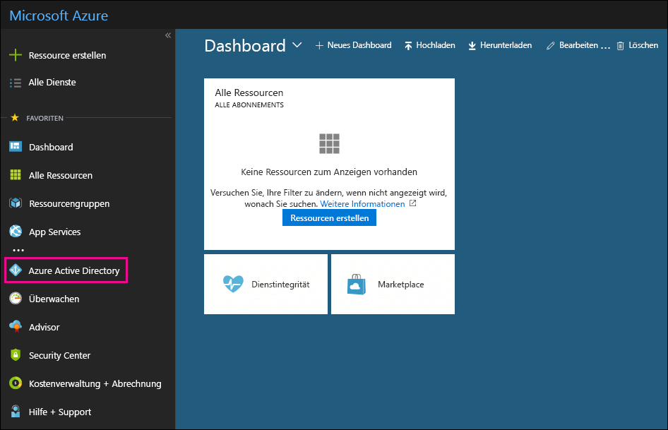

# Verwenden Ihres kostenlosen Azure Active Directory-AbonnementsUse your free Azure Active Directory subscription

Wenn Ihre Organisation über ein kostenpflichtiges Abonnement für Microsoft 365, Microsoft Dynamics CRM Online, Enterprise Mobility Suite oder andere Microsoft-Dienste verfügt, haben Sie ein kostenloses Abonnement für Microsoft Azure Active Directory. Sie und andere Administratoren können Azure AD zum Erstellen und Verwalten von Benutzer- und Gruppenkonten verwenden. Zur Verwendung von Azure AD wechseln Sie einfach in das Azure-Portal und melden sich mit Ihrem Konto an.If your organization has a paid subscription to Microsoft 365, Microsoft Dynamics CRM Online, Enterprise Mobility Suite, or other Microsoft services, you have a free subscription to Microsoft Azure Active Directory. You and other admins can use Azure AD to create and manage user and group accounts. To use Azure AD, just go to the Azure portal and sign in to your account.

## Öffnen einer privaten BrowsersitzungOpen a private browsing session

Verwenden Sie eine private Browsersitzung (keine reguläre Sitzung) für den Zugriff auf das Azure-Portal (in Schritt 1 unten). Dadurch wird verhindert, dass die Anmeldeinformationen, mit denen Sie derzeit angemeldet sind, an Azure übermittelt werden. So öffnen Sie eine private Browsersitzung:Use a private browsing session (not a regular session) to access the Azure portal (in step 1 below). This prevents the credentials that you're currently logged on with from being passed to Azure. To open a private browsing session:

- Drücken Sie in Microsoft Edge (Legacy-Version), Internet Explorer oder Mozilla Firefox `CTRL+SHIFT+P`.In Microsoft Edge (legacy version), Internet Explorer, or Mozilla FireFox, press `CTRL+SHIFT+P`.

- Drücken Sie in Microsoft Edge (neueste Version) oder Google Chrome `CTRL+SHIFT+N`.In Microsoft Edge (newest version) or Google Chrome, press `CTRL+SHIFT+N`.

## Zugreifen auf Azure Active DirectoryAccess Azure Active Directory

1. Wechseln Sie zu [portal.azure.com](https://portal.azure.com), und melden Sie sich mit Ihrem Geschäfts-, Schul- oder Unikonto an.Go to [portal.azure.com](https://portal.azure.com) and sign in with your work or student account.

2. Klicken Sie im Azure-Portal im linken Navigationsbereich auf **Azure Active Directory**.In the left navigation pane in the Azure portal, click **Azure Active Directory**.

    

    Das **Azure Active Directory** Admin Center wird angezeigt.The **Azure Active Directory** admin center is displayed.

## Weitere InformationenMore information

- Ein kostenloses Azure Active Directory-Abonnement enthält keinen Anmeldeaktivitätenbericht.A free Azure Active Directory subscription does not include the Sign-ins activity report. Wenn Sie Anmeldeaktivitäten aufzeichnen möchten (was bei einer Datenschutzverletzung hilfreich sein kann), benötigen Sie ein Azure Active Directory Premium-Abonnement.To record sign-in activity (which can be useful in a data breach), you need an Azure Active Directory Premium subscription. Weitere Informationen finden Sie unter [Wie lange speichert Azure AD die Daten?](https://docs.microsoft.com/azure/active-directory/reports-monitoring/reference-reports-data-retention#how-long-does-azure-ad-store-the-data)For more information, see [How long does Azure AD store the data?](https://docs.microsoft.com/azure/active-directory/reports-monitoring/reference-reports-data-retention#how-long-does-azure-ad-store-the-data).

- Sie können auf das **Azure Active Directory** Admin Center auch aus dem Microsoft 365 Admin Center heraus zugreifen.You can also access the **Azure Active Directory** admin center from the Microsoft 365 admin center. Klicken Sie im Microsoft 365 Admin Center im linken Navigationsbereich auf **Admin Center** \> **Azure Active Directory**.In the left navigation pane of the Microsoft 365 admin center, click **Admin centers** \> **Azure Active Directory**.

- Informationen zum Verwalten von Benutzern und Gruppen und Ausführen anderer Verzeichnisverwaltungsaufgaben finden Sie unter [Verwalten Ihres Azure AD-Verzeichnisses](https://docs.microsoft.com/azure/active-directory/active-directory-administer).For information about managing users and groups and performing other directory management tasks, see [Manage your Azure AD directory](https://docs.microsoft.com/azure/active-directory/active-directory-administer).
