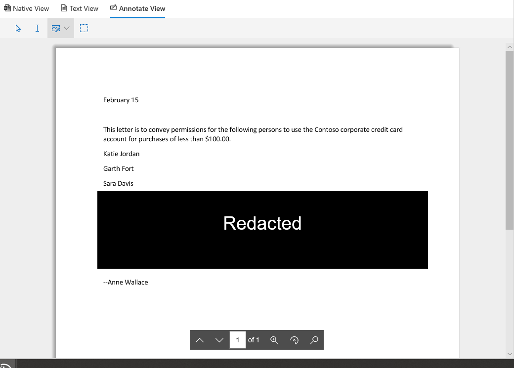

# Anzeigen von Dokumenten in einem Prüfdateisatz in Advanced eDiscoveryView documents in a review set in Advanced eDiscovery

Advanced eDiscovery zeigt Inhalte über mehrere Viewer zu unterschiedlichen Zwecken an.Advanced eDiscovery displays content via several viewers each with different purposes. Sie können die verschiedenen Viewer verwenden, indem Sie auf ein beliebiges Dokument in einem Prüfdateisatz klicken.The various viewers can be used by clicking on any document within a review set. Die derzeit bereitgestellten Viewer sind:The viewers currently provided are:

- DateimetadatenFile metadata
- Native AnsichtNative view
- TextansichtText view
- KommentaransichtAnnotate view

## DateimetadatenFile metadata

Dieser Bereich kann ein-/ausgeschaltet werden, um verschiedene Metadaten anzuzeigen, die dem Dokument zugeordnet sind.This panel can be toggled on/off to display various metadata associated with the document. Obwohl das Suchergebnis-Raster angepasst werden kann, um bestimmte Metadaten anzuzeigen, gibt es Fälle, in denen das horizontale Scrollen beim Überprüfen von Daten schwierig sein kann.Although the search results grid can be customized to display specific metadata, there are instances where scrolling horizontally can be difficult while reviewing data. Der Bereich "Dateimetadaten" ermöglicht es einem Benutzer, die Ansicht im Viewer zu wechseln.The File metadata panel allows a user to toggle on a view within the viewer.

## Native AnsichtNative view

Der native Viewer zeigt die umfangreichste Ansicht eines Dokuments an.The Native viewer displays the richest view of a document. Er unterstützt Hunderte von Dateitypen und soll eine möglichst native Erfahrung ermöglichen.It supports hundreds of file types and is meant to display the truest to native experience possible. Bei Microsoft Office-Dateien verwendet der Viewer die Webversion von Office-Apps, um Inhalte wie Dokumentenkommentare, Excel-Formeln, ausgeblendete Zeilen/Spalten und PowerPoint-Notizen anzuzeigen.For Microsoft Office files, the viewer uses the web version of Office apps to display content such as document comments, Excel formulas, hidden rows/columns, and PowerPoint notes.

## TextansichtText view

Der Text-Viewer bietet eine Ansicht des extrahierten Texts einer Datei.The Text viewer provides a view of the extracted text of a file. Er ignoriert eingebettete Bilder und Formatierungen, ist aber sehr effektiv, wenn Sie den Inhalt schnell verstehen möchten.It ignores any embedded images and formatting but is very effective if you are trying to understand the content quickly. Die Textansicht bietet außerdem die folgenden Features:Text view also includes these features:

- Der Zeilenzähler erleichtert das Verweisen auf bestimmte Teile eines Dokuments.Line counter makes it easier to reference specific portions of a document
- Hervorhebung von Suchtreffer, die Ausdrücke innerhalb des Dokuments sowie die Bildlaufleiste hervorhebtSearch hit highlighting that will highlight terms within the document as well as the scrollbar
- Die Diff-Ansicht bietet eine Vergleichsansicht, in der textbezogene Unterschiede beim Anzeigen von Dokumenten mit der Nähe von Duplikaten hervorgehoben werden.Diff view provides a comparison view that highlights textual differences when viewing Near Duplicate documents

## KommentaransichtAnnotate view

Die Kommentaransicht bietet Features, mit denen Benutzer Markup auf ein Dokument anwenden können, einschließlich:The Annotate view provides features that allow users to apply markup on a document including:

- Bereichsraktion – Benutzer können ein Feld auf dem Dokument zeichnen, um vertrauliche Inhalte auszublenden.Area redactions – users can draw a box on the document in order to hide sensitive content
- Bleistift – Benutzer können ein Dokument frei zeichnen, um auf bestimmte Teile eines Dokuments aufmerksam zu machenPencil – users can free-hand draw on a document in order to bring attention to certain portions of a document
- Anmerkungen auswählen – Benutzer können Anmerkungen in einem Dokument auswählen, um sie zu löschenSelect annotations - users can select annotations on a document in order to delete
- Umschalten der Anmerkungstransparenz – macht Anmerkungen halbtransparent, um den Inhalt hinter der Anmerkung anzuzeigenToggle annotation transparency – makes annotations semi-transparent in order to view the content behind the annotation
- Vorherige Seite – navigiert zur vorherigen SeitePrevious page – navigates to previous page
- Nächste Seite – navigiert zur nächsten SeiteNext page – navigates to the next page
- Zur Seite wechseln – Benutzer kann eine bestimmte Seitenzahl eingeben, zu der navigiert werden sollGo to page – user can enter a specific page number to navigate to
- Zoom – Festlegen des Zoomfaktors für die KommentaransichtZoom – set zoom level for annotate view
- Drehen – Benutzer kann Dokument im Uhrzeigersinn drehenRotate – user can rotate document clockwise
- Suche – Benutzer kann in einem Dokument suchen und zu den verschiedenen Treffern im Dokument navigierenSearch – user can search within a document and navigate to the various hits within the document

  

## DashboardansichtDashboard View

Mit der Dashboardansicht können Sie die Daten in Ihrem Suchergebnisraster visualisieren und zusammenfassen.The dashboard view allows you to visualize and summarize the data in your search results grid. In dieser Ansicht können Sie benutzerdefinierte Widgets erstellen, um die Analyse und Berichterstellung ihres Prüfdateisatzes intuitiv und einfach zu gestalten.In this view, you can create custom widgets to make analyzing and reporting on your review set intuitive and easy. Nachdem Sie Ihre Widgets erstellt haben, können Sie mit ihnen interagieren, um die Elementanzahl abzurufen oder eine Suche zu erstellen.Once you have created your widgets, you can interact with them to get item counts or to create a search.
