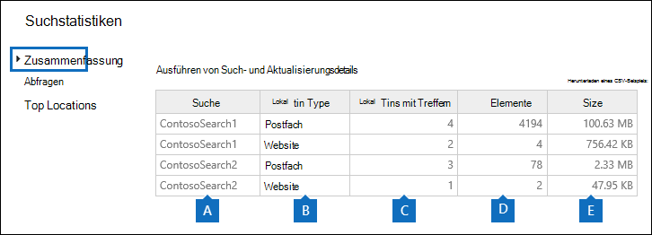
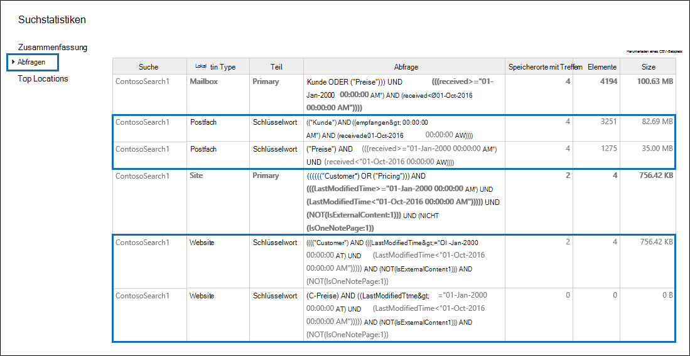

# Anzeigen der Schlüsselwortstatistik für InhaltssuchergebnisseView keyword statistics for Content Search results

Nachdem Sie eine Inhaltssuche erstellt und ausgeführt haben, können Sie Statistiken zu den geschätzten Suchergebnissen anzeigen.After you create and run a Content Search, you can view statistics about the estimated search results. Dies umfasst eine Zusammenfassung der Suchergebnisse (ähnlich der Zusammenfassung der geschätzten Suchergebnisse, die im Detailbereich angezeigt werden), die Abfragestatistiken, z. B. die Anzahl der Inhaltsorte mit Elementen, die mit der Suchabfrage übereinstimmen, und den Namen von Inhaltsstandorten mit den meisten übereinstimmenden Elementen.This includes a summary of the search results (similar to the summary of the estimated search results displayed in the details pane), the query statistics such as the number of content locations with items that match the search query, and the name of content locations that have the most matching items. Sie können Statistiken für eine oder mehrere Inhaltssuchen anzeigen.You can display statistics for one or more content searches. Auf diese Weise können Sie die Ergebnisse für mehrere Suchanfragen schnell vergleichen und Entscheidungen über die Effektivität Ihrer Suchabfragen treffen.This lets you to quickly compare the results for multiple searches and make decisions about the effectiveness of your search queries.
  
Darüber hinaus können Sie neue und vorhandene Suchabfragen so konfigurieren, dass Statistiken für jedes Schlüsselwort in einer Suchabfrage zurückgegeben werden.Additionally, you can configure new and existing searches to return statistics for each keyword in a search query. Auf diese Weise können Sie die Anzahl der Ergebnisse für jedes Schlüsselwort in einer Abfrage vergleichen und die Schlüsselwortstatistiken aus mehreren Suchen vergleichen.This lets you compare the number of results for each keyword in a query and to compare the keyword statistics from multiple searches.
  
Sie können auch die Such- und Schlüsselwortstatistik in einer CSV-Datei herunterladen.You can also download the search statistics and keyword statistics to a CSV file. Auf diese Weise können Sie die Filter- und Sortierfunktionen in Excel dazu verwenden, um Ergebnisse zu vergleichen und Berichte für Ihre Suchergebnisse vorzubereiten.This lets you use the filtering and sorting features in Excel to compare results, and prepare reports for your search results.
  
## Statistiken für Inhaltssuchen erhaltenGet statistics for Content Searches

So zeigen Sie Statistiken für Inhaltssuchen an:To display statistics for Content searches:
  
1. Wechseln Sie im Microsoft 365 Compliance Center zu **Alle**  >  **Inhaltssuche anzeigen.**In the Microsoft 365 compliance center, go to **Show all** > **Content search**.

2. Wählen Sie in der Liste der Suchaktionen zwei oder  mehr Suchaktionen aus, und klicken Sie dann auf der Flyoutseite **Massenaktionen** auf Suchstatistik.In the list of searches, select two or more searches, and then click **Search statistics** on the **Bulk actions** flyout page.
    
    
  
3. Klicken Sie **auf der** Seite Suchstatistik auf einen der folgenden Links, um Statistiken zu den ausgewählten Suchen anzeigen zu können.On the **Search statistics** page, click one of the following links to display statistics about the selected searches. 
    
    **Zusammenfassung****Summary**
    
    Diese Seite zeigt Statistiken ähnlich denen an, die im Detailbereich auf der Seite **Inhaltssuche angezeigt** werden.This page displays statistics similar to the ones displayed in the details pane on the **Content search** page. Statistiken für alle ausgewählten Suchen werden angezeigt.Statistics for all selected searches are displayed. Beachten Sie, dass Sie die ausgewählten Suchen auch auf dieser Seite erneut ausführen können, um die Statistiken zu aktualisieren.Note that you can also re-run the selected searches from this page to update the statistics. 
    
    
  
    a.a.  Der Name der Inhaltssuche.The name of the Content Search. Wie bereits erwähnt, können Sie Statistiken für mehrere Suchen anzeigen und vergleichen.As previously stated, you can display and compare statistics for multiple searches.
    
    b.b. Der Typ des Inhaltsspeicherorts, der durchsucht wurde.The type of content location that was searched. Jede Zeile zeigt Statistiken für Postfächer, Websites und öffentliche Ordner aus der angegebenen Suche an.Each row displays statistics for mailboxes, sites, and public folders from the specified search.
    
    c.c. Die Anzahl der Inhaltspositionen, die Elemente enthalten, die mit der Suchabfrage übereinstimmen.The number of content locations containing items that match the search query. Bei Postfächern enthält diese Statistik auch die Anzahl der Archivpostfächer, die Elemente enthalten, die mit der Suchabfrage übereinstimmen.For mailboxes, this statistic also includes the number of archive mailboxes that contain items that match the search query.
    
    d.d. Die Gesamtanzahl der Elemente aller angegebenen Inhaltspositionen, die mit der Suchabfrage übereinstimmen.The total number of items of all specified content locations that match the search query. Beispiele für Elementtypen sind E-Mail-Nachrichten, Kalenderelemente und Dokumente.Examples of item types include email messages, calendar items, and documents. Wenn ein Element mehrere Instanzen eines Schlüsselworts enthält, nach dem gesucht wird, wird es nur einmal in der Gesamtanzahl der Elemente gezählt.If an item contains multiple instances of a keyword that is being searched for, it's only counted once in the total number of items. Wenn Sie beispielsweise nach wörtern "stock" oder "fraud" suchen und eine E-Mail-Nachricht drei Instanzen des Worts "stock" enthält, wird sie nur einmal in der Spalte Elemente **gezählt.**For example, if you're searching for words "stock" or "fraud" and an email message contains three instances of the word "stock", it's only counted once in the **Items** column. 
    
    e.e. Die Gesamtgröße aller Elemente, die am angegebenen Inhaltsspeicherort gefunden wurden, die mit der Suchabfrage übereinstimmen.The total size of all items that were found in the specified content location that match the search query. 
    
    **Abfragen****Queries**
    
    Auf dieser Seite werden Statistiken zur Suchabfrage angezeigt.This page displays statistics about the search query.
    
    
  
    a.a. Der Name der Inhaltssuche, für die die Zeile Abfragestatistiken enthält.The name of the Content Search that the row contains query statistics for.
    
    b.b. Der Typ des Inhaltsspeicherorts, auf den die Abfragestatistiken anwendbar sind.The type of content location that the query statistics are applicable to.
    
    c.c. Diese Spalte gibt an, auf welchen Teil der Suchabfrage die Statistiken anwendbar sind.This column indicates which part of the search query the statistics are applicable to. **Primär** gibt die gesamte Suchabfrage an.**Primary** indicates the entire search query. Wenn Sie beim Erstellen oder Bearbeiten einer Suchabfrage eine Stichwortliste verwenden, sind Statistiken für jede Komponente der Abfrage in dieser Tabelle enthalten.If you use a keyword list when you create or edit a search query, statistics for each component of the query are included in this table. Weitere Informationen finden Sie im Abschnitt Get [keyword statistics for Content Searches](#get-keyword-statistics-for-content-searches) in diesem Artikel.See the [Get keyword statistics for Content Searches](#get-keyword-statistics-for-content-searches) section in this article for more information. 
    
    d.d. Diese Spalte enthält die tatsächliche Suchabfrage, die vom Tool für die Inhaltssuche ausgeführt wird.This column contains the actual search query that run by the Content Search tool. Beachten Sie, dass das Tool der von Ihnen erstellten Abfrage automatisch einige zusätzliche Komponenten hinzufügt.Note that the tool automatically adds a few additional components to the query that you create. 

    - Wenn Sie in Postfächern nach allen Inhalten suchen (indem Sie keine Schlüsselwörter angeben), ist die eigentliche Schlüsselwortabfrage so, dass alle  `size>=0` Elemente zurückgegeben werden.When you search for all content in mailboxes (by not specifying any keywords), the actual key word query is  `size>=0` so that all items are returned. 
    
     - Wenn Sie SharePoint Online- und OneDrive for #A0 durchsuchen, werden die beiden folgenden Komponenten hinzugefügt:When you search SharePoint Online and OneDrive for Business sites, the two following components are added:
    
          **NOT IsExternalContent:1** – Schließt alle Inhalte aus einer lokalen SharePoint-Organisation aus.**NOT IsExternalContent:1** - Excludes any content from an on-premises SharePoint organization. 
    
          **NOT IsOneNotePage:1** – Schließt alle OneNote-Dateien aus, da es sich dabei um Duplikate eines Dokuments handelt, das der Suchabfrage entspricht.**NOT IsOneNotePage:1** - Excludes all OneNote files because these would be duplicates of any document that matches the search query. 

    
    e.e. Die Anzahl der Inhaltsspeicherorte (angegeben durch die Spalte \*\* Speicherorttyp \*\* ), die Elemente enthalten, die der in der Spalte **Abfrage** aufgeführten Suchabfrage entsprechen.The number of the content locations (specified by the \*\* Location type \*\* column) that contain items that match the search query listed in the **Query** column. 
    
    f.f. Die Anzahl der Elemente (vom angegebenen Inhaltsspeicherort), die der in der Spalte Abfrage aufgeführten **Suchabfrage** entsprechen.The number of items (from the specified content location) that match the search query listed in the **Query** column. Wie bereits erläutert, wird ein Element nur einmal in dieser Spalte gezählt, wenn es mehrere Instanzen eines gesuchten Schlüsselworts enthält.As previously explained, if an item contains multiple instances of a keyword that is being searched for, it's only counted once in the this column. 
    
    g.g. Die Gesamtgröße aller Gefundenen (am angegebenen Inhaltsspeicherort), die der Suchabfrage in der **Spalte Abfrage** entsprechen.The total size of all items that were found (in the specified content location) that match the search query in the **Query** column. 
    
    **Top locations****Top locations**
    
    Auf dieser Seite werden Statistiken zur Anzahl der Elemente angezeigt, die der Suchabfrage an jedem durchsuchten Inhaltsspeicherort entsprechen.This page displays statistics about the number of items that match the search query in each content location that was searched. Es werden die ersten 1.000 Speicherorte angezeigt.The top 1,000 locations are displayed. Wenn Sie Statistiken für mehrere Suchen anzeigen, werden die 1.000 besten Speicherorte für jede Suche angezeigt.If you view statistics for multiple searches, the top 1,000 locations for each search are displayed. Beachten Sie, dass ein Inhaltsspeicherort nicht auf dieser Seite enthalten ist, wenn er keine Elemente enthält, die mit der Suchabfrage übereinstimmen.Note that a content location isn't included on this page if it doesn't contain any items that match the search query.
    
    
  
    a.a. Der Name des Inhaltsspeicherorts.The name of the content location.
    
    b.b. Der Typ des Inhaltsspeicherorts, auf den die Standortstatistik anwendbar ist.The type of content location that the location statistics are applicable to.
    
    c.c. Es gibt Spalten für jede Suche, für die Sie Statistiken anzeigen.There are columns for each search that you're displaying statistics for. Diese Spalte zeigt die Anzahl (und Gesamtgröße) von Elementen an, die der Suchabfrage an jedem Inhaltsspeicherort entsprechen.This column shows the number (and total size) of items that match the search query in each content location. Beachten Sie, dass beim Anzeigen von Statistiken für mehrere Suchen die "NA" in dieser Spalte angibt, dass der Inhaltsspeicherort nicht in diese Suche einbezogen wurde.Note that when you're displaying statistics for multiple searches, the "NA" in this column indicates that the content location wasn't included in that search. 

## Get keyword statistics for Content SearchesGet keyword statistics for Content Searches

Wie bereits erläutert, zeigt die **Seite Abfragen** die Suchabfrage und die Anzahl (und Größe) von Elementen an, die mit der Abfrage übereinstimmen.As previous explained, the **Queries** page shows the search query and the number (and size) of items that match the query. Wenn Sie beim Erstellen oder Bearbeiten einer Suchabfrage eine Stichwortliste verwenden, können Sie erweiterte Statistiken erhalten, die anzeigen, wie viele Elemente mit den einzelnen Schlüsselwort- oder Schlüsselwortausdrücken übereinstimmen.If you use a keyword list when you create or edit a search query, you can get enhanced statistics that show how many items match each keyword or keyword phrase. Dadurch können Sie schnell ermitteln, welche Teile der Abfrage am effektivsten (und am wenigsten) sind.This can help you quickly identify which parts of the query are the most (and least) effective. Wenn ein Schlüsselwort beispielsweise eine große Anzahl von Elementen zurückgibt, können Sie die Schlüsselwortabfrage so verfeinern, dass die Suchergebnisse einengt werden.For example, if a keyword returns a large number of items, you might choose to refine the keyword query to narrow the search results. Sie können eine Stichwortliste einrichten, wenn Sie eine Inhaltssuche erstellen oder bearbeiten.You can set up a keyword list when you create or edit a Content Search. 

So erstellen Sie eine Stichwortliste und zeigen Stichwortstatistiken für eine Inhaltssuche an:To create a keyword list and view keyword statistics for a Content Search:
  
1. Wechseln Sie im Microsoft 365 Compliance Center zu **Alle**  >  **Inhaltssuche anzeigen.**In the Microsoft 365 compliance center, go to **Show all** > **Content search**.
    
2. Klicken Sie in der Liste der Inhaltssuchen auf und eine Suche, und klicken Sie dann auf **Bearbeiten**  .In the list of content searches, click and a search, and then click **Edit** .
    
3. Klicken **Sie auf Abfrage,** und gehen Sie dann wie folgt vor:Click **Query** and then do the following things: 
    
    
  
    a.a. Klicken Sie **auf das Kontrollkästchen Stichwortliste** anzeigen.Click the **Show keyword list** check box. 
    
    b.b. Geben Sie ein Schlüsselwort oder eine Schlüsselwortphase in einer Zeile in der Schlüsselwörtertabelle ein.Type a keyword or keyword phase in a row in the keywords table. Geben Sie beispielsweise **budget** in der ersten Zeile ein, und geben Sie **dann** Sicherheit in die zweite Zeile ein.For example, type **budget** in the first row and then type **security** in the second row. 
    
4. Nachdem Sie die Schlüsselwörter hinzugefügt haben, für  die Sie suchen und Statistiken erhalten möchten, klicken Sie auf Suchen, um die überarbeitete Suche ausführen zu können.After adding the keywords that you want to search and get statistics for, click **Search** to run the revised search. 
    
5. Wenn die Suche abgeschlossen ist, wählen Sie sie in der Liste der Suchbegriffe aus, und klicken Sie dann auf **Suchstatistik**  Suchstatistik .When the search is completed, select it in the list of searches, and then click **Search statistics** . Sie können auch Schlüsselwortstatistiken für mehrere Suchen anzeigen und vergleichen.You can also display and compare keyword statistics for multiple searches.
    
6. Klicken Sie **auf der** Seite Suchstatistik auf **Abfrage,** um die Stichwortstatistik für die ausgewählten Suchabfragen anzeigen zu können.On the **Search statistics** page, click **Query** to display the keyword statistics for the selected searches. 
    
    
  
    Wie im vorherigen Screenshot gezeigt, werden die Statistiken für jedes Schlüsselwort angezeigt. Dazu gehören:As shown in the previous screenshot, the statistics for each keyword are displayed; this includes: 
    
    - Die Schlüsselwortstatistik für jeden Inhaltsspeicherort, der in der Suche enthalten ist.The keyword statistics for each type of content location included in the search.
    
    - Die tatsächliche Suchabfrage für jedes Schlüsselwort, die alle Bedingungen aus der Suchabfrage enthält.The actual search query for each keyword, which includes any conditions from the search query. 
    
    - Die vollständige Suchabfrage (in  der **Spalte Teil** als Primär identifiziert) und die Statistiken für die vollständige Abfrage.The complete search query (identified as **Primary** in the **Part** column) and the statistics for the complete query. Beachten Sie, dass es sich um dieselben Statistiken handelt, die auf der Seite **Zusammenfassung angezeigt** werden.Note these are the same statistics displayed on the **Summary** page. 

> [!NOTE]
> Um Probleme zu reduzieren, die durch große Stichwortlisten verursacht werden, sind Sie jetzt auf maximal 20 Zeilen in der Stichwortliste einer Suchabfrage beschränkt.To help reduce issues caused by large keyword lists, you're now limited to a maximum of 20 rows in the keyword list of a search query.
