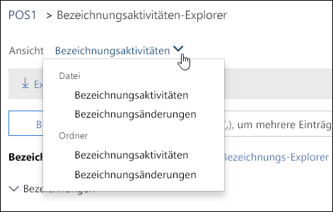
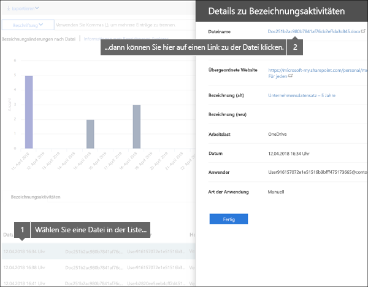
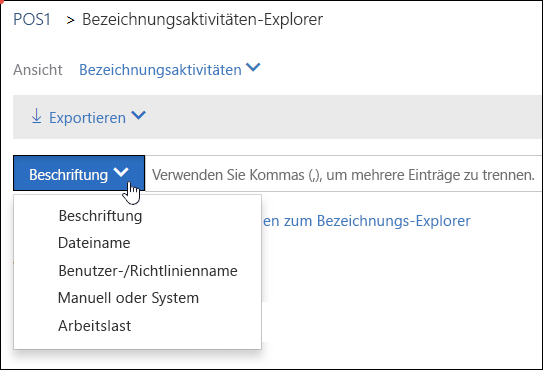

# Anzeigen der Bezeichnungsaktivität für Dokumente

After you create your labels, you'll want to verify that they're being applied to content as you intended. With the Label Activity Explorer in the Security &amp; Compliance Center, you can quickly search and view label activity for all content across SharePoint and OneDrive for Business over the past 30 days. This is real-time data that gives you a clear view into what's happening in your tenant.
  
Mit dem Bezeichnungsaktivitäten-Explorer können Sie beispielsweise folgende Aufgaben ausführen:
  
- Anzeigen, wie oft die einzelnen Bezeichnungen an jedem Tag (bis zu 30 Tage) angewendet wurden.
    
- Anzeigen, wer welche Datei genau an welchem Datum mit einer Bezeichnung versehen hat, zusammen mit einem Link zu der Website, auf der sich die Datei befindet.
    
- Anzeigen, für welche Dateien Bezeichnungen geändert oder entfernt wurden, wie die alten und neuen Bezeichnungen lauten und wer die Änderung vorgenommen hat.
    
- Filter the data to see all the label activity for a specific label, file, or user. You can also filter label activity by location (SharePoint or OneDrive for Business) and whether the label was applied manually or auto-applied.
    
- View label activity for folders as well as individual documents. Coming soon is the ability to show how many files inside that folder got labeled as a result of the folder getting labeled.
    
Den Bezeichnungsaktivitäten-Explorer finden Sie im Security &amp;Compliance Center > **Informationskontrolle** > ** Bezeichnungsaktivitäten-Explorer**.
  
Beachten Sie, dass für den Bezeichnungsaktivitäten-Explorer ein Office 365 Enterprise E5-Abonnement erforderlich ist.
  

  
## Anzeigen von Bezeichnungsaktivitäten für Dateien oder Ordner

At the top of the Label Activity Explorer, you can choose whether to view activities for files or folders. Note that folder activity includes only the folder itself, not the files inside the folder.
  
You might want to see label activity for folders because if you label a folder, all files inside that folder also get that label (except for files that have had a label applied explicitly to them). Therefore, labeling folders might affect a significant number of files. For more information, see [Applying a default retention label to all content in a SharePoint library, folder, or document set](labels.md#applying-a-default-retention-label-to-all-content-in-a-sharepoint-library-folder-or-document-set).
  

  
### Bezeichnungsaktivitäten

 **Label activities** includes all label actions: **adding**, **removing**, or **changing** a label. You can use this view to get a comprehensive look at how many files each label's been applied to per day. 
  
### Bezeichnungsänderungen

 **Label changes** includes the potentially risky actions of **removing** or **changing** a label. You can use this view to quickly see such risky actions and the user who performed them. In the activity list below the chart, you can select a file, and then click a link to that file in the details pane on the right. 
  

  
## Filtern von Bezeichnungsaktivitäten

You can quickly filter the data to see all the label activity for a specific label, file, or user. You can also filter label activity by location (SharePoint or OneDrive for Business) and whether the label was applied manually or auto-applied.
  

  

