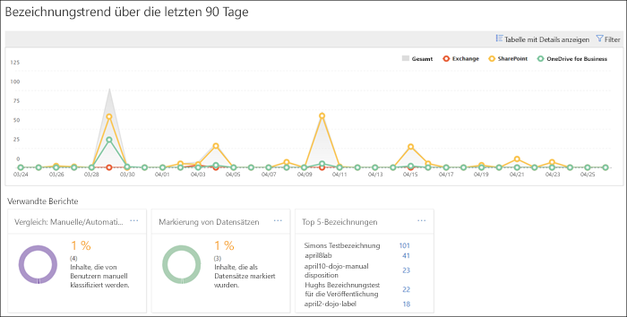
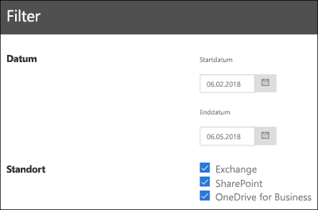

# Anzeigen der Data Governance-Berichte

Wenn Sie Bezeichnungen erstellt haben, sollten Sie überprüfen, ob sie wie gewünscht auf Inhalte angewendet werden. Mit den Data Governance-Berichten im Office 365 Security &amp; Compliance Center können Sie Folgendes schnell anzeigen:
  
- **Top-5-Bezeichnungen** Dieser Bericht zeigt die Anzahl der Top-5-Bezeichnungen, die auf Inhalte angewendet wurden. Klicken Sie auf diesen Bericht, um eine Liste mit allen Bezeichnungen anzuzeigen, die vor Kurzem auf Inhalte angewendet wurden. Für jede Bezeichnung werden Anzahl, Speicherort, Art der Anwendung, zugehörige Aufbewahrungsaktionen, Dispositionstyp und ob es sich um einen Datensatz handelt, angezeigt. 
    
- **Manuelle bzw. automatische Anwendungen** Dieser Bericht gibt Aufschluss über die Anzahl aller Inhalte, denen manuell bzw. automatisch eine Bezeichnung zugeordnet wurde, sowie den Prozentsatz der Inhalte, denen die Bezeichnung manuell bzw. automatisch zugeordnet wurde. 
    
- **Kategorisieren von Datensätzen** Dieser Bericht gibt Aufschluss über die Anzahl aller Inhalte, die als Datensatz bzw. Nicht-Datensatz kategorisiert wurden, sowie den Prozentsatz der Inhalte, die als Datensatz bzw. Nicht-Datensatz kategorisiert wurden. 
    
- **Bezeichnungstrend während der letzten 90 Tage** In diesem Bericht werden Anzahl und Speicherort aller Bezeichnungen angezeigt, die in den letzten 90 Tagen angewendet wurden. 
    
Alle diese Berichte zeigen mit Bezeichnungen versehene Inhalte aus Exchange, SharePoint und OneDrive for Business an.
  
Sie finden diese Berichte im Security &amp; Compliance Center \> **Informationsgovernance** \> **Dashboard**.
  

  
Sie können die Data Governance-Berichte nach Datum (bis zu 90 Tage) und Speicherort (Exchange, SharePoint und OneDrive for Business) filtern. Es kann bis zu 24 Stunden dauern, bis die aktuellsten Daten in den Berichten angezeigt werden.
  

  

