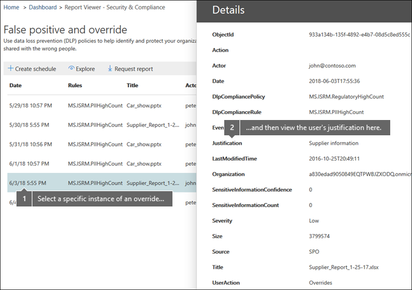

# Anzeigen der Berichtr zur Verhinderung von DatenverlustView the reports for data loss prevention

Nachdem Sie die DLP-Richtlinien (Data Loss Prevention, Verhinderung von Datenverlust) erstellt haben, sollten Sie überprüfen, ob Sie wie beabsichtigt arbeiten und Ihnen dabei helfen, die Kompatibilität zu verbringen.After you create your data loss prevention (DLP) policies, you'll want to verify that they're working as you intended and helping you to stay compliant. Mit den DLP-Berichten im Security &amp; Compliance Center können Sie schnell Folgendes anzeigen:With the DLP reports in the Security &amp; Compliance Center, you can quickly view:
  
- **Übereinstimmungen mit DLP-Richtlinien** Dieser Bericht zeigt die Anzahl der DLP-Richtlinien Übereinstimmungen im Laufe der Zeit an.**DLP policy matches** This report shows the count of DLP policy matches over time. Sie können den Bericht nach Datum, Ort, Richtlinie oder Aktion filtern.You can filter the report by date, location, policy, or action. Sie können diesen Bericht für Folgendes verwenden:You can use this report to: 
    
  - Optimieren oder optimieren Sie Ihre DLP-Richtlinien, während Sie Sie im Testmodus ausführen.Tune or refine your DLP policies as you run them in test mode. Sie können die spezifische Regel anzeigen, die mit dem Inhalt übereinstimmt.You can view the specific rule that matched the content.
    
  - Sie können sich auf bestimmte Zeiträume konzentrieren und so mehr über die Gründe für Spitzen und Trends erfahren.Focus on specific time periods and understand the reasons for spikes and trends.
    
  - Sie können die Geschäftsprozesse ermitteln, die gegen die DLP-Richtlinien Ihrer Organisation verstoßen.Discover business processes that violate your organization's DLP policies.
    
  - Grundlegendes zu den geschäftlichen Auswirkungen der DLP-Richtlinien, indem Sie sehen, welche Aktionen auf Inhalte angewendet werden.Understand any business impact of the DLP policies by seeing what actions are being applied to content.
    
  - Sie können die Einhaltung einer bestimmten DLP-Richtlinie durch Anzeigen von Übereinstimmungen für diese Richtlinie überprüfen.Verify compliance with a specific DLP policy by showing any matches for that policy.
    
  - Zeigen Sie eine Liste der wichtigsten Benutzer an, und wiederholen Sie Benutzer, die zu Vorfällen in Ihrer Organisation beitragen.View a list of top users and repeat users who are contributing to incidents in your organization.
    
  - Zeigen Sie eine Liste der wichtigsten Typen vertraulicher Informationen in Ihrer Organisation an.View a list of the top types of sensitive information in your organization.
    
- **DLP-Vorfälle** In diesem Bericht werden auch Richtlinien Übereinstimmungen im Laufe der Zeit angezeigt, wie der Bericht "Richtlinien Übereinstimmungen".**DLP incidents** This report also shows policy matches over time, like the policy matches report. Der Bericht "Richtlinien Übereinstimmungen" zeigt jedoch Übereinstimmungen auf Regelebene an; Wenn beispielsweise eine e-Mail mit drei unterschiedlichen Regeln übereinstimmt, zeigt der Bericht "Richtlinien Übereinstimmungen" drei verschiedene Einzelposten an.However, the policy matches report shows matches at a rule level; for example, if an email matched three different rules, the policy matches report shows three different line items. Im Gegensatz dazu zeigt der Vorfall Bericht Übereinstimmungen auf Elementebene; Wenn beispielsweise eine e-Mail mit drei unterschiedlichen Regeln übereinstimmt, zeigt der Vorfall Bericht ein einzelnes Einzelposten Element für diesen Inhalt.By contrast, the incidents report shows matches at an item level; for example, if an email matched three different rules, the incidents report shows a single line item for that piece of content. 
    
  Da die Berichts Anzahl unterschiedlich aggregiert wird, ist der Bericht "Richtlinien Übereinstimmungen" besser für die Ermittlung von Übereinstimmungen mit bestimmten Regeln und für die Feinabstimmung von DLP-Richtlinien.Because the report counts are aggregated differently, the policy matches report is better for identifying matches with specific rules and fine tuning DLP policies. Der Vorfall Bericht ist besser für die Identifizierung bestimmter Inhaltsteile, die für ihre DLP-Richtlinien problematisch sind.The incidents report is better for identifying specific pieces of content that are problematic for your DLP policies.
    
- **DLP-falsch positive Ergebnisse und Außerkraftsetzungen** Wenn Ihre DLP-Richtlinie es Benutzern ermöglicht, Sie außer Kraft zu setzen oder ein falsch positives Ergebnis zu melden, zeigt dieser Bericht die Anzahl dieser Instanzen im Laufe der Zeit an.**DLP false positives and overrides** If your DLP policy allows users to override it or report a false positive, this report shows a count of such instances over time. Sie können den Bericht nach Datum, Ort oder Richtlinie filtern.You can filter the report by date, location, or policy. Sie können diesen Bericht für Folgendes verwenden:You can use this report to: 
    
  - Optimieren oder optimieren Sie Ihre DLP-Richtlinien, indem Sie erkennen, welche Richtlinien eine hohe Anzahl falsch positiver Ergebnisse verursachen.Tune or refine your DLP policies by seeing which policies incur a high number of false positives.
    
  - Zeigen Sie die von Benutzern übermittelten Begründungen an, wenn Sie einen richtlinientipp lösen, indem Sie die Richtlinie außer Kraft setzen.View the justifications submitted by users when they resolve a policy tip by overriding the policy.
    
  - Ermitteln, wo DLP-Richtlinien mit gültigen Geschäftsprozessen in Konflikt stehen, indem eine hohe Anzahl von Benutzerüberschreibungen entsteht.Discover where DLP policies conflict with valid business processes by incurring a high number of user overrides.
    
Alle DLP-Berichte können Daten aus dem letzten Zeitraum von vier Monaten anzeigen.All DLP reports can show data from the most recent four-month time period. Die neuesten Daten können bis zu 24 Stunden in Anspruch nehmen, um in den Berichten angezeigt zu werden.The most recent data can take up to 24 hours to appear in the reports.
  
Diese Berichte finden Sie im &amp; Dashboard Security Compliance Center \> **Reports** \> **Dashboard**.You can find these reports in the Security &amp; Compliance Center \> **Reports** \> **Dashboard**.
  

  
## Anzeigen der von einem Benutzer übermittelten Begründung für eine AußerkraftsetzungView the justification submitted by a user for an override

Wenn Ihre DLP-Richtlinie es Benutzern ermöglicht, Sie außer Kraft zu setzen, können Sie den Bericht "falsch positiv" und "außer Kraft setzen" verwenden, um den von Benutzern im richtlinientipp übermittelten Text anzuzeigen.If your DLP policy allows users to override it, you can use the false positive and override report to view the text submitted by users in the policy tip.
  

  
## Durchführen von Maßnahmen zu Einblicken und EmpfehlungenTake action on insights and recommendations

Berichte können Einblicke und Empfehlungen anzeigen, in denen Sie auf das rote Warnsymbol klicken können, um Details zu potenziellen Problemen anzuzeigen und mögliche Abhilfemaßnahmen zu ergreifen.Reports can show insights and recommendations where you can click the red warning icon to see details about potential issues and take possible remedial action.
  

  
## Berechtigungen für DLP-BerichtePermissions for DLP reports

Um DLP-Berichte im Security & Compliance Center anzuzeigen, müssen Sie folgendem zugewiesen sein:To view DLP reports in the Security & Compliance Center, you have to be assigned the:

- Rolle " **Sicherheits Leser** " im Exchange Admin Center.**Security Reader** role in the Exchange admin center. Diese Rolle wird standardmäßig der Rollengruppe Organisationsverwaltung und Sicherheits Leser in der Exchange-Verwaltungskonsole zugewiesen.By default, this role is assigned to the Organization Management and Security Reader role groups in the Exchange admin center.

- **Verwaltungsrolle "DLP-Konformität anzeigen** " im Security & Compliance Center.**View-Only DLP Compliance Management** role in the Security & Compliance Center. Diese Rolle wird standardmäßig den Rollengruppen Compliance-Administrator, Organisationsverwaltung, Sicherheitsadministrator und Sicherheits Leser im Security & Compliance Center zugewiesen.By default, this role is assigned to the Compliance Administrator, Organization Management, Security Administrator, and Security Reader role groups in the Security & Compliance Center.

- Rolle " **View-Only Recipients** " im Exchange Admin Center.**View-Only Recipients** role in the Exchange admin center. Diese Rolle wird standardmäßig der Verwaltungsrollengruppe "Compliance Management", "Organisationsverwaltung" und "nur anzeigen" im Exchange Admin Center zugewiesen.By default, this role is assigned to the Compliance Management, Organization Management, and View-Only Organization Management role groups in the Exchange admin center.

## Suchen der Cmdlets für die DLP-BerichteFind the cmdlets for the DLP reports

Zur Verwendung der meisten Cmdlets für das Security &amp; Compliance Center müssen Sie folgende Aktionen ausführen:To use most of the cmdlets for the Security &amp; Compliance Center, you need to:
  
1. [Herstellen einer Verbindung mit dem Security &amp; Compliance Center mithilfe von Remote-PowerShellConnect to the Security &amp; Compliance Center using remote PowerShell](https://go.microsoft.com/fwlink/?LinkID=799771&amp;clcid=0x409)
    
2. Verwenden eines dieser [Cmdlets für das Security &amp; Compliance Center](https://go.microsoft.com/fwlink/?LinkID=799772&amp;clcid=0x409)Use any of these [Security &amp; Compliance Center cmdlets](https://go.microsoft.com/fwlink/?LinkID=799772&amp;clcid=0x409)
    
DLP-Berichte müssen jedoch Daten aus allen Office 365-Komponenten (einschließlich Exchange Online) abrufen.However, DLP reports need pull data from across Office 365, including Exchange Online. Aus diesem Grund sind die Cmdlets für die DLP-Berichte in Exchange Online PowerShell verfügbar – nicht in der Security &amp; Compliance Center-PowerShell.For this reason, the cmdlets for the DLP reports are available in Exchange Online Powershell—not in Security &amp; Compliance Center Powershell. Zur Verwendung der Cmdlets für die DLP-Berichte müssen Sie daher folgende Aktionen ausführen:Therefore, to use the cmdlets for the DLP reports, you need to:
  
1. [Stellen Sie eine Verbindung mit Exchange Online mithilfe der Remote-PowerShell herConnect to Exchange Online using remote PowerShell](https://go.microsoft.com/fwlink/?LinkID=799773&amp;clcid=0x409)
    
2. Verwenden Sie eines dieser Cmdlets für die DLP-Berichte:Use any of these cmdlets for the DLP reports:
    
      - [Get-DlpDetectionsReportGet-DlpDetectionsReport](https://go.microsoft.com/fwlink/?LinkID=799774&amp;clcid=0x409)
    
      - [Get-DlpDetailReportGet-DlpDetailReport](https://go.microsoft.com/fwlink/?LinkID=799775&amp;clcid=0x409)
    

