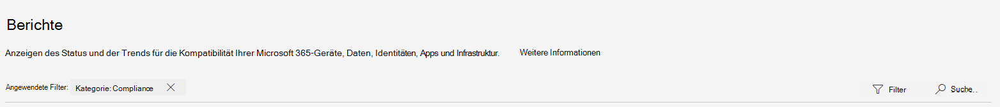

# Neuerungen im Microsoft 365 Compliance CenterWhat's new in the Microsoft 365 compliance center

Wir fügen kontinuierlich neue Funktionen zum [Microsoft 365 Compliance Center](microsoft-365-compliance-center.md) hinzu, beheben Probleme, von denen wir erfahren, und nehmen basierend auf Ihrem Feedback Änderungen vor.We're continuously adding new features to the [Microsoft 365 compliance center](microsoft-365-compliance-center.md), fixing issues we learn about, and making changes based on your feedback. Unten können Sie sehen, was heute schon für Sie verfügbar ist.Take a look below to see what's available for you today. Einige Funktionen werden für unsere Kunden mit unterschiedlicher Geschwindigkeit bereitgestellt.Some features get rolled out at different speeds to our customers. Wenn Sie noch kein Feature sehen, versuchen Sie, sich selbst zu [Gezieltes Release](https://docs.microsoft.com/office365/admin/manage/release-options-in-office-365) hinzuzufügen.If you aren't seeing a feature yet, try adding yourself to [targeted release](https://docs.microsoft.com/office365/admin/manage/release-options-in-office-365).

> [!TIP]
> Interessieren Sie sich dafür, was in anderen Admin Centers geschieht?Interested in what's going on in other admin centers? Dann lesen Sie die folgenden Artikel:Check out these articles: [Neuerungen im Microsoft 365 Admin CenterWhat's new in the Microsoft 365 admin center](https://docs.microsoft.com/office365/admin/whats-new-in-preview?view=o365-worldwide) [Aktive Websites im SharePoint Online Admin CenterWhat's new in the SharePoint admin center](https://docs.microsoft.com/sharepoint/what-s-new-in-admin-center)  
Besuchen Sie die [Microsoft 365-Roadmap](https://www.microsoft.com/en-us/microsoft-365/roadmap), um sich über Features von Microsoft 365 zu informieren, die eingeführt wurden, bereitgestellt werden, sich in der Entwicklung befinden, eingestellt oder zuvor veröffentlicht wurden.And visit the [Microsoft 365 Roadmap](https://www.microsoft.com/en-us/microsoft-365/roadmap) to learn about Microsoft 365 features that were launched, are rolling out, are in development, have been cancelled, or previously released.

## Februar 2020February 2020

### Insider-Risikomanagement wird offiziell veröffentlichtInsider risk management is officially released

Trommelwirbel, bitte ...Drum roll, please... Das Insider-Risikomanagement steht jetzt Organisationen mit den folgenden Abonnements zur Verfügung:Insider risk management is now available to organizations with the following subscriptions:

- [Microsoft 365 E5](https://go.microsoft.com/fwlink/?linkid=2120431) (bezahlt oder Testversion)[Microsoft 365 E5](https://go.microsoft.com/fwlink/?linkid=2120431) (paid or trial)
- Microsoft 365 Enterprise E3-Abonnement mit dem [Microsoft E5-Compliance-Add-On](https://go.microsoft.com/fwlink/?linkid=2120432)Microsoft 365 Enterprise E3 subscription with the [Microsoft E5 Compliance add-on](https://go.microsoft.com/fwlink/?linkid=2120432)

Wir möchten Sie darüber informieren, dass wir seit der Vorschauversion einige Verbesserungen vorgenommen haben, darunter [neue Rollengruppen](insider-risk-management-configure.md#step-1-required-enable-permissions-for-insider-risk-management) und [lösungsweite Einstellungen](insider-risk-management-configure.md#step-4-required-configure-insider-risk-settings).Heads up that we made some improvements since the preview release, including [new role groups](insider-risk-management-configure.md#step-1-required-enable-permissions-for-insider-risk-management) and [solution-wide settings](insider-risk-management-configure.md#step-4-required-configure-insider-risk-settings).

Wie immer, geben Sie bitte Feedback zur Lösung ab, damit wir weiterhin Verbesserungen vornehmen können.As always, please leave feedback as you use the solution so we can continue to make improvements.

### DatensatzverwaltungRecords management

Diese neue Lösung bietet alle Funktionen für die Datensatzverwaltung unter einem Dach.This new solution brings all the records management capabilities under a single umbrella. Zu den Highlights gehören die Einführung der Datensatz-Versionsverwaltung für Microsoft Office SharePoint Online und OneDrive sowie der Nachweis über die Beseitigung von Datensätzen.Highlights include the introduction of records versioning for SharePoint and OneDrive and proof of disposal for records.

[Weitere Informationen zur DatensatzverwaltungLearn more about records management](records-management.md)

### Lösung im Blickpunkt: Datenconnectors für Facebook und TwitterSolution spotlight: Data connectors for Facebook and Twitter

[Letzten Monat wurden Datenconnectors veröffentlicht](#just-launched), und wir erbitten Ihre Hilfe beim Testen der folgenden Connectors.Data connectors [released last month](#just-launched) and we're looking for your help in testing out the following connectors.

- [Facebook-Unternehmensseite](archive-facebook-data-with-sample-connector.md).[Facebook business pages](archive-facebook-data-with-sample-connector.md). Importiert und archiviert Daten von Facebook-Unternehmensseiten in Microsoft 365.Imports and archives data from Facebook business pages to Microsoft 365. Nutzbringend für Compliancelösungen wie Datensatzverwaltung und eDiscovery.Beneficial for compliance solutions such as records management and eDiscovery.
- [Twitter](archive-twitter-data-with-sample-connector.md).[Twitter](archive-twitter-data-with-sample-connector.md). Importiert und archiviert Daten aus Twitter in Microsoft 365.Imports and archives data from Twitter to Microsoft 365. Nutzbringend für Compliancelösungen wie Datensatzverwaltung und eDiscovery.Beneficial for compliance solutions such as records management and eDiscovery.

Wenn Sie diese Connectors einrichten und überprüfen, geben Sie uns bitte Feedback, was gut gelaufen ist, was nicht funktioniert hat und was wir tun können, um die Benutzerfreundlichkeit zu verbessern.As you set up and validate these connectors, please leave us feedback about what went well, what didn't, and what we can do to improve the experience.

## Januar 2020January 2020

Die Wartezeit ist vorbei.The wait is over. Wir freuen uns, Ihnen mitzuteilen, dass das Microsoft 365 Compliance Center für alle Kunden mit Microsoft 365, Office 365, Enterprise Mobility + Security (EMS) und Windows 10 Enterprise-Plänen verfügbar ist.We're pleased to announce that the Microsoft 365 compliance center is available to all customers with Microsoft 365, Office 365, Enterprise Mobility + Security (EMS), and Windows 10 Enterprise plans. Alle Daten oder Richtlinien, die Sie im Security & Compliance Center verwaltet haben, stehen im Compliance Center zur Verfügung, daher müssen Sie nicht mehr hin-und herspringen.Any data or policies you were managing in the Security & Compliance Center are available in the compliance center, so no need to jump back and forth.

> [!TIP]
> Lesen Sie das Update des letzten Monats erneut für ein Upgrade für einige der [neuen Lösungen](#new-compliance-solutions) , die kürzlich in der Vorschau angezeigt wurden, sowie eine [Roadmap](#updated-compliance-solutions) , die zeigt, wo Compliance-Features aus dem Security & Compliance Center jetzt in Microsoft 365.Read through last month's update again for a refresher on some of the [new solutions](#new-compliance-solutions) we previewed recently, as well as a [roadmap](#updated-compliance-solutions) showing where compliance features from the Security & Compliance Center now live in Microsoft 365.

Setzen Sie jetzt ein Lesezeichen, und wechseln Sie zu [https://compliance.microsoft.com](https://compliance.microsoft.com), um Ihre zentrale Anlaufstelle für die Verwaltung der Compliance in Ihrer gesamten Organisation zu besuchen..., oder [lesen Sie diesen Artikel](microsoft-365-compliance-center.md), um ein bisschen tiefer einzutauchen.Bookmark and head over now to [https://compliance.microsoft.com](https://compliance.microsoft.com) to tour your one-stop-shop for managing compliance across your org...or [read this article](microsoft-365-compliance-center.md) to dig in a bit more.

In diesem Monat haben wir auch neue und aktualisierte Lösungen veröffentlicht.We also released new and updated solutions this month. Hier erhalten Sie einen schnellen Blick auf die Highlights.Here's a quick glance at the highlights.

### Jetzt in der VorschauNow in preview

**Insider-Risikomanagement (Vorschau)****Insider risk management (preview)**

Wir freuen uns, Ihnen mitteilen zu können, dass unsere Lösung zum Insider-Risikomanagement jetzt in der öffentlichen Vorschau angezeigt wird.We're happy to announce that our insider risk management solution is now in public preview. Kurz gesagt, hilft das Insider-Risikomanagement Ihrer Organisation, Insider-Risiken intelligent zu erkennen und dagegen Maßnahmen zu ergreifen, indem es Folgendes bereitstellt:In a nutshell, insider risk management helps your organization intelligently identify and take action on insider risks by providing:

- Anonymitäts-Steuerelemente zur Sicherstellung des Datenschutzes von Benutzern.Anonymity controls to help ensure user privacy.
- intelligente Richtlinienvorlagen mit systemeigenen und Drittanbieter-Indikatoren, die Insiderbedrohungen wie Datenlecks erkennen.Intelligent policy templates with native and third-party indicators that identify insider threats, such as data leaks.
- integrierte End-to-End-Untersuchungs-Workflows, die sich über die IT-, Personal- und Rechtsabteilung erstrecken.Integrated end-to-end investigation workflows that span across IT, HR and legal teams.

Wir würden uns freuen, Ihre Meinung zu hören.We'd love to hear what you think. Wenn Sie die Lösung verwenden, senden Sie uns Ihr Feedback, damit wir sicherstellen können, dass wir Ihre Anforderungen erfüllen, während wir uns in Richtung allgemeine Verfügbarkeit bewegen.As you use the solution, leave us feedback so we can make sure we're meeting your needs as we head toward general availability.

[Weitere Informationen zum Insider-RisikomanagementLearn more about insider risk management](insider-risk-management.md)

### Soeben eingeführtJust launched

**Kommunikationscompliance****Communication compliance**

Beim Übergang von der Vorschauphase zur vollständigen Verfügbarkeit ist die Kommunikationscompliance ein wichtiger Bestandteil unseres neuen Lösungssatzes zum Insider-Risiko.Graduating from the preview phase to full availability, communication compliance is a key component of our new insider risk solution set. Diese robuste Lösung trägt dazu bei, die Kommunikationsrisiken mithilfe von Workflows zu minimieren, um Nachrichten, die nicht den Standards Ihrer Organisation entsprechen, zu erkennen, zu untersuchen und um Abhilfemaßnahmen zu treffen.This robust solution helps minimize communication risks using workflows for detecting, investigating, and taking remediation actions for messages that don't meet your organization's standards.

Das Kundenfeedback während der Vorschau war fantastisch.Customer feedback during the preview was fantastic. Es führte zu mehreren Verbesserungen, darunter der Eindruck beim ersten Ausführen, um Ihnen den Einstieg zu erleichtern, Verbesserungen der Untersuchung und Abhilfemaßnahmen sowie vieles mehr.It resulted in several enhancements, including a first-run experience to get you started, improvements to investigation and remediation actions, and more.

[Weitere Informationen zur KommunikationscomplianceLearn more about communication compliance](communication-compliance.md)

**Datenconnectors****Data connectors**

Früher haben Datenconnectors sich Speicherplatz mit anderen "Import"-Features im Office 365 Security & Compliance Center geteilt, nun verfügen sie über einen eigenen Bereich im Microsoft 365 Compliance Center.Formerly sharing space with other 'Import' features in the Office 365 Security & Compliance Center, data connectors now have their very own home in the Microsoft 365 compliance center. Verwenden Sie die neue Seite "Datenconnectors", um Daten aus den Dateien aus der Personalabteilung (HR) Ihrer Organisation und von verschiedenen Plattformen von Drittanbietern (z. B. Facebook, LinkedIn, Twitter und Instant Bloomberg) in Postfächer in Ihrer Microsoft 365-Organisation zu importieren und archivieren.Use the new 'Data connectors' page to import and archive data from your organization's human resources (HR) files and various third-party platforms (like Facebook, LinkedIn, Twitter, and Instant Bloomberg) to mailboxes in your Microsoft 365 organization. Nach dem Importieren können diese Daten in mehreren Compliancelösungen verwaltet werden, darunter eDiscovery, Insider-Risikomanagement, Kommunikationscompliance, Überwachung, Aufbewahrungsrichtlinien und vieles mehr.Once imported, this data can be managed in several compliance solutions, including eDiscovery, insider risk management, communication compliance, audit, retention policies, and more.

[Weitere Informationen zu DatenconnectorsLearn more about data connectors](archiving-third-party-data.md)

### Beachtenswerte UpdatesNoteworthy updates

**Neue Beurteilungsvorlagen für Compliancebewertung (Vorschau)****New assessment templates for Compliance Score (preview)**

Stets bemüht, Ihnen zu helfen, in der sich ständig weiterentwickelnden Compliancelandschaft voranzukommen, hat unser Team für Compliancebewertungen einen neuen Satz von Vorlagen bereitgestellt, um Ihnen dabei helfen, die Complianceausrichtung Ihrer Organisation in Hinblick auf die neuesten Bestimmungen zu bewerten und Anleitungen zur Implementierung effektiverer Steuerelemente zu erhalten.Always working hard to help you get ahead of the ever-evolving compliance landscape, our Compliance Score team shipped a new set of templates to help you assess your organization's compliance posture against recent regulations and get guidance on how to implement more effective controls. Sie können neue Vorlagen anzeigen für:You'll see new templates for:

- ISO/IEC 27701:2019ISO/IEC 27701:2019
- California Consumer Privacy Act (CCPA)California Consumer Privacy Act (CCPA)
- das brasilianische allgemeine Datenschutzrecht (Lei Geral de Proteção de Dados – LGPD)Brazil General Data Protection Law (Lei Geral de Proteção de Dados - LGPD)
- SOC 1 Typ 2 und SOC 2 Typ 2SOC 1 Type 2 and SOC 2 Type 2

[Weitere Informationen zu Vorlagen für CompliancebewertungenLearn more about Compliance Score templates](compliance-score.md#templates)

## November und Dezember 2019November & December 2019

Über die Feiertage haben wir mit der Bereitstellung all der großartigen Compliancelösungen begonnen, die auf der Ignite vorgeführt wurden.Over the holidays, we started rolling out all the great compliance solutions that were demo'd at Ignite. Die meisten befinden sich in einem Vorschaustatus, testen Sie sie also, und teilen Sie uns Ihre Meinung mit, indem Sie unten rechts im Compliance Center die Feedbackkarte öffnen.Most are in a preview state, so test them out and be sure to let us know what you think by opening the Feedback card at the bottom right of the compliance center.

### Kennenlernen der neuen NachbarschaftGet to know the new neighborhood

Das neue Microsoft 365 Compliance Center umfasst brandneue Lösungen sowie die Compliancefunktionen, die Sie aus dem Office 365 Security & Compliance Center kennen und schätzen.The new Microsoft 365 compliance center includes brand new solutions as well as the compliance features you know and love from the Office 365 Security & Compliance Center. Lassen Sie uns noch etwas weiter eintauchen...Let's dig in a bit more…

#### Neue CompliancelösungenNew compliance solutions

Sie fragen sich vielleicht, was eine *Lösung* ist.You might be wondering what a *solution* is. So wie die Cloud die Art und Weise, wie Geschäfte getätigt werden, revolutioniert hat, hat sie auch die Tür für neue Methoden des Datendiebstahls und Betrugs geöffnet sowie neue Bestimmungen nötig gemacht.As much as the cloud has revolutionized the way business is done, it's also opened the door for new methods of data theft and fraud and necessitated new regulations. Unsere Compliancelösungen sind Sammlungen integrierter Funktionen, die Ihnen dabei helfen können, diese sich weiterentwickelnden Complianceanforderungen zu erfüllen.Our compliance solutions are collections of integrated capabilities that can help you help you manage these evolving compliance requirements. Die Funktionen einer Lösung können eine Kombination von Richtlinien, Warnungen, Berichten und mehr umfassen.A solution's capabilities might include a combination of policies, alerts, reports, and more.

Hier ist eine Zusammenfassung der neuen Lösungen, die Sie vorfinden.Here's a summary of the new solutions you'll find. Behalten Sie die anderen im Blick, die in Kürze zur Verfügung stehen.Keep an eye out for others coming soon.

> [!NOTE]
> Diese Lösungen befinden sich nur im Microsoft 365 Compliance Center.These solutions are located only in the Microsoft 365 compliance center. Sie können nicht im Office 365 Security & Compliance Center verwaltet werden.They can't be managed in the Office 365 Security & Compliance Center.
 

|**Neue Lösung****New solution**|**Beschreibung****Description**|**Weitere Informationen****Learn more**|
|:-----|:-----|:-----|
|Microsoft-Compliancebewertung (Vorschau)Microsoft Compliance Score (preview)  |Basierend auf [Compliance Manager](compliance-manager-overview.md) ist die Compliancebewertung ein eigenständiges Feature mit einem einfacheren, benutzerfreundlicheren Design, das Ihnen dabei hilft, die Complianceausrichtung Ihrer Organisation zu verstehen und zu verbessern.Built from [Compliance Manager](compliance-manager-overview.md), Compliance Score is a standalone feature with a simpler, more user-friendly design that helps you understand and improve your organization's compliance posture. Sie berechnet eine auf Risiken basierende Bewertung, die Ihren Fortschritt bei der Durchführung von Maßnahmen misst, mit denen sich Risiken hinsichtlich des Datenschutzes und regulatorischer Standards verringern lassen.It calculates a risk-based score measuring your progress in completing actions that help reduce risks around data protection and regulatory standards.  |[Übersicht über die Microsoft-Compliancebewertung (Vorschau)Overview of Microsoft Compliance Score (preview)](compliance-score.md)|
|Lösungskatalog (Vorschau)Solution catalog (preview)  |Der Lösungskatalog ist Ihre zentrale Anlaufstelle, um unsere Compliance- und Risikomanagementlösungen zu erkunden, sich darüber zu informieren und rasch einzusteigen.The solution catalog is your one-stop-shop for discovering, learning about, and quickly getting started with our compliance and risk management solutions. Der Katalog gliedert sich in drei Compliancekategorien, von denen jede Details zu den Lösungen enthält, die diese Kategorie ausmachen.The catalog is organized into three compliance categories, each containing details about the solutions that make up that category. Zu den Kategorien zählen Informationsschutz und Governance, Insider-Risikomanagement sowie Entdeckung und ReaktionCategories include Information protection & governance, Insider risk management, and Discovery & response  |[Übersicht über den Lösungskatalog (Vorschau)Overview of the solution catalog (preview)](microsoft-365-solution-catalog.md)|
|Kommunikationscompliance (Vorschau)Communication compliance (preview)  |Die Kommunikationcompliance ist Bestandteil der neuen Kategorie "Insider-Risikomanagement", die Ihnen hilft, Kommunikationsrisiken zu minimieren, indem Sie unzulässige Nachrichten in Ihrer Organisation erkennen und erfassen sowie Abhilfemaßnahmen treffen.Communication compliance is part of the new insider risk management category that helps minimize communication risks by helping you detect, capture, and take remediation actions for inappropriate messages in your organization. Die Lösung erweitert die Möglichkeiten von Aufsichtsrichtlinien in Office 365 durch die Einführung verschiedener neuer Verbesserungen wie intelligenten Vorlagen, flexiblen Abhilfe-Workflows und umsetzbaren Erkenntnissen.The solution extends the capabilities of supervision policies in Office 365 by introducing several new enhancements such as intelligent templates, flexible remediation workflows, and actionable insights.  |[Kommunikationscompliance in Microsoft 365 (Vorschau)Communication compliance in Microsoft 365 (preview)](communication-compliance.md)|
|Datenklassifizierung (Vorschau)Data classification (preview)  |Unsere neue Seite „Datenklassifizierung“ enthält aussagekräftige Erkenntnisse und Tools, die Ihnen bei der Ermittelung und Auswertung helfen, wie vertrauliche Informationen und Bezeichnungen (Aufbewahrung und Vertraulichkeit) in Inhalten im gesamten Unternehmen verwendet werden.Our new Data classification page contains powerful insights and tools to help you discover and evaluate how sensitive info and labels (retention and sensitivity) are being used in content across your organization. Überprüfen Sie Inhalte, die vertrauliche Informationen enthalten oder auf die Bezeichnungen angewendet wurden, untersuchen Sie die Bezeichnungsaktivitäten an Microsoft 365-Speicherorten, erstellen Sie benutzerdefinierte Typen vertraulicher Informationen und vieles mehr.Review content that contains sensitive info or has labels applied, explore label activity across Microsoft 365 locations, create custom sensitive info types, and much more. |[Übersicht über die Datenklassifizierung (Vorschau)Data classification overview (preview)](data-classification-overview.md)|
|Trainierbare Klassifizierer (Vorschau)Trainable classifiers (preview)  |Dieses leistungsstarke neue Tool verwendet unser Machine Learning-Modul, um Kategorien von Inhalten in Ihrer Organisation zu identifizieren, z. B. regulatorische Dokumente oder Mitarbeiterverträge.This powerful new tool uses our machine learning engine to help identify categories of content in your org, like regulatory docs or employee agreements. Nach der Erstellung können Klassifizierer in mehreren Compliancelösungen verwendet werden, um verwandte Inhalte zu erkennen und zu klassifizieren, zu schützen, aufzubewahren und mehr.Once created, classifiers can be used in several compliance solutions to detect related content and classify it, protect it, retain it, and more. |[Erste Schritte mit trainierbaren Klassifizierern (Vorschau)Getting started with trainable classifiers (preview)](classifier-getting-started-with.md)|

#### Aktualisierte CompliancelösungenUpdated compliance solutions

Wenn Sie das Office 365 Security & Compliance Center für Ihre Compliancebedürnisse verwenden, fragen Sie sich vielleicht, wo einige Features im neuen Microsoft 365 Compliance Center jetzt zu finden sind.If you've been using the Office 365 Security & Compliance Center for your compliance needs, you might wonder where some features now live in the new Microsoft 365 compliance center. Sehen Sie sich schnell eine Roadmap an, die Ihnen bei der Suche danach hilft.Here's a quick roadmap to help find their new homes.

> [!NOTE]
> Einige Features stehen weiterhin nur im Office 365 Security & Compliance Center zur Verfügung. Diese sind nachstehend aufgeführt.Some features are still available only in the Office 365 Security & Compliance Center – these are noted below. Aber wir arbeiten hart daran, diese im Microsoft 365 Compliance Center in einer Vorschau anzuzeigen, also schauen Sie regelmäßig vorbei.But we're working hard to preview these in the Microsoft 365 compliance center, so stay tuned for updates. 
 

|**Feature****Feature**|**Office 365 Security & Compliance Center****Office 365 Security & Compliance Center**|**Microsoft 365 Compliance Center****Microsoft 365 compliance center**|**Weitere Informationen****Learn more**|
|:-----|:-----|:-----|:-----|
|Advanced eDiscoveryAdvanced eDiscovery|eDiscovery > Advanced eDiscoveryeDiscovery > Advanced eDiscovery   https://protection.office.com/advancedediscoverycases |eDiscovery > AdvancedeDiscovery > Advanced   https://compliance.microsoft.com/advancedediscovery | [Übersicht über die Advanced eDiscovery-Lösung in Microsoft 365Overview of the Advanced eDiscovery solution in Microsoft 365](overview-ediscovery-20.md) |
|WarnungsrichtlinienAlert policies|Warnungen > WarnungsrichtlinienAlerts > Alert policies   https://protection.office.com/alertpolicies |Zurzeit werden Warnungsrichtlinien nur im Office 365 Security & Compliance Center verwaltet.At this time, alert policies are managed only in the Office 365 Security & Compliance Center. |[Warnungsrichtlinien im Security & Compliance CenterAlert policies in the security and compliance center](alert-policies.md) |
|WarnungenAlerts|Warnungen > Warnungen anzeigenAlerts > View alerts   https://protection.office.com/viewalerts |WarnungenAlerts   https://compliance.microsoft.com/compliancealerts |[Anzeigen von WarnungenViewing alerts](alert-policies.md#viewing-alerts)|
|ArchivierenArchive|Information Governance > ArchivInformation governance > Archive   https://protection.office.com/archiving |Information Governance > Registerkarte „Archiv“Information governance > Archive tab   https://compliance.microsoft.com/informationgovernance?viewid=archive |[Aktivieren von ArchivpostfächernEnable archive mailboxes](enable-archive-mailboxes.md)|
|Durchsuchen von ÜberwachungsprotokollenAudit log search|Suche > ÜberwachungsprotokollsucheSearch > Audit log search   https://protection.office.com/unifiedauditlog |ÜberwachungAudit   https://compliance.microsoft.com/auditlogsearch | [Durchsuchen des Überwachungsprotokolls im Security & Compliance CenterSearch the audit log in the Security & Compliance Center](search-the-audit-log-in-security-and-compliance.md)|
|InhaltssucheContent search|Suche > InhaltssucheSearch > Content search   https://protection.office.com/contentsearchbeta?ContentOnly=1 | InhaltssucheContent search   https://compliance.microsoft.com/contentsearch |[Suche nach Inhalten in Office 365Search for content in Office 365](search-for-content.md) |
|DatenconnectorsData connectors|Information Governance > Drittanbieterdaten archivierenInformation governance > Archive third-party data   https://protection.office.com/nativeconnector | DatenconnectorsData connectors   https://compliance.microsoft.com/connectorlanding |[Archivieren von DrittanbieterdatenArchive third-party data](archiving-third-party-data.md)|
|Verhinderung von DatenverlustData loss prevention|Verhinderung von DatenverlustData loss prevention   https://protection.office.com/datalossprevention |Verhinderung von DatenverlustData loss prevention   https://compliance.microsoft.com/datalossprevention |[Übersicht über die Verhinderung von DatenverlustOverview of data loss prevention](data-loss-prevention-policies.md)|
|Anträge betroffener PersonenData subject requests |Datenschutz > Anträge betroffener PersonenData privacy > Data subject requests   https://protection.office.com/dsrcases |Anträge betroffener PersonenData subject requests   https://compliance.microsoft.com/datasubjectrequest |[Verwalten von DSGVO-Anträgen betroffener Personen mit dem DSR-FalltoolManage GDPR data subject requests with the DSR case tool](manage-gdpr-data-subject-requests-with-the-dsr-case-tool.md)|
|eDiscoveryeDiscovery|eDiscovery > eDiscoveryeDiscovery > eDiscovery   https://protection.office.com/ediscoveryv1 |eDiscovery > CoreeDiscovery > Core   https://compliance.microsoft.com/classicediscovery |[Verwalten von eDiscovery-FällenManage eDiscovery cases](ediscovery-cases.md) |
|EreignisseEvents|Datensatzverwaltung > EreignisseRecords management > Events   https://protection.office.com/events |Datensatzverwaltung > Registerkarte „Ereignisse“Records management > Events tab   https://compliance.microsoft.com/recordsmanagement?viewid=events |[Übersicht über die ereignisgesteuerte AufbewahrungOverview of event-driven retention](event-driven-retention.md)|
|DateiplanFile plan|Datensatzverwaltung > DateiplanRecords management > File plan   https://protection.office.com/fileplan |Datensatzverwaltung > Registerkarte „Dateiplan“Records management > File plan tab   https://compliance.microsoft.com/recordsmanagement?viewid=fileplan |[Übersicht über den Dateiplan-ManagerOverview of file plan manager](file-plan-manager.md)|
|Importieren von PST-DateienImport PST files|Information Governance > PST-Dateien importierenInformation governance > Import PST files   https://protection.office.com/importV2 |Information Governance > Registerkarte „Importieren“Information governance > Import tab   https://compliance.microsoft.com/informationgovernance?viewid=import |[Übersicht über das Importieren von PST-Dateien Ihrer OrganisationOverview of importing your organization's PST files](importing-pst-files-to-office-365.md)|
|Bezeichnungsaktivitäten-ExplorerLabel activity explorer|Information Governance > Bezeichnungsaktivitäten-ExplorerInformation governance > Label activity explorer   https://protection.office.com/labelexplorer |Datenklassifizierung > Registerkarte „Aktivitäten-Explorer“Data classification > Activity explorer tab   https://compliance.microsoft.com/dataclassification?viewid=activitiesexplorer |[Anzeigen von Aktivitäten für Ihre Inhalte mit Bezeichnungen (Vorschau)View activity on your labeled content (preview)](data-classification-activity-explorer.md)|
|Aufbewahrungsbezeichnungen und BezeichnungsrichtlinienRetention labels and label policies |Klassifizierung > Aufbewahrungsbezeichnungen > Registerkarte „Bezeichnungen“ und „Bezeichnungsrichtlinien“Classification > Retention labels > Labels and Label policies tabs   https://protection.office.com/retentionlabels |Information Governance > Registerkarte „Bezeichnungen“ und „Bezeichnungsrichtlinien“Information governance > Labels and Label policies tabs   https://compliance.microsoft.com/informationgovernance?viewid=labels   https://compliance.microsoft.com/informationgovernance?viewid=labelpolicies | [Übersicht über AufbewahrungsbezeichnungenOverview of retention labels](labels.md)|
|AufbewahrungsrichtlinienRetention policies|Information Governance > AufbewahrungInformation governance > Retention   https://protection.office.com/retention |Information Governance > Registerkarte „Aufbewahrung“Information governance > Retention tab   https://compliance.microsoft.com/informationgovernance?viewid=retention |[Übersicht über AufbewahrungsrichtlinienOverview of retention policies](retention-policies.md)|
|Typen vertraulicher InformationenSensitive info types|Klassifizierung > Typen vertraulicher InformationenClassification > Sensitive info types   https://protection.office.com/sensitivetypes |Datenklassifizierung > Registerkarte „Typen vertraulicher Informationen“Data classification > Sensitive info types tab   https://compliance.microsoft.com/dataclassification?viewid=sensitiveinfotypes |[Wonach die Typen vertraulicher Informationen suchenWhat the sensitive information types look for](what-the-sensitive-information-types-look-for.md)|
|Vertraulichkeitsbezeichnungen und BezeichnungsrichtlinienSensitivity labels and label policies|Klassifizierung > Vertraulichkeitsbezeichnungen > Registerkarte „Bezeichnungen“ und „Bezeichnungsrichtlinien“Classification > Sensitivity labels > Labels and Label policies tabs   https://protection.office.com/sensitivity |Information Protection > Registerkarte „Bezeichnungen“ und „Bezeichnungsrichtlinien“Information protection > Labels and Label policies tabs   https://compliance.microsoft.com/informationprotection?viewid=sensitivitylabels   https://compliance.microsoft.com/informationprotection?viewid=sensitivitylabelpolicies |[Weitere Informationen zu VertraulichkeitsbezeichnungenLearn about sensitivity labels](sensitivity-labels.md) |
|DienstüberprüfungService assurance|DienstüberprüfungService assurance   https://protection.office.com/serviceassurance/dashboard |Zurzeit kann nur im Office 365 Security & Compliance Center auf Dienstüberprüfungsressourcen zugegriffen werden.At this time, service assurance resources can only be accessed in the Office 365 Security & Compliance Center. |[Dienstüberprüfung im Security & Compliance CenterService assurance in the Security & Compliance Center](service-assurance.md)|
|AufsichtSupervision|AufsichtSupervision   https://protection.office.com/supervisoryreviewv2 |KommunikationscomplianceCommunication compliance   https://compliance.microsoft.com/supervisoryreview |[Kommunikationscompliance in Microsoft 365 (Vorschau)Communication compliance in Microsoft 365 (preview)](communication-compliance.md) |

## September 2019September 2019

Fragen Sie sich, warum es an der Releasefront in diesem Monat ruhig ist?Wondering why it's quiet on the release front this month? Wir sind mitten in der Erstellung neuer, innovativer Compliancelösungen, die im November auf der [Microsoft Ignite](https://www.microsoft.com/ignite) vorgestellt werden.We're heads down building new, innovative compliance solutions that'll be unveiled at [Microsoft Ignite](https://www.microsoft.com/ignite) in November. Schauen Sie regelmäßig vorbei!Stay tuned!

### Neue Verschlüsselungsoptionen für VertraulichkeitsbezeichnungenNew encryption options for sensitivity labels 

Wenn Sie die Verschlüsselung für eine Vertraulichkeitsbezeichnung konfigurieren, stehen Ihnen jetzt zwei Optionen zur Verfügung, mit denen Benutzer Berechtigungen zuweisen können, wenn sie die Bezeichnung manuell auf E-Mails und Dokumente anwenden:When configuring encryption for a sensitivity label, you now have two options that lets users assign permissions when they manually apply the label to email and docs: 
- Wenn die Bezeichnung in **Outlook-E-Mail** angewandt wird, können die Benutzer Einschränkungen durchsetzen, die der Option „Nicht weiterleiten“ entsprechen.When applying the label to **Outlook email**, users can enforce restrictions equivalent to the Do Not Forward option. Empfänger können die Nachricht lesen, den Inhalt aber nicht weiterleiten, drucken oder kopieren.Recipients will be able to read the message but not forward, print, or copy the content.
- Wenn die Bezeichnung auf **Word-, PowerPoint- und Excel-Dateien** angewendet wird, werden die Benutzer aufgefordert, bestimmten Benutzern und Gruppen Zugriffsberechtigungen zuzuweisen.When applying the label to **Word, PowerPoint, and Excel files**, users will be prompted to assign access permissions to specific users and groups.

[Weitere InformationenLearn more](encryption-sensitivity-labels.md#let-users-assign-permissions)

## August 2019August 2019

### Aktualisierung von DatenuntersuchungenUpdate to data investigations

Wenn Sie eine Datenuntersuchung durchführen, können Sie jetzt Elemente von den ursprünglichen Speicherorten löschen.When performing a data investigation, you can now delete items from their original locations. Dies bedeutet, dass Sie Elemente aus Exchange-Postfächern, SharePoint-Websites und OneDrive-Konten in Ihrer ganzen Organisation löschen können.This means you can delete items from Exchange mailboxes, SharePoint sites, and OneDrive accounts across your organization. Da Sie die Elemente als Beweis gesammelt haben, wurden Kopien davon im Beweissatz aufbewahrt, die Sie weiter untersuchen oder einfach als Referenz behalten können.Because you collected the items as evidence, you'll have copies of them retained in the evidence set to you can investigate further or just keep as a reference. [Weitere InformationenLearn more](manage-data-spillage-incidents.md#step-4-delete-the-spilled-data) 

## Juli 2019July 2019

### Neue AdministratorrollenNew admin roles

Wir haben zwei neue Administratorrollen veröffentlicht, um die Sicherheit und Compliance in Ihrer Organisation verwalten zu helfen. Informieren Sie alle Ihre Freunde darüber.We released two new admin roles to help manage security and compliance in your org. Tell all your friends.

- **Compliancedaten-Administrator**: Benutzer mit dieser Rolle verfügen über Berechtigungen zum Schützen und Nachverfolgen von Daten im Microsoft 365 Compliance Center, Microsoft 365 Admin Center und in Azure.**Compliance data admin**. Users with this role have permissions to protect and track data in the Microsoft 365 compliance center, Microsoft 365 admin center, and Azure. Die Benutzer können auch alle Features im Exchange Admin Center, Compliance Manager sowie im Teams und Skype for Business Admin Center verwalten und Supporttickets für Azure und Microsoft 365 erstellen.They can also manage everything the Exchange admin center, Compliance Manager, Teams & Skype for Business admin center and create support tickets for Azure and Microsoft 365.
- **Sicherheitsoperator**:**Security operator**. Benutzer mit dieser Rolle können Warnungen verwalten und verfügen über globalen schreibgeschützten Zugriff auf sicherheitsbezogene Features, einschließlich aller Informationen in Microsoft 365 Security Center, Azure Active Directory, Identity Protection, Privileged Identity Management sowie Office 365 Security & Compliance Center.Users with this role can manage alerts and have global read-only access to security-related features, including everything in the Microsoft 365 security center, Azure Active Directory, Identity Protection, Privileged Identity Management and Office 365 Security & Compliance Center.

[Weitere Informationen zu diesen RollenLearn more about these roles](https://docs.microsoft.com/microsoft-365/security//office-365-security/permissions-microsoft-365-compliance-security)

### Suchen und Filtern nach BerichtenSearch and filtering for reports

Sie müssen nicht mehr durch ein Meer von Berichten scrollen, um die gewünschten zu finden.No more scrolling through a sea of reports to find the ones you want. Jetzt können Sie nach Berichten (basierend auf ihren Titeln) suchen und nach Kategorien wie "Bezeichnungen" und "Compliance" sowie nach Quellen wie "Office 365" und "Microsoft Cloud App Security" filtern.You can now search for reports (based on their titles) and filter on categories like 'Labels' and 'Compliance' and sources like 'Office 365' and 'Microsoft Cloud App Security'.

