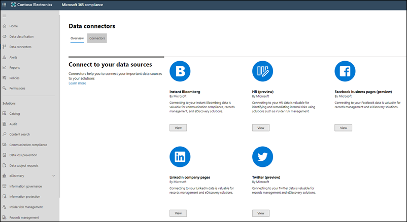

# Neuerungen in Microsoft 365 Compliance

Unabhängig davon, ob sie neue Lösungen zum [Microsoft 365 Compliance Center](microsoft-365-compliance-center.md)hinzufügen, vorhandene Features basierend auf Ihrem Feedback aktualisieren oder aktuelle und aktualisierte Dokumentationen zur Verfügung stellt, hilft Ihnen Microsoft 365, auf dem neuesten Stand der sich ständig ändernden Compliancelandschaft zu bleiben. Sehen Sie sich unten an, was in Microsoft 365 Compliance noch heute neu ist. 

> [!NOTE]
> Einige Compliancefeatures werden für unsere Kunden mit unterschiedlichen Geschwindigkeiten ausgeführt. Wenn Sie noch kein Feature sehen, versuchen Sie, sich selbst zu [Gezieltes Release](https://docs.microsoft.com/office365/admin/manage/release-options-in-office-365) hinzuzufügen.

> [!TIP]
> Interessieren Sie sich dafür, was in anderen Admin Centers geschieht? Dann lesen Sie die folgenden Artikel: [Neuerungen im Microsoft 365 Admin Center](https://docs.microsoft.com/office365/admin/whats-new-in-preview) [Aktive Websites im SharePoint Online Admin Center](https://docs.microsoft.com/sharepoint/what-s-new-in-admin-center) [Neuerungen in Microsoft 365 Defender](https://docs.microsoft.com/microsoft-365/security/mtp/whats-new)  
Besuchen Sie die [Microsoft 365-Roadmap](https://www.microsoft.com/en-us/microsoft-365/roadmap), um sich über Features von Microsoft 365 zu informieren, die eingeführt wurden, bereitgestellt werden, sich in der Entwicklung befinden, eingestellt oder zuvor veröffentlicht wurden.

## November & Dezember 2020
Nur eine Erinnerung daran, dass wir häufig neue und aktualisierte Features in einem Vorschauzustand veröffentlichen, um zu erfahren, wie sie verwendet werden, damit wir sie optimieren und verbessern können, bevor wir sie für die allgemeine Verfügbarkeit freigeben. Ihr Feedback ist während der Vorschau (und darüber hinaus) wichtig. Teilen Sie uns ihre Meinung mit, indem Sie die Feedbackkarte unten rechts im Compliance Center öffnen.

### Spotlight: Endpunkt-DLP (Data Loss Prevention, Verhinderung von Datenverlust) veröffentlicht

[Endpunkt-DLP](endpoint-dlp-learn-about.md) erweitert die Aktivitätsüberwachungs- und Schutzfunktionen von DLP auf vertrauliche Informationen auf Windows 10-Geräten. Nach dem [Onboarding von](dlp-configure-endpoints.md) Geräten im Microsoft 365 Compliance Center können Sie DLP-Richtlinien einrichten, um die vertraulichen Informationen auf diesen Geräten zu schützen.

### Advanced eDiscovery

Um die Verwaltung verschlüsselter Inhalte im eDiscovery-Workflow zu vereinfachen, umfassen die  Microsoft 365 eDiscovery-Tools jetzt die Entschlüsselung verschlüsselter Dateien, die an E-Mail-Nachrichten angefügt und in Exchange gesendet werden. Darüber hinaus werden verschlüsselte Dokumente, die in SharePoint und OneDrive gespeichert sind, in Advanced eDiscovery entschlüsselt.

### Compliance-Manager

- [Support für Microsoft 365 Government-Abonnements.](compliance-manager.md) Der Compliance Manager ist jetzt für Kunden der US Government Community (GCC) Moderate und High verfügbar.
- [Microsoft Compliance Configuration Analyzer für Compliance Manager](compliance-manager-mcca.md). Neues PowerShell-basiertes Tool, das Ihnen den Einstieg in den Compliance Manager erleichtert, indem die aktuellen Konfigurationen Ihrer Organisation anhand der von Microsoft 365 empfohlenen bewährten Methoden validiert werden.
- [Neue Vorlagen](compliance-manager-templates-list.md). Es wurden 56 neue Vorlagen hinzugefügt, die insgesamt mehr als 230 Compliance-Manager-Vorlagen zur Verfügung stellen.

### Datenconnectors

[Fünf neue Connectors in der Vorschauversion von "Globeanet".](archiving-third-party-data.md#third-party-data-connectors) Zu den neuen Connectors gehören Reuters Dealing, Reuters FX, CellTrust, XIP, generische MS SQL Datenbankdaten.

### Aufbewahrungsbezeichnungen (Dispositionsüberprüfung)

Zum Anzeigen von Elementen während einer Dispositionsüberprüfung müssen Benutzer jetzt Mitglieder der Rollengruppen "Inhalts-Explorer-Inhaltsanzeige" und ["Inhalts-Explorer-Listenanzeige" sein.](disposition.md#permissions-for-disposition) Diese Rollengruppen sind zwar zum Überprüfen von Elementen erforderlich, zum Abschließen der Dispositionsüberprüfung sind sie jedoch nicht erforderlich.

### Vertraulichkeitsbezeichnungen

- [(Vorschau) Einstellungen für die externe Freigabe für SharePoint-Websites.](sensitivity-labels-teams-groups-sites.md#how-to-configure-groups-and-site-settings) Beim Erstellen einer Bezeichnung, die für Gruppen und Websites verwendet wird, wird eine Option zum Steuern der externen Freigabe für SharePoint-Websites angezeigt, auf die die Bezeichnung angewendet wurde. Sie können angeben, dass die Freigabe für alle, neue und vorhandene Gäste, nur für vorhandene Gäste oder nur für Benutzer in Ihrer Organisation zulässig ist. Wenn die Bezeichnung angewendet wird, ersetzen die Bezeichnungseinstellungen alle einstellungen für die externe Freigabe, [die im SharePoint Admin Center konfiguriert sind.](https://docs.microsoft.com/sharepoint/change-external-sharing-site)
- [Entfernen von Bezeichnung und Verschlüsselung aus einem mit Bezeichnungen versehenen Dokument.](sensitivity-labels-sharepoint-onedrive-files.md#remove-encryption-for-a-labeled-document) Um sowohl eine Bezeichnung als auch die verschlüsselung zu entfernen, die sie aus einem mit Bezeichnungen versehenen Dokument in SharePoint erzwingt, können globale Administratoren und SharePoint-Administratoren das neue `Unlock-SPOSensitivityLabelEncryptedFile` Cmdlet ausführen. Dieses Cmdlet wird auch dann ausgeführt, wenn der Administrator nicht über Zugriffsberechtigungen für die Website oder Datei verfügt oder wenn der Azure Rights Management Service nicht verfügbar ist.

## Oktober 2020

### Advanced eDiscovery

[CJK Sprachunterstützung](ediscovery-cjk-support.md). Advanced eDiscovery unterstützt jetzt Doppel-Byte-Zeichensatzsprachen, die gemeinsam als #A0 (einschließlich vereinfachtes Chinesisch, traditionelles Chinesisch, Japanisch und Koreanisch) bekannt sind. Diese können in mehreren erweiterten Überprüfungssatzszenarien verwendet werden.

### Vertraulichkeitsbezeichnungen

- [Bezeichnungsbereich](sensitivity-labels.md#label-scopes). Beim Erstellen einer Vertraulichkeitsbezeichnung wird eine neue Option zum Definieren des Bereichs für die Bezeichnung angezeigt. Mit dieser Option können Sie Bezeichnungen nur für Dateien und E-Mails, Container (z. B. SharePoint-Websites und Teams) oder beides konfigurieren.
- [Dynamische Inhaltsmarkierung](sensitivity-labels-office-apps.md#dynamic-markings-with-variables). Beim Konfigurieren der Inhaltskennzeichnung für eine Vertraulichkeitsbezeichnung können Sie jetzt die dynamischen Variablen wie und in der Textzeichenfolge für die Kopfzeile, Fußzeile oder das `${Item.Label}` `${Item.Location}` Wasserzeichen verwenden.

## September 2020

### Spotlight: Compliance Manager

Bei Ignite in diesem Jahr angekündigt, wird die Compliance-Bewertung als [Compliance-Manager umbenannt.](compliance-manager.md) Diese Version schließt den Übergang von der vorherigen Startseite des Compliance Managers im Service Trust Portal ab und führt eine End-to-End-Lösung zur Verwaltung der Compliance im Microsoft 365 Compliance Center ein.

Sehen Sie sich das folgende Video an, um zu erfahren, wie der Compliance-Manager dazu beitragen kann, die Verwaltung der Compliance in Ihrer Organisation zu vereinfachen.
 
 
>[!VIDEO https://www.microsoft.com/videoplayer/embed/RE4FGYZ]

### Erweiterte Überwachung

- Die neue 10-jahres-Aufbewahrung von Überwachungsprotokollen unterstützt lang dauernde Untersuchungen und reagiert auf behördliche, rechtliche und interne Verpflichtungen.
- [Drei neue wichtige Ereignisse.](advanced-audit.md#access-to-crucial-events-for-investigations) Die folgenden neuen Ereignisse können Ihnen helfen, mögliche Verstöße zu untersuchen und den Umfang der Verletzung zu bestimmen: Send, SearchQueryInitiatedExchange und SearchQueryInitiatedSharePoint.

### Kommunikationscompliance

- [Rollengruppen aktualisiert.](communication-compliance-configure.md#step-1-required-enable-permissions-for-communication-compliance) Rollengruppen für die Kommunikationskonformität entsprechen jetzt der Rollengruppenstruktur, die für die Lösung für das Insiderrisikomanagement verfügbar ist.
- [Dashboard "Berichte".](communication-compliance-feature-reference.md#reports-preview) Der zentrale Ort zum Anzeigen aller Berichte zur Kommunikationskonformität. Berichts widgets provide a quick view of insights most commonly needed for an overall assessment of the status of communication compliance activities.
- [Power Automate flows](communication-compliance-feature-reference.md#power-automate-flows). Richten Sie Flüsse ein, um Aufgaben für Warnungen und Benutzer zu automatisieren, Manager zu benachrichtigen, wenn Benutzer Warnungen auslösen, und vieles mehr.
- [Problembehebungsaktion "Klassifizierung verbessern"](communication-compliance-investigate-remediate.md#step-3-decide-on-a-remediation-action). Warnungen mit Elementen, die trainierbaren Klassifizierungen entsprechen, können von Feedback profitieren, um falsch positive Ergebnisse in Ihrer Organisation zu minimieren. Mit **der Option "Klassifizierung verbessern"** können Sie Feedback darüber geben, ob erkannte Elemente mit dem Klassifikator übereinstimmen, der in der zugehörigen Richtlinie zur Kommunikationskonformität konfiguriert ist. Sie können sogar andere Klassifizierungen vorschlagen, die dem Element zugeordnet werden sollen, um die Übereinstimmungsgenauigkeit für zukünftige Warnungen zu verbessern.

### Datenconnectors

- [Neue Datenconnectors von Drittanbietern.](archiving-third-party-data.md#third-party-data-connectors) 25 neue Datenconnectors, einschließlich 14 Connectors von Globeanet und 8 von Telemessage.
- [Physischer Badging connector](import-physical-badging-data.md). Importieren Sie physische Badgingdaten, z. B. die physischen Zugriffsereignisse des Mitarbeiters oder alle Meldungen über den physischen Zugriff, die durch das System für das Badging Ihrer Organisation generiert werden. Beispiele hierfür sind Einträge in Gebäuden, Serverräumen oder Rechenzentren. Physische Schadsoftwaredaten können von der Lösung für das Insiderrisikomanagement verwendet werden, um Ihre Organisation vor böswilligen Aktivitäten oder Datendiebstahl in Ihrer Organisation zu schützen.

### Insider-Risikomanagement

- [Microsoft Teams-Integration.](insider-risk-management-settings.md#microsoft-teams-preview) Wenn die Integration von Teams in den Einstellungen für Insiderrisiken aktiviert ist, können Sie die Zusammenarbeit mit anderen Beteiligten in Teams bei Aufgaben koordinieren, z. B. das sichere Teilen und Speichern von Daten im Zusammenhang mit Einzelfällen, das Nachverfolgen und Überprüfen von Reaktionsaktivitäten von Analysten und Ermittlern und vieles mehr.
- [Power Automate flows](insider-risk-management-settings.md#power-automate-flows-preview). Richten Sie Flüsse ein, um wichtige Aufgaben für Fälle und Benutzer zu automatisieren, z. B. das Abrufen von Benutzer-, Warnungs- und Fallinformationen für die Freigabe mit Beteiligten und anderen Apps, das Automatisieren von Aktionen wie das Veröffentlichen von Fallnotizen und vieles mehr.
- [Aktivitäten-Explorer](insider-risk-management-alerts.md#activity-explorer-preview): Der Aktivitäts-Explorer, der beim Überprüfen von Warnungen verfügbar ist, bietet Ermittlern und Analysten ein umfassendes Analysetool für drill drill down in jede Warnung. Überprüfen Sie schnell eine Zeitachse erkannter riskanter Aktivitäten, und identifizieren und filtern Sie alle Mit Warnungen verbundenen Risikoaktivitäten.

### Aufbewahrungsrichtlinien und Aufbewahrungsbezeichnungen

- [Unterstützung für Yammer](retention-policies-yammer.md). Sie können jetzt Aufbewahrungsrichtlinien verwenden, um Nachrichten aus der Yammer und private Nachrichten zu behalten und zu löschen.
- [Anwenden von Bezeichnungen auf Teams-Besprechungsaufzeichnungen.](apply-retention-labels-automatically.md#microsoft-teams-meeting-recordings) Verwenden Sie beim Erstellen einer Richtlinie für automatische Bezeichnungen den #A0 zum Identifizieren von Teams-Besprechungsaufzeichnungen, die in den #A1 von Benutzern oder in SharePoint gespeichert sind.

### Datensatzverwaltung

[Unterstützung für behördliche Datensätze](declare-records.md#how-to-display-the-option-to-mark-content-as-a-regulatory-record). Durch das Klassifizieren einer Bezeichnung als gesetzlicher Datensatz werden die Einschränkungen erhöht, die für Inhalte gelten, auf die die Bezeichnung angewendet wird, und die verfügbaren Verwaltungsaktionen für die Bezeichnung selbst werden eingeschränkt. Beispielsweise kann nach der Anwendung auf Inhalte niemand, nicht einmal ein globaler Administrator, die Bezeichnung entfernen. [Erfahren Sie mehr](records-management.md#compare-restrictions-for-what-actions-are-allowed-or-blocked) darüber, welche Aktionen für behördliche Datensätze zulässig und blockiert sind.

### Vertraulichkeitsbezeichnungen

[Support für Kunden von US Government](https://docs.microsoft.com/enterprise-mobility-security/solutions/ems-aip-premium-govt-service-description). Vertraulichkeitsbezeichnungen werden jetzt für GCC-, GCC High- und DoD-Kunden unterstützt, nur für den Azure Information Protection-Client für einheitliche Bezeichnungen und den Scanner.

### Trainierbare Klassifizierungsmerkmale

Neue Umschulungs- und Feedbackfunktionen verbessern die Genauigkeit und minimieren falsch positive Übereinstimmungen für alle benutzerdefinierten Klassifikatoren und einige bereits trainierte Klassifizierungen. Mit diesem Fluss können Sie Feedback dazu geben, ob Elemente bestimmten Klassifizierungen entsprechen, andere Klassifikatoren vorschlagen, die Elementen zugeordnet werden, und Klassifikatoren erneut antrainieren, um die Übereinstimmungsgenauigkeit zu optimieren und zu verbessern.

Diese neue Funktion ist in den folgenden Features enthalten:

> [!NOTE]
> Wenn Sie mindestens 30 Feedbackantworten für alle Features bereitstellen, erstellen wir eine klassifizierte Version dieser Klassifizierung, die Sie überprüfen können. Wenn eine Verbesserung besteht, können Sie den Klassifikator erneut veröffentlichen.

- [Trainierbare Klassifizierungen](classifier-learn-about.md#retraining-classifiers): Um die Genauigkeit Ihrer veröffentlichten Klassifizierungen zu verbessern, können Sie Feedback dazu geben, ob die erkannten Elemente mit der Klassifizierung übereinstimmen.
- [Kommunikationskonformität](classifier-how-to-retrain-comms-compliance.md). Mit der **neuen Aktion zur** Verbesserung der Klassifizierungsbehebung können Sie Feedback darüber geben, ob ein Element aus einer Warnung zur Kommunikationskonformität mit dem in der Kommunikationskonformitätsrichtlinie konfigurierten Klassifikator entspricht.
- [Inhalts-Explorer](classifier-how-to-retrain-content-explorer.md): Wenn Sie eine Richtlinie für die automatische Aufbewahrungsbezeichnung einrichten, um Bezeichnungen automatisch auf E-Mail-Nachrichten anzuwenden, die trainierbaren Klassifizierungen entsprechen, können Sie den Inhalts-Explorer verwenden, um die bezeichneten Elemente zu überprüfen und Feedback darüber zu geben, ob die Elemente mit der Klassifizierung übereinstimmen.

## August 2020

### Spotlight: Updates zur Risiko- und Kommunikationskonformität von Insidern

In diesem Monat werden mehrere neue und verbesserte Features in der öffentlichen Vorschau angezeigt:

**Insider-Risikomanagement**

- Sehen Sie sich unsere sechs neuen [Richtlinienvorlagen an:](insider-risk-management-policies.md#policy-templates)
    - Datenlecks nach Prioritätsbenutzern
    - Datenlecks von verärgerten Benutzern
    - Verstöße gegen allgemeine Sicherheitsrichtlinien
    - Verstöße gegen Sicherheitsrichtlinien durch ausscheidende Benutzer
    - Sicherheitsrichtlinienverletzungen nach Prioritätsbenutzern
    - Sicherheitsrichtlinienverletzungen durch verärgerte Benutzer

- Mit der Integration in [Microsoft Defender for Endpoint](https://docs.microsoft.com/windows/security/threat-protection/microsoft-defender-atp/microsoft-defender-advanced-threat-protection) können Sie Microsoft Defender für Endpunktwarnungen nach Aktivitäten importieren und filtern, die von Richtlinien erkannt wurden, die aus den neuen Richtlinienvorlagen für Sicherheitsverletzungen erstellt wurden. Es gibt auch eine zugehörige Einstellung für [Insiderrisiken,](insider-risk-management-settings.md#microsoft-defender-for-endpoint-preview) bei der Sie Sicherheitswarnungen basierend auf dem Microsoft Defender für Endpunkt-Warnungs-Triagestatus in das Insider-Risikomanagement importieren können.

    > [!NOTE]
    > Um die Vorteile der Integration von Microsoft Defender for Endpoint (einschließlich der neuen Vorlagen für Sicherheitsrichtlinienverletzungen) nutzen zu können, müssen Sie Microsoft Defender für Endpoint in Ihrer Organisation konfigurieren. Darüber hinaus müssen Sie Microsoft Defender for Endpoint für die Integration von Insider-Risikomanagement aktivieren, indem Sie erweiterte Features [in Microsoft Defender for Endpoint konfigurieren.](https://docs.microsoft.com/windows/security/threat-protection/microsoft-defender-atp/advanced-features#share-endpoint-alerts-with-microsoft-compliance-center)
 
- Anpassen von Schwellenwerten für Indikatoren beim [Erstellen einer Richtlinie.](insider-risk-management-policies.md#create-a-new-policy)
- Richten Sie [Benutzergruppen](insider-risk-management-settings.md#priority-user-groups-preview) mit Priorität ein, um Benutzer in Ihrer Organisation zu definieren, deren Aktivitäten basierend auf Faktoren wie position, Zugriffsebene auf vertrauliche Informationen oder Risikoverlauf einer genaueren Überprüfung unterzogen werden müssen.
- Verwenden Sie Office 365-Verwaltungsaktivitäts-APIs, um Details zu Insiderrisiken in andere Anwendungen zu exportieren, die Ihre Organisation möglicherweise zum Verwalten oder Aggregieren von Insiderrisikodaten verwendet. 
- Mithilfe [neuer Domäneneinstellungen](insider-risk-management-settings.md#domains-preview) können Sie Risikostufen für Aktivitäten in bestimmten Domänen definieren und steuern.

**Kommunikationscompliance**

- Wenn [Sie Nachrichten in einer](communication-compliance-investigate-remediate.md#step-3-decide-on-a-remediation-action)Warnung überprüfen, können Sie nun unangemessene Nachrichten in Microsoft Teams-Kanälen, 1:1- und Gruppenchats entfernen. Entfernte Nachrichten und Inhalte werden durch einen Richtlinientipp ersetzt, der erläutert, dass sie aufgrund vertraulicher Inhalte entfernt wurden.
- Neue [Kommunikationsrollen](communication-compliance-configure.md#step-1-required-enable-permissions-for-communication-compliance) (diese werden auch in neuen Rollengruppen zur Kommunikationskonformität enthalten sein, die im September veröffentlicht werden).
- Neue Einstellungseinstellungen für die Kommunikationskonformität, die Einstellungen für [Datenschutz-](communication-compliance-feature-reference.md#privacy) und [Benachrichtigungsvorlagen enthält.](communication-compliance-feature-reference.md#notice-templates)
- Neue [Klassifizierungen,](communication-compliance-feature-reference.md#classifiers) mit deren Hilfe Bilder für Erwachsene, Rassivität und Gory erkannt werden können.
- Die neue Benachrichtigung "Muster erkannt", die beim Überprüfen von Nachrichten [in](communication-compliance-investigate-remediate.md#step-2-examine-the-message-details) einer Warnung angezeigt wird, informiert Sie über das erneute Auftreten von Instanzen desselben Verhaltens durch einen Benutzer.

### Vertraulichkeitsbezeichnungen

- Für US Government-Mandanten (GCC, GCC-HC, und DoD) werden Vertraulichkeitsbezeichnungen derzeit nur für den Azure Information Protection-Client für einheitliche Bezeichnungen und den Scanner unterstützt. Weitere Informationen finden Sie in der [Dienstbeschreibung des Azure Information Protection Premium Government ](https://docs.microsoft.com/enterprise-mobility-security/solutions/ems-aip-premium-govt-service-description).
- Sie können jetzt [Security & Compliance Center PowerShell](create-sensitivity-labels.md#use-powershell-for-sensitivity-labels-and-their-policies) verwenden, um alle Einstellungen zu erstellen und zu konfigurieren, die in Ihrem Admin Center für Bezeichnungen angezeigt werden. Dies bedeutet, dass Sie nicht nur PowerShell für Einstellungen verwenden können, die in den Admin Centern für Bezeichnungen nicht verfügbar sind, sondern jetzt auch die Erstellung und Verwaltung von Vertraulichkeitsbezeichnungen und Richtlinien für Vertraulichkeitsbezeichnungen vollständig skripten können.

### Datensatzverwaltung: Inhaltsüberarbeitung

Neue Dokumente, die Bereitstellungsschritte, das Markieren von Inhalten als Datensätze und die Versionsierung von Datensätzen abdecken:

- [Erste Schritte mit der Datensatzverwaltung](get-started-with-records-management.md)
- [Datensätze mithilfe von Aufbewahrungsbezeichnungen deklarieren](declare-records.md)
- [Versionsverwaltung zur Aktualisierung von Datensätzen verwenden, die in Microsoft Office SharePoint Online oder OneDrive gespeichert sind](record-versioning.md)

### Aufbewahrungsbezeichnungen & Richtlinien

Aufbewahrungsbezogene Administratoraktivitäten werden jetzt aufgezeichnet und können im Überwachungsprotokoll überprüft werden. Die vollständige Liste finden Sie unter [ Aufbewahrungsrichtlinie und Aufbewahrungsbezeichnungsaktivitäten](search-the-audit-log-in-security-and-compliance.md#retention-policy-and-retention-label-activities).

### Advanced eDiscovery

- Beim Hinzufügen einer Sammlung zu einem [Überprüfungssatz](add-data-to-review-set.md#define-options-to-scope-your-collection-for-review)können Sie jetzt moderne Anlagen (auch als "Cloudanlagen" bezeichnet) und SharePoint-Dokumentversionen hinzufügen.
- Neue [direkte Download-Export-Erfahrung,](export-documents-from-review-set.md)sodass keine Azure Storage Explorer zum Herunterladen von Fallinhalten verwendet werden muss.

## Juli 2020

### Spotlight zu Hilfe-Dokumenten

Um Ihnen zu verstehen, welche Compliancelösungen zum Schützen und Steuern der vertraulichen Daten Ihrer Organisation verwendet werden, haben wir zwei neue Angebotsseiten mit Übersichten darüber erstellt, wie die Lösungen zusammenarbeiten, um diese Ziele zu erreichen, einschließlich Links zu verwandten Dokumenten, damit Sie sich weiter eintauchen können.

[Microsoft Information Protection in Microsoft 365](information-protection.md) 
[Microsoft-Informationsgovernance in Microsoft 365](manage-Information-governance.md)

### Advanced eDiscovery: Hinzufügen von Datenquellen ohne Verwahrer zu Ihren Fällen

Hinzufügen von Daten zu einem Fall, ohne sie einem Verwahrer zuordnen zu müssen (auch als [Nicht-Verwahrer-Datenquellen bekannt).](non-custodial-data-sources.md) Und wenn Sie diese nicht verwahrten Daten in einem Haltespeicher platzieren müssen, können Sie dies mit unserem neuen Feature für die erweiterte Indizierung tun.

### Datenconnectors: Verbesserungen am Hr Connector

(In der Vorschau) Mit einer neuen  Version des Personalabteilungsconnector können Sie Daten im Zusammenhang mit Änderungen auf Auftragsebene, Leistungsüberprüfungen und Leistungsverbesserungsplänen importieren. Diese Daten können dann in mehreren Richtlinien für [Insiderrisiken](insider-risk-management-policies.md) verwendet werden, um verwandte Aktivitäten zu erkennen.

### Aufbewahrungsbezeichnungen: Neue Unterstützung für E-Mails

Sie können jetzt eine [Aufbewahrungsbezeichnung](retention.md#retention-labels) erstellen, um mit der Aufbewahrung von E-Mails zu beginnen, die darauf basieren, wann Nachrichten mit Bezeichnungen versehen wurden. Dies gilt nicht für Kalenderelemente, die basierend auf dem Versand des Elements beibehalten werden.

### Vertraulichkeitsbezeichnungen: Neues Feature und Verbesserung

- (In der Vorschau) Suchen Sie beim Konfigurieren von Verschlüsselungseinstellungen für  eine Bezeichnung nach der neuen Option zur Verwendung der Doppelschlüsselverschlüsselung, um mit Bezeichnungen versehene Dateien und E-Mails weiter zu schützen.
- Beim Erstellen oder Löschen von Vertraulichkeitsbezeichnungen oder beim Erstellen, Bearbeiten oder Löschen ihrer Bezeichnungsrichtlinien werden Änderungen jetzt innerhalb einer Stunde mit allen Benutzern, Apps und Diensten synchronisiert.

## Juni 2020

### Spotlight: Vorschau für neue Datenconnectors

Aufbauend auf unserem Versprechen, Ihnen beim Importieren von Daten aus weiteren Drittanbieterquellen in Microsoft 365 zu helfen, freuen wir uns, die Vorschauversion von zwei weiteren Datenconnectors ankündigen zu können:

- [Bloomberg- Nachricht](archive-bloomberg-message-data.md). Importieren und Archivieren von Finanzdienstleister-E-Mail-Daten aus dem Bloomberg Message Collaboration Tool. Nachdem die Daten in Postfächern gespeichert wurden, können Sie auf die Daten in Compliancefeatures wie z. B. Aufbewahrung für Rechtsstreitigkeiten, Inhaltssuche, In-Place-Archivierung, Überwachung, Kommunikationskonformität und Aufbewahrungsrichtlinien zugreifen und diese verwenden.
- [ICE Chat](archive-icechat-data.md). Importieren und Archivieren von Chatdaten für Finanzdienstleistungen aus dem ICE Chat-Zusammenarbeitstool. Nachdem die Daten in Postfächern gespeichert wurden, können Sie auf die Daten in Compliancefeatures wie z. B. Aufbewahrung für Rechtsstreitigkeiten, eDiscovery, Archivierung, Überwachung, Kommunikationskonformität und Aufbewahrungsrichtlinien zugreifen und diese verwenden.

### Compliance score & Compliance Manager: Die Treffer werden weiterhin kommen

Die Juniupdates enthalten eine neue Bewertungs-Drilldownansicht in der [Compliancebewertung.](compliance-score.md) Überwachen Sie den Fortschritt der Steuerung, fügen Sie Bewertungen hinzu, löschen Sie bewertungen direkt aus der Compliancebewertung und vieles mehr.

Möchten Sie über Updates für die Compliance-Bewertung und den Compliance-Manager auf dem Neuesten bleiben? Lesezeichen für [die Anmerkungen zur Compliance-Bewertung](compliance-score-release-notes.md) und häufiges Zurückchecken.

## Mai 2020

### Spotlight: Datenklassifizierung wird offiziell veröffentlicht

Die Datenklassifizierung, auch[bekannt](data-classification-overview.md)als "Ihre Daten kennen", Features (Analyse, Inhalts-Explorer und Aktivitäts-Explorer) wurden aus der Vorschauphase gestuft und sind für alle Organisationen verfügbar. Leistungsstarke Einblicke und Tools helfen Ihnen zu erkennen und zu bewerten, wie vertrauliche Informationen und Bezeichnungen (Aufbewahrung und Vertraulichkeit) in Inhalten in Ihrer Organisation verwendet werden. Überprüfen Sie Inhalte, die vertrauliche Informationen enthalten oder bezeichnungen angewendet wurden, erkunden Sie Die Bezeichnungsaktivitäten an allen Microsoft 365-Speicherorten, erstellen Sie benutzerdefinierte Typen vertraulicher Informationen und vieles mehr.

Machen Sie eine Videotour...

> [!VIDEO https://www.microsoft.com/videoplayer/embed/RE4vx8x]

### Trainierbare Klassifizierungen: Ein Fix und ein Feature

Kann weitere Verbesserungen an trainierbaren Klassifizierungen mit sich bringen:

- Ein Fix basierend auf Ihrem Feedback: Wenn Sie ein Seeding durchführen und eine benutzerdefinierte Klassifizierung trainieren, müssen Sie keine URLs und Ordnerpfade für die SharePoint-Website mehr manuell eingeben. Sie können jetzt aus einer vorab auffüllten Liste von Websites und Ordnern auswählen.
- Neues Feature: Wenn Sie eine Vertraulichkeitsbezeichnung erstellen und Einstellungen für die automatische Bezeichnung für Office-Apps konfigurieren, können Sie die Bezeichnung jetzt automatisch auf Inhalte anwenden (oder empfehlen, die Bezeichnung auf Inhalte anzuwenden, die trainierbaren Klassifizierungen entspricht). [Weitere Informationen](apply-sensitivity-label-automatically.md#configuring-trainable-classifiers-for-a-label)

### Kommunikationskonformität: Yammer Support ist hier

Private Nachrichten und öffentliche Communityunterhaltungen in Yammer werden in Richtlinien zur Kommunikationskonformität unterstützt. Yammer ist ein optionaler Kanal und muss sich im [nativen Modus](https://docs.microsoft.com/yammer/configure-your-yammer-network/overview-native-mode) befinden, um die Überprüfung von Nachrichten und Anlagen zu unterstützen.

### Verhinderung von Datenverlust: Neue Freigabeeinschränkung

Beim Einrichten einer #A0 zum Schutz von Inhalten in SharePoint oder OneDrive können Sie jetzt die Aktion "Zugriff auf Inhalte einschränken" konfigurieren, um Personen zu blockieren, denen Zugriff auf den Inhalt über die Option["Jeder](https://support.microsoft.com/office/share-files-outside-your-organization-with-anyone-links-53e91027-fb8e-4a6e-a3e4-5df4be32e38a)mit link"-Option erhalten wurde.

### Insider-Risikomanagement: Anpassen des Warnungsvolumens

Benutzeraktivitäten, die von Richtlinien für Insiderrisiken erkannt werden, erhalten eine bestimmte Risikobewertung, die wiederum den Warnungsschweregrad bestimmt (niedrig, mittel, hoch). Standardmäßig generiert Microsoft 365 eine bestimmte Menge von Warnungen mit niedrigem, mittlerem und hohem Schweregrad, aber mit der neuen Einstellung für das Warnungsvolumen können Sie das Volume entsprechend Ihren Anforderungen vergrößern oder verringern.

### PST-Import: Neue Region wird unterstützt

Der Netzwerkupload ist jetzt in den Vereinigten Arabischen Emiraten verfügbar.

### Vertraulichkeitsbezeichnungen: Neue Datenschutzoption

Beim Konfigurieren von [Website- und Gruppeneinstellungen](sensitivity-labels-teams-groups-sites.md#how-to-configure-groups-and-site-settings) für eine Bezeichnung können Sie jetzt die Datenschutzoption auf **"Keine"** festlegen. Lassen Sie den Benutzer auswählen, wer auf die Website zugreifen kann. Dies ist hilfreich, wenn Sie Inhalte im Container mithilfe einer Vertraulichkeitsbezeichnung schützen möchten, benutzer aber dennoch die Datenschutzeinstellung selbst konfigurieren können.

## April 2020

### Datensatzverwaltung: Überarbeitung... und eine neue Ergänzung

April enthält einige wichtige Updates für unsere Datensatzverwaltungslösung:

- Der Abschnitt "Datensatzverwaltung" ist jetzt vollständig im Compliance Center verfügbar. Nutzen Sie aktualisierte Benutzeroberflächen und Funktionen für Dateiplan, Aufbewahrungsbezeichnungen und Bezeichnungsrichtlinien, Ereignisse und Disposition.
- Wenn wir von Disposition sprechen, haben wir auch einen Dispositionsnachweis [für](disposition.md#disposition-of-records) Datensätze in SharePoint und OneDrive veröffentlicht. Sie können nun eine Liste der Elemente an diesen Speicherorten anzeigen, die automatisch oder nach einer Dispositionsüberprüfung verworfen wurden.

### Vertraulichkeitsbezeichnungen: Anzeigen einer Vorschau von Richtlinien für automatische Bezeichnungen

Mit Richtlinien für die automatische Bezeichnung können Sie jetzt automatisch Vertraulichkeitsbezeichnungen auf Bereits gespeicherte SharePoint- und #A0 (auch als "Ruhedaten" bezeichnet) und E-Mails anwenden, die bereits gesendet oder empfangen wurden (auch als "E-Mail bei der Übertragung" bezeichnet). Da diese Bezeichnung von Diensten und nicht von Apps angewendet wird, müssen Sie sich keine Gedanken darüber machen, welche Apps Benutzer haben und welche Version.

Diese Funktion erweitert die vorhandene clientseitige Bezeichnung, die bereits in den Einstellungen für die automatische Bezeichnung für Office-Apps enthalten ist, wenn Sie eine Vertraulichkeitsbezeichnung erstellen. Informationen zu den Unterschieden und Vorteilen beider Optionen für die automatische Bezeichnung finden Sie im [aktualisierten Artikel.](apply-sensitivity-label-automatically.md)

## März 2020

### Einführung in die erweiterte Überwachung

[Advanced Audit in Microsoft 365](advanced-audit.md) führt neue Überwachungsfunktionen ein, die Ihrer Organisation bei forensischen und Complianceuntersuchungen helfen können. Zu den Highlights gehören die langfristige Aufbewahrung von Überwachungsprotokollen, benutzerdefinierte Aufbewahrungsrichtlinien für Überwachungsprotokolle, neue *E-MailItemsAccessed-Postfachüberwachungsaktion* und die Einführung einer neuen Einschränkungsgrenze auf Mandantenebene, die Ihrer Organisation ein eigenes vollständig zugewiesenes Bandbreitenkontingent für den Zugriff auf Ihre Überwachungsdaten bietet.

### Compliance score & Compliance Manager: Vorschau der neuesten Verbesserungen

Wichtige Updates für diese Vorschauversion sind:

- Vereinfachter Prozess zum Erstellen und Ändern von Vorlagen
- Versionshinweise und -steuerung für Vorlagen und Aktionen
- Synchronisieren gängiger Aktionen über Gruppen hinweg
- Die Sprachunterstützung wurde jetzt auf Chinesisch (vereinfacht), Chinesisch (traditionell), Französisch, Deutsch, Italienisch, Japanisch, Koreanisch, Portugiesisch (Brasilien), Russisch und Spanisch erweitert.

Weitere Informationen zur [Compliance-Bewertung und](compliance-score.md) zum [Compliance-Manager](compliance-manager-overview.md)

### Vertraulichkeitsbezeichnungen: Unterstützung für die Bezeichnung von #A0 in SharePoint und OneDrive (Vorschau)

Durch Aktivieren der Vorschau können Benutzer Vertraulichkeitsbezeichnungen in Office im Web anwenden. Sie können die Schaltfläche  "Vertraulichkeit" auf dem Menüband und den Namen der angewendeten Bezeichnung auf der Statusleiste anzeigen. Wenn sie #A0 verwenden, um ihre Dateien auf SharePoint oder OneDrive zu beschriften und dann zu speichern, kann Microsoft 365 jetzt den Inhalt dieser Dateien verarbeiten, wenn verschlüsselungseinstellungen auf die Bezeichnung angewendet wurden. Unter diesen Umständen wird auch die gemeinsame Dokumentierung, eDiscovery, Verhinderung von Datenverlust, Suche und andere Features für die Zusammenarbeit unterstützt.

[Erfahren Sie, wie Sie die Vorschau aktivieren](sensitivity-labels-sharepoint-onedrive-files.md)

## Februar 2020

### Insider-Risikomanagement wird offiziell veröffentlicht

Trommelwirbel, bitte ... Das Insider-Risikomanagement steht jetzt Organisationen mit den folgenden Abonnements zur Verfügung:

- [Microsoft 365 E5](https://go.microsoft.com/fwlink/?linkid=2120431) (bezahlt oder Testversion)
- Microsoft 365 Enterprise E3-Abonnement mit dem [Microsoft E5-Compliance-Add-On](https://go.microsoft.com/fwlink/?linkid=2120432)

Wir möchten Sie darüber informieren, dass wir seit der Vorschauversion einige Verbesserungen vorgenommen haben, darunter [neue Rollengruppen](insider-risk-management-configure.md#step-1-enable-permissions-for-insider-risk-management) und [lösungsweite Einstellungen](insider-risk-management-configure.md#step-4-configure-insider-risk-settings).

Wie immer, geben Sie bitte Feedback zur Lösung ab, damit wir weiterhin Verbesserungen vornehmen können.

### Datensatzverwaltung

Diese neue Lösung bietet alle Funktionen für die Datensatzverwaltung unter einem Dach. Zu den Highlights gehören die Einführung der Datensatz-Versionsverwaltung für Microsoft Office SharePoint Online und OneDrive sowie der Nachweis über die Beseitigung von Datensätzen.

[Weitere Informationen zur Datensatzverwaltung](records-management.md)

### Lösung im Blickpunkt: Datenconnectors für Facebook und Twitter

[Letzten Monat wurden Datenconnectors veröffentlicht](#just-launched), und wir erbitten Ihre Hilfe beim Testen der folgenden Connectors.

- [Facebook-Unternehmensseite](archive-facebook-data-with-sample-connector.md). Importiert und archiviert Daten von Facebook-Unternehmensseiten in Microsoft 365. Nutzbringend für Compliancelösungen wie Datensatzverwaltung und eDiscovery.
- [Twitter](archive-twitter-data-with-sample-connector.md). Importiert und archiviert Daten aus Twitter in Microsoft 365. Nutzbringend für Compliancelösungen wie Datensatzverwaltung und eDiscovery.

Wenn Sie diese Connectors einrichten und überprüfen, geben Sie uns bitte Feedback, was gut gelaufen ist, was nicht funktioniert hat und was wir tun können, um die Benutzerfreundlichkeit zu verbessern.

## Januar 2020

Die Wartezeit ist vorbei. Wir freuen uns, Ihnen mitzuteilen, dass das Microsoft 365 Compliance Center für alle Kunden mit Microsoft 365, Office 365, Enterprise Mobility + Security (EMS) und Windows 10 Enterprise-Plänen verfügbar ist. Alle Daten oder Richtlinien, die Sie im Security & Compliance Center verwaltet haben, sind im Compliance Center verfügbar, sodass sie nicht hin- und herspringen müssen.

Setzen Sie jetzt ein Lesezeichen, und wechseln Sie zu [https://compliance.microsoft.com](https://compliance.microsoft.com), um Ihre zentrale Anlaufstelle für die Verwaltung der Compliance in Ihrer gesamten Organisation zu besuchen..., oder [lesen Sie diesen Artikel](microsoft-365-compliance-center.md), um ein bisschen tiefer einzutauchen.

In diesem Monat haben wir auch neue und aktualisierte Lösungen veröffentlicht. Hier erhalten Sie einen schnellen Blick auf die Highlights.

### Jetzt in der Vorschau

**Insider-Risikomanagement (Vorschau)**

Wir freuen uns, Ihnen mitteilen zu können, dass unsere Lösung zum Insider-Risikomanagement jetzt in der öffentlichen Vorschau angezeigt wird. Kurz gesagt, hilft das Insider-Risikomanagement Ihrer Organisation, Insider-Risiken intelligent zu erkennen und dagegen Maßnahmen zu ergreifen, indem es Folgendes bereitstellt:

- Anonymitäts-Steuerelemente zur Sicherstellung des Datenschutzes von Benutzern.
- intelligente Richtlinienvorlagen mit systemeigenen und Drittanbieter-Indikatoren, die Insiderbedrohungen wie Datenlecks erkennen.
- integrierte End-to-End-Untersuchungs-Workflows, die sich über die IT-, Personal- und Rechtsabteilung erstrecken.

Wir würden uns freuen, Ihre Meinung zu hören. Wenn Sie die Lösung verwenden, senden Sie uns Ihr Feedback, damit wir sicherstellen können, dass wir Ihre Anforderungen erfüllen, während wir uns in Richtung allgemeine Verfügbarkeit bewegen.

[Weitere Informationen zum Insider-Risikomanagement](insider-risk-management.md)

### Soeben eingeführt

**Kommunikationscompliance**

Beim Übergang von der Vorschauphase zur vollständigen Verfügbarkeit ist die Kommunikationscompliance ein wichtiger Bestandteil unseres neuen Lösungssatzes zum Insider-Risiko. Diese robuste Lösung trägt dazu bei, die Kommunikationsrisiken mithilfe von Workflows zu minimieren, um Nachrichten, die nicht den Standards Ihrer Organisation entsprechen, zu erkennen, zu untersuchen und um Abhilfemaßnahmen zu treffen.

Das Kundenfeedback während der Vorschau war fantastisch. Es führte zu mehreren Verbesserungen, darunter der Eindruck beim ersten Ausführen, um Ihnen den Einstieg zu erleichtern, Verbesserungen der Untersuchung und Abhilfemaßnahmen sowie vieles mehr.

[Weitere Informationen zur Kommunikationscompliance](communication-compliance.md)

**Datenconnectors**

Früher haben Datenconnectors sich Speicherplatz mit anderen "Import"-Features im Office 365 Security & Compliance Center geteilt, nun verfügen sie über einen eigenen Bereich im Microsoft 365 Compliance Center. Verwenden Sie die neue Seite "Datenconnectors", um Daten aus den Dateien aus der Personalabteilung (HR) Ihrer Organisation und von verschiedenen Plattformen von Drittanbietern (z. B. Facebook, LinkedIn, Twitter und Instant Bloomberg) in Postfächer in Ihrer Microsoft 365-Organisation zu importieren und archivieren. Nach dem Importieren können diese Daten in mehreren Compliancelösungen verwaltet werden, darunter eDiscovery, Insider-Risikomanagement, Kommunikationscompliance, Überwachung, Aufbewahrungsrichtlinien und vieles mehr.

[Weitere Informationen zu Datenconnectors](archiving-third-party-data.md)

### Beachtenswerte Updates

**Neue Beurteilungsvorlagen für Compliancebewertung (Vorschau)**

Stets bemüht, Ihnen zu helfen, in der sich ständig weiterentwickelnden Compliancelandschaft voranzukommen, hat unser Team für Compliancebewertungen einen neuen Satz von Vorlagen bereitgestellt, um Ihnen dabei helfen, die Complianceausrichtung Ihrer Organisation in Hinblick auf die neuesten Bestimmungen zu bewerten und Anleitungen zur Implementierung effektiverer Steuerelemente zu erhalten. Sie können neue Vorlagen anzeigen für:

- ISO/IEC 27701:2019
- California Consumer Privacy Act (CCPA)
- das brasilianische allgemeine Datenschutzrecht (Lei Geral de Proteção de Dados – LGPD)
- SOC 1 Typ 2 und SOC 2 Typ 2

[Weitere Informationen zu Vorlagen für Compliancebewertungen](compliance-score.md#templates)