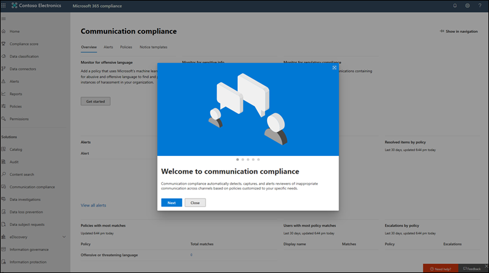

# Neuerungen in Microsoft 365 ComplianceWhat's new in Microsoft 365 compliance

Unabhängig davon, ob Sie dem [Microsoft 365 Compliance Center](microsoft-365-compliance-center.md)neue Lösungen hinzufügen, vorhandene Features auf der Grundlage Ihres Feedbacks aktualisieren oder eine aktualisierte und aktualisierte Dokumentation bereitstellen, hilft Ihnen Microsoft 365, die ständig wechselnde Compliance-Landschaft zu überwachen.Whether it be adding new solutions to the [Microsoft 365 compliance center](microsoft-365-compliance-center.md), updating existing features based on your feedback, or rolling out fresh and updated documentation, Microsoft 365 helps you stay on top of the ever-changing compliance landscape. Sehen Sie sich die folgenden Informationen an, um zu erfahren, was in der Microsoft 365-Compliance heute neu ist.Take a look below to see what’s new in Microsoft 365 compliance today. 

> [!NOTE]
> Einige Compliance-Features werden mit unterschiedlichen Geschwindigkeiten für unsere Kunden bereit gesetzt.Some compliance features get rolled out at different speeds to our customers. Wenn Sie noch kein Feature sehen, versuchen Sie, sich selbst zu [Gezieltes Release](https://docs.microsoft.com/office365/admin/manage/release-options-in-office-365) hinzuzufügen.If you aren't seeing a feature yet, try adding yourself to [targeted release](https://docs.microsoft.com/office365/admin/manage/release-options-in-office-365).

> [!TIP]
> Interessieren Sie sich dafür, was in anderen Admin Centers geschieht?Interested in what's going on in other admin centers? Dann lesen Sie die folgenden Artikel:Check out these articles: [Neuerungen im Microsoft 365 Admin CenterWhat's new in the Microsoft 365 admin center](https://docs.microsoft.com/office365/admin/whats-new-in-preview?view=o365-worldwide) [Aktive Websites im SharePoint Online Admin CenterWhat's new in the SharePoint admin center](https://docs.microsoft.com/sharepoint/what-s-new-in-admin-center) [Neuerungen in Microsoft 365 DefenderWhat's new in Microsoft 365 Defender](https://docs.microsoft.com/microsoft-365/security/mtp/whats-new)  
Besuchen Sie die [Microsoft 365-Roadmap](https://www.microsoft.com/en-us/microsoft-365/roadmap), um sich über Features von Microsoft 365 zu informieren, die eingeführt wurden, bereitgestellt werden, sich in der Entwicklung befinden, eingestellt oder zuvor veröffentlicht wurden.And visit the [Microsoft 365 Roadmap](https://www.microsoft.com/en-us/microsoft-365/roadmap) to learn about Microsoft 365 features that were launched, are rolling out, are in development, have been cancelled, or previously released.

## August 2020August 2020

### Spotlight: Compliance-Updates für Insider Risiken und-KommunikationSpotlight: Insider risk and communication compliance updates

Einige neue und verbesserte Features haben die öffentliche Vorschau in diesem Monat erreicht:Several new and improved features hit public preview this month:

**Insider-Risikomanagement****Insider risk management**

- Schauen Sie sich unsere sechs neuen [Richtlinienvorlagen](insider-risk-management-policies.md#policy-templates)an:Check out our six new [policy templates](insider-risk-management-policies.md#policy-templates):
    - Datenverluste nach Prioritäts BenutzernData leaks by priority users
    - Datenverluste durch verärgerte BenutzerData leaks by disgruntled users
    - Allgemeine SicherheitsrichtlinienverletzungenGeneral security policy violations
    - Sicherheitsrichtlinienverletzungen durch Benutzer, die abgemeldet werdenSecurity policy violations by departing users
    - Sicherheitsrichtlinienverletzungen nach Prioritäts BenutzernSecurity policy violations by priority users
    - Sicherheitsrichtlinienverletzungen durch verärgerte BenutzerSecurity policy violations by disgruntled users

- Die Integration mit [Microsoft Defender für Endpoint](https://docs.microsoft.com/windows/security/threat-protection/microsoft-defender-atp/microsoft-defender-advanced-threat-protection) ermöglicht das Importieren und Filtern von Microsoft Defender für Endpunkt Warnungen für Aktivitäten, die durch Richtlinien erkannt werden, die aus den neuen Richtlinienvorlagen für Sicherheitsverstöße ermittelt wurden.Integration with [Microsoft Defender for Endpoint](https://docs.microsoft.com/windows/security/threat-protection/microsoft-defender-atp/microsoft-defender-advanced-threat-protection) allows you to import and filter Microsoft Defender for Endpoint alerts for activities detected by policies created from the new security violation policy templates. Es gibt auch eine zugehörige [Einstellung für Insider Risiken](insider-risk-management-settings.md#microsoft-defender-for-endpoint-preview) , in der Sie Sicherheitswarnungen in das Insider Risikomanagement basierend auf dem Status "Microsoft Defender for Endpoint Alert Triage" importieren können.There’s also a related [insider risk setting](insider-risk-management-settings.md#microsoft-defender-for-endpoint-preview) where you can choose to import security alerts to insider risk management based on the Microsoft Defender for Endpoint alert triage status.

    > [!NOTE]
    > Um die Vorteile von Microsoft Defender für die Endpunkt Integration (einschließlich der neuen Vorlagen für Sicherheitsrichtlinienverletzungen) nutzen zu können, müssen Sie Microsoft Defender for Endpoint in Ihrer Organisation konfigurieren lassen.To take advantage of Microsoft Defender for Endpoint integration (including the new security policy violation templates), you'll need to have Microsoft Defender for Endpoint configured in your organization. Sie müssen auch Microsoft Defender für Endpoint for Insider Risk Management Integration aktivieren, indem Sie [Erweiterte Features in Microsoft Defender für Endpoint konfigurieren](https://docs.microsoft.com/windows/security/threat-protection/microsoft-defender-atp/advanced-features#share-endpoint-alerts-with-microsoft-compliance-center).You’ll also need to enable Microsoft Defender for Endpoint for insider risk management integration by [configuring advanced features in Microsoft Defender for Endpoint](https://docs.microsoft.com/windows/security/threat-protection/microsoft-defender-atp/advanced-features#share-endpoint-alerts-with-microsoft-compliance-center).
 
- Passen Sie Indikator Schwellenwerte beim [Erstellen einer Richtlinie](insider-risk-management-policies.md#create-a-new-policy)an.Customize indicator thresholds when [creating a policy](insider-risk-management-policies.md#create-a-new-policy).
- Einrichten von [Prioritäts Benutzergruppen](insider-risk-management-settings.md#priority-user-groups-preview) zum Definieren von Benutzern in Ihrer Organisation, deren Aktivität anhand von Faktoren wie Position, Zugriffsebene auf vertrauliche Informationen oder Risikoverlauf genauer zu Untersuchung erforderlich ist.Set up [priority user groups](insider-risk-management-settings.md#priority-user-groups-preview) to define users in your organization whose activity requires closer inspection based on factors such as their position, level of access to sensitive information, or risk history.
- Verwenden Sie Office 365 Verwaltungs Aktivitäts-APIs, um [Insider Risiko-Warnungsdetails](insider-risk-management-settings.md#export-alerts-preview) in andere Anwendungen zu exportieren, die Ihre Organisation zum Verwalten oder Aggregieren von Insider Risikodaten verwenden kann.Use Office 365 Management Activity APIs to [export insider risk alert details](insider-risk-management-settings.md#export-alerts-preview) to other applications your organization might use to manage or aggregate insider risk data.
- Mithilfe neuer [Domäneneinstellungen](insider-risk-management-settings.md#domains-preview) können Sie Risikoebenen für Aktivitäten in bestimmten Domänen definieren und steuern.New [domain settings](insider-risk-management-settings.md#domains-preview) help you define and control risk levels for activity in specific domains.

**Kommunikationscompliance****Communication compliance**

- Wenn Sie [Nachrichten in einer Warnung überprüfen](communication-compliance-investigate-remediate.md#step-3-decide-on-a-remediation-action), können Sie jetzt unangemessene Nachrichten in Microsoft Teams-Kanälen, 1:1 und Gruppenchats entfernen.When [reviewing messages in an alert](communication-compliance-investigate-remediate.md#step-3-decide-on-a-remediation-action), you can now remove inappropriate messages in Microsoft Teams channels, 1:1, and group chats. Entfernte Nachrichten und Inhalte werden durch einen richtlinientipp ersetzt, der erklärt, dass er aufgrund von vertraulichen Inhalten entfernt wurde.Removed messages and content are replaced with a policy tip that explains that it was removed due to sensitive content.
- Neue [Kommunikationsrollen](communication-compliance-configure.md#step-1-required-enable-permissions-for-communication-compliance) (diese werden auch in den neuen Kommunikationsrichtlinien-Rollengruppen enthalten sein, die im September veröffentlicht werden).New [communication roles](communication-compliance-configure.md#step-1-required-enable-permissions-for-communication-compliance) (these will also be included in new communication compliance role groups releasing in September).
- Neue Kompatibilitätseinstellungen für Kommunikation mit Einstellungen für [Datenschutz](communication-compliance-feature-reference.md#privacy-preview) -und [Benachrichtigungsvorlagen](communication-compliance-feature-reference.md#notice-templates).New communication compliance settings experience that includes settings for [privacy](communication-compliance-feature-reference.md#privacy-preview) and [notice templates](communication-compliance-feature-reference.md#notice-templates).
- Neue [Klassifizierungen](communication-compliance-feature-reference.md#classifiers) zur Unterstützung der Erkennung von Erwachsenen, rassigen und blutigen Bildern.New [classifiers](communication-compliance-feature-reference.md#classifiers) to help detect adult, racy, and gory images.
- Die neue Meldung "Pattern detected", die beim über [Prüfen von Nachrichten in einer Warnung](communication-compliance-investigate-remediate.md#step-2-examine-the-message-details) angezeigt wird, informiert Sie über wiederkehrende Instanzen desselben Verhaltens durch einen Benutzer.New ‘Pattern detected’ notification that appears when [reviewing messages in an alert](communication-compliance-investigate-remediate.md#step-2-examine-the-message-details) lets you know about reoccurring instances of the same behavior by a user.

### VertraulichkeitsbezeichnungenSensitivity labels

- Für US Government-Mandanten (GCC, GCC-HC, und DoD) werden Vertraulichkeitsbezeichnungen derzeit nur für den Azure Information Protection-Client für einheitliche Bezeichnungen und den Scanner unterstützt.For US Government tenants (GCC, GCC-H, and DoD), sensitivity labels are currently supported only for the Azure Information Protection unified labeling client and scanner. Weitere Informationen finden Sie in der [Dienstbeschreibung des Azure Information Protection Premium Government ](https://docs.microsoft.com/enterprise-mobility-security/solutions/ems-aip-premium-govt-service-description).For more information, see [Azure Information Protection Premium Government Service Description](https://docs.microsoft.com/enterprise-mobility-security/solutions/ems-aip-premium-govt-service-description).
- Sie können nun [Security & Compliance Center PowerShell verwenden](create-sensitivity-labels.md#use-powershell-for-sensitivity-labels-and-their-policies) , um alle Einstellungen zu erstellen und zu konfigurieren, die in Ihrem Bezeichnungs-Admin Center angezeigt werden.You can now [use Security & Compliance Center PowerShell](create-sensitivity-labels.md#use-powershell-for-sensitivity-labels-and-their-policies) to create and configure all settings you see in your labeling admin center. Dies bedeutet, dass Sie zusätzlich zur Verwendung von PowerShell für Einstellungen, die in den Bezeichnungs-Admin Center nicht verfügbar sind, jetzt die Erstellung und Verwaltung von Vertraulichkeits Bezeichnungen und Richtlinien für die Sensitivitäts Kennzeichnung vollständig Skriptieren können.This means that, in addition to using PowerShell for settings that aren't available in the labeling admin centers, you can now fully script the creation and maintenance of sensitivity labels and sensitivity label policies.

### Datensatzverwaltung: Überarbeitung der InhalteRecords management: Content overhaul

Neue Dokumente für Bereitstellungsschritte, kennzeichnen von Inhalten als Datensätzen und Aufzeichnen der Versionsverwaltung:New docs covering deployment steps, marking content as records, and record versioning:

- [Erste Schritte mit der DatensatzverwaltungGet started with records management](get-started-with-records-management.md)
- [Datensätze mithilfe von Aufbewahrungsbezeichnungen deklarierenDeclare records by using retention labels](declare-records.md)
- [Versionsverwaltung zur Aktualisierung von Datensätzen verwenden, die in Microsoft Office SharePoint Online oder OneDrive gespeichert sindUse record versioning to update records stored in SharePoint or OneDrive](record-versioning.md)

### Aufbewahrungs Bezeichnungen & RichtlinienRetention labels & policies

Aufbewahrungs bezogene Administratoraktivitäten werden jetzt aufgezeichnet und können im Überwachungsprotokoll überprüft werden.Retention-related admin activity is now recorded and available to review in the audit log. Die vollständige Liste finden Sie unter [ Aufbewahrungsrichtlinie und Aufbewahrungsbezeichnungsaktivitäten](search-the-audit-log-in-security-and-compliance.md#retention-policy-and-retention-label-activities).For the full list, see [Retention policy and retention label activities](search-the-audit-log-in-security-and-compliance.md#retention-policy-and-retention-label-activities).

### Advanced eDiscoveryAdvanced eDiscovery

- Wenn Sie einer [Überprüfungsgruppe eine Sammlung hinzufügen](add-data-to-review-set.md#define-options-to-scope-your-collection-for-review), können Sie jetzt moderne Anlagen (auch "Cloud Attachments" genannt) und SharePoint-Dokumentversionen einschließen.When [adding a collection to a review set](add-data-to-review-set.md#define-options-to-scope-your-collection-for-review), you can now include modern attachments (also called “cloud attachments”) and SharePoint document versions.
- Neue [direkte Download Exporterfahrung](export-documents-from-review-set.md), wodurch die Verwendung des Azure Storage Explorers zum Herunterladen von Groß-/Kleinschreibung nicht mehr erforderlich ist.New [direct download export experience](export-documents-from-review-set.md), eliminating the need to use Azure Storage Explorer to download case content.

## Juli 2020July 2020

### Hilfedokumente im RampenlichtSpotlight on help docs

Damit Sie besser verstehen, welche Compliance-Lösungen zum Schutz und zur Steuerung vertraulicher Daten Ihrer Organisation verwendet werden, haben wir zwei neue Zielseiten mit Übersichten darüber erstellt, wie die Lösungen zusammenarbeiten, um diese Ziele zu erreichen, einschließlich Links zu verwandten Dokumenten, damit Sie weiter eintauchen können.To help you understand which compliance solutions are used to protect and govern your organization’s sensitive data, we created two new landing pages with overviews of how the solutions work together to achieve those goals, including links to related docs so you can dive in further.

[Microsoft Information Protection in Microsoft 365Microsoft Information Protection in Microsoft 365](protect-information.md) 
[Microsoft Information Governance in Microsoft 365Microsoft Information Governance in Microsoft 365](manage-Information-governance.md)

### Erweiterte eDiscovery: Hinzufügen von Datenquellen ohne Freiheitsentzug zu ihren FällenAdvanced eDiscovery: Add non-custodial data sources to your cases

Hinzufügen von Daten zu einem Fall, ohne ihn einer Depotbank zuzuordnen (als [Datenquellen ohne Freiheitsentzug](non-custodial-data-sources.md)bezeichnet).Add data to a case without having to associate it with a custodian (known as [non-custodial data sources](non-custodial-data-sources.md)). Wenn Sie diese Daten ohne Freiheitsentzug in die Warteschleife stellen müssen, können Sie dies mit unserem neuen Feature für erweiterte Indizierung tun.And if you need to place this non-custodial data on hold, you’ll be able to do so using our new Advanced Indexing feature.

### Daten Konnektoren: Verbesserungen des HR-ConnectorsData connectors: HR connector enhancements

(In der Vorschau) Mit einer neuen Version des [HR-Konnektors](import-hr-data.md) können Sie Daten im Zusammenhang mit Änderungen auf Auftragsebene, Leistungsbewertungen und Pläne zur Leistungsverbesserung importieren.(In preview) A new version of the [HR connector](import-hr-data.md) lets you import data related to job level changes, performance reviews, and performance improvement plans. Diese Daten können dann in mehreren [Insider Risikorichtlinien](insider-risk-management-policies.md) verwendet werden, um verwandte Aktivitäten zu erkennen.This data can then be used in several [insider risk policies](insider-risk-management-policies.md) to detect related activity.

### Aufbewahrungs Bezeichnungen: neue Unterstützung für e-MailRetention labels: New support for email

Sie können jetzt eine [Aufbewahrungs Bezeichnung](retention.md#retention-labels) erstellen, um e-Mails basierend auf der Bezeichnung der Nachrichten beizubehalten.You can now create a [retention label](retention.md#retention-labels) to start retaining email based on when messages were labeled. Dies gilt nicht für Kalenderelemente, die basierend auf dem Senden des Elements beibehalten werden.This doesn’t apply to calendar items, which will be retained based on when the item is sent.

### Vertraulichkeits Bezeichnungen: neues Feature und eine VerbesserungSensitivity labels: New feature and an improvement

- (In der Vorschau) Wenn Sie Verschlüsselungseinstellungen für eine Bezeichnung konfigurieren, suchen Sie nach der neuen Option, um die [Doppelschlüssel Verschlüsselung](encryption-sensitivity-labels.md#double-key-encryption) zu verwenden, um die beschrifteten Dateien und e-Mails weiter zu schützen.(In preview) When configuring encryption settings for a label, look for the new option to use [Double Key Encryption](encryption-sensitivity-labels.md#double-key-encryption) to further protect labeled files and emails.
- Beim Erstellen oder Löschen von Vertraulichkeits Bezeichnungen oder beim Erstellen, bearbeiten oder Löschen Ihrer Bezeichnungsrichtlinien werden Änderungen jetzt innerhalb einer Stunde für alle Benutzer, Apps und Dienste synchronisiert.When creating or deleting sensitivity labels or creating, editing, or deleting their label policies, changes now synchronize within 1 hour to all users, apps, and services.

## Juni 2020June 2020

### Spotlight: neue Daten Konnektor-Treffer VorschauSpotlight: New data connectors hit preview

Auf der Grundlage unserer Zusage, Ihnen beim Importieren von Daten aus weiteren Drittanbieterquellen in Microsoft 365 zu helfen, freuen wir uns, die Preview-Version von zwei weiteren Data Connectors anzukündigen:Building on our promise to help you import data from more third-party sources into Microsoft 365, we’re pleased to announce the preview release of two more data connectors:

- [Bloomberg-Nachricht](archive-bloomberg-message-data.md).[Bloomberg message](archive-bloomberg-message-data.md). Importieren und archivieren Sie e-Mail-Daten von Finanzdienstleistungen aus dem Bloomberg-Nachrichten Zusammenarbeits Tool.Import and archive financial services email data from the Bloomberg Message collaboration tool. Nachdem die Daten in Postfächern gespeichert wurden, können Sie auf die Daten in Compliance-Features wie Beweissicherungsverfahren, Inhaltssuche, in-situ-Archivierung, Überwachung, Kommunikations Konformität und Aufbewahrungsrichtlinien zugreifen und diese verwenden.After the data’s stored in mailboxes, you can access and use the data in compliance features such as litigation hold, content search, In-place archiving, auditing, communication compliance, and retention policies.
- [Ice-Chat](archive-icechat-data.md).[ICE Chat](archive-icechat-data.md). Importieren und Archivieren von Finanz Dienstleistungs-Chatdaten aus dem ICE Chat-Zusammenarbeits Tool.Import and archive financial services chat data from the ICE Chat collaboration tool. Nachdem die Daten in Postfächern gespeichert wurden, können Sie auf die Daten in Compliance-Features wie Beweissicherungsverfahren, eDiscovery, Archivierung, Überwachung, Kommunikations Konformität und Aufbewahrungsrichtlinien zugreifen und diese verwenden.After the data’s stored in mailboxes, you can access and use the data in compliance features such as litigation hold, eDiscovery, archiving, auditing, communication compliance, and retention policies.

### Kompatibilitätsbewertung & Compliance-Manager: die Treffer kommen immer wiederCompliance Score & Compliance Manager: The hits keep coming

Juni-Updates enthalten eine neue Bewertungs Drilldown-Ansicht in [Compliance Score](compliance-score.md).June updates include a new assessment drill-down view in [Compliance Score](compliance-score.md). Überwachen Sie den Status der Steuerung, fügen Sie Bewertungen direkt aus dem Kompatibilitäts Bewertungsergebnis hinzu, und löschen Sie Sie.Monitor control progress, add, delete assessments directly from Compliance Score, and more.

Möchten Sie über die neuesten Updates für Compliance-Score und Compliance-Manager informiert werden?Want to stay on top of updates to Compliance Score and Compliance Manager? Bookmarken Sie die [Versionshinweise für das Konformitäts Bewertungs](compliance-score-release-notes.md) System, und schauen Sie häufig zurück.Bookmark the [Compliance Score release notes](compliance-score-release-notes.md) and check back often.

## Mai 2020May 2020

### Spotlight: die Datenklassifizierung wurde offiziell veröffentlicht.Spotlight: Data classification is officially released

Die Datenklassifizierung, aka "[Wissen Ihrer Daten](data-classification-overview.md)", Funktionen (Analyse, Inhalts-Explorer und Aktivitäts-Explorer) haben die Vorschauphase abgeschlossen und stehen allen Organisationen zur Verfügung.Data classification, aka ‘[Know your data](data-classification-overview.md)’, features (analytics, content explorer, and activity explorer) have graduated from the preview phase and are available to all organizations. Leistungsstarke Einblicke und Tools helfen Ihnen dabei, zu ermitteln und zu bewerten, wie vertrauliche Informationen und Beschriftungen (Aufbewahrung und Vertraulichkeit) in Ihrem gesamten Unternehmen verwendet werden.Powerful insights and tools can help you discover and evaluate how sensitive info and labels (retention and sensitivity) are being used in content across your organization. Überprüfen Sie Inhalte, die vertrauliche Informationen enthalten oder Bezeichnungen angewendet haben, untersuchen Sie die Beschriftungs Aktivität in Microsoft 365-Speicherorten, erstellen Sie benutzerdefinierte vertrauliche Informationstypen und vieles mehr.Review content that contains sensitive info or has labels applied, explore label activity across Microsoft 365 locations, create custom sensitive info types, and more.

Video Tour durchführen...Take a video tour...

> [!VIDEO https://www.microsoft.com/videoplayer/embed/RE4vx8x]

### Schulungsable Klassifizierer: eine Korrektur und ein FeatureTrainable classifiers: A fix and a feature

Bietet möglicherweise weitere Verbesserungen für Schulungs Klassifizierer:May brings more enhancements to trainable classifiers:

- Eine Korrektur basierend auf Ihrem Feedback: Wenn Sie eine benutzerdefinierte Klassifizierung Aussaaten und trainieren, müssen Sie die SharePoint-Website-URLs und Ordnerpfade nicht mehr manuell eingeben.A fix based on your feedback: When you seed and train a custom classifier, you no longer need to manually enter SharePoint site URLs and folder paths. Sie können nun eine Liste mit Websites und Ordnern aus einer vorab Auffüllung auswählen.You can now choose from a pre-populate list of sites and folders.
- Neues Feature: Wenn Sie eine Vertraulichkeits Bezeichnung erstellen und Einstellungen für die automatische Kennzeichnung für Office-Apps konfigurieren, können Sie nun automatisch die Bezeichnung auf Inhalte anwenden (oder diesen Benutzern empfehlen, diese anzuwenden), die mit Schulungs Klassifizierern übereinstimmen.New feature: When creating a sensitivity label and configuring auto-labeling settings for Office apps, you can now automatically apply (or recommend that users apply) the label to content that matches trainable classifiers. [Weitere InformationenLearn more](apply-sensitivity-label-automatically.md#configuring-trainable-classifiers-for-a-label)

### Kommunikation Compliance: jammern Unterstützung ist hierCommunication compliance: Yammer support is here

Private Nachrichten und öffentliche Community-Unterhaltungen in jammern werden in Kommunikationsrichtlinien unterstützt.Private messages and public community conversations in Yammer are supported in communication compliance policies. Yammer ist ein optionaler Kanal und muss sich im [nativen Modus](https://docs.microsoft.com/yammer/configure-your-yammer-network/overview-native-mode) befinden, um die Überprüfung von Nachrichten und Anlagen zu unterstützen.Yammer is an optional channel and must be in [native mode](https://docs.microsoft.com/yammer/configure-your-yammer-network/overview-native-mode) to support scanning of messages and attachments.

### Verhinderung von Datenverlust: neue Freigabe EinschränkungData loss prevention: New sharing restriction

Beim Einrichten einer DLP-Richtlinie zum Schutz von Inhalten in SharePoint oder OneDrive können Sie nun die Aktion "Zugriff auf Inhalte einschränken" so konfigurieren, dass Personen, die Zugriff auf die Inhalte erhalten haben, über die Option "[jeder, der den Link](https://support.microsoft.com/office/share-files-outside-your-organization-with-anyone-links-53e91027-fb8e-4a6e-a3e4-5df4be32e38a)aktiviert hat" blockiert werden.When setting up a DLP policy to protect content in SharePoint or OneDrive, you can now configure the “Restrict access to content” action to block people who were given access to the content through the ‘[Anyone with the link](https://support.microsoft.com/office/share-files-outside-your-organization-with-anyone-links-53e91027-fb8e-4a6e-a3e4-5df4be32e38a)’ option.

### Insider Risikomanagement: Anpassen des Warnungs VolumensInsider risk management: Tailor your alert volume

Benutzeraktivitäten, die von Insider Risikorichtlinien erkannt werden, werden mit einem bestimmten Risikoergebnis versehen, das wiederum den Warnungsschweregrad (niedrig, Mittel, hoch) bestimmt.User activities detected by insider risk policies are assigned a specific risk score, which in turn determines the alert severity (low, medium, high). Standardmäßig generiert Microsoft 365 eine bestimmte Anzahl von Warnungen mit niedrigem, mittlerem und hohem Schweregrad, aber mit der neuen Einstellung für das [Benachrichtigungs Volume](insider-risk-management-settings.md#alert-volume)können Sie die Lautstärke entsprechend Ihren Anforderungen erweitern oder verringern.By default, Microsoft 365 generates a certain amount of low, medium, and high severity alerts, but with the new [alert volume setting](insider-risk-management-settings.md#alert-volume), you can increase or decrease the volume to suit your needs.

### PST-Import: neue Region unterstütztPST import: New region supported

Netzwerk Upload ist jetzt in den Vereinigten Arabischen Emiraten verfügbar.Network upload is now available in United Arab Emirates.

### Vertraulichkeits Bezeichnungen: neue DatenschutzoptionSensitivity labels: New privacy option

Wenn Sie [Standort-und Gruppeneinstellungen](sensitivity-labels-teams-groups-sites.md#how-to-configure-groups-and-site-settings) für eine Bezeichnung konfigurieren, können Sie nun die Option Datenschutz auf **None festlegen – Benutzer auswählen, wer auf die Website zugreifen kann**.When configuring [site and group settings](sensitivity-labels-teams-groups-sites.md#how-to-configure-groups-and-site-settings) for a label, you can now set the privacy option to **None - let user choose who can access the site**. Dies ist hilfreich, wenn Sie Inhalte im Container mithilfe einer Vertraulichkeits Bezeichnung schützen möchten, aber Benutzer weiterhin die Datenschutzeinstellung selbst konfigurieren können.This is useful when you want to protect content in the container by using a sensitivity label, but still let users configure the privacy setting themselves.

## April 2020April 2020

### Datensatzverwaltung: Überholung... und eine neue ErgänzungRecords management: Overhaul…and a new addition

April enthält ein paar wichtige Updates für unsere Datensatzverwaltungslösung:April includes a couple key updates to our records management solution:

- Der Abschnitt "Datensatzverwaltung" ist jetzt vollständig im Compliance Center verfügbar.The ‘Records management’ section is now fully available in the compliance center. Nutzen Sie aktualisierte Benutzeroberflächen und Funktionen für Dateiplan, Aufbewahrungs Bezeichnungen und Bezeichnungsrichtlinien, Ereignisse und Disposition.Take advantage of updated user interfaces and functionality for file plan, retention labels and label policies, events, and disposition.
- Apropos Disposition: Wir haben auch einen [Nachweis über die Disposition](disposition.md#disposition-of-records) für Datensätze in SharePoint und OneDrive ausgeführt.Speaking of disposition, we also rolled out [proof of disposition](disposition.md#disposition-of-records) for records in SharePoint and OneDrive. Sie können jetzt eine Liste der Elemente an diesen Orten sehen, die automatisch oder nach einer Dispositions Überprüfung verworfen wurden.You can now see a list of items in those locations that have been disposed of automatically or after a disposition review.

### Vertraulichkeits Bezeichnungen: Vorschau Richtlinien für die automatische KennzeichnungSensitivity labels: Preview auto-labeling policies

Mit automatisch bezeichnenden Richtlinien können Sie jetzt automatisch Vertraulichkeits Bezeichnungen auf SharePoint-und OneDrive-Dokumente anwenden, die bereits gespeichert sind (aka "Daten im Ruhezustand") und e-Mails, die bereits gesendet oder empfangen werden (aka "e-Mail bei der Übertragung").With auto-labeling policies, you can now automatically apply sensitivity labels to SharePoint and OneDrive docs that are already saved (aka ‘data at rest) and emails that are already sent or received (aka ‘email in transit’). Da diese Kennzeichnung von Diensten anstelle von apps angewendet wird, müssen Sie sich keine Gedanken darüber machen, was apps-Benutzer haben und welche Version.Because this labeling is applied by services rather than by apps, you don't need to worry about what apps users have and what version.

Diese Funktion erweitert die vorhandene clientseitige Beschriftung, die bereits in den Einstellungen für die automatische Beschriftung für Office-Apps enthalten ist, wenn Sie eine Vertraulichkeits Bezeichnung erstellen.This capability extends the existing client-side labeling that’s already included in the ‘Auto-labeling for Office apps’ settings when you create a sensitivity label. Wenn Sie die Unterschiede und Vorteile beider Optionen für die automatische Bezeichnungs Funktion beschleunigen möchten, lesen Sie den [aktualisierten Artikel](apply-sensitivity-label-automatically.md).To get up to speed on the differences and benefits of both auto-labeling options, check out the [updated article](apply-sensitivity-label-automatically.md).

## März 2020March 2020

### Einführung in die erweiterte ÜberwachungIntroducing Advanced Audit

Mit der [erweiterten Überwachung in Microsoft 365](advanced-audit.md) werden neue Überwachungsfunktionen eingeführt, die Ihrer Organisation bei forensischen und Compliance-Untersuchungen helfen können.[Advanced Audit in Microsoft 365](advanced-audit.md) introduces new auditing capabilities that can help your organization with forensic and compliance investigations. Zu den Highlights gehören die langfristige Aufbewahrung von Überwachungsprotokollen, benutzerdefinierte Überwachungsprotokoll-Aufbewahrungsrichtlinien, neue *MailItemsAccessed* -Post Fach Überwachungsaktionen und die Einführung eines neuen Einschränkungs Grenzwerts auf Mandantenebene, der Ihrer Organisation ein eigenes Kontingent für die Bandbreite für den Zugriff auf Ihre Überwachungsdaten bietet.Highlights include long term retention of audit logs, custom audit log retention policies, new *MailItemsAccessed* mailbox auditing action, and the introduction of a new tenant-level throttling limit, which provides your organization with its own fully allocated bandwidth quota to access your auditing data.

### Kompatibilitätsbewertung & Compliance-Manager: Vorschau der neuesten VerbesserungenCompliance Score & Compliance Manager: Preview the latest enhancements

Zu den wichtigsten Updates für diese Preview-Version gehören:Key updates for this preview release include:

- Vereinfachter Prozess zum Erstellen und Ändern von VorlagenSimplified process for creating and modifying templates
- Versions Verwaltungs Hinweis und-Steuerung für Vorlagen und AktionenVersioning notice and control for templates and actions
- Synchronisieren allgemeiner Aktionen über Gruppen hinwegSynchronizing common actions across groups
- Sprachunterstützung jetzt erweitert auf Chinesisch (vereinfacht), Chinesisch (traditionell), Französisch, Deutsch, Italienisch, Japanisch, Koreanisch, Portugiesisch (Brasilien), Russisch und SpanischLanguage support now extended to Chinese (Simplified), Chinese (Traditional), French, German, Italian, Japanese, Korean, Portuguese (Brazil), Russian, and Spanish

Weitere Informationen zur [Kompatibilitätsbewertung](compliance-score.md) und zum [Compliance-Manager](compliance-manager-overview.md)Learn more about [Compliance Score](compliance-score.md) and [Compliance Manager](compliance-manager-overview.md)

### Vertraulichkeits Bezeichnungen: Unterstützung für das bezeichnen von Office-Dateien in SharePoint und OneDrive (Vorschau)Sensitivity labels: Support for labeling Office files in SharePoint and OneDrive (preview)

Das Aktivieren der Vorschau ermöglicht Benutzern das Anwenden von Sensitivitäts Bezeichnungen in Office im Internet.Enabling the preview allows users to apply sensitivity labels in Office on the web. Sie können die Schaltfläche " **Empfindlichkeit** " im Menüband und den angewendeten Beschriftungsnamen in der Statusleiste sehen.They’ll be able to see the **Sensitivity** button on the ribbon and the applied label name on the status bar. Wenn Sie Desktop-Apps verwenden, um Ihre Dateien auf SharePoint oder OneDrive zu beschriften und dann zu speichern, kann Microsoft 365 nun auch den Inhalt dieser Dateien verarbeiten, wenn auf der Bezeichnung Verschlüsselungseinstellungen angewendet wurden.In addition, if they use desktop apps to label and then save their files on SharePoint or OneDrive, Microsoft 365 will now be able to process the content of these files if the label has encryption settings applied. Die gemeinsame Dokumenterstellung, eDiscovery, Verhinderung von Datenverlust, die Suche und andere kollaborative Features werden in diesen Fällen ebenfalls unterstützt.Coauthoring, eDiscovery, data loss prevention, search, and other collaborative features will also be supported in these circumstances.

[Informationen zum Aktivieren der VorschauLearn how to enable the preview](sensitivity-labels-sharepoint-onedrive-files.md)

## Februar 2020February 2020

### Insider-Risikomanagement wird offiziell veröffentlichtInsider risk management is officially released

Trommelwirbel, bitte ...Drum roll, please... Das Insider-Risikomanagement steht jetzt Organisationen mit den folgenden Abonnements zur Verfügung:Insider risk management is now available to organizations with the following subscriptions:

- [Microsoft 365 E5](https://go.microsoft.com/fwlink/?linkid=2120431) (bezahlt oder Testversion)[Microsoft 365 E5](https://go.microsoft.com/fwlink/?linkid=2120431) (paid or trial)
- Microsoft 365 Enterprise E3-Abonnement mit dem [Microsoft E5-Compliance-Add-On](https://go.microsoft.com/fwlink/?linkid=2120432)Microsoft 365 Enterprise E3 subscription with the [Microsoft E5 Compliance add-on](https://go.microsoft.com/fwlink/?linkid=2120432)

Wir möchten Sie darüber informieren, dass wir seit der Vorschauversion einige Verbesserungen vorgenommen haben, darunter [neue Rollengruppen](insider-risk-management-configure.md#step-1-enable-permissions-for-insider-risk-management) und [lösungsweite Einstellungen](insider-risk-management-configure.md#step-4-configure-insider-risk-settings).Heads up that we made some improvements since the preview release, including [new role groups](insider-risk-management-configure.md#step-1-enable-permissions-for-insider-risk-management) and [solution-wide settings](insider-risk-management-configure.md#step-4-configure-insider-risk-settings).

Wie immer, geben Sie bitte Feedback zur Lösung ab, damit wir weiterhin Verbesserungen vornehmen können.As always, please leave feedback as you use the solution so we can continue to make improvements.

### DatensatzverwaltungRecords management

Diese neue Lösung bietet alle Funktionen für die Datensatzverwaltung unter einem Dach.This new solution brings all the records management capabilities under a single umbrella. Zu den Highlights gehören die Einführung der Datensatz-Versionsverwaltung für Microsoft Office SharePoint Online und OneDrive sowie der Nachweis über die Beseitigung von Datensätzen.Highlights include the introduction of records versioning for SharePoint and OneDrive and proof of disposal for records.

[Weitere Informationen zur DatensatzverwaltungLearn more about records management](records-management.md)

### Lösung im Blickpunkt: Datenconnectors für Facebook und TwitterSolution spotlight: Data connectors for Facebook and Twitter

[Letzten Monat wurden Datenconnectors veröffentlicht](#just-launched), und wir erbitten Ihre Hilfe beim Testen der folgenden Connectors.Data connectors [released last month](#just-launched) and we're looking for your help in testing out the following connectors.

- [Facebook-Unternehmensseite](archive-facebook-data-with-sample-connector.md).[Facebook business pages](archive-facebook-data-with-sample-connector.md). Importiert und archiviert Daten von Facebook-Unternehmensseiten in Microsoft 365.Imports and archives data from Facebook business pages to Microsoft 365. Nutzbringend für Compliancelösungen wie Datensatzverwaltung und eDiscovery.Beneficial for compliance solutions such as records management and eDiscovery.
- [Twitter](archive-twitter-data-with-sample-connector.md).[Twitter](archive-twitter-data-with-sample-connector.md). Importiert und archiviert Daten aus Twitter in Microsoft 365.Imports and archives data from Twitter to Microsoft 365. Nutzbringend für Compliancelösungen wie Datensatzverwaltung und eDiscovery.Beneficial for compliance solutions such as records management and eDiscovery.

Wenn Sie diese Connectors einrichten und überprüfen, geben Sie uns bitte Feedback, was gut gelaufen ist, was nicht funktioniert hat und was wir tun können, um die Benutzerfreundlichkeit zu verbessern.As you set up and validate these connectors, please leave us feedback about what went well, what didn't, and what we can do to improve the experience.

## Januar 2020January 2020

Die Wartezeit ist vorbei.The wait is over. Wir freuen uns, Ihnen mitzuteilen, dass das Microsoft 365 Compliance Center für alle Kunden mit Microsoft 365, Office 365, Enterprise Mobility + Security (EMS) und Windows 10 Enterprise-Plänen verfügbar ist.We're pleased to announce that the Microsoft 365 compliance center is available to all customers with Microsoft 365, Office 365, Enterprise Mobility + Security (EMS), and Windows 10 Enterprise plans. Alle Daten oder Richtlinien, die Sie im Security & Compliance Center verwaltet haben, stehen im Compliance Center zur Verfügung, daher müssen Sie nicht mehr hin-und herspringen.Any data or policies you were managing in the Security & Compliance Center are available in the compliance center, so no need to jump back and forth.

> [!TIP]
> Lesen Sie das Update des letzten Monats erneut für ein Upgrade für einige der [neuen Lösungen](#new-compliance-solutions) , die kürzlich in der Vorschau angezeigt wurden, sowie eine [Roadmap](#updated-compliance-solutions) , die zeigt, wo Compliance-Features aus dem Security & Compliance Center jetzt in Microsoft 365.Read through last month's update again for a refresher on some of the [new solutions](#new-compliance-solutions) we previewed recently, as well as a [roadmap](#updated-compliance-solutions) showing where compliance features from the Security & Compliance Center now live in Microsoft 365.

Setzen Sie jetzt ein Lesezeichen, und wechseln Sie zu [https://compliance.microsoft.com](https://compliance.microsoft.com), um Ihre zentrale Anlaufstelle für die Verwaltung der Compliance in Ihrer gesamten Organisation zu besuchen..., oder [lesen Sie diesen Artikel](microsoft-365-compliance-center.md), um ein bisschen tiefer einzutauchen.Bookmark and head over now to [https://compliance.microsoft.com](https://compliance.microsoft.com) to tour your one-stop-shop for managing compliance across your org...or [read this article](microsoft-365-compliance-center.md) to dig in a bit more.

In diesem Monat haben wir auch neue und aktualisierte Lösungen veröffentlicht.We also released new and updated solutions this month. Hier erhalten Sie einen schnellen Blick auf die Highlights.Here's a quick glance at the highlights.

### Jetzt in der VorschauNow in preview

**Insider-Risikomanagement (Vorschau)****Insider risk management (preview)**

Wir freuen uns, Ihnen mitteilen zu können, dass unsere Lösung zum Insider-Risikomanagement jetzt in der öffentlichen Vorschau angezeigt wird.We're happy to announce that our insider risk management solution is now in public preview. Kurz gesagt, hilft das Insider-Risikomanagement Ihrer Organisation, Insider-Risiken intelligent zu erkennen und dagegen Maßnahmen zu ergreifen, indem es Folgendes bereitstellt:In a nutshell, insider risk management helps your organization intelligently identify and take action on insider risks by providing:

- Anonymitäts-Steuerelemente zur Sicherstellung des Datenschutzes von Benutzern.Anonymity controls to help ensure user privacy.
- intelligente Richtlinienvorlagen mit systemeigenen und Drittanbieter-Indikatoren, die Insiderbedrohungen wie Datenlecks erkennen.Intelligent policy templates with native and third-party indicators that identify insider threats, such as data leaks.
- integrierte End-to-End-Untersuchungs-Workflows, die sich über die IT-, Personal- und Rechtsabteilung erstrecken.Integrated end-to-end investigation workflows that span across IT, HR and legal teams.

Wir würden uns freuen, Ihre Meinung zu hören.We'd love to hear what you think. Wenn Sie die Lösung verwenden, senden Sie uns Ihr Feedback, damit wir sicherstellen können, dass wir Ihre Anforderungen erfüllen, während wir uns in Richtung allgemeine Verfügbarkeit bewegen.As you use the solution, leave us feedback so we can make sure we're meeting your needs as we head toward general availability.

[Weitere Informationen zum Insider-RisikomanagementLearn more about insider risk management](insider-risk-management.md)

### Soeben eingeführtJust launched

**Kommunikationscompliance****Communication compliance**

Beim Übergang von der Vorschauphase zur vollständigen Verfügbarkeit ist die Kommunikationscompliance ein wichtiger Bestandteil unseres neuen Lösungssatzes zum Insider-Risiko.Graduating from the preview phase to full availability, communication compliance is a key component of our new insider risk solution set. Diese robuste Lösung trägt dazu bei, die Kommunikationsrisiken mithilfe von Workflows zu minimieren, um Nachrichten, die nicht den Standards Ihrer Organisation entsprechen, zu erkennen, zu untersuchen und um Abhilfemaßnahmen zu treffen.This robust solution helps minimize communication risks using workflows for detecting, investigating, and taking remediation actions for messages that don't meet your organization's standards.

Das Kundenfeedback während der Vorschau war fantastisch.Customer feedback during the preview was fantastic. Es führte zu mehreren Verbesserungen, darunter der Eindruck beim ersten Ausführen, um Ihnen den Einstieg zu erleichtern, Verbesserungen der Untersuchung und Abhilfemaßnahmen sowie vieles mehr.It resulted in several enhancements, including a first-run experience to get you started, improvements to investigation and remediation actions, and more.

[Weitere Informationen zur KommunikationscomplianceLearn more about communication compliance](communication-compliance.md)

**Datenconnectors****Data connectors**

Früher haben Datenconnectors sich Speicherplatz mit anderen "Import"-Features im Office 365 Security & Compliance Center geteilt, nun verfügen sie über einen eigenen Bereich im Microsoft 365 Compliance Center.Formerly sharing space with other 'Import' features in the Office 365 Security & Compliance Center, data connectors now have their very own home in the Microsoft 365 compliance center. Verwenden Sie die neue Seite "Datenconnectors", um Daten aus den Dateien aus der Personalabteilung (HR) Ihrer Organisation und von verschiedenen Plattformen von Drittanbietern (z. B. Facebook, LinkedIn, Twitter und Instant Bloomberg) in Postfächer in Ihrer Microsoft 365-Organisation zu importieren und archivieren.Use the new 'Data connectors' page to import and archive data from your organization's human resources (HR) files and various third-party platforms (like Facebook, LinkedIn, Twitter, and Instant Bloomberg) to mailboxes in your Microsoft 365 organization. Nach dem Importieren können diese Daten in mehreren Compliancelösungen verwaltet werden, darunter eDiscovery, Insider-Risikomanagement, Kommunikationscompliance, Überwachung, Aufbewahrungsrichtlinien und vieles mehr.Once imported, this data can be managed in several compliance solutions, including eDiscovery, insider risk management, communication compliance, audit, retention policies, and more.

[Weitere Informationen zu DatenconnectorsLearn more about data connectors](archiving-third-party-data.md)

### Beachtenswerte UpdatesNoteworthy updates

**Neue Beurteilungsvorlagen für Compliancebewertung (Vorschau)****New assessment templates for Compliance Score (preview)**

Stets bemüht, Ihnen zu helfen, in der sich ständig weiterentwickelnden Compliancelandschaft voranzukommen, hat unser Team für Compliancebewertungen einen neuen Satz von Vorlagen bereitgestellt, um Ihnen dabei helfen, die Complianceausrichtung Ihrer Organisation in Hinblick auf die neuesten Bestimmungen zu bewerten und Anleitungen zur Implementierung effektiverer Steuerelemente zu erhalten.Always working hard to help you get ahead of the ever-evolving compliance landscape, our Compliance Score team shipped a new set of templates to help you assess your organization's compliance posture against recent regulations and get guidance on how to implement more effective controls. Sie können neue Vorlagen anzeigen für:You'll see new templates for:

- ISO/IEC 27701:2019ISO/IEC 27701:2019
- California Consumer Privacy Act (CCPA)California Consumer Privacy Act (CCPA)
- das brasilianische allgemeine Datenschutzrecht (Lei Geral de Proteção de Dados – LGPD)Brazil General Data Protection Law (Lei Geral de Proteção de Dados - LGPD)
- SOC 1 Typ 2 und SOC 2 Typ 2SOC 1 Type 2 and SOC 2 Type 2

[Weitere Informationen zu Vorlagen für CompliancebewertungenLearn more about Compliance Score templates](compliance-score.md#templates)

## November und Dezember 2019November & December 2019

Über die Feiertage haben wir mit der Bereitstellung all der großartigen Compliancelösungen begonnen, die auf der Ignite vorgeführt wurden.Over the holidays, we started rolling out all the great compliance solutions that were demo'd at Ignite. Die meisten befinden sich in einem Vorschaustatus, testen Sie sie also, und teilen Sie uns Ihre Meinung mit, indem Sie unten rechts im Compliance Center die Feedbackkarte öffnen.Most are in a preview state, so test them out and be sure to let us know what you think by opening the Feedback card at the bottom right of the compliance center.

### Kennenlernen der neuen NachbarschaftGet to know the new neighborhood

Das neue Microsoft 365 Compliance Center umfasst brandneue Lösungen sowie die Compliancefunktionen, die Sie aus dem Office 365 Security & Compliance Center kennen und schätzen.The new Microsoft 365 compliance center includes brand new solutions as well as the compliance features you know and love from the Office 365 Security & Compliance Center. Lassen Sie uns noch etwas weiter eintauchen...Let's dig in a bit more…

#### Neue CompliancelösungenNew compliance solutions

Sie fragen sich vielleicht, was eine *Lösung* ist.You might be wondering what a *solution* is. So wie die Cloud die Art und Weise, wie Geschäfte getätigt werden, revolutioniert hat, hat sie auch die Tür für neue Methoden des Datendiebstahls und Betrugs geöffnet sowie neue Bestimmungen nötig gemacht.As much as the cloud has revolutionized the way business is done, it's also opened the door for new methods of data theft and fraud and necessitated new regulations. Unsere Compliancelösungen sind Sammlungen integrierter Funktionen, die Ihnen dabei helfen können, diese sich weiterentwickelnden Complianceanforderungen zu erfüllen.Our compliance solutions are collections of integrated capabilities that can help you help you manage these evolving compliance requirements. Die Funktionen einer Lösung können eine Kombination von Richtlinien, Warnungen, Berichten und mehr umfassen.A solution's capabilities might include a combination of policies, alerts, reports, and more.

Hier ist eine Zusammenfassung der neuen Lösungen, die Sie vorfinden.Here's a summary of the new solutions you'll find. Behalten Sie die anderen im Blick, die in Kürze zur Verfügung stehen.Keep an eye out for others coming soon.

> [!NOTE]
> Diese Lösungen befinden sich nur im Microsoft 365 Compliance Center.These solutions are located only in the Microsoft 365 compliance center. Sie können nicht im Office 365 Security & Compliance Center verwaltet werden.They can't be managed in the Office 365 Security & Compliance Center.
 

|**Neue Lösung****New solution**|**Beschreibung****Description**|**Weitere Informationen****Learn more**|
|:-----|:-----|:-----|
|Microsoft-Compliancebewertung (Vorschau)Microsoft Compliance Score (preview)  |Basierend auf [Compliance Manager](compliance-manager-overview.md) ist die Compliancebewertung ein eigenständiges Feature mit einem einfacheren, benutzerfreundlicheren Design, das Ihnen dabei hilft, die Complianceausrichtung Ihrer Organisation zu verstehen und zu verbessern.Built from [Compliance Manager](compliance-manager-overview.md), Compliance Score is a standalone feature with a simpler, more user-friendly design that helps you understand and improve your organization's compliance posture. Sie berechnet eine auf Risiken basierende Bewertung, die Ihren Fortschritt bei der Durchführung von Maßnahmen misst, mit denen sich Risiken hinsichtlich des Datenschutzes und regulatorischer Standards verringern lassen.It calculates a risk-based score measuring your progress in completing actions that help reduce risks around data protection and regulatory standards.  |[Übersicht über die Microsoft-Compliancebewertung (Vorschau)Overview of Microsoft Compliance Score (preview)](compliance-score.md)|
|Lösungskatalog (Vorschau)Solution catalog (preview)  |Der Lösungskatalog ist Ihre zentrale Anlaufstelle, um unsere Compliance- und Risikomanagementlösungen zu erkunden, sich darüber zu informieren und rasch einzusteigen.The solution catalog is your one-stop-shop for discovering, learning about, and quickly getting started with our compliance and risk management solutions. Der Katalog gliedert sich in drei Compliancekategorien, von denen jede Details zu den Lösungen enthält, die diese Kategorie ausmachen.The catalog is organized into three compliance categories, each containing details about the solutions that make up that category. Zu den Kategorien zählen Informationsschutz und Governance, Insider-Risikomanagement sowie Entdeckung und ReaktionCategories include Information protection & governance, Insider risk management, and Discovery & response  |[Übersicht über den Lösungskatalog (Vorschau)Overview of the solution catalog (preview)](microsoft-365-solution-catalog.md)|
|Kommunikationscompliance (Vorschau)Communication compliance (preview)  |Die Kommunikationcompliance ist Bestandteil der neuen Kategorie "Insider-Risikomanagement", die Ihnen hilft, Kommunikationsrisiken zu minimieren, indem Sie unzulässige Nachrichten in Ihrer Organisation erkennen und erfassen sowie Abhilfemaßnahmen treffen.Communication compliance is part of the new insider risk management category that helps minimize communication risks by helping you detect, capture, and take remediation actions for inappropriate messages in your organization. Die Lösung erweitert die Möglichkeiten von Aufsichtsrichtlinien in Office 365 durch die Einführung verschiedener neuer Verbesserungen wie intelligenten Vorlagen, flexiblen Abhilfe-Workflows und umsetzbaren Erkenntnissen.The solution extends the capabilities of supervision policies in Office 365 by introducing several new enhancements such as intelligent templates, flexible remediation workflows, and actionable insights.  |[Kommunikationscompliance in Microsoft 365 (Vorschau)Communication compliance in Microsoft 365 (preview)](communication-compliance.md)|
|Datenklassifizierung (Vorschau)Data classification (preview)  |Unsere neue Seite „Datenklassifizierung“ enthält aussagekräftige Erkenntnisse und Tools, die Ihnen bei der Ermittelung und Auswertung helfen, wie vertrauliche Informationen und Bezeichnungen (Aufbewahrung und Vertraulichkeit) in Inhalten im gesamten Unternehmen verwendet werden.Our new Data classification page contains powerful insights and tools to help you discover and evaluate how sensitive info and labels (retention and sensitivity) are being used in content across your organization. Überprüfen Sie Inhalte, die vertrauliche Informationen enthalten oder auf die Bezeichnungen angewendet wurden, untersuchen Sie die Bezeichnungsaktivitäten an Microsoft 365-Speicherorten, erstellen Sie benutzerdefinierte Typen vertraulicher Informationen und vieles mehr.Review content that contains sensitive info or has labels applied, explore label activity across Microsoft 365 locations, create custom sensitive info types, and much more. |[Übersicht über die Datenklassifizierung (Vorschau)Data classification overview (preview)](data-classification-overview.md)|
|Trainierbare Klassifizierer (Vorschau)Trainable classifiers (preview)  |Dieses leistungsstarke neue Tool verwendet unser Machine Learning-Modul, um Kategorien von Inhalten in Ihrer Organisation zu identifizieren, z. B. regulatorische Dokumente oder Mitarbeiterverträge.This powerful new tool uses our machine learning engine to help identify categories of content in your org, like regulatory docs or employee agreements. Nach der Erstellung können Klassifizierer in mehreren Compliancelösungen verwendet werden, um verwandte Inhalte zu erkennen und zu klassifizieren, zu schützen, aufzubewahren und mehr.Once created, classifiers can be used in several compliance solutions to detect related content and classify it, protect it, retain it, and more. |[Weitere Informationen zu trainierbaren Klassifizierern (Vorschau)Learn about trainable classifiers (preview)](classifier-learn-about.md)|

#### Aktualisierte CompliancelösungenUpdated compliance solutions

Wenn Sie das Office 365 Security & Compliance Center für Ihre Compliancebedürnisse verwenden, fragen Sie sich vielleicht, wo einige Features im neuen Microsoft 365 Compliance Center jetzt zu finden sind.If you've been using the Office 365 Security & Compliance Center for your compliance needs, you might wonder where some features now live in the new Microsoft 365 compliance center. Sehen Sie sich schnell eine Roadmap an, die Ihnen bei der Suche danach hilft.Here's a quick roadmap to help find their new homes.

> [!NOTE]
> Einige Features stehen weiterhin nur im Office 365 Security & Compliance Center zur Verfügung. Diese sind nachstehend aufgeführt.Some features are still available only in the Office 365 Security & Compliance Center – these are noted below. Aber wir arbeiten hart daran, diese im Microsoft 365 Compliance Center in einer Vorschau anzuzeigen, also schauen Sie regelmäßig vorbei.But we're working hard to preview these in the Microsoft 365 compliance center, so stay tuned for updates. 
 

|**Feature****Feature**|**Office 365 Security & Compliance Center****Office 365 Security & Compliance Center**|**Microsoft 365 Compliance Center****Microsoft 365 compliance center**|**Weitere Informationen****Learn more**|
|:-----|:-----|:-----|:-----|
|Advanced eDiscoveryAdvanced eDiscovery|eDiscovery > Advanced eDiscoveryeDiscovery > Advanced eDiscovery   https://protection.office.com/advancedediscoverycases |eDiscovery > AdvancedeDiscovery > Advanced   https://compliance.microsoft.com/advancedediscovery | [Übersicht über die Advanced eDiscovery-Lösung in Microsoft 365Overview of the Advanced eDiscovery solution in Microsoft 365](overview-ediscovery-20.md) |
|WarnungsrichtlinienAlert policies|Warnungen > WarnungsrichtlinienAlerts > Alert policies   https://protection.office.com/alertpolicies |Zurzeit werden Warnungsrichtlinien nur im Office 365 Security & Compliance Center verwaltet.At this time, alert policies are managed only in the Office 365 Security & Compliance Center. |[Warnungsrichtlinien im Security & Compliance CenterAlert policies in the security and compliance center](alert-policies.md) |
|WarnungenAlerts|Warnungen > Warnungen anzeigenAlerts > View alerts   https://protection.office.com/viewalerts |WarnungenAlerts   https://compliance.microsoft.com/compliancealerts |[Anzeigen von WarnungenViewing alerts](alert-policies.md#viewing-alerts)|
|ArchivierenArchive|Information Governance > ArchivInformation governance > Archive   https://protection.office.com/archiving |Information Governance > Registerkarte „Archiv“Information governance > Archive tab   https://compliance.microsoft.com/informationgovernance?viewid=archive |[Aktivieren von ArchivpostfächernEnable archive mailboxes](enable-archive-mailboxes.md)|
|Durchsuchen von ÜberwachungsprotokollenAudit log search|Suche > ÜberwachungsprotokollsucheSearch > Audit log search   https://protection.office.com/unifiedauditlog |ÜberwachungAudit   https://compliance.microsoft.com/auditlogsearch | [Durchsuchen des Überwachungsprotokolls im Security & Compliance CenterSearch the audit log in the Security & Compliance Center](search-the-audit-log-in-security-and-compliance.md)|
|InhaltssucheContent search|Suche > InhaltssucheSearch > Content search   https://protection.office.com/contentsearchbeta?ContentOnly=1 | InhaltssucheContent search   https://compliance.microsoft.com/contentsearch |[Suche nach Inhalten in Office 365Search for content in Office 365](search-for-content.md) |
|DatenconnectorsData connectors|Information Governance > Drittanbieterdaten archivierenInformation governance > Archive third-party data   https://protection.office.com/nativeconnector | DatenconnectorsData connectors   https://compliance.microsoft.com/connectorlanding |[Archivieren von DrittanbieterdatenArchive third-party data](archiving-third-party-data.md)|
|Verhinderung von DatenverlustData loss prevention|Verhinderung von DatenverlustData loss prevention   https://protection.office.com/datalossprevention |Verhinderung von DatenverlustData loss prevention   https://compliance.microsoft.com/datalossprevention |[Übersicht über die Verhinderung von DatenverlustOverview of data loss prevention](data-loss-prevention-policies.md)|
|Anträge betroffener PersonenData subject requests |Datenschutz > Anträge betroffener PersonenData privacy > Data subject requests   https://protection.office.com/dsrcases |Anträge betroffener PersonenData subject requests   https://compliance.microsoft.com/datasubjectrequest |[Verwalten von DSGVO-Anträgen betroffener Personen mit dem DSR-FalltoolManage GDPR data subject requests with the DSR case tool](manage-gdpr-data-subject-requests-with-the-dsr-case-tool.md)|
|eDiscoveryeDiscovery|eDiscovery > eDiscoveryeDiscovery > eDiscovery   https://protection.office.com/ediscoveryv1 |eDiscovery > CoreeDiscovery > Core   https://compliance.microsoft.com/classicediscovery |[Verwalten von eDiscovery-FällenManage eDiscovery cases](ediscovery-cases.md) |
|EreignisseEvents|Datensatzverwaltung > EreignisseRecords management > Events   https://protection.office.com/events |Datensatzverwaltung > Registerkarte „Ereignisse“Records management > Events tab   https://compliance.microsoft.com/recordsmanagement?viewid=events |[Aufbewahrung mit Eintritt eines Ereignisses startenStart retention when an event occurs](event-driven-retention.md)|
|DateiplanFile plan|Datensatzverwaltung > DateiplanRecords management > File plan   https://protection.office.com/fileplan |Datensatzverwaltung > Registerkarte „Dateiplan“Records management > File plan tab   https://compliance.microsoft.com/recordsmanagement?viewid=fileplan |[Dateiplan zum Verwalten von Aufbewahrungsbezeichnungen verwendenUse file plan to manage retention labels](file-plan-manager.md)|
|Importieren von PST-DateienImport PST files|Information Governance > PST-Dateien importierenInformation governance > Import PST files   https://protection.office.com/importV2 |Information Governance > Registerkarte „Importieren“Information governance > Import tab   https://compliance.microsoft.com/informationgovernance?viewid=import |[Übersicht über das Importieren von PST-Dateien Ihrer OrganisationOverview of importing your organization's PST files](importing-pst-files-to-office-365.md)|
|Bezeichnungsaktivitäten-ExplorerLabel activity explorer|Information Governance > Bezeichnungsaktivitäten-ExplorerInformation governance > Label activity explorer   https://protection.office.com/labelexplorer |Datenklassifizierung > Registerkarte „Aktivitäten-Explorer“Data classification > Activity explorer tab   https://compliance.microsoft.com/dataclassification?viewid=activitiesexplorer |[Anzeigen von Aktivitäten für Ihre Inhalte mit Bezeichnungen (Vorschau)View activity on your labeled content (preview)](data-classification-activity-explorer.md)|
|Aufbewahrungsbezeichnungen und BezeichnungsrichtlinienRetention labels and label policies |Klassifizierung > Aufbewahrungsbezeichnungen > Registerkarte „Bezeichnungen“ und „Bezeichnungsrichtlinien“Classification > Retention labels > Labels and Label policies tabs   https://protection.office.com/retentionlabels |Information Governance > Registerkarte „Bezeichnungen“ und „Bezeichnungsrichtlinien“Information governance > Labels and Label policies tabs   https://compliance.microsoft.com/informationgovernance?viewid=labels   https://compliance.microsoft.com/informationgovernance?viewid=labelpolicies | [Übersicht über AufbewahrungsbezeichnungenOverview of retention labels](retention.md)|
|AufbewahrungsrichtlinienRetention policies|Information Governance > AufbewahrungInformation governance > Retention   https://protection.office.com/retention |Information Governance > Registerkarte „Aufbewahrung“Information governance > Retention tab   https://compliance.microsoft.com/informationgovernance?viewid=retention |[Weitere Informationen zu Aufbewahrungsrichtlinien und AufbewahrungsbezeichnungenLearn about retention policies and retention labels](retention.md)|
|Typen vertraulicher InformationenSensitive info types|Klassifizierung > Typen vertraulicher InformationenClassification > Sensitive info types   https://protection.office.com/sensitivetypes |Datenklassifizierung > Registerkarte „Typen vertraulicher Informationen“Data classification > Sensitive info types tab   https://compliance.microsoft.com/dataclassification?viewid=sensitiveinfotypes |[Entitätsdefinitionen für Typen vertraulicher InformationenSensitive information type entity definitions](sensitive-information-type-entity-definitions.md)|
|Vertraulichkeitsbezeichnungen und BezeichnungsrichtlinienSensitivity labels and label policies|Klassifizierung > Vertraulichkeitsbezeichnungen > Registerkarte „Bezeichnungen“ und „Bezeichnungsrichtlinien“Classification > Sensitivity labels > Labels and Label policies tabs   https://protection.office.com/sensitivity |Information Protection > Registerkarte „Bezeichnungen“ und „Bezeichnungsrichtlinien“Information protection > Labels and Label policies tabs   https://compliance.microsoft.com/informationprotection?viewid=sensitivitylabels   https://compliance.microsoft.com/informationprotection?viewid=sensitivitylabelpolicies |[Weitere Informationen zu VertraulichkeitsbezeichnungenLearn about sensitivity labels](sensitivity-labels.md) |
|DienstüberprüfungService assurance|DienstüberprüfungService assurance   https://protection.office.com/serviceassurance/dashboard |Zurzeit kann nur im Office 365 Security & Compliance Center auf Dienstüberprüfungsressourcen zugegriffen werden.At this time, service assurance resources can only be accessed in the Office 365 Security & Compliance Center. |[Dienstüberprüfung im Security & Compliance CenterService assurance in the Security & Compliance Center](service-assurance.md)|
|AufsichtSupervision|AufsichtSupervision   https://protection.office.com/supervisoryreviewv2 |KommunikationscomplianceCommunication compliance   https://compliance.microsoft.com/supervisoryreview |[Kommunikationscompliance in Microsoft 365 (Vorschau)Communication compliance in Microsoft 365 (preview)](communication-compliance.md) |

## September 2019September 2019

Fragen Sie sich, warum es an der Releasefront in diesem Monat ruhig ist?Wondering why it's quiet on the release front this month? Wir sind mitten in der Erstellung neuer, innovativer Compliancelösungen, die im November auf der [Microsoft Ignite](https://www.microsoft.com/ignite) vorgestellt werden.We're heads down building new, innovative compliance solutions that'll be unveiled at [Microsoft Ignite](https://www.microsoft.com/ignite) in November. Schauen Sie regelmäßig vorbei!Stay tuned!

### Neue Verschlüsselungsoptionen für VertraulichkeitsbezeichnungenNew encryption options for sensitivity labels 

Wenn Sie die Verschlüsselung für eine Vertraulichkeitsbezeichnung konfigurieren, stehen Ihnen jetzt zwei Optionen zur Verfügung, mit denen Benutzer Berechtigungen zuweisen können, wenn sie die Bezeichnung manuell auf E-Mails und Dokumente anwenden:When configuring encryption for a sensitivity label, you now have two options that lets users assign permissions when they manually apply the label to email and docs: 
- Wenn die Bezeichnung in **Outlook-E-Mail** angewandt wird, können die Benutzer Einschränkungen durchsetzen, die der Option „Nicht weiterleiten“ entsprechen.When applying the label to **Outlook email** , users can enforce restrictions equivalent to the Do Not Forward option. Empfänger können die Nachricht lesen, den Inhalt aber nicht weiterleiten, drucken oder kopieren.Recipients will be able to read the message but not forward, print, or copy the content.
- Wenn die Bezeichnung auf **Word-, PowerPoint- und Excel-Dateien** angewendet wird, werden die Benutzer aufgefordert, bestimmten Benutzern und Gruppen Zugriffsberechtigungen zuzuweisen.When applying the label to **Word, PowerPoint, and Excel files** , users will be prompted to assign access permissions to specific users and groups.

Wechseln Sie zu [Einschränken des Zugriffs auf Inhalte mithilfe von Sensitivitäts Bezeichnungen zur Verschlüsselung anwenden](encryption-sensitivity-labels.md#let-users-assign-permissions) , um weitere Informationen zu erhalten.Go to [Restrict access to content by using sensitivity labels to apply encryption](encryption-sensitivity-labels.md#let-users-assign-permissions) to learn more.
