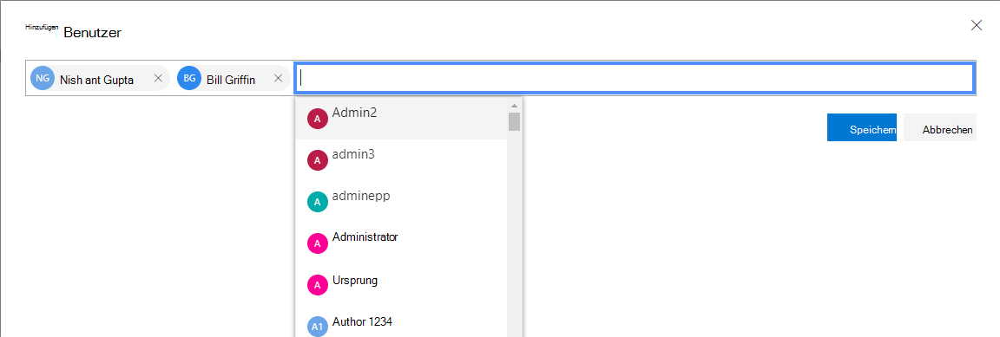
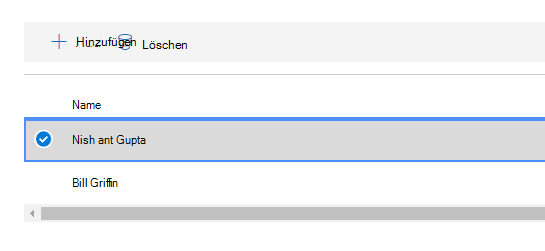
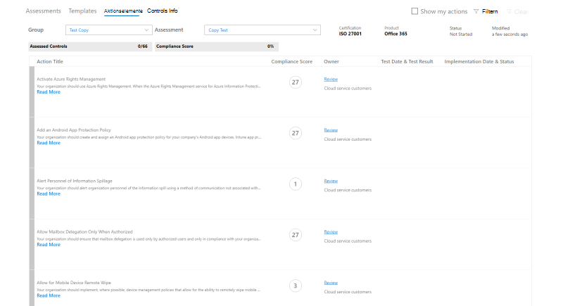
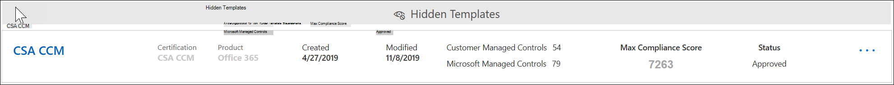
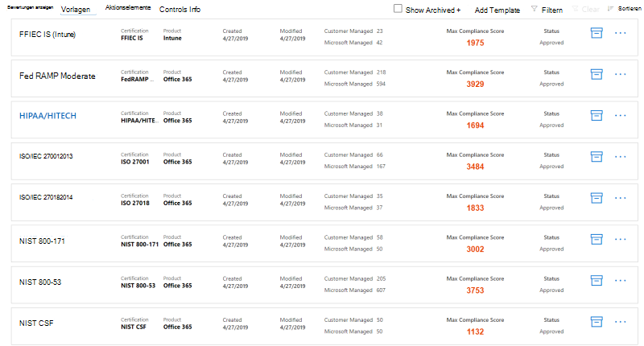

# Arbeiten mit dem Microsoft Compliance-Manager (Vorschau)

> [!IMPORTANT]
> Microsoft Compliance Manager ist ein Dashboard und Verwaltungstool, das eine Zusammenfassung Ihrer Datenschutz-und Compliance-Größe sowie Empfehlungen zur Verbesserung des Datenschutzes und der Compliance bietet. Die im Compliance-Manager bereitgestellten Kundenaktionen sind Empfehlungen. Es liegt in Ihrer Organisation, die Wirksamkeit dieser Empfehlungen in ihrem jeweiligen regulatorischen Umfeld vor der Implementierung zu bewerten. Empfehlungen aus dem Compliance-Manager sollten nicht als eine Garantie für Compliance interpretiert werden.

## Zugriff auf Compliance-Manager

Auf den Compliance-Manager kann über das Microsoft-Dienst Vertrauensstellungs Portal zugegriffen werden. Jeder Benutzer mit einem Microsoft-Konto oder einem Azure Active Directory-organisationskonto kann auf den Compliance-Manager zugreifen.

1. Wechseln Sie zu [https://servicetrust.microsoft.com/ComplianceManager/V3](https://servicetrust.microsoft.com/ComplianceManager/V3).

2. Melden Sie sich mit Ihrem Microsoft-Dienstkonto an, bei dem es sich um das Benutzerkonto Office 365, Microsoft 365 oder Azure Active Directory (Azure AD) handelt.

> [!NOTE]
> Wählen Sie im Dienst Vertrauensstellungs Portal **Compliance-Manager**aus, bei dem es sich um die Vorschauversion mit den neuesten Features handelt. Wählen Sie **Compliance-Manager (klassisch)** nicht aus, der die Features der früh Version enthält, die in dieser Dokumentation nicht behandelt werden.

## Verwaltung

Es gibt bestimmte administrative Funktionen, die nur für den globalen Administrator verfügbar sind und nur sichtbar sind, wenn Sie mit einem globalen Administratorkonto angemeldet sind. Der globale Administrator kann Benutzerberechtigungen zuweisen und automatische Bewertungen für sicheres Ergebnis aktivieren.
  
### Zuweisen von Compliance-Manager-Rollen zu Benutzern

Sobald der Administrator anderen Benutzern Compliance-Manager-Rollen zuweist, können diese Benutzerdaten im Compliance-Manager anzeigen und Aktionen durchführen, die von ihrer Rolle bestimmt werden. Der Administrator kann dem Compliance-Manager auch schreibgeschützten Zugriff erteilen, indem er dem Benutzer die [globale Leserrolle in Azure Active Directory (Azure AD)](https://docs.microsoft.com/azure/active-directory/users-groups-roles/directory-assign-admin-roles#global-reader)zugewiesen.

Jede Compliance-Manager-Rolle verfügt über geringfügig unterschiedliche Berechtigungen. Sie können die jeder Rolle zugewiesenen Berechtigungen anzeigen, ermitteln, welche Benutzer sich in welchen Rollen befinden, und Benutzer aus dieser Rolle über das Dienst Vertrauensstellungs Portal hinzufügen oder entfernen. Wählen Sie das Menüelement **Admin** aus, und wählen Sie die anzuzeigenden **Einstellungen** aus.
  

  
Hinzufügen oder Entfernen von Benutzern aus Compliance-Manager-Rollen
  
1. Wechseln Sie zu [https://servicetrust.microsoft.com](https://servicetrust.microsoft.com).

2. Melden Sie sich mit Ihrem globalen Azure Active Directory-Administratorkonto an.

3. Wählen Sie in der oberen Menüleiste des Dienst Vertrauensstellungs Portals die Option **Administrator** aus, und wählen Sie dann **Einstellungen**aus.

4. Wählen Sie in der Dropdownliste **Rolle auswählen** die Rolle aus, die Sie verwalten möchten.

5. Benutzer, die den einzelnen Rollen hinzugefügt wurden, werden auf der Seite **Rolle auswählen** aufgeführt.

6. Um Benutzer zu dieser Rolle hinzuzufügen, wählen Sie **Hinzufügen**aus. Wählen Sie im Dialogfeld **Benutzer hinzufügen** das Feld Benutzer aus. Sie können in der Liste der verfügbaren Benutzer einen Bildlauf durchführen oder mit der Eingabe des Benutzernamens beginnen, um die Liste basierend auf Ihrem Suchbegriff zu filtern. Wählen Sie den Benutzer aus, der dieses Konto der mit dieser Rolle bereitgestellten Liste **Benutzer** hinzufügen hinzugefügt werden soll. Wenn Sie mehrere Benutzer gleichzeitig hinzufügen möchten, beginnen Sie mit der Eingabe eines Benutzernamens, um die Liste zu filtern, und wählen Sie dann den Benutzer aus, der der Liste hinzugefügt werden soll. Wählen Sie **Speichern** aus, um die ausgewählte Rolle für diese Benutzer festzustellen. 

    
  
7. Wenn Sie Benutzer aus dieser Rolle entfernen möchten, wählen Sie die Benutzer aus, und klicken Sie dann auf **Löschen**.

    

### Steuern automatischer Bewertungen für sichere Gäste

Updates für sichere Bewertungen können für alle Aktionen automatisch aktiviert, für alle Aktionen deaktiviert oder durch eine einzelne Aktion durch Ausführen der folgenden Schritte festgelegt werden.

1. Melden Sie sich mit ihrem globalen Administratorkonto beim [Dienst Vertrauensstellungs Portal](https://servicetrust.microsoft.com) an.

2. Wählen Sie in der oberen Menüleiste des Dienst Vertrauensstellungs Portals unter **Weitere**die Option **Administrator** aus, und wählen Sie dann **Einstellungen**aus.

3. Wählen Sie auf der Registerkarte **sichere Punktzahl** die entsprechende Schaltfläche aus, um **für alle Aktionen**aktiviert, **für alle Aktionen**oder **pro Aktion festlegen** zu deaktivieren.

Wenn Sie die Option **pro Aktion festlegen auswählen,** führen Sie die folgenden zusätzlichen Schritte aus, um für einzelne Aktionen sichere Bewertungs Aktualisierungen zu aktivieren:

4. Wählen Sie im oberen Menü den Eintrag **Compliance-Manager** aus (Hinweis: Wählen Sie nicht "Compliance-Manager (klassisch)") aus.

5. Wählen Sie in der oberen rechten Ecke des Bildschirms **Mandantenverwaltung** aus.

6. Suchen Sie im Bereich **Kundenaktionen** die gewünschte Aktion mit einem Auslassungszeichen (**..**.) unter der Spalte **betroffene Aktionen** . Klicken Sie auf die Ellipsen, und wählen Sie **Bearbeiten aus.**

7. Wechseln Sie zur Option **Secure Score Continuous Update** Toggle to **on.**

8. Wählen Sie **Speichern aus.** Secure Score die kontinuierliche Überwachung ist nun für diese Aktion aktiviert.

**Hinweis:** Nur der globale Administrator kann automatische Updates für alle Aktionen aktivieren oder deaktivieren. Der Compliance-Manager-Administrator kann automatische Updates für einzelne Aktionen aktivieren, jedoch nicht für alle Aktionen Global.

## Gruppen

Gruppen sind Container, die es Ihnen ermöglichen, Bewertungen zu organisieren und allgemeine Informations-und Workflowaufgaben Zwischenbewertungen mit denselben oder Verwandten, vom Kunden verwalteten Steuerelementen freizugeben.

Sie können Bewertungen auf eine Weise gruppieren, die für Sie logisch ist, beispielsweise nach Jahr, Standard, Dienst oder basierend auf den Teams, Abteilungen oder Geographien Ihrer Organisation. Im folgenden finden Sie Beispiele aus zwei Gruppen und deren zugrunde liegenden Bewertungen:
  
- **FFIEC ist Assessments 2020**
  - Office 365 + FFIEC ist
  - InTune + FFIEC ist
- **Datenschutzbewertungen**
  - Office 365 + ISO 27001:2013
  - Office 365 + ISO 27018:2014

> [!NOTE]
> Es wird empfohlen, eine Gruppierungs Strategie für Ihre Organisation zu ermitteln, *bevor* Sie neue Bewertungen hinzufügen.

Um Ihnen den Einstieg zu erleichtern, ist eine **Standard** Gruppe eingerichtet, die die Datenschutz Basislinie enthält. Dieser Basisplan ist eine Gruppe von Steuerelementen, die allgemeine Branchenvorschriften und-Standards enthält ([Weitere Informationen](compliance-score-methodology.md#initial-score-based-on-microsoft-365-data-protection-baseline)).

### Vorgehensweise Erstellen einer Gruppe

Gruppen können nicht als eigenständige Entitäten erstellt werden. Eine Gruppe muss immer mindestens eine Bewertung enthalten, um eine Gruppe zu erstellen, müssen Sie zunächst eine Bewertung erstellen, die in der Gruppe platziert werden soll.

Führen Sie die folgenden Schritte aus, um eine Gruppe zu erstellen:

1. Erstellen Sie eine neue Bewertung, indem Sie am oberen Rand des Dashboards **+ Assessment hinzufügen** auswählen.
2. Geben Sie im Bereich " **Bewertungs** Flyout" einen Titel für Ihre Bewertung ein, und wählen Sie im Dropdownmenü eine Vorlage aus.
3. Wenn Sie **eine Gruppe auswählen oder eine neue Gruppe hinzufügen**möchten, wählen Sie **neue Gruppe hinzufügen** aus, und geben Sie Ihren Gruppennamen in das Feld unten ein.
4. Wenn Sie Informationen aus einer vorhandenen Gruppe kopieren möchten, aktivieren Sie die Option **möchten Sie die Daten aus einer vorhandenen Gruppe kopieren?** **.** Wählen Sie im Dropdownmenü darunter die Gruppe aus, die Sie kopieren möchten, und aktivieren Sie die Kontrollkästchen aller Felder, die Sie in die neue Bewertung in ihrer neuen Gruppe übertragen möchten.
5. Wählen Sie **Speichern**. Wenn dieser Vorgang abgeschlossen ist, wird der Flyout-Bereich geschlossen, und ihre neue Gruppe wird auf dem Dashboard angezeigt.

Was Sie beim Arbeiten mit Gruppen wissen sollten:
  
- Gruppennamen (auch *Gruppen-IDs*genannt) müssen innerhalb Ihrer Organisation eindeutig sein.
- Gruppen haben keine Sicherheitseigenschaften. Alle Berechtigungen sind Assessments zugeordnet.
- Nachdem Sie eine Bewertung zu einer Gruppe hinzugefügt haben, kann die Gruppierung nicht mehr geändert werden. Sie können die Bewertungsgruppe umbenennen, die den Namen der Bewertungs Gruppierung für alle dieser Gruppe zugeordneten Bewertungen ändert.
- Zugehörige bewertungssteuerelemente in unterschiedlichen Bewertungen innerhalb derselben Gruppe werden automatisch aktualisiert, wenn Sie abgeschlossen werden.
- Wenn Sie einer vorhandenen Gruppe eine neue Bewertung hinzufügen, werden allgemeine Informationen aus Bewertungen in dieser Gruppe in die neue Bewertung kopiert.
- Gruppen können Bewertungen für dieselbe Zertifizierung oder Regel enthalten, aber jede Gruppe kann nur eine Bewertung für ein bestimmtes Produkt-Zertifizierungs Paar enthalten. Beispielsweise kann eine Gruppe keine zwei Bewertungen für Office 365 und das NIST-GfK enthalten. Eine Gruppe kann mehrere Bewertungen für dasselbe Produkt nur dann enthalten, wenn die entsprechende Zertifizierung oder Regulierung für jede andere unterschiedlich ist.
- Durch das Ausblenden einer Bewertung wird die Beziehung zwischen dieser Bewertung und der Gruppe unterbrochen. Weitere Aktualisierungen anderer verwandter Bewertungen werden nicht mehr in der ausgeblendeten Bewertung wiedergegeben. ([Hier erfahren Sie, wie Sie Bewertungen ausblenden.](#hide-a-template-or-an-assessment))
- Gruppen können nicht gelöscht werden.
- Wenn eine Änderung an einem Aktionselement vorgenommen wird, das in mehreren Gruppen angezeigt wird, wird diese Änderung in allen Instanzen dieses Aktionselements wiedergegeben.

## Mandantenverwaltung von Dimensionen, Besitzern, & Kundenaktionen

Mit der **Mandanten Verwaltungs** Schnittstelle können Sie diese organisationsweiten Einstellungen verwalten:

- **Dimensionen:** Zeigen Sie Metadaten für Vorlagen, BEWERTUNGEN und Aktionselemente an, mit denen Sie benutzerdefinierte Pivots für Filter erstellen können.
- **Besitzer:** Füllen Sie eine Liste der verantwortlichen Parteien auf, die Aktionen zugeordnet werden können.
- **Aktionen für Kunden:** Verwalten Sie die vollständige Liste der Aktionen, die in Compliance-Manager (Preview) enthalten sind, und aktivieren/deaktivieren Sie die Secure Score-Überwachung für Aktionen, die mit Secure Score integriert sind.

Wählen Sie in der oberen rechten Ecke des Bildschirms die Option **Mandantenverwaltung** aus, um die Verwaltungsoberfläche zu öffnen, und führen Sie die folgenden Schritte aus, um **Dimensionen**, **Besitzer**und **Kundenaktionen**zu verwalten.

### Maße

Dimensionen sind Satz von Metadaten, die Informationen zu einer Vorlage, einer Bewertung oder einem Aktionselement bereitstellen. Dimensionen verwenden das Konzept von Schlüsseln und Werten, wobei der Dimensionsschlüssel eine Eigenschaft darstellt, und Dimensionswert gültige Werte für die Eigenschaft darstellt. Beispielsweise gibt es im Compliance-Manager drei Arten von Aktionen. Sie werden durch einen Dimensionsschlüssel von **Aktions Zweck** und Dimensionswerten von **vorbeugenden**, **detektivischen**und **korrigier**enden definiert.

### Besitzer

Besitzer werden verwendet, um die Person zu identifizieren, die für jedes Steuerelement zuständig ist. Alle integrierten Steuerelemente befinden sich im Besitz von Microsoft, von Kunden oder von beiden. Sie können benutzerdefinierte Werte für Besitzer erstellen, die verwendet werden können, um mehr granulare Zuständigkeiten innerhalb Ihrer Organisation anzugeben. Sie können beispielsweise Besitzer erstellen, die bestimmte Gruppen, Teams oder Unternehmenseinheiten in Ihrer Organisation darstellen.

#### Hinzufügen eines Besitzers

1. Öffnen Sie die **Mandantenverwaltung** , und wählen Sie **Besitzer**aus.
2. Wählen Sie **+ Besitzer hinzufügen**aus.
3. Geben Sie einen Namen und eine Beschreibung für den Besitzer an, und wählen Sie **Speichern**aus. Die Beschreibung wird in der Spalte Besitzer angezeigt.

#### Bearbeiten eines Besitzers

Ein Besitzername kann nicht bearbeitet werden, aber Sie können die Beschreibung ändern, die in der Spalte Besitzer angezeigt wird.

1. Öffnen Sie die **Mandantenverwaltung** , und wählen Sie **Besitzer**aus.
2. Suchen Sie den Besitzer, den Sie bearbeiten möchten, wählen Sie daneben die Auslassungspunkte (...) aus, und klicken Sie dann auf **Bearbeiten**.
3. Ändern Sie die Beschreibung nach Bedarf, und wählen Sie **Speichern**aus.

#### Löschen eines Besitzers

1. Öffnen Sie die **Mandantenverwaltung** , und wählen Sie **Besitzer**aus.
2. Suchen Sie den Besitzer, den Sie löschen möchten, wählen Sie daneben die Auslassungspunkte (...) aus, und wählen Sie dann **Löschen**aus.
3. Wenn die Bestätigungsmeldung angezeigt wird, wählen Sie **Löschen**aus.

### Kundenaktionen

Im Bereich Kundenaktionen werden alle Kundenaktionen für alle Vorlagen und Bewertungen im Compliance-Manager (Preview) angezeigt.

Auf einen Blick können Sie den Titel, den Besitzer, die Kategorie, die Erzwingung und das Ergebnis einer Aktion anzeigen und ermitteln, ob Sie mit Secure Score integriert ist. Sie können eine Aktion erweitern und dann **Read More** auswählen, um die Beschreibung der Aktion zu lesen und auf Links in der Beschreibung zuzugreifen. Sie können diese Schnittstelle auch verwenden, um die sichere Ergebnis Integration auf Aktionsbasis zu aktivieren und zu deaktivieren und benutzerdefinierte Aktionen hinzuzufügen. Aktionen mit einer Secure Score-Integrationsfunktion haben neben Ihnen ein Auslassungszeichen (...) (Beachten Sie, dass in benutzerdefinierten Aktionen neben Ihnen auch ein Auslassungszeichen steht).

#### Aktivieren oder Deaktivieren der Integration sicherer Bewertungen

1. Wählen Sie die Auslassungspunkte (...) für die Aktion aus, die Sie ändern möchten, und wählen Sie **Bearbeiten**aus.
2. Wechseln Sie zur Option Secure Score Continuous Update auf ein oder aus, um die kontinuierliche Überwachung mithilfe von Secure Score zu aktivieren oder zu deaktivieren.
3. Wählen Sie **Speichern**.

Wenn Organisationen zunächst Microsoft 365 oder Office 365 bereitstellen, dauert es ungefähr sieben Tage, bis Secure Score Daten vollständig erfasst und Sie in Ihrer Partitur berücksichtigt. Während dieser Zeit wird durch das Festlegen der Option für die kontinuierliche Aktualisierung sicherer Bewertungen auf **aus** und das manuelle Festlegen einer Aktion auf **implementiert** festgesetzt, dass diese Aktion zur Partitur zählt. Nach den anfänglichen sieben Tagen wird durch das Drehen von Secure Score Continuous Update wieder eine kontinuierliche Überwachung von diesem Punkt aus aktiviert.

Alle Aktionen, die nicht von der Integration von Secure Score unterstützt werden, können manuell implementiert werden. Durch eine manuelle Implementierung wird die Bewertung für die Gruppe dieser Aktion berücksichtigt.

## Bewertungen

In diesem Abschnitt wird erläutert, wie Sie Ihre Bewertungen anzeigen und arbeiten, einschließlich der Vorgehensweise zum Hinzufügen neuer, exportieren, Kopieren von Informationen aus vorhandenen Bewertungen und aufrecht erhalten der Aktualisierung durch die Versionsverwaltung.

### Anzeigen von Bewertungs-und Aktionsdetails
  
Wählen Sie im Dashboard **Assessments** den Bewertungs Namen aus, um ihn zu öffnen, und zeigen Sie die Informationen zu Aktionselementen und Steuerelementen an.

Hier ist ein Beispiel für die Bewertung für Office 365 und ISO 27001. Die erste Ansicht zeigt die neue Ansicht "Aktionselemente" im Compliance-Manager (Preview).

Die Aktionen werden in alphabetischer Reihenfolge aufgeführt, und jeder Aktion wird ein Ergebnis und ein Besitzer zugewiesen. Klicken Sie auf den Link **Read More** , um die Details der einzelnen Aktionen zu lesen.

Wählen Sie den Link **überprüfen** aus, um die Aktion zu verwalten, zuzuweisen, zu implementieren und zu testen. Unten sehen Sie eine Beispielaktion.

Verwenden Sie die folgenden Felder, um den Aktions Workflow zu verwalten:

- **Benutzer zuweisen:** Wählen Sie dieses Feld aus, um den Benutzer auszuwählen oder einzugeben, dem diese Aktion zugewiesen werden soll. Sie können in der Liste einen Bildlauf durchführen oder einen Namen eingeben, um ihn zu finden, und dann auswählen.
- **Dokumente verwalten:** Sie können einen Nachweis über die Implementierung in Form von Office-Dokumenten, Bilddateien und Screenshots, PowerShell-Ausgaben in CSV oder txt und PDFs hochladen.
- **Implementierungs Status:** Wird verwendet, um den aktuellen Implementierungsstatus der Aktion anzugeben. Mögliche Werte sind nicht implementiert, implementiert, alternative Implementierung, geplant und nicht im Bereich.
- **Implementierungsdatum:** Das Datum, an dem die Aktion ausgeführt wurde.
- **Test Ergebnis:** Wird verwendet, um die Ergebnisse der Implementierungs Überprüfung anzugeben. Mögliche Werte werden nicht bewertet, übergeben, fehlgeschlagen – niedriges Risiko, Fehler – mittleres Risiko, Fehler – hohes Risiko und nicht im Bereich.
- **Test Datum:** Das Datum, an dem die Überprüfung stattgefunden hat.
- **Anmerkungen zur Implementierung:** Geben Sie Implementierungsdetails für Ihre Organisation sowie alle Notizen ein, die Sie einschließen möchten.
- **Testplan:** Geben Sie die Details des Testplans für diese Aktion sowie alle Notizen ein, die Sie einschließen möchten.
- **Zusätzliche Informationen:** Geben Sie zusätzliche Informationen zu dieser Aktion oder deren Implementierung in Ihrer Organisation sowie alle Notizen ein, die Sie einschließen möchten.

Im Dashboard für **Steuerelemente** können Sie Informationen zu Steuerelementen auf der Ebene der Bewertung und Vorlage anzeigen. Unten sehen Sie ein Beispiel für das Steuerelement-Info-Dashboard für Bewertungen.

Für Bewertungen zeigt das Dashboard für Steuerelemente Informationen die folgenden Informationen an:

- Eine **Gruppen** -Dropdownliste zum Auswählen der anzuzeigenden Gruppe (wenn mehrere Gruppen verwendet werden).
- Eine **Bewertungs** Dropdownliste zur Auswahl der anzuzeigenden Bewertung.
- Metadaten zur ausgewählten Bewertung, einschließlich:
    - Eine Statusanzeige für **bewertete Steuer** Elemente, die die Anzahl der beurteilten Steuerelemente über die Gesamtzahl der Steuerelemente angibt.
    - Die aktuelle **Konformitäts** Bewertung für die Bewertung wird als Prozentsatz angezeigt.
    - Details zur **Zertifizierung** und dem **Produkt** , die bei der Bewertung verwendet werden.
    - Der aktuelle **Status** und das Datum der letzten **Änderung** für die Bewertung.
- Eine Liste der **in-Bereichs Dienste** für die Bewertung.
- Details zu den Steuerelementen, gruppiert nach Steuerelement Familie, mit Links zu Kundenaktionen und Details zur Microsoft-Implementierung:
    - **Ihre Aktionen** zeigt die Kundenaktionen an, die Sie ausführen können, um einige oder alle Anforderungen des Steuerelements zu erfüllen. Vielen Steuerelementen sind mehrere Aktionen zugeordnet, und alle einem Steuerelement zugeordneten Aktionen werden hier angezeigt. Die hier aufgeführten Aktionen weisen dieselbe Benutzeroberfläche auf wie die im Dashboard Aktionen.
    - **Microsoft-Aktionen** zeigt die Liste der Steuerelemente aus dem internen Microsoft-Framework an, die für das ausgewählte Zertifizierungs Steuerelement gelten. Wählen Sie für jedes interne Steuerelement **implementiert** aus, um die Implementierungs-und Testdetails von Microsoft sowie das Testergebnis und das Test Datum anzuzeigen, wie unten dargestellt.

### Hinzufügen eines Assessments
  
1. Wählen Sie im Dashboard Assessments die Option **+ Assessment hinzufügen**aus.

2. Wenn das Blade geöffnet wird, geben Sie die folgenden Informationen ein:

    - **Title (erforderlich):** Geben Sie einen Titel für Ihre Bewertung ein.
    - **Wählen Sie eine Vorlage aus (erforderlich):** Auswählen einer Standard-oder benutzerdefinierten Vorlage
    - **Wählen Sie eine Gruppe aus, oder fügen Sie eine neue Gruppe hinzu (erforderlich):** Wählen Sie eine vorhandene Gruppe aus, oder wählen Sie aus, um eine neue Gruppe hinzuzufügen, und geben Sie einen eindeutigen Gruppennamen an.
    - Möchten **Sie die Daten aus einer vorhandenen Gruppe kopieren? (optional):** Umschalten des Steuerelements zum Aktivieren der Gruppen Kopie und dann:
        - **Wählen Sie eine Gruppe aus (optional):** Wenn die Gruppen Kopie aktiviert ist, wählen Sie die Gruppe aus, aus der kopiert werden soll.
            - **Implementierungs Details (optional):** Auswählen, um Implementierungsdetails in die neue Gruppe zu kopieren
            - **Testplan & zusätzliche Informationen (optional):** Wählen Sie diese Option aus, um den Testplan und weitere Informationsdetails in die neue Gruppe zu kopieren.
            - **Dokumente (optional):** Auswählen, um Dokumente in die neue Gruppe zu kopieren

3. Wählen Sie **Speichern** aus, um die Bewertung zu erstellen.

 Die neue Bewertung wird im Assessment-Dashboard angezeigt und zeigt die folgenden Informationen an:

- Der Titel der Bewertung.
- Die Dimensionen der Bewertung, einschließlich Zertifizierung, Umgebung und Produkt, die auf die Bewertung angewendet wurden.
- Das Datum, an dem es erstellt wurde, und das Datum, an dem es zuletzt geändert wurde.
- Das Bewertungsergebnis wird als Prozentsatz angezeigt. Diese Bewertung enthält automatisch Ihre Ergebnisse aus von Microsoft verwalteten Steuerelementen und aus sicherer Bewertung.
- Fortschrittsindikatoren, die die Anzahl der beurteilten von Microsoft verwalteten und von Kunden verwalteten Steuerelemente anzeigen.

### Kopieren von Informationen aus vorhandenen Bewertungen

Wenn Sie eine Bewertung erstellen, haben Sie die Möglichkeit, Informationen aus einer vorhandenen Gruppe zu kopieren. Durch kopieren können Sie die in die kopierte Bewertung eingegebenen Informationen auf dieselben Steuerelemente in der neuen Bewertung anwenden. Wenn Sie beispielsweise eine Gruppe für alle FFIEC-bezogenen Bewertungen in Ihrer Organisation haben, können Sie die folgenden Informationen aus vorhandenen Bewertungen kopieren:

- Implementierungs Details
- Testplan & zusätzliche Informationen
- Dokumente

#### Kopieren von Informationen aus einer vorhandenen Bewertung in eine neue Bewertung
  
1. Wählen Sie im Assessment-Dashboard die Option **+ Add Assessment**aus.
    
2. Füllen Sie im Fenster **Bewertung hinzufügen** die folgenden Informationen aus.

    - **Title (erforderlich):** Geben Sie einen Titel für Ihre Bewertung ein.
    - **Wählen Sie eine Vorlage aus (erforderlich):** Wählen Sie eine Standard-oder benutzerdefinierte Vorlage aus.
    - **Wählen Sie eine Gruppe aus, oder fügen Sie eine neue Gruppe hinzu (erforderlich):** Wählen Sie **neue Gruppe hinzufügen** aus, und geben Sie einen eindeutigen Gruppennamen an.
    - Möchten **Sie die Daten aus einer vorhandenen Gruppe kopieren? (optional):** schalten Sie das Steuerelement in ein ein, um die Gruppen Kopie zu aktivieren, und klicken Sie dann auf:- **Wählen Sie eine Gruppe aus (optional):** wenn Gruppen Kopie aktiviert ist, wählen Sie die Gruppe aus, aus der kopiert werden soll.
            - **Implementierungs Details (optional):** Wählen Sie diese Option aus, um Implementierungsdetails in die neue Gruppe zu kopieren.
            - **Testplan & zusätzliche Informationen (optional):** Wählen Sie diese Option aus, um den Testplan und weitere Informationsdetails in die neue Gruppe zu kopieren.
            - **Dokumente (optional):** Wählen Sie diese Option aus, um Dokumente in die neue Gruppe zu kopieren.

3. Wählen Sie **Speichern** aus, um die Bewertung zu erstellen.

### Benachrichtigungen zur Versionsverwaltung für Bewertungs Aktualisierungen

Wenn ein Update für eine Bewertung zur Verfügung steht, werden Sie in einem Warnungssymbol darüber informiert, dass ein Update bereit ist. Wenn Sie auf dieses Symbol klicken, wird das Update in einem Popupfenster erläutert, und Sie werden aufgefordert, diese zu akzeptieren. Unten sehen Sie ein Beispiel für die Versions Verwaltungs Warnung für eine Bewertung:

Wenn Sie das Warnsymbol auswählen, wird ein Flyout-Bereich angezeigt, in dem das Update erläutert wird, und Sie werden aufgefordert, Folgendes anzunehmen

Es wird dringend empfohlen, alle Updates zu akzeptieren, wenn Sie Update Benachrichtigungen erhalten.

### Exportieren einer Bewertung

Sie können eine Bewertung in eine Excel-Datei für Compliance-Beteiligte in Ihrer Organisation oder für externe Prüfer und Regulierer exportieren. Der Bericht ist eine Momentaufnahme der Bewertung ab dem Datum und der Uhrzeit der Erstellung des Berichts. Der Bericht enthält die Details für alle von Microsoft und vom Kunden verwalteten Steuerelemente für die Bewertung, den Status der Implementierung, das Kontrolltest Datum, Testergebnisse und stellt Links zu hochgeladenen Beweisdokumenten bereit.
  
### Exportieren eines Bewertungsberichts
  
1. Wählen Sie im Compliance-Manager-Dashboard die Registerkarte **Steuerelemente Info** aus.
2. Wählen Sie die **Gruppe** und die **Bewertung** in den Dropdownmenüs für die Bewertung aus, die Sie exportieren möchten.
3. Klicken Sie auf die Schaltfläche **exportieren** .

Der Bewertungsbericht wird als Excel-Datei in ihrer Browsersitzung heruntergeladen. Der Name der Datei für die Excel-Datei ist standardmäßig der Titel der Bewertung.

### Ausblenden einer Vorlage oder einer Bewertung

Wenn Sie mit einer Vorlage oder Bewertung fertig sind und Sie nicht mehr für Compliance-Zwecke benötigen, können Sie Sie aus ihrer Ansicht ausblenden. Wenn eine Vorlage oder Bewertung ausgeblendet ist, wird Sie aus der Standardansicht entfernt, und Sie müssen das Kontrollkästchen **ausgeblendet einschließen** aktivieren, um es anzuzeigen.

> [!IMPORTANT]
> Ausgeblendete Bewertungen behalten Ihre Links zu hochgeladenen Beweisdokumenten nicht bei. Es wird dringend empfohlen, dass Sie eine Bewertung vor dem ausblenden exportieren, um Links zu Beweisdokumenten im Bericht beizubehalten.
  
#### Ausblenden einer Vorlage

1. Öffnen Sie das Dashboard **Vorlagen** .
2. Suchen Sie die Vorlage, die Sie ausblenden möchten, und wählen Sie auf den Ellipsen in der Zeile **Ausblenden**aus.
3. Wenn die Bestätigungsmeldung angezeigt wird, wählen Sie **Ausblenden**aus.

#### Ausblenden einer Bewertung

1. Öffnen Sie das Dashboard **Assessments** .
2. Wählen Sie die **Gruppe** aus der Dropdownliste aus, die die Bewertung enthält, die Sie ausblenden möchten.
3. Suchen Sie nach der Bewertung, die Sie ausblenden möchten, und wählen Sie in den Ellipsen die Option **Ausblenden**aus.
4. Wenn die Bestätigungsmeldung angezeigt wird, wählen Sie **Ausblenden**aus.

#### Ausgeblendete Bewertungen anzeigen
  
1. Öffnen Sie die Registerkarte **Assessments** Dashboard, und aktivieren Sie das Kontrollkästchen **einschließen ausgeblendet** .
2. Die ausgeblendeten Bewertungen werden im Abschnitt **Ausgeblendete Bewertungen** angezeigt.

#### Einblenden eines Assessments

1. Aktivieren Sie auf der Registerkarte **Bewertungen** das Kontrollkästchen **ausgeblendet einschließen** .
2. Die ausgeblendeten Bewertungen werden im Abschnitt **Ausgeblendete Bewertungen** angezeigt.
3. Suchen Sie den zu unsichtbaren Test, und wählen Sie bei den Ellipsen die Option **Einblenden**aus.
4. Wenn die Bestätigungsmeldung angezeigt wird, wählen Sie **Einblenden**aus.

## Steuerelemente und Aktionen

Steuerelemente und Aktionen sind die primären Daten Pivots, die in Compliance-Manager (Preview) verwendet werden. Der in früheren Versionen von Compliance-Manager vorhandene Steuerelement-Pivot wurde erweitert, um die Microsoft-und Kunden Steuerelemente in denselben Steuerelementfamilien anzuzeigen. Diese konsolidierte Ansicht erleichtert das Anzeigen des vollständigen Modells für die gemeinsame Verantwortung pro Steuerelement. Der Aktions Pivot ist neu im Compliance-Manager (Preview) und soll eine optimierte Übersicht über alle von Microsoft empfohlenen Aktionen bieten.

### Steuerelemente

Steuerelemente können im Steuerelement-Info-Dashboard angezeigt werden. Steuerelemente stellen die Anforderungen aus Standard, Zertifizierung, Regulierung oder Framework dar. Um diese Anforderungen über mehrere Standards, Verordnungen usw. hinweg zuzuordnen und Aktionen zuzuordnen, wird alles so behandelt, als ob es sich um ein Steuerungsframework handeln würde. Beispielsweise sind wie ein Steuerelement Framework Regeln wie HIPAA nach Abschnitt aufgeschlüsselt worden, und die HIPAA-Steuerelemente im Compliance-Manager verwenden dasselbe Nummernschema wie in den folgenden Abschnitten dargestellt:

Es gibt drei Arten von Steuerelementen:

1. Von **Microsoft verwaltete Steuerelemente:** Dies sind Steuerelemente, für die nur Microsoft zuständig ist. Sie werden in den in-Box-Vorlagen angezeigt und werden dem Compliance-Manager von Microsoft hinzugefügt.
2. Vom **Kunden verwaltete Steuerelemente:** Dies sind Steuerelemente, für die nur Kunden verantwortlich sind. Sie werden in den in-Box-Vorlagen angezeigt und werden dem Compliance-Manager von Kunden hinzugefügt.
3. **Gemeinsame Verwaltungssteuerelemente:** Dies sind Steuerelemente, bei denen die Verantwortung von Microsoft und dem Kunden freigegeben wird. Diese werden in den in-Box-Vorlagen angezeigt und werden dem Compliance-Manager von Microsoft hinzugefügt. Der Kunde kann auch von Microsoft verwaltete Steuerelemente bearbeiten oder deaktivieren.

### Aktionen Elemente

Aktionen Elemente sind die empfohlenen Aufgaben zum Implementieren der Anforderungen einer Norm oder einer Verordnung oder zum Testen, überprüfen und Dokumentieren der Implementierungsanforderungen Ihrer Organisation. Aktionen sind einem oder mehreren Steuerelementen zugeordnet. Jedem Steuerelement ist eine oder mehrere Aktionen zugeordnet, und jede Aktion kann einem oder mehreren Steuerelementen zugeordnet werden. Aktionen sind Teil des Haupt Workflows im Compliance-Manager (Preview), da es sich um Objekte handelt, die von Ihrer Organisation zugewiesen, verfolgt und überprüft werden.

#### Zuweisen von Aktionselementen
  
1. Wählen Sie im Dashboard **Aktionselemente** die **Gruppe** aus, die die Bewertung (en) enthält, deren Aktion Sie zuweisen möchten.
2. Wählen Sie in der Dropdownliste **Bewertung** die Bewertung aus, deren Aktion Sie zuweisen möchten, oder wählen Sie im Dropdownmenü **alle** Optionen aus, um alle verfügbaren Aktionen anzuzeigen.
3. Suchen Sie die Aktion, die Sie zuweisen möchten, und wählen Sie in der Spalte **Besitzer** den Link zur **Überprüfung**, * * implementiert oder **Test**aus.
4. Wählen Sie das Feld **Benutzer zuweisen** aus, und eine Liste der Benutzer in Ihrer Organisation wird angezeigt. Scrollen Sie in der Liste, und wählen Sie Benutzer oder Filtern Sie die Liste aus, um einen Benutzer auszuwählen, indem Sie den Namen des Benutzers eingeben.
5. Geben Sie im Feld Anmerkungen zur Implementierung alle Notizen ein, die Sie dem zugewiesenen Benutzer übermitteln möchten.
6. Wählen Sie **Speichern** aus, um die Aktion zuzuweisen.

#### Aktionselemente neu zuweisen

Mit dieser Funktion kann eine Organisation alle aktiven oder ausstehenden Abhängigkeiten des Benutzerkontos entfernen, indem eine Aktion einem neuen Benutzer zugewiesen wird.

1. Wählen Sie im Dashboard **Aktionselemente** die **Gruppe** mit den Bewertungen aus, deren Aktion Sie neu zuweisen möchten.
2. Wählen Sie im Dropdown-Menü **Bewertung** die Bewertung aus, deren Aktion Sie neu zuweisen möchten, oder wählen Sie **alle** in der Dropdownliste aus, um alle verfügbaren Aktionen anzuzeigen.
3. Suchen Sie nach der Aktion, die Sie neu zuweisen möchten, und wählen Sie in der Spalte **Besitzer** den Link zur **Überprüfung**, **Implementierung**oder **Test**aus.
4. Löschen Sie den vorhandenen Benutzer aus dem Feld **Benutzer zuweisen** , und wählen Sie entweder einen anderen Benutzer in der Liste der Benutzer aus, oder Filtern Sie die Liste, um einen Benutzer auszuwählen, indem Sie den Namen des Benutzers eingeben.
5. Geben Sie im Feld Anmerkungen zur Implementierung alle Notizen ein, die Sie dem Benutzer übermitteln möchten.
6. Wählen Sie **Speichern** aus, um die Aktion neu zuzuweisen.

#### Synchronisierungsstatus für allgemeine Aktionselemente in Gruppen

Wenn Ihre Organisation über mehrere Gruppen von Bewertungen verfügt, gibt es ein Verhalten technischer Aktionen (also Aktionen, die ihre gesamte Organisation betreffen). Doppelte Aktionen in mehreren Gruppen werden nun in einer einzigen Aktion kombiniert. Diese einzelne Aktion enthält alle hochgeladenen Notizen und Beweise aus zuvor duplizierten Versionen. Alle Änderungen, die an der Aktion in einer Gruppe oder Bewertung vorgenommen werden, werden in allen Instanzen dieser Aktion widergespiegelt. Die Felder " **Implementierungsstatus**", " **Implementierungsdatum**", " **Test Status**" und " **Test Datum** " zeigen die neuesten Aktualisierungen an.

## Vorlagen

Eine Vorlage ist das Basisobjekt im Compliance-Manager (Preview), das einem Produkt und einer Zertifizierung (beispielsweise Standard, Regulierung, Steuerelement Framework usw.) zugeordnet ist. Vorlagen können angezeigt und aus dem Dashboard **Vorlagen** hinzugefügt werden.

 
Das Dashboard zeigt jede Vorlage zusammen mit der Zertifizierung und dem Produkt, das der Vorlage zugeordnet ist, den Datumsangaben, an denen die Vorlage erstellt und zuletzt geändert wurde, die Anzahl der von Kunden und von Microsoft verwalteten Steuerelemente, die maximale Konformitätsbewertung für die Vorlage und den Status der Vorlage (beispielsweise genehmigt, ausstehende Genehmigung, importiert).

### Erstellen einer Vorlage

Es gibt drei Möglichkeiten zum Arbeiten mit Vorlagen zum Erstellen von Bewertungen:

1. Verwenden Sie eine der vorkonfigurierten Vorlagen, die von Microsoft bereitgestellt werden.
2. Passen Sie eine vorkonfigurierte Vorlage mit ihren eigenen Aktionen und Steuerelementen über den Erweiterungsprozess an.
3. Erstellen Sie Ihre eigene Vorlage, und importieren Sie Sie in Compliance-Manager.

#### Verwenden einer vorab konfigurierten Microsoft-Vorlage

Die vorkonfigurierten Vorlagen sind in Ihrem **Vorlagen** Dashboard verfügbar. Zeigt die aktuelle [Liste der Vorlagen an](compliance-manager-overview.md#templates), die jedes Mal aktualisiert wird, wenn eine neue Vorlage verfügbar ist.

#### Anpassen einer Vorlage über den Erweiterungsprozess

1. Öffnen Sie das Dashboard **Vorlagen** , und wählen Sie **+ Vorlage hinzufügen**aus.
2. Aktivieren Sie im Fenster Vorlagen-Flyout das Kontrollkästchen **Erweiterung aus globaler Vorlage erstellen** .
3. Wählen Sie die zu erweiternde Vorlage im Dropdownmenü aus.
4. Wenn Sie Ihre Vorlagendaten nicht bereits in Excel formatiert haben, wählen Sie den Link im Flyout-Bereich aus, um eine Excel-Datei herunterzuladen. Füllen Sie das Arbeitsblatt gemäß den folgenden Excel-Anweisungen in den [Vorlagendaten importieren](#import-template-data-with-excel) aus, und speichern Sie es auf Ihrem lokalen Laufwerk.
5. Importieren Sie Ihre benutzerdefinierten Vorlagendaten, indem **Sie auf Durchsuchen** klicken, um Ihre Excel-Datei hochzuladen.
6. Wählen Sie **zum Dashboard hinzufügen**aus. Daraufhin wird Ihre neue Vorlage Ihrem **Vorlagen** -Dashboard hinzugefügt.

#### Erstellen Sie Ihre eigene Vorlage, und importieren Sie Sie in Compliance-Manager.

1. Öffnen Sie das Dashboard **Vorlagen** , und wählen Sie **+ Vorlage hinzufügen**aus.
2. Wählen Sie im Fenster Vorlagen-Flyout die Option **neue Vorlage erstellen**aus.
3. Importieren Sie Ihre Vorlagendaten, indem Sie auf **Durchsuchen** klicken, um Ihre Excel-Datei mit den Daten hochzuladen (siehe [Importieren von Vorlagendaten mit Excel](#import-template-data-with-excel) unten).
4. Wählen Sie **zum Dashboard hinzufügen**aus. Daraufhin wird Ihre neue Vorlage Ihrem **Vorlagen** -Dashboard hinzugefügt.

#### Importieren von Vorlagendaten mit Excel

Um eine Vorlage zu ändern oder Ihre eigene Vorlage zu erstellen, verwenden Sie eine [Excel-Arbeitsmappe](https://go.microsoft.com/fwlink/?linkid=2124865) , um die erforderlichen Daten zu erfassen und in den Compliance-Manager hochzuladen. Diese Tabellen Kalkulations Vorlage hat ein bestimmtes Format und Schema, das verwendet werden muss, oder es wird nicht in den Compliance-Manager importiert.

> [!IMPORTANT]
> Wenn Sie zuvor oder angepasste Vorlagen im Compliance-Manager erstellt haben, **wurde dieser Prozess** im Rahmen der Version April 2020 von Compliance-Manager (Preview) aktualisiert. **Lesen Sie diesen Abschnitt sorgfältig durch.**

Das Arbeitsblatt enthält vier Registerkarten, von denen drei erforderlich sind:

1. Vorlage (erforderlich)
2. ControlFamily (erforderlich)
3. Aktionen (erforderlich)
4. Dimensionen (optional)

Ihre Arbeitsmappe **muss die Registerkarten in dieser Reihenfolge enthalten**, da andernfalls Ihre Daten nicht erfolgreich in eine Vorlage importiert werden.

##### Registerkarte "Vorlage"

Die Registerkarte **Vorlage** ist erforderlich. Die Informationen auf dieser Registerkarte bieten Metadaten zur Vorlage. Es gibt vier erforderliche Spalten. Die Spalten müssen die Reihenfolge auf dem Excel-Blatt beibehalten, wie unten aufgeführt. Sie können **nach** den vier Spalten eine eigene Spalte hinzufügen, um eigene Dimensionen bereitzustellen. Wenn Sie dies tun, müssen Sie Sie auf der Registerkarte **Dimensionen** mithilfe der [Anweisungen unten](#dimensions-tab)hinzufügen.

- **Title**: Dies ist der Titel für Ihre Vorlage, der eindeutig sein muss. Es kann keinen Namen mit einer anderen Vorlage im Compliance-Manager freigeben, unabhängig davon, ob es sich um eine bereits erstellte Vorlage oder eine vorkonfigurierte Vorlage handelt, die von Microsoft bereitgestellt wird.

- **Product**: Dies ist eine erforderliche Dimension. Listet das der Vorlage zugeordnete Produkt auf.

- **Zertifizierung**: Dies ist die Verordnung, die Sie für die Vorlage verwenden.

- **inScopeServices**: Dies sind die Dienste innerhalb des Produkts, die diese Bewertung anwendet (wenn Sie beispielsweise Office 365 als Produkt aufgeführt haben, kann Microsoft Teams ein in-Scope-Dienst sein). Sie können mehrere Dienste auflisten, die durch zwei Semikolons getrennt sind.

> [!NOTE]
> In Bezug auf Produkt und Zertifizierung: die Daten, die Sie in die **Produkt** -und **Zertifizierungs** Zellen einfügen, können nicht bearbeitet werden, nachdem Sie das Arbeitsblatt importiert haben, um eine Vorlage zu erstellen oder anzupassen. Außerdem kann eine Gruppe nicht zwei Bewertungen enthalten, die die gleiche **Produkt/Zertifizierungs** Kombination aufweisen. Sie können mehrere Vorlagen haben, die dieselbe Produkt/Zertifizierungs Kombination aufweisen.

##### Registerkarte "ControlFamily"

Die Registerkarte **ControlFamily** ist erforderlich.  Die erforderlichen Spalten auf dieser Registerkarte, die der in der Beispieltabelle angegebenen Reihenfolge folgen müssen, lauten wie folgt:

- **ControlName**: Dies ist der Steuerelementname aus der Zertifizierung, dem Standard oder der Verordnung, bei dem es sich normalerweise um einen Typ von ID handelt. Steuerelementnamen müssen innerhalb einer Vorlage eindeutig sein. Sie können nicht mehrere Steuerelemente mit dem gleichen Namen in der Kalkulationstabelle haben.

- **controlFamily**: Geben Sie ein Wort oder eine Phrase für die controlFamily an, die eine breite Gruppierung von Steuerelementen identifiziert. Ein controlFamily muss nicht eindeutig sein; Es kann in einer Tabellenkalkulation mehrmals aufgeführt werden. Dieselbe controlFamily kann auch in mehreren Vorlagen aufgeführt werden, obwohl Sie nicht miteinander verwandt sind. Jeder controlFamily muss mindestens einem Steuerelement zugeordnet werden.

- **controlTitle**: Geben Sie einen Titel für das Steuerelement an. Während es sich bei ControlName um einen Referenz Code handelt, handelt es sich bei dem Titel um ein Rich-Text-Format, das normalerweise in den Regeln angezeigt

- **controlDescription**: Geben Sie eine Beschreibung des Steuerelements an.

- **controlActionTitle**: Dies ist der Titel einer Aktion, die Sie mit diesem Steuerelement verknüpfen möchten. Sie können mehrere Aktionen hinzufügen, indem Sie durch zwei Semikolons ohne Leerzeichen voneinander getrennt werden. Jedes Steuerelement, das Sie auflisten, muss mindestens eine Aktion enthalten, und die Aktion muss vorhanden sein (was bedeutet, dass Sie eine Aktion auflisten können, die Sie auf der Registerkarte **Aktionen** desselben Arbeitsblatts auflisten, eine Aktion, die in einer anderen Vorlage vorhanden ist, oder eine Aktion, die von Microsoft erstellt wurde). Verschiedene Steuerelemente können auf dieselbe Aktion verweisen.

##### Registerkarte "Aktionen"

Die Registerkarte **Aktionen** ist erforderlich.  Sie kennzeichnet Aktionen ihrer Organisation und nicht die Aktionen von Microsoft, die bereits im Compliance-Manager vorhanden sind. Die erforderlichen Spalten für diese Registerkarte, die der in der Beispieltabelle angegebenen Reihenfolge folgen müssen, lauten wie folgt:

- **actionTitle**: Dies ist der Titel für Ihre Aktion und ist ein erforderliches Feld. Der von Ihnen bereitgestellte Titel muss eindeutig sein. **Wichtig**: Wenn Sie auf eine bereits vorhandene Aktion verweisen (beispielsweise in einer anderen Vorlage) und die zugehörigen Elemente in den nachfolgenden Spalten ändern, werden diese Änderungen an dieselbe Aktion in anderen Vorlagen weitergegeben.

- **implementationtype**: führen Sie in diesem Feld einen der drei folgenden Implementierungstypen auf:
    - **Operative** Aktionen, die von Personen und Prozessen implementiert werden, um die Vertraulichkeit, Integrität und Verfügbarkeit von Organisationssystemen, Ressourcen, Daten und Personal zu schützen (Beispiel: Sicherheitsbewusstsein und Schulung)
    - **Technische** Aktionen, die durch die Verwendung von Technologien und Mechanismen in den Hardware-, Software-oder Firmware-Komponenten des Informationssystems abgeschlossen wurden, um die Vertraulichkeit, Integrität und Verfügbarkeit von Organisationssystemen und Daten zu schützen (Beispiel: mehrstufige Authentifizierung)
    - **Dokumentation** – durch dokumentierte Richtlinien und Verfahren implementierte Aktionen zur Erstellung und Definition der erforderlichen Steuerelemente zum Schutz der Vertraulichkeit, Integrität und Verfügbarkeit von Organisationssystemen, Ressourcen, Daten und Personal (Beispiel: eine Informationssicherheitsrichtlinie)

- **actionScore**: Geben Sie in diesem Pflichtfeld einen numerischen Bewertungs Wert für Ihre Aktion an. Es muss eine ganze Zahl zwischen 1 und 99 sein; Er darf nicht 0, NULL oder leer sein. Je höher die Zahl, desto größer ist ihr Wert zur Verbesserung Ihrer Compliance-Haltung. Anleitungen finden Sie unter How Microsoft Scores its Controls:

- **actionDescriptionTitle**: Dies ist der Titel der Beschreibung und ist erforderlich. Mit diesem Beschreibungstitel können Sie dieselbe Aktion in mehreren Vorlagen ausführen und in jeder Vorlage eine andere Beschreibung anzeigen.  Dieses Feld hilft Ihnen zu erläutern, auf welche Vorlage die Beschreibung verweist. In den meisten Fällen können Sie den Namen der Vorlage, die Sie erstellen, in dieses Feld einfügen.

- **actionDescription**: Geben Sie eine Beschreibung der Aktion an. Sie können Formatierungen wie fett formatierten Text und Hyperlinks anwenden. Dieses Feld ist erforderlich.

- **Dimension-Aktion Zweck**: Dies ist ein optionales Feld. Wenn Sie diesen einschließen, muss die Kopfzeile das Präfix "Dimension-" enthalten. Alle Dimensionen, die Sie hier einschließen, werden als [Filter in der Kompatibilitätsbewertung](compliance-score-setup.md#filtering-your-dashboard-view) verwendet und auf der [Detailseite der Verbesserungs Aktionen im Kompatibilitäts Bewertungsergebnis](working-with-compliance-score.md#view-your-improvement-actions)angezeigt.

##### Registerkarte Dimensionen

Die Registerkarte **Dimensionen** ist optional. Wenn Sie jedoch anderweitig auf eine Dimension verweisen, müssen Sie Sie hier angeben, wenn Sie nicht in einer bereits erstellten oder in einer Microsoft-Vorlage vorhandenen Vorlage vorhanden ist. Die Spalten für diese Registerkarte sind unten aufgeführt:

- **dimensionKey**: als "Produkt", "Zertifizierungen", "Aktions Zweck" auflisten
- **dimensionvalue**: Beispiele: Office 365, HIPPA, vorbeugend, Detektiv

Sie können Ihre vorhandenen Dimensionen anzeigen, indem Sie zur **Mandantenverwaltung** wechseln und die Registerkarte **Dimensionen** auswählen. Auch wenn Sie eine vorhandene Vorlage exportieren, verfügt die exportierte Arbeitsmappe über die Registerkarte **Dimensionen** , in der alle in der Vorlage verwendeten Dimensionen aufgelistet werden.

### Ändern einer vorhandenen Vorlage

Um Änderungen an einer Vorlage vorzunehmen, die Sie mit dem oben beschriebenen Importvorgang erstellt oder angepasst haben, verwenden Sie denselben Prozess, um diese Änderungen in Ihre Vorlage zu importieren.

> [!NOTE]
> Es gibt einige wichtige Faktoren, die Sie beim Bearbeiten von Vorlagenkomponenten beachten sollten, deshalb lesen Sie diesen Abschnitt sorgfältig durch.

#### Allgemeiner Prozess zum Ändern einer Vorlage

Um Änderungen an einer der vorhandenen Vorlagen Ihrer Organisation vorzunehmen, besteht der allgemeine Prozess aus folgenden Schritten:

1. Wählen Sie in Ihrem **Vorlagen** -Dashboard die Vorlage aus, die Sie ändern möchten, wodurch das Dashboard für **Steuerelemente** mit der Registerkarte **Vorlage** angezeigt wird.
2. Wählen Sie dann **exportieren**aus. Ein Excel-Blatt mit allen Vorlagendaten wird heruntergeladen.
3. Informationen zum Bearbeiten, hinzufügen oder Entfernen einer Aktion finden Sie in den folgenden Abschnitten.
4. Wenn Sie Änderungen an Ihrer Excel-Datei vorgenommen haben, importieren Sie die Datei wieder in die Vorlage, indem Sie die Vorlage aus dem Dashboard auswählen und **importieren**auswählen. Ihre Vorlage enthält nun die Änderungen, die Sie vorgenommen haben.

#### So bearbeiten Sie Vorlagen Attribute

Auf der Registerkarte **Vorlagen** können Sie alle Elemente in der Spalte **Title** , in der Spalte **inScopeServices** und in jeder anderen Spalte bearbeiten, die Sie möglicherweise hinzugefügt haben. Sie können jedoch nichts in den Spalten **Product** oder **Certification** bearbeiten.

#### So fügen Sie einer Vorlage eine Aktion hinzu

1. Wechseln Sie zur Registerkarte **Aktionen** , und fügen Sie Ihre Informationen in die erforderlichen Felder in der ersten leeren Zeile unterhalb der vorhandenen Aktionen ein.
2. Wechseln Sie zur Registerkarte **ControlFamily** . Suchen Sie die Zeile mit dem Steuerelement, dem Ihre Aktion zugeordnet ist. Fügen Sie die neue Aktion zur Spalte **controlActionTitle** in dieser Zeile hinzu (denken Sie daran, mehrere Aktionen in diesem Feld mit zwei Semikolons, kein Leerzeichen dazwischen) zu trennen.
3. Speichern Sie Ihre Kalkulationstabelle auf Ihrem lokalen Computer.

#### So bearbeiten Sie die Informationen einer Aktion

Sie können die Informationen einer Aktion *mit Ausnahme ihres Titels*ändern. Sie können jede Zelle in den Spalten B weiter bearbeiten, und wenn Sie die Datei wieder in die Vorlage importieren, enthalten die Aktionen in dieser Vorlage nun die aktualisierten Daten.

Sie können das **actionTitle** (Spalte A) nicht bearbeiten, da Compliance-Manager dies als neue Aktion betrachtet. Wenn Sie den Namen einer Aktion ändern möchten, lesen Sie die Anweisungen unmittelbar unten.

#### So ändern Sie den Namen einer Aktion

Wenn Sie den Namen einer Aktion ändern möchten, müssen Sie in der Kalkulationstabelle explizit festlegen, dass Sie einen vorhandenen Namen durch einen neuen Namen ersetzen. Führen Sie die folgenden Schritte aus, um den Namen einer Aktion zu ändern:

1. Fügen Sie auf der Registerkarte **Aktionen** Ihrer Tabelle eine neue Spalte zu der Kalkulationstabelle nach Spalte a hinzu.
2. In dieser neuen Spalte, die jetzt Spalte B ist, legen Sie die Kopfzeile in Zeile 1: **oldActionTitle**.
3. Kopieren Sie den Inhalt von Spalte a, und fügen Sie ihn in Spalte B ein. Dadurch werden die vorhandenen Aktionstitel, die Sie ändern möchten, in Spalte B eingefügt.
4. Löschen Sie in Spalte A, **actionTitle**den alten Namen, und ersetzen Sie ihn durch den neuen Namen für die Aktion.

#### So entfernen Sie eine Aktion aus einer Vorlage

Durch das Löschen einer Aktion aus einer Zeile in einer Kalkulationstabelle wird die Aktion **nicht** aus der Vorlage entfernt, die Sie gerade bearbeiten. Führen Sie stattdessen den folgenden Vorgang aus, um eine Aktion zu entfernen:

1. Fügen Sie auf der Registerkarte **Aktionen** eine neue Spalte als Spalte a ein, und legen Sie den **Vorgang** in die Kopfzeile ein, wobei es sich um die Nummer 1 der Zeile handelt.
2. Legen Sie in der Zeile für die Aktion, die Sie entfernen möchten, in Spalte A für diese Zeile den **Lösch** Vorgang fest.
3. Stellen Sie sicher, dass nicht mehr von einem Steuerelement auf diese Aktion verwiesen wird. Wechseln Sie zur Registerkarte **ControlFamily** , und suchen Sie nach dem Titel Ihrer Aktion in Spalte F, die **controlActionTitle**ist.
4. Wenn die Aktion in der Spalte **controlActionTitle** aufgeführt wird, löschen Sie Sie.
5. Speichern Sie Ihre Kalkulationstabelle auf Ihrem lokalen Computer.

Wenn Sie Ihre Kalkulationstabelle wieder in die Vorlage importieren, wird Ihre Aktion aus der Vorlage entfernt. Durch das Entfernen einer Aktion aus einer Vorlage wird die Aktion nicht vollständig entfernt. Auf diese Aktion kann weiterhin von einer anderen Vorlage verwiesen werden.

Wenn Sie die letzte Aktion Entfernen, auf die ein Steuerelement verweist, müssen Sie das Steuerelement entfernen.

> [!NOTE]
> So entfernen Sie ein Steuerelement: führen Sie denselben Vorgang aus, um eine Aktion wie oben beschrieben zu entfernen. Fügen Sie auf der Registerkarte **ControlFamily** eine **Vorgangs** Spalte hinzu, und legen Sie neben dem Steuerelement, das Sie entfernen möchten, **Delete** .

### Aktualisierungen von Vorlagen

Jedes Mal, wenn eine Bewertung durch den Versions Verwaltungsprozess aktualisiert wird, erbt Ihre angepasste Bewertung diese Updates und behält Ihre benutzerdefinierten Steuerelemente bei. Weitere Informationen finden Sie unter [Versionsverwaltung von Warnungen für Bewertungs Aktualisierungen](#versioning-alerts-for-assessment-updates).

### Exportieren einer Vorlage in JSON

Compliance-Manager (Preview) unterstützt das Exportieren von Vorlagen in JavaScript Object Notation (JSON) Format. Auf diese Weise können Sie Compliance-Manager-Daten mit anderen Systemen austauschen, die JSON unterstützen.

## Berichte

Sie können eine Bewertung in eine Excel-Datei für Compliance-Beteiligte in Ihrer Organisation oder für externe Prüfer und Regulierer exportieren. Der Bericht ist eine Momentaufnahme der Bewertung zum Datum und zur Uhrzeit des Exports. Der Bericht enthält die Details für Microsoft und von Kunden verwaltete Steuerelemente für die Bewertung, den Status der Implementierung, das Kontrolltest Datum, Testergebnisse und Links zu hochgeladenen Beweisdokumenten. Da ausgeblendete Bewertungen keine Links zu hochgeladenen Dokumenten beibehalten, sollten Sie die Bewertung exportieren, bevor Sie Sie ausblenden.

### Exportieren einer Bewertung

1. Wählen Sie im Compliance-Manager-Dashboard die Registerkarte **Steuerelemente Info** aus.
2. Wählen Sie die Gruppe und die Bewertung in den Dropdownmenüs für die Bewertung aus, die Sie exportieren möchten.
3. Wählen Sie exportieren aus. Der Bewertungsexport wird als Excel-Datei heruntergeladen.

## Berechtigungen

In der folgenden Tabelle werden die einzelnen Compliance-Manager-Berechtigungen beschrieben, und welche Aktionen der Benutzer zulässt. Die Tabelle gibt auch die Rolle an, der jede Berechtigung zugewiesen ist.

||**Azure AD globaler Leser**|**Compliance Manager Reader**|**Compliance Manager Contributor**|**Compliance Manager Assessor**|**Compliance Manager Administrator**|**Portal Admin**|
|:-----|:-----|:-----|:-----|:-----|:-----|:-----|
|**Daten lesen:** Benutzer können Daten lesen, aber nicht bearbeiten (außer für Vorlagendaten und Mandantenverwaltung).    | X | X | X | X | X  | X |
|**Bearbeiten von Daten:** Benutzer können alle Felder mit Ausnahme der Felder Testergebnis und Test Datum bearbeiten (außer für Vorlagendaten und Mandantenverwaltung).    ||| X | X  | X | X |
|**Bearbeiten von Testergebnissen:** Benutzer können die Felder Testergebnis und Test Datum bearbeiten.    |||| X | X | X |
|**Verwalten von Bewertungen:** Benutzer können Bewertungen erstellen, archivieren und löschen.    ||||| X | X |
|**Verwalten von Masterdaten:** Benutzer können Vorlagendaten und Mandanten Verwaltungsdaten anzeigen, bearbeiten und löschen.    ||||| X | X |
|**Verwalten von Benutzern:** Benutzer können andere Benutzer in Ihrer Organisation zu den Rollen Leser, Mitwirkenden, Assessoren und Administrator hinzufügen. Nur Benutzer mit der globalen Administrator Rolle in Ihrer Organisation können Benutzer aus der Portal Administratorrolle hinzufügen oder entfernen.    |||||| X |