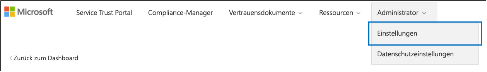

# <a name="work-with-microsoft-compliance-manager-preview"></a>Arbeiten mit dem Microsoft Compliance-Manager (Vorschau)

> [!IMPORTANT]
> Microsoft Compliance Manager ist ein Dashboard und Verwaltungstool, das eine Zusammenfassung Ihrer Datenschutz-und Compliance-Größe sowie Empfehlungen zur Verbesserung des Datenschutzes und der Compliance bietet. Die im Compliance-Manager bereitgestellten Kundenaktionen sind Empfehlungen; Es liegt in Ihrer Organisation, die Wirksamkeit dieser Empfehlungen in ihrem jeweiligen regulatorischen Umfeld vor der Implementierung zu bewerten. Im Compliance-Manager gefundene Empfehlungen sollten nicht als Garantie für die Compliance interpretiert werden.

## <a name="access-compliance-manager"></a>Zugriff auf Compliance-Manager

Sie können über das Service Trust Portal auf den Compliance-Manager zugreifen. Alle Personen mit einem Microsoft-Konto oder mit einem Azure Active Directory-Organisationskonto können auf den Compliance-Manager zugreifen.
  
1. Wechseln Sie zu [https://servicetrust.microsoft.com](https://servicetrust.microsoft.com/).

2. Melden Sie sich mit Ihrem Microsoft-Dienstkonto an, bei dem es sich um das Benutzerkonto Office 365, Microsoft 365 oder Azure Active Directory (Azure AD) handelt.

3. Im Dienst Vertrauensstellungs Portal wird empfohlen, den **Compliance-Manager**auszuwählen, bei dem es sich um die Vorschauversion mit den neuesten Features handelt. **Compliance-Manager (klassisch)** führt Sie zur vorherigen Version von Compliance-Manager.

4. Wenn die Geheimhaltungsvereinbarung angezeigt wird, lesen Sie Sie und wählen Sie **agree**, die dann Ihr Compliance-Manager-Dashboard anzeigt.

Um Ihnen den Einstieg zu erleichtern, wird eine ISO/IEC 27001:2103-Bewertung für Office 365 standardmäßig für Ihre Organisation angezeigt.

## <a name="administration"></a>Verwaltung

Es gibt bestimmte administrative Funktionen, die nur für den globalen Administrator verfügbar sind und nur sichtbar sind, wenn Sie mit einem globalen Administratorkonto angemeldet sind. Der globale Administrator kann Benutzerberechtigungen zuweisen und automatisch sichere Bewertungs Aktualisierungen für alle Aktionen aktivieren.
  
### <a name="assigning-compliance-manager-roles-to-users"></a>Zuweisen von Compliance-Manager-Rollen zu Benutzern

Sobald der Administrator anderen Benutzern Compliance-Manager-Rollen zuweist, können diese Benutzerdaten im Compliance-Manager anzeigen und Aktionen durchführen, die von ihrer Rolle bestimmt werden. Der Administrator kann dem Compliance-Manager auch schreibgeschützten Zugriff erteilen, indem er dem Benutzer die [globale Leserrolle in Azure Active Directory (Azure AD)](https://docs.microsoft.com/azure/active-directory/users-groups-roles/directory-assign-admin-roles#global-reader)zugewiesen.

Jede Compliance-Manager-Rolle verfügt über geringfügig unterschiedliche Berechtigungen. Sie können die jeder Rolle zugewiesenen Berechtigungen anzeigen, ermitteln, welche Benutzer sich in welchen Rollen befinden, und Benutzer aus dieser Rolle über das Dienst Vertrauensstellungs Portal hinzufügen oder entfernen. Wählen Sie das Menüelement **Admin** aus, und wählen Sie die anzuzeigenden **Einstellungen** aus.
  

  
Hinzufügen oder Entfernen von Benutzern aus Compliance-Manager-Rollen
  
1. Wechseln Sie zu [https://servicetrust.microsoft.com](https://servicetrust.microsoft.com).

2. Melden Sie sich mit Ihrem globalen Azure Active Directory-Administratorkonto an.

3. Wählen Sie in der oberen Menüleiste des Dienst Vertrauensstellungs Portals die Option **Administrator** aus, und wählen Sie dann **Einstellungen**aus.

4. Wählen Sie in der Dropdownliste **Rolle auswählen** die Rolle aus, die Sie verwalten möchten.

5. Benutzer, die den einzelnen Rollen hinzugefügt wurden, werden auf der Seite **Rolle auswählen** aufgeführt.

6. Um Benutzer zu dieser Rolle hinzuzufügen, wählen Sie **Hinzufügen**aus. Wählen Sie im Dialogfeld **Benutzer hinzufügen** das Feld Benutzer aus. Sie können in der Liste der verfügbaren Benutzer einen Bildlauf durchführen oder mit der Eingabe des Benutzernamens beginnen, um die Liste basierend auf Ihrem Suchbegriff zu filtern. Wählen Sie den Benutzer aus, der dieses Konto der mit dieser Rolle bereitgestellten Liste **Benutzer** hinzufügen hinzugefügt werden soll. Wenn Sie mehrere Benutzer gleichzeitig hinzufügen möchten, beginnen Sie mit der Eingabe eines Benutzernamens, um die Liste zu filtern, und wählen Sie dann den Benutzer aus, der der Liste hinzugefügt werden soll. Wählen Sie **Speichern** aus, um die ausgewählte Rolle für diese Benutzer festzustellen. 

    
  
7. Wenn Sie Benutzer aus dieser Rolle entfernen möchten, wählen Sie die Benutzer aus, und klicken Sie dann auf **Löschen**.

    

### <a name="controlling-automatic-secure-score-updates"></a>Steuern automatischer Bewertungen für sichere Gäste

Updates für sichere Bewertungen können für alle Aktionen automatisch aktiviert werden, können für alle Aktionen deaktiviert werden oder können durch einzelne Aktionen festgelegt werden.

1. Melden Sie sich mit ihrem globalen Administratorkonto beim [Dienst Vertrauensstellungs Portal](https://servicetrust.microsoft.com) an.

2. Wählen Sie in der oberen Menüleiste des Dienst Vertrauensstellungs Portals die Option **Administrator** aus, und wählen Sie dann **Einstellungen**aus.

4. Wählen Sie auf der Registerkarte **sichere Punktzahl** die entsprechende Schaltfläche für die gewünschte Einstellung aus.

**Hinweis:** Nur der globale Administrator kann automatische Updates für alle Aktionen aktivieren oder deaktivieren. Der Compliance-Manager-Administrator kann automatische Updates für einzelne Aktionen aktivieren, jedoch nicht für alle Aktionen Global.

## <a name="groups"></a>Gruppen

Gruppen sind Container, die es Ihnen ermöglichen, Bewertungen zu organisieren und allgemeine Informations-und Workflowaufgaben Zwischenbewertungen mit denselben oder Verwandten, vom Kunden verwalteten Steuerelementen freizugeben.

Sie können Bewertungen auf eine Weise gruppieren, die für Sie logisch ist, beispielsweise nach Jahr, Standard, Dienst oder basierend auf den Teams, Abteilungen oder Geographien Ihrer Organisation. Im folgenden finden Sie Beispiele aus zwei Gruppen und deren zugrunde liegenden Bewertungen:
  
- **FFIEC ist Assessments 2020**
  - Office 365 + FFIEC ist
  - InTune + FFIEC ist
- **Datenschutzbewertungen**
  - Office 365 + ISO 27001:2013
  - Office 365 + ISO 27018:2014

> [!NOTE]
> Es wird empfohlen, eine Gruppierungs Strategie für Ihre Organisation zu ermitteln, *bevor* Sie neue Bewertungen hinzufügen. Standardmäßig steht für Ihre anfänglichen Bewertungen eine Gruppe mit dem Namen "Default Group" zur Verfügung.

### <a name="how-to-create-a-group"></a>Vorgehensweise Erstellen einer Gruppe

Gruppen können nicht als eigenständige Entitäten erstellt werden. Eine Gruppe muss immer mindestens eine Bewertung enthalten, um eine Gruppe zu erstellen, müssen Sie zunächst eine Bewertung erstellen, die in der Gruppe platziert werden soll. Führen Sie die folgenden Schritte aus, um eine Gruppe zu erstellen:

1. Erstellen Sie eine neue Bewertung, indem Sie am oberen Rand des Dashboards **+ Assessment hinzufügen** auswählen.
2. Geben Sie im Bereich " **Bewertungs** Flyout" einen Titel für Ihre Bewertung ein, und wählen Sie im Dropdownmenü eine Vorlage aus.
3. Wenn Sie **eine Gruppe auswählen oder eine neue Gruppe hinzufügen**möchten, wählen Sie **neue Gruppe hinzufügen** aus, und geben Sie Ihren Gruppennamen in das Feld unten ein.
4. Wenn Sie Informationen aus einer vorhandenen Gruppe kopieren möchten, aktivieren Sie die Option **möchten Sie die Daten aus einer vorhandenen Gruppe kopieren?** **.** Wählen Sie im Dropdownmenü darunter die Gruppe aus, die Sie kopieren möchten, und aktivieren Sie die Kontrollkästchen aller Felder, die Sie in die neue Bewertung in ihrer neuen Gruppe übertragen möchten.
5. Klicken Sie auf **Speichern**. Wenn dieser Vorgang abgeschlossen ist, wird der Flyout-Bereich geschlossen, und die neue Gruppe wird automatisch in Ihrem Dashboard angezeigt.

Was Sie beim Arbeiten mit Gruppen wissen sollten:
  
- Gruppennamen (auch *Gruppen-IDs*genannt) müssen innerhalb Ihrer Organisation eindeutig sein.
- Gruppen haben keine Sicherheitseigenschaften. Alle Berechtigungen sind Assessments zugeordnet.
- Nachdem Sie eine Bewertung zu einer Gruppe hinzugefügt haben, kann die Gruppierung nicht mehr geändert werden. Sie können die Bewertungsgruppe umbenennen, die den Namen der Bewertungs Gruppierung für alle dieser Gruppe zugeordneten Bewertungen ändert.
- Zugehörige bewertungssteuerelemente in unterschiedlichen Bewertungen innerhalb derselben Gruppe werden automatisch aktualisiert, wenn Sie abgeschlossen werden.
- Wenn Sie einer vorhandenen Gruppe eine neue Bewertung hinzufügen, werden allgemeine Informationen aus Bewertungen in dieser Gruppe in die neue Bewertung kopiert.
- Gruppen können Bewertungen für dieselbe Zertifizierung oder Regel enthalten, aber jede Gruppe kann nur eine Bewertung für ein bestimmtes Produkt-Zertifizierungs Paar enthalten. Beispielsweise kann eine Gruppe keine zwei Bewertungen für Office 365 und das NIST-GfK enthalten. Eine Gruppe kann mehrere Bewertungen für dasselbe Produkt nur dann enthalten, wenn die entsprechende Zertifizierung oder Regulierung für jede andere unterschiedlich ist.
- Durch das Ausblenden einer Bewertung wird die Beziehung zwischen dieser Bewertung und der Gruppe unterbrochen. Weitere Aktualisierungen anderer verwandter Bewertungen werden nicht mehr in der ausgeblendeten Bewertung wiedergegeben. ([Hier erfahren Sie, wie Sie Bewertungen ausblenden.](#hide-a-template-or-an-assessment))
- Gruppen können nicht gelöscht werden.

## <a name="tenant-management"></a>Mandantenverwaltung

Compliance-Manager (Preview) enthält eine neue Schnittstelle zum Verwalten neuer Datenelemente, die als **Mandantenverwaltung**bezeichnet werden. Mit dieser Schnittstelle können Sie Mandantenweite Einstellungen verwalten:

- **Dimensionen:** Zeigen Sie Metadaten für Vorlagen, BEWERTUNGEN und Aktionselemente an, mit denen Sie benutzerdefinierte Pivots für Filter erstellen können.
- **Besitzer:** Geben Sie einen Besitzer für jedes Aktionselement an.
- **Aktionen für Kunden:** Verwalten Sie die vollständige Liste der Aktionen, die in Compliance-Manager (Preview) enthalten sind, und aktivieren/deaktivieren Sie die Secure Score-Überwachung für Aktionen, die mit Secure Score integriert sind.

Wählen Sie **Mandantenverwaltung** aus, um die Verwaltungsschnittstelle zu öffnen, und führen Sie die folgenden Schritte aus, um **Dimensionen**, **Besitzer**und **Kundenaktionen**zu verwalten.

### <a name="dimensions"></a>Maße

Dimensionen sind Satz von Metadaten, die Informationen zu einer Vorlage, einer Bewertung oder einem Aktionselement bereitstellen. Dimensionen verwenden das Konzept von Schlüsseln und Werten, wobei der Dimensionsschlüssel eine Eigenschaft darstellt, und Dimensionswert gültige Werte für die Eigenschaft darstellt. Beispielsweise gibt es im Compliance-Manager drei Arten von Aktionen. Sie werden durch einen Dimensionsschlüssel des **Aktionstyps** und der Dimensionswerte der Dokumentation, der **Betriebs**-und der **technischen** **Beschreibung**definiert. Sie können vorhandene Dimensionen bearbeiten oder löschen.

> [!IMPORTANT]
> Sie können neue Dimensionen hinzufügen und Sie Vorlagen zuweisen, die Sie bereits importiert haben. Sie können auch neue Bemaßungen zu allen neuen Vorlagen hinzufügen, die Sie erstellen.

### <a name="owners"></a>Besitzer

Besitzer werden verwendet, um die zuständige Partei für jedes Steuerelement zu identifizieren. Alle integrierten Steuerelemente befinden sich im Besitz von Microsoft, von Kunden oder von beiden. Sie können benutzerdefinierte Werte für Besitzer erstellen, die verwendet werden können, um mehr granulare Zuständigkeiten innerhalb Ihrer Organisation anzugeben. Sie können beispielsweise Besitzer erstellen, die bestimmte Gruppen, Teams oder Unternehmenseinheiten in Ihrer Organisation darstellen.

#### <a name="add-an-owner"></a>Hinzufügen eines Besitzers

1. Öffnen Sie die **Mandantenverwaltung** , und wählen Sie **Besitzer**aus.
2. Wählen Sie **+ Besitzer hinzufügen**aus.
3. Geben Sie einen Namen und eine Beschreibung für den Besitzer an, und wählen Sie **Speichern**aus. Die Beschreibung wird in der Spalte Besitzer angezeigt.

#### <a name="edit-an-owner"></a>Bearbeiten eines Besitzers

Ein Besitzername kann nicht bearbeitet werden, aber Sie können die Beschreibung ändern, die in der Spalte Besitzer angezeigt wird.

1. Öffnen Sie die **Mandantenverwaltung** , und wählen Sie **Besitzer**aus.
2. Suchen Sie den Besitzer, den Sie bearbeiten möchten, wählen Sie daneben die Auslassungspunkte (...) aus, und klicken Sie dann auf **Bearbeiten**.
3. Ändern Sie die Beschreibung nach Bedarf, und wählen Sie **Speichern**aus.

#### <a name="delete-an-owner"></a>Löschen eines Besitzers

1. Öffnen Sie die **Mandantenverwaltung** , und wählen Sie **Besitzer**aus.
2. Suchen Sie den Besitzer, den Sie löschen möchten, wählen Sie daneben die Auslassungspunkte (...) aus, und wählen Sie dann **Löschen**aus.
3. Wenn die Bestätigungsmeldung angezeigt wird, wählen Sie **Löschen**aus.

### <a name="customer-actions"></a>Kundenaktionen

Im Bereich Kundenaktionen werden alle Kundenaktionen für alle Vorlagen und Bewertungen im Compliance-Manager (Preview) angezeigt.


Auf einen Blick können Sie den Titel, den Besitzer, die Kategorie, die Erzwingung und das Ergebnis einer Aktion anzeigen und ermitteln, ob Sie mit Secure Score integriert ist. Sie können eine Aktion erweitern und dann **Read More** auswählen, um die Beschreibung der Aktion zu lesen und auf Links in der Beschreibung zuzugreifen. Sie können diese Schnittstelle auch verwenden, um die sichere Ergebnis Integration auf Aktionsbasis zu aktivieren und zu deaktivieren und benutzerdefinierte Aktionen hinzuzufügen. Aktionen mit einer Secure Score-Integrationsfunktion haben neben Ihnen ein Auslassungszeichen (...) (Beachten Sie, dass in benutzerdefinierten Aktionen neben Ihnen auch ein Auslassungszeichen steht).

#### <a name="enable-or-disable-secure-score-integration"></a>Aktivieren oder Deaktivieren der Integration sicherer Bewertungen

1. Wählen Sie die Auslassungspunkte (...) für die Aktion aus, die Sie ändern möchten, und wählen Sie **Bearbeiten**aus.
2. Wechseln Sie zur Option Secure Score Continuous Update auf ein oder aus, um die kontinuierliche Überwachung mithilfe von Secure Score zu aktivieren oder zu deaktivieren.
3. Klicken Sie auf **Speichern**.

Wenn Organisationen zunächst Microsoft 365 oder Office 365 bereitstellen, dauert es ungefähr sieben Tage, bis Secure Score Daten vollständig erfasst und Sie in Ihrer Partitur berücksichtigt. Während dieser Zeit wird durch das Festlegen der Option für die kontinuierliche Aktualisierung sicherer Bewertungen auf **aus** und das manuelle Festlegen einer Aktion auf **implementiert** festgesetzt, dass diese Aktion zur Partitur zählt. Nach den anfänglichen sieben Tagen wird durch das Drehen von Secure Score Continuous Update wieder eine kontinuierliche Überwachung von diesem Punkt aus aktiviert.

Alle Aktionen, die nicht von der Integration von Secure Score unterstützt werden, können manuell implementiert werden. Durch eine manuelle Implementierung wird die Bewertung für die Gruppe dieser Aktion berücksichtigt.

#### <a name="add-a-customer-action"></a>Hinzufügen einer Kunden Aktion

1. Wählen Sie **+ Kunden Aktion hinzufügen**aus.
2. Geben Sie einen eindeutigen Titel für die Aktion im Feld **Title** an.
3. Geben Sie im Feld **Maximale Konformitätsbewertung** eine Konformitätsbewertung für die Aktion an (Dies kann eine beliebige Zahl von 1-99 sein).
4. Geben Sie mithilfe der Dropdownliste **Aktionstyp** den Typ der Aktion an, die Sie hinzufügen möchten. Wenn der Aktionstyp nicht vorhanden ist, können Sie ihn hinzufügen, indem Sie den Wert dem Dimensionsschlüssel Aktion hinzufügen.
5. Verwenden Sie das Dropdown-Menü **Dimensionen** , um Dimensionsschlüssel und Werte für die Aktion anzugeben oder hinzuzufügen.
6. Verwenden Sie die Dropdownliste **Besitzer** , um den Besitzer für Aktion anzugeben.
7. Wählen **+** Sie diese Option aus, um eine Beschreibung und einen Beschreibungstitel für die Aktion hinzuzufügen.
8. Wählen Sie das **X** aus, um das Blatt Beschreibung zu schließen.
9. Wählen Sie **Speichern** aus, um die Aktion Kunden zu speichern.

#### <a name="delete-a-customer-action"></a>Löschen einer Kunden Aktion

1. Wählen Sie die Auslassungspunkte (...) für die Aktion aus, die Sie ändern möchten, und wählen Sie **Löschen**aus.
2. Wenn die Bestätigungsmeldung angezeigt wird, wählen Sie **Löschen**aus.

## <a name="assessments"></a>Bewertungen

### <a name="add-an-assessment"></a>Hinzufügen eines Assessments
  
1. Wählen Sie im Dashboard Assessments die Option **+ Assessment hinzufügen**aus.

2. Wenn das Blade geöffnet wird, geben Sie die folgenden Informationen ein:

    - **Title (erforderlich):** Geben Sie einen Titel für Ihre Bewertung ein.
    - **Wählen Sie eine Vorlage aus (erforderlich):** Auswählen einer Standard-oder benutzerdefinierten Vorlage
    - **Wählen Sie eine Gruppe aus, oder fügen Sie eine neue Gruppe hinzu (erforderlich):** Wählen Sie eine vorhandene Gruppe aus, oder wählen Sie aus, um eine neue Gruppe hinzuzufügen, und geben Sie einen eindeutigen Gruppennamen an.
    - Möchten **Sie die Daten aus einer vorhandenen Gruppe kopieren? (optional):** Umschalten des Steuerelements zum Aktivieren der Gruppen Kopie und dann:
        - **Wählen Sie eine Gruppe aus (optional):** Wenn die Gruppen Kopie aktiviert ist, wählen Sie die Gruppe aus, aus der kopiert werden soll.
            - **Implementierungs Details (optional):** Auswählen, um Implementierungsdetails in die neue Gruppe zu kopieren
            - **Testplan #a0 zusätzliche Informationen (optional):** Wählen Sie diese Option aus, um den Testplan und weitere Informationsdetails in die neue Gruppe zu kopieren.
            - **Dokumente (optional):** Auswählen, um Dokumente in die neue Gruppe zu kopieren

3. Wählen Sie **Speichern** aus, um die Bewertung zu erstellen.

 Die neue Bewertung wird im Assessment-Dashboard angezeigt und zeigt die folgenden Informationen an:

- Der Titel der Bewertung.
- Die Dimensionen der Bewertung, einschließlich Zertifizierung, Umgebung und Produkt, die auf die Bewertung angewendet wurden.
- Das Datum, an dem es erstellt wurde, und das Datum, an dem es zuletzt geändert wurde.
- Das Bewertungsergebnis wird als Prozentsatz angezeigt. Diese Bewertung enthält automatisch Ihre Ergebnisse aus von Microsoft verwalteten Steuerelementen und aus sicherer Bewertung.
- Fortschrittsindikatoren, die die Anzahl der beurteilten von Microsoft verwalteten und vom Kunden verwalteten Steuerelemente anzeigen.

### <a name="copying-information-from-existing-assessments"></a>Kopieren von Informationen aus vorhandenen Bewertungen

Wenn Sie eine Bewertung erstellen, haben Sie die Möglichkeit, Informationen aus einer vorhandenen Gruppe zu kopieren. Auf diese Weise können Sie die in die kopierte Bewertung eingegebenen Informationen auf dieselben Steuerelemente in der neuen Bewertung anwenden. Wenn Sie beispielsweise eine Gruppe für alle FFIEC-bezogenen Bewertungen in Ihrer Organisation haben, können Sie die folgenden Informationen aus vorhandenen Bewertungen kopieren:

- Implementierungs Details
- Testplan #a0 zusätzliche Informationen
- Dokumente

#### <a name="copy-information-from-an-existing-assessment-to-a-new-assessment"></a>Kopieren von Informationen aus einer vorhandenen Bewertung in eine neue Bewertung
  
1. Wählen Sie im Assessment-Dashboard die Option **+ Add Assessment**aus.
    
2. Füllen Sie im Fenster **Bewertung hinzufügen** die folgenden Informationen aus.

    - **Title (erforderlich):** Geben Sie einen Titel für Ihre Bewertung ein.
    - **Wählen Sie eine Vorlage aus (erforderlich):** Wählen Sie eine Standard-oder benutzerdefinierte Vorlage aus.
    - **Wählen Sie eine Gruppe aus, oder fügen Sie eine neue Gruppe hinzu (erforderlich):** Wählen Sie **neue Gruppe hinzufügen** aus, und geben Sie einen eindeutigen Gruppennamen an.
    - Möchten **Sie die Daten aus einer vorhandenen Gruppe kopieren? (optional):** schalten Sie das Steuerelement in ein ein, um die Gruppen Kopie zu aktivieren, und klicken Sie dann auf:- **Wählen Sie eine Gruppe aus (optional):** wenn Gruppen Kopie aktiviert ist, wählen Sie die Gruppe aus, aus der kopiert werden soll.
            - **Implementierungs Details (optional):** Wählen Sie diese Option aus, um Implementierungsdetails in die neue Gruppe zu kopieren.
            - **Testplan #a0 zusätzliche Informationen (optional):** Wählen Sie diese Option aus, um den Testplan und weitere Informationsdetails in die neue Gruppe zu kopieren.
            - **Dokumente (optional):** Wählen Sie diese Option aus, um Dokumente in die neue Gruppe zu kopieren.

3. Wählen Sie **Speichern** aus, um die Bewertung zu erstellen.

### <a name="view-an-assessment"></a>Anzeigen einer Bewertung
  
1. Wählen Sie im Dashboard Assessments den Bewertungs Namen aus, um ihn zu öffnen, und zeigen Sie die Informationen zu Aktionselementen und Steuerelementen an.

Hier ist ein Beispiel für die Bewertung für Office 365 und ISO 27001. Die erste Ansicht zeigt die neue Ansicht "Aktionselemente" im Compliance-Manager (Preview).


Die Aktionen werden in alphabetischer Reihenfolge aufgeführt, und jeder Aktion wird ein Ergebnis und ein Besitzer zugewiesen. Klicken Sie auf den Link **Read More** , um die Details der einzelnen Aktionen zu lesen. 


Wählen Sie den Link **überprüfen** aus, um die Aktion zu verwalten, zuzuweisen, zu implementieren und zu testen. Unten sehen Sie eine Beispielaktion.


In früheren Versionen von Compliance-Manager wurde der Workflow zur Implementierung von Anforderungen auf der Ebene der Steuerung ausgeführt. Ein Compliance Officer würde einem Benutzer ein Steuerelement zuweisen, um das Steuerelement zu implementieren. Es gab zwei Nachteile:

- Steuerelementen wurden häufig mehrere Aktionen zugeordnet, und der Benutzer, dem ein Steuerelement zugewiesen wurde, ist möglicherweise nicht die richtige Person, um alle Aktionen abzuschließen, die zum Implementieren des Steuerelements erforderlich waren.
- Durch die Kombination von getrennten Vorgängen in einer einzigen Aktion wurde die Sammlung der Signale und Telemetrie verhindert, die zum automatischen Aufzeichnen von Mandanten Konfigurationsänderungen im Compliance-Manager (Preview) verwendet werden.

Im Compliance-Manager (Preview) wurde der Workflowprozess von der Steuerelementebene zur Aktionsebene verschoben. Wenn Sie eine Aktion überprüfen, können Sie die folgenden Felder verwenden, um den Aktions Workflow zu verwalten:

- **Benutzer zuweisen:** Wählen Sie dieses Feld aus, um den Benutzer auszuwählen oder einzugeben, dem diese Aktion zugewiesen werden soll. Sie können in der Liste einen Bildlauf durchführen oder einen Namen eingeben, um ihn zu finden, und dann auswählen.
- **Dokumente verwalten:** Sie können einen Nachweis über die Implementierung in Form von Office-Dokumenten, Bilddateien und Screenshots, PowerShell-Ausgaben in CSV oder txt und PDFs hochladen.
- **Implementierungs Status:** Wird verwendet, um den aktuellen Implementierungsstatus der Aktion anzugeben. Mögliche Werte sind nicht implementiert, implementiert, alternative Implementierung, geplant und nicht im Bereich.
- **Implementierungsdatum:** Das Datum, an dem die Aktion ausgeführt wurde.
- **Test Ergebnis:** Wird verwendet, um die Ergebnisse der Implementierungs Überprüfung anzugeben. Mögliche Werte werden nicht bewertet, übergeben, fehlgeschlagen – niedriges Risiko, Fehler – mittleres Risiko, Fehler – hohes Risiko und nicht im Bereich.
- **Test Datum:** Das Datum, an dem die Überprüfung stattgefunden hat.
- **Anmerkungen zur Implementierung:** Geben Sie Implementierungsdetails für Ihre Organisation sowie alle Notizen ein, die Sie einschließen möchten.
- **Testplan:** Geben Sie die Details des Testplans für diese Aktion sowie alle Notizen ein, die Sie einschließen möchten.
- **Zusätzliche Informationen:** Geben Sie zusätzliche Informationen zu dieser Aktion oder deren Implementierung in Ihrer Organisation sowie alle Notizen ein, die Sie einschließen möchten.

Compliance-Manager (Preview) enthält auch den Steuerelement basierten Pivot, der in früheren Versionen gefunden wurde. Wählen Sie das Dashboard **Steuerelemente Info** aus, um es anzuzeigen. Sie können Informationen zu Steuerelementen auf der Bewertungs-und Vorlagenebene anzeigen. Unten sehen Sie ein Beispiel für das Steuerelement-Info-Dashboard für Bewertungen.


Für Bewertungen wird im Dashboard Informationen für Steuerelemente angezeigt:

- Eine **Gruppen** -Dropdownliste zum Auswählen der anzuzeigenden Gruppe (wenn mehrere Gruppen verwendet werden).
- Eine **Bewertungs** Dropdownliste zur Auswahl der anzuzeigenden Bewertung.
- Metadaten zur ausgewählten Bewertung, einschließlich:
    - Eine Statusanzeige für **bewertete Steuer** Elemente, die die Anzahl der beurteilten Steuerelemente über die Gesamtzahl der Steuerelemente angibt.
    - Die aktuelle **Konformitäts** Bewertung für die Bewertung wird als Prozentsatz angezeigt.
    - Details zur **Zertifizierung** und dem **Produkt** , die bei der Bewertung verwendet werden.
    - Der aktuelle **Status** und das Datum der letzten **Änderung** für die Bewertung.
- Eine Liste der **in-Bereichs Dienste** für die Bewertung.
- Details zu den Steuerelementen, gruppiert nach Steuerelement Familie, mit Links zu Kundenaktionen und Details zur Microsoft-Implementierung:
    - **Ihre Aktionen** zeigt die Kundenaktionen an, die Sie ausführen können, um einige oder alle Anforderungen des Steuerelements zu erfüllen. Vielen Steuerelementen sind mehrere Aktionen zugeordnet, und alle einem Steuerelement zugeordneten Aktionen werden hier angezeigt. Die hier aufgeführten Aktionen weisen dieselbe Benutzeroberfläche auf wie die im Dashboard Aktionen.
    - **Microsoft-Aktionen** zeigt die Liste der Steuerelemente aus dem internen Microsoft-Framework an, die für das ausgewählte Zertifizierungs Steuerelement gelten. Wählen Sie für jedes interne Steuerelement **implementiert** aus, um die Implementierungs-und Testdetails von Microsoft sowie das Testergebnis und das Test Datum anzuzeigen, wie unten dargestellt.


### <a name="export-an-assessment"></a>Exportieren einer Bewertung

Sie können eine Bewertung in eine Excel-Datei für Compliance-Beteiligte in Ihrer Organisation oder für externe Prüfer und Regulierer exportieren. Der Bericht ist eine Momentaufnahme der Bewertung ab dem Datum und der Uhrzeit der Erstellung des Berichts. Der Bericht enthält die Details für alle von Microsoft und vom Kunden verwalteten Steuerelemente für die Bewertung, den Status der Implementierung, das Kontrolltest Datum, Testergebnisse und stellt Links zu hochgeladenen Beweisdokumenten bereit. Sie sollten den Bewertungsbericht vor dem Archivieren einer Bewertung exportieren, da Archivierte Bewertungen keine Links zu hochgeladenen Dokumenten beibehalten.
  
### <a name="export-an-assessment-report"></a>Exportieren eines Bewertungsberichts
  
1. Wählen Sie im Compliance-Manager-Dashboard die Registerkarte **Steuerelemente Info** aus.
2. Wählen Sie die **Gruppe** und die **Bewertung** in den Dropdownmenüs für die Bewertung aus, die Sie exportieren möchten.
3. Klicken Sie auf die Schaltfläche **exportieren** .

Der Bewertungsbericht wird als Excel-Datei in ihrer Browsersitzung heruntergeladen. Der Name der Datei für die Excel-Datei ist standardmäßig der Titel der Bewertung.

### <a name="hide-a-template-or-an-assessment"></a>Ausblenden einer Vorlage oder einer Bewertung

Wenn Sie mit einer Vorlage oder Bewertung fertig sind und Sie nicht mehr für Compliance-Zwecke benötigen, können Sie Sie aus ihrer Ansicht ausblenden. Wenn eine Vorlage oder Bewertung ausgeblendet ist, wird Sie aus der Standardansicht entfernt, und Sie müssen das Kontrollkästchen **ausgeblendet einschließen** aktivieren, um es anzuzeigen.


> [!IMPORTANT]
> Ausgeblendete Bewertungen behalten Ihre Links zu hochgeladenen Beweisdokumenten nicht bei. Es wird dringend empfohlen, dass Sie die Bewertung vor dem ausblenden exportieren, um Links zu den Beweisdokumenten im Bericht beizubehalten.
  
#### <a name="hiding-a-template"></a>Ausblenden einer Vorlage

1. Öffnen Sie das Dashboard **Vorlagen** .
2. Suchen Sie die Vorlage, die Sie ausblenden möchten, und wählen Sie auf den Ellipsen in der Zeile **Ausblenden**aus.
3. Wenn die Bestätigungsmeldung angezeigt wird, wählen Sie **Ausblenden**aus.

#### <a name="hide-an-assessment"></a>Ausblenden einer Bewertung

1. Öffnen Sie das Dashboard **Assessments** .
2. Wählen Sie die **Gruppe** aus der Dropdownliste aus, die die Bewertung enthält, die Sie ausblenden möchten.
3. Suchen Sie nach der Bewertung, die Sie ausblenden möchten, und wählen Sie in den Ellipsen die Option **Ausblenden**aus.
4. Wenn die Bestätigungsmeldung angezeigt wird, wählen Sie **Ausblenden**aus.

#### <a name="view-hidden-assessments"></a>Ausgeblendete Bewertungen anzeigen
  
1. Öffnen Sie die Registerkarte **Assessments** Dashboard, und aktivieren Sie das Kontrollkästchen **einschließen ausgeblendet** .
2. Die ausgeblendeten Bewertungen werden im Abschnitt **Ausgeblendete Bewertungen** angezeigt.

#### <a name="unhide-an-assessment"></a>Einblenden eines Assessments

1. Aktivieren Sie auf der Registerkarte **Bewertungen** das Kontrollkästchen **ausgeblendet einschließen** .
2. Die ausgeblendeten Bewertungen werden im Abschnitt **Ausgeblendete Bewertungen** angezeigt.
3. Suchen Sie den zu unsichtbaren Test, und wählen Sie bei den Ellipsen die Option **Einblenden**aus.
4. Wenn die Bestätigungsmeldung angezeigt wird, wählen Sie **Einblenden**aus.

## <a name="controls-and-actions"></a>Steuerelemente und Aktionen

Steuerelemente und Aktionen sind die primären Daten Pivots, die in Compliance-Manager (Preview) verwendet werden. Der in früheren Versionen von Compliance-Manager vorhandene Steuerelement-Pivot wurde erweitert, um die Microsoft-und Kunden Steuerelemente in denselben Steuerelementfamilien anzuzeigen. Diese konsolidierte Ansicht erleichtert das Anzeigen des vollständigen Modells für die gemeinsame Verantwortung pro Steuerelement. Der Aktions Pivot ist neu im Compliance-Manager (Preview) und soll eine optimierte Übersicht über alle von Microsoft empfohlenen Aktionen bieten.

### <a name="controls"></a>Steuerelemente

Steuerelemente können im Steuerelement-Info-Dashboard angezeigt werden. Steuerelemente stellen die Anforderungen aus Standard, Zertifizierung, Regulierung oder Framework dar. Um diese Anforderungen über mehrere Standards, Verordnungen usw. hinweg zuzuordnen und Aktionen zuzuordnen, wird alles so behandelt, als ob es sich um ein Steuerungsframework handeln würde. Beispielsweise sind wie ein Steuerelement Framework Regeln wie HIPAA nach Abschnitt aufgeschlüsselt worden, und die HIPAA-Steuerelemente im Compliance-Manager verwenden dasselbe Nummernschema wie in den folgenden Abschnitten dargestellt:


Es gibt drei Arten von Steuerelementen:

1. Von **Microsoft verwaltete Steuerelemente:** Dies sind Steuerelemente, für die nur Microsoft zuständig ist. Sie werden in den in-Box-Vorlagen angezeigt und werden dem Compliance-Manager von Microsoft hinzugefügt.
2. Vom **Kunden verwaltete Steuerelemente:** Dies sind Steuerelemente, für die nur Kunden verantwortlich sind. Sie werden in den in-Box-Vorlagen angezeigt und werden dem Compliance-Manager von Kunden hinzugefügt.
3. **Gemeinsame Verwaltungssteuerelemente:** Dies sind Steuerelemente, bei denen die Verantwortung von Microsoft und dem Kunden freigegeben wird. Diese werden in den in-Box-Vorlagen angezeigt und werden dem Compliance-Manager von Microsoft hinzugefügt. Der Kunde kann auch von Microsoft verwaltete Steuerelemente bearbeiten oder deaktivieren.

### <a name="actions-items"></a>Aktionen Elemente

Aktionen Elemente sind die empfohlenen Aufgaben zum Implementieren der Anforderungen einer Norm oder einer Verordnung oder zum Testen, überprüfen und Dokumentieren der Implementierungsanforderungen Ihrer Organisation. Aktionen sind einem oder mehreren Steuerelementen zugeordnet. Jedem Steuerelement ist eine oder mehrere Aktionen zugeordnet, und jede Aktion kann einem oder mehreren Steuerelementen zugeordnet werden. Aktionen sind Teil des Haupt Workflows im Compliance-Manager (Preview), da es sich um Objekte handelt, die von Ihrer Organisation zugewiesen, verfolgt und überprüft werden.

#### <a name="assign-action-items"></a>Zuweisen von Aktionselementen
  
1. Wählen Sie im Dashboard **Aktionselemente** die **Gruppe** aus, die die Bewertung (en) enthält, deren Aktion Sie zuweisen möchten.
2. Wählen Sie in der Dropdownliste **Bewertung** die Bewertung aus, deren Aktion Sie zuweisen möchten, oder wählen Sie im Dropdownmenü **alle** Optionen aus, um alle verfügbaren Aktionen anzuzeigen.
3. Suchen Sie die Aktion, die Sie zuweisen möchten, und wählen Sie in der Spalte **Besitzer** den Link zur **Überprüfung**, **Implementierung** oder **Test**aus.
4. Wählen Sie das Feld **Benutzer zuweisen** aus, und eine Liste der Benutzer in Ihrer Organisation wird angezeigt. Scrollen Sie in der Liste, und wählen Sie Benutzer oder Filtern Sie die Liste aus, um einen Benutzer auszuwählen, indem Sie den Namen des Benutzers eingeben.
5. Geben Sie im Feld Anmerkungen zur Implementierung alle Notizen ein, die Sie dem zugewiesenen Benutzer übermitteln möchten.
6. Wählen Sie **Speichern** aus, um die Aktion zuzuweisen.

#### <a name="reassign-action-items"></a>Aktionselemente neu zuweisen

Mit dieser Funktion kann eine Organisation alle aktiven oder ausstehenden Abhängigkeiten des Benutzerkontos entfernen, indem eine Aktion einem neuen Benutzer zugewiesen wird.

1. Wählen Sie im Dashboard **Aktionselemente** die **Gruppe** mit den Bewertungen aus, deren Aktion Sie neu zuweisen möchten.
2. Wählen Sie im Dropdown-Menü **Bewertung** die Bewertung aus, deren Aktion Sie neu zuweisen möchten, oder wählen Sie **alle** in der Dropdownliste aus, um alle verfügbaren Aktionen anzuzeigen.
3. Suchen Sie nach der Aktion, die Sie neu zuweisen möchten, und wählen Sie in der Spalte **Besitzer** den Link zur **Überprüfung**, **Implementierung**oder **Test**aus.
4. Löschen Sie den vorhandenen Benutzer aus dem Feld **Benutzer zuweisen** , und wählen Sie entweder einen anderen Benutzer in der Liste der Benutzer aus, oder Filtern Sie die Liste, um einen Benutzer auszuwählen, indem Sie den Namen des Benutzers eingeben.
5. Geben Sie im Feld Anmerkungen zur Implementierung alle Notizen ein, die Sie dem Benutzer übermitteln möchten.
6. Wählen Sie **Speichern** aus, um die Aktion neu zuzuweisen.

## <a name="templates"></a>Vorlagen

Eine Vorlage ist das Basisobjekt im Compliance-Manager (Preview), das einem Produkt und einer Zertifizierung (beispielsweise Standard, Regulierung, Steuerelement Framework usw.) zugeordnet ist. Vorlagen können angezeigt und aus dem Dashboard Vorlagen hinzugefügt werden.


 
Das Dashboard zeigt jede Vorlage zusammen mit der Zertifizierung und dem Produkt, das der Vorlage zugeordnet ist, den Datumsangaben, an denen die Vorlage erstellt und zuletzt geändert wurde, die Anzahl der von Kunden und von Microsoft verwalteten Steuerelemente, die maximale Konformitätsbewertung für den Vorlage und den Status der Vorlage (beispielsweise genehmigt, ausstehende Genehmigung, importiert).

Die integrierten Vorlagen verfügen jeweils über eine integrierte Bewertung, aber Sie können zusätzliche Bewertungen basierend auf integrierten Vorlagen erstellen, und Sie können eigene Vorlagen importieren und benutzerdefinierte Bewertungen basierend auf diesen erstellen.

### <a name="create-a-template"></a>Erstellen einer Vorlage

Sie können eine Vorlage erstellen, indem Sie eine vorhandene Vorlage kopieren oder eine benutzerdefinierte Vorlage importieren. Es gibt ein bestimmtes Format und Schema, das für Vorlagendaten verwendet werden muss, oder es wird nicht in den Compliance-Manager importiert. Eine Datei mit den richtigen Schema-und Beispieldaten kann hier heruntergeladen werden.
Jede benutzerdefinierte Vorlage sollte sich in einer separaten Excel-Arbeitsmappe (im XLS-oder XLSX-Format) befinden, die fünf Registerkarten enthält:

1. Vorlage – Bewertung
2. ControlFamily
3. Aktionen
4. Besitz
5. Maße

Das Schema, das innerhalb der einzelnen Registerkarten verwendet wird, ist unten aufgeführt.

#### <a name="template-assessment-tab"></a>Registerkarte "Vorlagen Bewertung"

Diese Registerkarte hat eine einzelne Spalte:

- **inScopeServices**: durch trennzeichengetrennte Liste von Produkten oder Diensten, die im Bereich der Vorlage liegen.

#### <a name="controlfamily-tab"></a>Registerkarte "ControlFamily"

Diese Registerkarte enthält Spalten, die die Steuerelemente definieren, die den auf der Registerkarte Aktionen aufgeführten Aktionen zugeordnet sind, und enthält Details wie Steuerelementname, Familie, Titel und Beschreibung.  Die Spalten für diese Registerkarte, die innerhalb von Excel in der unten aufgeführten Reihenfolge sortiert werden müssen, lauten wie folgt: 

- **Steuer Elementname:** Steuerelementname aus Zertifizierung/Norm/Regulierung usw.
- **controlFamily:** Kontroll Familie aus Zertifizierung/Standard, Regulierung usw.
- **controlTitle:** Kontroll Titel aus Zertifizierung/Norm/Regulierung usw.
- **controlDescription:** Kontroll Beschreibung aus Zertifizierung/Norm/Regulierung usw.
- **controlVersion:** Optionale Steuerelement Versionsinformationen.  Beispiel: für NIST 800-53 ist der aktuelle Wert Rev 4, sodass der controlVersion 4 ist.  Für CSA ccm ist es 3.0.1.
- **isDisabled:** Verwenden Sie true oder false, um anzugeben, ob das Steuerelement deaktiviert wurde.
- **ControlType:** Verwenden Sie cc, um anzugeben, dass es sich um vom Kunden verwaltete Steuerelemente handelt.
- **controlComplianceScore:** Summe der Punktzahl aller Aktionen, die dem Steuerelement zugewiesen sind.
- **controlActionTitle:** Doppelte durch Semikolons getrennte Liste aller actionTitles für dieses Steuerelement, wie auf der Registerkarte Aktionen aufgeführt. 

#### <a name="actions-tab"></a>Registerkarte "Aktionen"

Diese Registerkarte enthält Spalten, die einzelne Aktionen definieren, und enthält Details wie Aktionstitel, Besitz und Dimensionen. Die Spalten für diese Registerkarte, die innerhalb von Excel in der unten aufgeführten Reihenfolge sortiert werden müssen, lauten wie folgt: 

- **actionTitle:** Titel der Aktion. Jeder Titel muss eindeutig sein, und wir empfehlen die Verwendung von Pascal Case.
- **actionRelatedODVs:** Doppelte durch Semikolons getrennte Liste von actionTitles, die übergeordnete Elemente des in der actionTitle-Spalte aufgeführten untergeordneten Elements sind. In einer Parent/Child-Beziehung stellt das übergeordnete Element das hohe Wasserzeichen dar. Wenn Sie also eine übergeordnete Aktion ausführen, werden auch alle untergeordneten Aktionen ausgeführt. Wenn Sie beispielsweise über ähnliche Anforderungen, aber unterschiedliche Standardwerte verfügen, beispielsweise die Kennwortlänge, wobei eine Norm/Regel mindestens 15 Zeichen erfordert und eine andere mindestens 12 oder 10. 15 wäre in diesem Beispiel das übergeordnete Element, und wenn Sie mindestens 15 Zeichen konfigurieren, erfüllen Sie auch die Aktionen, die 12 oder 10 Zeichen in anderen Bewertungen empfehlen.

    > [!NOTE]
    > Die actionRelatedODVs-Spalte ist eine erforderliche Spalte für das Schema; Das Feature (zugehörige Aktionen) steht jedoch im Compliance-Manager (Preview) nicht zur Verfügung.  Es ist geplant, in einer späteren Version hinzugefügt zu werden.

- **actionDimensionValues:** Doppelte durch Semikolons getrennte Liste der entsprechenden Dimensionen auf der Registerkarte Dimensionen mit folgendem Format:

    ```Markdown
    Dimension Key::Dimension Value;;Dimension Key::Dimension Value.
    ```
    
    Zum Beispiel:

    ```Markdown
    Product::Office 365;;Certification::NIST CSF
    ```

    Alle Dimensionen, die in einer benutzerdefinierten Vorlage verwendet werden, müssen auf der Registerkarte Dimensionen der Importdatei aufgeführt werden, auch wenn diese bereits im Dashboard Dimensionen aufgeführt sind.
- **actionScore:** Numerischer Wert für jede Aktion, der die Bewertung für diese Aktion darstellt. Es wird empfohlen, das von den integrierten Bewertungen verwendete Bewertungsmodell zu verwenden, das auf dem Zweck und der Erzwingung der einzelnen Aktionen basiert.
- **actionOwnership:** Doppelte durch Semikolons getrennte Liste der Besitzer. Alle aufgeführten Besitzer müssen auf der Registerkarte "Besitz" enthalten sein.
- **actionDescription:** Text jeder Aktion, die eindeutig sein muss. Dieses Feld unterstützt die unten beschriebene Absprache.

#### <a name="ownership-tab"></a>Registerkarte "Besitz"

Diese Registerkarte enthält Spalten, die die Besitzer für jede Aktion definieren.  Die Spalten für diese Registerkarte, die innerhalb von Excel in der unten aufgeführten Reihenfolge sortiert werden müssen, lauten wie folgt:

- **Eigentümername:** Eindeutiger Name des Besitzers/der verantwortlichen Partei.
- **ownershipDescription:** Beschreibung des Besitzers/der verantwortlichen Partei.

#### <a name="dimensions-tab"></a>Registerkarte Dimensionen

Diese Registerkarte enthält Spalten, in denen die Dimensionen definiert werden, die einer Aktion zugeordnet werden können.  Die Spalten für diese Registerkarte, die innerhalb von Excel in der unten aufgeführten Reihenfolge sortiert werden müssen, lauten wie folgt:

- **dimensionKey:** Liste der für Dimensionen verwendeten Schlüssel. Beispielsweise Produkt, Zertifizierung usw.
- **dimensionvalue:** Eindeutiger Wert für jeden Dimensionsschlüssel. Beispielsweise Office 365, InTune, Azure, benutzerdefiniertes Produkt usw.
- **allowMultiSelect:** Verwenden Sie true oder false, um anzugeben, dass mehrere Dimensionswerte für einen einzelnen Dimensionsschlüssel ausgewählt werden können.

#### <a name="using-markdown-language-in-description-fields"></a>Verwenden von Abzugs Sprache in Beschreibungsfeldern

Vorlagen und Bewertungen unterstützen die Verwendung von Abschriften Sprache für einige Textelemente und Formatierungen.  Es gibt drei Formatierungselemente der Abzugs Sprache, die im Compliance-Manager verwendet werden:

- Aufzählungszeichen und nummerierte Listen
- Hyperlinks
- Fettdruck

Aufzählungszeichen werden als Sternchen anstelle von Word-oder Excel-Aufzählungszeichen dargestellt. Zum Beispiel:

```Markdown
* Item A
* Item B
* Item C
```

Zahlen werden als Zahlen dargestellt, jedoch mit Leerzeichen für Einzug (drei Leerzeichen pro Ebene) und nur für alle Unterebenen (beispielsweise keine Buchstaben).  Zum Beispiel:
   1. Element A
   2. Element B
      1. Unterelement A
      2. Unterelement B
   3. Element C
   4. Element D
      1. Unterelement A
      2. Unterelement B
   5. Element E

Hyperlinks werden durch Platzieren von Klammern um den Hyperlinktext und den Hyperlink selbst in Klammern unmittelbar neben der schließenden Klammer erstellt.  Zum Beispiel:

```Markdown
Click [here](https://www.microsoft.com) to go to Microsoft’s home page.
```
Dieser Text wird wie folgt gerendert: Klicken Sie [hier](https://www.microsoft.com) , um zur Startseite von Microsoft zu gelangen.

Wie im obigen Beispiel dargestellt, rendert Compliance Manager keine URLs mit Unterstreichung.

Fett formatierter Text ist zwei Sternchen auf jeder Seite des Texts, der fett formatiert werden soll.  Zum Beispiel:

```Markdown
**This text will render in bold**
```
**Dieser Text wird fett dargestellt**

### <a name="create-a-template"></a>Erstellen einer Vorlage

Sie können eine Vorlage erstellen, indem Sie eine vorhandene Vorlage kopieren oder Vorlagendaten aus Excel importieren. Beim Importieren von Daten aus Excel benötigt die Vorlage zwei verschiedene Compliance-Manager-Administratoren, um die Daten zu veröffentlichen (eine zur Veröffentlichung und eine, die genehmigt werden soll).

#### <a name="create-a-template-by-copying-an-existing-template"></a>Erstellen einer Vorlage durch Kopieren einer vorhandenen Vorlage

1. Öffnen Sie das Dashboard **Vorlagen** , und wählen Sie **+ Vorlage hinzufügen**aus.
2. Geben Sie im Feld **Vorlagenname eingeben** einen eindeutigen Namen für die Vorlage ein.
3. Aktivieren Sie das Kontrollkästchen **Kopie von einer vorhandenen Vorlage** , und wählen Sie die Vorlage aus der Dropdownliste aus, die Sie kopieren möchten.
4. Optional können Sie zusätzliche Bemaßungen hinzufügen.
5. Wählen Sie **zum Dashboard hinzufügen**aus.

#### <a name="create-a-template-by-importing-data"></a>Erstellen einer Vorlage durch Importieren von Daten

1. Öffnen Sie das Dashboard **Vorlagen** , und wählen Sie **+ Vorlage hinzufügen**aus.
2. Geben Sie im Feld **Vorlagenname eingeben** einen eindeutigen Namen für die Vorlage ein.
3. Wählen Sie mindestens eine Dimension aus der Liste verfügbar aus.
4. Wählen Sie **Durchsuchen** aus, um zum Speicherort der Importdatei zu navigieren, wählen Sie Sie aus, und wählen Sie **Öffnen**aus.
5. Die Importdatei wird überprüft und gibt die Anzahl der Steuerelemente und Kontroll Familien an, die erkannt wurden. Wenn Fehler vorliegen, wird eine Verknüpfung für eine geänderte Version der Importdatei bereitgestellt, die Fehlerdetails enthält. Alle Fehler müssen aufgelöst werden, bevor die Daten importiert werden.
6. Nachdem die Daten validiert wurden, wählen Sie **zum Dashboard hinzufügen**aus.
7. Die importierte Vorlage wird im Dashboard **Vorlagen** angezeigt und hat den Status **importiert**. Wählen Sie die Ellipsen (...) aus, und wählen Sie **veröffentlichen** aus, um die Vorlage zu veröffentlichen. Wenn die Bestätigungsmeldung angezeigt wird, wählen Sie **veröffentlichen**aus. Der Vorlagenstatus wird in **Ausstehende Genehmigung**geändert.
8. Ein anderer Benutzer mit der Rolle Compliance-Manager-Administrator muss die Vorlage im Dashboard Vorlagen genehmigen. Sie müssen die Ellipsen (...) auswählen und **genehmigen**auswählen. Wenn die Bestätigungsmeldung angezeigt wird, wählen Sie **genehmigen**aus. Die Vorlage kann nun verwendet werden.

> [!IMPORTANT]
> Beim Erstellen einer Vorlage müssen Sie Dimensionen für **Produkt** und **Zertifizierung** einschließen, um sicherzustellen, dass Ihre Vorlage im Kompatibilitäts Bewertungsergebnis angezeigt wird.

### <a name="customize-a-template"></a>Anpassen einer Vorlage

Vorlagen können mithilfe der zusätzlichen benutzerdefinierten Steuerelemente angepasst werden. Alle benutzerdefinierten Steuerelemente werden als vom Kunden verwaltete Steuerelemente betrachtet.

#### <a name="add-a-custom-control-to-a-template"></a>Hinzufügen eines benutzerdefinierten Steuerelements zu einer Vorlage

1. Öffnen Sie die **Vorlage** , die Sie ändern möchten.
2. Wählen Sie + benutzerdefiniertes Steuerelement **Hinzufügen** .
3. Wählen Sie in der Dropdownliste eine **Steuerelement Familie** aus, oder geben Sie eine neue Steuerelement Familie ein, falls Sie nicht vorhanden ist.
4. Geben Sie im Feld **Steuerelement-ID** einen eindeutigen Namen oder eine eindeutige ID für das Steuerelement an.
5. Geben Sie im Feld **Titel** den Titel des Steuerelements an.
6. Geben Sie im Feld **Beschreibung** die Anforderungen und andere Informationen für das Steuerelement an.
7. Klicken Sie auf **Kunden Aktion zuweisen** .
8. Suchen Sie die Aktion (en), die Sie dem Steuerelement zuweisen möchten:
    - Verwenden Sie **Filter nach Dimension** , um Dimensionen zu verwenden, die den Aktionen zugewiesen sind, um Sie zu suchen und aufzulisten.
    - Verwenden Sie den **Filter nach Besitzer** , um die der Aktion zugewiesenen Besitzer (n) zu verwenden, um Sie zu suchen und aufzulisten.
    - Wählen Sie im Dropdownmenü einen **Aktionstyp** aus, um Aktionen nach Typ aufzulisten.
    - Geben Sie den Titel der zu suchenden Aktion ein, und führen Sie eine Liste aus.
9. Anhand der Kriterien in Schritt 8 wird eine Liste der **übereinstimmenden Aktion (en)** angezeigt. Wählen Sie die erste Aktion aus, die Sie dem Steuerelement zuweisen möchten.
10. Die Details der Aktion werden angezeigt. Wählen Sie die **Beschreibung** aus, die Sie verwenden möchten, und klicken Sie auf **Fertig**.
11. Wiederholen Sie die Schritte 9 und 10 für jede zusätzliche Aktion, die Sie zuweisen möchten.
12. Wenn alle anwendbaren Aktionen ausgewählt wurden, wählen Sie **zuweisen**aus.
13. Wählen Sie **Speichern** aus, um das neue Steuerelement zu speichern.

> [!NOTE]
> Alle an einer Vorlage vorgenommenen Änderungen werden nicht in vorhandenen Bewertungen wiedergegeben. Vorlagen Aktualisierungen müssen zuerst vorgenommen und dann auf eine neue Bewertung angewendet werden, damit die Änderungen angezeigt werden.

### <a name="export-a-template-to-json"></a>Exportieren einer Vorlage in JSON

Compliance-Manager (Preview) unterstützt auch das Exportieren von Vorlagen in JavaScript Object Notation (JSON) Format. Auf diese Weise können Sie Compliance-Manager-Daten mit anderen Systemen austauschen, die JSON unterstützen.

## <a name="reports"></a>Berichte

Sie können eine Bewertung in eine Excel-Datei für Compliance-Beteiligte in Ihrer Organisation oder für externe Prüfer und Regulierer exportieren. Der Bericht ist eine Momentaufnahme der Bewertung zum Datum und zur Uhrzeit des Exports. Der Bericht enthält die Details für Microsoft und von Kunden verwaltete Steuerelemente für die Bewertung, den Status der Implementierung, das Kontrolltest Datum, Testergebnisse und Links zu hochgeladenen Beweisdokumenten. Sie sollten Bewertungen exportieren, bevor Sie Sie archivieren, da Archivierte Bewertungen keine Links zu hochgeladenen Dokumenten beibehalten.

### <a name="export-an-assessment"></a>Exportieren einer Bewertung

1. Wählen Sie im Compliance-Manager-Dashboard die Registerkarte **Steuerelemente Info** aus.
2. Wählen Sie die Gruppe und die Bewertung in den Dropdownmenüs für die Bewertung aus, die Sie exportieren möchten.
3. Wählen Sie exportieren aus. Der Bewertungsexport wird als Excel-Datei heruntergeladen.


## <a name="permissions"></a>Berechtigungen

In der folgenden Tabelle werden die einzelnen Compliance-Manager-Berechtigungen beschrieben, und welche Aktionen der Benutzer zulässt. Die Tabelle gibt auch die Rolle an, der jede Berechtigung zugewiesen ist.

||**Azure AD globaler Leser**|**Compliance Manager Reader**|**Compliance Manager Contributor**|**Compliance Manager Assessor**|**Compliance Manager Administrator**|**Portal Admin**|
|:-----|:-----|:-----|:-----|:-----|:-----|:-----|
|**Daten lesen:** Benutzer können Daten lesen, aber nicht bearbeiten (außer für Vorlagendaten und Mandantenverwaltung).  <br> | X | X | X | X | X  | X |
|**Bearbeiten von Daten:** Benutzer können alle Felder mit Ausnahme der Felder Testergebnis und Test Datum bearbeiten (außer für Vorlagendaten und Mandantenverwaltung).  <br> ||| X | X  | X | X |
|**Bearbeiten von Testergebnissen:** Benutzer können die Felder Testergebnis und Test Datum bearbeiten.  <br> |||| X | X | X |
|**Verwalten von Bewertungen:** Benutzer können Bewertungen erstellen, archivieren und löschen.  <br> ||||| X | X |
|**Verwalten von Masterdaten:** Benutzer können Vorlagendaten und Mandanten Verwaltungsdaten anzeigen, bearbeiten und löschen.  <br> ||||| X | X |
|**Verwalten von Benutzern:** Benutzer können andere Benutzer in Ihrer Organisation zu den Rollen Leser, Mitwirkenden, Assessoren und Administrator hinzufügen. Nur Benutzer mit der globalen Administrator Rolle in Ihrer Organisation können Benutzer aus der Portal Administratorrolle hinzufügen oder entfernen.  <br> |||||| X |
