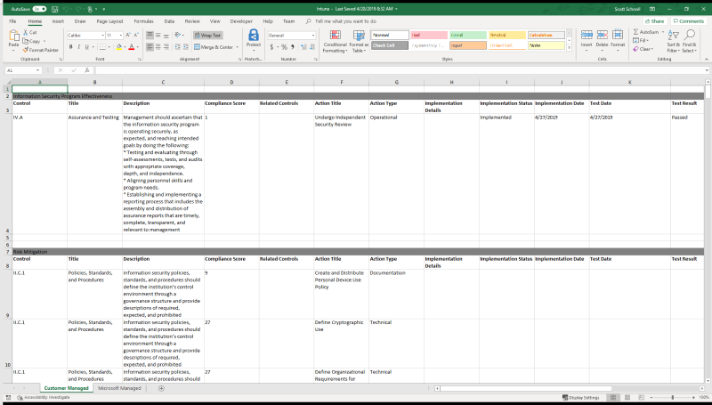

# Arbeiten mit dem Microsoft Compliance-Manager (Vorschau)Working with Microsoft Compliance Manager (preview)

> [!IMPORTANT]
> Microsoft Compliance Manager ist ein Dashboard und Verwaltungstool, das eine Zusammenfassung Ihrer Datenschutz-und Compliance-Größe sowie Empfehlungen zur Verbesserung des Datenschutzes und der Compliance bietet.Microsoft Compliance Manager is a dashboard and management tool that provides a summary of your data protection and compliance stature and recommendations to improve data protection and compliance. Die im Compliance-Manager bereitgestellten Kundenaktionen sind Empfehlungen.The customer actions provided in Compliance Manager are recommendations. Es liegt in Ihrer Organisation, die Wirksamkeit dieser Empfehlungen in ihrem jeweiligen regulatorischen Umfeld vor der Implementierung zu bewerten.It is up to your organization to evaluate the effectiveness of these recommendations in their respective regulatory environment prior to implementation. Empfehlungen aus dem Compliance-Manager sollten nicht als eine Garantie für Compliance interpretiert werden.Recommendations found in Compliance Manager should not be interpreted as a guarantee of compliance.

## Zugriff auf Compliance-ManagerAccess Compliance Manager

Auf den Compliance-Manager kann über das Microsoft-Dienst Vertrauensstellungs Portal zugegriffen werden.Compliance Manager is accessible from the Microsoft Service Trust Portal. Jeder Benutzer mit einem Microsoft-Konto oder einem Azure Active Directory-organisationskonto kann auf den Compliance-Manager zugreifen.Anyone with a Microsoft account or Azure Active Directory organizational account can access Compliance Manager.

1. Wechseln Sie zu [https://servicetrust.microsoft.com/ComplianceManager/V3](https://servicetrust.microsoft.com/ComplianceManager/V3).Go to [https://servicetrust.microsoft.com/ComplianceManager/V3](https://servicetrust.microsoft.com/ComplianceManager/V3).

2. Melden Sie sich mit Ihrem Microsoft-Dienstkonto an, bei dem es sich um das Benutzerkonto Office 365, Microsoft 365 oder Azure Active Directory (Azure AD) handelt.Sign in with your Microsoft service account, which is your Office 365, Microsoft 365, or Azure Active Directory (Azure AD) user account.

> [!NOTE]
> Wählen Sie im Dienst Vertrauensstellungs Portal **Compliance-Manager**aus, bei dem es sich um die Vorschauversion mit den neuesten Features handelt.In the Service Trust Portal, select **Compliance Manager**, which is the preview version with the most current features. Wählen Sie **Compliance-Manager (klassisch)** nicht aus, der Legacyfeatures enthält, die in dieser Dokumentation nicht behandelt werden.Do not select **Compliance Manager (Classic)**, which contains legacy features not covered by this documentation.

## VerwaltungAdministration

Es gibt bestimmte administrative Funktionen, die nur für den globalen Administrator verfügbar sind und nur sichtbar sind, wenn Sie mit einem globalen Administratorkonto angemeldet sind.There are specific administrative functions that are only available to the global administrator and only visible when logged in with a global administrator account. Der globale Administrator kann Benutzerberechtigungen zuweisen und automatische Bewertungen für sicheres Ergebnis aktivieren.The global administrator can assign user permissions and turn on automatic Secure Score updates.
  
### Zuweisen von Compliance-Manager-Rollen zu BenutzernAssigning Compliance Manager roles to users

Sobald der Administrator anderen Benutzern Compliance-Manager-Rollen zuweist, können diese Benutzerdaten im Compliance-Manager anzeigen und Aktionen durchführen, die von ihrer Rolle bestimmt werden.Once the administrator assigns Compliance Manager roles to other users, those users can view data in Compliance Manager and perform actions determined by their role. Der Administrator kann dem Compliance-Manager auch schreibgeschützten Zugriff erteilen, indem er dem Benutzer die [globale Leserrolle in Azure Active Directory (Azure AD)](https://docs.microsoft.com/azure/active-directory/users-groups-roles/directory-assign-admin-roles#global-reader)zugewiesen.The administrator can also give read-only access to Compliance Manager by assigning the user the [Global Reader role in Azure Active Directory (Azure AD)](https://docs.microsoft.com/azure/active-directory/users-groups-roles/directory-assign-admin-roles#global-reader).

Jede Compliance-Manager-Rolle verfügt über geringfügig unterschiedliche Berechtigungen.Each Compliance Manager role has slightly different permissions. Sie können die jeder Rolle zugewiesenen Berechtigungen anzeigen, ermitteln, welche Benutzer sich in welchen Rollen befinden, und Benutzer aus dieser Rolle über das Dienst Vertrauensstellungs Portal hinzufügen oder entfernen.You can view the permissions assigned to each role, see which users are in which roles, and add or remove users from that role through the Service Trust Portal. Wählen Sie das Menüelement **Admin** aus, und wählen Sie die anzuzeigenden **Einstellungen** aus.Select the **Admin** menu item, and choose **Settings** to view.
  

  
Hinzufügen oder Entfernen von Benutzern aus Compliance-Manager-RollenTo add or remove users from Compliance Manager roles.
  
1. Wechseln Sie zu [https://servicetrust.microsoft.com](https://servicetrust.microsoft.com).Go to [https://servicetrust.microsoft.com](https://servicetrust.microsoft.com).

2. Melden Sie sich mit Ihrem globalen Azure Active Directory-Administratorkonto an.Sign in with your Azure Active Directory global administrator account.

3. Wählen Sie in der oberen Menüleiste des Dienst Vertrauensstellungs Portals die Option **Administrator** aus, und wählen Sie dann **Einstellungen**aus.On the Service Trust Portal top menu bar, select **Admin** and then choose **Settings**.

4. Wählen Sie in der Dropdownliste **Rolle auswählen** die Rolle aus, die Sie verwalten möchten.In the **Select Role** drop-down list, select the role that you want to manage.

5. Benutzer, die den einzelnen Rollen hinzugefügt wurden, werden auf der Seite **Rolle auswählen** aufgeführt.Users added to each role are listed on the **Select Role** page.

6. Um Benutzer zu dieser Rolle hinzuzufügen, wählen Sie **Hinzufügen**aus.To add users to this role, select **Add**. Wählen Sie im Dialogfeld **Benutzer hinzufügen** das Feld Benutzer aus.In the **Add Users** dialog, select the user field. Sie können in der Liste der verfügbaren Benutzer einen Bildlauf durchführen oder mit der Eingabe des Benutzernamens beginnen, um die Liste basierend auf Ihrem Suchbegriff zu filtern.You can scroll through the list of available users or begin typing the user name to filter the list based on your search term. Wählen Sie den Benutzer aus, der dieses Konto der mit dieser Rolle bereitgestellten Liste **Benutzer** hinzufügen hinzugefügt werden soll.Select the user to add that account to the **Add Users** list provisioned with that role. Wenn Sie mehrere Benutzer gleichzeitig hinzufügen möchten, beginnen Sie mit der Eingabe eines Benutzernamens, um die Liste zu filtern, und wählen Sie dann den Benutzer aus, der der Liste hinzugefügt werden soll.If you would like to add multiple users concurrently, begin typing a user name to filter the list, and then select the user to add to the list. Wählen Sie **Speichern** aus, um die ausgewählte Rolle für diese Benutzer festzustellen.Select **Save** to provision the selected role to these users. 

    
  
7. Wenn Sie Benutzer aus dieser Rolle entfernen möchten, wählen Sie die Benutzer aus, und klicken Sie dann auf **Löschen**.To remove users from this role, select the users and select **Delete**.

    

### Steuern automatischer Bewertungen für sichere GästeControlling automatic Secure Score updates

Updates für sichere Bewertungen können für alle Aktionen automatisch aktiviert, für alle Aktionen deaktiviert oder durch eine einzelne Aktion durch Ausführen der folgenden Schritte festgelegt werden.Secure Score updates can be turned on automatically for all actions, turned off for all actions, or set by individual action by following these steps.

1. Melden Sie sich mit ihrem globalen Administratorkonto beim [Dienst Vertrauensstellungs Portal](https://servicetrust.microsoft.com) an.Sign in to the [Service Trust Portal](https://servicetrust.microsoft.com) with your global administrator account.

2. Wählen Sie in der oberen Menüleiste des Dienst Vertrauensstellungs Portals unter **Weitere**die Option **Administrator** aus, und wählen Sie dann **Einstellungen**aus.On the Service Trust Portal top menu bar, under **More**, select **Admin** and then choose **Settings**.

3. Wählen Sie auf der Registerkarte **sichere Punktzahl** die entsprechende Schaltfläche aus, um **für alle Aktionen**aktiviert, **für alle Aktionen**oder **pro Aktion festlegen** zu deaktivieren.In the **Secure Score** tab, select the corresponding button to either **turn on for all actions**, **turn off for all actions**, or **set per action.**

Wenn Sie die Option **pro Aktion festlegen auswählen,** führen Sie die folgenden zusätzlichen Schritte aus, um für einzelne Aktionen sichere Bewertungs Aktualisierungen zu aktivieren:If you choose **set per action,** take these additional steps to turn on Secure Score updates for individual actions:

4. Wählen Sie im oberen Menü den Eintrag **Compliance-Manager** aus (Hinweis: Wählen Sie nicht "Compliance-Manager (klassisch)") aus.Select **Compliance Manager** from the top menu (note: do not select "Compliance Manager (classic)").

5. Wählen Sie in der oberen rechten Ecke des Bildschirms **Mandantenverwaltung** aus.Select **Tenant Management** in the upper-right corner of your screen.

6. Suchen Sie im Bereich **Kundenaktionen** die gewünschte Aktion mit einem Auslassungszeichen (**..**.) unter der Spalte **betroffene Aktionen** .On the **Customer Actions** pane, find your intended action with an ellipsis (**...**) under the **Affected Actions** column. Klicken Sie auf die Ellipsen, und wählen Sie **Bearbeiten aus.**Click on the ellipses and select **Edit.**

7. Wechseln Sie zur Option **Secure Score Continuous Update** Toggle to **on.**Switch the **Secure Score continuous update** toggle switch to **On.**

8. Wählen Sie **Speichern aus.**Select **Save.** Secure Score die kontinuierliche Überwachung ist nun für diese Aktion aktiviert.Secure Score continuous monitoring is now turned on for that action.

**Hinweis:** Nur der globale Administrator kann automatische Updates für alle Aktionen aktivieren oder deaktivieren.**Note:** Only the global administrator can turn on or off automatic updates for all actions. Der Compliance-Manager-Administrator kann automatische Updates für einzelne Aktionen aktivieren, jedoch nicht für alle Aktionen Global.The Compliance Manager administrator can turn on automatic updates for individual actions, but not for all actions globally.

## GruppenGroups

Gruppen sind Container, die es Ihnen ermöglichen, Bewertungen zu organisieren und allgemeine Informations-und Workflowaufgaben Zwischenbewertungen mit denselben oder Verwandten, vom Kunden verwalteten Steuerelementen freizugeben.Groups are containers that allow you to organize Assessments and share common information and workflow tasks between Assessments that have the same or related customer-managed controls.

Sie können Bewertungen auf eine Weise gruppieren, die für Sie logisch ist, beispielsweise nach Jahr, Standard, Dienst oder basierend auf den Teams, Abteilungen oder Geographien Ihrer Organisation.You can group Assessments in a way that is logical to you, such as by year, standard, service, or based on your organization's teams, divisions, or geographies. Im folgenden finden Sie Beispiele aus zwei Gruppen und deren zugrunde liegenden Bewertungen:Below are examples of two groups and their underlying Assessments:
  
- **FFIEC ist Assessments 2020****FFIEC IS Assessments 2020**
  - Office 365 + FFIEC istOffice 365 + FFIEC IS
  - InTune + FFIEC istIntune + FFIEC IS
- **Datenschutzbewertungen****Data Security and Privacy Assessments**
  - Office 365 + ISO 27001:2013Office 365 + ISO 27001:2013
  - Office 365 + ISO 27018:2014Office 365 + ISO 27018:2014

> [!NOTE]
> Es wird empfohlen, eine Gruppierungs Strategie für Ihre Organisation zu ermitteln, *bevor* Sie neue Bewertungen hinzufügen.We recommend determining a grouping strategy for your organization *before* adding new Assessments.

Um Ihnen den Einstieg zu erleichtern, ist eine **Standard** Gruppe eingerichtet, die die Datenschutz Basislinie enthält.To get you started, a **Default** group is set up for you that contains the Data Protection Baseline. Dieser Basisplan ist eine Gruppe von Steuerelementen, die allgemeine Branchenvorschriften und-Standards enthält ([Weitere Informationen](compliance-score-methodology.md#initial-score-based-on-microsoft-365-data-protection-baseline)).This baseline is a set of controls that includes common industry regulations and standards ([learn more](compliance-score-methodology.md#initial-score-based-on-microsoft-365-data-protection-baseline)).

### Vorgehensweise Erstellen einer GruppeHow to create a group

Gruppen können nicht als eigenständige Entitäten erstellt werden.Groups cannot be created as standalone entities. Eine Gruppe muss immer mindestens eine Bewertung enthalten, um eine Gruppe zu erstellen, müssen Sie zunächst eine Bewertung erstellen, die in der Gruppe platziert werden soll.A group must always contain at least one Assessment, so in order to create a group, you must first create an Assessment to put in the group.

Führen Sie die folgenden Schritte aus, um eine Gruppe zu erstellen:Follow the steps below to create a group:

1. Erstellen Sie eine neue Bewertung, indem Sie am oberen Rand des Dashboards **+ Assessment hinzufügen** auswählen.Create a new Assessment by selecting **+ Add Assessment** near the top of your dashboard.
2. Geben Sie im Bereich " **Bewertungs** Flyout" einen Titel für Ihre Bewertung ein, und wählen Sie im Dropdownmenü eine Vorlage aus.From the **Assessment** flyout pane, enter a title for your Assessment and select a template from the drop-down menu.
3. Wenn Sie **eine Gruppe auswählen oder eine neue Gruppe hinzufügen**möchten, wählen Sie **neue Gruppe hinzufügen** aus, und geben Sie Ihren Gruppennamen in das Feld unten ein.At **Please select a group or add a new group**, select **Add a new group** and enter your group name in the field below.
4. Wenn Sie Informationen aus einer vorhandenen Gruppe kopieren möchten, aktivieren Sie die Option **möchten Sie die Daten aus einer vorhandenen Gruppe kopieren?** **.**To copy information from an existing group, toggle the **Would you like to copy the data from an existing group?** switch to **On.** Wählen Sie im Dropdownmenü darunter die Gruppe aus, die Sie kopieren möchten, und aktivieren Sie die Kontrollkästchen aller Felder, die Sie in die neue Bewertung in ihrer neuen Gruppe übertragen möchten.Select the group you want to copy from the drop-down menu underneath, and select the checkboxes of any fields you want to carry over to the new Assessment in your new group.
5. Klicken Sie auf **Speichern**.Select **Save**. Wenn dieser Vorgang abgeschlossen ist, wird der Flyout-Bereich geschlossen, und ihre neue Gruppe wird auf dem Dashboard angezeigt.When completed, the flyout pane closes and you'll see your new group on your dashboard.

Was Sie beim Arbeiten mit Gruppen wissen sollten:What to know when working with groups:
  
- Gruppennamen (auch *Gruppen-IDs*genannt) müssen innerhalb Ihrer Organisation eindeutig sein.Group names (also called *Group IDs*) must be unique within your organization.
- Gruppen haben keine Sicherheitseigenschaften.Groups do not have any security properties. Alle Berechtigungen sind Assessments zugeordnet.All permissions are associated with Assessments.
- Nachdem Sie eine Bewertung zu einer Gruppe hinzugefügt haben, kann die Gruppierung nicht mehr geändert werden.Once you add an Assessment to a group, the grouping cannot be changed. Sie können die Bewertungsgruppe umbenennen, die den Namen der Bewertungs Gruppierung für alle dieser Gruppe zugeordneten Bewertungen ändert.You can rename the assessment group, which changes the name of the assessment grouping for all the assessments associated with that group.
- Zugehörige bewertungssteuerelemente in unterschiedlichen Bewertungen innerhalb derselben Gruppe werden automatisch aktualisiert, wenn Sie abgeschlossen werden.Related Assessment controls in different Assessments within the same group automatically update when completed.
- Wenn Sie einer vorhandenen Gruppe eine neue Bewertung hinzufügen, werden allgemeine Informationen aus Bewertungen in dieser Gruppe in die neue Bewertung kopiert.If you add a new Assessment to an existing group, common information from Assessments in that group are copied to the new Assessment.
- Gruppen können Bewertungen für dieselbe Zertifizierung oder Regel enthalten, aber jede Gruppe kann nur eine Bewertung für ein bestimmtes Produkt-Zertifizierungs Paar enthalten.Groups can contain Assessments for the same certification or regulation, but each group can only contain one Assessment for a specific product-certification pair. Beispielsweise kann eine Gruppe keine zwei Bewertungen für Office 365 und das NIST-GfK enthalten.For example, a group can't contain two Assessments for Office 365 and NIST CSF. Eine Gruppe kann mehrere Bewertungen für dasselbe Produkt nur dann enthalten, wenn die entsprechende Zertifizierung oder Regulierung für jede andere unterschiedlich ist.A group can contain multiple Assessments for the same product only if the corresponding certification or regulation for each one is different.
- Durch das Ausblenden einer Bewertung wird die Beziehung zwischen dieser Bewertung und der Gruppe unterbrochen.Hiding an Assessment breaks the relationship between that Assessment and the group. Weitere Aktualisierungen anderer verwandter Bewertungen werden nicht mehr in der ausgeblendeten Bewertung wiedergegeben.Any further updates to other related Assessments are no longer reflected in the hidden assessment. ([Hier erfahren Sie, wie Sie Bewertungen ausblenden.](#hide-a-template-or-an-assessment))([Learn how to hide Assessments.](#hide-a-template-or-an-assessment))
- Gruppen können nicht gelöscht werden.Groups cannot be deleted.
- Wenn eine Änderung an einem Aktionselement vorgenommen wird, das in mehreren Gruppen angezeigt wird, wird diese Änderung in allen Instanzen dieses Aktionselements wiedergegeben.When a change is made to an Action Item that appears in multiple Groups, that change is reflected in all instances of that Action Item.

## Mandantenverwaltung von Dimensionen, Besitzern, & KundenaktionenTenant management of dimensions, owners, & customer actions

Mit der **Mandanten Verwaltungs** Schnittstelle können Sie diese organisationsweiten Einstellungen verwalten:The **Tenant Management** interface enables you to manage these organization-wide settings:

- **Dimensionen:** Zeigen Sie Metadaten für Vorlagen, BEWERTUNGEN und Aktionselemente an, mit denen Sie benutzerdefinierte Pivots für Filter erstellen können.**Dimensions:** View metadata for Templates, Assessments, and Action Items that allow you to create custom pivots for filters.
- **Besitzer:** Füllen Sie eine Liste der verantwortlichen Parteien auf, die Aktionen zugeordnet werden können.**Owners:** Populate a list of responsible parties that can be associated with actions.
- **Aktionen für Kunden:** Verwalten Sie die vollständige Liste der Aktionen, die in Compliance-Manager (Preview) enthalten sind, und aktivieren/deaktivieren Sie die Secure Score-Überwachung für Aktionen, die mit Secure Score integriert sind.**Customer Actions:** Manage the complete list of Actions Items included in Compliance Manager (Preview) and enable/disable Secure Score monitoring for Actions that are integrated with Secure Score.

Wählen Sie in der oberen rechten Ecke des Bildschirms die Option **Mandantenverwaltung** aus, um die Verwaltungsoberfläche zu öffnen, und führen Sie die folgenden Schritte aus, um **Dimensionen**, **Besitzer**und **Kundenaktionen**zu verwalten.Select **Tenant Management** from the upper-right corner of your screen to open the management interface, and use the steps below to manage  **Dimensions**, **Owners**, and **Customer Actions**.

### MaßeDimensions

Dimensionen sind Satz von Metadaten, die Informationen zu einer Vorlage, einer Bewertung oder einem Aktionselement bereitstellen.Dimensions are sets of metadata that provide information about a Template, an Assessment, or an Action Item. Dimensionen verwenden das Konzept von Schlüsseln und Werten, wobei der Dimensionsschlüssel eine Eigenschaft darstellt, und Dimensionswert gültige Werte für die Eigenschaft darstellt.Dimensions use the concept of Keys and Values, where the Dimension Key represents a property, and Dimension Value represents valid values for the property. Beispielsweise gibt es im Compliance-Manager drei Arten von Aktionen.For example, in Compliance Manager there are three types of Actions. Sie werden durch einen Dimensionsschlüssel von **Aktions Zweck** und Dimensionswerten von **vorbeugenden**, **detektivischen**und **korrigier**enden definiert.They are defined by a Dimension Key of **Action Purpose** and Dimension Values of **Preventative**, **Detective**, and **Corrective**.

### BesitzerOwners

Besitzer werden verwendet, um die Person zu identifizieren, die für jedes Steuerelement zuständig ist.Owners are used to identify the person responsible for each control. Alle integrierten Steuerelemente befinden sich im Besitz von Microsoft, von Kunden oder von beiden.All built-in controls are owned by Microsoft, by customers, or by both. Sie können benutzerdefinierte Werte für Besitzer erstellen, die verwendet werden können, um mehr granulare Zuständigkeiten innerhalb Ihrer Organisation anzugeben.You can create custom values for Owners that can be used to specify more granular responsibilities within your organization. Sie können beispielsweise Besitzer erstellen, die bestimmte Gruppen, Teams oder Unternehmenseinheiten in Ihrer Organisation darstellen.For example, you could create Owners that represent specific groups, teams, or business units within your organization.

#### Hinzufügen eines BesitzersAdd an Owner

1. Öffnen Sie die **Mandantenverwaltung** , und wählen Sie **Besitzer**aus.Open **Tenant Management** and select **Owners**.
2. Wählen Sie **+ Besitzer hinzufügen**aus.Select **+ Add owner**.
3. Geben Sie einen Namen und eine Beschreibung für den Besitzer an, und wählen Sie **Speichern**aus.Provide a Name and Description for the Owner and select **Save**. Die Beschreibung wird in der Spalte Besitzer angezeigt.The description is displayed in the Owner column.

#### Bearbeiten eines BesitzersEdit an Owner

Ein Besitzername kann nicht bearbeitet werden, aber Sie können die Beschreibung ändern, die in der Spalte Besitzer angezeigt wird.You can't edit an Owner name, but you can modify the description that is displayed in the Owner column.

1. Öffnen Sie die **Mandantenverwaltung** , und wählen Sie **Besitzer**aus.Open **Tenant Management** and select **Owners**.
2. Suchen Sie den Besitzer, den Sie bearbeiten möchten, wählen Sie daneben die Auslassungspunkte (...) aus, und klicken Sie dann auf **Bearbeiten**.Locate the Owner you want to edit, select the ellipses (…) next to it, and select **Edit**.
3. Ändern Sie die Beschreibung nach Bedarf, und wählen Sie **Speichern**aus.Modify the Description as needed and select **Save**.

#### Löschen eines BesitzersDelete an Owner

1. Öffnen Sie die **Mandantenverwaltung** , und wählen Sie **Besitzer**aus.Open **Tenant Management** and select **Owners**.
2. Suchen Sie den Besitzer, den Sie löschen möchten, wählen Sie daneben die Auslassungspunkte (...) aus, und wählen Sie dann **Löschen**aus.Locate the Owner you want to delete, select the ellipses (…) next to it, and select **Delete**.
3. Wenn die Bestätigungsmeldung angezeigt wird, wählen Sie **Löschen**aus.When the confirmation message appears, select **Delete**.

### KundenaktionenCustomer Actions

Im Bereich Kundenaktionen werden alle Kundenaktionen für alle Vorlagen und Bewertungen im Compliance-Manager (Preview) angezeigt.The Customer Actions area shows all the customer actions for all Templates and Assessments in Compliance Manager (Preview).

Auf einen Blick können Sie den Titel, den Besitzer, die Kategorie, die Erzwingung und das Ergebnis einer Aktion anzeigen und ermitteln, ob Sie mit Secure Score integriert ist.At a glance, you can see an Action's title, owner, category, enforcement, and score, and determine if it is integrated with Secure Score. Sie können eine Aktion erweitern und dann **Read More** auswählen, um die Beschreibung der Aktion zu lesen und auf Links in der Beschreibung zuzugreifen.You can expand an Action and select **Read More** to read the Action's description and access any links in the description. Sie können diese Schnittstelle auch verwenden, um die sichere Ergebnis Integration auf Aktionsbasis zu aktivieren und zu deaktivieren und benutzerdefinierte Aktionen hinzuzufügen.You can also use this interface to enable and disable Secure Score integration on a per-action basis, and to add custom actions. Aktionen mit einer Secure Score-Integrationsfunktion haben neben Ihnen ein Auslassungszeichen (...) (Beachten Sie, dass in benutzerdefinierten Aktionen neben Ihnen auch ein Auslassungszeichen steht).Actions that have Secure Score integration capabilities have an ellipsis (…) next to them (note that custom actions also have an ellipsis next to them).

#### Aktivieren oder Deaktivieren der Integration sicherer BewertungenEnable or disable Secure Score integration

1. Wählen Sie die Auslassungspunkte (...) für die Aktion aus, die Sie ändern möchten, und wählen Sie **Bearbeiten**aus.Select the ellipses (…) for the Action you want to modify and select **Edit**.
2. Wechseln Sie zur Option Secure Score Continuous Update auf ein oder aus, um die kontinuierliche Überwachung mithilfe von Secure Score zu aktivieren oder zu deaktivieren.Toggle the switch for Secure Score continuous update to On or Off to enable or disable continuous monitoring through Secure Score.
3. Klicken Sie auf **Speichern**.Select **Save**.

Wenn Organisationen zunächst Microsoft 365 oder Office 365 bereitstellen, dauert es ungefähr sieben Tage, bis Secure Score Daten vollständig erfasst und Sie in Ihrer Partitur berücksichtigt.When organizations first deploy Microsoft 365 or Office 365, it takes approximately seven days for Secure Score to fully collect data and factor it into your score. Während dieser Zeit wird durch das Festlegen der Option für die kontinuierliche Aktualisierung sicherer Bewertungen auf **aus** und das manuelle Festlegen einer Aktion auf **implementiert** festgesetzt, dass diese Aktion zur Partitur zählt.During that time, setting the Secure Score continuous update switch to **Off** and manually setting an action to **implemented** will count that action toward your score. Nach den anfänglichen sieben Tagen wird durch das Drehen von Secure Score Continuous Update wieder eine kontinuierliche Überwachung von diesem Punkt aus aktiviert.After the initial seven days, turning Secure Score continuous update back on will enable continuous monitoring from that point forward.

Alle Aktionen, die nicht von der Integration von Secure Score unterstützt werden, können manuell implementiert werden.Any actions that are not supported by Secure Score integration can be manually implemented. Durch eine manuelle Implementierung wird die Bewertung für die Gruppe dieser Aktion berücksichtigt.A manual implementation will factor into the score for that action's group.

## BewertungenAssessments

In diesem Abschnitt wird erläutert, wie Sie Ihre Bewertungen anzeigen und arbeiten, einschließlich der Vorgehensweise zum Hinzufügen neuer, exportieren, Kopieren von Informationen aus vorhandenen Bewertungen und aufrecht erhalten der Aktualisierung durch die Versionsverwaltung.This section explains how to view and work with your Assessments, including how to add new ones, export them, copy information from existing Assessments, and keep them updated through versioning.

### Anzeigen von Bewertungs-und AktionsdetailsView an Assessment and Action details
  
Wählen Sie im Dashboard **Assessments** den Bewertungs Namen aus, um ihn zu öffnen, und zeigen Sie die Informationen zu Aktionselementen und Steuerelementen an.In the **Assessments** dashboard, select the assessment name to open it and view the Action Items and Controls Info.

Hier ist ein Beispiel für die Bewertung für Office 365 und ISO 27001.Here's an example of the Assessment for Office 365 and ISO 27001. Die erste Ansicht zeigt die neue Ansicht "Aktionselemente" im Compliance-Manager (Preview).The first view illustrates the new Action Items view in Compliance Manager (Preview).

Die Aktionen werden in alphabetischer Reihenfolge aufgeführt, und jeder Aktion wird ein Ergebnis und ein Besitzer zugewiesen.The Actions are listed in alphabetical order, and each Action is assigned a score and an owner. Klicken Sie auf den Link **Read More** , um die Details der einzelnen Aktionen zu lesen.Select  the **Read More** link to read the details of each Action.

Wählen Sie den Link **überprüfen** aus, um die Aktion zu verwalten, zuzuweisen, zu implementieren und zu testen.Select the **Review** link to manage, assign, implement, and test the action. Unten sehen Sie eine Beispielaktion.Below is an example Action.

Verwenden Sie die folgenden Felder, um den Aktions Workflow zu verwalten:Use the following fields to manage the Action workflow:

- **Benutzer zuweisen:** Wählen Sie dieses Feld aus, um den Benutzer auszuwählen oder einzugeben, dem diese Aktion zugewiesen werden soll.**Assign User:** Select this field to choose or enter the user to whom this Action should be assigned. Sie können in der Liste einen Bildlauf durchführen oder einen Namen eingeben, um ihn zu finden, und dann auswählen.You can scroll through the list, or type a name to find it, and then select it.
- **Dokumente verwalten:** Sie können einen Nachweis über die Implementierung in Form von Office-Dokumenten, Bilddateien und Screenshots, PowerShell-Ausgaben in CSV oder txt und PDFs hochladen.**Manage Documents:** You can upload evidence of implementation in the form of Office documents, image files and screenshots, PowerShell output in CSV or TXT, and PDFs.
- **Implementierungs Status:** Wird verwendet, um den aktuellen Implementierungsstatus der Aktion anzugeben.**Implementation Status:** Used to indicate the Action's current implementation status. Mögliche Werte sind nicht implementiert, implementiert, alternative Implementierung, geplant und nicht im Bereich.Possible values are Not Implemented, Implemented, Alternative Implementation, Planned, and Not in Scope.
- **Implementierungsdatum:** Das Datum, an dem die Aktion ausgeführt wurde.**Implementation Date:** The date on which the Action was taken.
- **Test Ergebnis:** Wird verwendet, um die Ergebnisse der Implementierungs Überprüfung anzugeben.**Test Result:** Used to indicate the results of implementation validation. Mögliche Werte werden nicht bewertet, übergeben, fehlgeschlagen – niedriges Risiko, Fehler – mittleres Risiko, Fehler – hohes Risiko und nicht im Bereich.Possible values are Not Assessed, Passed, Failed-Low Risk, Failed-Medium Risk, Failed-High Risk, and Not in Scope.
- **Test Datum:** Das Datum, an dem die Überprüfung stattgefunden hat.**Test Date:** The date on which validation occurred.
- **Anmerkungen zur Implementierung:** Geben Sie Implementierungsdetails für Ihre Organisation sowie alle Notizen ein, die Sie einschließen möchten.**Implementation Notes:** Enter implementation details for your organization, along with any notes that you want to include.
- **Testplan:** Geben Sie die Details des Testplans für diese Aktion sowie alle Notizen ein, die Sie einschließen möchten.**Test Plan:** Enter the test plan details for this action, along with any notes that you want to include.
- **Zusätzliche Informationen:** Geben Sie zusätzliche Informationen zu dieser Aktion oder deren Implementierung in Ihrer Organisation sowie alle Notizen ein, die Sie einschließen möchten.**Additional Information:** Enter any additional information about this Action or how it was implemented in your organization, along with any notes you want to include.

Im Dashboard für **Steuerelemente** können Sie Informationen zu Steuerelementen auf der Ebene der Bewertung und Vorlage anzeigen.On the **Controls Info** dashboard, you can view information for controls at the Assessment and Template level. Unten sehen Sie ein Beispiel für das Steuerelement-Info-Dashboard für Bewertungen.Below is an example of the Controls Info dashboard for Assessments.

Für Bewertungen zeigt das Dashboard für Steuerelemente Informationen die folgenden Informationen an:For Assessments, the Controls Info dashboard displays the following information:

- Eine **Gruppen** -Dropdownliste zum Auswählen der anzuzeigenden Gruppe (wenn mehrere Gruppen verwendet werden).A **Group** dropdown to select which Group to view (when using multiple groups).
- Eine **Bewertungs** Dropdownliste zur Auswahl der anzuzeigenden Bewertung.An **Assessment** dropdown to select which Assessment to view.
- Metadaten zur ausgewählten Bewertung, einschließlich:Metadata about the selected Assessment, including:
    - Eine Statusanzeige für **bewertete Steuer** Elemente, die die Anzahl der beurteilten Steuerelemente über die Gesamtzahl der Steuerelemente angibt.A progress indicator for **Assessed Controls** showing the number of assessed controls over the total number of controls.
    - Die aktuelle **Konformitäts** Bewertung für die Bewertung wird als Prozentsatz angezeigt.The current **Compliance Score** for the Assessment, shown as a percentage.
    - Details zur **Zertifizierung** und dem **Produkt** , die bei der Bewertung verwendet werden.Details about the **Certification** and **Product** used in the Assessment.
    - Der aktuelle **Status** und das Datum der letzten **Änderung** für die Bewertung.The current **Status** of and last **Modified** date for the Assessment.
- Eine Liste der **in-Bereichs Dienste** für die Bewertung.A list of **In Scope Services** for the Assessment.
- Details zu den Steuerelementen, gruppiert nach Steuerelement Familie, mit Links zu Kundenaktionen und Details zur Microsoft-Implementierung:Details of the controls, grouped by Control Family, with links to customer actions and Microsoft implementation details:
    - **Ihre Aktionen** zeigt die Kundenaktionen an, die Sie ausführen können, um einige oder alle Anforderungen des Steuerelements zu erfüllen.**Your Actions** displays the customer actions that you can perform to satisfy some or all the control's requirements. Vielen Steuerelementen sind mehrere Aktionen zugeordnet, und alle einem Steuerelement zugeordneten Aktionen werden hier angezeigt.Many controls have multiple Actions associated with them, and all Actions associated with a control are displayed here. Die hier aufgeführten Aktionen weisen dieselbe Benutzeroberfläche auf wie die im Dashboard Aktionen.The Actions here have the same UI as those listed in the Actions dashboard.
    - **Microsoft-Aktionen** zeigt die Liste der Steuerelemente aus dem internen Microsoft-Framework an, die für das ausgewählte Zertifizierungs Steuerelement gelten.**Microsoft Actions** displays the list of controls from Microsoft's internal framework that apply to the selected certification control. Wählen Sie für jedes interne Steuerelement **implementiert** aus, um die Implementierungs-und Testdetails von Microsoft sowie das Testergebnis und das Test Datum anzuzeigen, wie unten dargestellt.For each internal control, select **Implemented** to see Microsoft's implementation and test details, along with the test result and test date, as shown below.

### Hinzufügen eines AssessmentsAdd an Assessment
  
1. Wählen Sie im Dashboard Assessments die Option **+ Assessment hinzufügen**aus.In the Assessments dashboard, select **+ Add Assessment**.

2. Wenn das Blade geöffnet wird, geben Sie die folgenden Informationen ein:When the blade opens, enter the following information:

    - **Title (erforderlich):** Geben Sie einen Titel für Ihre Bewertung ein.**Title (required):** Enter a title for your Assessment
    - **Wählen Sie eine Vorlage aus (erforderlich):** Auswählen einer Standard-oder benutzerdefinierten Vorlage**Please select a template (required):** Select a standard or custom template
    - **Wählen Sie eine Gruppe aus, oder fügen Sie eine neue Gruppe hinzu (erforderlich):** Wählen Sie eine vorhandene Gruppe aus, oder wählen Sie aus, um eine neue Gruppe hinzuzufügen, und geben Sie einen eindeutigen Gruppennamen an.**Please select a group or add a new group (required):** Select an existing group or choose to add a new group, and provide a unique group name
    - Möchten **Sie die Daten aus einer vorhandenen Gruppe kopieren? (optional):** Umschalten des Steuerelements zum Aktivieren der Gruppen Kopie und dann:**Would you like to copy the data from an existing group? (optional):** Toggle the control to enable group copy and then:
        - **Wählen Sie eine Gruppe aus (optional):** Wenn die Gruppen Kopie aktiviert ist, wählen Sie die Gruppe aus, aus der kopiert werden soll.**Select a group (optional):** If group copy is enabled, select the group to copy from
            - **Implementierungs Details (optional):** Auswählen, um Implementierungsdetails in die neue Gruppe zu kopieren**Implementation Details (optional):** Select to copy implementation details to the new group
            - **Testplan & zusätzliche Informationen (optional):** Wählen Sie diese Option aus, um den Testplan und weitere Informationsdetails in die neue Gruppe zu kopieren.**Test plan & additional information (optional):** Select to copy test plan and additional information details to the new group
            - **Dokumente (optional):** Auswählen, um Dokumente in die neue Gruppe zu kopieren**Documents (optional):** Select to copy documents to the new group

3. Wählen Sie **Speichern** aus, um die Bewertung zu erstellen.Select **Save** to create the Assessment.

 Die neue Bewertung wird im Assessment-Dashboard angezeigt und zeigt die folgenden Informationen an:The new Assessment appears on the Assessment dashboard and displays the following information:

- Der Titel der Bewertung.The title of the Assessment.
- Die Dimensionen der Bewertung, einschließlich Zertifizierung, Umgebung und Produkt, die auf die Bewertung angewendet wurden.The dimensions of the Assessment, including certification, environment, and product applied to the Assessment.
- Das Datum, an dem es erstellt wurde, und das Datum, an dem es zuletzt geändert wurde.The date it was created and date when it was last modified.
- Das Bewertungsergebnis wird als Prozentsatz angezeigt.The Assessment Score shown as a percentage. Diese Bewertung enthält automatisch Ihre Ergebnisse aus von Microsoft verwalteten Steuerelementen und aus sicherer Bewertung.This score automatically includes your scores from Microsoft-managed controls and from Secure Score.
- Fortschrittsindikatoren, die die Anzahl der beurteilten von Microsoft verwalteten und von Kunden verwalteten Steuerelemente anzeigen.Progress indicators that show the number of assessed Microsoft-managed and customer-managed controls.

### Kopieren von Informationen aus vorhandenen BewertungenCopying information from existing Assessments

Wenn Sie eine Bewertung erstellen, haben Sie die Möglichkeit, Informationen aus einer vorhandenen Gruppe zu kopieren.When you create an Assessment, you have the option to copy information from an existing group. Durch kopieren können Sie die in die kopierte Bewertung eingegebenen Informationen auf dieselben Steuerelemente in der neuen Bewertung anwenden.Copying allows you to apply the information entered into the copied assessment to the same controls in the new Assessment. Wenn Sie beispielsweise eine Gruppe für alle FFIEC-bezogenen Bewertungen in Ihrer Organisation haben, können Sie die folgenden Informationen aus vorhandenen Bewertungen kopieren:For example, if you have a group for all FFIEC-related Assessments in your organization, you can copy the following information from existing assessments:

- Implementierungs DetailsImplementation Details
- Testplan & zusätzliche InformationenTest Plan & Additional Information
- DokumenteDocuments

#### Kopieren von Informationen aus einer vorhandenen Bewertung in eine neue BewertungCopy information from an existing Assessment to a new Assessment
  
1. Wählen Sie im Assessment-Dashboard die Option **+ Add Assessment**aus.In the Assessment dashboard, select **+ Add Assessment**.
    
2. Füllen Sie im Fenster **Bewertung hinzufügen** die folgenden Informationen aus.In the **Add an Assessment** window, complete the following information

    - **Title (erforderlich):** Geben Sie einen Titel für Ihre Bewertung ein.**Title (required):** Enter a title for your Assessment.
    - **Wählen Sie eine Vorlage aus (erforderlich):** Wählen Sie eine Standard-oder benutzerdefinierte Vorlage aus.**Please select a template (required):** Select a standard or custom template.
    - **Wählen Sie eine Gruppe aus, oder fügen Sie eine neue Gruppe hinzu (erforderlich):** Wählen Sie **neue Gruppe hinzufügen** aus, und geben Sie einen eindeutigen Gruppennamen an.**Please select a group or add a new group (required):** Choose **Add a new group** and provide a unique group name.
    - Möchten **Sie die Daten aus einer vorhandenen Gruppe kopieren? (optional):** schalten Sie das Steuerelement in ein ein, um die Gruppen Kopie zu aktivieren, und klicken Sie dann auf:- **Wählen Sie eine Gruppe aus (optional):** wenn Gruppen Kopie aktiviert ist, wählen Sie die Gruppe aus, aus der kopiert werden soll.**Would you like to copy the data from an existing group? (optional):** Toggle the control to On to enable group copy and then: - **Select a group (optional):** If group copy is enabled, select the group to copy from.
            - **Implementierungs Details (optional):** Wählen Sie diese Option aus, um Implementierungsdetails in die neue Gruppe zu kopieren.- **Implementation Details (optional):** Select to copy implementation details to the new group.
            - **Testplan & zusätzliche Informationen (optional):** Wählen Sie diese Option aus, um den Testplan und weitere Informationsdetails in die neue Gruppe zu kopieren.- **Test plan & additional information (optional):** Select to copy test plan and additional information details to the new group.
            - **Dokumente (optional):** Wählen Sie diese Option aus, um Dokumente in die neue Gruppe zu kopieren.- **Documents (optional):** Select to copy documents to the new group.

3. Wählen Sie **Speichern** aus, um die Bewertung zu erstellen.Select **Save** to create the Assessment.

### Benachrichtigungen zur Versionsverwaltung für Bewertungs AktualisierungenVersioning alerts for Assessment updates

Wenn ein Update für eine Bewertung zur Verfügung steht, werden Sie in einem Warnungssymbol darüber informiert, dass ein Update bereit ist.When an update is available for an Assessment, an alert icon notifies you that an update is ready. Wenn Sie auf dieses Symbol klicken, wird das Update in einem Popupfenster erläutert, und Sie werden aufgefordert, diese zu akzeptieren.When you click on that icon, a pop-up window explains the update and prompts you to accept. Unten sehen Sie ein Beispiel für die Versions Verwaltungs Warnung für eine Bewertung:Below is an example of the versioning alert for an Assessment:

Wenn Sie das Warnsymbol auswählen, wird ein Flyout-Bereich angezeigt, in dem das Update erläutert wird, und Sie werden aufgefordert, Folgendes anzunehmenSelecting the alert icon reveals a flyout pane explaining the update and prompting you to accept:

Es wird dringend empfohlen, alle Updates zu akzeptieren, wenn Sie Update Benachrichtigungen erhalten.We strongly recommend accepting all updates when you receive update notifications.

### Exportieren einer BewertungExport an Assessment

Sie können eine Bewertung in eine Excel-Datei für Compliance-Beteiligte in Ihrer Organisation oder für externe Prüfer und Regulierer exportieren.You can export an Assessment to an Excel file for compliance stakeholders in your organization or for external auditors and regulators. Der Bericht ist eine Momentaufnahme der Bewertung ab dem Datum und der Uhrzeit der Erstellung des Berichts.The report is a snapshot of the Assessment as of the date and time that the report is created. Der Bericht enthält die Details für alle von Microsoft und vom Kunden verwalteten Steuerelemente für die Bewertung, den Status der Implementierung, das Kontrolltest Datum, Testergebnisse und stellt Links zu hochgeladenen Beweisdokumenten bereit.The report contains the details for all Microsoft and customer-managed controls for the Assessment, control implementation status, control test date, test results, and provides links to uploaded evidence documents.
  
### Exportieren eines BewertungsberichtsExport an Assessment report
  
1. Wählen Sie im Compliance-Manager-Dashboard die Registerkarte **Steuerelemente Info** aus.On the Compliance Manager dashboard, select **Controls Info** tab.
2. Wählen Sie die **Gruppe** und die **Bewertung** in den Dropdownmenüs für die Bewertung aus, die Sie exportieren möchten.Select the **Group** and **Assessment** in the drop-down menus for the Assessment you want to export.
3. Klicken Sie auf die Schaltfläche **exportieren** .Select the **Export** button.

Der Bewertungsbericht wird als Excel-Datei in ihrer Browsersitzung heruntergeladen.The assessment report is downloaded as an Excel file in your browser session. Der Name der Datei für die Excel-Datei ist standardmäßig der Titel der Bewertung.The files name for the Excel file defaults to the title of the Assessment.

### Ausblenden einer Vorlage oder einer BewertungHide a Template or an Assessment

Wenn Sie mit einer Vorlage oder Bewertung fertig sind und Sie nicht mehr für Compliance-Zwecke benötigen, können Sie Sie aus ihrer Ansicht ausblenden.When you are finished with a Template or Assessment and no longer need it for compliance purposes, you can hide it from your view. Wenn eine Vorlage oder Bewertung ausgeblendet ist, wird Sie aus der Standardansicht entfernt, und Sie müssen das Kontrollkästchen **ausgeblendet einschließen** aktivieren, um es anzuzeigen.When a Template or Assessment is hidden, it is removed from the default view, and you must select **Include Hidden** checkbox to display it.

> [!IMPORTANT]
> Ausgeblendete Bewertungen behalten Ihre Links zu hochgeladenen Beweisdokumenten nicht bei.Hidden Assessments don't retain their links to uploaded evidence documents. Es wird dringend empfohlen, dass Sie eine Bewertung vor dem ausblenden exportieren, um Links zu Beweisdokumenten im Bericht beizubehalten.We highly recommended that you export an Assessment before hiding it to retain links to evidence documents in the report.
  
#### Ausblenden einer VorlageHiding a Template

1. Öffnen Sie das Dashboard **Vorlagen** .Open the **Templates** dashboard.
2. Suchen Sie die Vorlage, die Sie ausblenden möchten, und wählen Sie auf den Ellipsen in der Zeile **Ausblenden**aus.Locate the Template you want to hide and at the ellipses in its row, select **Hide**.
3. Wenn die Bestätigungsmeldung angezeigt wird, wählen Sie **Ausblenden**aus.When you see the confirmation message, select **Hide**.

#### Ausblenden einer BewertungHide an Assessment

1. Öffnen Sie das Dashboard **Assessments** .Open the **Assessments** dashboard.
2. Wählen Sie die **Gruppe** aus der Dropdownliste aus, die die Bewertung enthält, die Sie ausblenden möchten.Select the **Group** from the dropdown that contains the Assessment you want to hide.
3. Suchen Sie nach der Bewertung, die Sie ausblenden möchten, und wählen Sie in den Ellipsen die Option **Ausblenden**aus.Locate the Assessment you want to hide and at the ellipses, select **Hide**.
4. Wenn die Bestätigungsmeldung angezeigt wird, wählen Sie **Ausblenden**aus.When you see the confirmation message, select **Hide**.

#### Ausgeblendete Bewertungen anzeigenView hidden Assessments
  
1. Öffnen Sie die Registerkarte **Assessments** Dashboard, und aktivieren Sie das Kontrollkästchen **einschließen ausgeblendet** .Open the **Assessments** dashboard tab and select the **Include Hidden** checkbox.
2. Die ausgeblendeten Bewertungen werden im Abschnitt **Ausgeblendete Bewertungen** angezeigt.The hidden assessments appear in the **Hidden Assessments** section.

#### Einblenden eines AssessmentsUnhide an Assessment

1. Aktivieren Sie auf der Registerkarte **Bewertungen** das Kontrollkästchen **ausgeblendet einschließen** .On the **Assessments** tab, select the **Include Hidden** checkbox.
2. Die ausgeblendeten Bewertungen werden im Abschnitt **Ausgeblendete Bewertungen** angezeigt.The hidden assessments appear in the **Hidden Assessments** section.
3. Suchen Sie den zu unsichtbaren Test, und wählen Sie bei den Ellipsen die Option **Einblenden**aus.Locate the Assessment you want to unhide and at the ellipses, select **Unhide**.
4. Wenn die Bestätigungsmeldung angezeigt wird, wählen Sie **Einblenden**aus.When you see the confirmation message, select **Unhide**.

## Steuerelemente und AktionenControls and Actions

Steuerelemente und Aktionen sind die primären Daten Pivots, die in Compliance-Manager (Preview) verwendet werden.Controls and Actions are the primary data pivots used in Compliance Manager (Preview). Der in früheren Versionen von Compliance-Manager vorhandene Steuerelement-Pivot wurde erweitert, um die Microsoft-und Kunden Steuerelemente in denselben Steuerelementfamilien anzuzeigen.The Control pivot, which existed in previous versions of Compliance Manager, has been enhanced to show the Microsoft and customer controls in the same control families. Diese konsolidierte Ansicht erleichtert das Anzeigen des vollständigen Modells für die gemeinsame Verantwortung pro Steuerelement.This consolidated view makes it easier to see the complete shared responsibility model on a per-control basis. Der Aktions Pivot ist neu im Compliance-Manager (Preview) und soll eine optimierte Übersicht über alle von Microsoft empfohlenen Aktionen bieten.The Action pivot is new in Compliance Manager (Preview) and it is designed to provide a streamlined view of all of actions recommended by Microsoft.

### SteuerelementeControls

Steuerelemente können im Steuerelement-Info-Dashboard angezeigt werden.Controls can be viewed from the Controls Info dashboard. Steuerelemente stellen die Anforderungen aus Standard, Zertifizierung, Regulierung oder Framework dar.Controls represent the requirements from a standard, certification, regulation, or framework. Um diese Anforderungen über mehrere Standards, Verordnungen usw. hinweg zuzuordnen und Aktionen zuzuordnen, wird alles so behandelt, als ob es sich um ein Steuerungsframework handeln würde.To map these requirements across multiple standards, regulations, etc., and to associate them with Actions, everything is treated as if it were a control framework. Beispielsweise sind wie ein Steuerelement Framework Regeln wie HIPAA nach Abschnitt aufgeschlüsselt worden, und die HIPAA-Steuerelemente im Compliance-Manager verwenden dasselbe Nummernschema wie in den folgenden Abschnitten dargestellt:For example, like a control framework, regulations, such as HIPAA, have been broken down by section, and the HIPAA controls in Compliance Manager use the same numbering scheme as those sections, as shown below:

Es gibt drei Arten von Steuerelementen:There are three types of controls:

1. Von **Microsoft verwaltete Steuerelemente:** Dies sind Steuerelemente, für die nur Microsoft zuständig ist.**Microsoft-managed controls:** these are controls for which only Microsoft has responsibility. Sie werden in den in-Box-Vorlagen angezeigt und werden dem Compliance-Manager von Microsoft hinzugefügt.They appear in the in-box Templates and are added to Compliance Manager by Microsoft.
2. Vom **Kunden verwaltete Steuerelemente:** Dies sind Steuerelemente, für die nur Kunden verantwortlich sind.**Customer-managed controls:** these are controls for which only customers have responsibility. Sie werden in den in-Box-Vorlagen angezeigt und werden dem Compliance-Manager von Kunden hinzugefügt.They appear in the in-box Templates and are added to Compliance Manager by customers.
3. **Gemeinsame Verwaltungssteuerelemente:** Dies sind Steuerelemente, bei denen die Verantwortung von Microsoft und dem Kunden freigegeben wird.**Shared management controls:** these are controls where responsibility is shared between Microsoft and the customer. Diese werden in den in-Box-Vorlagen angezeigt und werden dem Compliance-Manager von Microsoft hinzugefügt.These appear in the in-box Templates and are added to Compliance Manager by Microsoft. Der Kunde kann auch von Microsoft verwaltete Steuerelemente bearbeiten oder deaktivieren.The customer can also edit or disable Microsoft-managed controls.

### Aktionen ElementeActions Items

Aktionen Elemente sind die empfohlenen Aufgaben zum Implementieren der Anforderungen einer Norm oder einer Verordnung oder zum Testen, überprüfen und Dokumentieren der Implementierungsanforderungen Ihrer Organisation.Actions Items are the recommended tasks for implementing the requirements of a standard or regulation, or to test, verify, and document your organization's implementation requirements. Aktionen sind einem oder mehreren Steuerelementen zugeordnet.Actions are associated with one or more Controls. Jedem Steuerelement ist eine oder mehrere Aktionen zugeordnet, und jede Aktion kann einem oder mehreren Steuerelementen zugeordnet werden.Each Control has one or more Action associated with it, and each Action can be associated with one or more Controls. Aktionen sind Teil des Haupt Workflows im Compliance-Manager (Preview), da es sich um Objekte handelt, die von Ihrer Organisation zugewiesen, verfolgt und überprüft werden.Actions are part of the core workflow in Compliance Manager (Preview), as they are the objects that are assigned, tracked, and validated by your organization.

#### Zuweisen von AktionselementenAssign Action Items
  
1. Wählen Sie im Dashboard **Aktionselemente** die **Gruppe** aus, die die Bewertung (en) enthält, deren Aktion Sie zuweisen möchten.On the **Action Items** dashboard, select the **Group** containing the Assessment(s) whose Action you want to assign.
2. Wählen Sie in der Dropdownliste **Bewertung** die Bewertung aus, deren Aktion Sie zuweisen möchten, oder wählen Sie im Dropdownmenü **alle** Optionen aus, um alle verfügbaren Aktionen anzuzeigen.In the **Assessment** dropdown, select the Assessment whose Action you want to assign, or select **All** from the dropdown to see all available Actions.
3. Suchen Sie die Aktion, die Sie zuweisen möchten, und wählen Sie in der Spalte **Besitzer** den Link zur **Überprüfung**, \* \* implementiert oder **Test**aus.Locate the Action you want to assign, and in the **Owner** column, select the link for **Review**, \*\*Implemented, or **Test**.
4. Wählen Sie das Feld **Benutzer zuweisen** aus, und eine Liste der Benutzer in Ihrer Organisation wird angezeigt.Select the **Assign User** field, and a list of users in your organization appear. Scrollen Sie in der Liste, und wählen Sie Benutzer oder Filtern Sie die Liste aus, um einen Benutzer auszuwählen, indem Sie den Namen des Benutzers eingeben.Scroll the list and select user or filter the list to select a user by typing in the user's name.
5. Geben Sie im Feld Anmerkungen zur Implementierung alle Notizen ein, die Sie dem zugewiesenen Benutzer übermitteln möchten.In the Implementation Notes field, enter any notes you wish to convey to the assigned user.
6. Wählen Sie **Speichern** aus, um die Aktion zuzuweisen.Select **Save** to assign the Action.

#### Aktionselemente neu zuweisenReassign Action Items

Mit dieser Funktion kann eine Organisation alle aktiven oder ausstehenden Abhängigkeiten des Benutzerkontos entfernen, indem eine Aktion einem neuen Benutzer zugewiesen wird.This function enables an organization to remove any active or outstanding dependencies on the user account by reassigning an Action to a new user.

1. Wählen Sie im Dashboard **Aktionselemente** die **Gruppe** mit den Bewertungen aus, deren Aktion Sie neu zuweisen möchten.On the **Action Items** dashboard, select the **Group** containing the Assessment(s) whose Action you want to reassign.
2. Wählen Sie im Dropdown-Menü **Bewertung** die Bewertung aus, deren Aktion Sie neu zuweisen möchten, oder wählen Sie **alle** in der Dropdownliste aus, um alle verfügbaren Aktionen anzuzeigen.In the **Assessment** dropdown, select the Assessment whose Action you want to reassign, or select **All** from the dropdown to see all available Actions.
3. Suchen Sie nach der Aktion, die Sie neu zuweisen möchten, und wählen Sie in der Spalte **Besitzer** den Link zur **Überprüfung**, **Implementierung**oder **Test**aus.Locate the Action you want to reassign, and in the **Owner** column, select the link for **Review**, **Implemented**, or **Test**.
4. Löschen Sie den vorhandenen Benutzer aus dem Feld **Benutzer zuweisen** , und wählen Sie entweder einen anderen Benutzer in der Liste der Benutzer aus, oder Filtern Sie die Liste, um einen Benutzer auszuwählen, indem Sie den Namen des Benutzers eingeben.Delete the existing user from the **Assign User** field, and either choose a different user from the list of users or filter the list to select a user by typing in the user's name.
5. Geben Sie im Feld Anmerkungen zur Implementierung alle Notizen ein, die Sie dem Benutzer übermitteln möchten.In the Implementation Notes field, enter any notes you wish to convey to the user.
6. Wählen Sie **Speichern** aus, um die Aktion neu zuzuweisen.Select **Save** to reassign the Action.

#### Synchronisierungsstatus für allgemeine Aktionselemente in GruppenCommon Action Items synch status across Groups

Wenn Ihre Organisation über mehrere Gruppen von Bewertungen verfügt, gibt es ein Verhalten technischer Aktionen (also Aktionen, die ihre gesamte Organisation betreffen).If your organization has multiple groups of assessments, there is a behavior of Technical actions (that is, actions affecting your entire organization). Doppelte Aktionen in mehreren Gruppen werden nun in einer einzigen Aktion kombiniert.Any duplicate actions across groups are now combined into one single action. Diese einzelne Aktion enthält alle hochgeladenen Notizen und Beweise aus zuvor duplizierten Versionen.That single action contains all uploaded notes and evidence from previously duplicate versions. Alle Änderungen, die an der Aktion in einer Gruppe oder Bewertung vorgenommen werden, werden in allen Instanzen dieser Aktion widergespiegelt.Any change made to the action in one group or assessment will be reflected in all instances of that action. Die Felder " **Implementierungsstatus**", " **Implementierungsdatum**", " **Test Status**" und " **Test Datum** " zeigen die neuesten Aktualisierungen an.The **Implementation Status**, **Implementation Date**, **Test Status**, and **Test Date** fields reflect the most recent updates.

## VorlagenTemplates

Eine Vorlage ist das Basisobjekt im Compliance-Manager (Preview), das einem Produkt und einer Zertifizierung (beispielsweise Standard, Regulierung, Steuerelement Framework usw.) zugeordnet ist.A Template is the base object in Compliance Manager (Preview) that is associated with a product and a certification (for example, standard, regulation, control framework, etc.). Vorlagen können angezeigt und aus dem Dashboard **Vorlagen** hinzugefügt werden.Templates can be viewed and added from the **Templates** dashboard.

 
Das Dashboard zeigt jede Vorlage zusammen mit der Zertifizierung und dem Produkt, das der Vorlage zugeordnet ist, den Datumsangaben, an denen die Vorlage erstellt und zuletzt geändert wurde, die Anzahl der von Kunden und von Microsoft verwalteten Steuerelemente, die maximale Konformitätsbewertung für die Vorlage und den Status der Vorlage (beispielsweise genehmigt, ausstehende Genehmigung, importiert).The dashboard displays each Template, along with the Certification and Product associated with the Template, the dates on which the Template was created and last modified, the number of customer and Microsoft-managed controls, the maximum Compliance Score for the Template, and the status of the Template (for example, Approved, Pending Approval, Imported).

### Erstellen einer VorlageCreate a Template

Es gibt drei Möglichkeiten zum Arbeiten mit Vorlagen zum Erstellen von Bewertungen:There are three ways to work with Templates to create Assessments:

1. Verwenden Sie eine der vorkonfigurierten Vorlagen, die von Microsoft bereitgestellt werden.Use one of the pre-configured Templates provided by Microsoft.
2. Passen Sie eine vorkonfigurierte Vorlage mit ihren eigenen Aktionen und Steuerelementen über den Erweiterungsprozess an.Customize a pre-configured Template with your own actions and controls through the extension process.
3. Erstellen Sie Ihre eigene Vorlage, und importieren Sie Sie in Compliance-Manager.Create your own Template and import it into Compliance Manager.

#### Verwenden einer vorab konfigurierten Microsoft-VorlageUse a Microsoft pre-configured Template

Die vorkonfigurierten Vorlagen sind in Ihrem **Vorlagen** Dashboard verfügbar.The pre-configured templates are available on your **Templates** dashboard. Zeigt die aktuelle [Liste der Vorlagen an](compliance-manager-overview.md#templates), die jedes Mal aktualisiert wird, wenn eine neue Vorlage verfügbar ist.View the current [list of templates](compliance-manager-overview.md#templates), which is updated each time a new template is available.

#### Anpassen einer Vorlage über den ErweiterungsprozessCustomize a Template through the extension process

1. Öffnen Sie das Dashboard **Vorlagen** , und wählen Sie **+ Vorlage hinzufügen**aus.Open the **Templates** dashboard and select **+ Add Template**.
2. Aktivieren Sie im Fenster Vorlagen-Flyout das Kontrollkästchen **Erweiterung aus globaler Vorlage erstellen** .On the Template flyout pane, select the **Create extension from global template** checkbox.
3. Wählen Sie die zu erweiternde Vorlage im Dropdownmenü aus.Select the template you want to extend from the drop-down menu.
4. Wenn Sie Ihre Vorlagendaten nicht bereits in Excel formatiert haben, wählen Sie den Link im Flyout-Bereich aus, um eine Excel-Datei herunterzuladen.If you have not already formatted your template data in Excel, select the link in the flyout pane to download an Excel file. Füllen Sie das Arbeitsblatt gemäß den folgenden Excel-Anweisungen in den [Vorlagendaten importieren](#import-template-data-with-excel) aus, und speichern Sie es auf Ihrem lokalen Laufwerk.Fill out the spreadsheet according to the [Import Template data with Excel](#import-template-data-with-excel) instructions below and save it to your local drive.
5. Importieren Sie Ihre benutzerdefinierten Vorlagendaten, indem **Sie auf Durchsuchen** klicken, um Ihre Excel-Datei hochzuladen.Import your customized template data by selecting **Browse** to upload your Excel file.
6. Wählen Sie **zum Dashboard hinzufügen**aus.Select **Add to Dashboard**. Daraufhin wird Ihre neue Vorlage Ihrem **Vorlagen** -Dashboard hinzugefügt.You will then see your new template added to your **Templates** dashboard.

#### Erstellen Sie Ihre eigene Vorlage, und importieren Sie Sie in Compliance-Manager.Create your own Template and import it into Compliance Manager

1. Öffnen Sie das Dashboard **Vorlagen** , und wählen Sie **+ Vorlage hinzufügen**aus.Open the **Templates** dashboard and select **+ Add Template**.
2. Wählen Sie im Fenster Vorlagen-Flyout die Option **neue Vorlage erstellen**aus.On the Template flyout pane, select **Create a new template**.
3. Importieren Sie Ihre Vorlagendaten, indem Sie auf **Durchsuchen** klicken, um Ihre Excel-Datei mit den Daten hochzuladen (siehe [Importieren von Vorlagendaten mit Excel](#import-template-data-with-excel) unten).Import your template data by selecting **Browse** to upload your Excel file containing the data (see [Import Template data with Excel](#import-template-data-with-excel) below).
4. Wählen Sie **zum Dashboard hinzufügen**aus.Select **Add to Dashboard**. Daraufhin wird Ihre neue Vorlage Ihrem **Vorlagen** -Dashboard hinzugefügt.You will then see your new template added to your **Templates** dashboard.

#### Importieren von Vorlagendaten mit ExcelImport Template data with Excel

Um eine Vorlage zu ändern oder Ihre eigene Vorlage zu erstellen, verwenden Sie eine [Excel-Arbeitsmappe](https://go.microsoft.com/fwlink/?linkid=2124865) , um die erforderlichen Daten zu erfassen und in den Compliance-Manager hochzuladen.To modify a template or create your own template, you'll use an [Excel spreadsheet](https://go.microsoft.com/fwlink/?linkid=2124865) to capture the necessary data and upload it to Compliance Manager. Diese Tabellen Kalkulations Vorlage hat ein bestimmtes Format und Schema, das verwendet werden muss, oder es wird nicht in den Compliance-Manager importiert.This spreadsheet template has a specific format and schema that must be used or it will not import into Compliance Manager.

> [!IMPORTANT]
> Wenn Sie zuvor oder angepasste Vorlagen im Compliance-Manager erstellt haben, **wurde dieser Prozess** im Rahmen der Version April 2020 von Compliance-Manager (Preview) aktualisiert.If you've created or customized templates in Compliance Manager before, **this process has been updated** as part of the April 2020 release of Compliance Manager (Preview). **Lesen Sie diesen Abschnitt sorgfältig durch.****Please review this section carefully.**

Das Arbeitsblatt enthält vier Registerkarten, von denen drei erforderlich sind:The spreadsheet contains four tabs, three of which are required:

1. Vorlage (erforderlich)Template (required)
2. ControlFamily (erforderlich)ControlFamily (required)
3. Aktionen (erforderlich)Actions (required)
4. Dimensionen (optional)Dimensions (optional)

Ihre Arbeitsmappe **muss die Registerkarten in dieser Reihenfolge enthalten**, da andernfalls Ihre Daten nicht erfolgreich in eine Vorlage importiert werden.Your spreadsheet **must include the tabs in this order**, otherwise your data won't successfully import to a template.

##### Registerkarte "Vorlage"Template tab

Die Registerkarte **Vorlage** ist erforderlich.The **Template** tab is required. Die Informationen auf dieser Registerkarte bieten Metadaten zur Vorlage.The information in this tab provides metadata about the template. Es gibt vier erforderliche Spalten.There are four required columns. Die Spalten müssen die Reihenfolge auf dem Excel-Blatt beibehalten, wie unten aufgeführt.The columns must retain the order on the Excel sheet as listed below. Sie können **nach** den vier Spalten eine eigene Spalte hinzufügen, um eigene Dimensionen bereitzustellen.You can add your own column **after** the four columns to provide your own dimensions. Wenn Sie dies tun, müssen Sie Sie auf der Registerkarte **Dimensionen** mithilfe der [Anweisungen unten](#dimensions-tab)hinzufügen.If you do this, be sure to add them to the **Dimensions** tab using the [instructions below](#dimensions-tab).

- **Title**: Dies ist der Titel für Ihre Vorlage, der eindeutig sein muss.**title**: This is the title for your template, which must be unique. Es kann keinen Namen mit einer anderen Vorlage im Compliance-Manager freigeben, unabhängig davon, ob es sich um eine bereits erstellte Vorlage oder eine vorkonfigurierte Vorlage handelt, die von Microsoft bereitgestellt wird.It can't share a name with another template you have in Compliance Manager, whether it's a template you already created, or a pre-configured template provided by Microsoft.

- **Product**: Dies ist eine erforderliche Dimension.**product**: This is a required dimension. Listet das der Vorlage zugeordnete Produkt auf.List the product associated with the template.

- **Zertifizierung**: Dies ist die Verordnung, die Sie für die Vorlage verwenden.**certification**: This is the regulation you're using for the template.

- **inScopeServices**: Dies sind die Dienste innerhalb des Produkts, die diese Bewertung anwendet (wenn Sie beispielsweise Office 365 als Produkt aufgeführt haben, kann Microsoft Teams ein in-Scope-Dienst sein).**inScopeServices**: These are the services within the product that this assessment addresses (for example, if you listed Office 365 as the product, Microsoft Teams could be an in-scope service). Sie können mehrere Dienste auflisten, die durch zwei Semikolons getrennt sind.You can list multiple services separated by two semi-colons.

> [!NOTE]
> In Bezug auf Produkt und Zertifizierung: die Daten, die Sie in die **Produkt** -und **Zertifizierungs** Zellen einfügen, können nicht bearbeitet werden, nachdem Sie das Arbeitsblatt importiert haben, um eine Vorlage zu erstellen oder anzupassen.Regarding product and certification: The data you insert in the **product** and **certification** cells cannot be edited after you import the spreadsheet to create or customize a template. Außerdem kann eine Gruppe nicht zwei Bewertungen enthalten, die die gleiche **Produkt/Zertifizierungs** Kombination aufweisen.Also, a group cannot contain two assessments that have the same **product/certification** combination. Sie können mehrere Vorlagen haben, die dieselbe Produkt/Zertifizierungs Kombination aufweisen.You can have multiple templates that have the same product/certification combination.

##### Registerkarte "ControlFamily"ControlFamily tab

Die Registerkarte **ControlFamily** ist erforderlich.The **ControlFamily** tab is required.  Die erforderlichen Spalten auf dieser Registerkarte, die der in der Beispieltabelle angegebenen Reihenfolge folgen müssen, lauten wie folgt:The required columns in this tab, which must follow the order provided in the sample spreadsheet, are:

- **ControlName**: Dies ist der Steuerelementname aus der Zertifizierung, dem Standard oder der Verordnung, bei dem es sich normalerweise um einen Typ von ID handelt.**controlName**: This is the control name from the certification, standard, or regulation, which is typically some type of ID. Steuerelementnamen müssen innerhalb einer Vorlage eindeutig sein.Control names must be unique within a template. Sie können nicht mehrere Steuerelemente mit dem gleichen Namen in der Kalkulationstabelle haben.You can't have multiple controls with the same name in the spreadsheet.

- **controlFamily**: Geben Sie ein Wort oder eine Phrase für die controlFamily an, die eine breite Gruppierung von Steuerelementen identifiziert.**controlFamily**: Provide a word or phrase for the controlFamily, which identifies a broad grouping of controls. Ein controlFamily muss nicht eindeutig sein; Es kann in einer Tabellenkalkulation mehrmals aufgeführt werden.A controlFamily doesn't have to be unique; it can be listed more than once in a spreadsheet. Dieselbe controlFamily kann auch in mehreren Vorlagen aufgeführt werden, obwohl Sie nicht miteinander verwandt sind.The same controlFamily can also be listed in multiple templates, though they have no relation to each other. Jeder controlFamily muss mindestens einem Steuerelement zugeordnet werden.Every controlFamily must be mapped to at least one control.

- **controlTitle**: Geben Sie einen Titel für das Steuerelement an.**controlTitle**: Provide a title for the control. Während es sich bei ControlName um einen Referenz Code handelt, handelt es sich bei dem Titel um ein Rich-Text-Format, das normalerweise in den Regeln angezeigtWhereas the controlName is a reference code, the title is a rich text format typically seen in the regulations.

- **controlDescription**: Geben Sie eine Beschreibung des Steuerelements an.**controlDescription**: Provide a description of the control.

- **controlActionTitle**: Dies ist der Titel einer Aktion, die Sie mit diesem Steuerelement verknüpfen möchten.**controlActionTitle**: This is the title of an action that you want to relate to this control. Sie können mehrere Aktionen hinzufügen, indem Sie durch zwei Semikolons ohne Leerzeichen voneinander getrennt werden.You can add multiple actions by separating by two semi-colons with no space in between. Jedes Steuerelement, das Sie auflisten, muss mindestens eine Aktion enthalten, und die Aktion muss vorhanden sein (was bedeutet, dass Sie eine Aktion auflisten können, die Sie auf der Registerkarte **Aktionen** desselben Arbeitsblatts auflisten, eine Aktion, die in einer anderen Vorlage vorhanden ist, oder eine Aktion, die von Microsoft erstellt wurde).Every control you list must include at least one action, and the action must exist (which means you can list an action that you list on the **Actions** tab of the same spreadsheet, an action that exists in a different template, or an action created by Microsoft). Verschiedene Steuerelemente können auf dieselbe Aktion verweisen.Different controls can reference the same action.

##### Registerkarte "Aktionen"Actions tab

Die Registerkarte **Aktionen** ist erforderlich.The **Actions** tab is required.  Sie kennzeichnet Aktionen ihrer Organisation und nicht die Aktionen von Microsoft, die bereits im Compliance-Manager vorhanden sind.It designates actions of your organization and not the actions of Microsoft, which already exist in Compliance Manager. Die erforderlichen Spalten für diese Registerkarte, die der in der Beispieltabelle angegebenen Reihenfolge folgen müssen, lauten wie folgt:The required columns for this tab, which must follow the order provided in the sample spreadsheet, are:

- **actionTitle**: Dies ist der Titel für Ihre Aktion und ist ein erforderliches Feld.**actionTitle**: This is the title for your action and is a required field. Der von Ihnen bereitgestellte Titel muss eindeutig sein.The title you provide must be unique. **Wichtig**: Wenn Sie auf eine bereits vorhandene Aktion verweisen (beispielsweise in einer anderen Vorlage) und die zugehörigen Elemente in den nachfolgenden Spalten ändern, werden diese Änderungen an dieselbe Aktion in anderen Vorlagen weitergegeben.**Important**: if you reference an action you own that already exists (such as in another template) and you modify any of its elements in the subsequent columns, those changes will propagate to the same action in other templates.

- **implementationtype**: führen Sie in diesem Feld einen der drei folgenden Implementierungstypen auf:**implementationType**: In this required field, list one of the three implementation types below:
    - **Operative** Aktionen, die von Personen und Prozessen implementiert werden, um die Vertraulichkeit, Integrität und Verfügbarkeit von Organisationssystemen, Ressourcen, Daten und Personal zu schützen (Beispiel: Sicherheitsbewusstsein und Schulung)**Operational** - actions implemented by people and processes to protect the confidentiality, integrity, and availability of organizational systems, assets, data, and personnel (example: security awareness and training)
    - **Technische** Aktionen, die durch die Verwendung von Technologien und Mechanismen in den Hardware-, Software-oder Firmware-Komponenten des Informationssystems abgeschlossen wurden, um die Vertraulichkeit, Integrität und Verfügbarkeit von Organisationssystemen und Daten zu schützen (Beispiel: mehrstufige Authentifizierung)**Technical** - actions completed through the use of technology and mechanisms contained in the hardware, software, or firmware components of the information system to protect the confidentiality, integrity, and availability of organizational systems and data (example: multi-factor authentication)
    - **Dokumentation** – durch dokumentierte Richtlinien und Verfahren implementierte Aktionen zur Erstellung und Definition der erforderlichen Steuerelemente zum Schutz der Vertraulichkeit, Integrität und Verfügbarkeit von Organisationssystemen, Ressourcen, Daten und Personal (Beispiel: eine Informationssicherheitsrichtlinie)**Documentation** - actions implemented through documented policies and procedures establishing and defining the controls required to protect the confidentiality, integrity, and availability of organizational systems, assets, data, and personnel (example: an information security policy)

- **actionScore**: Geben Sie in diesem Pflichtfeld einen numerischen Bewertungs Wert für Ihre Aktion an.**actionScore**: In this required field, provide a numeric score value for your action. Es muss eine ganze Zahl zwischen 1 und 99 sein; Er darf nicht 0, NULL oder leer sein.It must be a whole number ranging from 1 to 99; it cannot be 0, null, or blank. Je höher die Zahl, desto größer ist ihr Wert zur Verbesserung Ihrer Compliance-Haltung.The higher the number, the greater its value toward improving your compliance posture. Anleitungen finden Sie unter How Microsoft Scores its Controls:For guidance, see below how Microsoft scores its controls:

- **actionDescriptionTitle**: Dies ist der Titel der Beschreibung und ist erforderlich.**actionDescriptionTitle**: This is the title of the description and is required. Mit diesem Beschreibungstitel können Sie dieselbe Aktion in mehreren Vorlagen ausführen und in jeder Vorlage eine andere Beschreibung anzeigen.This description title allows you to have the same action in multiple templates and surface a different description in each template.  Dieses Feld hilft Ihnen zu erläutern, auf welche Vorlage die Beschreibung verweist.This field helps you clarify what template the description is referencing. In den meisten Fällen können Sie den Namen der Vorlage, die Sie erstellen, in dieses Feld einfügen.In most cases, you can put the name of the template you're creating in this field.

- **actionDescription**: Geben Sie eine Beschreibung der Aktion an.**actionDescription**: Provide a description of the action. Sie können Formatierungen wie fett formatierten Text und Hyperlinks anwenden.You can apply formatting such as bold text and hyperlinks. Dieses Feld ist erforderlich.This is required field.

- **Dimension-Aktion Zweck**: Dies ist ein optionales Feld.**dimension-Action Purpose**: This is an optional field. Wenn Sie diesen einschließen, muss die Kopfzeile das Präfix "Dimension-" enthalten.If you include it, the header must include the "dimension-" prefix. Alle Dimensionen, die Sie hier einschließen, werden als [Filter in der Kompatibilitätsbewertung](compliance-score-setup.md#filtering-your-dashboard-view) verwendet und auf der [Detailseite der Verbesserungs Aktionen im Kompatibilitäts Bewertungsergebnis](working-with-compliance-score.md#view-your-improvement-actions)angezeigt.Any dimensions you include here will be used as [filters in Compliance Score](compliance-score-setup.md#filtering-your-dashboard-view) and appear on the [improvement actions details page in Compliance Score](working-with-compliance-score.md#view-your-improvement-actions).

##### Registerkarte DimensionenDimensions tab

Die Registerkarte **Dimensionen** ist optional.The **Dimensions** tab is optional. Wenn Sie jedoch anderweitig auf eine Dimension verweisen, müssen Sie Sie hier angeben, wenn Sie nicht in einer bereits erstellten oder in einer Microsoft-Vorlage vorhandenen Vorlage vorhanden ist.However, if you reference a dimension elsewhere, you need to specify it here if it does not exist in a template you've already created or in a Microsoft template. Die Spalten für diese Registerkarte sind unten aufgeführt:The columns for this tab are listed below:

- **dimensionKey**: als "Produkt", "Zertifizierungen", "Aktions Zweck" auflisten**dimensionKey**: list as "product", "certifications," "action purpose"
- **dimensionvalue**: Beispiele: Office 365, HIPPA, vorbeugend, Detektiv**dimensionValue**: examples: Office 365, HIPPA, Preventative, Detective

Sie können Ihre vorhandenen Dimensionen anzeigen, indem Sie zur **Mandantenverwaltung** wechseln und die Registerkarte **Dimensionen** auswählen. Auch wenn Sie eine vorhandene Vorlage exportieren, verfügt die exportierte Arbeitsmappe über die Registerkarte **Dimensionen** , in der alle in der Vorlage verwendeten Dimensionen aufgelistet werden.You can view your existing dimensions by going to **Tenant Management** and selecting the **Dimensions** tab. Also, anytime you export an existing template, the exported spreadsheet will have the **Dimensions** tab, which lists all the dimensions used in the template.

### Ändern einer vorhandenen VorlageModify an existing Template

Um Änderungen an einer Vorlage vorzunehmen, die Sie mit dem oben beschriebenen Importvorgang erstellt oder angepasst haben, verwenden Sie denselben Prozess, um diese Änderungen in Ihre Vorlage zu importieren.To make changes to a Template you created or customized using the import process outlined above, you use the same process to import those changes into your Template.

> [!NOTE]
> Es gibt einige wichtige Faktoren, die Sie beim Bearbeiten von Vorlagenkomponenten beachten sollten, deshalb lesen Sie diesen Abschnitt sorgfältig durch.There are several important factors to be aware of as you edit template components, so please review this section carefully.

#### Allgemeiner Prozess zum Ändern einer VorlageGeneral process for modifying a Template

Um Änderungen an einer der vorhandenen Vorlagen Ihrer Organisation vorzunehmen, besteht der allgemeine Prozess aus folgenden Schritten:To make changes to one of your organization's existing templates, the general process is:

1. Wählen Sie in Ihrem **Vorlagen** -Dashboard die Vorlage aus, die Sie ändern möchten, wodurch das Dashboard für **Steuerelemente** mit der Registerkarte **Vorlage** angezeigt wird.From your **Templates** dashboard, select the Template you want to modify, which brings up your **Controls Info** dashboard showing your **Template** tab.
2. Wählen Sie dann **exportieren**aus.From here, select **Export**. Ein Excel-Blatt mit allen Vorlagendaten wird heruntergeladen.An Excel sheet with all your template data will download.
3. Informationen zum Bearbeiten, hinzufügen oder Entfernen einer Aktion finden Sie in den folgenden Abschnitten.To edit, add, or remove an action, see the sections below.
4. Wenn Sie Änderungen an Ihrer Excel-Datei vorgenommen haben, importieren Sie die Datei wieder in die Vorlage, indem Sie die Vorlage aus dem Dashboard auswählen und **importieren**auswählen.When you're done making changes to your Excel file, import the file back into the template by selecting the template from your dashboard and selecting **Import**. Ihre Vorlage enthält nun die Änderungen, die Sie vorgenommen haben.Your template will now include the changes you made.

#### So bearbeiten Sie Vorlagen AttributeTo edit Template attributes

Auf der Registerkarte **Vorlagen** können Sie alle Elemente in der Spalte **Title** , in der Spalte **inScopeServices** und in jeder anderen Spalte bearbeiten, die Sie möglicherweise hinzugefügt haben.On the **Templates** tab, you can edit anything in the **title** column, the **inScopeServices** column, and in any other column you may have added. Sie können jedoch nichts in den Spalten **Product** oder **Certification** bearbeiten.However, you can't edit anything in the **product** or **certification** columns.

#### So fügen Sie einer Vorlage eine Aktion hinzuTo add an action to a Template

1. Wechseln Sie zur Registerkarte **Aktionen** , und fügen Sie Ihre Informationen in die erforderlichen Felder in der ersten leeren Zeile unterhalb der vorhandenen Aktionen ein.Go to the **Actions** tab and add your information in the required fields in the first empty row underneath your existing actions.
2. Wechseln Sie zur Registerkarte **ControlFamily** . Suchen Sie die Zeile mit dem Steuerelement, dem Ihre Aktion zugeordnet ist.Go to your **ControlFamily** tab. Find the row containing the control your action maps to. Fügen Sie die neue Aktion zur Spalte **controlActionTitle** in dieser Zeile hinzu (denken Sie daran, mehrere Aktionen in diesem Feld mit zwei Semikolons, kein Leerzeichen dazwischen) zu trennen.Add your new action to the **controlActionTitle** column in that row (remember to separate multiple actions in this field with two semi-colons, no space in between).
3. Speichern Sie Ihre Kalkulationstabelle auf Ihrem lokalen Computer.Save your spreadsheet to your local machine.

#### So bearbeiten Sie die Informationen einer AktionTo edit an action's information

Sie können die Informationen einer Aktion *mit Ausnahme ihres Titels*ändern.You can change any action's information *except for its title*. Sie können jede Zelle in den Spalten B weiter bearbeiten, und wenn Sie die Datei wieder in die Vorlage importieren, enthalten die Aktionen in dieser Vorlage nun die aktualisierten Daten.You can edit any cell from columns B onward, and when you import the file back into the template, the actions in that template will now contain the updated data.

Sie können das **actionTitle** (Spalte A) nicht bearbeiten, da Compliance-Manager dies als neue Aktion betrachtet.You cannot edit the **actionTitle** (column A) because if you do, Compliance Manager considers this to be a new action. Wenn Sie den Namen einer Aktion ändern möchten, lesen Sie die Anweisungen unmittelbar unten.If you want to change an action's name, see the instructions immediately below.

#### So ändern Sie den Namen einer AktionTo change the name of an action

Wenn Sie den Namen einer Aktion ändern möchten, müssen Sie in der Kalkulationstabelle explizit festlegen, dass Sie einen vorhandenen Namen durch einen neuen Namen ersetzen.If you want to change the name of an action, you have to explicitly designate in the spreadsheet that you are replacing an existing name with a new name. Führen Sie die folgenden Schritte aus, um den Namen einer Aktion zu ändern:To change an action's name, follow these steps:

1. Fügen Sie auf der Registerkarte **Aktionen** Ihrer Tabelle eine neue Spalte zu der Kalkulationstabelle nach Spalte a hinzu.In the **Actions** tab of your spreadsheet, add a new column to the spreadsheet after column A.
2. In dieser neuen Spalte, die jetzt Spalte B ist, legen Sie die Kopfzeile in Zeile 1: **oldActionTitle**.In this new column, which is now column B, put as its header in row 1: **oldActionTitle**.
3. Kopieren Sie den Inhalt von Spalte a, und fügen Sie ihn in Spalte B ein. Dadurch werden die vorhandenen Aktionstitel, die Sie ändern möchten, in Spalte B eingefügt.Copy the contents of column A and paste them into column B. This puts your existing action titles, which are what you want to change, into column B.
4. Löschen Sie in Spalte A, **actionTitle**den alten Namen, und ersetzen Sie ihn durch den neuen Namen für die Aktion.In column A, **actionTitle**, delete the old name and replace it with the new name for your action.

#### So entfernen Sie eine Aktion aus einer VorlageTo remove an action from a Template

Durch das Löschen einer Aktion aus einer Zeile in einer Kalkulationstabelle wird die Aktion **nicht** aus der Vorlage entfernt, die Sie gerade bearbeiten.Deleting an action from a row in a spreadsheet **does not** remove the action from the template you're editing. Führen Sie stattdessen den folgenden Vorgang aus, um eine Aktion zu entfernen:Instead, follow the process below to remove an action:

1. Fügen Sie auf der Registerkarte **Aktionen** eine neue Spalte als Spalte a ein, und legen Sie den **Vorgang** in die Kopfzeile ein, wobei es sich um die Nummer 1 der Zeile handelt.On the **Actions** tab, insert a new column as column A and put **Operation** in the header row, which is row number one.
2. Legen Sie in der Zeile für die Aktion, die Sie entfernen möchten, in Spalte A für diese Zeile den **Lösch** Vorgang fest.On the row for the action you want to remove, put **Delete** in column A for that row.
3. Stellen Sie sicher, dass nicht mehr von einem Steuerelement auf diese Aktion verwiesen wird.Ensure that this action is no longer referenced by a control. Wechseln Sie zur Registerkarte **ControlFamily** , und suchen Sie nach dem Titel Ihrer Aktion in Spalte F, die **controlActionTitle**ist.Go to the **ControlFamily** tab and look for your action's title in column F, which is **controlActionTitle**.
4. Wenn die Aktion in der Spalte **controlActionTitle** aufgeführt wird, löschen Sie Sie.When you find your action listed in the **controlActionTitle** column, delete it.
5. Speichern Sie Ihre Kalkulationstabelle auf Ihrem lokalen Computer.Save your spreadsheet to your local machine.

Wenn Sie Ihre Kalkulationstabelle wieder in die Vorlage importieren, wird Ihre Aktion aus der Vorlage entfernt.When you import your spreadsheet back into the template, your action will be removed from the template. Durch das Entfernen einer Aktion aus einer Vorlage wird die Aktion nicht vollständig entfernt.Removing an action from a template does not completely remove the action. Auf diese Aktion kann weiterhin von einer anderen Vorlage verwiesen werden.That action can still be referenced by another template.

Wenn Sie die letzte Aktion Entfernen, auf die ein Steuerelement verweist, müssen Sie das Steuerelement entfernen.If you are removing the last action that a control references, then you need to remove the control.

> [!NOTE]
> So entfernen Sie ein Steuerelement: führen Sie denselben Vorgang aus, um eine Aktion wie oben beschrieben zu entfernen.To remove a control: Follow the same process for removing an action as outlined above. Fügen Sie auf der Registerkarte **ControlFamily** eine **Vorgangs** Spalte hinzu, und legen Sie neben dem Steuerelement, das Sie entfernen möchten, **Delete** .In the **ControlFamily** tab, add an **Operation** column and put **Delete** next to the control you want to remove.

### Aktualisierungen von VorlagenUpdates to Templates

Jedes Mal, wenn eine Bewertung durch den Versions Verwaltungsprozess aktualisiert wird, erbt Ihre angepasste Bewertung diese Updates und behält Ihre benutzerdefinierten Steuerelemente bei.Each time an Assessment is updated through the versioning process, your customized Assessment will inherit those updates and keep your custom controls. Weitere Informationen finden Sie unter [Versionsverwaltung von Warnungen für Bewertungs Aktualisierungen](#versioning-alerts-for-assessment-updates).See [Versioning alerts for Assessment updates](#versioning-alerts-for-assessment-updates).

### Exportieren einer Vorlage in JSONExport a Template to JSON

Compliance-Manager (Preview) unterstützt das Exportieren von Vorlagen in JavaScript Object Notation (JSON) Format.Compliance Manager (Preview) supports exporting Templates to JavaScript Object Notation (JSON) format. Auf diese Weise können Sie Compliance-Manager-Daten mit anderen Systemen austauschen, die JSON unterstützen.This enables you to exchange Compliance Manager data with other systems that support JSON.

## BerichteReports

Sie können eine Bewertung in eine Excel-Datei für Compliance-Beteiligte in Ihrer Organisation oder für externe Prüfer und Regulierer exportieren.You can export an Assessment to an Excel file for compliance stakeholders in your organization or for external auditors and regulators. Der Bericht ist eine Momentaufnahme der Bewertung zum Datum und zur Uhrzeit des Exports.The report is a snapshot of the Assessment as of the date and time of the export. Der Bericht enthält die Details für Microsoft und von Kunden verwaltete Steuerelemente für die Bewertung, den Status der Implementierung, das Kontrolltest Datum, Testergebnisse und Links zu hochgeladenen Beweisdokumenten.The report contains the details for Microsoft and customer-managed controls for the Assessment, control implementation status, control test date, test results, and links to uploaded evidence documents. Da ausgeblendete Bewertungen keine Links zu hochgeladenen Dokumenten beibehalten, sollten Sie die Bewertung exportieren, bevor Sie Sie ausblenden.Because hidden Assessments don't retain links to uploaded documents, you should export the Assessment before you hide it.

### Exportieren einer BewertungExport an Assessment

1. Wählen Sie im Compliance-Manager-Dashboard die Registerkarte **Steuerelemente Info** aus.On the Compliance Manager dashboard, select **Controls Info** tab.
2. Wählen Sie die Gruppe und die Bewertung in den Dropdownmenüs für die Bewertung aus, die Sie exportieren möchten.Select the Group and Assessment in the dropdown menus for the Assessment you want to export.
3. Wählen Sie exportieren aus.Select Export. Der Bewertungsexport wird als Excel-Datei heruntergeladen.The Assessment export is downloaded as an Excel file.

## BerechtigungenPermissions

In der folgenden Tabelle werden die einzelnen Compliance-Manager-Berechtigungen beschrieben, und welche Aktionen der Benutzer zulässt.The following table describes each Compliance Manager permission and what it allows the user do. Die Tabelle gibt auch die Rolle an, der jede Berechtigung zugewiesen ist.The table also indicates the role that each permission is assigned.

||**Azure AD globaler Leser****Azure AD Global Reader**|**Compliance Manager Reader****Compliance Manager Reader**|**Compliance Manager Contributor****Compliance Manager Contributor**|**Compliance Manager Assessor****Compliance Manager Assessor**|**Compliance Manager Administrator****Compliance Manager Administrator**|**Portal Admin****Portal Admin**|
|:-----|:-----|:-----|:-----|:-----|:-----|:-----|
|**Daten lesen:** Benutzer können Daten lesen, aber nicht bearbeiten (außer für Vorlagendaten und Mandantenverwaltung).**Read data:** Users can read but not edit data (except for Template data and Tenant Management).    | XX | XX | XX | XX | XX  | XX |
|**Bearbeiten von Daten:** Benutzer können alle Felder mit Ausnahme der Felder Testergebnis und Test Datum bearbeiten (außer für Vorlagendaten und Mandantenverwaltung).**Edit data:** Users can edit all fields, except the Test Result and Test Date fields (except for Template data and Tenant Management).    ||| XX | XX  | XX | XX |
|**Bearbeiten von Testergebnissen:** Benutzer können die Felder Testergebnis und Test Datum bearbeiten.**Edit test results:** Users can edit the Test Result and Test Date fields.    |||| XX | XX | XX |
|**Verwalten von Bewertungen:** Benutzer können Bewertungen erstellen, archivieren und löschen.**Manage assessments:** Users can create, archive, and delete Assessments.    ||||| XX | XX |
|**Verwalten von Masterdaten:** Benutzer können Vorlagendaten und Mandanten Verwaltungsdaten anzeigen, bearbeiten und löschen.**Manage master data:** Users can view, edit, and delete template data and tenant management data.    ||||| XX | XX |
|**Verwalten von Benutzern:** Benutzer können andere Benutzer in Ihrer Organisation zu den Rollen Leser, Mitwirkenden, Assessoren und Administrator hinzufügen.**Manage users:** Users can add other users in their organization to the Reader, Contributor, Assessor, and Administrator roles. Nur Benutzer mit der globalen Administrator Rolle in Ihrer Organisation können Benutzer aus der Portal Administratorrolle hinzufügen oder entfernen.Only those users with the Global Administrator role in your organization can add or remove users from the Portal Admin role.    |||||| XX |