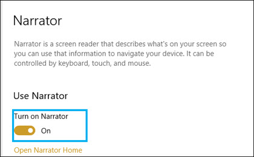

# Barrierefreiheitsmodus für SharePoint SyntexSharePoint Syntex accessibility mode

In [SharePoint Syntex](index.md)können Benutzer den Barrierefreiheitsmodus in allen Phasen der Modellschulung (Bezeichnung, Schulung, Test) beim Arbeiten mit Beispieldokumenten aktivieren.In [SharePoint Syntex](index.md), users can turn on accessibility mode in all stages of model training (label, train, test) when working with example documents. Die Verwendung des Barrierefreiheitsmodus kann Benutzern mit niedriger Sicht bei der Navigation und Beschriftung von Elementen in der Dokumentanzeige helfen, die Barrierefreiheit auf der Tastatur zu vereinfachen.Using accessibility mode can help low-sight users to have easier keyboard accessibility as they navigate and label items in the document viewer.

Auf diese Weise können Benutzer ihre Tastaturen verwenden, um durch Text in der Dokumentanzeige zu navigieren und eine Erzählung nicht nur der ausgewählten Werte, sondern auch von Aktionen (z. B. Beschriftung oder Entfernen von Bezeichnungen aus markierten Texten) oder vorhergesagte Beschriftungswerte zu hören, während Sie das Modell mit zusätzlichen Beispieldokumenten trainieren.This helps users to use their keyboards to navigate through text in the document viewer and to hear a narration of not only the selected values, but also of actions (such as labeling or removing labeling from selected text), or predicted label values as you train the model with additional example documents. 

## AnforderungenRequirements

Um die Audiodaten der Sprachausgabe zu hören, müssen Sie die [Sprachausgabe-App](https://support.microsoft.com/windows/complete-guide-to-narrator-e4397a0d-ef4f-b386-d8ae-c172f109bdb1) in Ihren Sprachausgabe auf Ihrem Windows 10 aktivieren.To hear the audio of the narration, make sure to turn on the [Narrator App](https://support.microsoft.com/windows/complete-guide-to-narrator-e4397a0d-ef4f-b386-d8ae-c172f109bdb1) in your Narrator settings on your Windows 10 system.

## Bezeichnung für TastaturbenutzerLabeling for keyboard users

Bei Tastaturbenutzern, die den Barrierefreiheitsmodus verwenden, können Sie die folgenden Tasten verwenden, wenn Sie Text in einem Beispieldokument im Viewer beschriften:For keyboard users using accessibility mode, if you are labeling text in an example document in the viewer, you can use the following keys:

- Tab: Verschiebt Sie vorwärts und wählt das nächste Wort aus.Tab: Moves you forward and selects the next word.
- Tabulator + Umschalt: Verschiebt Sie nach hinten und wählt das vorherige Wort aus.Tab + Shift: Moves you backwards and selects the previous word.
- Enter: Label or removes a label from the selected word.Enter: Label or removes a label from the selected word.
- Pfeil nach rechts: Verschiebt Sie durch einzelne Zeichen in einem ausgewählten Wort.Right arrow: Moves you forward through individual characters in a selected word.
- Pfeil nach links: Verschiebt Sie rückwärts durch einzelne Zeichen in einem ausgewählten Wort.Left arrow: Moves you backward through individual characters in a selected word.

> [!NOTE]
> Wenn Sie mehrere Wörter für eine einzelne Bezeichnung beschriften, müssen Sie jedes Wort beschriften.If you are labeling multiple words for a single label, you need to label each word.

## ErzählungNarration

Wenn Sprachausgabe Barrierefreiheitsmodus verwenden, verwenden Sie dieselbe Tastaturnavigation, die für Tastaturbenutzer beschrieben wird, um das Beispieldokument im Viewer zu durchgehen.For Narrator users using accessibility mode, use the same keyboard navigation described for keyboard users to go through the example document in the viewer.

Wenn Sie durch die Beispieldokumente und Beschriftungszeichenfolgenwerte navigieren, Sprachausgabe Benutzer die folgenden Audioaufforderungen erhalten:As you navigate through the sample documents and label string values, Narrator will give user the following audio prompts:

- Wenn Sie die Tastatur verwenden, um durch die Dokumentanzeige zu navigieren, Sprachausgabe audio die ausgewählte Zeichenfolge an.When you use the keyboard to navigate through the document viewer, Narrator audio will state the selected string.
- Innerhalb einer ausgewählten Zeichenfolge Sprachausgabe audio jedes Zeichen in der Zeichenfolge angeben, während Sie sie mithilfe der PFEILTASTEn nach links oder rechts auswählen.Within a selected string, Narrator audio will state each character in the string as you select them by using the left or right arrow keys.
- Wenn Sie eine Zeichenfolge auswählen, die beschriftet wurde, Sprachausgabe den Wert und dann "beschriftet" an.If you select a string that has been labeled, Narrator will state the value and then "labeled".  Wenn der Bezeichnungswert beispielsweise "Contoso" ist, wird "Costoso labeled" angegeben.For example, if the label value is "Contoso", it will state "Costoso labeled". 
- Wenn Sie auf der Registerkarte Schulung eine Zeichenfolge in der Dokumentanzeige auswählen, die nur vorhergesagt wurde, Sprachausgabe audio den Wert und dann "vorhergesagt".In the training tab, if you select a string in the document viewer that has only been predicted, Narrator audio will state the value, and then "predicted". Dies tritt auf, wenn die Schulung einen Wert in der Datei vorhersagt, der nicht mit dem vom Benutzer bezeichneten Wert übereinstimmen kann.This occurs when training predicts a value in the file that does not match what has been labeled by the user.
- Wenn Sie auf der Registerkarte Schulung eine Zeichenfolge in der Dokumentanzeige auswählen, die beschriftet und vorhergesagt wurde, gibt Sprachausgabe audio den Wert an, und dann "beschriftet und vorhergesagt".In the training tab, if you select a string in the document viewer that has been labeled and predicted, Narrator audio will state the value, and then "labeled and predicted". Dies tritt auf, wenn die Schulung erfolgreich ist und eine Übereinstimmung zwischen einem vorhergesagten Wert und der Benutzerbezeichnung besteht.This occurs when training is successful and there is a match between a predicted value and the user label.

Nachdem eine Zeichenfolge beschriftet oder eine Bezeichnung im Viewer entfernt wurde, warnt Sprachausgabe Audio, ihre Änderungen vor dem Beenden zu speichern.After a string is labeled or a label has been removed in the viewer, Narrator audio will warn you to save your changes before you exit.

## Siehe auchSee Also

[Erstellen eines ExtraktorsCreate an extractor](create-an-extractor.md) 

[Erstellen einer KlassifizierungCreate a classifier](create-a-classifier.md) 

 

  
  

