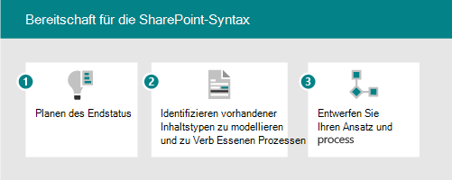

# Microsoft SharePoint Syntex-Einführung: Erste Schritte

Stellen Sie sich die intelligenten Inhaltsdienste vor, die in SharePoint Syntex verfügbar sind, als 3 Teile:

- **Grundlegendes zu Inhalten:** Erstellen Sie keine Code-KI-Modelle, um Informationen aus Inhalten zu klassifizieren und zu extrahieren, um Metadaten automatisch für die Wissenserkennung und -wiederverwendung anzuwenden. Erfahren Sie mehr über [das Verständnis von Inhalten.](document-understanding-overview.md)
- **Inhaltsverarbeitung:** Automatisieren Sie die Erfassung, Aufnahme und Kategorisierung von Inhalten, und optimieren Sie inhaltszentrierte Prozesse mithilfe Power Automate. Erfahren Sie mehr über [die Inhaltsverarbeitung](form-processing-overview.md).
- **Inhaltskonformität:** Steuern und Verwalten von Inhalten zur Verbesserung der Sicherheit und Steuerung mit integration in Microsoft Information Protection.

Mit neuen AI-Diensten und -Funktionen können Sie Inhaltsverständnis- und Klassifizierungs-Apps direkt in den Inhaltsverwaltungsfluss mit SharePoint erstellen. Es gibt zwei verschiedene Möglichkeiten, Ihre Inhalte zu verstehen. Der von Ihnen verwendete Modelltyp basiert auf dem Dateiformat und dem Verwendungsfall:

| Formularverarbeitung | Dokumentverständnis |
|:-------|:-------|
| Erstellt aus der Dokumentbibliothek. | Erstellt im Inhaltscenter, Teil von SharePoint Syntex. |
| Modell, das im KI-Generator erstellt wurde. | Modell, das in der systemeigenen Schnittstelle erstellt wurde. |
| Wird für semistrukturierte Dateiformate verwendet. | Wird für unstrukturierte Dateiformate verwendet. |
| Settable-Klassifikator. | Trainierbare Klassifizierung mit optionalen Extraktionen. |
| Auf eine einzelne Bibliothek beschränkt. | Kann auf mehrere Bibliotheken angewendet werden. |
| Train on PDF, JPG, PNG format, total 50 MB/500 pp. | Training auf 5–10 PDF-, Office- oder E-Mail-Dateien, einschließlich negativer Beispiele. |

Einen vollständigeren Vergleich der Funktionen finden Sie unter [Difference between document understanding and form processing models](difference-between-document-understanding-and-form-processing-model.md).

## Identifizieren von Zu optimierende Pilotgeschäftsszenarien

Um die Verwendung SharePoint Syntex in Ihrer Organisation vorzubereiten, müssen Sie zunächst die Szenarien verstehen, in denen sie nützlich sein wird. Das "Warum" hilft zu bestimmen, welches Modell benötigt wird, und wie Sie Ihre Organisation basierend auf dem Ort strukturieren, an dem das Modell angewendet wird. Im Folgenden finden Sie einige Szenarien, in denen Die Dokumentverständigung Ihrer Organisation helfen kann:

- **Inhaltsverarbeitung:** Verarbeiten von Verträgen, Arbeitsanweisungen und anderen formularverformten Dokumenten. Nehmen Sie die Formulare auf, schulen Sie das Modell, um die Felder zu verstehen und zu zuordnungen, und führen Sie dann Ihre Formulare durch, um die Daten automatisch zu erfassen. Weitere Informationen finden Sie unter [Übersicht über die Formularverarbeitung.](form-processing-overview.md)
- **Rechnungsanalyse:** Ziehen Sie die relevanten Details aus Ihren Rechnungen heraus, und stellen Sie sicher, dass sie den Richtlinien entsprechen oder entsprechend verarbeitet werden.

Überlegen Sie, wie SharePoint Syntex Ihrer Organisation helfen kann:

- Automatisieren von Geschäftsprozessen
- Verbessern der Suchgenauigkeit
- Verwalten des Compliancerisikos

Wenn Sie überlegen, welche Geschäftsszenarien sie berücksichtigen sollten, stellen Sie sich die folgenden Fragen:

- Löst sie ein echtes Problem?
- Wird sie weit verbreitet sein oder eine breite Wirkung haben?
- Ist sie erhältlich?
- Können Sie den Erfolg messen?

Priorisieren Sie Szenarien basierend auf auswirkungen und einfacher Implementierung. Machen Sie Ihren anfänglichen Fokusbereich zu szenarien mit höheren Auswirkungen, die auch einfach implementiert werden können. De priorisieren Sie Szenarien mit geringeren Auswirkungen, die schwer zu implementieren sind.

Verwenden Sie [die Beispielszenarien und Anwendungsfälle,](adoption-scenarios.md) um Ideen zur Verwendung SharePoint Syntex in Ihrer Organisation einzubringen.

## Identifizieren von Rollen & Verantwortlichkeiten

Bestimmen Sie, wer in Ihrer Organisation die Modelle erstellen und verwalten soll? Die folgenden Rollen können beteiligt sein:

| SharePoint/Knowledge Admin | Power Platform Admin | Wissensmanager | Modellbesitzer |
|:-------|:-------|:-------|:-------|
| AAD-Rolle| AAD-Rolle | AAD-Rolle | Experten |
| Konfigurieren der Formularverarbeitung | Konfigurieren der allgemeinen Datendienstumgebung für die Formularverarbeitung | Sammeln von Verwendungsfällen | Erfassen von Geschäftsnutzungsfällen |
| Verwalten von Inhaltscentern und -berechtigungen| Kaufen und Zuordnen von AIB-Guthaben | Einrichten bewährter Methoden und Überprüfen der Modellanalyse | Erstellen und Anwenden von Modellen |

Knowledge Manager, Geschäftsprozessbesitzer und Besitzer des Inhaltsmodells erstellen Beispielmodelle und unterstützen die Einführung in die Organisation.
Andere, die beteiligt sein können: Compliance-Administrator, Taxonomie-Manager.

Wo werden sie die Modelle erstellen und anwenden? Gibt es vorhandene Prozesse oder Repositorys, die erweitert werden könnten?

- Formularverarbeitung: Entscheiden Sie, welche Websites Die Formularverarbeitungsaktion erhalten soll.
- Dokumentverständnis: Sie können mehrere Inhaltscenter für verschiedene Geschäftsbereiche erstellen.

## Strategische Positionierung

Arbeiten Sie mit den Beteiligten zusammen, um sicherzustellen, dass sie an der Strategie für die Verwendung SharePoint Syntex ausgerichtet sind. Recherchiert und stellt die folgenden Ressourcen zur Verfügung, um bei dieser Positionierung zu helfen:

- Geschäftsergebnisse:
  - Mögliche geschäftspolitische Ergebnisse
  - Mögliche Agilitätsergebnisse
  - Vorlage für Geschäftsergebnis
- Stakeholders/Exec sponsor buy-in/alignment
  - Business Case Decks
  - Finanzmodelle
  - Unternehmensbereitschaft – Kultur

## Bestimmen der Beteiligten

Identifizieren Sie die Beteiligten für Ihr Projekt.

|Rolle |Responsibilities |Abteilung |
|:-------|:-------|:--------|
| Executive Sponsor(s)   | Kommunizieren Sie die übergeordnete Vision und die Werte des Unternehmens   |  Führungskräfte   |
| Project lead(s) | Überwachen Sie die gesamte Durchführung der Markteinführung und den Rollout-Prozess | Projektmanagement |
| Wissensadministratoren| Erstellen und Verwalten der Inhaltscenter | IT oder andere Abteilung|
| Inhaltsmanager und Modellbesitzer| Erfassen von Verwendungsfällen und Erstellen und Anwenden von Modellen | Jede Abteilung|
| Experten | Helfen Sie bei der Evangelisierung und bei der Behandlung von Einwänden | Jede Abteilung (Personal) |
| Mandantenadministrator | Konfigurieren von Einstellungen auf Mandantenebene | IT-Abteilung|
| Power Platform-Administrator| Gemeinsame Datendienstumgebung konfigurieren | IT-Abteilung|

> [!Note]
> Obwohl wir empfehlen, dass jede dieser Rollen während ihres Rollouts erfüllt wird, müssen Sie möglicherweise nicht alle rollen, um mit Ihrer identifizierten Lösung zu beginnen.

## Prüfliste zur Bereitschaft

Um die Implementierung von SharePoint Syntex zu implementieren, müssen Sie:

1. Planen des Endzustands
    - Dokumentverständnismodelle sind die Mittel und nicht das Ende.
    - Planen der Nutzung des Werts extrahierter Metadaten mit:
      - Suche
      - Filtern und Anzeigen von Formatierungen
      - Compliance
      - Automatisierung
2. Identifizieren
    - Verstehen der vorhandenen Informationsarchitektur und der Verwendung von Inhaltsverwaltungsfeatures.
    - Sind vorhandene Inhaltstypen gute Kandidaten für Modelle?
    - Welche vorhandenen Prozesse würden durch Metadaten verbessert?
3. Entwurf
    - Entwerfen Ihres Ansatzes für Informationsarchitektur, verwaltete Metadaten und Inhaltstypen
    - Entwerfen sie den Prozess für Definition, Erstellung, Verwaltung.

## Engagement Ihrer Organisation

1. Identifizieren von Beteiligungsinhabern, Bestätigen von Szenarien und Entwickeln eines Projektplans
1. Konfigurieren Sie Einstellungen, und wenden Sie Lizenzen an.
1. Sensibilisierung und Schulung – Rekrutieren von Champions.
1. Einführung in Phasen.  
1. Sammeln Sie Feedback und iterieren.
1. Wenn die Nutzung bei Bedarf anwächst, werden alle Guthaben des AI Builders geplant.

## Weitere Artikel

[Szenarien und Anwendungsfälle in SharePoint Syntex](adoption-scenarios.md)