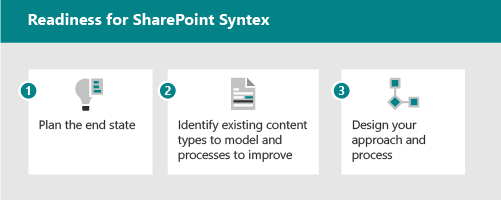

# Microsoft SharePoint Syntex-Einführung: Erste SchritteMicrosoft SharePoint Syntex adoption: Get started

Stellen Sie sich die intelligenten Inhaltsdienste vor, die in SharePoint Syntex verfügbar sind, als 3 Teile:Think of the intelligent content services available in SharePoint Syntex as having three parts:

- **Grundlegendes zu Inhalten:** Erstellen Sie keine Code-KI-Modelle, um Informationen aus Inhalten zu klassifizieren und zu extrahieren, um Metadaten automatisch für die Wissenserkennung und -wiederverwendung anzuwenden.**Content understanding:** Create no-code AI models to classify and extract information from content to automatically apply metadata for knowledge discovery and reuse. Erfahren Sie mehr über [das Verständnis von Inhalten.](document-understanding-overview.md)Learn more about [content understanding](document-understanding-overview.md).
- **Inhaltsverarbeitung:** Automatisieren Sie die Erfassung, Aufnahme und Kategorisierung von Inhalten, und optimieren Sie inhaltszentrierte Prozesse mithilfe Power Automate.**Content processing:** Automate capture, ingestion, and categorization of content and streamline content-centric processes using Power Automate. Erfahren Sie mehr über [die Inhaltsverarbeitung](form-processing-overview.md).Learn more about [content processing](form-processing-overview.md).
- **Inhaltskonformität:** Steuern und Verwalten von Inhalten zur Verbesserung der Sicherheit und Steuerung mit integration in Microsoft Information Protection.**Content compliance:** Control and manage content to improve security and governance with integration to Microsoft Information Protection.

Mit neuen AI-Diensten und -Funktionen können Sie Inhaltsverständnis- und Klassifizierungs-Apps direkt in den Inhaltsverwaltungsfluss mit SharePoint erstellen.With new AI services and capabilities, you can build content understanding and classification apps directly into the content management flow using SharePoint Syntex. Es gibt zwei verschiedene Möglichkeiten, Ihre Inhalte zu verstehen.There are two different ways of understanding your content. Der von Ihnen verwendete Modelltyp basiert auf dem Dateiformat und dem Verwendungsfall:The model type you use is based on file format and use case:

| FormularverarbeitungForm processing | DokumentverständnisDocument understanding |
|:-------|:-------|
| Erstellt aus der Dokumentbibliothek.Created from document library. | Erstellt im Inhaltscenter, Teil von SharePoint Syntex.Created in the content center, part of SharePoint Syntex. |
| Modell, das im KI-Generator erstellt wurde.Model created in AI builder. | Modell, das in der systemeigenen Schnittstelle erstellt wurde.Model created in native interface. |
| Wird für semistrukturierte Dateiformate verwendet.Used for semi-structured file formats. | Wird für unstrukturierte Dateiformate verwendet.Used for unstructured file formats. |
| Settable-Klassifikator.Settable classifier. | Trainierbare Klassifizierung mit optionalen Extraktionen.Trainable classifier with optional extractors. |
| Auf eine einzelne Bibliothek beschränkt.Restricted to a single library. | Kann auf mehrere Bibliotheken angewendet werden.Can be applied to multiple libraries. |
| Train on PDF, JPG, PNG format, total 50 MB/500 pp.Train on PDF, JPG, PNG format, total 50 MB/500 pp. | Training auf 5–10 PDF-, Office- oder E-Mail-Dateien, einschließlich negativer Beispiele.Train on 5-10 PDF, Office, or email files, including negative examples. |

Einen vollständigeren Vergleich der Funktionen finden Sie unter [Difference between document understanding and form processing models](difference-between-document-understanding-and-form-processing-model.md).For a more complete comparison of the capabilities, see [Difference between document understanding and form processing models](difference-between-document-understanding-and-form-processing-model.md).

## Identifizieren von Zu optimierende PilotgeschäftsszenarienIdentify pilot business scenarios to optimize

Um die Verwendung SharePoint Syntex in Ihrer Organisation vorzubereiten, müssen Sie zunächst die Szenarien verstehen, in denen sie nützlich sein wird.To prepare for using SharePoint Syntex in your organization, you first need to understand the scenarios in which it will be useful. Das "Warum" hilft zu bestimmen, welches Modell benötigt wird, und wie Sie Ihre Organisation basierend auf dem Ort strukturieren, an dem das Modell angewendet wird.The "why" helps determine what model will be needed, and how to structure your org based on where the model will be applied. Im Folgenden finden Sie einige Szenarien, in denen Die Dokumentverständigung Ihrer Organisation helfen kann:Here are a few scenarios where document understanding can help your organization:

- **Inhaltsverarbeitung:** Verarbeiten von Verträgen, Arbeitsanweisungen und anderen formularverformten Dokumenten.**Content processing:** Process contracts, statements of work, and other form-like documents. Nehmen Sie die Formulare auf, schulen Sie das Modell, um die Felder zu verstehen und zu zuordnungen, und führen Sie dann Ihre Formulare durch, um die Daten automatisch zu erfassen.Intake the forms, train the model to understand and map the fields, and then run your forms through to automatically collect the data. Weitere Informationen finden Sie unter [Übersicht über die Formularverarbeitung.](form-processing-overview.md)For more information, see [Form processing overview](form-processing-overview.md).
- **Rechnungsanalyse:** Ziehen Sie die relevanten Details aus Ihren Rechnungen heraus, und stellen Sie sicher, dass sie den Richtlinien entsprechen oder entsprechend verarbeitet werden.**Invoice analysis:** Pull out the relevant details from your invoices and make sure they're complying with policy or are being processed appropriately.

Überlegen Sie, wie SharePoint Syntex Ihrer Organisation helfen kann:Think about ways that SharePoint Syntex can help your organization:

- Automatisieren von GeschäftsprozessenAutomate business processes
- Verbessern der SuchgenauigkeitImprove search accuracy
- Verwalten des CompliancerisikosManage compliance risk

Wenn Sie überlegen, welche Geschäftsszenarien sie berücksichtigen sollten, stellen Sie sich die folgenden Fragen:When thinking about which business scenarios to consider, ask yourself the following questions:

- Löst sie ein echtes Problem?Does it solve a real problem?
- Wird sie weit verbreitet sein oder eine breite Wirkung haben?Will it be widely used or have broad impact?
- Ist sie erhältlich?Is it obtainable?
- Können Sie den Erfolg messen?Can you measure success?

Priorisieren Sie Szenarien basierend auf auswirkungen und einfacher Implementierung.Prioritize scenarios based on impact and ease of implementation. Machen Sie Ihren anfänglichen Fokusbereich zu szenarien mit höheren Auswirkungen, die auch einfach implementiert werden können.Make your initial focus area higher impact scenarios that can also be easily implemented. De priorisieren Sie Szenarien mit geringeren Auswirkungen, die schwer zu implementieren sind.De-prioritize lower impact scenarios that are hard to implement.

Verwenden Sie [die Beispielszenarien und Anwendungsfälle,](adoption-scenarios.md) um Ideen zur Verwendung SharePoint Syntex in Ihrer Organisation einzubringen.Use the [example scenarios and use cases](adoption-scenarios.md) to prompt ideas about how you can use SharePoint Syntex in your organization.

## Identifizieren von Rollen & VerantwortlichkeitenIdentify roles & responsibilities

Bestimmen Sie, wer in Ihrer Organisation die Modelle erstellen und verwalten soll?Determine who in your organization will build and manage the models? Die folgenden Rollen können beteiligt sein:The following roles might be involved:

| SharePoint/Knowledge AdminSharePoint/Knowledge admin | Power Platform AdminPower Platform admin | WissensmanagerKnowledge manager | ModellbesitzerModel owner |
|:-------|:-------|:-------|:-------|
| AAD-RolleAAD role| AAD-RolleAAD role | AAD-RolleAAD role | ExpertenChampions |
| Konfigurieren der FormularverarbeitungConfigure form processing | Konfigurieren der allgemeinen Datendienstumgebung für die FormularverarbeitungConfigure Common data service environment for form processing | Sammeln von VerwendungsfällenGather use cases | Erfassen von GeschäftsnutzungsfällenGather business use cases |
| Verwalten von Inhaltscentern und -berechtigungenManage content centers and permissions| Kaufen und Zuordnen von AIB-GuthabenPurchase and allocate AIB credits | Einrichten bewährter Methoden und Überprüfen der ModellanalyseEstablish best practices and review model analytics | Erstellen und Anwenden von ModellenCreate and apply models |

Knowledge Manager, Geschäftsprozessbesitzer und Besitzer des Inhaltsmodells erstellen Beispielmodelle und unterstützen die Einführung in die Organisation.Knowledge manager, Business Process Owner and Content model owner create sample models and champion adoption in the organization.
Andere, die beteiligt sein können: Compliance-Administrator, Taxonomie-Manager.Others who may be involved: Compliance admin, Taxonomy managers.

Wo werden sie die Modelle erstellen und anwenden?Where will they build and apply the models? Gibt es vorhandene Prozesse oder Repositorys, die erweitert werden könnten?Are there existing processes or repositories that could be enhanced?

- Formularverarbeitung: Entscheiden Sie, welche Websites Die Formularverarbeitungsaktion erhalten soll.Form processing: Decide which sites will get Form processing action.
- Dokumentverständnis: Sie können mehrere Inhaltscenter für verschiedene Geschäftsbereiche erstellen.Document understanding: You can create multiple content centers for different business areas.

## Strategische PositionierungStrategic positioning

Arbeiten Sie mit den Beteiligten zusammen, um sicherzustellen, dass sie an der Strategie für die Verwendung SharePoint Syntex ausgerichtet sind.Work with stakeholders to make sure they are aligned on the strategy for using SharePoint Syntex. Recherchiert und stellt die folgenden Ressourcen zur Verfügung, um bei dieser Positionierung zu helfen:Research and provide the following resources to help with this positioning:

- Geschäftsergebnisse:Business outcomes:
  - Mögliche geschäftspolitische ErgebnissePotential fiscal outcomes
  - Mögliche AgilitätsergebnissePotential agility outcomes
  - Vorlage für GeschäftsergebnisBusiness outcome template
- Stakeholders/Exec sponsor buy-in/alignmentStakeholders/Exec sponsor buy-in/alignment
  - Business Case DecksBusiness case decks
  - FinanzmodelleFinancial models
  - Unternehmensbereitschaft – KulturCompany readiness - culture

## Bestimmen der BeteiligtenIdentify stakeholders

Identifizieren Sie die Beteiligten für Ihr Projekt.Identify the stakeholders for your project.

|RolleRole |ResponsibilitiesResponsibilities |AbteilungDepartment |
|:-------|:-------|:--------|
| Executive Sponsor(s)Executive sponsor(s)   | Kommunizieren Sie die übergeordnete Vision und die Werte des UnternehmensCommunicate high-level vision and values to the company   |  FührungskräfteExecutive leadership   |
| Project lead(s)Project lead(s) | Überwachen Sie die gesamte Durchführung der Markteinführung und den Rollout-ProzessOversee the entire launch execution and rollout process | ProjektmanagementProject management |
| WissensadministratorenKnowledge administrators| Erstellen und Verwalten der InhaltscenterCreate and manage the content centers | IT oder andere AbteilungIT or other department|
| Inhaltsmanager und ModellbesitzerContent managers and model owners| Erfassen von Verwendungsfällen und Erstellen und Anwenden von ModellenGather use cases and create and apply models | Jede AbteilungAny department|
| ExpertenChampions | Helfen Sie bei der Evangelisierung und bei der Behandlung von EinwändenHelp evangelize and manage objection handling | Jede Abteilung (Personal)Any department (staff) |
| MandantenadministratorTenant administrator | Konfigurieren von Einstellungen auf MandantenebeneConfigure tenant-level settings | IT-AbteilungIT department|
| Power Platform-AdministratorPower Platform administrator| Gemeinsame Datendienstumgebung konfigurierenConfigure common data services environment | IT-AbteilungIT department|

> [!Note]
> Obwohl wir empfehlen, dass jede dieser Rollen während ihres Rollouts erfüllt wird, müssen Sie möglicherweise nicht alle rollen, um mit Ihrer identifizierten Lösung zu beginnen.Though we recommend having each of these roles fulfilled throughout your rollout, you may find that you don't require them all to get started with your identified solution.

## Prüfliste zur BereitschaftReadiness checklist

Um die Implementierung von SharePoint Syntex zu implementieren, müssen Sie:To get ready for implementing SharePoint Syntex, you need to:

1. Planen des EndzustandsPlan the end state
    - Dokumentverständnismodelle sind die Mittel und nicht das Ende.Document understanding models are the means, not the end.
    - Planen der Nutzung des Werts extrahierter Metadaten mit:Plan for harnessing the value of extracted metadata with:
      - SucheSearch
      - Filtern und Anzeigen von FormatierungenFiltering and view formatting
      - ComplianceCompliance
      - AutomatisierungAutomation
2. IdentifizierenIdentify
    - Verstehen der vorhandenen Informationsarchitektur und der Verwendung von Inhaltsverwaltungsfeatures.Understand existing information architecture and content management feature use.
    - Sind vorhandene Inhaltstypen gute Kandidaten für Modelle?Are any existing content types good candidates for models?
    - Welche vorhandenen Prozesse würden durch Metadaten verbessert?What existing processes would be improved by metadata?
3. EntwurfDesign
    - Entwerfen Ihres Ansatzes für Informationsarchitektur, verwaltete Metadaten und InhaltstypenDesign your approach to information architecture, managed metadata and content types
    - Entwerfen sie den Prozess für Definition, Erstellung, Verwaltung.Design the process for definition, creation, management.

## Engagement Ihrer OrganisationEngage your organization

1. Identifizieren von Beteiligungsinhabern, Bestätigen von Szenarien und Entwickeln eines ProjektplansIdentify stake holders, confirm scenarios, and develop project plan.
1. Konfigurieren Sie Einstellungen, und wenden Sie Lizenzen an.Configure settings and apply licenses.
1. Sensibilisierung und Schulung – Rekrutieren von Champions.Begin awareness and training – Recruit Champions.
1. Einführung in Phasen.Roll out in stages.  
1. Sammeln Sie Feedback und iterieren.Gather feedback and iterate.
1. Wenn die Nutzung bei Bedarf anwächst, werden alle Guthaben des AI Builders geplant.As usage grows plan for any AI Builder credits as needed.

## Siehe auchSee also

[Szenarien und Anwendungsfälle für SharePoint SyntexScenarios and use cases for SharePoint Syntex](adoption-scenarios.md)