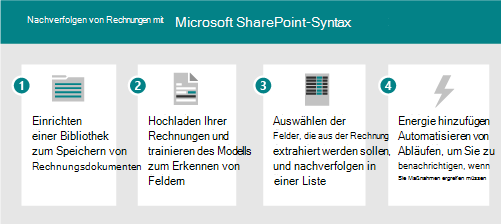
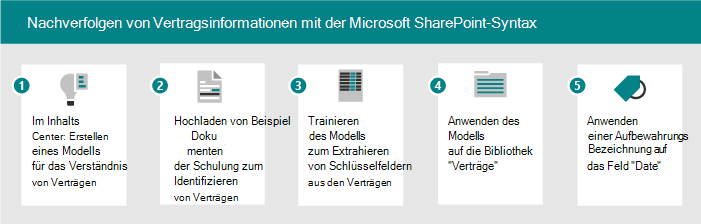

# Szenarien und Anwendungsfälle für Microsoft SharePoint SyntexScenarios and use cases for Microsoft SharePoint Syntex

Verwenden Sie die folgenden Beispielszenarien, um Ideen zur Verwendung SharePoint Syntex in Ihrer Organisation einzubringen.Use the following example scenarios to prompt ideas about how you can use SharePoint Syntex in your organization.

- [Szenario: Nachverfolgen von Daten aus Rechnungen mit FormularverarbeitungScenario: Track data from invoices with form processing](adoption-scenarios.md#scenario-track-data-from-invoices-with-form-processing)
- [Szenario: Nachverfolgen von Informationen aus Verträgen mit DokumentverständnisScenario: Track information from contracts with document understanding](adoption-scenarios.md#scenario-track-information-from-contracts-with-document-understanding)
- [Szenario: Vermeiden von Risiken durch Datensatzverwaltung, Dokumentverwaltung und Complianceprozesse basierend auf SharePoint SyntexScenario: Avoid risk with records management, document governance, and compliance processes based on SharePoint Syntex](adoption-scenarios.md#scenario-avoid-risk-with-records-management-document-governance-and-compliance-processes-based-on-sharepoint-syntex)
- [Szenario: Erfassen von Informationen aus zuvor nicht zugänglichen DokumentenScenario: Capture information from previously inaccessible documents](adoption-scenarios.md#scenario-capture-information-from-previously-inaccessible-documents)
- [Szenario: Verbessern der Datenverarbeitung zur Bereitstellung von Einblicken und AnalysenScenario: Improve data processing to provide insights and analytics](adoption-scenarios.md#scenario-improve-data-processing-to-provide-insights-and-analytics)
- [Szenario: Automatisieren der AuftragsverarbeitungScenario: Automate order processing](adoption-scenarios.md#scenario-automate-order-processing)
- [Szenario: Vereinfachung des VisaerneuerungsprozessesScenario: Simplify visa renewal process](adoption-scenarios.md#scenario-simplify-visa-renewal-process)

## Szenario: Nachverfolgen von Daten aus Rechnungen mit FormularverarbeitungScenario: Track data from invoices with form processing

Sie können z. B. einen Prozess mit SharePoint Syntex und Power Automate zum Nachverfolgen und Überwachen von Rechnungen einrichten.For example, you can set up a process using SharePoint Syntex and Power Automate features to track and monitor invoices.

1. Richten Sie eine Bibliothek zum Speichern der Rechnungsdokumente ein.Set up a library to store the invoice documents.
1. Schulen Sie das Modell, um Felder in den Dokumenten zu erkennen.Train the model to recognize fields in the documents.
1. Extrahieren Sie die Felder, die Sie in einer Liste nachverfolgen möchten.Extract the fields you want to track into a list.
1. Richten Sie einen Fluss ein, um Sie bei bestimmten Ereignissen zu benachrichtigen, z. B.:Set up a flow to notify you for specific events, such as:
    - Eine neue Rechnung wird hinzugefügt.A new invoice is added.
    - Eine Rechnung liegt nach dem Fälligkeitsdatum.An invoice is past its due date.
    - Eine Rechnung ist für einen Betrag, der größer ist als Der betrag für die automatische Genehmigung.An invoice is for an amount that's larger than your automatic approval amount.

Wenn Sie dieses Szenario automatisieren, können Sie:When you automate this scenario, you can:

- Sparen Sie Zeit und Geld, indem Sie Daten automatisch aus den Rechnungen extrahieren, anstatt dies manuell zu tun.Save time and money by automatically extracting data from the invoices instead of doing it manually.
- Reduzieren Sie potenzielle Fehler, und stellen Sie eine bessere Compliance sicher, indem Sie Mithilfe von Workflows Rechnungen überprüfen und Sie über probleme benachrichtigen.Reduce potential errors and ensure better compliance by using workflows to check invoices and notify you of any issues.

## Szenario: Nachverfolgen von Informationen aus Verträgen mit DokumentverständnisScenario: Track information from contracts with document understanding

Als weiteres Beispiel können Sie einen Prozess einrichten, um Verträge zu identifizieren, die Ihr Unternehmen mit anderen Unternehmen oder Einzelpersonen hat.As another example, you can set up a process to identify contracts your company has with other companies or individuals. Richten Sie ein Modell ein, um wichtige Informationen aus diesen Verträgen zu extrahieren, z. B. den Clientnamen, Gebühren, Datumsangaben oder andere wichtige Informationen, und fügen Sie die Informationen der Bibliothek als Felder hinzu, die Sie schnell anzeigen können.Set up a model to extract key information from those contracts, such as the client name, fees, dates, or other important information, and add the information to the library as fields you can quickly view. Wenden Sie eine Aufbewahrungsbezeichnung auf die Dokumentbibliothek an, um sicherzustellen, dass Verträge nicht vor einem bestimmten Zeitraum gelöscht werden können, um ihre Geschäftsbestimmungen entsprechend einzuhalten.Apply a retention label on the document library to ensure that contracts can't be deleted before a specific length of time for appropriate compliance with your business regulations.

1. Beginnen Sie im Inhaltscenter, und erstellen Sie ein neues Dokumentverständnismodell für Verträge.Start at the content center and create a new document understanding model for contracts.
1. Hochladen Sie Beispieldokumente für positive und negative Beispiele, führen Sie dann die Schulung aus, um Vertragsdokumente zu identifizieren und die Ergebnisse zu überprüfen.Upload sample documents for positive and negative examples, then run the training to identify contract documents and review the results.
1. Schulen Sie den Extractor, um Felder in den Verträgen zu identifizieren, z. B. den Clientnamen, die Gebühr und das Datum, und testen Sie dann die Extraktion.Train the extractor to identify fields in the contracts, such as the client name, fee, and date, and then test the extractor.
1. Wenn das Modell abgeschlossen ist, wenden Sie das Modell auf eine Bibliothek an, in der Sie Verträge hochladen können.When the model is complete, apply the model to a library where you can upload contracts.
1. Wenden Sie eine Aufbewahrungsbezeichnung auf das Datumsfeld an, damit Verträge für den erforderlichen Zeitraum in der Bibliothek aufbewahrt werden.Apply a retention label to the date field, so that contracts are retained in the library for the required length of time.

Wenn Sie dieses Szenario automatisieren, können Sie:When you automate this scenario, you can:

- Sparen Sie Zeit und Geld, indem Sie Daten automatisch aus den Verträgen extrahieren, anstatt dies manuell zu tun.Save time and money by automatically extracting data from the contracts instead of doing it manually.
- Stellen Sie mithilfe von Aufbewahrungsbezeichnungen eine bessere Compliance sicher, um sicherzustellen, dass die Verträge angemessen aufbewahrt werden.Ensure better compliance by using retention labels to ensure that the contracts are retained appropriately.

## Szenario: Vermeiden von Risiken durch Datensatzverwaltung, Dokumentverwaltung und Complianceprozesse basierend auf SharePoint SyntexScenario: Avoid risk with records management, document governance, and compliance processes based on SharePoint Syntex

Die Risikominderung ist für die meisten Unternehmen ein gemeinsames Ziel.Reducing risks is a common goal for most companies. Möglicherweise benötigen Sie:You might need:

- Eine bessere Möglichkeit zum Bereitstellen/Erzwingen der Informationsverwaltung in Ihrem Mandanten.A better way to provide/enforce information governance across your tenant.
- Zur Verbesserung des Systems für die Klassifizierung von Dokumenten, E-Mails und anderen Kommunikationsformen, die als "Datensätze" für Projekte betrachtet werden.To improve the system for classification of documents, emails and other forms of communication considered ‘records’ for projects.
- So überwachen Sie Quittungen, Verträge und so weiter, um die Einhaltung von Unternehmensrichtlinien sicherzustellen.To audit receipts, contracts, and so on, to ensure compliance with company policies.
- So stellen Sie sicher, dass für Projekte alle für die Compliance erforderlichen Dokumentationen zur Verfügung sind.To ensure that projects have all the documentation required for compliance.

Richten Sie einige Prozesse für die Einhaltung von SharePoint Syntex ein, um Dokumente und Formulare zu erfassen und entsprechend zu klassifizieren, zu überwachen und zu kennzeichnen, die eine bessere Steuerung benötigen.Set up some processes for compliance with SharePoint Syntex to capture and appropriately classify, audit, and flag documents and forms that need better governance. Sie können sich auf SharePoint Syntex verlassen, um Inhalte automatisch zu klassifizieren, anstatt sich darauf zu verlassen, dass Endbenutzer manuell taggen oder das Complianceteam Steuerungsregeln und Archivierung manuell anwenden kann.You can rely on SharePoint Syntex to auto classify content rather than relying on end users to manually tag, or the compliance team to manually apply governance rules and archiving. Und Sie können eine vereinfachte Suchfunktion aktivieren, Datenvolumes verwalten, Datensatzverwaltungs- und Aufbewahrungsrichtlinien anwenden, die Compliance sicherstellen und bewährte Archivierungs- und Bereinigungsmethoden sicherstellen.And you can enable a simplified search experience, manage data volumes, apply records management and retention policies, ensure compliance, and best practice archiving and purging practices.

Wenn Sie dieses Szenario automatisieren, können Sie sich sicher fühlen, dass:When you automate this scenario, you can feel secure that:

- Die Compliance wird bestätigt, und das Risiko wird reduziert.Compliance is upheld and risk is reduced.
- Taxonomie und Datensatzverwaltung werden konsistent und präzise angewendet.Taxonomy and records management is consistently and accurately applied.
- Inhaltsvolumes werden gesteuert.Content volumes are controlled.
- Mitarbeiter können problemlos die richtigen Informationen im richtigen Kontext finden.Employees can easily discover the right information in the right context.

## Szenario: Erfassen von Informationen aus zuvor nicht zugänglichen DokumentenScenario: Capture information from previously inaccessible documents

Die meisten Organisationen verfügen über umfangreiche Repositorys von Rechtsdokumenten, Richtlinien, Verträgen, Personaldokumenten und Steuerungsrichtlinien.Most organizations have large repositories of legal documents, policies, contracts, HR documents, and governance guidelines. Verwenden Sie diese Datenspeicher, um wertvolle Informationen zu extrahieren, z. B.: Projekte, Sektoren, Designs, Personen, geografische Regionen und so weiter.Mine these data stores to extract valuable information such as: projects, sectors, themes, people, geographical areas, and so on.

Beispielsweise muss ein Personalleiter schnell auf alle Personaldokumente zugreifen – einschließlich Lebenslauf, Personalrichtlinien und anderen Formularen.For example, an HR director needs to quickly access all HR documents – including resumes, HR policies, and other forms. Und sie möchten die erforderlichen Informationen aus Lebenslauf und anderen personalbezogenen Dokumenten schnell identifizieren, ohne die Dokumente manuell zu durchsingen.And they want to quickly identify necessary information from resumes and other HR-related documents without manually sifting through the documents. Sie suchen nach einer Lösung, mit der sie schnell die benötigten Informationen finden können, ohne tausende von Lebensläufen, Personalrichtlinien und andere Dokumentationen manuell durchschauen zu müssen, die möglicherweise auf mehrere Websites verteilt sind.They’re looking for a solution that allows them to quickly find the information they need without having to manually look through thousands of resumes, HR policies, and other documentation that may be spread across several sites.

Wenn Sie dieses Szenario automatisieren, können Sie:When you automate this scenario, you can:

- Entsperrung von Wissen aus digitalen Inhalten.Unlock knowledge from digital content.
- Klassifizieren Von Personalrichtlinien, Fortsetzungen, Verkaufsdokumenten, technischen Blaupausen, Kontoplänen und Extrahieren von Informationen.Classify HR policies, resumes, sales documents, technical blueprints, account plans and extract information.
- Finden Sie schnell die richtigen Informationen oder Dokumente, die Sie suchen.Quickly find the correct information or document that you’re looking for.
- Erhalten Sie sofortigen Zugriff auf die neuesten Informationen.Get instant access to the latest information.
- Reduzieren Sie die Suchzeiten.Reduce search times.

## Szenario: Verbessern der Datenverarbeitung zur Bereitstellung von Einblicken und AnalysenScenario: Improve data processing to provide insights and analytics

Beispielsweise könnte ein Pharmazeutisches Unternehmen SharePoint Syntex verwenden, um Informationen aus DENA-Dokumenten zu extrahieren, um Fragen zu beantworten, die ihre Führungskräfte haben.For example, a pharmaceutical company could use SharePoint Syntex to extract information from FDA documents to answer questions that their leaders have. Die einfachere Erreichbarkeit der Antworten kann den Zeitaufwand für die Erstellung dieser Antworten reduzieren und die Verfügbarkeit von Daten erhöhen, um genauere Antworten auf Führungsfragen zu erhalten.Having the answers more easily accessible can reduce the time needed to produce these answers and increase the availability of data to generate more accurate answers to leadership questions.

Beispielsweise muss ein Projektmanager schnell Antworten auf produktbezogene Fragen von meinem Führungsteam geben.For example, a project manager needs to quickly provide answers to product-related questions from my leadership team. Sie müssen Informationen und Metriken im Zusammenhang mit Abfragen in einem konsolidierten Dashboard finden.They need to find information and metrics related to queries in one consolidated dashboard. Sie suchen nach einer Lösung, die die benötigten Informationen aus Produktbezeichnungen, Produkt pamphlets und anderen Materialien extrahiert und einen konsolidierten Bericht generiert, den sie bei der Berichterstellung an ihr Führungsteam verwenden können.They’re looking for a solution that extracts the information they need from product labels, product pamphlets, and other materials and generates a consolidated report that they can use when reporting back to their leadership team.

Wenn Sie dieses Szenario automatisieren, können Sie:When you automate this scenario, you can:

- Reduzieren Sie die Zeit, um Antworten zu erhalten.Reduce time to produce answers.
- Erhöhen Sie die Verfügbarkeit von Daten.Increase availability of data.
- Geben Sie genauere Antworten.Provide more accurate answers.

## Szenario: Automatisieren der AuftragsverarbeitungScenario: Automate order processing

Mit SharePoint Syntex können Sie die Zeit für die manuelle Verarbeitung von Kundenbestellungen reduzieren.With SharePoint Syntex, you can reduce the time of manual processing of customer orders. Sie können z. B. Bestellungen aus Fax, E-Mail oder Papier mithilfe der OCR-Verarbeitung in SharePoint hochladen und dann die Metadaten aus diesen Bestellungen extrahieren, sodass Sie sie mithilfe automatisierter Prozesse erfüllen können.For example, you can upload orders from fax, email, or paper into SharePoint by using OCR processing and then extract the metadata from those orders so you can fulfill them by using automated processes.

Beispielsweise möchte ein Supply Chain Manager Fehler reduzieren, die durch die manuelle Dateneingabe verursacht werden.For example, a supply chain manager wants to reduce errors caused by manual data entry. Sie möchten eine manuelle Überprüfung und Dateneingabe eingehender Kundenbestellungen (Papier, Fax oder E-Mail) vermeiden, um Fehler in ihre Geschäftssysteme zu reduzieren.They want to avoid manual review and data entry of inbound customer orders (paper, fax, or e-mail) to reduce errors going into their business systems. Sie möchten eine Lösung, die KI- und maschinelle Lerntechniken verwendet, um eingehende Auftragsinformationen zu überprüfen, Kerndaten zu extrahieren und automatisch in ihr ERP-System zu übertragen, um Auftragserfüllung und -abstimmung zu erhalten.They want a solution that applies AI and machine learning techniques to validate incoming order information, extract core data and automatically push it into their ERP system, for order fulfillment and reconciliation.

Wenn Sie dieses Szenario automatisieren, können Sie sicherstellen, dass:When you automate this scenario, you can ensure that:

- Die Bestell- und Liefergenauigkeit wird erhöht.Order and shipment accuracy increases.
- Gebühren oder Strafen im Zusammenhang mit Bestell- oder Lieferfehlern werden reduziert.Fees or penalties associated to order or shipment errors are reduced.
- Verzögerungen bei der Rechnungsstellung oder bei Zahlungen werden verringert.Delays in invoicing or payments decrease.
- Die Personalkosten werden reduziert.Personnel costs are reduced.

## Szenario: Vereinfachung des VisaerneuerungsprozessesScenario: Simplify visa renewal process

SharePoint Mit Syntex können Sie Erinnerungen und Verlängerungen für wichtige Vertragsinformationen automatisieren.SharePoint Syntex can help you automate reminders and renewals for key contract information. Beispielsweise muss ein Personalleiter sicherstellen, dass die Visa der Mitarbeiter auf dem neuesten Stand sind und/oder zeitgemäß verlängert werden.For example, an HR director needs to ensure that employees’ visas are up to date and/or renewed on time. Sie möchten den Personen einen einfachen und intuitiven Prozess für die Aktualisierung ihrer Visa bieten.They want to give people a simple and intuitive process for updating their Visas. Sie benötigen eine Lösung, die Verlängerungstermine aus Verträgen extrahiert und mitarbeiter automatisch Erinnerungen sendet, wenn ihre Verlängerungstermine näher kommen.They need a solution that extracts renewal dates from contracts and automatically sends employees reminders when their renewal dates are approaching.

Wenn Sie dieses Szenario automatisieren, können Sie sicherstellen, dass:When you automate this scenario, you can ensure that:

- Die Einhaltungsstufen werden reduziert.The levels of non-compliance are reduced.
- Die Anzahl manueller Erinnerungen wird reduziert.The number of manual reminders is reduced.
- Die Anzahl der Bußgelder für Verstöße wird reduziert.The number of fines for non-compliance is reduced.

## Weitere ArtikelSee also

[Microsoft SharePoint Syntex-Einführung: Erste SchritteMicrosoft SharePoint Syntex adoption: Get started](adoption-getstarted.md)