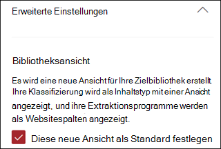
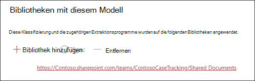
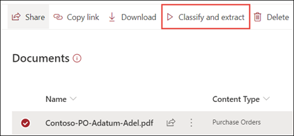

# Anwenden eines Dokument Verständnisses für das Modell (Vorschau)Apply a document understanding model (Preview)

> [!Note] 
> Der Inhalt dieses Artikels ist für Project Cortex private Preview.The content in this article is for Project Cortex Private Preview. [Erfahren Sie mehr über Project Cortex](https://aka.ms/projectcortex).[Find out more about Project Cortex](https://aka.ms/projectcortex).

 

> [!VIDEO https://www.microsoft.com/videoplayer/embed/RE4CSoL]

 

Nachdem Sie Ihr Dokument grundlegendes Modell veröffentlicht haben, können Sie es auf eine SharePoint-Dokumentbibliothek in Ihrem Microsoft 365-Mandanten anwenden.After publishing your document understanding model, you can apply it to a SharePoint document library in your Microsoft 365 tenant.

> [!Note]
> Sie können das Modell nur auf Dokumentbibliotheken anwenden, auf die Sie Zugriff haben.You will only be able to apply the model to document libraries that you have access to.

## Wenden Sie Ihr Modell auf eine Dokumentbibliothek an.Apply your model to a document library.

So wenden Sie Ihr Modell auf eine SharePoint-Dokumentbibliothek an:To apply your model to to a SharePoint document library:

1. Wählen Sie auf der Modell Startseite auf der Kachel **Modell auf Bibliotheken anwenden** die Option **Modell veröffentlichen**aus.On the model home page, on the **Apply model to libraries** tile, select **Publish model**. Sie können auch im Abschnitt **Bibliotheken mit diesem Modell** die Option **+ Bibliothek hinzufügen** auswählen.Or you can  select  **+Add Library** in the **Libraries with this model** section.  

     

2. Anschließend können Sie die SharePoint-Website auswählen, die die Dokumentbibliothek enthält, auf die Sie das Modell anwenden möchten.You can then select the SharePoint site that contains the document library that you want to apply the model to. Wenn die Website nicht in der Liste angezeigt wird, verwenden Sie das Suchfeld, um Sie zu finden.If the site does not show in the list, use the search box to find it. 

     

    > [!Note]
    > Sie müssen *Listenberechtigungen verwalten* oder *Bearbeitungs* Rechte für die Dokumentbibliothek haben, auf die Sie das Modell anwenden.You must have *Manage List* permissions or *Edit* rights to the document library you are applying the model to. 

3. Nachdem Sie die Website ausgewählt haben, müssen Sie die Dokumentbibliothek auswählen, auf die Sie das Modell anwenden möchten.After selecting the site, you then need to select the document library to which you want to apply the model. Im Beispiel wählen wir die Dokumentbibliothek *Dokumente* auf der *Fall Verfolgungs* Website von Contoso aus.In the example, we are selecting the *Documents* document library from the *Contoso Case Tracking* site. 

     

4. Da das Modell einem Inhaltstyp zugeordnet ist, wird beim Anwenden des Modells auf die Bibliothek eine Ansicht für den Inhaltstyp erstellt, wobei die von Ihnen extrahierten Beschriftungen als Spalten angezeigt werden.Since the model is associated to a content type, when you apply it to the library it will create a view for the content type with the labels you extracted showing as columns. Diese Ansicht ist standardmäßig die Standardansicht der Bibliothek, Sie können jedoch optional festlegen, dass Sie nicht die Standardansicht sein soll, indem Sie **Erweiterte Einstellungen** auswählen und die Option **Diese neue Ansicht als Standard festlegen**deaktivieren.This view will be the library's default view by default, but you can optionally choose to not have it be the default view by selecting **Advanced settings** and deselecting **Set this new view as default**. 

     

5. Wählen Sie **Hinzufügen** aus, um das Modell auf die Bibliothek anzuwenden.Select **Add** to apply the model to the library. 
6. Auf der Modell Homepage wird im Abschnitt **Bibliotheken mit diesem Modell** die URL zur SharePoint-Website angezeigt.On the model home page, in the **Libraries with this model** section, you will see the URL to the SharePoint site listed. 

     

7. Wechseln Sie zu Ihrer Dokumentbibliothek, und stellen Sie sicher, dass Sie sich in der Dokumentbibliotheksansicht des Modells befinden.Go to your document library and make sure you are in the model's document library view. Wenn Sie die Schaltfläche Informationen neben dem Namen der Dokumentbibliothek auswählen, wird in einer Meldung darauf hingewiesen, dass Ihr Modell auf die Dokumentbibliothek angewendet wurde.You'll notice that if you select the information button next to the document library name, a message will note that your model has been applied to the document library.

      

Nachdem Sie das Modell auf die Dokumentbibliothek angewendet haben, können Sie mit dem Hochladen von Dokumenten auf die Website beginnen und die Ergebnisse anzeigen.After applying the model to the document library, you can begin uploading documents to the site and see the results.

Das Modell identifiziert alle Dateien mit dem Modell zugeordneten Inhaltstyp und listet sie in ihrer Ansicht auf.The model will identify any files with model’s associated content type and will list them in your view. Wenn Ihr Modell über Extraktoren verfügt, werden in der Ansicht Spalten für die Daten angezeigt, die Sie aus jeder Datei extrahieren.If your model has any extractors, the view will display columns for the data you are extracting from each file.

### Anwenden des Modells auf Dateien, die sich bereits in der Dokumentbibliothek befindenApply the model to files already in the document library

Während ein angegebenes Modell alle Dateien verarbeitet, die nach der Anwendung in die Dokumentbibliothek hochgeladen wurden, können Sie auch die folgenden Schritte ausführen, um das Modell für Dateien auszuführen, die bereits in der Dokumentbibliothek vor dem Anwenden des Modells vorhanden waren:While an applied model will process all files uploaded to the document library after it is applied, you can also do the following to run the model on files that already existed in the document library prior to the model being applied:

1. Wählen Sie in Ihrer Dokumentbibliothek die Dateien aus, die von Ihrem Modell verarbeitet werden sollen.In your document library, select the files that you want to be processed by your model.
2. Nachdem Sie Ihre Dateien ausgewählt haben, werden **klassifizieren und extrahieren** im Menüband der Dokumentbibliothek angezeigt.After selecting your files, **Classify and extract** will appear in the document library ribbon. Wählen Sie **klassifizieren und extrahieren**aus.Select **Classify and extract**.
3. Die ausgewählten Dateien werden der Warteschlange hinzugefügt, die verarbeitet werden soll.The files you selected will be added to the queue to be processed.

        

## Siehe auchSee Also
[Erstellen einer KlassifizierungCreate a classifier](create-a-classifier.md) 
[Erstellen eines Extraktions ModulsCreate an extractor](create-an-extractor.md) 
[Dokument Verständnis ÜbersichtDocument Understanding overview](document-understanding-overview.md) 
[Erstellen eines Formular VerarbeitungsmodellsCreate a form processing model](create-a-form-processing-model.md)  

