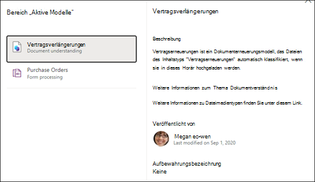
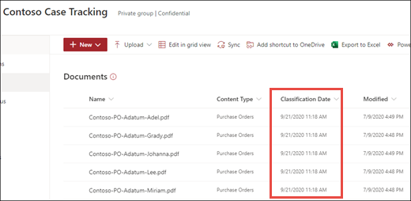

# Anwenden eines Dokumentverständnismodells in Microsoft SharePoint SyntexApply a document understanding model in Microsoft SharePoint Syntex

 

> [!VIDEO https://www.microsoft.com/videoplayer/embed/RE4CSoL]

 

Nach der Veröffentlichung des Dokumentverständnismodells können Sie es auf eine oder mehrere SharePoint-Dokumentbibliotheken in Ihrem Microsoft 365-Mandanten anwenden.After publishing your document understanding model, you can apply it to one or more SharePoint document library in your Microsoft 365 tenant.

> [!NOTE]
> Sie können das Modell nur auf Dokumentbibliotheken anwenden, auf die Sie Zugriff haben.You are only able to apply the model to document libraries that you have access to.

## Wenden Sie Ihr Modell auf eine Dokumentbibliothek an.Apply your model to a document library.

So wenden Sie Ihr Modell auf eine SharePoint-Dokumentbibliothek an:To apply your model to to a SharePoint document library:

1. Wählen Sie auf der Modellstartseite auf der Kachel **Modell auf Bibliotheken anwenden** die Option **Modell veröffentlichen** aus.On model home page, on the **Apply model to libraries** tile, select **Publish model**. Sie können auch  **+ Bibliothek hinzufügen** im Abschnitt **Bibliotheken mit diesem Modell** auswählen.Or you can select  **+Add Library** in the **Libraries with this model** section.  

     

2. Sie können dann die SharePoint-Website auswählen, die die Dokumentbibliothek enthält, auf die Sie das Modell anwenden möchten.You can then select the SharePoint site that contains the document library that you want to apply the model to. Wenn die Website in der Liste nicht angezeigt wird, verwenden Sie das Suchfeld, um Sie zu finden.If the site does not show in the list, use the search box to find it. 

     

    > [!NOTE]
    > Sie müssen über die Berechtigung *Listen verwalten* oder *Bearbeiten* für die Dokumentbibliothek verfügen, auf die Sie das Modell anwenden möchten.You must have *Manage List* permissions or *Edit* rights to the document library you are applying the model to. 

3. Nachdem Sie die Website ausgewählt haben, wählen Sie die Dokumentbibliothek aus, auf die Sie das Modell anwenden möchten.After selecting the site, select the document library to which you want to apply the model. Wählen Sie im Beispiel die Dokumentbibliothek *Dokumente* auf der Website *Contoso-Fallnachverfolgung* aus.In the sample, select the *Documents* document library from the *Contoso Case Tracking* site. 

     

4. Da das Modell einem Inhaltstyp zugeordnet ist, fügt es, wenn Sie es auf die Bibliothek anwenden, den Inhaltstyp und dessen Ansicht hinzu, wobei die Bezeichnungen, die Sie extrahiert haben, als Spalten angezeigt werden.Since the model is associated to a content type, when you apply it to the library it will add the content type and its view with the labels you extracted showing as columns. Diese Ansicht ist die Standardansicht der Bibliothek. Sie können aber auch eine andere Aussicht auswählen, indem Sie **Erweiterte Einstellungen** auswählen und die Auswahl für **Diese neue Anzeige als Standard festlegen** deaktivieren.This view is the library's default view by default, but you can optionally choose to not have it be the default view by selecting **Advanced settings** and deselecting **Set this new view as default**. 

     

5. Wählen Sie **Hinzufügen** aus, um das Modell auf die Bibliothek anzuwenden.Select **Add** to apply the model to the library. 
6. Auf der Modellstartseite sollte im Abschnitt **Bibliotheken mit diesem Modell** die URL der aufgelisteten SharePoint-Website angezeigt werden.On the model home page, in the **Libraries with this model** section, you should see the URL to the SharePoint site listed. 

     

7. Wechseln Sie zu Ihrer Dokumentbibliothek, und vergewissern Sie sich, dass Sie sich in der Dokumentbibliotheksanzeige des Modells befinden.Go to your document library and make sure you are in the model's document library view. Wenn Sie die Informationsschaltfläche neben dem Namen der Dokumentbibliothek auswählen, wird eine Nachricht angezeigt, die besagt, dass ein Modell auf die Dokumentbibliothek angewendet wurde.Notice that if you select the information button next to the document library name, a message notes that the document library has a model applied to it.

      

    Sie können **Aktiven Modelle anzeigen** auswählen, um Details zu allen Modellen anzuzeigen, die auf die Dokumentbibliothek angewendet wurden.You can the select **View active models** to see details about any models that are applied to the document library.

8. Im Bereich **Aktive Modelle** werden die Modelle angezeigt, die auf die Dokumentbibliothek angewendet wurden.In the **Active models** pane, you can see the models that are applied to the document library. Wählen Sie ein Modell aus, um weitere Details dazu anzuzeigen, z. B. eine Beschreibung des Modells, wer das Modell veröffentlicht hat und ob das Modell eine Aufbewahrungsbezeichnung auf die von ihm klassifizierten Dateien zutrifft.Select a model to see more details about it, such as a description of the model, who published the model, and if the model applies a retention label to the files it classifies.

      

Nachdem Sie das Modell auf die Dokumentbibliothek angewendet haben, können Sie mit dem Hochladen von Dokumenten auf die Website beginnen und die Ergebnisse anzeigen.After applying the model to the document library, you can begin uploading documents to the site and see the results.

Das Modell identifiziert alle Dateien mit dem zugeordneten Inhaltstyp des Modells und listet sie in Ihrer Ansicht auf.The model identifies any files with model’s associated content type and lists them in your view. Wenn Ihr Modell Extraktoren enthält, werden in der Ansicht Spalten für die Daten angezeigt, die Sie aus den einzelnen Dateien extrahieren.If your model has any extractors, the view displays columns for the data you are extracting from each file.

### Anwenden des Modells auf Dateien, die sich bereits in der Dokumentbibliothek befindenApply the model to files already in the document library

Während ein angewendetes Modell alle Dateien verarbeitet, die nach der Anwendung in die Dokumentbibliothek hochgeladen wurden, können Sie auch die folgenden Schritte ausführen, um das Modell für Dateien auszuführen, die bereits vor dem Anwenden des Modells in der Dokumentbibliothek vorhanden sind:While an applied model processes all files uploaded to the document library after it is applied, you can also do the following to run the model on files that already exists in the document library prior to the model being applied:

1. Wählen Sie in Ihrer Dokumentbibliothek die Dateien aus, die vom Modell verarbeitet werden sollen.In your document library, select the files that you want to be processed by your model.
2. Nach dem Auswählen der Dateien wird **Klassifizieren und extrahieren** im Menüband der Dokumentbibliothek angezeigt.After selecting your files, **Classify and extract** will appear in the document library ribbon. Wählen Sie **Klassifizieren und extrahieren** aus.Select **Classify and extract**.
3. Die ausgewählten Dateien werden der Warteschlange zur Verarbeitung hinzugefügt.The files you selected will be added to the queue to be processed.

        

> [!NOTE]
> Sie können einzelne Dateien in eine Bibliothek kopieren und auf ein Modell anwenden, aber keine Ordner.You can copy individual files to a library and apply them to a model, but not folders.

### Das Feld „Klassifizierungsdatum“The Classification Date field

Wenn ein SharePoint Syntex-Dokumentverständnis oder ein Formularverarbeitungsmodell auf eine Dokumentbibliothek angewendet wird, wird in das Bibliotheksschema ein Feld <b>Klassifizierungsdatum </b> aufgenommen.When a SharePoint Syntex document understanding or form processing model is applied to a document library, a <b> Classification date </b> field is included in the library schema. Dieses Feld ist standardmäßig leer, aber wenn Dokumente von einem Modell verarbeitet und klassifiziert werden, wird dieses Feld mit einem Datums-/Uhrzeitstempel der Fertigstellung aktualisiert.By default this field is empty, but when documents are processed and classified by a model, this field is updated with a date-time stamp of completion. 

     

Das Feld für das Klassifizierungsdatum wird vom Trigger [<b>Wenn eine Datei von einem Inhaltsverständnismodell klassifiziert wird</b> verwendet, ](https://docs.microsoft.com/connectors/sharepointonline/#when-a-file-is-classified-by-a-content-understanding-model) um einen Power Automate-Ablauf auszuführen, nachdem ein Syntex-Modell für das Verstehen von Inhalten die Verarbeitung einer Datei abgeschlossen und das Feld „Klassifizierungsdatum“ aktualisiert hat.The Classification date field is used by the [<b>When a file is classified by a content understanding model</b> trigger](https://docs.microsoft.com/connectors/sharepointonline/#when-a-file-is-classified-by-a-content-understanding-model) to run a Power Automate flow after a Syntex content understanding model has finished processing a file and updated the "Classification date" field.

    

Der Trigger <b>Wenn eine Datei von einem Inhaltsverständnissmodell klassifiziert wird</b> kann dann verwendet werden, um einen anderen Workflow unter Verwendung extrahierter Informationen aus der Datei zu starten.The <b>When a file is classified by a content understanding model</b> trigger can then be used to start another workflow using any  extracted information from the file.

## Siehe auchSee Also
[Erstellen einer KlassifizierungCreate a classifier](create-a-classifier.md)

[Erstellen eines ExtraktorsCreate an extractor](create-an-extractor.md)

[Übersicht über das DokumentenverständnisDocument Understanding overview](document-understanding-overview.md)

