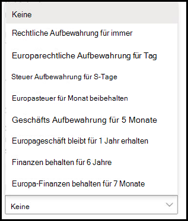

# Anwenden einer Aufbewahrungsbezeichnung auf ein Modell in SharePoint SyntexApply a retention label to a model in SharePoint Syntex

 

> [!VIDEO https://www.microsoft.com/videoplayer/embed/RE4GydO]  

 

Sie können auf einfache Weise eine [Aufbewahrungsbezeichnung](../compliance/retention.md) auf ein Modell in Microsoft SharePoint Syntex anwenden.You can easily apply a [retention label](../compliance/retention.md) to a model in Microsoft SharePoint Syntex. Sie können dies sowohl für Dokumentverständnis- als auch Formularverarbeitungsmodelle tun.You can do this for both document understanding and form processing models.

Aufbewahrungsbezeichnungen ermöglichen es Ihnen, Aufbewahrungseinstellungen auf die Dokumente anzuwenden, die von Ihrem Modell identifiziert werden.Retention labels let you apply retention settings to the documents that your models identify.  Sie könnten beispielsweise wollen, dass Ihr Modell nicht nur sämtliche *Versicherungsbestätigungen* erkennt, die in Ihre Dokumentbibliothek hochgeladen werden, sondern auf diese auch eine *Geschäftlich*-Aufbewahrungsbezeichnung anwendet, damit diese Dokumente für den angegebenen Zeitraum (beispielsweise für die nächsten fünf Monate) nicht gelöscht werden können.For example, you want your model to not only identify any *Insurance notice* documents that are uploaded to your document library, but to also apply a *Business* retention tag to them so that these documents cannot be deleted from the document library for the specified time period (the next five months, for example).

Über die Modelleinstellungen auf der Startseite Ihres Modells können Sie eine bereits vorhandene Aufbewahrungsbezeichnung auf Ihr Modell anwenden.You can apply a pre-existing retention label to your model through your model settings on your model's home page. 

> [!Important]
> Damit Aufbewahrungsbezeichnungen für die Anwendung auf Ihre Dokumentverständnismodelle verfügbar sind, müssen sie [im Microsoft 365 Compliance Center erstellt und veröffentlicht werden](../compliance/create-apply-retention-labels.md#how-to-create-and-publish-retention-labels).For retention labels to be available to apply to your document understanding models, they need to be [created and published in the Microsoft 365 Compliance Center](../compliance/create-apply-retention-labels.md#how-to-create-and-publish-retention-labels).

## So fügen Sie einem Dokumentverständnismodell eine Aufbewahrungsbezeichnung hinzuTo add a retention label to a document understanding model

1. Wählen Sie auf der Modell-Startseite **Modelleinstellungen** aus.From the model home page, select **Model settings**. 
2. Wählen Sie in den **Modelleinstellungen** im Abschnitt **Sicherheit und Compliance** das Menü **Aufbewahrungsbezeichnung** aus, um eine Liste der Aufbewahrungsbezeichnungen anzuzeigen, die auf das Modell angewendet werden können.In **Model settings**, in the **Security and compliance** section, select the **Retention label** menu to see a list of retention labels that are available for your to apply to the model. 
   
3. Wählen Sie die Aufbewahrungsbezeichnung aus, die auf das Modell angewendet werden soll, und wählen Sie **Speichern** aus.Select the retention label you want to apply to the model, and then select **Save**. 

Nachdem Sie die Aufbewahrungsbezeichnung auf das Modell angewendet haben, kann sie auf Folgendes angewendet werden:After applying the retention label to your model, you are able to apply it to a:
- Neue DokumentbibliothekNew document library
- Dokumentbibliothek, auf die das Modell bereits angewendet wirdDocument library to which the model is already applied
 
## Anwenden der Aufbewahrungsbezeichnung auf eine Dokumentbibliothek, auf die das Modell bereits angewendet wirdApply the retention label to a document library to which the model is already applied

Wenn Ihr Dokumentverständnismodell bereits auf eine Dokumentbibliothek angewendet wurde, können Sie die folgenden Schritte ausführen, um das Aufbewahrungsbezeichnungsupdate mit Ihrem Modell zu synchronisieren, so dass es auf Ihre Dokumentbibliothek angewendet wird:If your document understanding model has already been applied to a document library, you can do the following to sync your retention label update to apply it to the document library: 

1. Wählen Sie auf der Startseite Ihres Modells im Abschnitt **Bibliotheken mit diesem Modell** die Dokumentbibliothek aus, auf die das Aufbewahrungsbezeichnungsupdate angewendet werden soll.On your model home page, in the **Libraries with this model** section, select the document library to which you want to apply the retention label update.   
2. Wählen Sie **Synchronisieren** aus.Select **Sync**.  
   

Nachdem das Update angewendet und mit Ihrem Modell synchronisiert wurde, können Sie folgendermaßen vorgehen, um zu überprüfen, ob es angewendet wurde:After applying the update and syncing it to your model, you can confirm that it has been applied by doing the following:

1. Klicken Sie im Inhaltscenter im Abschnitt **Bibliotheken mit diesem Modell** auf die Bibliothek, auf die das aktualisierte Modell angewendet wurde.In the content center, in the **Libraries with this model** section, click on the library to which your updated model was applied.  
2. Wählen Sie in der Dokumentbibliotheksansicht das Symbol "Informationen" aus, um die Modelleigenschaften zu überprüfen.In your document library view, select the information icon to check the model properties.   
3. Wählen Sie in der Liste **Aktive Modelle** das aktualisierte Modell aus.In the **Active models** list, select your updated model. 
4. Im Abschnitt **Aufbewahrungsbezeichnung** wird der Name der angewendeten Aufbewahrungsbezeichnung angezeigt.In the **Retention label** section you will see the name of the applied retention label. 

Auf der Ansichtsseite Ihres Modells in Ihrer Dokumentbibliothek wird eine neue Spalte **Aufbewahrungsbezeichnung** angezeigt.On your model's view page in your document library, a new **Retention label** column will display.  Wenn Ihr Modell ermittelte Dateien als seinem Inhaltstyp zugeordnet klassifiziert und sie in der Bibliotheksansicht auflistet, wird in der Spalte "Aufbewahrungsbezeichnung" auch der Name der Aufbewahrungsbezeichnung angezeigt, das auf sie über das Modell angewendet wurde.As your model classifies files it identifies as belonging to it's content type and lists them in the library view, the Retention label column will also display the name of the retention label that has been applied to it through the model.

So wird beispielsweise auf alle *Versicherungsbestätigungen*, die von Ihrem Modell identifiziert wurden, auch die *Geschäftlich*-Aufbewahrungsbezeichnung angewendet, wodurch sie für fünf Monate nicht aus der Dokumentbibliothek gelöscht werden können.For example, all *Insurance notice* documents that your model identifies will also have the *Business* retention label applied to them, preventing them from being deleted from the document library for five months. Wenn versucht wird, eine solche Datei aus der Dokumentbibliothek zu löschen, wird eine Fehlermeldung angezeigt mit dem Hinweis, dass dies aufgrund der angewendeten Aufbewahrungsbezeichnung nicht zulässig ist.If an attempt is made to delete the file from the document library, an error will display saying it is not allowed because of the applied retention label.

## So fügen Sie einem Formularverarbeitungsmodell eine Aufbewahrungsbezeichnung hinzuTo add a retention label to a form processing model

> [!Important]
> Damit Aufbewahrungsbezeichnungen für die Anwendung auf Ihre Formularverarbeitungsmodelle verfügbar sind, müssen sie [im Microsoft 365 Compliance Center erstellt und veröffentlicht werden](../compliance/create-apply-retention-labels.md#how-to-create-and-publish-retention-labels).For retention labels to be available to apply to your form processing model, they need to be [created and published in the Microsoft 365 Compliance Center](../compliance/create-apply-retention-labels.md#how-to-create-and-publish-retention-labels).

Sie können eine Aufbewahrungsbezeichnung entweder auf ein Formularverarbeitungsmodell anwenden, wenn Sie ein Modell erstellen, oder auf ein vorhandenes Modell anwenden.You can either apply a retention label to a form processing model when you are creating a model, or apply it to an existing model.

### So fügen Sie eine Aufbewahrungsbezeichnung hinzu, wenn Sie ein Formularverarbeitungsmodell erstellenTo add a retention label when you create a form processing model

1. Wenn Sie ein [Formularverarbeitungsmodell erstellen](./create-a-form-processing-model.md), wählen Sie <b>erweiterte Einstellungen</b> aus.When you are [creating a new form processing model](./create-a-form-processing-model.md), select <b>Advanced settings.</b>
2. Wählen Sie unter <b>Erweiterte Einstellungen</b> im Abschnitt <b>Aufbewahrungsbezeichnung</b> das Menü aus, und wählen Sie dann die Aufbewahrungsbezeichnung aus, die Sie auf das Modell anwenden möchten.</b>In <b>Advanced settings</b>, in the <b>Retention label</b> section, select the menu and then select the retention label you want to apply to the model.</b>

 
      

3.  Nachdem Sie die verbleibenden Modelleinstellungen abgeschlossen haben, wählen Sie <b>Erstellen</b> aus, um Ihr Modell zu erstellen.After you've completed your remaining model settings, select <b>Create</b> to build your model.

### So fügen Sie einem bestehenden Formularverarbeitungsmodell eine Aufbewahrungsbezeichnung hinzuTo add a retention label to an existing form processing model

Sie können einem bestehenden Formularverarbeitungsmodell auf verschiedene Arten eine Aufbewahrungsbezeichnung hinzufügen:You can add a retention label to an existing form processing model in different ways:
- Über das Menü „Automatisieren“ in der DokumentbibliothekThrough the Automate menu in the document library
- Über die Einstellungen der Aktiven Modelle in der DokumentbibliothekThrough the Active model settings in the document library 

#### So fügen Sie einem bestehenden Formularverarbeitungsmodell über das Menü „Automatisieren“ eine Aufbewahrungsbezeichnung hinzuTo add a retention label to an existing form processing model through the Automate menu

Sie können einem vorhandenen Formularverarbeitungsmodell, das Ihnen gehört, über das Menü „Automatisieren“ in der Dokumentbibliothek, auf die das Modell angewendet wird, eine Aufbewahrungsbezeichnung hinzufügen.You can add a retention label to an existing form processing model that you own through the Automate menu in the document library in which the model is applied.

1. Wählen Sie in Ihrer Dokumentbibliothek, auf die das Formularverarbeitungsmodell angewendet wird, das Menü <b>Automatisieren</b>, anschließend <b>KI-Generator</b> und dann <b>Formularverarbeitungsmodelldetails anzeigen</b> aus.In your document library to which the form processing model is applied, select the <b>Automate</b> menu, select <b>AI Builder</b>, then select <b>View form processing model details</b>.

    

2. Wählen Sie in den Modelldetails im Bereich <b>Aufbewahrungsbezeichnung</b> die Aufbewahrungsbezeichnung aus, die Sie anwenden möchten.In the model details, in the <b>Retention Label</b> section, select the retention label you want to apply.  Klicken Sie dann auf <b>Speichern</b>.Then select <b>Save</b>.

       

#### So fügen Sie einem bestehenden Formularverarbeitungsmodell in Einstellungen der Aktiven Modelle eine Aufbewahrungsbezeichnung hinzuTo add a retention label to an existing form processing model in the active model settings

Sie können einem vorhandenen Formularverarbeitungsmodell, das Ihnen gehört, über die Einstellungen der Aktiven Modelle in der Dokumentbibliothek, auf die das Modell angewendet wird, eine Aufbewahrungsbezeichnung hinzufügen.You can add a retention label to an existing form processing model that you own through the Active model settings in the document library in which the model is applied.

1. Wählen Sie in der SharePoint-Dokumentbibliothek, auf die das Modell angewendet ist, das Symbol <b>Aktive Modelle anzeigen</b> und dann <b>Aktive Modelle anzeigen</b>.</b>In the SharePoint document library in which the model is applied, select the <b>View active models</b> icon, and then select <b>View active models</b>.</b>

     

2. Wählen Sie unter <b>Aktive Modelle</b>das Formularverarbeitungsmodell aus, auf das Sie die Aufbewahrungsbezeichnung anwenden möchten.In <b>Active models</b>, select the form processing model to which you want to apply the retention label.

       

3. Wählen Sie in den Modelldetails im Bereich <b>Aufbewahrungsbezeichnung</b> die Aufbewahrungsbezeichnung aus, die Sie anwenden möchten.In the model details, in the <b>Retention Label</b> section, select the retention label you want to apply.  Klicken Sie dann auf <b>Speichern</b>.Then select <b>Save</b>.

> [!NOTE]
> Sie müssen der Modellbesitzer sein, damit der Bereich für Modelleinstellungen bearbeitet werden kann.You must be the model owner for the model settings pane to be editable. 

## Siehe auchSee Also
[Erstellen einer KlassifizierungCreate a classifier](create-a-classifier.md)

[Erstellen eines ExtraktorsCreate an extractor](create-an-extractor.md)

[Übersicht über das DokumentenverständnisDocument Understanding overview](document-understanding-overview.md)
