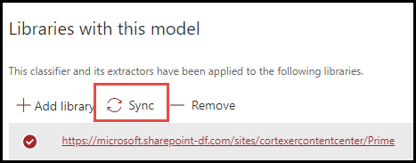

# Anwenden einer Aufbewahrungs Bezeichnung auf ein Dokument grundlegendes ModellApply a retention label to a document understanding model

 

> [!VIDEO https://www.microsoft.com/videoplayer/embed/RE4CSoL]

 

Sie können eine [Aufbewahrungs Bezeichnung](https://docs.microsoft.com/microsoft-365/compliance/retention) ganz einfach auf ein Dokument grundlegendes Modell in Microsoft SharePoint Syntex anwenden.You can easily apply a [retention label](https://docs.microsoft.com/microsoft-365/compliance/retention) to a document understanding model in Microsoft SharePoint Syntex.

Mit Aufbewahrungs Bezeichnungen können Sie Aufbewahrungseinstellungen auf die Dokumente anwenden, die Ihr Dokument als Verständnis für Modelle identifiziert.Retention labels let you apply retention settings to the documents that your document understanding models identify.  Beispielsweise möchten Sie, dass Ihr Modell nicht nur *Versicherungs* Schutz Dokumente identifiziert, die in Ihre Dokumentbibliothek hochgeladen werden, sondern auch ein Aufbewahrungstags für die *Geschäfts* Aufbewahrung aufwendet, damit diese Dokumente für den angegebenen Zeitraum (beispielsweise die nächsten fünf Monate) nicht aus der Dokumentbibliothek gelöscht werden können.For example, you want your model to not only identify any *Insurance notice* documents that are uploaded to your document library, but to also apply a *Business* retention tag to them so that these documents cannot be deleted from the document library for the specified time period (the next five months, for example).

Sie können eine bereits vorhandene Aufbewahrungs Bezeichnung auf Ihr Dokument Verständnis Modell über Ihre Modelleinstellungen auf der Startseite Ihres Modells anwenden.You can apply a pre-existing retention label to your document understanding model through your model settings on your model's home page. 

> [!Important]
> Damit Aufbewahrungs Bezeichnungen auf ihr Inhaltsmodell angewendet werden können, müssen Sie [im Microsoft 365 Compliance Center erstellt und veröffentlicht](https://docs.microsoft.com/microsoft-365/compliance/create-apply-retention-labels#how-to-create-and-publish-retention-labels)werden.For retention labels to be available to apply to your content understanding model, they need to be [created and published in the Microsoft 365 Compliance Center](https://docs.microsoft.com/microsoft-365/compliance/create-apply-retention-labels#how-to-create-and-publish-retention-labels).

## So fügen Sie einem Dokument Understanding Model eine Aufbewahrungs Bezeichnung hinzuTo add a retention label to a document understanding model

1. Wählen Sie auf der Modell Startseite **Modelleinstellungen**aus.From the model home page, select **Model settings**. 
2. Wählen Sie unter **Modelleinstellungen**im Abschnitt **Sicherheit und Kompatibilität** das Menü **Aufbewahrungs Bezeichnung** aus, um eine Liste der Aufbewahrungs Bezeichnungen anzuzeigen, die für das Modell zur Verfügung stehen.In **Model settings**, in the **Security and compliance** section, select the **Retention label** menu to see a list of retention labels that are available for your to apply to the model. 
   
3. Wählen Sie die Aufbewahrungs Bezeichnung aus, die Sie auf das Modell anwenden möchten, und wählen Sie dann **Speichern**aus.Select the retention label you want to apply to the model, and then select **Save**. 

Nachdem Sie die Aufbewahrungs Bezeichnung auf Ihr Modell angewendet haben, können Sie Sie auf eine anwenden:After applying the retention label to your model, you are able to apply it to a:
- Neue DokumentbibliothekNew document library
- Dokumentbibliothek, auf die das Modell bereits angewendet wurdeDocument library to which the model is already applied
 
## Anwenden der Aufbewahrungs Bezeichnung auf eine Dokumentbibliothek, auf die das Modell bereits angewendet wurdeApply the retention label to a document library to which the model is already applied

Wenn Ihr Dokument grundlegendes Modell bereits auf eine Dokumentbibliothek angewendet wurde, können Sie die folgenden Schritte ausführen, um das Update für die Aufbewahrungs Bezeichnung zu synchronisieren und es auf die Dokumentbibliothek anzuwenden:If your document understanding model has already been applied to a document library, you can do the following to sync your retention label update to apply it to the document library: 

1. Wählen Sie auf der Startseite des Modells im Abschnitt **Bibliotheken mit diesem Modell** die Dokumentbibliothek aus, auf die Sie das Update für die Aufbewahrungs Bezeichnung anwenden möchten.On your model home page, in the **Libraries with this model** section, select the document library to which you want to apply the retention label update.   
2. Wählen Sie **Sync**aus.Select **Sync**.  
   

Nachdem Sie das Update angewendet und mit Ihrem Modell synchronisiert haben, können Sie bestätigen, dass es angewendet wurde, indem Sie die folgenden Schritte ausführen:After applying the update and syncing it to your model, you can confirm that it has been applied by doing the following:

1. Klicken Sie im inhaltscenter im Abschnitt **Bibliotheken mit diesem Modell** auf die Bibliothek, auf die ihr aktualisiertes Modell angewendet wurde.In the content center, in the **Libraries with this model** section, click on the library to which your updated model was applied.  
2. Wählen Sie in der Ansicht Dokumentbibliothek das Informationssymbol aus, um die Modelleigenschaften zu überprüfen.In your document library view, select the information icon to check the model properties.   
3. Wählen Sie in der Liste **aktive Modelle** das aktualisierte Modell aus.In the **Active models** list, select your updated model. 
4. Im Abschnitt **Aufbewahrungs Bezeichnung** wird der Name der angewendeten Aufbewahrungs Bezeichnung angezeigt.In the **Retention label** section you will see the name of the applied retention label. 

Auf der Ansichtsseite Ihres Modells in Ihrer Dokumentbibliothek wird eine neue Spalte für die **Aufbewahrungs Bezeichnung** angezeigt.On your model's view page in your document library, a new **Retention label** column will display.  Wenn Ihr Modell die Dateien klassifiziert, die es als Zugehörigkeit zum Inhaltstyp identifiziert und in der Bibliotheksansicht auflistet, wird in der Spalte Aufbewahrungs Bezeichnung auch der Name der Aufbewahrungs Bezeichnung angezeigt, die über das Modell auf Sie angewendet wurde.As your model classifies files it identifies as belonging to it's content type and lists them in the library view, the Retention label column will also display the name of the retention label that has been applied to it through the model.

Beispielsweise wird für alle *Versicherungs* Schutz Dokumente, die Ihr Modell identifiziert, auch die *Geschäfts* Aufbewahrungs Bezeichnung angewendet, wodurch verhindert wird, dass Sie fünf Monate lang aus der Dokumentbibliothek gelöscht werden.For example, all *Insurance notice* documents that your model identifies will also have the *Business* retention label applied to them, preventing them from being deleted from the document library for five months. Wenn versucht wird, die Datei aus der Dokumentbibliothek zu löschen, wird eine Fehlermeldung angezeigt, die besagt, dass Sie aufgrund der angewendeten Aufbewahrungs Bezeichnung nicht zulässig ist.If an attempt is made to delete the file from the document library, an error will display saying it is not allowed because of the applied retention label.

## Siehe auchSee Also
[Erstellen einer KlassifizierungCreate a classifier](create-a-classifier.md) 
[Erstellen eines Extraktions ModulsCreate an extractor](create-an-extractor.md) 
[Dokument Verständnis ÜbersichtDocument Understanding overview](document-understanding-overview.md) 
[Erstellen eines Formular VerarbeitungsmodellsCreate a form processing model](create-a-form-processing-model.md)  
