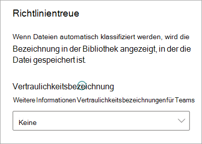

# Anwenden einer Vertraulichkeitsbezeichnung auf ein Modell in Microsoft SharePoint Syntex

Sie können auf einfache Weise eine [Vertraulichkeitsbezeichnung](../compliance/sensitivity-labels.md) auf Dokumentverständnismodelle in Microsoft SharePoint Syntex anwenden. Dieses Feature ist in Formularverarbeitungsmodellen noch nicht verfügbar.

Mit Vertraulichkeitsbezeichnungen können Sie Richtlinien für Verschlüsselung, Freigabe und bedingten Zugriff auf Dokumente anwenden, die Ihr Modell identifiziert. Sie möchten zum Beispiel, dass Ihr Modell nicht nur alle Finanzdokumente identifiziert, die Bankkontonummern oder Kreditkartennummern enthalten, die in Ihre Dokumentbibliothek hochgeladen werden, sondern auch eine Vertraulichkeitsbezeichnung für die *Verschlüsselung* auf diese Dokumente anwendet, um einzuschränken, wer auf diese Inhalte zugreifen kann und wie sie verwendet werden können. SharePoint Syntex-Modelle berücksichtigen die Regeln für die [Bezeichnungsreihenfolge](../compliance/apply-sensitivity-label-automatically.md?view=o365-worldwide#how-multiple-conditions-are-evaluated-when-they-apply-to-more-than-one-label) und überschreiben auch keine vorhandene Bezeichnung, die von einem Benutzer manuell auf die Datei angewendet wurde. 

Über die Modelleinstellungen auf der Startseite Ihres Modells können Sie eine bereits vorhandene Vertraulichkeitsbezeichnung auf Ihr Modell anwenden. Die Bezeichnung muss bereits veröffentlicht sein, um für die Auswahl in „Modelleinstellungen“ verfügbar zu sein.

> [!Important]
> Damit Vertraulichkeitsbezeichnungen für die Anwendung auf Ihre Dokumentverständnismodelle verfügbar sind, müssen sie [im Microsoft 365 Compliance Center erstellt und veröffentlicht werden](../business-video/create-sensitivity-labels.md).

## Hinzufügen einer Vertraulichkeitsbezeichnung auf ein Dokumentverständnismodell

1. Wählen Sie auf der Modell-Startseite **Modelleinstellungen** aus.

   

2. Wählen Sie im Bereich **Modelleinstellungen** im Abschnitt **Compliance** das Menü **Vertraulichkeitsbezeichnung** aus, um eine Liste der Vertraulichkeitsbezeichnungen anzuzeigen, die Sie auf das Modell anwenden können.

    

3. Wählen Sie die Vertraulichkeitsbezeichnung aus, die auf das Modell angewendet werden soll, und wählen Sie **Speichern** aus.

Nachdem Sie die Vertraulichkeitsbezeichnung auf Ihr Modell angewandt haben, können Sie es auf Folgendes anwenden:

- Neue Dokumentbibliothek
- Dokumentbibliothek, auf die das Modell bereits angewendet wird
 
### Anwenden der Vertraulichkeitsbezeichnung auf eine Dokumentbibliothek, auf die das Modell bereits angewendet wird

Wenn Ihr Dokumentverständnismodell bereits auf eine Dokumentbibliothek angewendet wurde, können Sie die folgenden Schritte ausführen, um die Aktualisierung Ihrer Vertraulichkeitsbezeichnung mit Ihrem Modell zu synchronisieren, so dass diese auf Ihre Dokumentbibliothek angewendet wird:

1. Wählen Sie auf der Startseite Ihres Modells im Abschnitt **Bibliotheken mit diesem Modell** die Dokumentbibliothek aus, auf welche die Aktualisierung der Vertraulichkeitsbezeichnung angewendet werden soll.

2. Wählen Sie **Synchronisieren** aus.

   

Nachdem Sie die Aktualisierung angewendet und mit Ihrem Modell synchronisiert haben, können Sie die folgenden Schritte ausführen, um zu überprüfen, ob es angewendet wurde:

1. Wählen Sie im Inhaltscenter im Abschnitt **Bibliotheken mit diesem Modell** die Bibliothek aus, auf die das aktualisierte Modell angewendet wurde. 

2. Wählen Sie in der Dokumentbibliotheksansicht das Symbol "Informationen" aus, um die Modelleigenschaften zu überprüfen.

3. Wählen Sie in der Liste **Aktive Modelle** das aktualisierte Modell aus.

4. Im Abschnitt **Vertraulichkeitsbezeichnung** werden Sie den Namen der angewendeten Vertraulichkeitsbezeichnung sehen.

Auf der Ansichtsseite Ihres Modells in Ihrer Dokumentbibliothek wird eine neue Spalte **Vertraulichkeitsbezeichnung** angezeigt. Wenn Ihr Modell identifizierte Dateien als seinem Inhaltstyp zugeordnet klassifiziert und sie in der Bibliotheksansicht auflistet, wird in der Spalte **Vertraulichkeitsbezeichnung** auch der Name der Vertraulichkeitsbezeichnung angezeigt, die über das Modell auf die Dateien angewendet wurde.

Beispielsweise werden alle Finanzdokumente, die Ihr Modell identifiziert, ebenfalls mit der Vertraulichkeitsbezeichnung *Verschlüsselung* versehen, um zu verhindern, dass nicht autorisierte Personen auf sie zugreifen können. Wenn eine nicht autorisierte Person versucht, auf die Datei in der Dokumentbibliothek zuzugreifen, wird eine Fehlermeldung angezeigt, die besagt, dass der Zugriff aufgrund der angewendeten Vertraulichkeitsbezeichnung nicht zulässig ist.

<!---
## Add a sensitivity label to a form processing model

> [!Important]
> For sensitivity labels to be available to apply to your form processing model, they need to be [created and published in the Microsoft 365 Compliance Center](../business-video/create-sensitivity-labels.md).

You can either apply a sensitivity label to a form processing model when you are creating a model, or apply it to an existing model.

### Add a sensitivity label when you create a form processing model

1. When you [create a new form processing model](create-a-form-processing-model.md), select **Advanced settings**.

2. In **Advanced settings**, in the **Sensitivity label** section, select the menu and then select the sensitivity label you want to apply to the model.

3.  After you've completed your remaining model settings, select **Create** to build your model.

### Add a sensitivity label to an existing form processing model

You can add a sensitivity label to an existing form processing model in different ways:

- Through the **Automate** menu in the document library
- Through the **Active model** settings in the document library 

#### Add a sensitivity label to an existing form processing model through the Automate menu

You can add a sensitivity label to an existing form processing model that you own through the **Automate** menu in the document library in which the model is applied.

1. In your document library to which the form processing model is applied, select the **Automate** menu, select **AI Builder**, and then select **View form processing model details**.

2. On the **Model details** pane, in the **Sensitivity label** section, select the sensitivity label you want to apply. Then select **Save**.

#### Add a sensitivity label to an existing form processing model in the active model settings

You can add a sensitivity label to an existing form processing model that you own through the **Active model** settings in the document library in which the model is applied.

1. In the SharePoint document library in which the model is applied, select the **View active models** icon, and then select **View active models**.

2. In **Active models**, select the form processing model to which you want to apply the sensitivity label.

3. On the **Model details** pane, in the **Sensitivity label** section, select the sensitivity label you want to apply. Then select **Save**.

   > [!NOTE]
   > You must be the model owner for the **Model settings** pane to be editable. 
--->

## Weitere Informationen

[Anwenden einer Aufbewahrungsbezeichnung](apply-a-retention-label-to-a-model.md)

[Erstellen einer Klassifizierung](create-a-classifier.md)

[Erstellen eines Extraktors](create-an-extractor.md)

[Übersicht über das Dokumentenverständnis](document-understanding-overview.md)
