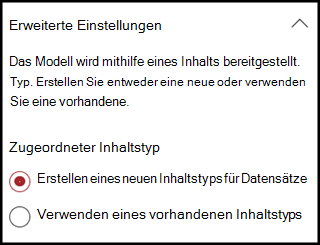

# Erstellen einer Klassifizierung (Vorschau)Create a classifier (Preview)

> [!Note] 
> Der Inhalt dieses Artikels ist für Project Cortex private Preview.The content in this article is for Project Cortex Private Preview. [Erfahren Sie mehr über Project Cortex](https://aka.ms/projectcortex).[Find out more about Project Cortex](https://aka.ms/projectcortex).

 

> [!VIDEO https://www.microsoft.com/videoplayer/embed/RE4CL0R]  

 

Eine Klassifizierung ist ein Modelltyp, der die Identifizierung und Klassifizierung eines Dokumenttyps automatisiert.A classifier is a type of model that automates identification and classification of a document type. Beispielsweise können Sie alle *Vertrags Erneuerungs* Dokumente identifizieren, die Ihrer Dokumentbibliothek hinzugefügt werden, beispielsweise die folgenden.For example, you may want to identify all *Contract Renewal* documents that are added to your document library, such as the following.

Durch das Erstellen einer Klassifizierung wird ein neuer [SharePoint-Inhaltstyp](https://docs.microsoft.com/sharepoint/governance/content-type-and-workflow-planning#content-type-overview) erstellt, der dem Modell zugeordnet wird.Creating a classifier will create a new [SharePoint Content Type](https://docs.microsoft.com/sharepoint/governance/content-type-and-workflow-planning#content-type-overview) that will be associated to the model.

Beim Erstellen der Klassifizierung müssen Sie *Erläuterungen* erstellen, mit denen das Modell definiert wird, indem Sie allgemeine Daten notieren, die Sie für diesen Dokumenttyp einheitlich finden würden.When creating the classifier, you need to create *explanations* that help to define the model by noting common data that you would expect to find consistently for this document type. 

Sie verwenden Beispiele für den Dokumenttyp ("Beispieldateien"), um Ihr Modell zu unterstützen, um Dateien mit dem gleichen Inhaltstyp zu identifizieren.You use examples of the document type ("example files") to help "train" your model to identify files that have the same content type.

Um eine Klassifizierung zu erstellen, müssen Sie Folgendes tun:To create a classifier, you need to:
1. Benennen Ihres ModellsName your model
2. Hinzufügen von BeispieldateienAdd your example files
3. Bezeichnen der BeispieldateienLabel your example files
4. Erstellen einer ErklärungCreate an explanation
5. Testen des ModellsTest your model 

> [!Note]
> Während eine Klassifizierung von Ihrem Modell zum Identifizieren und Klassifizieren von Dokumenttypen verwendet wird, können Sie auch auswählen, dass bestimmte Informationen aus jeder Datei abgerufen werden, die vom Modell identifiziert wird.While a classifier is used by your model to identify and classify document types, you can also choose to pull specific pieces of information from each file identified by the model. Erstellen Sie dazu einen **Extraktor** , der zu Ihrem Modell hinzugefügt werden soll, und dies wird unter [Create a Extractor](create-an-extractor.md)beschrieben.You do this by creating an **extractor** to add to your model, and this is described in [Create an extractor](create-an-extractor.md).

## Benennen Ihres ModellsName your model

Der erste Schritt besteht darin, Ihr Modell im Inhalts Center zu erstellen, indem Sie ihm einen Namen geben:The first step is to create your model in your Content Center by giving it a name:

1. Klicken Sie in Ihrem Inhalts Center auf **neu**, und klicken Sie dann auf **Modell erstellen**.In your Content Center, click **New**, and then click **Create a model**.
2. Geben Sie im **neuen Dokument grundlegendes Modell** im Feld **Name** den Namen des Modells ein.In the **New document understanding model** pane, in the **Name** field, type the name of the model. Wenn wir zum Beispiel Vertrags Erneuerungs Dokumente identifizieren möchten, können wir diese Modell *Vertragserneuerung*nennen.For our example, if we want to identify contract renewal documents, we might name this model *Contract Renewal*.
3. Klicken Sie auf **Erstellen**.Click **Create**. Dadurch wird eine Startseite für das Modell erstellt.This will create a home page for the model. 

    

Wenn Sie ein Modell erstellen, erstellen Sie einen neuen SharePoint-Inhaltstyp.When you create a model, you are creating a new SharePoint content type. Ein SharePoint-Inhaltstyp stellt eine Kategorie von Dokumenten dar, die allgemeine Merkmale aufweisen und eine Auflistung von Spalten oder Metadaten-Eigenschaften für diesen bestimmten Inhalt gemeinsam verwenden.A SharePoint content type represents a category of documents that have common characteristics and share a collection of columns or metadata properties for that particular content. SharePoint-Inhaltstypen werden über den [Inhaltstypen Katalog]()verwaltet.SharePoint Content Types are managed through the [Content types gallery](). Für unser Beispiel wird beim Erstellen des Modells ein neuer Inhaltstyp für die *Vertragserneuerung* erstellt.For our example, when we create the model, we will be creating a new *Contract Renewal* content type.

Wählen Sie **Erweiterte Einstellungen** aus, wenn Sie dieses Modell einem vorhandenen Inhaltstyp im SharePoint-Inhaltstypen Katalog zuordnen möchten, um sein Schema zu verwenden.Select **Advanced settings** if you want to map this model to an existing content type in the SharePoint Content types gallery to use its schema. Beachten Sie, dass Sie zwar einen vorhandenen Inhaltstyp verwenden können, um sein Schema zur Unterstützung bei der Identifizierung und Klassifizierung zu nutzen, aber Sie müssen Ihr Modell dennoch trainieren, um Informationen aus den identifizierten Dateien zu extrahieren.Note that while you can use an existing content type to leverage its schema to help with identification and classification, you will still need to train your model to extract information from files it identifies. 

## Hinzufügen von BeispieldateienAdd your example files

Auf der Modell Homepage können Sie Ihre Beispieldateien hinzufügen, die Sie bei der Schulung des Modells zur Identifizierung Ihres Dokumenttyps unterstützen müssen.On the model home page, you can add your examples files you will need to help train the model to identify your document type.  
 

> [!VIDEO https://www.microsoft.com/videoplayer/embed/RE4D0iX] 

 

> [!Note]
> Die gleichen Dateien sollten sowohl für die Klassifizierung als auch für [Extraktions Schulungen](create-an-extractor.md)verwendet werden.The same files should be used for both classifier and [extractor training](create-an-extractor.md). Sie haben immer die Option, später hinzuzufügen, aber in der Regel sollten Sie einen vollständigen Reihe von Beispieldateien hinzufügen.You always have the option to add more later, but typically you should add a full set of example files. Sie bezeichnen einige zur Schulung Ihres Modells und testen die restlichen unbeschrifteten, um die Modell Eignung auszuwerten.You will label some to train your model, and test the remaining unlabeled ones to evaluate model fitness. 

Für Ihr Schulungspaket sollten Sie sowohl positive Beispiele als auch negative Beispiele verwenden:For your training set, you will want to use both positive examples, and negative examples:
- Positives Beispiel: Dokumente, die den Dokumenttyp darstellen.Positive example: Documents that represent the document type. Sie enthalten Zeichenfolgen und Informationen, die immer in dieser Art von Dokument sein würden.They contain strings and information that would always be in this type of document.
- Negatives Beispiel: Dokumente, die nicht den Dokumenttyp darstellen.Negative example: Documents that do not represent the document type.  Es fehlen Zeichenfolgen und Informationen, die in dieser Art von Dokument vorhanden sein müssen.They are missing strings and information that needs to be present in this type of document.

Sie sollten mindestens fünf positive Beispiele und ein negatives Beispiel zur Schulung Ihres Modells verwenden.You will want to use at least five positive examples and one negative examples to train your model.  Sie benötigen zusätzliche, um Ihr Modell nach dem Training zu testen.You will want to have additional ones to test your model after training.

So fügen Sie Beispieldateien hinzu:To add sample files:

1. Klicken Sie auf der Modell Startseite in der Kachel **Beispielbibliothek erstellen** auf **Dateien hinzufügen**.On the model home page, in the **Build sample library** tile, click **Add files**.
2. Wählen Sie auf der Seite **Beispieldateien für Ihr Modell auswählen** ihre Beispieldateien aus der Bibliothek Beispieldateien im Inhalts Center aus.On the **Select sample files for your model** page, select your example files from the Sample files library in the Content Center. Wenn Sie Sie nicht bereits hochgeladen haben, können Sie Sie jetzt hochladen, indem Sie auf **hochladen** klicken, um Sie in die Beispieldatei Bibliothek zu versetzen.If you had not already uploaded them there, you can choose to upload them now by clicking **Upload** to move them the Sample file library.
3. Nachdem Sie Ihre Beispieldateien ausgewählt haben, die zum Trainieren des Modells verwendet werden sollen, klicken Sie auf **Hinzufügen**.After selecting your example files to use to train the model, click **Add**.

     

## Bezeichnen der BeispieldateienLabel your example files

Nachdem Sie Ihre Beispieldateien hinzugefügt haben, müssen Sie Sie als positive Beispiele oder negative Beispiele bezeichnen.After adding your example files, you then need to label them as either positive examples or negative examples.

1. Klicken Sie auf der Modell Homepage auf der Kachel **Dateien klassifizieren und Schulungsverlauf ausführen** auf **Klassifizierung Klassifizierer**.On the model home page, on the **Classify files and run training** tile, click **Train Classifier**.
   Dadurch wird die Bezeichnungs Seite angezeigt, auf der eine Liste der Beispieldateien angezeigt wird, wobei die erste Datei im Viewer angezeigt wird.This will display the label page that shows a listing of your example files, with the first file visible in the viewer.
2. Im Viewer wird am Anfang der ersten Beispieldatei der Text angezeigt, in dem Sie gefragt werden, ob es sich bei der Datei um ein Beispiel des soeben erstellten Modells handelt.In the viewer, on the top of the first example file, you will see text asking you if the file is an example of the model you just created. Wenn es sich um ein positives Beispiel handelt, wählen Sie **Ja**aus.If it is a positive example, select **Yes**. Wenn es sich um ein negatives Beispiel handelt, wählen Sie **Nein**aus.If it is a negative example, select **No**.
3. Wählen Sie in der Liste mit den **beschrifteten Beispielen** auf der linken Seite zusätzliche Dateien aus, die Sie als Beispiele verwenden möchten, und beschriften Sie diese ebenfalls.From the **Labeled examples** list on the left, select additional files that you want to use as examples, and label them as well. 

     

> [!Note]
> Beschriften Sie mindestens fünf positive Beispiele und ein negatives Beispiel.Label at least five positive examples, and one negative example. 

## Erstellen einer ErklärungCreate an explanation

Der nächste Schritt besteht darin, eine Erläuterung auf der Seite "Train" zu erstellen.The next step is to create an explanation on the Train page.  Eine Erklärung ist ein Hinweis oder Anhaltspunkt, um dem Modell zu helfen, zu verstehen, wie dieses Dokument erkannt wird.An explanation is a hint or clue to help the model understand how to recognize this document. Beispielsweise enthalten unsere Vertrags Erneuerungs Dokumente immer eine *Anforderung für zusätzliche Textzeichenfolge für die Offenlegung* .For example, our Contract Renewal documents always contain a *Request for additional disclosure* text string.

> [!Note]
> Bei Verwendung mit Extraktoren wird eine Erläuterung verwendet, um die Zeichenfolge zu identifizieren, die Sie aus dem Dokument extrahieren möchten.When used with extractors, an explanation is use to identify the string that you want to extract from the document. 

So erstellen Sie eine Erläuterung:To create an explanation:

1. Klicken Sie auf der Modell Startseite auf die Registerkarte **Zug** , um zur Seite Zug zu gelangen.On the model home page, click the **Train** tab to go to the Train page.
2. Auf der Seite "Train" im Abschnitt " **geschulte Dateien** " wird eine Liste der Beispieldateien angezeigt, die Sie zuvor beschriftet hatten.On the Train page, in the **Trained files** section, you will see a list of the example files that you had labeled previously. Wählen Sie eine der positiven Dateien aus der Liste aus, die im Viewer angezeigt wird.Select one of your positive files from the list, and it will display in the viewer.
3. Klicken Sie im Abschnitt Erläuterung auf **neu**, und klicken Sie dann auf **leer**.In the Explanation section, click **New**, then click **Blank**.
4. Auf der Seite **Erklärung erstellen** :On the **Create an explanation** page: 
    a.a. Geben Sie den **Namen** ein (beispielsweise "Offenlegungs Block").Type the **Name** (for example, "Disclosure Block"). 
    b.b. Wählen Sie den **Typ**aus.Select the **Type**. Für unser Beispiel wählen wir " **Phrase List**" aus, da wir eine Textzeichenfolge hinzufügen.For our example, we'll select **Phrase list**, since we are adding a text string. 
    c.c. Geben Sie im Feld **Typ hier** die Zeichenfolge ein.In the **Type here** box, type the string.  Für unser Beispiel fügen wir "Anforderung zusätzlicher Offenlegung" hinzu.For our example, we'll add "Request for additional disclosure". Sie können die **groß** -/Kleinschreibung beachten, wenn bei der Zeichenfolge die Groß-/Kleinschreibung beachtet werden muss.You can select **Case sensitive** if the string needs to be case sensitive. 
    d.d. Klicken Sie auf **Speichern**.Click **Save**.

     
    
 
5.  Das Modell überprüft nun, ob die von Ihnen erstellte Erklärung gut genug ist, um die verbleibenden beschrifteten Beispieldateien ordnungsgemäß als positive und negative Beispiele zu identifizieren.The model will now check to see if the explanation you created was good enough to identify your remaining labeled example files correctly as positive and negative examples. Überprüfen Sie im Abschnitt ausgebildete Dateien nach Abschluss der Schulung die Spalte **Auswertung** , um die Ergebnisse anzuzeigen.In Trained Files section, check the **Evaluation** column after the training has completed to see the results.  Die Dateien zeigen den Wert **Match** an, wenn die von Ihnen erstellte Erklärung genug entspricht, was Sie als (positiv oder negativ) bezeichnet haben.The files will show a value of **Match** if the explanation you created was enough to match what you had labeled them as (positive or negative).

     

Wenn Sie eine **Übereinstimmung** bei ihren beschrifteten Dateien erhalten, müssen Sie möglicherweise eine zusätzliche Erläuterung erstellen, um das Modell mit weiteren Informationen zum Identifizieren des Dokumenttyps zu versehen.If you receive a **Mismatch** on your labeled files, you may need to create an additional explanation to provide the model more information to identify the document type. Sie können auf die Datei klicken, um weitere Informationen dazu zu erhalten, warum der Konflikt aufgetreten ist.You can click on the file to get more information about why the mismatch occurred.

## Testen des ModellsTest your model

Wenn Sie eine Übereinstimmung mit den beschrifteten Beispieldateien erhalten haben, können Sie Ihr Modell nun auf ihren restlichen unbeschrifteten Beispieldateien testen.If you received a match on your labeled example files, you can now test your model on your remaining unlabeled example files.

1. Klicken Sie auf der Modell Startseite auf die Registerkarte **Test** .  Dadurch wird das Modell für Ihre unbeschrifteten Beispieldateien ausgeführt.On the model home page, click the **Test** tab.  This will run the model on your unlabeled example files.
2. In der Liste **Test Dateien** werden Ihre Beispieldateien angezeigt, und es wird angezeigt, ob das Modell positive oder negative Beispiele vorausgesagt hat.In the **Test files** list, your example files will display and will show if the model predicted them to be positive or negative examples. Anhand dieser Informationen können Sie die Effektivität ihrer Klassifizierung bei der Identifizierung Ihrer Dokumente ermitteln.You can use this information to help determine the effectiveness of your classifier in identifying your documents.

     

## Siehe auchSee Also
[Erstellen eines Extraktions ModulsCreate an extractor](create-an-extractor.md) 
[Dokument Verständnis ÜbersichtDocument Understanding overview](document-understanding-overview.md) 
[Erstellen eines Formular VerarbeitungsmodellsCreate a form processing model](create-a-form-processing-model.md) 
[Anwenden eines ModellsApply a model](apply-a-model.md) 

