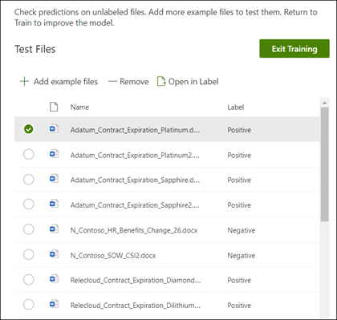

# Erstellen einer Klassifizierung (Vorschau)

> [!Note] 
> Der Inhalt dieses Artikels ist für Project Cortex private Preview. [Erfahren Sie mehr über Project Cortex](https://aka.ms/projectcortex).

 

> [!VIDEO https://www.microsoft.com/videoplayer/embed/RE4CL0R]  

 

Eine Klassifizierung ist ein Modelltyp, der die Identifizierung und Klassifizierung eines Dokumenttyps automatisiert. Beispielsweise können Sie alle *Vertrags Erneuerungs* Dokumente identifizieren, die Ihrer Dokumentbibliothek hinzugefügt werden, beispielsweise die folgenden.

Durch das Erstellen einer Klassifizierung wird ein neuer [SharePoint-Inhaltstyp](https://docs.microsoft.com/sharepoint/governance/content-type-and-workflow-planning#content-type-overview) erstellt, der dem Modell zugeordnet wird.

Beim Erstellen der Klassifizierung müssen Sie *Erläuterungen* erstellen, mit denen das Modell definiert wird, indem Sie allgemeine Daten notieren, die Sie für diesen Dokumenttyp einheitlich finden würden. 

Sie verwenden Beispiele für den Dokumenttyp ("Beispieldateien"), um Ihr Modell zu unterstützen, um Dateien mit dem gleichen Inhaltstyp zu identifizieren.

Um eine Klassifizierung zu erstellen, müssen Sie Folgendes tun:
1. Benennen Ihres Modells
2. Hinzufügen von Beispieldateien
3. Bezeichnen der Beispieldateien
4. Erstellen einer Erklärung
5. Testen des Modells 

> [!Note]
> Während eine Klassifizierung von Ihrem Modell zum Identifizieren und Klassifizieren von Dokumenttypen verwendet wird, können Sie auch auswählen, dass bestimmte Informationen aus jeder Datei abgerufen werden, die vom Modell identifiziert wird. Erstellen Sie dazu einen **Extraktor** , der zu Ihrem Modell hinzugefügt werden soll, und dies wird unter [Create a Extractor](create-an-extractor.md)beschrieben.

## Benennen Ihres Modells

Der erste Schritt besteht darin, Ihr Modell im Inhalts Center zu erstellen, indem Sie ihm einen Namen geben:

1. Klicken Sie in Ihrem Inhalts Center auf **neu**, und klicken Sie dann auf **Modell erstellen**.
2. Geben Sie im **neuen Dokument grundlegendes Modell** im Feld **Name** den Namen des Modells ein. Wenn wir zum Beispiel Vertrags Erneuerungs Dokumente identifizieren möchten, können wir diese Modell *Vertragserneuerung*nennen.
3. Klicken Sie auf **Erstellen**. Dadurch wird eine Startseite für das Modell erstellt. 

    

Wenn Sie ein Modell erstellen, erstellen Sie einen neuen SharePoint-Inhaltstyp. Ein SharePoint-Inhaltstyp stellt eine Kategorie von Dokumenten dar, die allgemeine Merkmale aufweisen und eine Auflistung von Spalten oder Metadaten-Eigenschaften für diesen bestimmten Inhalt gemeinsam verwenden. SharePoint-Inhaltstypen werden über den [Inhaltstypen Katalog]()verwaltet. Für unser Beispiel wird beim Erstellen des Modells ein neuer Inhaltstyp für die *Vertragserneuerung* erstellt.

Wählen Sie **Erweiterte Einstellungen** aus, wenn Sie dieses Modell einem vorhandenen Inhaltstyp im SharePoint-Inhaltstypen Katalog zuordnen möchten, um sein Schema zu verwenden. Beachten Sie, dass Sie zwar einen vorhandenen Inhaltstyp verwenden können, um sein Schema zur Unterstützung bei der Identifizierung und Klassifizierung zu nutzen, aber Sie müssen Ihr Modell dennoch trainieren, um Informationen aus den identifizierten Dateien zu extrahieren. 

## Hinzufügen von Beispieldateien

Auf der Modell Homepage können Sie Ihre Beispieldateien hinzufügen, die Sie bei der Schulung des Modells zur Identifizierung Ihres Dokumenttyps unterstützen müssen.  
 

> [!VIDEO https://www.microsoft.com/videoplayer/embed/RE4D0iX] 

 

> [!Note]
> Die gleichen Dateien sollten sowohl für die Klassifizierung als auch für [Extraktions Schulungen](create-an-extractor.md)verwendet werden. Sie haben immer die Option, später hinzuzufügen, aber in der Regel sollten Sie einen vollständigen Reihe von Beispieldateien hinzufügen. Sie bezeichnen einige zur Schulung Ihres Modells und testen die restlichen unbeschrifteten, um die Modell Eignung auszuwerten. 

Für Ihr Schulungspaket sollten Sie sowohl positive Beispiele als auch negative Beispiele verwenden:
- Positives Beispiel: Dokumente, die den Dokumenttyp darstellen. Sie enthalten Zeichenfolgen und Informationen, die immer in dieser Art von Dokument sein würden.
- Negatives Beispiel: Dokumente, die nicht den Dokumenttyp darstellen.  Es fehlen Zeichenfolgen und Informationen, die in dieser Art von Dokument vorhanden sein müssen.

Sie sollten mindestens fünf positive Beispiele und ein negatives Beispiel zur Schulung Ihres Modells verwenden.  Sie benötigen zusätzliche, um Ihr Modell nach dem Training zu testen.

So fügen Sie Beispieldateien hinzu:

1. Klicken Sie auf der Modell Startseite in der Kachel **Beispielbibliothek erstellen** auf **Dateien hinzufügen**.
2. Wählen Sie auf der Seite **Beispieldateien für Ihr Modell auswählen** ihre Beispieldateien aus der Bibliothek Beispieldateien im Inhalts Center aus. Wenn Sie Sie nicht bereits hochgeladen haben, können Sie Sie jetzt hochladen, indem Sie auf **hochladen** klicken, um Sie in die Beispieldatei Bibliothek zu versetzen.
3. Nachdem Sie Ihre Beispieldateien ausgewählt haben, die zum Trainieren des Modells verwendet werden sollen, klicken Sie auf **Hinzufügen**.

     

## Bezeichnen der Beispieldateien

Nachdem Sie Ihre Beispieldateien hinzugefügt haben, müssen Sie Sie als positive Beispiele oder negative Beispiele bezeichnen.

1. Klicken Sie auf der Modell Homepage auf der Kachel **Dateien klassifizieren und Schulungsverlauf ausführen** auf **Klassifizierung Klassifizierer**.
   Dadurch wird die Bezeichnungs Seite angezeigt, auf der eine Liste der Beispieldateien angezeigt wird, wobei die erste Datei im Viewer angezeigt wird.
2. Im Viewer wird am Anfang der ersten Beispieldatei der Text angezeigt, in dem Sie gefragt werden, ob es sich bei der Datei um ein Beispiel des soeben erstellten Modells handelt. Wenn es sich um ein positives Beispiel handelt, wählen Sie **Ja**aus. Wenn es sich um ein negatives Beispiel handelt, wählen Sie **Nein**aus.
3. Wählen Sie in der Liste mit den **beschrifteten Beispielen** auf der linken Seite zusätzliche Dateien aus, die Sie als Beispiele verwenden möchten, und beschriften Sie diese ebenfalls. 

     

> [!Note]
> Beschriften Sie mindestens fünf positive Beispiele und ein negatives Beispiel. 

## Erstellen einer Erklärung

Der nächste Schritt besteht darin, eine Erläuterung auf der Seite "Train" zu erstellen.  Eine Erklärung ist ein Hinweis oder Anhaltspunkt, um dem Modell zu helfen, zu verstehen, wie dieses Dokument erkannt wird. Beispielsweise enthalten unsere Vertrags Erneuerungs Dokumente immer eine *Anforderung für zusätzliche Textzeichenfolge für die Offenlegung* .

> [!Note]
> Bei Verwendung mit Extraktoren wird eine Erläuterung verwendet, um die Zeichenfolge zu identifizieren, die Sie aus dem Dokument extrahieren möchten. 

So erstellen Sie eine Erläuterung:

1. Klicken Sie auf der Modell Startseite auf die Registerkarte **Zug** , um zur Seite Zug zu gelangen.
2. Auf der Seite "Train" im Abschnitt " **geschulte Dateien** " wird eine Liste der Beispieldateien angezeigt, die Sie zuvor beschriftet hatten. Wählen Sie eine der positiven Dateien aus der Liste aus, die im Viewer angezeigt wird.
3. Klicken Sie im Abschnitt Erläuterung auf **neu**, und klicken Sie dann auf **leer**.
4. Auf der Seite **Erklärung erstellen** : 
    a. Geben Sie den **Namen** ein (beispielsweise "Offenlegungs Block"). 
    b. Wählen Sie den **Typ**aus. Für unser Beispiel wählen wir " **Phrase List**" aus, da wir eine Textzeichenfolge hinzufügen. 
    c. Geben Sie im Feld **Typ hier** die Zeichenfolge ein.  Für unser Beispiel fügen wir "Anforderung zusätzlicher Offenlegung" hinzu. Sie können die **groß** -/Kleinschreibung beachten, wenn bei der Zeichenfolge die Groß-/Kleinschreibung beachtet werden muss. 
    d. Klicken Sie auf **Speichern**.

     
    
 
5.  Das Modell überprüft nun, ob die von Ihnen erstellte Erklärung gut genug ist, um die verbleibenden beschrifteten Beispieldateien ordnungsgemäß als positive und negative Beispiele zu identifizieren. Überprüfen Sie im Abschnitt ausgebildete Dateien nach Abschluss der Schulung die Spalte **Auswertung** , um die Ergebnisse anzuzeigen.  Die Dateien zeigen den Wert **Match** an, wenn die von Ihnen erstellte Erklärung genug entspricht, was Sie als (positiv oder negativ) bezeichnet haben.

     

Wenn Sie eine **Übereinstimmung** bei ihren beschrifteten Dateien erhalten, müssen Sie möglicherweise eine zusätzliche Erläuterung erstellen, um das Modell mit weiteren Informationen zum Identifizieren des Dokumenttyps zu versehen. Sie können auf die Datei klicken, um weitere Informationen dazu zu erhalten, warum der Konflikt aufgetreten ist.

## Testen des Modells

Wenn Sie eine Übereinstimmung mit den beschrifteten Beispieldateien erhalten haben, können Sie Ihr Modell nun auf ihren restlichen unbeschrifteten Beispieldateien testen.

1. Klicken Sie auf der Modell Startseite auf die Registerkarte **Test** .  Dadurch wird das Modell für Ihre unbeschrifteten Beispieldateien ausgeführt.
2. In der Liste **Test Dateien** werden Ihre Beispieldateien angezeigt, und es wird angezeigt, ob das Modell positive oder negative Beispiele vorausgesagt hat. Anhand dieser Informationen können Sie die Effektivität ihrer Klassifizierung bei der Identifizierung Ihrer Dokumente ermitteln.

     

## Siehe auch
[Erstellen eines Extraktions Moduls](create-an-extractor.md) 
[Dokument Verständnis Übersicht](document-understanding-overview.md) 
[Erstellen eines Formular Verarbeitungsmodells](create-a-form-processing-model.md) 
[Anwenden eines Modells](apply-a-model.md) 

