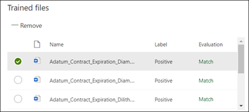

# Erstellen einer Klassifizierung in Microsoft SharePoint Syntex

Der Inhalt in diesem Artikel ist für die Project Cortex private Preview. [Erfahren Sie mehr über Project Cortex](https://aka.ms/projectcortex).

 

> [!VIDEO https://www.microsoft.com/videoplayer/embed/RE4CL0R]  

 

Eine Klassifizierung ist ein Modelltyp, mit dem Sie die Identifizierung und Klassifizierung eines Dokumenttyps automatisieren können. Beispielsweise können Sie alle *Vertrags Erneuerungs* Dokumente identifizieren, die Ihrer Dokumentbibliothek hinzugefügt werden, wie in der folgenden Abbildung dargestellt.

Das Erstellen einer Klassifizierung ermöglicht Ihnen das Erstellen eines neuen [SharePoint-Inhaltstyps](https://docs.microsoft.com/sharepoint/governance/content-type-and-workflow-planning#content-type-overview) , der dem Modell zugeordnet wird.

Beim Erstellen der Klassifizierung müssen Sie *Erläuterungen* zum Definieren des Modells erstellen. Auf diese Weise können Sie häufige Daten notieren, die Sie erwarten, dass dieser Dokumenttyp konsistent gefunden wird. 

Verwenden Sie Beispiele für den Dokumenttyp ("Beispieldateien"), um Ihr Modell zu "trainieren", um Dateien mit dem gleichen Inhaltstyp zu identifizieren.

Um eine Klassifizierung zu erstellen, müssen Sie Folgendes tun:
1. Nennen Sie Ihr Modell.
2. Fügen Sie Ihre Beispieldateien hinzu.
3. Beschriften Sie Ihre Beispieldateien.
4. Erstellen Sie eine Erläuterung.
5. Testen Sie Ihr Modell.

> [!NOTE]
> Während Ihr Modell eine Klassifizierung verwendet, um Dokumenttypen zu identifizieren und zu klassifizieren, können Sie auch auswählen, dass bestimmte Informationen aus jeder vom Modell identifizierten Datei abgerufen werden. Erstellen Sie hierzu einen **Extraktor** , der dem Modell hinzugefügt werden soll. Siehe [Erstellen eines Extraktors](create-an-extractor.md).

## Benennen Ihres Modells

Der erste Schritt zum Erstellen des Modells besteht darin, ihm einen Namen zu geben:

1. Wählen Sie im Inhalts Center **neu**aus, und erstellen Sie dann **ein Modell**.
2. Geben Sie im Feld **Neues Dokument grundlegendes Modell** **den Namen des** Modells ein. Wenn Sie beispielsweise Vertrags Erneuerungs Dokumente identifizieren möchten, können Sie die Modell *Vertragserneuerung*benennen.
3. Klicken Sie auf **Erstellen**. Dadurch wird eine Startseite für das Modell erstellt. 

    

Wenn Sie ein Modell erstellen, erstellen Sie auch einen neuen SharePoint-Inhaltstyp. Ein SharePoint-Inhaltstyp stellt eine Kategorie von Dokumenten dar, die allgemeine Merkmale aufweisen und eine Auflistung von Spalten oder Metadaten-Eigenschaften für diesen bestimmten Inhalt gemeinsam verwenden. SharePoint-Inhaltstypen werden über den [Inhaltstypen Katalog](https://support.microsoft.com/office/create-or-customize-a-site-content-type-27eb6551-9867-4201-a819-620c5658a60f)verwaltet. In diesem Beispiel erstellen Sie beim Erstellen des Modells einen neuen Inhaltstyp für die *Vertragserneuerung* .

Wählen Sie **Erweiterte Einstellungen** aus, wenn Sie dieses Modell einem vorhandenen Inhaltstyp im SharePoint-Inhaltstypen Katalog zuordnen möchten, um sein Schema zu verwenden. Beachten Sie, dass Sie zwar einen vorhandenen Inhaltstyp verwenden können, um sein Schema zur Unterstützung bei der Identifizierung und Klassifizierung zu nutzen, aber Sie müssen Ihr Modell dennoch trainieren, um Informationen aus den identifizierten Dateien zu extrahieren. 

## Hinzufügen von Beispieldateien

Fügen Sie auf der Modell Homepage Ihre Beispieldateien hinzu, die Sie bei der Schulung des Modells zur Identifizierung Ihres Dokumenttyps unterstützen müssen.  
 

> [!VIDEO https://www.microsoft.com/videoplayer/embed/RE4D0iX] 

 

> [!NOTE]
> Sie sollten die gleichen Dateien für die Klassifizierung und [Extraktions Schulung](create-an-extractor.md)verwenden. Sie haben immer die Möglichkeit, später hinzuzufügen, aber in der Regel fügen Sie einen vollständigen Sammlung von Beispieldateien hinzu. Beschriften Sie einige, um Ihr Modell zu trainieren, und testen Sie die restlichen unbeschrifteten, um die Modell Fitness auszuwerten. 

Für Ihre Trainingsgruppe möchten Sie sowohl positive als auch negative Beispiele verwenden:
- Positives Beispiel: Dokumente, die den Dokumenttyp darstellen. Diese enthalten Zeichenfolgen und Informationen, die immer in dieser Art von Dokument sein würden.
- Negatives Beispiel: Dokumente, die nicht den Dokumenttyp darstellen. Dabei handelt es sich um fehlende Zeichenfolgen und Informationen, die in dieser Art von Dokument vorhanden sein müssen.

Stellen Sie sicher, dass Sie mindestens fünf positive Beispiele und mindestens ein negatives Beispiel zur Schulung Ihres Modells verwenden.  Sie möchten zusätzliche erstellen, um Ihr Modell nach dem Schulungsprozess zu testen.

So fügen Sie Beispieldateien hinzu:

1. Klicken Sie auf der Modell Startseite in der Kachel **Beispielbibliothek erstellen** auf **Dateien hinzufügen**.
2. Wählen Sie auf der Seite **Beispieldateien für Ihr Modell auswählen** ihre Beispieldateien aus der Bibliothek Beispieldateien im Inhalts Center aus. Wenn Sie Sie nicht bereits hochgeladen haben, wählen Sie, um Sie jetzt hochzuladen, indem Sie auf **hochladen** klicken, um Sie in die Beispieldatei Bibliothek zu versetzen.
3. Nachdem Sie Ihre Beispieldateien ausgewählt haben, die zum Trainieren des Modells verwendet werden sollen, klicken Sie auf **Hinzufügen**.

     

## Bezeichnen der Beispieldateien

Nachdem Sie Ihre Beispieldateien hinzugefügt haben, müssen Sie Sie als positive oder negative Beispiele bezeichnen.

1. Klicken Sie auf der Modell Homepage auf der Kachel **Dateien klassifizieren und Übungsverlauf ausführen** auf **Klassifizierung Klassifizierer**.
   Dadurch wird die Bezeichnungs Seite angezeigt, die eine Liste der Beispieldateien enthält, wobei die erste Datei im Viewer angezeigt wird.
2. Im Viewer am oberen Rand der ersten Beispieldatei sollte Text gefragt werden, ob es sich bei der Datei um ein Beispiel des soeben erstellten Modells handelt. Wenn es sich um ein positives Beispiel handelt, wählen Sie **Ja**aus. Wenn es sich um ein negatives Beispiel handelt, wählen Sie **Nein**aus.
3. Wählen Sie in der Liste mit den **beschrifteten Beispielen** auf der linken Seite zusätzliche Dateien aus, die Sie als Beispiele verwenden möchten, und beschriften Sie Sie. 

     

> [!NOTE]
> Beschriften Sie mindestens fünf positive Beispiele und ein negatives Beispiel. 

## Erstellen einer Erklärung

Im nächsten Schritt erstellen Sie eine Erläuterung auf der Seite "Train". Eine Erläuterung hilft dem Modell zu verstehen, wie das Dokument erkannt wird. Beispielsweise enthalten die Vertrags Erneuerungs Dokumente immer eine *Anforderung für zusätzliche Textzeichenfolge für die Offenlegung* .

> [!Note]
> Bei Verwendung mit Extraktoren identifiziert eine Erklärung die Zeichenfolge, die Sie aus dem Dokument extrahieren möchten. 

So erstellen Sie eine Erläuterung:

1. Wählen Sie auf der Modell Startseite die Registerkarte **Zug** aus, um zur Seite Zug zu gelangen.
2. Auf der Seite "Train" im Abschnitt " **geschulte Dateien** " sollte eine Liste der Beispieldateien angezeigt werden, die Sie zuvor beschriftet haben. Wählen Sie eine der positiven Dateien aus der Liste aus, die im Viewer angezeigt wird.
3. Wählen Sie im Abschnitt Erklärung die Option **neu** und dann **leer**aus.
4. Auf der Seite **Erklärung erstellen** : 
    a. Geben Sie den **Namen** ein (beispielsweise "Offenlegungs Block"). 
    b. Wählen Sie den **Typ**aus. Wählen Sie für das Beispiel " **Phrase List**" aus, da Sie eine Textzeichenfolge hinzufügen. 
    c. Geben Sie im Feld **Typ hier** die Zeichenfolge ein. Fügen Sie für das Beispiel "Anforderung zusätzlicher Offenlegung" hinzu. Sie können die **groß** -/Kleinschreibung beachten, wenn bei der Zeichenfolge die Groß-/Kleinschreibung beachtet werden muss. 
    d. Klicken Sie auf **Speichern**.

     
    
 
5. Das Modell überprüft jetzt, ob die von Ihnen erstellte Erklärung gut genug ist, um die verbleibenden beschrifteten Beispieldateien ordnungsgemäß zu identifizieren, als positive und negative Beispiele. Überprüfen Sie im Abschnitt ausgebildete Dateien nach Abschluss der Schulung die Spalte **Evaluierung** , um die Ergebnisse anzuzeigen. Die Dateien zeigen einen Wert von **Match**an, wenn die von Ihnen erstellten Erklärungen genug übereinstimmen, was Sie als positiv oder negativ bezeichnet haben.

     

Wenn Sie eine **Übereinstimmung** mit den beschrifteten Dateien erhalten, müssen Sie möglicherweise eine zusätzliche Erläuterung erstellen, um das Modell mit weiteren Informationen zum Identifizieren des Dokumenttyps zu versehen. Wenn dies geschieht, klicken Sie auf die Datei, um weitere Informationen dazu zu erhalten, warum der Konflikt aufgetreten ist.

## Testen des Modells

Wenn Sie eine Übereinstimmung mit den beschrifteten Beispieldateien erhalten haben, können Sie Ihr Modell nun auf ihren restlichen unbeschrifteten Beispieldateien testen.

1. Wählen Sie auf der Modell Startseite die Registerkarte **Test** aus.  Dadurch wird das Modell für Ihre unbeschrifteten Beispieldateien ausgeführt.
2. In der Liste **Test Dateien** werden Ihre Beispieldateien angezeigt und angezeigt, wenn das Modell Sie als positiv oder negativ prognostiziert. Anhand dieser Informationen können Sie die Effektivität ihrer Klassifizierung bei der Identifizierung Ihrer Dokumente ermitteln.

     

## Siehe auch
[Erstellen eines Extraktions Moduls](create-an-extractor.md) 
[Dokument Verständnis Übersicht](document-understanding-overview.md) 
[Erstellen eines Formular Verarbeitungsmodells](create-a-form-processing-model.md) 
[Anwenden eines Modells](apply-a-model.md) 
