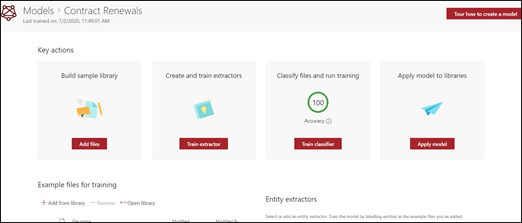

# Erstellen eines Klassifizierers in Microsoft SharePoint Syntex

 

> [!VIDEO https://www.microsoft.com/videoplayer/embed/RE4CL0R]  

 

Ein Klassifizierer ist ein Modelltyp, mit dem Sie die Identifizierung und Klassifizierung eines Dokumententyps automatisieren können. Sie können zum Beispiel alle Dokumente zur *Vertragsverlängerung* identifizieren, die Ihrer Dokumentbibliothek hinzugefügt werden, wie in der folgenden Abbildung gezeigt.

Das Erstellen eines Klassifizierers ermöglicht es Ihnen, einen neuen [SharePoint-Inhaltstyp](https://docs.microsoft.com/sharepoint/governance/content-type-and-workflow-planning#content-type-overview) zu erstellen, der mit dem Modell verknüpft wird.

Beim Erstellen des Klassifizierers müssen Sie *Erklärungen* erstellen, um das Modell zu definieren. Auf diese Weise können Sie gemeinsame Daten vermerken, bei denen Sie erwarten würden, dass dieser Dokumenttyp konsistent entdeckt wird. 

Verwenden Sie Beispiele für den Dokumenttyp ("Beispieldateien"), um Ihr Modell zu "trainieren", um Dateien mit dem gleichen Inhaltstyp zu identifizieren.

Zum Erstellen eines Klassifizierers müssen Sie:
1. Ihr Modell benennen.
2. Ihre Beispieldateien hinzufügen.
3. Ihre Beispieldateien bezeichnen.
4. Erklärung erstellen.
5. Ihr Modell testen.

> [!NOTE]
> Während Ihr Modell einen Klassifizierer verwendet, um Dokumenttypen zu identifizieren und zu klassifizieren, können Sie sich auch dafür entscheiden, bestimmte Informationen aus jeder durch das Modell identifizierten Datei abzurufen. Erstellen Sie hierzu einen **Extraktor**, der dem Modell hinzugefügt werden soll. Siehe [Erstellen eines Extraktors](create-an-extractor.md)

## Ihr Modell benennen

Der erste Schritt zum Erstellen Ihres Modells ist die Benennung:

1. Wählen Sie im Inhaltscenter **Neu** aus, und dann **Modell erstellen**.
2. Geben Sie im Bereich **Neues "Document Understanding-Modell"** in das Feld **Name** den Namen des Modells ein. Wenn Sie beispielsweise Vertragsverlängerungsdokumente identifizieren möchten, könnten Sie das Modell *Vertragsverlängerung* benennen.
3. Klicken Sie auf **Erstellen**. Dadurch wird eine Homepage für das Modell erstellt. 

    

Wenn Sie ein Modell erstellen, erstellen Sie auch einen neuen Websiteinhaltstyp. Ein Inhaltstyp stellt eine Kategorie von Dokumenten dar, die gemeinsame Merkmale aufweisen und eine Sammlung von Spalten oder Metadateneigenschaften für diesen bestimmten Inhalt gemeinsam haben. SharePoint-Inhaltstypen werden über den [Inhaltstypen-Katalog](https://support.microsoft.com/office/create-or-customize-a-site-content-type-27eb6551-9867-4201-a819-620c5658a60f) verwaltet. In diesem Beispiel legen Sie beim Erstellen des Modells einen neuen Inhaltstyp *Vertragsverlängerung* an.

Wählen Sie **Erweiterte Einstellungen** aus, wenn Sie dieses Modell einem vorhandenen Unternehmensinhaltstyp im SharePoint-Inhaltstypen-Katalog zuordnen möchten, um sein Schema zu verwenden. Unternehmensinhaltstypen werden im Inhaltstyp-Hub im SharePoint Admin Center gespeichert und für alle Websites im Mandanten syndiziert. Beachten Sie, dass Sie zwar einen vorhandenen Inhaltstyp verwenden können, um sein Schema zur Unterstützung der Identifizierung und Klassifizierung zu nutzen, dass Sie Ihr Modell jedoch noch darauf trainieren müssen, Informationen aus den von ihm identifizierten Dateien zu extrahieren. 

## Ihre Beispieldateien hinzufügen

Fügen Sie auf der Homepage des Modells Ihre Beispieldateien hinzu, die Sie zum Trainieren des Modells benötigen, um Ihren Dokumenttyp zu identifizieren.  
 

> [!VIDEO https://www.microsoft.com/videoplayer/embed/RE4D0iX] 

 

> [!NOTE]
> Sie sollten die gleichen Dateien sowohl für die Klassifizierer- als auch für die [Extraktor-Schulung](create-an-extractor.md) verwenden. Sie haben jederzeit die Möglichkeit, später weitere hinzuzufügen, aber in der Regel fügen Sie einen vollständigen Satz von Beispieldateien hinzu. Bezeichnen Sie einige, um Ihr Modell zu trainieren, und testen Sie die übrigen nicht bezeichneten, um die Modelleignung zu beurteilen. 

Für Ihren Schulungssatz möchten Sie sowohl positive als auch negative Beispiele verwenden:
- Positives Beispiel: Dokumente, die den Dokumenttyp darstellen. Diese enthalten Zeichenfolgen und Informationen, die in diesem Dokumenttyp immer vorhanden wären.
- Negatives Beispiel: Jedes andere Dokument, das nicht das Dokument darstellt, das Sie klassifizieren möchten. 

Achten Sie darauf, mindestens fünf positive Beispiele und mindestens ein negatives Beispiel zu verwenden, um Ihr Modell zu trainieren.  Sie möchten weitere erstellen, um Ihr Modell nach dem Schulungsvorgang zu testen.

Hinzufügen von Beispieldateien:

1. Klicken Sie auf der Homepage des Modells in der Kachel **Beispieldateien hinzufügen** auf **Dateien hinzufügen**.
2. Wählen Sie auf der Seite **Beispieldateien für Ihr Modell auswählen** aus, und wählen Sie Ihre Beispieldateien aus der Bibliothek "Schulungsdateien" im Inhaltscenter aus. Wenn Sie die Dateien dort noch nicht hochgeladen hatten, können Sie diese jetzt hochladen, indem Sie auf **Hochladen** klicken, um sie in die Bibliothek "Schulungsdateien" zu kopieren.
3. Nachdem Sie die Beispieldateien ausgewählt haben, die zum Trainieren des Modells verwendet werden sollen, klicken Sie auf **Hinzufügen**.

     

## Ihre Beispieldateien bezeichnen

Nachdem Sie Ihre Beispieldateien hinzugefügt haben, müssen Sie sie entweder als positive oder negative Beispiele bezeichnen.

1. Klicken Sie auf der Homepage des Modells auf der Kachel **Dateien klassifizieren und Schulungen ausführen** auf **Klassifizierer trainieren**.
   Dadurch wird die Bezeichnungsseite angezeigt, die eine Liste Ihrer Beispieldateien enthält, wobei die erste Datei im Viewer angezeigt wird.
2. Im Viewer oben auf der ersten Beispieldatei sollten Sie einen Text sehen, der Sie fragt, ob die Datei ein Beispiel für das gerade erstellte Modell ist. Wenn es sich um ein positives Beispiel handelt, wählen Sie **Ja** aus. Wenn es sich um ein negatives Beispiel handelt, wählen Sie **Nein** aus.
3. Wählen Sie aus der Liste **Bezeichnete Beispiele** auf der linken Seite weitere Dateien aus, die Sie als Beispiele verwenden möchten, und bezeichnen Sie diese. 

     

> [!NOTE]
> Bezeichnen Sie mindestens fünf positive Beispiele. Sie müssen außerdem mindestens ein negatives Beispiel bezeichnen. 

## Erklärung erstellen

Der nächste Schritt besteht darin, auf der Seite "Trainieren" eine Erklärung zu erstellen. Eine Erklärung hilft dem Modell zu verstehen, wie das Dokument zu erkennen ist. Beispielsweise enthalten die Dokumente "Vertragsverlängerung" immer eine Textzeichenfolge *Anforderung nach zusätzlicher Veröffentlichung*.

> [!Note]
> Bei Verwendung mit Extraktoren identifiziert eine Erklärung die Zeichenfolge, die Sie aus dem Dokument extrahieren möchten. 

Erstellen einer Erklärung:

1. Wählen Sie auf der Homepage des Modells die Registerkarte **Trainieren**, um zur Seite "Trainieren" zu wechseln.
2. Auf der Seite "Trainieren" sollten Sie im Abschnitt **Geschulte Dateien** eine Liste der Beispieldateien sehen, die Sie zuvor bezeichnet haben. Wählen Sie eine der positiven Dateien aus der Liste aus, die im Viewer angezeigt wird.
3. Wählen Sie im Abschnitt "Erklärung" **Neu** aus und dann **Leerzeichen**.
4. Auf der Seite **Erklärung erstellen**: 
    a. Geben Sie den **Namen** ein (zum Beispiel "Veröffentlichungssperre"). 
    b. Wählen Sie den **Typ** aus. Wählen Sie für das Beispiel **Begriffsliste**, da Sie eine Textzeichenfolge hinzufügen. 
    c. Geben Sie im Feld **Hier eingeben** die Zeichenfolge ein. Für das Beispiel fügen Sie "Anforderung nach zusätzlicher Veröffentlichung" hinzu. Sie können **Groß-/Kleinschreibung beachten**", wenn bei der Zeichenfolge zwischen Groß- und Kleinschreibung unterschieden werden muss. 
    d. Klicken Sie auf **Speichern**.

     
    
 
5. Das Modell prüft nun, ob die von Ihnen erstellte Erklärung gut genug war, um die verbleibenden bezeichneten Beispieldateien korrekt als positive und negative Beispiele zu identifizieren. Markieren Sie im Abschnitt "Geschulte Dateien" die Spalte **Auswertung** nach Abschluss der Schulung, um die Ergebnisse anzuzeigen. Die Dateien zeigen den Wert **Übereinstimmung** an, wenn die Erklärungen, die Sie erstellt haben, ausreichend waren, um mit dem übereinzustimmen, was Sie als positiv oder negativ bezeichnet haben.

     

Wenn Sie **Keine Übereinstimmung** bei den bezeichneten Dateien erhalten, müssen Sie möglicherweise eine zusätzliche Erklärung erstellen, um dem Modell weitere Informationen zur Identifizierung des Dokumententyps bereitzustellen. Wenn dies der Fall ist, klicken Sie auf die Datei, um weitere Informationen darüber zu erhalten, warum keine Übereinstimmung stattgefunden hat.

## Ihr Modell testen

Wenn Sie eine Übereinstimmung mit den beschrifteten Beispieldateien erhalten haben, können Sie nun das Modell für Ihre restlichen nicht beschrifteten Beispieldateien testen, die das Modell noch nicht kennt.  Das ist ein optionaler aber nützlicher Schritt, um die "Tauglichkeit" oder die Bereitschaft des Modells vor seiner Verwendung zu bewerten. Dazu wird es an Dateien getestet, die das Modell noch nie gesehen hat.

1. Wählen Sie auf der Homepage des Modells die Registerkarte **Test**. Dadurch wird das Modell für Ihre nicht beschrifteten Beispieldateien ausgeführt.
2. In der Liste **Testdateien** werden Ihre Beispieldateien angezeigt und zeigen an, ob das Modell sie als positiv oder negativ vorhergesagt hat. Mithilfe dieser Informationen können Sie ermitteln, wie effektiv Ihr Klassifizierer bei der Identifizierung Ihrer Dokumente ist.

     

## Siehe auch
[Erstellen eines Extraktors](create-an-extractor.md)

[Übersicht über das Dokumentenverständnis](document-understanding-overview.md)

[Beschreibungstypen](explanation-types-overview.md)

[Anwenden eines Modells](apply-a-model.md) 
