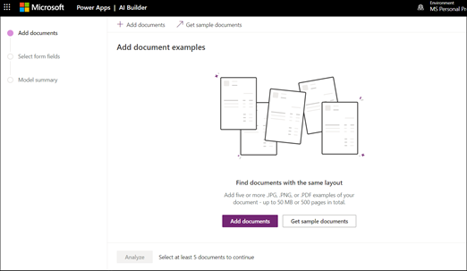
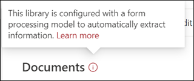

# Erstellen eines Formular Verarbeitungsmodells (Vorschau)

> [!Note] 
> Der Inhalt dieses Artikels ist für Project Cortex private Preview. [Erfahren Sie mehr über Project Cortex](https://aka.ms/projectcortex).

Verwenden von [AI Builder](https://docs.microsoft.com/ai-builder/overview) -ein Feature in Microsoft PowerApps-Project Cortex Benutzer können ein [Formular Verarbeitungsmodell](form-processing-overview.md) direkt aus einer SharePoint-Dokumentbibliothek erstellen. 

Das Erstellen eines Formular Verarbeitungsmodells umfasst Folgendes:
 - Schritt 1: Erstellen des von-Verarbeitungsmodells zum Erstellen des Inhaltstyps
 - Schritt 2: Hinzufügen und Analysieren von Beispieldateien
 - Schritt 3: Auswählen der Formularfelder
 - Schritt 4: trainieren und Testen des Modells
 - Schritt 5: Veröffentlichen des Modells
 - Schritt 6: Verwenden des Modells

## Anforderungen

Sie können nur ein Formular Verarbeitungsmodell in SharePoint-Dokumentbibliotheken erstellen, in denen es aktiviert ist. Wenn die Formularverarbeitung aktiviert ist, können Sie den **AI-Generator** **"Erstellen eines Formular Verarbeitungsmodells"** im Menü " **automatisieren** " in Ihrer Dokumentbibliothek anzeigen.  Wenn Sie die in Ihrer Dokumentbibliothek aktivierte Verarbeitung benötigen, wenden Sie sich an Ihren Administrator.

  

## Schritt 1: Erstellen eines Formular Verarbeitungsmodells

Der erste Schritt beim Erstellen eines Formular Verarbeitungsmodells besteht darin, den Namen zum Definieren des neuen Inhaltstyps und zum Erstellen einer neuen Dokumentbibliotheksansicht dafür zu erstellen.

1. Wählen Sie in Ihrer Dokumentbibliothek das Menü **automatisieren** aus, wählen Sie **AI Builder**aus, und wählen Sie dann **Formular Verarbeitungsmodell erstellen**aus.

     
2. Geben Sie im Bereich **Neues Formular Verarbeitungsmodell** im Feld **Name** einen Namen für Ihr Modell ein (beispielsweise Bestel *Lungen*).

      

3. Wenn Sie ein Formular Verarbeitungsmodell erstellen, erstellen Sie einen neuen SharePoint-Inhaltstyp. Ein SharePoint-Inhaltstyp stellt eine Kategorie von Dokumenten dar, die allgemeine Merkmale aufweisen und eine Auflistung von Spalten oder Metadaten-Eigenschaften für diesen bestimmten Inhalt gemeinsam verwenden. SharePoint-Inhaltstypen werden über den [Inhaltstypen Katalog]()verwaltet.

    Wählen Sie **Erweiterte Einstellungen** aus, wenn Sie dieses Modell einem vorhandenen Inhaltstyp im SharePoint-Inhaltstypen Katalog zuordnen möchten, um sein Schema zu verwenden. 

4. Ihr Modell erstellt eine neue Ansicht in Ihrer Dokumentbibliothek für die extrahierten Daten. Wenn die Standardansicht nicht angezeigt werden soll, deaktivieren Sie die Option **als Standardansicht festlegen**.
5. Wählen Sie **Erstellen** aus.

## Schritt 2: Hinzufügen und Analysieren von Dokumenten

Nachdem Sie Ihr neues Formular Verarbeitungsmodell erstellt haben, wird von Ihrem Browser eine neue Seite des PowerApps AI Builder-Formular Verarbeitungsmodells geöffnet. Auf dieser Seite können Sie Ihre Beispiel Dokumente hinzufügen und analysieren.  

> [!Note]
> Wenn Sie nach Beispieldateien suchen, die verwendet werden sollen, lesen Sie das [Formular Verarbeitungsmodell Eingabedokument Anforderungen und Optimierungstipps](https://docs.microsoft.com/ai-builder/form-processing-model-requirements). 

     
 

1. Klicken Sie auf **Dokumente hinzufügen** , um das Hinzufügen von Beispiel Dokumenten zu beginnen, die analysiert werden, um zu ermitteln, welche benannten Wert-Paare extrahiert werden können Sie können entweder **aus dem lokalen Speicher**, **SharePoint**oder **Azure-BLOB-Speicher**Hochladen auswählen. Sie müssen mindestens fünf Dateien für die Schulung verwenden.
2. Nachdem Sie Ihre Dateien hinzugefügt haben, wählen Sie **analyze** aus, um nach allen gängigen Informationen zu suchen, die alle Dateien aufweisen. Beachten Sie, dass dieser Vorgang einige Minuten dauern kann.  
 
      

3. Nachdem Sie analysiert wurden, klicken Sie auf der Seite **Formularfelder, die Sie speichern möchten** auf die Datei, um die Felder anzuzeigen, die erkannt wurden. 

      

## Schritt 3: Auswählen der Formularfelder

Nachdem Sie Ihre Dokumente für Felder analysiert haben, können Sie nun sehen, welche Felder gefunden wurden und welche Sie speichern möchten. Gespeicherte Felder werden als Spalten in der Dokumentbibliotheksansicht Ihres Modells angezeigt und zeigen die Werte an, die aus den einzelnen Dokumenten extrahiert werden.

1. Auf der nächsten Seite wird eine der Beispieldateien angezeigt, und es werden alle gängigen Felder hervorgehoben, die vom System automatisch erkannt wurden.  

      

2. Wählen Sie die Felder aus, die Sie speichern möchten, und aktivieren Sie das Kontrollkästchen, um die Auswahl zu bestätigen. Beispielsweise können Sie im Bestell Modell auswählen, dass die Felder *Datum*, *po*und *Summe* ausgewählt werden sollen.  Beachten Sie, dass Sie auch auswählen können, ein Feld umzubenennen, wenn Sie möchten.  

      

3. Wenn ein Feld nicht von der Analyse erkannt wurde, können Sie es dennoch hinzufügen. Markieren Sie die Informationen, die extrahiert werden sollen, und geben Sie im Feld Name den Namen ein, den Sie eingeben möchten. Wählen Sie dann den Scheck aus. Beachten Sie, dass Sie unerkannte Felder in ihren restlichen Beispieldateien bestätigen müssen.
4. Klicken Sie auf **Felder bestätigen** , nachdem Sie die Felder ausgewählt haben, die Sie speichern möchten.  
 
      
 
5. Auf der Seite **Wählen Sie die Formularfelder aus, die Sie speichern möchten** , wird die Anzahl der Felder angezeigt, die Sie ausgewählt haben. Wählen Sie **Fertig** aus.

## Schritt 4: trainieren und Testen des Modells

Nachdem Sie die Felder ausgewählt haben, die Sie speichern möchten, können Sie mit der **Modell Zusammenfassungs** Seite trainieren und Ihr Modell testen.

1. Auf der Seite **Modellzusammenfassung** werden die gespeicherten Felder im Abschnitt **Ausgewählte Felder** angezeigt. Wählen Sie **Train** aus, um mit der Schulung in ihren Beispieldateien zu beginnen. Beachten Sie, dass dieser Vorgang einige Minuten dauern kann. 
      
2. Wenn die Benachrichtigung angezeigt wird, dass die Schulung abgeschlossen ist, wählen Sie **zur Seite Details wechseln**aus. 
3. Auf der Seite **Modelldetails** können Sie die Funktionsweise des Modells testen, indem Sie auf **Schnelltest**klicken. Auf diese Weise können Sie Dateien per Drag & Drop auf die Seite ziehen und prüfen, ob die Felder erkannt werden.

## Schritt 5: Veröffentlichen des Modells

1. Wenn Sie mit den Ergebnissen Ihres Modells zufrieden sind, wählen Sie **veröffentlichen** aus, um es zur Verwendung zur Verfügung zu stellen.
2. Wählen Sie nach dem Veröffentlichen des Modells **Modell verwenden**aus. Dadurch wird ein PowerAutomate-Fluss erstellt, der in Ihrer SharePoint-Dokumentbibliothek ausgeführt wird und die Felder extrahiert, die im Modell identifiziert wurden. Wählen Sie **Flow erstellen**aus.  
3. Wenn dieser Vorgang abgeschlossen ist, wird die Meldung angezeigt, dass **Ihr Flow erfolgreich erstellt**wurde.
 
 
## Schritt 6: Verwenden des Modells

Nachdem Sie Ihr Modell veröffentlicht und den PowerAutomate-Fluss erstellt haben, können Sie Ihr Modell in Ihrer SharePoint-Dokumentbibliothek verwenden.

1. Wählen Sie nach der Veröffentlichung Ihres Modells zu **SharePoint wechseln** aus, um zu Ihrer Dokumentbibliothek zu wechseln.
2. Beachten Sie, dass die von Ihnen ausgewählten Felder in der Ansicht Dokument Bibliotheksmodell jetzt als Spalten angezeigt werden. 

      

    Beachten Sie außerdem, dass der Informations Link neben **Dokumenten** darauf hinweist, dass auf diese Dokumentbibliothek ein Formular Verarbeitungsmodell angewendet wird.

       

3. Laden Sie Dateien in Ihre Dokumentbibliothek hoch. Alle Dateien, die vom Modell als Inhaltstyp identifiziert werden, werden die Dateien in der Ansicht auflisten, und die extrahierten Daten werden in den Spalten angezeigt. 

       

## Siehe auch
  
[Power Automation-Dokumentation](https://docs.microsoft.com/power-automate/) 
[Schulung: verbessern der Geschäftsleistung mit AI Builder](https://docs.microsoft.com/learn/paths/improve-business-performance-ai-builder/?source=learn) 

