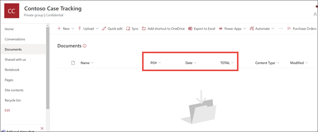

# Erstellen eines Formularverarbeitungsmodells in Microsoft SharePoint Syntex

 

> [!VIDEO https://www.microsoft.com/videoplayer/embed/RE4GnhN]  

 

Mithilfe von [AI Builder](https://docs.microsoft.com/ai-builder/overview) – ein Feature in Microsoft PowerApps – können SharePoint Syntex-Benutzer ein [Formularverarbeitungsmodell](form-processing-overview.md) direkt aus einer SharePoint-Dokumentbibliothek erstellen. 

Die Erstellung eines Formularverarbeitungsmodells umfasst folgende Schritte:
 - Schritt 1: Erstellen des Formularverarbeitungsmodells zur Erstellung des Inhaltstyps
 - Schritt 2: Hinzufügen und Analysieren von Beispieldateien
 - Schritt 3: Auswählen der Formularfelder
 - Schritt 4: Trainieren und Testen des Modells
 - Schritt 5: Veröffentlichen des Modells
 - Schritt 6: Verwenden des Modells

## Anforderungen

Formularverarbeitungsmodelle können nur in SharePoint-Dokumentbibliotheken mit entsprechend aktivierter Funktion erstellt werden. Wenn die Formularverarbeitung aktiviert ist, wird in Ihrer Dokumentbibliothek die **AI Builder**-Option **"Formularverarbeitungsmodell erstellen"** im Menü **Automatisieren** angezeigt. Wenn die Verarbeitung in Ihrer Dokumentbibliothek aktiviert werden muss, müssen Sie sich hierfür an Ihren SharePoint-Administrator wenden.

  

## Schritt 1: Erstellen eines Formularverarbeitungsmodells

Der erste Schritt zum Erstellen eines Formularverarbeitungsmodells besteht darin, es zu benennen, den neuen Inhaltstyp zu definieren und eine neue Dokumentbibliotheksansicht dafür zu erstellen.

1. Wählen Sie in der Dokumentbibliothek das Menü **Automatisieren**, dann **AI Builder** und anschließend **Formularverarbeitungsmodell erstellen** aus.

     

2. Geben Sie im Bereich **Neues Formularverarbeitungsmodell** im Feld  **Name** einen Namen für das Modell ein (z. B. *Aufträge*).

      

3. Bei der Erstellung eines Formularverarbeitungsmodells erstellen Sie einen neuen SharePoint-Inhaltstyp. Ein SharePoint-Inhaltstyp stellt eine Kategorie von Dokumenten dar, die gemeinsame Merkmale aufweisen und eine Reihe von Spalten oder Metadateneigenschaften für diesen bestimmten Inhalt gemeinsam haben. SharePoint-Inhaltstypen werden über den [Inhaltstypen-Katalog]() verwaltet.

    Wählen Sie **Erweiterte Einstellungen** aus, wenn Sie dieses Modell einem vorhandenen Inhaltstyp im SharePoint-Inhaltstypen-Katalog zuordnen möchten, um dessen Schema zu verwenden. 

4. Ihr Modell erstellt in Ihrer Dokumentbibliothek eine neue Ansicht für die extrahierten Daten. Wenn Sie diese nicht in der Standardansicht wünschen, deaktivieren Sie die Option **Ansicht als Standard festlegen**.

5. Wählen Sie **Erstellen** aus.

## Schritt 2: Hinzufügen und Analysieren von Dokumenten

Nachdem Sie Ihr neues Formularverarbeitungsmodell erstellt haben, öffnet Ihr Browser eine neue PowerApps AI Builder-Formularverarbeitungsmodellseite. Auf dieser Seite können Sie Ihre Beispieldokumente hinzufügen und analysieren.  

> [!NOTE]
> Informationen zur Auswahl der Beispieldateien finden Sie unter [Eingabedokumente für Formularverarbeitungsmodelle – Anforderungen und Optimierungstipps ](https://docs.microsoft.com/ai-builder/form-processing-model-requirements). 

     
 
1. Wählen Sie **Dokumente hinzufügen** aus, um mit dem Hinzufügen von analysierten Beispieldokumenten zu beginnen, um die benannten extrahierbaren Wertpaare zu ermitteln. Sie können dann **Von lokalem Speicher hochladen**, **SharePoint** oder **Azure Blob-Speicher** auswählen. Für das Trainieren müssen Sie mindestens fünf Dateien verwenden.

2. Wählen Sie nach dem Hinzufügen der Dateien **Analysieren** aus, um nach Informationen zu suchen, die alle Dateien aufweisen. Diese Analyse kann einige Minuten dauern.  
 
      

3. Nachdem die Dateien analysiert wurden, wählen Sie auf der Seite **Zu speichernde Formularfelder auswählen** die Datei aus, um die gefundenen Felder anzuzeigen. 

      

## Schritt 3: Auswählen der Formularfelder

Nach der Analyse der Dokumente auf Felder hin werden die gefundenen Felder angezeigt, und Sie können jene auswählen, die gespeichert werden sollen. Gespeicherte Felder werden in der Dokumentbibliotheksansicht des Modells als Spalten angezeigt, und darin werden die aus den einzelnen Dokumenten extrahierten Werte angezeigt.

1. Auf der nächsten Seite wird eine Ihrer Beispieldateien angezeigt, und es sind alle gemeinsamen Felder hervorgehoben, die vom System automatisch erkannt wurden.  

      

2. Wählen Sie die Felder aus, die gespeichert werden sollen, und aktivieren Sie das Kontrollkästchen, um Ihre Auswahl zu bestätigen. Wählen Sie z. B. im Auftragsmodell die Felder *Datum*, *Auftrag* und *Gesamtbetrag* aus. Sie können ein ausgewähltes Feld auch umbenennen. 

      

3. Sie können ein Feld, das während einer Analyse nicht erkannt wurde, trotzdem hinzufügen. Markieren Sie die Informationen, die extrahiert werden sollen, und geben Sie in das Feld "Name" den gewünschten Namen ein. Aktivieren Sie dann das Kontrollkästchen. Beachten Sie, dass Sie nicht erkannte Felder in den verbleibenden Beispieldateien bestätigen müssen.

4. Klicken Sie nach der Auswahl der zu speichernden Felder auf **Felder bestätigen**.  
 
      
 
5. Auf der Seite **Zu speichernde Formularfelder auswählen** wird die Anzahl der von Ihnen ausgewählten Felder angezeigt. Wählen Sie **Fertig** aus.

## Schritt 4: Trainieren und Testen des Modells

Nachdem Sie die zu speichernden Felder ausgewählt haben, können Sie auf der Seite **Modellzusammenfassung** das Modell trainieren und testen.

1. Auf der Seite **Modellzusammenfassung** werden die gespeicherten Felder im Abschnitt **Ausgewählte Felder** angezeigt. Wählen Sie **Trainieren** aus, um das Trainieren mit Ihren Beispieldateien zu starten. Dieser Vorgang kann einige Minuten dauern. 

       

2. Wenn die Meldung angezeigt wird, dass das Trainieren abgeschlossen ist, wählen Sie **Zur Seite "Modelldetails" wechseln** aus. 

3. Auf der Seite **Modelldetails** können Sie **Schnelltest** auswählen, um das Modell zu testen. Dabei können Sie Dateien auf die Seite ziehen um zu sehen, ob die Felder erkannt werden.

      

2. Wenn die Meldung angezeigt wird, dass das Trainieren abgeschlossen ist, wählen Sie **Zur Seite "Modelldetails" wechseln** aus. 

3. Wählen Sie auf der Seite **Modelldetails** die Option **Schnelltest** aus, um das Modell zu testen. Dabei können Sie Dateien auf die Seite ziehen um zu sehen, ob die Felder erkannt werden.

## Schritt 5: Veröffentlichen des Modells

1. Wenn Sie mit den Ergebnissen Ihres Modells zufrieden sind, wählen Sie **Veröffentlichen** aus, um es verfügbar zu machen.

2. Wählen Sie nach der Veröffentlichung des Modells **Modell verwenden** aus. Dadurch wird ein in Ihrer SharePoint-Dokumentbibliothek ausführbarer PowerAutomate-Ablauf erstellt, bei dem die im Modell erkannten Felder extrahiert werden. Wählen Sie anschließend **Ablauf erstellen** aus.
  
3. Nach Abschluss des Vorgangs wird die folgende Meldung angezeigt: **Ablauf wurde erstellt**.
 
## Schritt 6: Verwenden des Modells

Nach der Veröffentlichung des Modells und der Erstellung des PowerAutomate-Ablaufs können Sie das Modell in Ihrer SharePoint-Dokumentbibliothek verwenden.

1. Wählen Sie nach dem Veröffentlichen des Modells **Zu SharePoint wechseln** aus, um zu Ihrer Dokumentbibliothek zu wechseln.

2. In der Dokumentbibliotheksmodellansicht werden die von Ihnen ausgewählten Felder nun als Spalten angezeigt. 

      

3. Der Infolink neben **Dokumente** informiert darüber, dass auf diese Dokumentbibliothek ein Formularverarbeitungsmodell angewendet wird.

       

4. Laden Sie Dateien in Ihre Dokumentbibliothek hoch. Alle Dateien, die vom Modell als seinem Inhaltstyp entsprechend identifiziert werden, werden in Ihrer Ansicht aufgelistet, und die extrahierten Daten werden in den Spalten angezeigt. 

       

## Siehe auch
  
[Power Automate-Dokumentation](https://docs.microsoft.com/power-automate/)

[Schulungen: Verbessern der Geschäftsergebnisse mit AI Builder](https://docs.microsoft.com/learn/paths/improve-business-performance-ai-builder/?source=learn)
