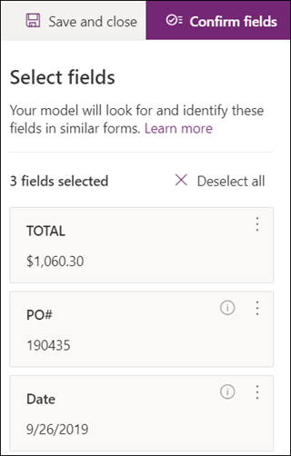

# Erstellen eines Formularverarbeitungsmodells in Microsoft SharePoint SyntexCreate a form processing model in Microsoft SharePoint Syntex

Mithilfe von [AI Builder](https://docs.microsoft.com/ai-builder/overview) – ein Feature in Microsoft PowerApps – können SharePoint Syntex-Benutzer ein [Formularverarbeitungsmodell](form-processing-overview.md) direkt aus einer SharePoint-Dokumentbibliothek erstellen.Using [AI Builder](https://docs.microsoft.com/ai-builder/overview) - a feature in Microsoft PowerApps - SharePoint Syntex users can create a [form processing model](form-processing-overview.md) directly from a SharePoint document library. 

Die Erstellung eines Formularverarbeitungsmodells umfasst folgende Schritte:Creating a form processing model involves the following:
 - Schritt 1: Erstellen des Formularverarbeitungsmodells zur Erstellung des InhaltstypsStep 1: Create the from processing model to create the content type
 - Schritt 2: Hinzufügen und Analysieren von BeispieldateienStep 2: Add and analyze example files
 - Schritt 3: Auswählen der FormularfelderStep 3: Select your form fields
 - Schritt 4: Trainieren und Testen des ModellsStep 4: Train and test your model
 - Schritt 5: Veröffentlichen des ModellsStep 5: Publish your model
 - Schritt 6: Verwenden des ModellsStep 6: Use your model

## AnforderungenRequirements

 

> [!VIDEO https://www.microsoft.com/videoplayer/embed/RE4GnhN]  

 

Formularverarbeitungsmodelle können nur in SharePoint-Dokumentbibliotheken mit entsprechend aktivierter Funktion erstellt werden.You can only create a form processing model in SharePoint document libraries for which it is enabled. Wenn die Formularverarbeitung aktiviert ist, wird in Ihrer Dokumentbibliothek die **AI Builder**-Option **"Formularverarbeitungsmodell erstellen"** im Menü **Automatisieren** angezeigt.If form processing is enabled, you are able to see the **AI Builder** **"Create a form processing model'** under the **Automate** menu in your document library.  Wenn die Verarbeitung in Ihrer Dokumentbibliothek aktiviert sein muss, müssen Sie sich hierfür an Ihren SharePoint-Administrator wenden.If you need processing enabled on your document library, you must contact your SharePoint administrator.

  

## Schritt 1: Erstellen eines FormularverarbeitungsmodellsStep 1: Create a form Processing model

Der erste Schritt zum Erstellen eines Formularverarbeitungsmodells besteht darin, es zu benennen, den neuen Inhaltstyp zu definieren und eine neue Dokumentbibliotheksansicht dafür zu erstellen.The first step in creating a form processing model is to name it and create the define the new content type and create a new document library view for it.

1. Wählen Sie in der Dokumentbibliothek das Menü **Automatisieren**, dann **AI Builder** und anschließend **Formularverarbeitungsmodell erstellen** aus.From the document library, select the **Automate** menu, select **AI Builder**, and then select **Create a Form Processing model**.

     

2. Geben Sie im Bereich **Neues Formularverarbeitungsmodell** im Feld  **Name** einen Namen für das Modell ein (z. B. *Aufträge*).In the **New form processing model** pane, in the  **Name** field, type a name for your model (for example, *Purchase Orders*).

      

3. Bei der Erstellung eines Formularverarbeitungsmodells erstellen Sie einen neuen SharePoint-Inhaltstyp.When you create a form processing model, you create a new SharePoint content type. Ein SharePoint-Inhaltstyp stellt eine Kategorie von Dokumenten dar, die gemeinsame Merkmale aufweisen und eine Reihe von Spalten oder Metadateneigenschaften für diesen bestimmten Inhalt gemeinsam haben.A SharePoint content type represents a category of documents that have common characteristics and share a collection of columns or metadata properties for that particular content. SharePoint-Inhaltstypen werden über den [Inhaltstypen-Katalog]() verwaltet.SharePoint Content Types are managed through the [Content types gallery]().

    Wählen Sie **Erweiterte Einstellungen** aus, wenn Sie dieses Modell einem vorhandenen Inhaltstyp im SharePoint-Inhaltstypen-Katalog zuordnen möchten, um dessen Schema zu verwenden.Select **Advanced settings** if you want to map this model to an existing content type in the SharePoint Content types gallery to use its schema. 

4. Ihr Modell erstellt in Ihrer Dokumentbibliothek eine neue Ansicht für die extrahierten Daten.Your model creates a new view in your document library for your extracted data. Wenn Sie nicht möchten, dass sie in der Standardansicht angezeigt werden, deaktivieren Sie die Option **Ansicht als Standard festlegen**.If you do not want it to the default view, deselect **Set the view as default**.

5. Wählen Sie **Erstellen** aus.Select **Create**.

## Schritt 2: Hinzufügen und Analysieren von DokumentenStep 2: Add and analyze documents

Nachdem Sie Ihr neues Formularverarbeitungsmodell erstellt haben, öffnet Ihr Browser eine neue PowerApps AI Builder-Formularverarbeitungsmodellseite.After you create your new form processing model, your browser opens a new PowerApps AI Builder forms processing model page. Auf dieser Seite können Sie Ihre Beispieldokumente hinzufügen und analysieren.On this page you can add and analyze your example documents.  

> [!NOTE]
> Informationen zur Auswahl der Beispieldateien finden Sie unter [Eingabedokumente für Formularverarbeitungsmodelle – Anforderungen und Optimierungstipps ](https://docs.microsoft.com/ai-builder/form-processing-model-requirements).When looking for example files to use, see the [form processing model input document requirements and optimization tips](https://docs.microsoft.com/ai-builder/form-processing-model-requirements). 

     
 
1. Wählen Sie **Dokumente hinzufügen** aus, um mit dem Hinzufügen von analysierten Beispieldokumenten zu beginnen, um die benannten extrahierbaren Wertpaare zu ermitteln.Select **Add documents** to begin adding example documents analyzed to determine the named value pairs that can be extracted. Sie können dann **Von lokalem Speicher hochladen**, **SharePoint** oder **Azure-BLOB-Speicher** auswählen.You can then choose either **Upload from local storage**, **SharePoint**, or **Azure Blob storage**. Für das Trainieren müssen Sie mindestens fünf Dateien verwenden.You need to use at least five files for training.

2. Wählen Sie nach dem Hinzufügen von Dateien **Analysieren** aus, um nach Informationen zu suchen, die alle Dateien aufweisen.After adding files, select **Analyze** to check for any information common is all files. Diese Analyse kann einige Minuten dauern.This may take several minutes to complete.  
 
      

3. Nachdem die Dateien analysiert wurden, wählen Sie auf der Seite **Zu speichernde Formularfelder auswählen** die Datei aus, um die gefundenen Felder anzuzeigen.After the files have been analyzed, in the **Select the form fields you want to save** page select the file to view the detected fields. 

      

## Schritt 3: Auswählen der FormularfelderStep 3: Select your form fields

Nach der Analyse der Dokumente auf Felder hin werden die gefundenen Felder angezeigt, und Sie können jene auswählen, die gespeichert werden sollen.After analyzing the documents for fields, you can now see the fields that were found, and identify the ones that you want to save. Gespeicherte Felder werden in der Dokumentbibliotheksansicht des Modells als Spalten angezeigt, und darin werden die aus den einzelnen Dokumenten extrahierten Werte angezeigt.Saved fields display as columns in your model's document library view and show the values extracted from each document.

1. Auf der nächsten Seite wird eine Ihrer Beispieldateien angezeigt, und es sind alle gemeinsamen Felder hervorgehoben, die vom System automatisch erkannt wurden.The next page displays one of your sample files and will highlight all common fields that were automatically detected by the system.  

      

2. Wählen Sie die Felder aus, die gespeichert werden sollen, und aktivieren Sie das Kontrollkästchen, um Ihre Auswahl zu bestätigen.Select the fields that you want to save and select the checkbox to confirm your selection. Wählen Sie z. B. im Auftragsmodell die Felder *Datum*, *Auftrag* und *Gesamtbetrag* aus.For example, in the Purchase Order model, choose to select the *Date*, *PO*, and *Total* fields.  Sie können ein ausgewähltes Feld auch umbenennen.Note that you can also choose to rename a field if you choose.  

      

3. Sie können ein Feld, das während einer Analyse nicht erkannt wurde, trotzdem hinzufügen.If a field was not detected by analysis, you can still choose to add it. Markieren Sie die Informationen, die extrahiert werden sollen, und geben Sie im Feld "Name" den gewünschten Namen ein.Highlight the information you want to extract, and in the name box type in the name you want. Aktivieren Sie dann das Kontrollkästchen.Then select the check box. Beachten Sie, dass Sie nicht erkannte Felder in den verbleibenden Beispieldateien bestätigen müssen.Note that you need to confirm undetected fields in your remaining sample files.

4. Klicken Sie nach der Auswahl der zu speichernden Felder auf **Felder bestätigen**.Click **Confirm fields** after you have selected the fields that you want to save.  
 
      
 
5. Auf der Seite **Zu speichernde Formularfelder auswählen** wird die Anzahl der von Ihnen ausgewählten Felder angezeigt.On the **Select the form fields you want to save** page, it shows the number of fields you have selected. Wählen Sie **Fertig** aus.Select **Done**.

## Schritt 4: Trainieren und Testen des ModellsStep 4: Train and test your model

Nachdem Sie die zu speichernden Felder ausgewählt haben, können Sie auf der Seite **Modellzusammenfassung** das Modell trainieren und testen.After selecting the fields you want to save, the **Model Summary** page lets you train and test your model.

1. Auf der Seite **Modellzusammenfassung** werden die gespeicherten Felder im Abschnitt **Ausgewählte Felder** angezeigt.On the **Model Summary** page, the saved fields will show in the **Selected fields** section. Wählen Sie **Trainieren** aus, um das Trainieren Ihrer Beispieldateien zu starten.Select **Train** to begin training on your example files. Dieser Vorgang kann einige Minuten dauern.Note that this may take a few minutes to complete. 

       

2. Wenn die Meldung angezeigt wird, dass das Trainieren abgeschlossen ist, wählen Sie **Zur Seite "Modelldetails" wechseln** aus.When you see the notification that training has completed, select **Go to details page**. 

3. Auf der Seite **Modelldetails** können Sie **Schnelltest** auswählen, um das Modell zu testen.On the **Model details** page, you can choose to test how your model works by selecting **Quick test**. Dabei können Sie Dateien auf die Seite ziehen um zu sehen, ob die Felder erkannt werden.This lets you drag and drop files to the page and see if the fields are detected.

      

2. Wenn die Meldung angezeigt wird, dass das Trainieren abgeschlossen ist, wählen Sie **Zur Seite "Modelldetails" wechseln** aus.When you see the notification that training has completed, select **Go to details page**. 

3. Wählen Sie auf der Seite **Modelldetails** die Option **Schnelltest** aus, um das Modell zu testen.On the **Model details** page, choose to test how your model works by selecting **Quick test**. Dabei können Sie Dateien auf die Seite ziehen um zu sehen, ob die Felder erkannt werden.This lets you drag and drop files to the page and see if the fields are detected.

## Schritt 5: Veröffentlichen des ModellsStep 5: Publish your model

1. Wenn Sie mit den Ergebnissen Ihres Modells zufrieden sind, wählen Sie **Veröffentlichen** aus, um es verfügbar zu machen.If you are satisfied with the results of your model, select **Publish** to make it available for use.

2. Wählen Sie nach der Veröffentlichung des Modells **Modell verwenden** aus.After the model is published, select **Use model**. Dadurch wird ein in Ihrer SharePoint-Dokumentbibliothek ausführbarer PowerAutomate-Ablauf erstellt, bei dem die im Modell erkannten Felder extrahiert werden. Wählen Sie anschließend **Ablauf erstellen** aus.This creates a PowerAutomate flow that can run in your SharePoint document library and extracts the fields that have been identified in the model, then select **Create Flow**.
  
3. Nach Abschluss des Vorgangs wird die folgende Meldung angezeigt: **Ablauf wurde erstellt**.When completed, you will see the message **Your flow has been successfully created**.
 
## Schritt 6: Verwenden des ModellsStep 6: Use your model

Nach der Veröffentlichung des Modells und der Erstellung des PowerAutomate-Ablaufs können Sie das Modell in Ihrer SharePoint-Dokumentbibliothek verwenden.After publishing your model and creating it's PowerAutomate flow, you can use your model in your SharePoint document library.

1. Wählen Sie nach dem Veröffentlichen des Modells **Zu SharePoint wechseln** aus, um zu Ihrer Dokumentbibliothek zu wechseln.After publishing your model, select **Go to SharePoint** to go to your document library.

2. In der Dokumentbibliotheksmodellansicht werden die von Ihnen ausgewählten Felder nun als Spalten angezeigt.In the document library model view, notice that the fields you selected now display as columns. 

      

3. Der Infolink neben **Dokumente** informiert darüber, dass auf diese Dokumentbibliothek ein Formularverarbeitungsmodell angewendet wird.Notice that the information link next to **Documents** notes that a forms processing model is applied to this document library.

       

4. Laden Sie Dateien in Ihre Dokumentbibliothek hoch.Upload files to your document library. Alle Dateien, die vom Modell als Inhaltstyp identifiziert werden, werden in Ihrer Ansicht aufgelistet, und die extrahierten Daten werden in den Spalten angezeigt.Any files that the model identifies as it's content type lists the files in your view and displays the extracted data in the columns. 

       

## Siehe auchSee Also
  
[Power Automate-DokumentationPower Automate documentation](https://docs.microsoft.com/power-automate/)

[Schulungen: Verbessern der Geschäftsergebnisse mit AI BuilderTraining: Improve business performance with AI Builder](https://docs.microsoft.com/learn/paths/improve-business-performance-ai-builder/?source=learn)
