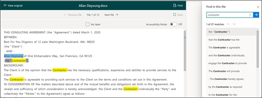
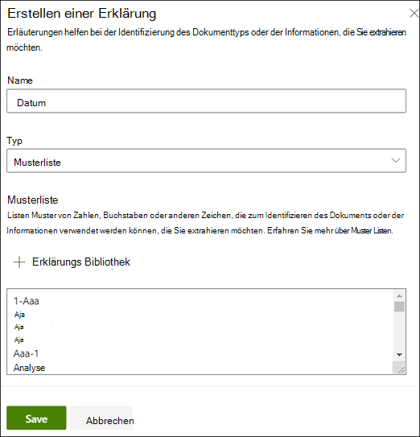
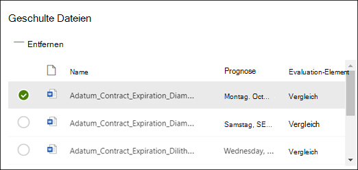
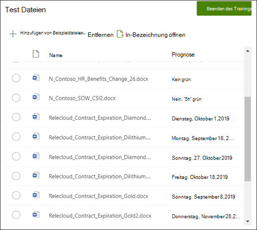

# Extraktor in Microsoft SharePoint Syntex erstellen

 

> [!VIDEO https://www.microsoft.com/videoplayer/embed/RE4CL2G]

  

Vor oder nach der Erstellung eines Klassifizierermodells zur Automatisierung der Identifikation und Klassifizierung bestimmter Dokumenttypen können Sie dem Modell optional Extraktoren hinzufügen, um diesen Dokumenten spezifische Informationen zu entnehmen. Vielleicht möchten Sie zum Beispiel, dass Ihr Modell nicht nur alle Dokumente zu *Vertragsverlängerungen* in Ihrer Dokumentbibliothek auffindet, sondern es soll auch für jedes Dokument das *Startdatum der Inbetriebnahme* als Spaltenwert in der Dokumentbibliothek angezeigt werden.

Dazu müssen Sie für jede Entität, die aus dem Dokument extrahiert werden soll, einen Extraktor erstellen. In unserem Beispiel möchten wir das  **Startdatum der Inbetriebnahme** für jedes Dokument zu  **Vertragsverlängerungen** , das von dem Modell identifiziert wird, extrahieren. Wir möchten in der Dokumentbibliothek eine Ansicht aller Dokumente zu  **Vertragsverlängerungen** und dazu eine Spalte, die den Wert für das **Startdatum der Inbetriebnahme** für jedes Dokument anzeigt. 

> [!NOTE]
> Für die Erstellung eines Extraktors benutzen Sie dieselben Dateien, die Sie zuvor hochgeladen haben, um den Klassifizierer zu trainieren. 

## Benennen des Extraktors

1. Klicken Sie auf der Startseite des Modells auf den Titel **Extraktoren erstellen und trainieren**, und wählen Sie dann **Extraktor trainieren** aus.
2. Geben Sie in der Anzeige **Neue Entitätsextraktionsfunktion** den Namen Ihres Extraktors in das Feld **Neuer Extraktorname** ein. Vergeben Sie beispielsweise den Namen **Startdatum der Inbetriebnahme**, wenn Sie das Startdatum der Inbetriebnahme aus jedem Dokument zu Vertragsverlängerungen extrahieren möchten. Sie können auch eine bereits erstellte Spalte wiederverwenden (beispielsweise eine Spalte mit verwalteten Metadaten).
> [!NOTE]
> Wenn Sie einen neuen Extraktor erstellen, dann **Neuer Spaltentyp** und **Einzelne Textzeile** auswählen, beträgt die maximale Anzahl von Zeichen 255. Alle Zeichen, die Sie eingeben und die das Limit überschreiten, werden abgeschnitten. 
3. Wenn Sie fertig sind, klicken Sie auf **Erstellen**.

## Hinzufügen einer Beschriftung

Im nächsten Schritt beschriften Sie die Entität, die Sie aus Ihren Beispiel-Schulungsdateien extrahieren möchten.

Durch das Erstellen eines Extraktors wird die Extraktorseite geöffnet. Dort sehen Sie eine Liste Ihrer Beispieldateien, wobei die erste Datei auf der Liste im Viewer angezeigt wird.

1. Wählen Sie im Viewer die Daten, die aus den Dateien extrahiert werden sollen. Möchten Sie beispielsweise das *Startdatum der Inbetriebnahme* extrahieren, markieren Sie den Datumswert in der ersten Datei (*Montag, 14. Oktober 2019*). Klicken Sie dann auf **Speichern**.  Der Wert sollte in der Liste mit beschrifteten Beispielen in der Spalte **Beschriftung** angezeigt werden.
2. Wählen Sie **Nächste Datei** aus, um die Datei automatisch zu speichern und die nächste Datei der Liste im Viewer anzeigen zu lassen. Oder wählen Sie **Speichern**, und wählen Sie dann eine andere Datei aus der Liste **Beschriftete Beispiele** aus.
3. Wiederholen Sie im Viewer die Schritte 1 und 2, und wiederholen Sie dann den gesamten Vorgang, bis Sie die Beschriftung aller fünf Dateien gespeichert haben.

     

 
Wenn Sie die Beschriftung der Dateien abgeschlossen haben, zeigt ein Benachrichtigungsbanner an, dass Sie zur Schulung fortfahren können.  Sie können noch weitere Dokumente beschriften oder mit der Schulung fortfahren. 

### Verwenden Sie „Suchen“, um Ihre Datei zu durchsuchen
Sie können das Feature <b>Suchen</b> verwenden, um nach einer Entität in Ihrem Dokument zu suchen, die Sie beschriften möchten.

    

Das Feature „Suchen“ ist hilfreich, wenn Sie ein großes Dokument durchsuchen oder wenn es mehrere Instanzen der Entität im Dokument gibt. Wenn Sie mehrere Instanzen finden, können Sie in den Suchergebnissen die Instanz auswählen, die Sie benötigen, um zu diesem Ort im Viewer zu wechseln, sodass Sie sie beschriften können.

## Hinzufügen einer Erläuterung

Für unser Beispiel erstellen wir eine Erläuterung, die Hinweise auf das Format der Entität selbst und auf etwaige Varianten in den Beispieldokumenten gibt. Beispielsweise kann ein Datum in unterschiedlichen Formaten angegeben werden, z. B.:
- 14/10/2019
- 14. Oktober 2019
- Montag, 14. Oktober 2019
 

Um die Erkennung des *Startdatums der Inbetriebnahme* zu unterstützen, können Sie eine Erläuterung des Musters hinzufügen.

1. Wählen Sie im Abschnitt Erläuterung **Neu** und geben Sie einen Namen ein (beispielsweise *Datum*).
2. Wählen Sie als Typ **Musterliste**.
3. Geben Sie als Wert die Datenvarianten an, wie sie in den Beispieldateien angezeigt werden. Wenn Sie z. B. Daten im Format 0/00/0000 haben, geben Sie sämtliche Varianten ein, die in Ihren Dokumenten angezeigt werden, wie z. B.:
    - 0/0/0000
    - 0/00/0000
    - 00/0/0000
    - 00/00/0000
4. Wählen Sie **Speichern** aus.

> [!NOTE]
> Weitere Informationen zu Erläuterungstypen erhalten Sie unter [Erläuterungstypen](./explanation-types-overview.md).  

### Verwenden der Erläuterungsbibliothek

Um Erläuterungen für Elemente wie Daten zu erstellen, ist es einfacher [die Erläuterungsbibliothek zu verwenden](./explanation-types-overview.md), als manuell alle Varianten einzugeben. Die Erläuterungsbibliothek ist eine Zusammenstellung vordefinierter Erläuterungen zu Begriffen und Mustern. In der Bibliothek wird versucht, alle Formate für häufige Begriffs- oder Musterlisten bereitzustellen, wie z. B. Telefonnummern, Postleitzahlen, und viele andere. 

FÜr das Beispiel mit dem *Startdatum der Inbetriebnahme* ist es effizienter, die vordefinierte Erläuterung für das *Datum* in der Erläuterungsbibliothek zu verwenden:

1. Wählen Sie im **Abschnitt Erläuterung** die Option **Neu**, und wählen Sie dann **Aus der Erläuterungsbibliothek**.
2. Wählen Sie in der Erläuterungsbibliothek **Datum**. Sie können alle Varianten von Datumsangaben anzeigen lassen, die erkannt werden.
3. Klicken Sie auf **Hinzufügen**. 

     

4. Auf der Seite **Eine Erläuterung erstellen** werden die Felder automatisch mit Informationen zum *Datum* aus der Erläuterungsbibliothek ausgefüllt. Wählen Sie **Speichern** aus. 

     

## Trainieren des Modells 

Durch das Speichern Ihrer Erläuterung starten Sie die Schulung. Wenn Ihr Modell über ausreichend Informationen verfügt, um Daten aus Ihrer Liste beschrifteter Beispiele zu extrahieren, wird jede Datei mit **Übereinstimmung** beschriftet.  

 

Wenn die Erläuterung nicht genügend Informationen enthält, um die Daten zu finden, die Sie extrahieren möchten, erhält jede Datei die Beschriftung **Keine Übereinstimmung**. Sie können auf die **Dateien ohne Übereinstimmung** klicken, um weitere Informationen darüber zu erhalten, warum keine Übereinstimmung gefunden werden konnte.

## Hinzufügen einer weiteren Erläuterung

Häufig ist die fehlende Übereinstimmung ein Hinweis darauf, dass die bereitgestellte Erläuterung nicht ausreichend Informationen zur Verfügung stellte, um das Startdatum für die Inbetriebnahme so zu extrahieren, dass es unseren beschrifteten Dateien entspricht. Möglicherweise müssen Sie die Erläuterung bearbeiten, oder eine weitere hinzufügen.

In unserem Beispiel können Sie sehen dass die Textzeichenfolge *Startdatum für die Inbetriebnahme von* immer vor dem tatsächlichen Wert steht. Um die Erkennung des Startdatums der Inbetriebnahme zu unterstützen, müssen Sie eine Erläuterung des Musters hinzufügen.

1. Wählen Sie im Abschnitt Erläuterung **Neu** und geben Sie einen Namen ein (beispielsweise *Präfixzeichenfolge*).
2. Wählen Sie als Typ **Begriffsliste**.
3. Verwenden Sie *Startdatum für die Inbetriebnahme von* als Wert.
4. Wählen Sie **Speichern** aus.

     

## Erneutes Trainieren des Modells

Durch das Speichern der Erläuterung wird die Schulung erneut gestartet. Dieses Mal werden beide Erläuterungen in dem Beispiel verwendet. Wenn Ihr Modell über ausreichend Informationen verfügt, um Daten aus der Liste beschrifteter Beispiele zu extrahieren, wird jede Datei mit **Übereinstimmung** beschriftet. 

Wenn Sie erneut **Keine Übereinstimmung** für Ihre beschrifteten Dateien erhalten, müssen Sie wahrscheinlich eine weitere Erläuterung erstellen, um dem Modell mehr Informationen zu liefern, mithilfe derer es den Dokumenttyp identifizieren kann, oder Änderungen an Ihren bestehenden Erläuterungen vornehmen.

## Testen Ihres Modells

Wenn Sie eine Übereinstimmung mit den beschrifteten Beispieldateien erhalten haben, können Sie nun das Modell für die restlichen nicht beschrifteten Beispieldateien testen. Das ist ein optionaler aber nützlicher Schritt, um die "Tauglichkeit" oder die Bereitschaft des Modells vor seiner Verwendung zu bewerten. Dazu wird es an Dateien getestet, die das Modell noch nie gesehen hat.

1. Klicken Sie auf der Startseite des Modells auf die Registerkarte **Test**. Dadurch wird das Modell für Ihre nicht beschrifteten Beispieldateien ausgeführt.
2. In der Liste der **Testdateien** werden Ihre Beispieldateien angezeigt, um zu zeigen, ob das Modell die benötigten Informationen extrahieren kann. Mithilfe dieser Informationen können Sie ermitteln, wie effektiv Ihr Klassifizierer bei der Identifizierung Ihrer Dokumente ist.

     

## Siehe auch
[Erstellen einer Klassifizierung](create-a-classifier.md)

[Beschreibungstypen](explanation-types-overview.md)

[Nutzung der Terminologiespeichertaxonomie beim Erstellen eines Extraktors](leverage-term-store-taxonomy.md)

[Übersicht über das Dokumentenverständnis](document-understanding-overview.md)

[Anwenden eines Modells](apply-a-model.md) 

[Barrierefreiheitsmodus für SharePoint Syntex](accessibility-mode.md)