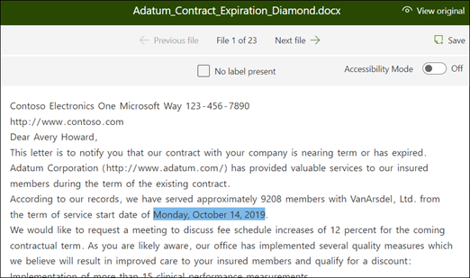

# Extraktor in Microsoft SharePoint Syntex erstellenCreate an extractor in Microsoft SharePoint Syntex

 

> [!VIDEO https://www.microsoft.com/videoplayer/embed/RE4CL2G]

  

Vor oder nach der Erstellung eines Klassifizierermodells zur Automatisierung der Identifikation und Klassifizierung bestimmter Dokumenttypen können Sie dem Modell optional Extraktoren hinzufügen, um diesen Dokumenten spezifische Informationen zu entnehmen.Before or after you create a classifier model to automate identification and classification of specific document types, you can optionally choose to add extractors to your model to pull out specific information from these documents. Vielleicht möchten Sie zum Beispiel, dass Ihr Modell nicht nur alle Dokumente zu *Vertragsverlängerungen* in Ihrer Dokumentbibliothek auffindet, sondern es soll auch für jedes Dokument das *Startdatum der Inbetriebnahme* als Spaltenwert in der Dokumentbibliothek angezeigt werden.For example, you may want your model not only to identify all *Contract Renewal* documents added to your document library, but also to display the *Service Start date* for each document as a column value in the document library.

Dazu müssen Sie für jede Entität, die aus dem Dokument extrahiert werden soll, einen Extraktor erstellen.You need to create an extractor for each entity in the document that you want to extract. In unserem Beispiel möchten wir das  **Startdatum der Inbetriebnahme** für jedes Dokument zu  **Vertragsverlängerungen** , das von dem Modell identifiziert wird, extrahieren.In our example, we want to extract the **Service Start Date** for each **Contract Renewal** document that is identified by the model. Wir möchten in der Dokumentbibliothek eine Ansicht aller Dokumente zu  **Vertragsverlängerungen** und dazu eine Spalte, die den Wert für das **Startdatum der Inbetriebnahme** für jedes Dokument anzeigt.We want to be able to see a view in the document library of all  **Contract Renewal** documents, with a column that shows the **Service Start** date value of each document. 

> [!NOTE]
> Für die Erstellung eines Extraktors benutzen Sie dieselben Dateien, die Sie zuvor hochgeladen haben, um den Klassifizierer zu trainieren.In order to create an extractor, you use the same files you previously uploaded to train the classifier. 

## Benennen des ExtraktorsName your extractor

1. Klicken Sie auf der Startseite des Modells auf den Titel **Extraktoren erstellen und trainieren**, und wählen Sie dann **Extraktor trainieren** aus.From the model home page, in the **Create and train extractors** tile, click **Train extractor**.
2. Geben Sie in der Anzeige **Neue Entitätsextraktionsfunktion** den Namen Ihres Extraktors in das Feld **Neuer Extraktorname** ein.On the **New entity extractor** screen, type the name of your extractor in the **New extractor name** field. Vergeben Sie beispielsweise den Namen **Startdatum der Inbetriebnahme**, wenn Sie das Startdatum der Inbetriebnahme aus jedem Dokument zu Vertragsverlängerungen extrahieren möchten.For example, name it **Service Start Date** if you want to extract the service start date from each Contract Renewal document. Sie können auch eine bereits erstellte Spalte wiederverwenden (beispielsweise eine Spalte mit verwalteten Metadaten).You can also choose to reuse a previously created column (for example, a managed metadata column).
> [!NOTE]
> Wenn Sie einen neuen Extraktor erstellen, dann **Neuer Spaltentyp** und **Einzelne Textzeile** auswählen, beträgt die maximale Anzahl von Zeichen 255.If you create a new extractor, then select **New column type** and choose **Single line of text**, the maximum character limit is 255. Alle Zeichen, die Sie eingeben und die das Limit überschreiten, werden abgeschnitten.Any characters that you type exceeding the limit get truncated. 
3. Wenn Sie fertig sind, klicken Sie auf **Erstellen**.When you're done, click **Create**.

## Hinzufügen einer BeschriftungAdd a label

Im nächsten Schritt beschriften Sie die Entität, die Sie aus Ihren Beispiel-Schulungsdateien extrahieren möchten.The next step is to label the entity you want to extract in your example training files.

Durch das Erstellen eines Extraktors wird die Extraktorseite geöffnet.Creating the extractor opens the extractor page. Dort sehen Sie eine Liste Ihrer Beispieldateien, wobei die erste Datei auf der Liste im Viewer angezeigt wird.Here you see a list of your sample files, with the first file on the list displayed in the viewer.

1. Wählen Sie im Viewer die Daten, die aus den Dateien extrahiert werden sollen.From the viewer, select the data that you want to extract from the files. Möchten Sie beispielsweise das *Startdatum der Inbetriebnahme* extrahieren, markieren Sie den Datumswert in der ersten Datei (*Montag, 14. Oktober 2019*).For example, if you want to extract the *Start Service Date*, you highlight the date value in the first file (*Monday, October 14, 2019*). Klicken Sie dann auf **Speichern**.and then click **Save**.  Der Wert sollte in der Liste mit beschrifteten Beispielen in der Spalte **Beschriftung** angezeigt werden.You should see the value display from the file in the Labeled examples list, under the **Label** column.
2. Wählen Sie **Nächste Datei** aus, um die Datei automatisch zu speichern und die nächste Datei der Liste im Viewer anzeigen zu lassen.Select **Next file** to auto save and open the next file in the list in the viewer. Oder wählen Sie **Speichern**, und wählen Sie dann eine andere Datei aus der Liste **Beschriftete Beispiele** aus.Or select **Save** and then select another file from the **Labeled examples** list.
3. Wiederholen Sie im Viewer die Schritte 1 und 2, und wiederholen Sie dann den gesamten Vorgang, bis Sie die Beschriftung aller fünf Dateien gespeichert haben.In the viewer, repeat steps 1 and 2, then repeat until you saved the label in all five files.

     

 
Wenn Sie die Beschriftung der Dateien abgeschlossen haben, zeigt ein Benachrichtigungsbanner an, dass Sie zur Schulung fortfahren können. Once you labeled five files, a notification banner displays informing you to move to training. Sie können noch weitere Dokumente beschriften oder mit der Schulung fortfahren.You can choose to more label more documents or advance to training. 

### Verwenden Sie „Suchen“, um Ihre Datei zu durchsuchenUse Find to search your file
Sie können das Feature <b>Suchen</b> verwenden, um nach einer Entität in Ihrem Dokument zu suchen, die Sie beschriften möchten.You can use the <b>Find</b> feature to search for an entity in your document that you want to label.

    

Das Feature „Suchen“ ist hilfreich, wenn Sie ein großes Dokument durchsuchen oder wenn es mehrere Instanzen der Entität im Dokument gibt.The Find feature is useful if you are searching a large document or if there are multiple instances of the entity in the document. Wenn Sie mehrere Instanzen finden, können Sie in den Suchergebnissen die Instanz auswählen, die Sie benötigen, um zu diesem Ort im Viewer zu wechseln, sodass Sie sie beschriften können.If you find multiple instances, you can select the one you need in the search results to go to that location in the viewer to label it.

## Hinzufügen einer ErläuterungAdd an explanation

Für unser Beispiel erstellen wir eine Erläuterung, die Hinweise auf das Format der Entität selbst und auf etwaige Varianten in den Beispieldokumenten gibt.For our example, we are going to create an explanation that provides a hint about the entity format itself and variations it may have in the sample documents. Beispielsweise kann ein Datum in unterschiedlichen Formaten angegeben werden, z. B.:For example, a date value can be in a number of different formats, such as:
- 14/10/201910/14/2019
- 14. Oktober 2019October 14, 2019
- Montag, 14. Oktober 2019Monday, October 14, 2019
 

Um die Erkennung des *Startdatums der Inbetriebnahme* zu unterstützen, können Sie eine Erläuterung des Musters hinzufügen.To help identify the *Service Start Date* you can create a pattern explanation.

1. Wählen Sie im Abschnitt Erläuterung **Neu** und geben Sie einen Namen ein (beispielsweise *Datum*).In the Explanation section, select **New** and type a name (for example, *Date*).
2. Wählen Sie als Typ **Musterliste**.For Type, select **Pattern list**.
3. Geben Sie als Wert die Datenvarianten an, wie sie in den Beispieldateien angezeigt werden.For Value, provide the date variation as they appear in the sample files. Wenn Sie z. B. Daten im Format 0/00/0000 haben, geben Sie sämtliche Varianten ein, die in Ihren Dokumenten angezeigt werden, wie z. B.:For example, if you have date formats that appear as 0/00/0000, you enter any variations that appear in your documents, such as:
    - 0/0/00000/0/0000
    - 0/00/00000/00/0000
    - 00/0/000000/0/0000
    - 00/00/000000/00/0000
4. Wählen Sie **Speichern** aus.Select **Save**.

> [!NOTE]
> Weitere Informationen zu Erläuterungstypen erhalten Sie unter [Erläuterungstypen](https://docs.microsoft.com/microsoft-365/contentunderstanding/explanation-types-overview).For more learn more about explanation types, see [Explanation types](https://docs.microsoft.com/microsoft-365/contentunderstanding/explanation-types-overview).  

### Verwenden der ErläuterungsbibliothekUse the Explanation library

Um Erläuterungen für Elemente wie Daten zu erstellen, ist es einfacher [die Erläuterungsbibliothek zu verwenden](https://docs.microsoft.com/microsoft-365/contentunderstanding/explanation-types-overview#use-the-explanation-library), als manuell alle Varianten einzugeben.For creating explanations for items such as dates, it is easier to [use the explanation library](https://docs.microsoft.com/microsoft-365/contentunderstanding/explanation-types-overview#use-the-explanation-library) than to manually enter all variations. Die Erläuterungsbibliothek ist eine Zusammenstellung vordefinierter Erläuterungen zu Begriffen und Mustern.The explanation library is a set of pre-built phrase and pattern explanations. In der Bibliothek wird versucht, alle Formate für häufige Begriffs- oder Musterlisten bereitzustellen, wie z. B. Telefonnummern, Postleitzahlen, und viele andere.The library tries to provides all formats for common phrase or pattern lists, such as dates, phone numbers, zip codes, and many others. 

FÜr das Beispiel mit dem *Startdatum der Inbetriebnahme* ist es effizienter, die vordefinierte Erläuterung für das *Datum* in der Erläuterungsbibliothek zu verwenden:For the *Service Start Date* sample, it is more efficient to use the pre-built explanation for *Date* in the explanation library:

1. Wählen Sie im **Abschnitt Erläuterung** die Option **Neu**, und wählen Sie dann **Aus der Erläuterungsbibliothek**.In the **Explanation section**, select **New**, and then select **From explanation library**.
2. Wählen Sie in der Erläuterungsbibliothek **Datum**.From the explanation library, select **Date**. Sie können alle Varianten von Datumsangaben anzeigen lassen, die erkannt werden.You can view all variations of date that are recognized.
3. Klicken Sie auf **Hinzufügen**.Select **Add**. 

     

4. Auf der Seite **Eine Erläuterung erstellen** werden die Felder automatisch mit Informationen zum *Datum* aus der Erläuterungsbibliothek ausgefüllt.On the **Create an explanation** page, the *Date* information from the explanation library auto fills the fields. Wählen Sie **Speichern** aus.Select **Save**. 

     

## Trainieren des ModellsTrain the model 

Durch das Speichern Ihrer Erläuterung starten Sie die Schulung.Saving your explanation start the training. Wenn Ihr Modell über ausreichend Informationen verfügt, um Daten aus Ihrer Liste beschrifteter Beispiele zu extrahieren, wird jede Datei mit **Übereinstimmung** beschriftet.If your model has enough information to extract the data from your labeled example files, you will see each file labeled with **Match**.  

 

Wenn die Erläuterung nicht genügend Informationen enthält, um die Daten zu finden, die Sie extrahieren möchten, erhält jede Datei die Beschriftung **Keine Übereinstimmung**.If the explanation does not have enough information to find the data you want to extract, each file will be labeled with **Mismatch**. Sie können auf die **Dateien ohne Übereinstimmung** klicken, um weitere Informationen darüber zu erhalten, warum keine Übereinstimmung gefunden werden konnte.You can click on the **Mismatched** files to see more information about why there was a mismatch.

## Hinzufügen einer weiteren ErläuterungAdd another explanation

Häufig ist die fehlende Übereinstimmung ein Hinweis darauf, dass die bereitgestellte Erläuterung nicht ausreichend Informationen zur Verfügung stellte, um das Startdatum für die Inbetriebnahme so zu extrahieren, dass es unseren beschrifteten Dateien entspricht.Often the mismatch is an indication that the explanation we provided did not provide enough information to extract the service start date value to match our labeled files. Möglicherweise müssen Sie die Erläuterung bearbeiten, oder eine weitere hinzufügen.You may need to edit it, or add another explanation.

In unserem Beispiel können Sie sehen dass die Textzeichenfolge *Startdatum für die Inbetriebnahme von* immer vor dem tatsächlichen Wert steht.For our example, notice that the text string *Start Service date of* always precedes the actual value. Um die Erkennung des Startdatums der Inbetriebnahme zu unterstützen, müssen Sie eine Erläuterung des Musters hinzufügen.To help identify the Service Start Date, you need to create a phrase explanation.

1. Wählen Sie im Abschnitt Erläuterung **Neu** und geben Sie einen Namen ein (beispielsweise *Präfixzeichenfolge*).In the Explanation section, select **New**, and then type a name (for example, *Prefix String*).
2. Wählen Sie als Typ **Begriffsliste**.For the Type, select **Phrase list**.
3. Verwenden Sie *Startdatum für die Inbetriebnahme von* als Wert.Use *Service Start Date of* as the value.
4. Wählen Sie **Speichern** aus.Select **Save**.

     

## Erneutes Trainieren des ModellsTrain the model again

Durch das Speichern der Erläuterung wird die Schulung erneut gestartet. Dieses Mal werden beide Erläuterungen in dem Beispiel verwendet.Saving the explanation starts the training again, this time using both explanations in the example. Wenn Ihr Modell über ausreichend Informationen verfügt, um Daten aus der Liste beschrifteter Beispiele zu extrahieren, wird jede Datei mit **Übereinstimmung** beschriftet.If your model has enough information to extract the data from the labeled example files, you see each file labeled with **Match**. 

Wenn Sie erneut **Keine Übereinstimmung** für Ihre beschrifteten Dateien erhalten, müssen Sie wahrscheinlich eine weitere Erläuterung erstellen, um dem Modell mehr Informationen zu liefern, mithilfe derer es den Dokumenttyp identifizieren kann, oder Änderungen an Ihren bestehenden Erläuterungen vornehmen.If you again receive a **Mismatch** on your labeled files, you likely need to create another explanation to provide the model more information to identify the document type, or consider making changes to your existing ones.

## Testen Ihres ModellsTest your model

Wenn Sie eine Übereinstimmung mit den beschrifteten Beispieldateien erhalten haben, können Sie nun das Modell für die restlichen nicht beschrifteten Beispieldateien testen.If you receive a match on your labeled sample files, you can now test your model on the remaining unlabeled example files. Das ist ein optionaler aber nützlicher Schritt, um die "Tauglichkeit" oder die Bereitschaft des Modells vor seiner Verwendung zu bewerten. Dazu wird es an Dateien getestet, die das Modell noch nie gesehen hat.This is optional, but a useful step to evaluate the “fitness” or readiness of the model before using it, by testing it on files the model hasn’t seen before.

1. Klicken Sie auf der Startseite des Modells auf die Registerkarte **Test**. Dadurch wird das Modell für Ihre nicht beschrifteten Beispieldateien ausgeführt.From the model home page, click the **Test** tab.  This runs the model on your unlabeled sample files.
2. In der Liste der **Testdateien** werden Ihre Beispieldateien angezeigt, um zu zeigen, ob das Modell die benötigten Informationen extrahieren kann.In the **Test files** list, your example files display to show if the model is able to extract the information you need. Mithilfe dieser Informationen können Sie ermitteln, wie effektiv Ihr Klassifizierer bei der Identifizierung Ihrer Dokumente ist.Use this information to help determine the effectiveness of your classifier in identifying your documents.

     

## Siehe auchSee Also
[Erstellen einer KlassifizierungCreate a classifier](create-a-classifier.md)

[BeschreibungstypenExplanation types](explanation-types-overview.md)

[Nutzung der Terminologiespeichertaxonomie beim Erstellen eines ExtraktorsLeverage term store taxonomy when creating an extractor](leverage-term-store-taxonomy.md)

[Übersicht über das DokumentenverständnisDocument Understanding overview](document-understanding-overview.md)

[Anwenden eines ModellsApply a model](apply-a-model.md) 

[Barrierefreiheitsmodus für SharePoint SyntexSharePoint Syntex Accessibility Mode](accessibility-mode.md)
