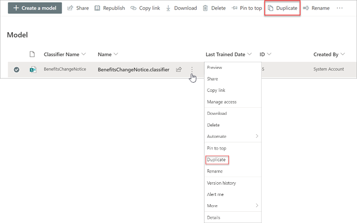
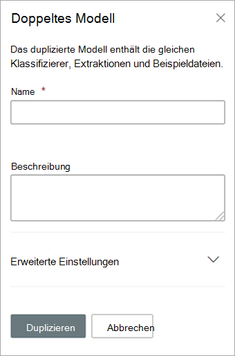

# Duplizieren eines Modells in Microsoft SharePoint SyntexDuplicate a model in Microsoft SharePoint Syntex

Das Duplizieren eines Dokumentverständnismodells kann Ihnen Zeit und Mühe ersparen, wenn Sie ein neues Modell erstellen müssen und wissen, dass ein vorhandenes Modell dem, was Sie benötigen, sehr ähnlich ist.Duplicating a document understanding model can save you time and effort if you need to create a new model, and know that an existing model is very similar to what you need.

Ein vorhandenes Modell mit dem Namen „Verträge“ klassifiziert zum Beispiel die gleichen Dateien, mit denen Sie arbeiten müssen.For example, an existing model named “Contracts” classifies the same files you need to work with. Ihr neues Modell wird einige der vorhandenen Daten extrahieren, muss aber aktualisiert werden, um einige zusätzliche Daten zu extrahieren.Your new model will extract some of the existing data, but will need to be updated to extract some additional data. Anstatt ein neues Modell von Grund auf zu erstellen und zu trainieren, können Sie die Funktion „Modell duplizieren“ verwenden, um eine Kopie des Vertragsmodells zu erstellen, die auch alle zugehörigen Schulungselemente wie Beispieldateien und Entitätsextraktionsfunktionen kopiert.Instead of creating and training a new model from scratch, you can use the duplicate model feature to make a copy of the Contracts model, which will also copy all associated training items, such as example files and entity extractors.

Wenn Sie das Modell duplizieren, können Sie, nachdem Sie es umbenannt haben (z. B. in „Vertragsverlängerungen“), Aktualisierungen daran vornehmen.When you duplicate the model, after you rename it (for example, to “Contract Renewals”), you can then make updates to it. Sie können z. B. einige der vorhandenen extrahierten Felder entfernen, die Sie nicht benötigen, und dann das Modell trainieren, um ein neues zu extrahieren (z. B. „Verlängerungsdatum“).For example, you can choose to remove some of the existing extracted fields that you don’t need, and then train the model to extract a new one (for example, “Renewal date”).

## Ein Modell duplizierenDuplicate a model

Führen Sie die folgenden Schritte aus, um ein Document Understanding Model zu duplizieren.Follow these steps to duplicate a document understanding model.

1. Wählen Sie im Inhaltscenter **Modelle** aus, um die Liste ihrer Modelle anzuzeigen.From the content center, select **Models** to see your models list.

2. Wählen Sie auf der Seite **Modelle** das Modell aus, das Sie duplizieren möchten.On the **Models** page, select the model you want to duplicate.

3. Wählen Sie entweder über das Menüband oder über die Schaltfläche **Aktionen anzeigen** (neben dem Modellnamen) die Option **Duplizieren**.By using either the ribbon or the **Show actions** button (next to the model name), select **Duplicate**. 

      

4. Im Bedienfeld **Modell duplizieren**:On the **Duplicate model** panel:

   a.a. Geben Sie unter **Name** den neuen Namen des Modells ein, das Sie duplizieren möchten.Under **Name**, enter the new name of the model that you want to duplicate. 

      

   b.b. Fügen Sie unter **Beschreibung** eine Beschreibung Ihres neuen Modells hinzu.Under **Description**, add a description of your new model.

   c.c. (Optional) Wählen Sie unter **Erweiterte Einstellungen**, ob Sie einen vorhandenen [Inhaltstyp](/sharepoint/governance/content-type-and-workflow-planning#content-type-overview) zuordnen möchten.(Optional) Under **Advanced settings**, select whether you want to associate an existing [content type](/sharepoint/governance/content-type-and-workflow-planning#content-type-overview).

5. Wählen Sie **Duplizieren**.Select **Duplicate**.

## Siehe auchSee Also
[Erstellen einer KlassifizierungCreate a classifier](create-a-classifier.md)

[Ein Modell umbenennenRename a model](rename-a-model.md)

[Erstellen eines ExtraktorsCreate an extractor](create-an-extractor.md)

[Übersicht über das DokumentenverständnisDocument Understanding overview](document-understanding-overview.md)

[BeschreibungstypenExplanation types](explanation-types-overview.md)

[Anwenden eines ModellsApply a model](apply-a-model.md) 

[Barrierefreiheitsmodus für SharePoint SyntexSharePoint Syntex Accessibility Mode](accessibility-mode.md)