# Einführung in Erklärungstypen

Erklärungen werden verwendet, um die Informationen zu definieren, die Sie in Ihren Document Understanding-Modellen in Microsoft SharePoint Syntex bezeichnen und extrahieren möchten. Wenn Sie eine Erklärung erstellen, müssen Sie einen Erklärungstyp auswählen. Dieser Artikel hilft Ihnen dabei, die verschiedenen Erklärungstypen und ihre Verwendung zu verstehen. 

   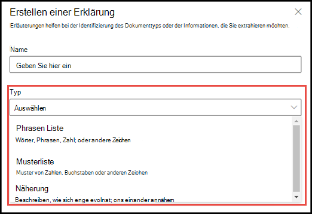 
   
Diese Erklärungstypen stehen zur Verfügung:

- **Begriffsliste**: Liste von Wörtern, Phrasen, Zahlen oder anderen Zeichen, die Sie in dem Dokument oder der Information, die Sie extrahieren, verwenden können. Zum Beispiel ist die Textzeichenfolge **Überweisender Arzt** in allen Dokumenten "Ärztliche Überweisung" enthalten, die Sie identifizieren. 

- **Musterliste**: Auflisten von Mustern aus Zahlen, Buchstaben oder anderen Zeichen, die Sie zur Identifizierung der Informationen, die Sie extrahieren, verwenden können. Sie können beispielsweise die **Telefonnummer** des überweisenden Arztes aus allen Dokumenten "Ärztliche Überweisung" extrahieren, die Sie identifizieren. 

- **Näherung**: Beschreibt, wie nahe die Erklärungen beieinander liegen. Zum Beispiel geht eine Musterliste *Straßennummer* direkt vor die Begriffsliste *Straßenname*, ohne Token dazwischen (Sie werden später in diesem Artikel mehr über Token erfahren). Die Verwendung des Näherungstyps erfordert, dass Sie mindestens zwei Erklärungen in Ihrem Modell haben, ansonsten die Option deaktiviert wird. 
 
## Begriffsliste

Der Erklärungstyp "Begriffsliste" wird normalerweise verwendet, um ein Dokument durch Ihr Modell zu identifizieren und zu klassifizieren. Wie im Beispiel der Bezeichnung *Überweisender Arzt* beschrieben, handelt es sich dabei um eine Kette von Wörtern, Phrasen, Zahlen oder Zeichen, die in den Dokumenten, die Sie identifizieren, konsistent ist.

Auch wenn dies keine Voraussetzung ist, können Sie mit Ihrer Erklärung einen besseren Erfolg erzielen, wenn die Phrase, die Sie erfassen, sich an einer konsistenten Stelle in Ihrem Dokument befindet. Beispielsweise kann sich die Bezeichnung *Überweisender Arzt* durchgängig im ersten Absatz des Dokuments befinden.

Wenn die Groß-/Kleinschreibung bei der Identifizierung Ihrer Bezeichnung beachtet werden muss, können Sie dies in Ihrer Erklärung mit dem Typ "Begriffsliste" angeben, indem Sie das Kontrollkästchen **Nur exakte Groß-/Kleinschreibung** aktivieren.

   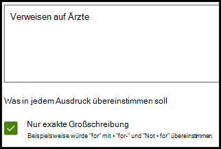 

## Musterlisten

Ein Musterlistentyp ist besonders nützlich, wenn Sie eine Erklärung erstellen, die Informationen aus einem Dokument identifiziert und extrahiert. Er wird in der Regel in verschiedenen Formaten dargestellt, wie z. B. Datum, Telefonnummern und Kreditkartennummern. Beispielsweise kann ein Datum in verschiedenen Formaten angezeigt werden (1/1/2020, 1-1-2020, 01/01/20, 01/01/2020, 1.1.2020 usw.). Die Definition einer Musterliste macht Ihre Erklärung effizienter, indem sie alle möglichen Variationen in den Daten erfasst, die Sie zu identifizieren und zu extrahieren versuchen. 

Für das Beispiel **Telefonnummer** extrahieren Sie die Telefonnummer für jeden überweisenden Arzt aus allen Dokumenten "Ärztliche Überweisung", die das Modell identifiziert. Wenn Sie die Erklärung erstellen, wählen Sie den Musterlistentyp aus, um die verschiedenen Formate zuzulassen, von denen Sie erwarten können, dass sie zurückgegeben werden.

   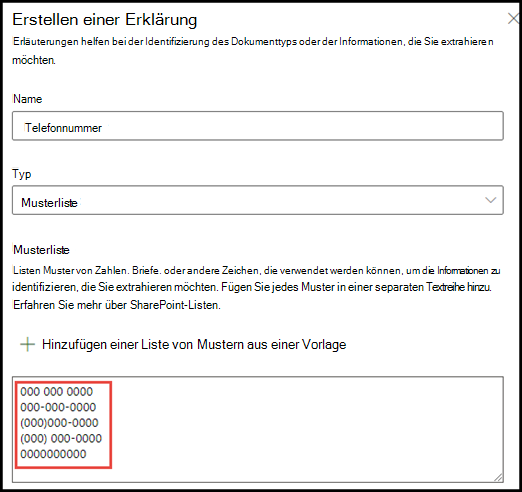

Wählen Sie in diesem Beispiel das Kontrollkästchen **Beliebige Ziffer von 0-9** aus, um zu erkennen, dass es sich bei jedem in Ihrer Musterliste verwendeten „0“-Wert um eine beliebige Ziffer von 0 bis 9 handelt.

   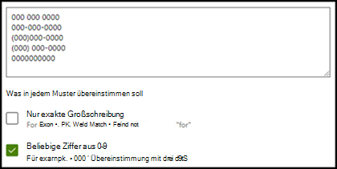

Wenn Sie eine Musterliste erstellen, die Textzeichen enthält, wählen Sie in ähnlicher Weise das Kontrollkästchen **Beliebige Buchstaben von a-z** aus, um zu erkennen, dass es sich bei jedem in Ihrer Musterliste verwendeten "a" -Zeichen um ein beliebiges Zeichen zwischen "a" und "z" handelt.

Wenn Sie beispielsweise eine Musterliste **Datum** erstellen und sicherstellen möchten, dass ein Datumsformat wie z. B. *Jan 1, 2020* erkannt wird, müssen Sie Folgendes tun:
- Fügen Sie Ihrer Musterliste *aaa 0, 0000* und *aaa 00, 0000* hinzu.
- Stellen Sie sicher, dass auch **Beliebiger Buchstabe von a-z** ausgewählt ist.

   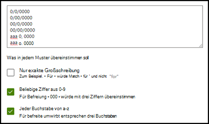

Wenn Sie in Ihrer Musterliste Groß-/Kleinschreibungsanforderungen haben, haben Sie zusätzlich die Möglichkeit, das Kontrollkästchen **Nur genaue Groß-/Kleinschreibung** zu aktivieren. Wenn Sie für das Beispiel "Datum" den ersten Buchstaben des Monats groß schreiben möchten, müssen Sie Folgendes tun:

- Fügen Sie Ihrer Musterliste *Aaa 0, 0000* und *Aaa 00, 0000* hinzu.
- Stellen Sie sicher, dass auch **Nur genaue Groß-/Kleinschreibung** ausgewählt ist.

   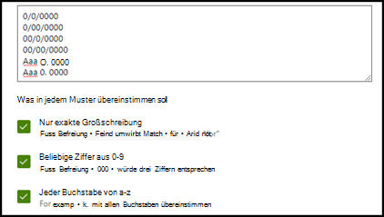

> [!NOTE]
> Statt eine Musterlistenerklärung manuell zu erstellen, verwenden Sie die [Erklärungsbibliothek](https://docs.microsoft.com/microsoft-365/contentunderstanding/explanation-types-overview#use-explanation-templates), um Musterlistenvorlagen für allgemeine Musterlisten zu verwenden, wie z. B. *Datum*, *Telefonnummer*, *Kreditkartennummer* usw.

## Näherung 

Der Erklärungstyp "Näherung" hilft Ihrem Modell bei der Identifizierung von Daten, indem er definiert, wie nahe ein anderes Datenelement an ihm liegt. Beispielsweise haben Sie in Ihrem Modell zwei Erklärungen definiert, die sowohl die *Straßennummer* als auch die *Telefonnummer* des Kunden bezeichnen. 

Beachten Sie, dass die Telefonnummern des Kunden immer vor der Straßennummer steht. 

Alex Wilburn 
555-555-5555 
Langgasse 18 
54123 Münchfeld 

Verwenden Sie die Näherungserklärung, um festzulegen, wie weit die Erklärung "Telefonnummer" entfernt ist, um die Straßennummer in Ihren Dokumenten besser identifizieren zu können.

   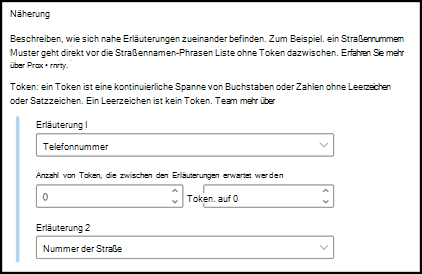 

#### Was sind Token?

Um den Erklärungstyp "Näherung" verwenden zu können, müssen Sie verstehen, was ein Token ist, da die Anzahl der Token angibt, wie die Näherungserklärung den Abstand von einer Erklärung zur anderen misst. Ein Token ist eine kontinuierliche Reihe (ohne Leerzeichen oder Interpunktionen) von Buchstaben und Zahlen. 

Die folgende Tabelle zeigt Beispiele, wie die Anzahl der Token in einer Phrase ermittelt wird.

|Phrase|Anzahl von Token|Erklärung|
|--|--|--|
|`Dog`|1|Ein einzelnes Wort ohne Interpunktionszeichen oder Leerzeichen.|
|`RMT33W`|1|Eine Datensatz-Locator-Nummer. Sie kann Zahlen und Buchstaben beinhalten, hat aber keine Interpunktion.|
|`425-555-5555`|5|Eine Telefonnummer. Jedes Interpunktionszeichen ist ein einzelnes Token, also ist `425-555-5555` 5 Tokens: `425` `-` `555` `-` `5555` |
|`https://luis.ai`|7|`https` `:` `/` `/` `luis` `.` `ai` |

#### Konfigurieren des Erklärungstyps "Näherung"

Konfigurieren Sie für das Beispiel die Näherungseinstellung, um den Bereich der Anzahl der Token in der *Telefonnummer*-Erklärung aus der *Straßenadressnummer*-Erklärung zu definieren. Beachten sie, dass der Mindestbereich „0“ ist, da es keine Token zwischen der Telefonnummer und der Straßenadressnummer gibt.

Einige Telefonnummern in den Beispieldokumenten sind jedoch mit *(Mobil)* ergänzt.

Nestor Wilke 
111-111-1111 (Mobil) 
Langgasse 18 
54123 Münchfeld 

Es gibt drei Token in *(Mobil)*:

|Phrase|Tokenzahl|
|--|--|
|(|1|
|Mobil|2|
|)|3|

Konfigurieren Sie die Einstellung für die Näherung so, dass sie einen Wert von 0 bis 3 aufweist.

   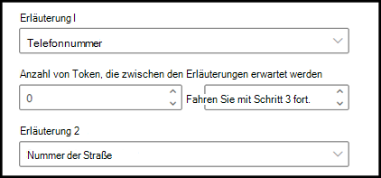 

## Konfigurieren Sie, wo Ausdrücke im Dokument vorkommen.

Wenn Sie eine Erklärung erstellen, wird standardmäßig im gesamten Dokument nach dem Ausdruck gesucht, den Sie extrahieren möchten. Sie können jedoch die erweiterte Einstellung <b>Wo diese Ausdrücke vorkommen</b> verwenden, um eine bestimmte Stelle im Dokument zu isolieren, an der ein Ausdruck vorkommt. Dies ist in Situationen hilfreich, in denen ähnliche Instanzen eines Ausdrucks möglicherweise an einer anderen Stelle im Dokument auftreten und Sie sicherstellen möchten, dass der richtige Ausdruck ausgewählt ist. Unter Bezugnahme auf unser Dokument mit medizinischen Empfehlungen wird der **überweisende Arzt** immer im ersten Absatz des Dokuments erwähnt. Mit der Einstellung <b>Wo diese Ausdrücke vorkommen</b> können Sie in diesem Beispiel Ihre Erklärung so konfigurieren, dass nach dieser Bezeichnung nur im Anfangsabschnitt des Dokuments oder an einer anderen Stelle gesucht wird, an der sie möglicherweise vorkommt.

    

Sie können für diese Einstellung die folgenden Optionen auswählen:

- An beliebiger Stelle in der Datei: Es wird das gesamte Dokument nach dem Ausdruck durchsucht.
- Anfang der Datei: Das Dokument wird vom Anfang bis zur Position des Ausdrucks durchsucht.  
   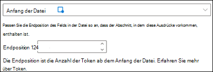 
Im Viewer können Sie das Auswahlfeld manuell anpassen, um die Position einzugeben, an der die Phase erscheint. Der Wert <b>Endposition</b> wird aktualisiert und zeigt die Anzahl der Token an, die im ausgewählten Bereich enthalten sind. Beachten Sie, dass Sie auch den Endpositionswert aktualisieren können, um den ausgewählten Bereich anzupassen. 
    

- Ende der Datei: Das Dokument wird vom Ende bis zur Position des Ausdrucks durchsucht.  
    
Im Viewer können Sie das Auswahlfeld manuell anpassen, um die Position einzugeben, an der die Phase erscheint. Der Wert <b>Startposition</b> wird aktualisiert und zeigt die Anzahl der Token an, die im ausgewählten Bereich enthalten sind. Beachten Sie, dass Sie auch den Startpositionswert aktualisieren können, um den ausgewählten Bereich anzupassen.  
    
- Benutzerdefiniert: Das Dokument wird in einem bestimmten Bereich innerhalb des Dokuments nach der Position des Ausdrucks durchsucht.  
   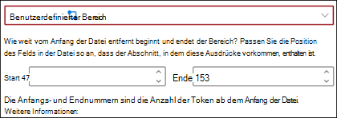 
Im Viewer können Sie das Auswahlfeld manuell anpassen, um die Position einzugeben, an der die Phase erscheint. Für diese Einstellung müssen Sie je eine Position <b>Start</b> und <b>Ende</b> auswählen. Diese Werte stellen die Anzahl der Token ab dem Anfang des Dokuments dar. Sie können diese Werte zwar manuell eingeben, doch ist es einfacher, das Auswahlfeld im Viewer manuell anzupassen.  
   

## Verwenden von Erklärungsvorlagen

Während Sie manuell verschiedene Musterlistenwerte für Ihre Erklärung hinzufügen können, kann es einfacher sein, die Vorlagen zu verwenden, die Ihnen in der Erklärungsbibliothek zur Verfügung gestellt werden.

Statt z. B. alle Varianten für *Datum* manuell hinzuzufügen, können Sie die Musterlistenvorlage für *Datum* verwenden, da diese bereits eine Reihe von Musterlistenwerten enthält: 

   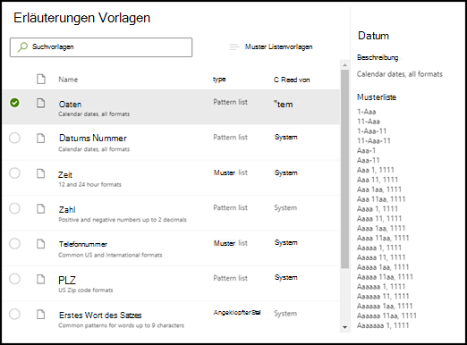 
 
Die Erklärungsbibliothek enthält häufig verwendeten Musterlistenerklärungen, einschließlich: 

- Datum 
- Datum (numerisch) 
- Zeit 
- Zahl 
- Telefonnummer 
- PLZ 
- Erstes Wort des Satzes 
- Kreditkarte 
- Sozialversicherungsnummer 

Beachten Sie, dass die Erklärungsbibliothek auch Vorlagen für Begriffslistenerklärungen enthält:
- Ende des Satzes
- Währung

#### Verwenden einer Vorlage aus der Erklärungsbibliothek

1. Wählen Sie im Abschnitt **Erklärungen** auf der Seite **Trainieren** Ihres Modells **Neu** aus und dann **Aus einer Vorlage**. 

   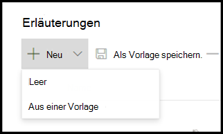 

2.  Wählen Sie auf der Seite **Erklärungsvorlagen** die Erklärung aus, die Sie verwenden möchten, dann wählen Sie **Hinzufügen** aus. 

        

3. Die Informationen für die von Ihnen ausgewählte Vorlage sind auf der Seite **Erklärung erstellen** dargestellt. Bearbeiten Sie bei Bedarf den Namen der Erklärung und fügen Sie Elemente zur Musterliste hinzu oder entfernen Sie diese.   

   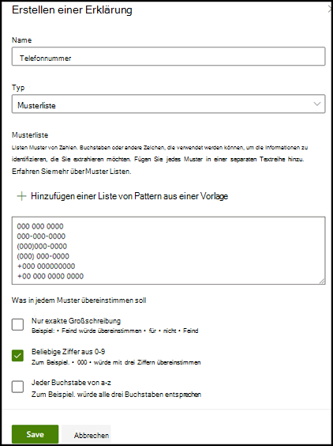 

4. Wählen Sie anschließend **Speichern**.
