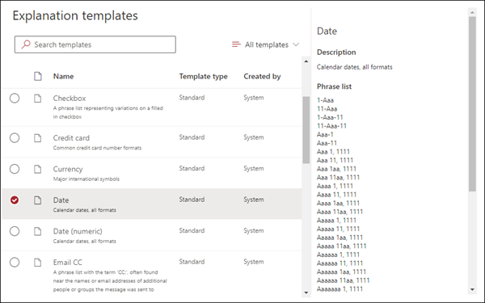

# Einführung in ErklärungstypenIntroduction to explanation types

Erklärungen werden verwendet, um die Informationen zu definieren, die Sie in Ihren Document Understanding-Modellen in Microsoft SharePoint Syntex bezeichnen und extrahieren möchten.Explanations are used to help to define the information you want to label and extract in your document understanding models in Microsoft SharePoint Syntex. Wenn Sie eine Erklärung erstellen, müssen Sie einen Erklärungstyp auswählen.When creating an explanation, you need to select an explanation type. Dieser Artikel hilft Ihnen dabei, die verschiedenen Erklärungstypen und ihre Verwendung zu verstehen.This article helps you understand the different explanation types and how they are used. 

 
   
Diese Erklärungstypen stehen zur Verfügung:These explanation types are available:

- **Begriffsliste**: Liste von Wörtern, Phrasen, Zahlen oder anderen Zeichen, die Sie in dem Dokument oder der Information, die Sie extrahieren, verwenden können.**Phrase list**: List of words, phrases, numbers, or other characters you can use in the document or information that you are extracting. Zum Beispiel ist die Textzeichenfolge **Überweisender Arzt** in allen Dokumenten "Ärztliche Überweisung" enthalten, die Sie identifizieren.For example, the text string **Referring Doctor** is in all Medical Referral documents you are identifying. Oder die **Telefonnummer** des überweisenden Arztes aus allen von Ihnen identifizierten medizinischen Überweisungsdokumenten.Or the **Phone number** of the referring doctor from all Medical Referral document that you are identifying.

- **Näherung**: Beschreibt, wie nahe die Erklärungen beieinander liegen.**Proximity**: Describes how close explanations are to each other. Eine *Straßennummern*-Begriffsliste wird beispielsweise direkt vor der *Straßennamen*-Begriffsliste ohne dazwischen liegende Token angezeigt (Informationen zu Token finden Sie weiter unten in diesem Artikel).For example, a *street number* phrase list goes right before the *street name* phrase list, with no tokens in between (you'll learn about tokens later in this article). Die Verwendung des Näherungstyps erfordert, dass Sie mindestens zwei Erklärungen in Ihrem Modell haben, ansonsten die Option deaktiviert wird.Using the proximity type requires you to have at least two explanations in your model or the option will be disabled. 
 
## BegriffslistePhrase list

Der Erklärungstyp "Begriffsliste" wird normalerweise verwendet, um ein Dokument durch Ihr Modell zu identifizieren und zu klassifizieren.A phrase list explanation type is typically used to identify and classify a document through your model. Wie im Beispiel der Bezeichnung *Überweisender Arzt* beschrieben, handelt es sich dabei um eine Kette von Wörtern, Phrasen, Zahlen oder Zeichen, die in den Dokumenten, die Sie identifizieren, konsistent ist.As described in the *Referring Doctor* label example, it is a string of words, phrases, numbers, or characters that is consistently in the documents that you are identifying.

Auch wenn dies keine Voraussetzung ist, können Sie mit Ihrer Erklärung einen besseren Erfolg erzielen, wenn die Phrase, die Sie erfassen, sich an einer konsistenten Stelle in Ihrem Dokument befindet.While not a requirement, you can achieve better success with your explanation if the phrase you are capturing is located in a consistent location in your document. Beispielsweise kann sich die Bezeichnung *Überweisender Arzt* durchgängig im ersten Absatz des Dokuments befinden.For example, the *Referring Doctor* label may be consistently located in the first paragraph of the document. Sie können auch die Option **[Konfigurieren von im Dokument vorkommenden Begriffen](https://docs.microsoft.com/microsoft-365/contentunderstanding/explanation-types-overview#configure-where-phrases-occur-in-the-document)** in der erweiterten Dokumenteinstellung verwenden, um bestimmte Bereiche auszuwählen, in denen sich der Begriff befindet, insbesondere wenn die Möglichkeit besteht, dass der Begriff an mehreren Stellen in Ihrem Dokument vorkommt.You can also use the **[Configure where phrases occur in the document](https://docs.microsoft.com/microsoft-365/contentunderstanding/explanation-types-overview#configure-where-phrases-occur-in-the-document)** advanced setting to select specific areas where the phrase is located, especially if there is a chance that the phrase might occur in multiple locations in your document.

Wenn die Groß-/Kleinschreibung bei der Identifizierung Ihrer Bezeichnung beachtet werden muss, können Sie dies in Ihrer Erklärung mit dem Typ "Begriffsliste" angeben, indem Sie das Kontrollkästchen **Nur exakte Groß-/Kleinschreibung** aktivieren.If case sensitivity is a requirement in identifying your label, using the phrase list type allows you to specify it in your explanation by selecting the **Only exact capitalization** checkbox.

 

Ein Begriffstyp ist besonders nützlich, wenn Sie eine Erklärung erstellen, die Informationen in verschiedenen Formaten wie Datum, Telefonnummer und Kreditkartennummer identifiziert und extrahiert.A phrase type is especially useful when you create an explanation that identifies and extracts information in different formats, such as dates, phone numbers, and credit card numbers. Beispielsweise kann ein Datum in verschiedenen Formaten angezeigt werden (1/1/2020, 1-1-2020, 01/01/20, 01/01/2020, 1.1.2020 usw.).For example, a date can be displayed in a number of different formats (1/1/2020, 1-1-2020, 01/01/20, 01/01/2020, Jan 1,2020, etc.). Durch das Definieren einer Begriffsliste wird Ihre Erklärung effizienter, indem mögliche Abweichungen in den Daten erfasst werden, die Sie identifizieren und extrahieren möchten.Defining a phrase list makes your explanation more efficient by capturing any possible variations in the data that you are trying to identify and extract. 

Für das Beispiel **Telefonnummer** extrahieren Sie die Telefonnummer für jeden überweisenden Arzt aus allen Dokumenten "Ärztliche Überweisung", die das Modell identifiziert.For the **Phone number** example, you extract the phone number for each referring doctor from all Medical Referral documents that the model identifies. Geben Sie beim Erstellen der Erklärung die verschiedenen Formate ein, die eine Telefonnummer möglicherweise in Ihrem Dokument anzeigt, damit Sie mögliche Abweichungen erfassen können.When you create the explanation, type the different formats a phone number might display in your document so that you are able to capture possible variations. 

In diesem Beispiel aktivieren Sie unter **Erweiterte Einstellungen** das Kontrollkästchen **Beliebige Ziffer von 0-9**, um zu erkennen, dass jeder in Ihrer Begriffsliste verwendete "0" -Wert eine beliebige Ziffer von 0 bis 9 ist.For this example, in **Advanced Settings** select the **Any digit from 0-9** checkbox to recognize each "0" value used in your phrase list to be any digit from 0 through 9.

Wenn Sie eine Begriffsliste erstellen, die Textzeichen enthält, aktivieren Sie das Kontrollkästchen **Beliebiger Buchstabe von a-z**, um zu erkennen, dass jedes in der Begriffsliste verwendete "a" -Zeichen ein beliebiges Zeichen von "a" bis "z" ist.Similarly, if you create a phrase list that includes text characters, select the **Any letter from a-z** checkbox to recognize each "a" character used in the phrase list to be any character from "a" to "z".

Wenn Sie beispielsweise eine **Datum**-Begriffsliste erstellen und sicherstellen möchten, dass ein Datumsformat wie der *1. Januar 2020* erkannt wird, müssen Sie:For example, if you create a **Date** phrase list and you want to make sure that a date format such as *Jan 1, 2020* is recognized, you need to:
- Fügen Sie Ihrer Begriffsliste *aaa 0, 0000* und *aaa 00, 0000* hinzu.Add *aaa 0, 0000* and *aaa 00, 0000* to your phrase list.
- Stellen Sie sicher, dass auch **Beliebiger Buchstabe von a-z** ausgewählt ist.Make sure that **Any letter from a-z** is also selected.

Wenn Ihre Begriffsliste Großschreibungsanforderungen enthält, können Sie außerdem das Kontrollkästchen **Nur genaue Großschreibung** aktivieren.Additionally, if you have capitalization requirements in your phrase list, you have the option to select the **Only exact capitalization** checkbox. Wenn Sie für das Beispiel "Datum" den ersten Buchstaben des Monats groß schreiben möchten, müssen Sie Folgendes tun:For the Date example, if you require the first letter of the month to be capitalized, you need to:

- Fügen Sie Ihrer Begriffsliste *Aaa 0, 0000* und *Aaa 00, 0000* hinzu.Add *Aaa 0, 0000* and *Aaa 00, 0000* to your phrase list.
- Stellen Sie sicher, dass auch **Nur genaue Groß-/Kleinschreibung** ausgewählt ist.Make sure that **Only exact capitalization** is also selected.

> [!NOTE]
> Anstatt manuell eine Erklärung für die Begriffsliste zu erstellen, verwenden Sie die [Erklärungsbibliothek](https://docs.microsoft.com/microsoft-365/contentunderstanding/explanation-types-overview#use-explanation-templates), um Begriffslistenvorlagen für eine allgemeine Begriffsliste wie *Datum*, *Telefonnummer*, *Kreditkartennummer* usw. zu verwenden.Instead of manually creating a phrase list explanation, use the [explanation library](https://docs.microsoft.com/microsoft-365/contentunderstanding/explanation-types-overview#use-explanation-templates) to use phrase list templates for a common phrase list, such as *date*, *phone number*, *credit card number*, etc.

## NäherungProximity 

Der Erklärungstyp "Näherung" hilft Ihrem Modell bei der Identifizierung von Daten, indem er definiert, wie nahe ein anderes Datenelement an ihm liegt.The proximity explanation type helps your model identify data by defining how close another piece of data is to it. Beispielsweise haben Sie in Ihrem Modell zwei Erklärungen definiert, die sowohl die *Straßennummer* als auch die *Telefonnummer* des Kunden bezeichnen.For example, in your model say you have defined two explanations that label both the customer *Street address number* and *Phone number*. 

Beachten Sie, dass die Telefonnummern des Kunden immer vor der Straßennummer steht.Notice that customer phone numbers always appear before the street address number. 

Alex WilburnAlex Wilburn 
555-555-5555555-555-5555 
Langgasse 18One Microsoft Way 
54123 MünchfeldRedmond, WA 98034 

Verwenden Sie die Näherungserklärung, um festzulegen, wie weit die Erklärung "Telefonnummer" entfernt ist, um die Straßennummer in Ihren Dokumenten besser identifizieren zu können.Use the proximity explanation to define how far away the phone number explanation is to better identify the street address number in your documents.

#### Was sind Token?What are tokens?

Um den Erklärungstyp "Näherung" verwenden zu können, müssen Sie verstehen, was ein Token ist, da die Anzahl der Token angibt, wie die Näherungserklärung den Abstand von einer Erklärung zur anderen misst.In order to use the proximity explanation type, you need to understand what a token is, as the number of tokens is how the proximity explanation measures distance from one explanation to another. Ein Token ist eine kontinuierliche Reihe (ohne Leerzeichen oder Interpunktionen) von Buchstaben und Zahlen.A token is a continuous span (not including spaces or punctuation) of letters and numbers. 

Die folgende Tabelle zeigt Beispiele, wie die Anzahl der Token in einer Phrase ermittelt wird.The following table shows examples for how to determine the number of tokens in a phrase.

|PhrasePhrase|Anzahl von TokenNumber of tokens|ErklärungExplanation|
|--|--|--|
|`Dog`|11|Ein einzelnes Wort ohne Interpunktionszeichen oder Leerzeichen.A single word with no punctuation or spaces.|
|`RMT33W`|11|Eine Datensatz-Locator-Nummer.A record locator number. Sie kann Zahlen und Buchstaben beinhalten, hat aber keine Interpunktion.It may include numbers and letters, but does not have punctuation.|
|`425-555-5555`|55|Eine Telefonnummer.A phone number. Jedes Interpunktionszeichen ist ein einzelnes Token, also ist `425-555-5555` 5 Tokens:Each punctuation mark is a single token, so `425-555-5555` is 5 tokens: `425` `-` `555` `-` `5555` |
|`https://luis.ai`|77|`https` `:` `/` `/` `luis` `.` `ai` |

#### Konfigurieren des Erklärungstyps "Näherung"Configure the proximity explanation type

Konfigurieren Sie für das Beispiel die Näherungseinstellung, um den Bereich der Anzahl der Token in der *Telefonnummer*-Erklärung aus der *Straßenadressnummer*-Erklärung zu definieren.For the example, configure the proximity setting to define the range of the number of tokens in the *Phone number* explanation from the *Street address number* explanation. Beachten sie, dass der Mindestbereich „0“ ist, da es keine Token zwischen der Telefonnummer und der Straßenadressnummer gibt.Notice that the minimum range is "0", because there are no tokens between the phone number and street address number.

Einige Telefonnummern in den Beispieldokumenten sind jedoch mit *(Mobil)* ergänzt.But some phone numbers in the sample documents are appended with *(mobile)*.

Nestor WilkeNestor Wilke 
111-111-1111 (Mobil)111-111-1111 (mobile) 
Langgasse 18One Microsoft Way 
54123 MünchfeldRedmond, WA 98034 

Es gibt drei Token in *(Mobil)*:There are three tokens in *(mobile)*:

|PhrasePhrase|TokenzahlToken count|
|--|--|
|((|11|
|Mobilmobile|22|
|))|33|

Konfigurieren Sie die Einstellung für die Näherung so, dass sie einen Wert von 0 bis 3 aufweist.Configure the proximity setting to have a range of 0 through 3.

## Konfigurieren Sie, wo Ausdrücke im Dokument vorkommen.Configure where phrases occur in the document

Wenn Sie eine Erklärung erstellen, wird standardmäßig im gesamten Dokument nach dem Ausdruck gesucht, den Sie extrahieren möchten.When you create an explanation, by default the entire document is searched for the phrase you are trying to extract. Sie können jedoch die erweiterte Einstellung **Wo diese Ausdrücke vorkommen** verwenden, um eine bestimmte Stelle im Dokument zu isolieren, an der ein Ausdruck vorkommt.However, you can use the **Where these phrases occur** advanced setting to help in isolating a specific location in the document that a phrase occurs. Dies ist in Situationen hilfreich, in denen ähnliche Instanzen eines Ausdrucks möglicherweise an einer anderen Stelle im Dokument auftreten und Sie sicherstellen möchten, dass der richtige Ausdruck ausgewählt ist.This is useful in situations where similar instances of a phrase might appear somewhere else in the document, and you want to make sure that the correct one is selected. Unter Bezugnahme auf unser Dokument mit medizinischen Empfehlungen wird der **überweisende Arzt** immer im ersten Absatz des Dokuments erwähnt.Referring to our Medical Referral document example, the **Referring Doctor** is always mentioned in the first paragraph of the document. Mit der Einstellung \*\*Wo diese Ausdrücke vorkommen, können Sie in diesem Beispiel Ihre Erklärung so konfigurieren, dass nach dieser Bezeichnung nur im Anfangsabschnitt des Dokuments oder an einer anderen Stelle gesucht wird, an der sie möglicherweise vorkommt.With the \*\*Where these phrases occur setting, in this example you can configure your explanation to search for this label only in the beginning section of the document, or any other location in which it might occur.

Sie können für diese Einstellung die folgenden Optionen auswählen:You can choose the following options for this setting:

- An beliebiger Stelle in der Datei: Es wird das gesamte Dokument nach dem Ausdruck durchsucht.Anywhere in the file: The entire document is searched for the phrase.

- Anfang der Datei: Das Dokument wird vom Anfang bis zur Position des Ausdrucks durchsucht.Beginning of the file:  The document is searched from the beginning to the phrase location.

   

    Im Viewer können Sie das Auswahlfeld manuell anpassen, um die Position einzugeben, an der die Phase erscheint.In the viewer, you can manually adjust the select box to include the location where the phase occurs. Der Wert **Endposition** wird aktualisiert und zeigt die Anzahl der Token an, die im ausgewählten Bereich enthalten sind.The **End position** value will update to show the number of tokens your selected area includes. Beachten Sie, dass Sie auch den Endpositionswert aktualisieren können, um den ausgewählten Bereich anzupassen.Note that you can update the End position value as well to adjust the selected area.

   

- Ende der Datei: Das Dokument wird vom Ende bis zur Position des Ausdrucks durchsucht.End of the file:  The document is searched from the end to the phrase location.

   

    Im Viewer können Sie das Auswahlfeld manuell anpassen, um die Position einzugeben, an der die Phase erscheint.In the viewer, you can manually adjust the select box to include the location where the phase occurs. Der Wert **Startposition** wird aktualisiert und zeigt die Anzahl der Token an, die im ausgewählten Bereich enthalten sind.The **Starting position** value will update to show the number of tokens your selected area includes. Beachten Sie, dass Sie auch den Startpositionswert aktualisieren können, um den ausgewählten Bereich anzupassen.Note that you can update the Starting position value as well to adjust the selected area.

   

- Benutzerdefiniert: Das Dokument wird in einem bestimmten Bereich innerhalb des Dokuments nach der Position des Ausdrucks durchsucht.Custom range:  The document is searched in a specified range within the it for the phrase location.

   

    Im Viewer können Sie das Auswahlfeld manuell anpassen, um die Position einzugeben, an der die Phase erscheint.In the viewer, you can manually adjust the select box to include the location where the phase occurs. Für diese Einstellung müssen Sie je eine Position **Start** und **Ende** auswählen.For this setting, you need to select a **Start** and an **End** position. Diese Werte stellen die Anzahl der Token ab dem Anfang des Dokuments dar.These values represent the number of tokens from the begging of the document. Sie können diese Werte zwar manuell eingeben, doch ist es einfacher, das Auswahlfeld im Viewer manuell anzupassen.While you can manually enter in these values, it is easier to manually adjust the select box in the viewer. 
   
## Verwenden von ErklärungsvorlagenUse explanation templates

Während Sie manuell verschiedene Begriffslistenwerte für Ihre Erklärung hinzufügen können, kann es einfacher sein, die Vorlagen zu verwenden, die Ihnen in der Erklärungsbibliothek zur Verfügung gestellt werden.While you can manually add various phrase list values for your explanation, it can be easier to use the templates provided to you in the explanation library.

Statt beispielsweise alle Varianten für *Datum* manuell hinzuzufügen, können Sie die Begriffslistenvorlage für *Datum* verwenden, da diese bereits eine Reihe von Begriffslistenwerten enthält:For example, instead of manually adding all the variations for *Date*, you can use the phrase list template for *Date* as it already includes a number of phrase lists values:

 
Die Erklärungsbibliothek enthält häufig verwendeten Begriffslistenerklärungen, einschließlich:The explanation library includes commonly used phrase list explanations, including:

- Datum: Kalenderdaten, alle Formate.Date: Calendar dates, all formats. Enthält Text und Zahlen (z. B. „Dec 9, 2020“).Includes text and numbers (for example, "Dec 9, 2020").
- Datum (numerisch): Kalenderdaten, alle Formate.Date (numeric): Calendar dates, all formats. Beinhaltet Zahlen (zum Beispiel 1-11-2020).Includes numbers (for example 1-11-2020).
- Zeit: 12- und 24-Stunden-Format.Time: 12 and 24 hour formats.
- Zahl: Positive und negative Zahlen bis zu 2 Dezimalstellen.Number: Positive and negative numbers up to 2 decimals. 
- Prozentsatz: Eine Liste von Mustern, die einen Prozentsatz darstellen.Percentage: A list of patterns representing a percentage. Zum Beispiel 1%, 11%, 100%, 11,11%, usw.For example, 1%, 11%, 100%, 11.11%, etc.
- Rufnummer: Gängige Vereinigte Staaten- und internationale Formate.Phone number: Common US and International formats. Zum Beispiel: 000 000 0000, 000-000-0000, (000)000-0000, (000) 000-0000, usw.For example, 000 000 0000, 000-000-0000, (000)000-0000, (000) 000-0000, etc.
- Postleitzahl: Vereinigte Staaten-Postleitzahlenformate.Zip code: US Zip code formats. Zum Beispiel, 11111, 11111-1111.For example, 11111, 11111-1111.
- Erstes Wort des Satzes: Gemeinsame Muster für Wörter mit bis zu 9 Zeichen.First word of sentence: Common patterns for words up to 9 characters. 
- Ende des Satzes: Gängige Interpunktion für das Ende eines SatzesEnd of sentence: Common punctuation for end of a sentence
- Kreditkarte: Gängige Formate für Kreditkartennummern.Credit card: Common credit card number formats. Zum Beispiel: 1111-1111-1111-1111.For example, 1111-1111-1111-1111. 
- Sozialversicherungsnummer: Format der Vereinigten Staaten-Sozialversicherungsnummer.Social security number: US Social Security Number format. Zum Beispiel, 111-11-1111.For example, 111-11-1111. 
- Ankreuzfeld: Eine Begriffsliste, die Variationen für ein ausgefülltes Kontrollkästchen darstellt.Checkbox: A phrase list representing variations on a filled in checkbox. Zum Beispiel: _X_, _ _X_, usw.For example, _X_, _ _X_, etc.
- Währung: Wichtige internationale Symbole.Currency: Major international symbols. Zum Beispiel: $.For example, $. 
- E-Mail-CC: Eine Begriffsliste mit dem Begriff „CC:“, die oft in der Nähe der Namen oder E-Mail-Adressen von zusätzlichen Personen oder Gruppen zu finden ist, an die die Nachricht gesendet wurde.Email CC: A phrase list with the term 'CC:', often found near the names or email addresses of additional people or groups the message was sent to.
- E-Mail-Datum: Eine Begriffsliste mit dem Begriff „Gesendet am:“, die oft in der Nähe des Datums zu finden ist, an dem die E-Mail gesendet wurde.Email date: A phrase list with the term 'Sent on:', often found near the date the email was sent.
- E-Mail-Begrüßung: Gängige Anfangszeilen für E-Mails.Email greeting: Common opening lines for emails.
- E-Mail-Empfänger: Eine Begriffsliste mit dem Begriff „An:“, die oft in der Nähe der Namen oder E-Mail-Adressen von Personen oder Gruppen zu finden ist, an die die Nachricht gesendet wurde.Email recipient: A phrase list with the term 'To:', often found near the names or email addresses of people or groups the message was sent to. 
- E-Mail-Absender: Eine Begriffsliste mit dem Begriff „Von:“, die oft in der Nähe des Namens oder der E-Mail-Adresse des Absenders zu finden ist.Email sender: A phrase list with the term 'From:', often found near the sender's name or email address. 
- E-Mail-Betreff: Eine Begriffsliste mit dem Begriff „Betreff:“, die oft in der Nähe des Betreffs der E-Mail zu finden ist.Email subject: A phrase list with the term 'Subject:', often found near the email's subject. 

Die Erläuterungsbibliothek beinhaltet auch drei automatische Vorlagentypen, die mit den von Ihnen in Ihren Beispieldateien bezeichneten Daten funktionieren:The explanation library also includes three automatic template types that work with the data you've labeled in your example files:

- Nach der Bezeichnung: Die Wörter oder Zeichen, die nach den Bezeichnungen in den Beispieldateien aufscheinen.After label: The words or characters that occur after the labels in the example files.
- Vor der Bezeichnung: Die Wörter oder Zeichen, die vor den Bezeichnungen in den Beispieldateien aufscheinen.Before label: The words or characters that occur before the labels in the example files.
- Bezeichnungen: Bis zu den ersten 10 Bezeichnungen der Beispieldateien.Labels: Up to the first 10 labels from the example files.

Als Beispiel dafür, wie automatische Vorlagen funktionieren, verwenden wir in der folgenden Beispieldatei die Erläuterungsvorlage „Vor der Bezeichnung“, die dazu beiträgt, dem Modell weitere Informationen zur Verfügung zu stellen, um eine genauere Übereinstimmung zu erzielen.To give you an example of how automatic templates work, in the following example file, we will use the Before Label explanation template to help give the model more information to get a more accurate match.

Wenn Sie die Erläuterungsvorlage „Vor der Bezeichnung“ auswählen, sucht diese zunächst nach der Gruppe an Wörtern, die vor der Bezeichnung in Ihren Beispieldateien aufscheinen.When you select the Before Label explanation template, it will look for the first set of words that appear before the label in your example files. In dem Beispiel lauten die in der ersten Beispieldatei identifizierten Wörter „Ab dem“.In the example, the words that are identified in the first example file is "As of".

Sie können **Hinzufügen** wählen, um aus der Vorlage eine Erläuterung zu erstellen.You can select **Add** to create an explanation from the template.  Sobald Sie weitere Beispieldateien hinzufügen, werden zusätzliche Wörter identifiziert und zur Begriffsliste hinzugefügt.As you add more example files, additional words will be identified and added to the phrase list.

 
#### Verwenden einer Vorlage aus der ErklärungsbibliothekTo use a template from the explanation library

1. Wählen Sie im Abschnitt **Erklärungen** auf der Seite **Trainieren** Ihres Modells **Neu** aus und dann **Aus einer Vorlage**.From the **Explanations** section of your model's **Train** page, select **New**, then select **From a template**.

   

2.  Wählen Sie auf der Seite **Erklärungsvorlagen** die Erklärung aus, die Sie verwenden möchten, dann wählen Sie **Hinzufügen** aus.On the **Explanation templates** page, select the explanation you want to use, then select **Add**.

    

3. Die Informationen für die von Ihnen ausgewählte Vorlage sind auf der Seite **Erklärung erstellen** dargestellt.The information for the template you selected displays on the **Create an explanation** page. Bearbeiten Sie bei Bedarf den Namen der Erläuterung und fügen Sie Elemente zur Begriffsliste hinzu oder entfernen Sie diese.If needed, edit the explanation name and add or remove items from the phrase list.  

    

4. Wählen Sie anschließend **Speichern**.When finished, select **Save**.