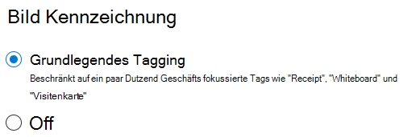

# Bild-Tagging in SharePoint SyntexImage tagging in SharePoint Syntex

Mit Bild-Tagging in SharePoint Syntex können Benutzer Bilder über die Suche finden, indem Sie nach Bild-Tags suchen und Workflows basierend auf Bild-Tags erstellen.With image tagging in SharePoint Syntex, users can find images through search by searching on image tags, and create workflows based on image tags. Standardmäßig ist Bild-Tagging für Microsoft Office SharePoint Online und OneDrive aktiviert.By default, basic image tagging is turned on for SharePoint and OneDrive. Bilder, die an einen der beiden Standorte hochgeladen werden, werden automatisch gescannt und, falls verfügbar, werden anwendbare Tags aus einer Liste von 37 Basis-Tags angewendet.Images uploaded to either location are automatically scanned and applicable tags are applied, if available, from a list of 37 basic tags. Benutzer können Bilder über die Suche finden, indem Sie Bild-Tags durchsuchen.Users can find images through search by searching on the image tags.

Wenn ein Benutzer ein Bild hochlädt, läuft der Tagging-Prozess automatisch ab.When a user uploads an image, the  tagging process runs automatically. Wenn ein Bild bearbeitet wird, läuft der Tagging-Prozess erneut ab, um die Tags zu aktualisieren.If an image is edited, the tagging process runs again to update the tags.

Benutzer mit Berechtigungen für die Bilddatei können die Tags im Dateiinformationsfenster oder auf der Suchergebnisseite sehen und bearbeiten.Users with permissions to the image file can see and edit the tags in the file information panel or in the search results page. Sobald ein Benutzer die Tags eines Bildes bearbeitet, führt das System keine automatische Markierung mehr für dieses Bild durch, selbst wenn es bearbeitet ist.Once a user edits an image's tags, the system no longer auto-tags that image, even if it's edited.

Wenn Sie den Tagging-Prozess ausschalten, werden Bilder nicht mehr automatisch mit Tags versehen.If you turn tagging off, images will no longer be automatically tagged. Vorhandene Tags werden nicht entfernt.Existing tags won't be removed.

> [!NOTE]
> Vom System generierte Tags können sich durch Updates des Bilds oder unserer Tag-Technologie ändern.System generated tags may change with updates to the image or our tag technology.

## Bild-Tagging konfigurierenConfigure image tagging

Nachdem Sie [SharePoint Syntex eingerichtet haben](set-up-content-understanding.md), können Sie Bild-Tagging im Microsoft 365 Admin Center konfigurieren.After you [set up SharePoint Syntex](set-up-content-understanding.md), you can configure image tagging in the Microsoft 365 admin center.  

So schalten Sie die Bild-Tagging-Funktion ein oder ausTo turn image tagging on or off

1. Klicken Sie im Microsoft 365 Admin Center auf **Setup**.In the Microsoft 365 admin center, click **Setup**.

2. Klicken Sie unter **Organisationswissen** auf **Inhaltsverständnis automatisieren**.Under **Organizational knowledge**, click **Automate content understanding**.

3. Klicken Sie auf **Verwalten**.Click **Manage**.

4. Klicken Sie auf der Registerkarte **Bild-Tagging** auf **Bearbeiten**.On the **Image tagging** tab, click **Edit**.

5. Wählen Sie, ob Sie **Basic Tagging** zulassen oder Markieren **ausschalten** möchten.Choose to allow **Basic tagging** or turn tagging **Off**.

6. Klicken Sie auf **Speichern**.Click **Save**.

    
