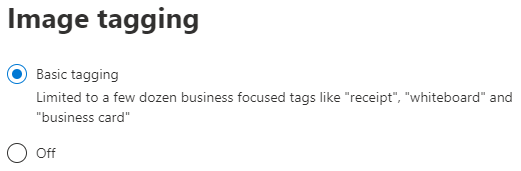

# Bild-Tagging in SharePoint SyntexImage tagging in SharePoint Syntex

Standardmäßig ist Bild-Tagging für Microsoft Office SharePoint Online und OneDrive aktiviert.By default, basic image tagging is turned on for SharePoint and OneDrive. Bilder, die an einen der beiden Standorte hochgeladen werden, werden automatisch gescannt und, falls verfügbar, werden anwendbare Tags aus einer Liste von 37 Basis-Tags angewendet.Images uploaded to either location are automatically scanned and applicable tags are applied, if available, from a list of 37 basic tags. Benutzer können Bilder über die Suche finden, indem Sie Bild-Tags durchsuchen.Users can find images through search by searching on the image tags.

Wenn ein Benutzer ein Bild hochlädt, läuft der Tagging-Prozess automatisch ab.When a user uploads an image, the  tagging process runs automatically. Wenn ein Bild bearbeitet wird, läuft der Tagging-Prozess erneut ab, um die Tags zu aktualisieren.If an image is edited, the tagging process runs again to update the tags.

Benutzer mit Berechtigungen für die Bilddatei können die Tags im Dateiinformationsfenster oder auf der Suchergebnisseite sehen und bearbeiten.Users with permissions to the image file can see and edit the tags in the file information panel or in the search results page. Sobald ein Benutzer die Tags eines Bildes bearbeitet, führt das System keine automatische Markierung mehr für dieses Bild durch, selbst wenn es bearbeitet wird.Once a user edits an image's tags, the system no longer performs auto-tagging on that image, even if it is edited.

Wenn Sie Markieren ausschalten, werden Bilder nicht mehr automatisch mit Tags versehen.If you turn tagging off, images will no longer be automatically tagged. Vorhandene Tags werden nicht entfernt.Existing tags will not be removed.

## Bild-Tagging konfigurierenConfigure image tagging

Sie können Bild-Tagging im Microsoft 365 Admin Center konfigurieren.You can configure image tagging in the Microsoft 365 admin center.  

So schalten Sie die Bild-Tagging-Funktion ein oder ausTo turn image tagging on or off

1. Klicken Sie im Microsoft 365 Admin Center auf **Setup**.In the Microsoft 365 admin center, click **Setup**.

2. Klicken Sie unter **Organisationswissen** auf **Inhaltsverständnis automatisieren**.Under **Organizational knowledge**, click **Automate content understanding**.

3. Klicken Sie auf **Verwalten**.Click **Manage**.

4. Klicken Sie auf der Registerkarte **Bild-Tagging** auf **Bearbeiten**.On the **Image tagging** tab, click **Edit**.

5. Wählen Sie, ob Sie **Basic Tagging** zulassen oder Markieren **ausschalten** möchten.Choose to allow **Basic tagging** or turn tagging **Off**.

6. Klicken Sie auf **Speichern**.Click **Save**.

    

## Mehr dazuSee also

[Inhaltsverständnis einrichtenSet up content understanding](set-up-content-understanding.md)