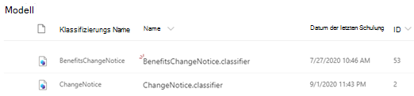

# Informationen zum Dokument verstehen von Modellen mithilfe eines Beispielmodells

Microsoft SharePoint Syntex stellt Ihnen ein Beispielmodell zur Verfügung, mit dem Sie ein besseres Verständnis der Erstellung eigener Modelle erhalten. Das Beispielmodell ermöglicht es Ihnen auch, Modellkomponenten zu untersuchen, beispielsweise seine Klassifizierung, Extraktoren und Erläuterungen. Sie können auch die Beispieldateien verwenden, um das Modell zu trainieren.

## Importieren des Beispielmodells

Um auf das Beispielmodell zugreifen zu können, müssen Sie das Modell zunächst in das inhaltscenter importieren.

1. Wählen Sie im inhaltscenter **Modelle** aus, um Ihre Modellliste anzuzeigen. 
2. Wählen Sie auf der Seite **Modelle** die Option **Beispielmodell importieren**aus. 

      

3. Suchen Sie nach dem Beispielmodell mit dem Titel *BenefitsChangeNotice. Klassifizierung* , das in der Liste Modelle angezeigt wird. 

      

4. Wählen Sie die *BenefitsChangeNotice. Klassifizierung*aus, um die Startseite des Modells zu öffnen. 
  
     

5. Untersuchen Sie das Modell auf der Modell Startseite genauer, um zu sehen, wie es erstellt wurde.
 
- Zeigen Sie die Beispieldateien an, die zum Trainieren des Modells verwendet wurden.
- Untersuchen Sie die Entitäts Extraktionen des Modells näher, um zu sehen, wie das Beispielmodell die Erläuterungen konfiguriert hat.

     

## Siehe auch
[Erstellen einer Klassifizierung](create-a-classifier.md) 
[Erstellen eines Extraktions Moduls](create-an-extractor.md) 
[Dokument Verständnis Übersicht](document-understanding-overview.md) 
[Erstellen eines Formular Verarbeitungsmodells](create-a-form-processing-model.md)  
