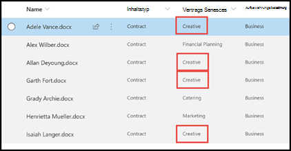

# Terminologiespeicher-Taxonomie beim Erstellen eines Extraktors nutzenLeverage term store taxonomy when creating an extractor

 

> [!VIDEO https://www.microsoft.com/videoplayer/embed/RE4CSoL]

 

Wenn Sie einen Extraktor in Ihrem Dokument Understanding Model in SharePoint Syntex erstellen, können Sie die Terminologiespeicher-Taxonomie für [verwaltete](https://docs.microsoft.com/sharepoint/managed-metadata#terms) Metadatendienst nutzen, um bevorzugte Ausdrücke für extrahierte Daten anzuzeigen.When you create an extractor in your document understanding model in SharePoint Syntex, you can take advantage of [Managed Metadata services](https://docs.microsoft.com/sharepoint/managed-metadata#terms) term store taxonomy to display preferred terms for data that you extract.  

Beispielsweise identifiziert und klassifiziert Ihr Modell alle **Vertrags** Dokumente, die in die Dokumentbibliothek hochgeladen werden.As an example, your model identifies and classifies all **Contract** documents that are uploaded to the document library.  Darüber hinaus extrahiert das Modell auch einen **Vertrags Dienst** Wert aus jedem Vertrag und zeigt ihn in einer Spalte in der Bibliotheksansicht an.Additionally, the model also extracts a **Contract Service** value from each contract, and will display it in a column in your library view. Unter den verschiedenen Contract Services-Werten in den Verträgen gibt es mehrere ältere Werte, die Ihr Unternehmen nicht mehr verwendet und umbenannt wurde.Among the various Contract Services values in the contracts, there are several older values that your company no longer uses and have been renamed. Beispielsweise sollten alle Verweise auf die Begriffe *Design*, *Grafiken*oder *Topographie* -Vertrags Dienste nun als *Creative*bezeichnet werden.For example, all references to the terms *Design*, *Graphics*, or *Topography* contract services should now be called *Creative*. Wenn Ihr Modell einen der veralteten Begriffe aus einem Vertragsdokument extrahiert, soll der aktuelle Ausdruck-Creative in ihrer Bibliotheksansicht angezeigt werden.Whenever your model extracts one of the outdated terms from a contract document, you want it to display the current term - Creative - in your library view. Im folgenden Beispiel sehen wir beim Training des Modells, dass ein Beispieldokument den veralteten Ausdruck von *Design*enthält.In the example below, while training the model we see that one sample document contains the outdated term of *Design*.

    

## Synonyme für AusdruckssätzeTerm set synonyms 

Ausdruckssätze werden im SharePoint Admin Center im Terminologiespeicher für verwaltete Metadatendienst konfiguriert.Term sets are configured in the Managed Metadata services term store in the SharePoint admin center. Im folgenden Beispiel ist der [Ausdruckssätze](https://docs.microsoft.com/sharepoint/managed-metadata#term-set) *Contract Services* so konfiguriert, dass er eine Reihe von Begriffen enthält, einschließlich *Creative*.In the the example below, the *Contract Services* [term set](https://docs.microsoft.com/sharepoint/managed-metadata#term-set) is configured to include a number of terms, including *Creative*.  Die Details dafür zeigen, dass der Ausdruck drei Synonyme enthält (*Design*, *Grafiken*und *Topographie*), und die Synonyme sollten in *Creative*übersetzt werden.The details for it show that the term has three synonyms (*Design*, *Graphics*, and *Topography*) and the synonyms should be translated to *Creative*.

    

<Mike, hier bin ich unsicher, wie ich dies beschreiben kann.<Mike, here is where I am unsure about how to describe this.  Welche Aktion weist das Modell darauf hin, dass beim Erstellen eines Extraktors zum Extrahieren und Anzeigen einer Vertrags Dienst Spalte die Spalte "markiert" ist, um den Ausdruckssätze für verwaltete Metadaten für Creative Services zu verwenden? >What action tells the model that when I create an extractor to extract and display a Contract Services column, how is that column "marked" to use the managed metadata term set for Creative Services?>

## Konfigurieren der Website Spalte für die Dokumentbibliothek für ein verwaltetes MetadatenfeldConfigure your document library site column for a managed metadata field

    

## Siehe auchSee Also
[Einführung in verwaltete MetadatenIntroduction to Managed Metadata](https://docs.microsoft.com/sharepoint/managed-metadata#terms) 
[Erstellen eines Extraktions ModulsCreate an extractor](create-an-extractor.md) 
[Erstellen einer Spalte mit verwalteten MetadatenCreate a managed metadata column](https://support.microsoft.com/office/create-a-managed-metadata-column-8fad9e35-a618-4400-b3c7-46f02785d27f?redirectSourcePath=%252farticle%252fc2a06717-8105-4aea-890d-3082853ab7b7&ui=en-US&rs=en-US&ad=US) 

