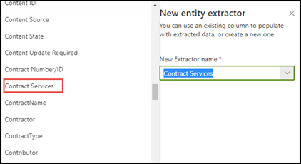

# Nutzung der Terminologiespeichertaxonomie beim Erstellen eines ExtraktorsLeverage term store taxonomy when creating an extractor

 

> [!VIDEO https://www.microsoft.com/videoplayer/embed/RE4GpJJ]  

 

Wenn Sie in SharePoint Syntex einen Extraktor in Ihrem Dokumentverständnismodell erstellen, können Sie die Taxonomie des Terminologiespeichers der [Verwalteten Metadatendienste](https://docs.microsoft.com/sharepoint/managed-metadata#terms) nutzen, um bevorzugte Begriffe für die von Ihnen extrahierten Daten anzuzeigen.When you create an extractor in your document understanding model in SharePoint Syntex, you can take advantage of [Managed Metadata services](https://docs.microsoft.com/sharepoint/managed-metadata#terms) term store taxonomy to display preferred terms for data that you extract.  

Ihr Modell identifiziert und klassifiziert beispielsweise alle **Vertrags**dokumente, die in die Dokumentbibliothek hochgeladen werden.As an example, your model identifies and classifies all **Contract** documents that are uploaded to the document library.  Darüber hinaus extrahiert das Modell aus jedem Vertrag einen **Vertragsdienst**wert und zeigt ihn in einer Spalte in Ihrer Bibliotheksansicht an.Additionally, the model also extracts a **Contract Service** value from each contract, and will display it in a column in your library view. Unter den verschiedenen Vertragsdienst-Werten in den Verträgen gibt es mehrere ältere Werte, die Ihr Unternehmen nicht mehr verwendet und die umbenannt wurden.Among the various Contract Services values in the contracts, there are several older values that your company no longer uses and have been renamed. So sollten beispielsweise alle Bezüge auf die Begriffe *Design*, *Grafiken*oder *Topographie*-Vertragsdienste als *Kreativ*bezeichnet werden.For example, all references to the terms *Design*, *Graphics*, or *Topography* contract services should now be called *Creative*. Wenn Ihr Modell einen der veralteten Begriffe aus einem Vertragsdokument extrahiert, soll der aktuelle Ausdruck – Kreativ – in Ihrer Bibliotheksansicht angezeigt werden.Whenever your model extracts one of the outdated terms from a contract document, you want it to display the current term - Creative - in your library view. Im folgenden Beispiel sehen wir beim Trainieren des Modells, dass ein Beispieldokument den veralteten Begriff *Design* enthält.In the example below, while training the model we see that one sample document contains the outdated term of *Design*.

    

## Verwenden Sie eine Spalte für verwaltete Metadaten in Ihrem ExtraktorUse a Managed metadata column in your extractor

Ausdruckssätze werden im Terminologiespeicher für verwaltete Metadatendienste im SharePoint Online Admin Center konfiguriert.Term sets are configured in the Managed Metadata services term store in the SharePoint admin center. Im folgenden Beispiel ist der [Ausdruckssatz](https://docs.microsoft.com/sharepoint/managed-metadata#term-set) für *Vertragsdienste* so konfiguriert, dass er eine Reihe von Begriffen enthält, einschließlich *Kreativ*.In the the example below, the *Contract Services* [term set](https://docs.microsoft.com/sharepoint/managed-metadata#term-set) is configured to include a number of terms, including *Creative*.  Die Details dafür zeigen, dass der Begriff drei Synonyme (*Design*, *Grafiken*und *Topographie*) aufweist, und die Synonyme sollten in *Kreativ* übersetzt werden.The details for it show that the term has three synonyms (*Design*, *Graphics*, and *Topography*) and the synonyms should be translated to *Creative*. 

    

Es kann mehrere Gründe geben, warum Sie möglicherweise ein Synonym in Ihrem Ausdruckssatz verwenden möchten.There could be a number of reasons why you might want to use a synonym in your term set. Beispielsweise kann es veraltete Ausdrücke, umbenannte Ausdrücke oder Abweichungen zwischen den Abteilungen Ihres Unternehmens bei der Benennung geben.For example, there could be outdated terms, renamed terms, or variations between your organizations departments on naming.

Damit Sie das Feld für verwaltete Metadaten beim Erstellen Ihres Extraktors in Ihrem Modell auswählen können, müssen Sie es als [Site-Spalte für verwaltete Metadaten hinzufügen](https://support.microsoft.com/office/8fad9e35-a618-4400-b3c7-46f02785d27f).To make the managed metadata field available for you to select when you create your extractor in your model, you need to [add it as a managed-metadata site column](https://support.microsoft.com/office/8fad9e35-a618-4400-b3c7-46f02785d27f). Nachdem Sie die Site-Spalte hinzugefügt haben, können Sie diese auswählen, wenn Sie den Extraktor für Ihr Modell erstellen.After you add the site column, it will be available for you to select when you create the extractor for your model.

    

Nach dem Anwenden Ihres Modells auf die Dokumentbibliothek wird beim Hochladen von Dokumenten in die Bibliothek in der Spalte *Kreative Dienste* der bevorzugte Ausdruck (*Kreativ*) angezeigt, wenn der Extraktor einen der Werte des Synonyms ermittelt (*Design*, *Grafik* und *Topographie*).After applying your model to the document library, when documents are uploaded to library, the *Creative Services* column will display the preferred term (*Creative*) when the extractor finds any of the synonym values (*Design*, *Graphics*, and *Topography*).

    

## Siehe auchSee Also
[Einführung in Verwaltete MetadatenIntroduction to Managed Metadata](https://docs.microsoft.com/sharepoint/managed-metadata#terms)

[Erstellen eines ExtraktorsCreate an extractor](create-an-extractor.md)

[Erstellen einer verwalteten MetadatenspalteCreate a managed metadata column](https://support.microsoft.com/office/create-a-managed-metadata-column-8fad9e35-a618-4400-b3c7-46f02785d27f?redirectSourcePath=%252farticle%252fc2a06717-8105-4aea-890d-3082853ab7b7&ui=en-US&rs=en-US&ad=US)

