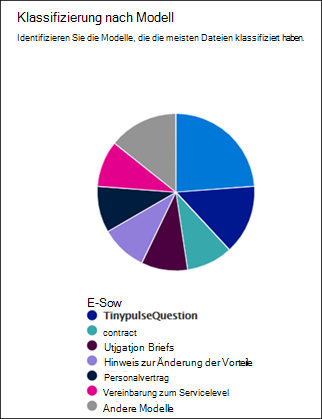
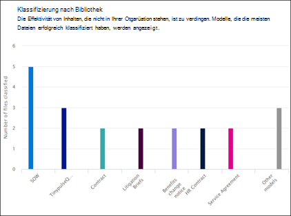
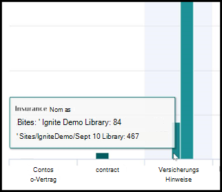

# Verwendungsanalysen von Dokumentverständnismodellen

Im Microsoft SharePoint Syntex-Inhaltscenter finden Sie Modellverwendungsanalysen, um weitere Informationen zur Verwendung von Modellen bereitzustellen, die aus dem Inhaltscenter veröffentlicht wurden. Dies umfasst eine Rollup der folgenden Informationen:

- Wo Ihre Modelle angewendet werden
- Wie viele Dateien werden im Zeitverlauf verarbeitet?

   

## Prozentsatz des Gesamtmodells

     

Das **Gesamtmodell des prozentualen** Kreisdiagramms zeigt jedes veröffentlichte Modell als Prozentsatz der Gesamtzahl der Dateien an, die von allen veröffentlichten Modellen im Inhaltscenter verarbeitet wurden.

Außerdem zeigt jedes Modell die **Vollständigkeitsrate** an, der Prozentsatz der hochgeladenen Dateien, die vom Modell erfolgreich analysiert wurden. Eine niedrige Vollständigkeitsrate kann bedeuten, dass es Probleme mit dem Modell oder den zu analysierenden Dateien gibt.

## Im Verlauf der Zeit verarbeitete Dateien

     

Das Datei-Balkendiagramm für ** Dateien, die im Verlauf der Zeit verarbeitet wurden**, zeigt nicht nur die Anzahl der Dateien an, die über einen Zeitraum für jedes Modell verarbeitet wurden, sondern auch die Dokumentbibliotheken, auf die das Modell angewendet wurde.

     

## Siehe auch
[Erstellen einer Klassifizierung](create-a-classifier.md)

[Erstellen eines Extraktors](create-an-extractor.md)

[Übersicht über das Dokumentenverständnis](document-understanding-overview.md)

[Erstellen eines Formularverarbeitungsmodells](create-a-form-processing-model.md)  
