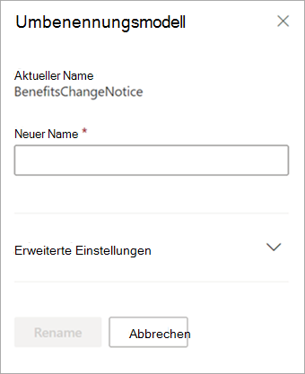

# Umbenennen eines Modells in Microsoft SharePoint SyntexRename a model in Microsoft SharePoint Syntex

An einem bestimmten Punkt möchten Sie möglicherweise ein Dokumentverständnismodell umbenennen.At some point, you might want to rename a document understanding model. Ein häufiges Beispiel besteht darin, dass Sie sich beim Erstellen eines ersten Entwurfs eines Modells möglicherweise noch keine großen Gedanken über seinen Namen gemacht haben. So haben Sie es beispielsweise „AlexWilburModel1“ genannt.A common example is when you create an initial draft of a model, you might not have given a lot of thought as to the final name (for example, you might have named it “AlexWilburModel1”). Wenn Sie sich dem Abschluss des Modells und seiner praktischen Anwendung nähern, stellen Sie jedoch vielleicht fest, dass ein korrekterer Name wie "Vertragsverlängerungen" passender wäre, und Sie das Modell umbenennen möchten.As you come closer to finalizing the model and putting it to use, you realize that a more proper name would be “Contract Renewals,” and you want to rename it.  

Ein weiteres Beispiel wäre eine Entscheidung Ihrer Organisation, für einen Prozess- oder Dokumenttyp zukünftig einen anderen Namen zu verwenden.Another example is when your organization makes a decision to refer to a process or document type by a different name. Nachdem Sie beispielsweise Ihr Modell erstellt haben und es zum Einsatz bringen möchten, hat Ihre Organisation vielleicht verfügt, dass alle „Verträge“ zukünftig formal als „Vereinbarungen“ bezeichnet werden sollen.For example, after you create your model and are ready to apply it, your organization might mandate that all “Contracts” will now formally be referred to as “Agreements.” Bei Bedarf können Sie nun Ihr Modell von „Vertragsverlängerungen“ in „Vereinbarungsverlängerungen“ umbenennen.If needed, you can choose to rename your model from “Contract Renewals” to “Agreement Renewals.”

> [!IMPORTANT]
> Sie können ein Dokumentverständnismodell nur umbenennen, wenn es nicht auf eine Dokumentbibliothek angewendet wurde.You can only rename a document understanding model if it has not been applied to a document library. 

Durch das Umbenennen eines Modells wird auch der [Inhaltstyp umbenannt](/sharepoint/governance/content-type-and-workflow-planning#content-type-overview), der dem Modell zugeordnet ist.Renaming a model also renames the [content type](/sharepoint/governance/content-type-and-workflow-planning#content-type-overview) that is associated with the model.

## Ein Modell umbenennenRename a model

Führen Sie die folgenden Schritte aus, um ein Dokumentverständnismodell umzubenennen.Follow these steps to rename a document understanding model.

1. Wählen Sie im Inhaltscenter **Modelle** aus, um die Liste ihrer Modelle anzuzeigen.From the content center, select **Models** to see your models list.

2. Wählen Sie auf der Seite **Modelle** das Modell aus, das Sie umbenennen möchten.On the **Models** page, select the model you want to rename.

3. Wählen Sie entweder über das Menüband oder über die Schaltfläche **Aktionen anzeigen** (neben dem Modellnamen) die Option **Umbenennen** aus.By using either the ribbon or the **Show actions** button (next to the model name), select **Rename**.  

      

4. Nehmen Sie im Bereich **Modell umbenennen** folgende Änderungen vor:On the **Rename model** panel:

   a.a. Geben Sie unter **Neuer Name** den neuen Namen des Modells ein, das Sie umbenennen möchten.Under **New name**, enter the new name of the model that you want to rename. 

      

   b.b. (Optional) Wählen Sie unter **Erweiterte Einstellungen**, ob Sie einen vorhandenen [Inhaltstyp](/sharepoint/governance/content-type-and-workflow-planning#content-type-overview) zuordnen möchten.(Optional) Under **Advanced settings**, select whether you want to associate an existing [content type](/sharepoint/governance/content-type-and-workflow-planning#content-type-overview). Wenn Sie **Vorhandenen Inhaltstyp verwenden** auswählen, wird das Modell so umbenannt, dass es mit dem ausgewählten Inhaltstyp übereinstimmt.If you choose **Use an existing content type**, the model will be renamed to match the selected content type.

5. Wählen Sie **Umbenennen** aus.Select **Rename**.

## Siehe auchSee Also
[Erstellen einer KlassifizierungCreate a classifier](create-a-classifier.md)

[Erstellen eines ExtraktorsCreate an extractor](create-an-extractor.md)

[Umbenennen eines ExtraktorsRename an extractor](rename-an-extractor.md)

[Übersicht über das DokumentenverständnisDocument Understanding overview](document-understanding-overview.md)

[BeschreibungstypenExplanation types](explanation-types-overview.md)

[Anwenden eines ModellsApply a model](apply-a-model.md) 
